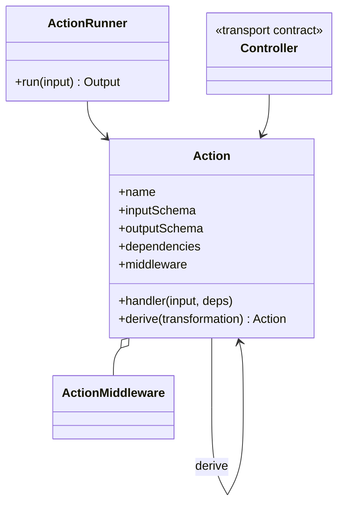
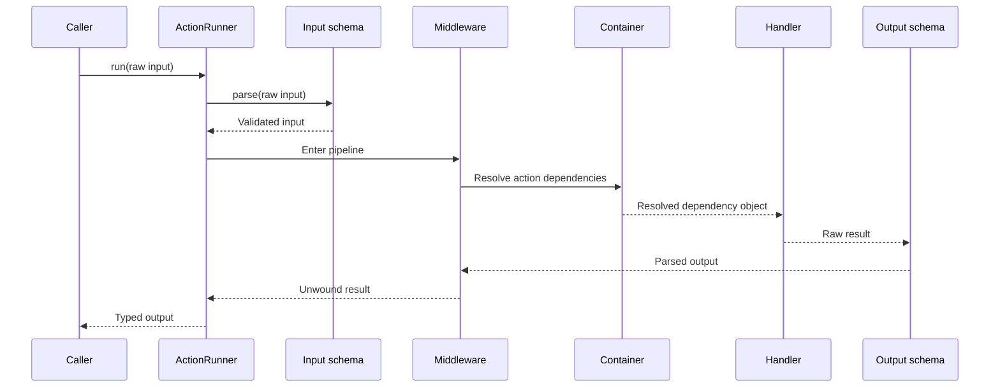
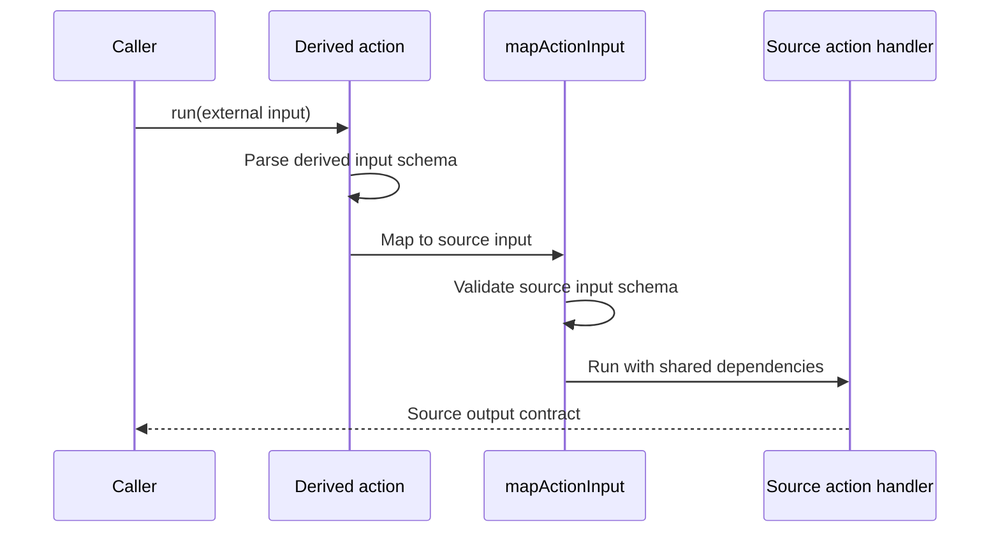

# Actions

[Documentation](../README.md) · [Implementation index](./README.md) · [Usage guide](../usage/actions.md)

Actions define typed business operations independently from their transports. The action contract does not distinguish side-effect-free reads from operations that produce side effects: both are declared with `defineAction()` and share the same schemas, dependencies, middleware, derivation support and controller bindings.

## Concepts and model

An `Action` is an immutable definition containing a stable name, Zod input and output contracts, dependencies, middleware and a handler. An `ActionRunner` binds that definition to one execution scope and exposes `run()`. Derived actions wrap a source action with a typed transformation while retaining the original definition unchanged. Controllers belong to transport libraries and refer to actions without becoming part of the action contract.



## Validation modes

Actions use synchronous input and output parsing by default, including when their handler returns a promise. Declare `validation: { input: "async" }`, `{ output: "async" }`, or both only for schemas containing asynchronous refinements or transformations. An omitted boundary remains synchronous. For example:

```ts
const action = defineAction({
  name: "names.normalize",
  input: z.string().transform(normalizeName),
  output: z.string(),
  // normalizeName returns a promise, so input parsing must await it.
  validation: { input: "async" },
  handler: (name) => name,
});
```

`mapActionInput(schema, mapInput, validationMode?)` defaults the replacement input to `"sync"`, preserves the source output policy, and parses the mapped value using the source input policy. A mapped schema containing async logic can select `"async"` as the third argument; the mapper itself may always return a promise. Custom `derive()` callbacks that create a new definition should explicitly carry the validation policy with any copied schemas and adjust it for replaced boundaries.

See [Definition validation](./definitions.md#schema-validation-policy) for controller inheritance, programming errors and application-controlled Zod compilation.


## Usage guide

For application setup and task-oriented examples, see the [Actions usage guide](../usage/actions.md).

## Design and implementation

`defineAction()` preserves schema and dependency types in an inspectable value. `createActionRunner()` parses input before middleware, resolves dependencies inside the active scope, runs middleware around the handler and output validation, and returns the parsed output. This ordering prevents invalid external input from opening transactions or running authorization middleware and ensures middleware can observe output-validation failures.

Derivation composes immutable definition transformations rather than mutating catalogs. Transport mapping remains outside the library, allowing one action to be reused by direct calls and several controllers without importing Fastify, Commander or a queue adapter.

## Execution scenarios

### Action execution



### Derived input mapping



## Public API

| API group | Main exports |
| --- | --- |
| Definitions and execution | `defineAction()`, `Action`, `ActionOptions`, `createActionRunner()`, `ActionRunner` |
| Middleware | `defineActionMiddleware()` and action middleware context and target types |
| Derivation | `mapActionInput()` and `Action.derive()` |
| Model helpers | `defineModelCreateAction()`, `defineModelGetAction()`, `defineModelGetManyAction()`, `defineModelListAction()`, `defineModelLookupAction()`, `defineModelUpdateAction()`, `defineModelDeleteAction()` and their repository contracts |
| Collection and pagination contracts | `collectionFilterOperatorSchema`, `createCollectionQueryInputSchema()`, numbered pagination helpers, cursor codec/schema factories and `mapCursorPaginationInput()` |


For example, an application read is an ordinary Action:

```ts
export const getUserAction = defineAction({
  name: "user.get",
  input: z.object({ id: z.uuid() }),
  output: userOutputSchema.nullable(),
  dependencies: {
    userRepository: UserRepository,
  },
  handler: ({ id }, { userRepository }) => userRepository.findById(id),
});
```

Application code may still describe a read as a query in domain-specific terminology, but that meaning is not part of the Kestrel Action type. Every operation can be gathered in the same domain catalog.

## Definition files

Named catalog files such as `userCatalog.ts` gather the possible operations and controllers in a scope. The catalog is the public aggregate used by other scopes, while temporary action and controller objects used to assemble it remain private.
Simple operations can be defined directly in the catalog file. For example, conventional CRUD definitions can stay there when Kestrel helpers keep them to a few lines; more substantial behavior goes in a dedicated file.

The application gathers these module catalogs by domain in `src/server/core/app_catalog.ts`. Its flat action list is derived recursively from that hierarchy for consumers such as Studio, without runtime file discovery.

Along an Action may be defined one or more bindings that provide access to the operation through external interfaces — for example an HTTP call or CLI command.

An Action file could include:
- A function implementing the operation itself
- The input and output types of the operation, for complex types
- Mapping with controllers, like HTTP call, CLI command or async worker
- Validation into typing for controller inputs
- If needed, mapping from controller to action input and output values, or even dedicated handler for more complex controllers
- A declaration to define and export all this as an Action

The implementation function declared as an Action is the minimum mandatory content for this kind of file.
This may sound like a definition file would be bloated easily, but with accurate definition functions it can actually be quite simple.

A controller is an adapter that exposes an action through an external interface such as HTTP, CLI, worker, or admin UI. Controllers do not contain business logic. They parse and validate interface-specific input, map it to action input, run the action, then map the action result or error to an interface-specific response.

Both input and output would be strongly typed with a validator, this way the contract can be documented and tested more easily.

This declarative way of implementing business logic helps with automatic documentation, AI accuracy and efficiency, code generation (e.g. a client library for an HTTP API), and scalable infrastructure setup (e.g. for workers).
Also the gathering of actions and their controllers aim to respect the locality of behaviour, while keeping separate definitions to respect separation of concerns.

## Derived actions

Every action exposes `derive()`, which applies a typed transformation and returns a new immutable action. The source action remains unchanged, and the derived action can itself be derived again.

`mapActionInput()` creates a common input transformation. It replaces the exposed input schema, maps the parsed value to the source input, validates that mapped value with the source schema, and then calls the source handler with the same dependencies:

```ts
const renamedInputAction = action.derive(
  mapActionInput(
    z.object({ externalValue: z.string() }),
    ({ externalValue }) => ({
      internalValue: externalValue,
    }),
  ),
);
```

The mapping is checked against the source schema input type. The derived action preserves the source name, description, output schema and dependency declarations unless another derivation explicitly changes them.

## Dependency injection

The action may declare dependencies needed for execution. For example:

```ts
export const createUserAction = defineAction({
  name: "user.create",
  input: createUserInput.schema,
  output: createUserOutput,
  dependencies: {
    userRepository: UserRepository,
  },
  handler: async (input, deps) => {
    return deps.userRepository.create(input, {
      returning: true,
    });
  },
});
```

The dependencies part is injected using DI when running the action through its application, for example like this:

```ts
const user = await app.get(userCatalog.actions.create).run(userPayload);
```

A dedicated document on DI will explain this deeper.

## Middleware

Actions declare reusable infrastructure behavior through `middleware`. Each middleware surrounds the action handler and output validation, has its own scoped dependencies, and must preserve the action's successful output type. Transactions, authorization, auditing and similar cross-cutting behavior can therefore remain outside the action library. See [Middleware](./middleware.md).

```ts
export const createUserAction = defineAction({
  name: "user.create",
  input: createUserInputSchema,
  output: userOutputSchema,
  middleware: [databaseTransaction],
  dependencies: {
    userRepository: UserRepository,
  },
  handler: (input, { userRepository }) => userRepository.create(input),
});
```

## Specifications

The action file can include a comment that explains what the action does, which can be extended to explain how it behaves in particular use cases. The goal is to have a reference that can be used by AI agents to drive generated unit tests.

## Controllers


An action controller inherits its input and description from the action, does automatic mapping and binding when possible, and calls the action with an adapted input. Standalone controller input defaults to an empty object schema. All controllers can declare their own optional output schema; when present, it validates and transforms the transport result.

### HTTP controllers

HTTP controllers define Fastify routes either directly with `defineHttpController()` or from actions with `defineActionHttpController()`.

An HTTP controller can be as simple as the following:

```ts
// With the following input used in banUserAction
const banUserInput = z.object({ userId: z.string(), reason: z.string() });

// :userId is automatically bound to input's userId; because this is a POST
// route, other parameters such as reason are bound to the request body.
export const banUserHttpController = defineActionHttpController(banUserAction, post("/user/:userId/ban"), adminHttpAccess);
```

Here is an example of a more complex controller, showing more options:

```ts
export const banUserHttpControllerExtended = defineActionHttpController(
  banUserAction,
  post("/user/:id/ban"), // routing configuration
  adminHttpAccess,
  {
    // controller configuration
    input: banUserInput.variants.byId,
    bindings: {
      // For this POST route, non-path fields default to the request body.
      userId: path("id"),
    },
    // Tooling such as Studio can reuse complete logical controller inputs and
    // split them into path, query and body values from the bindings above.
    examples: [{
      name: "Temporary ban",
      input: {
        userId: "00000000-0000-4000-8000-000000000001",
        reason: "Repeated abuse",
      },
    }],
    dependencies: {}, // Controller-specific DI.
    handler: ({ action, input, deps, request, reply }) => {
      return action.run(input);
    },
    fastify: {
      // Fastify routing configuration
      // this field type would be something like Omit<FastifyRouteOptions, "method" | "url" | "schema" | "handler">
    }
  },
);
```

Input fields matching route parameters are bound to the path automatically. Remaining fields default to query-string properties for GET routes and body properties for POST and DELETE routes. `path()`, `query()` and `body()` allow explicit mappings. The optional `examples` collection attaches named, complete logical inputs without changing request handling; documentation and development tools can use them to prepare requests. POST controllers return `201` by default, while GET and DELETE controllers return `200`. Invalid controller input returns `400`, and a `null` result returns `404`.

The current implementation is detailed in [HTTP](./http.md).

### CLI controllers

CLI controllers define commands either directly with `defineCliController()` or from actions with `defineActionCliController()`.

The current implementation is detailed in [CLI](./cli.md).

```ts
// With the following input used in banUserAction
const banUserInput = z.object({ userId: z.string(), reason: z.string() });

// The command can be called like this: <base command> user ban --userId=1 --reason="some reason"
export const banUserCliController = defineActionCliController(banUserAction, "user ban");
```

Here is an example of a more complex controller, showing more options:

```ts
export const banUserCliControllerExtended = defineActionCliController(banUserAction, "user ban", {
  input: banUserInput.variants.byId,
  bindings: {
    // by default everything is mapped to -- options
    userId: param(0), // param() may indicate params order
  },
  handler: ({ action, input }) => {
    return action.run(input);
  },
});
```

Fields map to `--<field>` options by default. Controller input is validated and converted by its Zod schema before the action runs. Positional bindings use a zero-based `param(index)`.

## Example file

Here's what an action file could look like:

```ts
/**
 * Bans a user with given reason.
 * 
 * Use cases:
 * - If the user doesn't exist, a NotFoundException is thrown
 */

// SIGNATURE
// ---------
export const banUserInput = defineInputVariants(
  z.object({
    reason: z.string(),
    duration: z.number().optional().describe("Ban duration in seconds. Permanent by default."),
  }),
  userInputVariants,
);
export const banUserOutput = z.boolean().describe("Tells wether the operation was successful.");

// ACTION
// ------
export const banUserAction = defineAction({
  name: "user.ban",
  input: banUserInput.schema,
  output: banUserOutput,
  dependencies: {
    userRepository: UserRepository,
    userMapper: dep<UserResolver>("map.user")
  },
  handler: async (input, deps) => {
    const user = await deps.userMapper.get(input);
    await deps.userRepository.update(user, {
      status: "banned",
      reason: input.reason,
      duration: input.duration,
    });

    return true;
  },
});

// CONTROLLERS
// -----------

// HTTP controller, to register in a Fastify route
export const banUserHttpController = defineActionHttpController(banUserAction, post("/user/:userId/ban"), adminHttpAccess, {
  input: banUserInput.variants.byId,
});

// CLI controller
export const banUserCliController = defineActionCliController(banUserAction, "user ban", {
  input: banUserInput.variants.byId,
});
```

With for the context in another file, along with the model entity:

```ts
const userInputVariants = {
  byUser: z.object({ user: z.instanceof(User) }),
  byId: z.object({ userId: z.string() }),
};
```

The `// ACTION` and other section comments are recommended to make the file easier to read.

## Helpers

Helpers would be needed to reduce the boilerplate of this paradigm.

### Input variants

We may need to allow multiple signatures for the same action, for example to support referencing by id or by instance, or bulk action.

For these cases we need a helper to generate input variants 

```ts
const userInputVariants = {
  byUser: z.object({ user: z.instanceof(User) }),
  byId: z.object({ userId: z.string() }),
};

export const banUserInput = defineInputVariants(
  z.object({
    reason: z.string(),
    duration: z.number().optional().describe("Ban duration in seconds. Permanent by default."),
  }),
  userInputVariants,
);
```

This will allow us to use the following Zod schemas:

```ts
banUserInput.variants.schema // All variants gathered in an XOR
banUserInput.variants.byUser
banUserInput.variants.byId
```

### Model action helpers

The catalog file that gathers definitions within a scope may define common actions and controllers directly when they only require a few lines.

Here's an example:

```ts
const getManyUsersInputSchema = z.object({
  ids: z.array(userOutputSchema.shape.id),
});

const userActions = {
  create: defineModelCreateAction("user", UserRepository, createUserInputSchema, userOutputSchema),
  get: defineModelGetAction("user", UserRepository, usersIdKey, getUserInputSchema, userOutputSchema),
  getMany: defineModelGetManyAction("user", UserRepository, getManyUsersInputSchema, userOutputSchema),
  list: defineModelListAction("user", UserRepository, userOutputSchema),
  update: defineModelUpdateAction("user", UserRepository, usersIdKey, updateUserInputSchema, userOutputSchema),
  delete: defineModelDeleteAction("user", UserRepository, usersIdKey, deleteUserInputSchema, userOutputSchema),
};

export const userCatalog = defineCatalog({
  actions: userActions,
});
```

The helpers define conventional `<model>.create`, `<model>.get`, `<model>.getMany`, `<model>.list`, `<model>.update` and `<model>.delete` Action names. Create calls the repository's `create` method. Get, update and delete receive the model's identifier key, read that field from their input and return the repository result, including `null` when the record does not exist. Get-many accepts an `{ ids: [...] }` schema, calls `findManyByIds()` and returns every matching model in deterministic repository order while omitting missing identifiers. Update removes the identifier from the values sent to the repository. List calls the repository's paginated `findAll()` method. The key is conventionally exported next to the Drizzle table and checked against its inferred model:

```ts
export const usersIdKey = "id" satisfies keyof User;
```

The helpers also generate conventional descriptions such as `Create a user.`, `Get a user by id.`, `Get multiple user models by id.`, `Update a user by id.` and `Delete a user by id.`. Bindings inherit these descriptions unless they explicitly override them.

## TODO

- See how some actions may be defined as durable execution workflows
- See how to map the actions available through HTTP calls into a library usable by client
- Detail bulk management: fail mode ("partial" vs "all-or-nothing"), max concurrency items
- Detail delayed action configuration: topic name, worker management…

## Current implementation

Actions are declared with `defineAction({ name, input, output, ...options })`. The name is required, while omitted input and output contracts default to `z.null()`. A definition retains its name, description, Zod contracts, dependencies, middleware and handler so it remains inspectable without being tied to an application instance. Actions can create immutable variants through `derive()` and typed transformations such as `mapActionInput()`, which preserve middleware. Action controllers inherit the action input and description by default and may override them for their interface. Standalone and action controllers may declare an optional transport output contract.

`app.get(action).run(input)` binds a definition to an application. Each run:

- Creates a dependency injection scope.
- Parses the input with the action's Zod schema.
- Runs action middleware in declaration order.
- Resolves the action's declared dependencies.
- Calls the handler.
- Parses the handler result with the output schema.
- Disposes the scope, including when validation or execution fails.

The user scope exposes individually declared create, get, list, update and delete operations through `userCatalog.actions`. Its private assembly objects are not exported. The Zod contracts are derived from the Drizzle `users` table with `drizzle-zod`, then narrowed or refined for each operation. Create returns the persisted user. Get, update and delete return the matching user or `null` when it does not exist. List supports bounded numbered pagination through the shared contracts detailed in [Pagination](./pagination.md).

Delayed actions, input variants and controller bindings remain future work.
