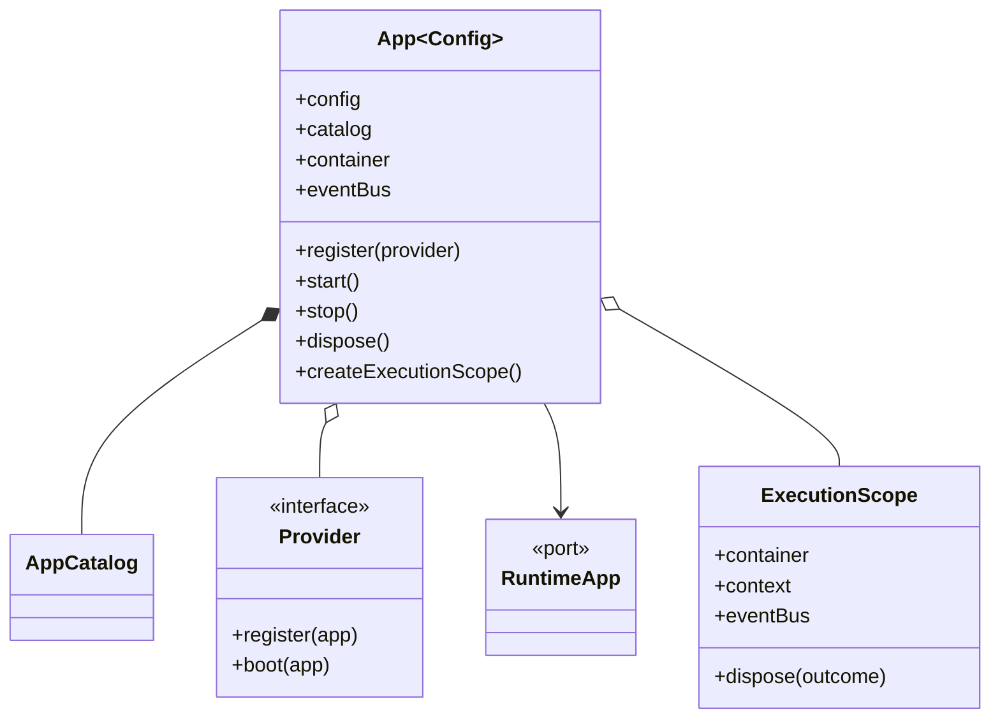
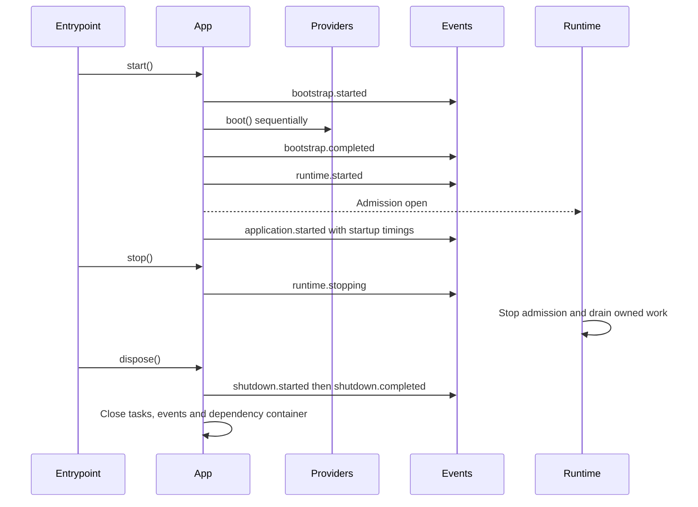

# Application

[Documentation](../README.md) · [Implementation index](./README.md) · [Usage guide](../usage/app.md)

`App` is the complete transport-independent definition of an application. It gathers the resolved configuration, dependency container, root event bus, deferred tasks, action execution scopes, lifecycle and the consolidated catalog for actions, HTTP controllers, CLI controllers, workers, workflows and scheduled tasks. Every execution also owns a structured context that lets actions and services contribute information for integrations without depending on those integrations directly.

Kestrel's `App` class is generic over the application configuration:

```ts
const appCatalog = defineCatalog({
  user: userCatalog,
});
const app = new App(config, { catalog: appCatalog });

app.config.http.port;
app.container.resolve(dep("logger"));
appCatalog.user.actions.create;
app.catalog.httpControllers.definitions;
app.catalog.workers.definitions;
app.catalog.workflows.definitions;
```

Transport state does not change the identity of the application. `HttpRuntime`, `WorkerRuntime` and `ScheduledTaskRuntime` consume the definitions held by the same `App` and own their transport resources, startup and draining. Composition therefore remains complete and cheap even when the selected process will execute only one workload.

## Concepts and model

`App` is the composition root and lifecycle state machine. `AppCatalog` is the runtime index derived from typed declarations. A `Provider` contributes infrastructure during composition and may initialize it during bootstrap. `RuntimeApp` is the narrow lifecycle port given to transport runtimes. Every admitted operation owns an `ExecutionScope` containing scoped dependencies, context, events and deferred tasks.



## Usage guide

For application setup and task-oriented examples, see the [Application usage guide](../usage/app.md).

## Design and implementation

Composition is synchronous and side-effect-light. Registration contributes definitions and lazy dependency factories; bootstrap seals catalogs and providers before invoking provider boot hooks sequentially. Lifecycle events expose stable observable transitions, while state checks enforce admission and make stop and disposal idempotent.

Execution scopes isolate dependencies and asynchronous ownership. The application tracks all open scopes, closes admission before transport draining and waits for owners to dispose their scopes before releasing singleton resources. Phase-specific provider views and the narrow `RuntimeApp` prevent infrastructure integrations from controlling unrelated lifecycle transitions.

## Execution scenarios

### Application startup and shutdown



The execution sub-cycle and lifecycle state table below provide the detailed per-operation and failure paths.

## Public API

| API group | Main exports |
| --- | --- |
| Composition and lifecycle | `App`, `AppOptions`, `AppState`, `AppBootPlan`, `AppRunningMode`, `AppRuntime`, `AppWorkload` |
| Provider contracts | `Provider`, `ProviderCompositionApp`, `ProviderBootApp`, `RuntimeApp` |
| Executions | `ExecutionScope`, `ActionExecution`, `ExecutionContext`, execution context options, entries and diagnostic destination types |
| Catalogs | `defineCatalog()`, `AppCatalog`, catalog declaration and category-selection helpers |
| Lifecycle events | bootstrap, runtime, execution and shutdown event definitions plus `ExecutionOutcome` |
| Observations and diagnostics | execution observation definitions, error/context projection and log-context helpers |

The application library has no infrastructure adapter API. Providers are its composition extension contract: `register()` may add definitions and lazy resources only during composition, while optional `boot()` initializes required infrastructure from the finalized boot plan. Providers must transfer resource disposal to the dependency container or their owning runtime and must not admit executions themselves.

## Catalogs

`defineCatalog()` is an identity helper that preserves the exact TypeScript shape of a recursively composed declaration. A domain exports a subcatalog containing only the optional categories it owns:

```ts
export const userCatalog = defineCatalog({
  actions: userActions,
  controllers: {
    http: userHttpControllers,
    cli: userCliControllers,
  },
  workers: userWorkers,
  workflows: userWorkflows,
});
```

Categories with no definitions are omitted. Subcatalogs compose without discovery or repeated global registration:

```ts
export const appCatalog = defineCatalog({
  debate: debateCatalog,
  user: userCatalog,
});

appCatalog.user.actions.create;
```

The exported declaration remains the statically typed navigation surface used by application code. `AppCatalog` recursively derives homogeneous runtime indexes at `app.catalog.actions`, `app.catalog.httpControllers`, `app.catalog.cliControllers`, `app.catalog.workers`, `app.catalog.workflows` and `app.catalog.scheduledTasks`. Each registration retains its declaration path and source. Tools needing a typed homogeneous tree can derive one with `selectActionCatalog()`, `selectHttpControllerCatalog()`, `selectCliControllerCatalog()`, `selectWorkerCatalog()`, `selectWorkflowCatalog()` or `selectScheduledTaskCatalog()` without maintaining a second source of truth.

Providers may call `app.catalog.contribute()` to add a subcatalog with provider provenance. These contributions are runtime-typed by definition category rather than added to the structural type of the original declaration. Contributions and provider registration are accepted only during `composing`; bootstrap seals both boundaries. Duplicate action names, CLI commands, worker queues, workflow names and scheduled-task ids are rejected, as are duplicate or colliding category paths.

## Configuration

Configuration sources are resolved before the `App` is created. The resulting typed object is exposed through `app.config` and is also available to the dependency container.

Application code passes each library provider its dedicated resolved configuration. Library providers do not depend on the shape of the complete application configuration, read environment variables, or mutate configuration at runtime. Application-only services may still use `app.config` through normal dependency declarations when their behavior genuinely spans several application concerns.

## Providers

A provider receives an application view dedicated to each lifecycle phase rather than the complete `App`. `ProviderCompositionApp` exposes composition resources such as the container, catalogs, event bus and deferred HTTP extensions. `ProviderBootApp` exposes only the finalized boot plan and container. This prevents ordinary providers from starting, stopping, disposing or executing application work from their hooks.

```ts
export class LoggerProvider<Config> implements Provider<Config> {
  constructor(protected readonly config: LoggerConfig) {}

  register(app: ProviderCompositionApp<Config>): void {
    app.container.registerFactory(
      "loggerResource",
      () => createLogger({ level: this.config.level }),
      { lifetime: "singleton", dispose: (logger) => logger.close() },
    );
  }

  boot(app: ProviderBootApp<Config>): void {
    app.container.resolve(dep("loggerResource"));
  }
}
```

Transport providers have one additional, explicit handoff: `ProviderCompositionApp.runtime` exposes a `RuntimeApp` with the limited lifecycle and execution capabilities required by HTTP, worker and scheduled-task runtime objects. The provider uses that port to construct the runtime but does not receive lifecycle methods on its own phase view.

Providers that wire components owned by one library live in that library. Interchangeable implementations use explicit adapter definitions following the [provider adapter convention](#provider-adapter-convention). Application subclasses remain useful for additional catalogs, maintenance and integration behavior, but must not be necessary merely to select a backend or attach a Drizzle schema.

Configuration remains the preferred customization mechanism. Subclassing is reserved for replacing construction or behavior that cannot be expressed clearly as data; providers should not override and duplicate the complete registration flow.

Calling `app.register(provider)` immediately invokes `provider.register(context)` and returns the same application instance. Returning the application allows providers to be composed fluently while keeping their registration order explicit.

Transport-specific integrations contribute deferred definitions instead of requiring an application subclass. For example, an HTTP provider registers an extension that receives Fastify only when `HttpRuntime` is constructed:

```ts
export class StudioProvider<Config> implements Provider<Config> {
  constructor(protected readonly config: StudioConfig) {}

  register(app: ProviderCompositionApp<Config>): void {
    if (!this.config.enabled) return;

    app.httpExtensions.register({
      mount: ({ server }) => server.get("/_studio", handler),
    });
  }
}
```

The extension remains part of the global definition but performs no Fastify or Vite work in CLI, worker or scheduled-task processes. Application environments are mapped to abstract provider configuration such as `enabled` and `devMode` before composition.

Providers are intended for infrastructure composition and Kestrel extensions. Business code should declare dependencies instead of registering or resolving services itself.

## Lifecycle

The lifecycle distinguishes conceptual phases, observable transitions and implementation states. A conceptual phase remains useful even when it has no event: it explains which operations are valid and which component owns the transition.

| Conceptual phase or state | Implementation state | Observable events | Guarantees |
| --- | --- | --- | --- |
| Definition | Not represented | None | Configuration and application catalogs exist before an `App` instance is created. |
| Composition | `composing` | None | The `App` and its core primitives exist. Providers may contribute subcatalogs and other deferred integrations. Composition is deliberately silent because listeners are not all registered until it ends. |
| Bootstrap | `bootstrapping` | `bootstrap.started`, then `bootstrap.completed` | All providers have been registered. Each boundary waits for asynchronous listeners before advancing. Infrastructure such as database clients and log collectors may initialize here. |
| Ready | `ready` | None | Bootstrap succeeded, but the runtime-start transition has not completed yet. This short state is represented in code for transition validation and has no dedicated event. |
| Runtime | `running` | `runtime.started`, `application.started`, then `runtime.stopping` | New executions may be admitted only after all `runtime.started` listeners settle and the state becomes `running`. `application.started` exposes the finalized runtime identity and composition, provider boot, bootstrap and total startup timings. `runtime.stopping` closes admission before transport-specific draining begins. |
| Execution | Separate execution scope | `execution.started`, then `execution.completed` | The scoped container is initialized before primary work. Completion listeners run while scoped resources remain available. |
| Shutdown | `shuttingDown` | `shutdown.started`, then `shutdown.completed` | Active executions have drained before application cleanup begins. Completion is the last observable boundary with application resources available. |
| Disposed | `disposed` | None | The root event bus is closed and dependency resources have been released. This terminal state cannot emit an event through resources that no longer exist. |
| Failed transition | `failed` | None | Startup failed. The application can still be disposed so successfully created resources are released. |

The event names describe completed dispatch transitions even though listeners execute at that boundary. `bootstrap.completed`, for example, is dispatched after work registered by `bootstrap.started` has settled; the application waits for completion listeners before moving to `ready`. There are intentionally no `composition.*` or `disposed` events: composition cannot notify listeners that have not been registered yet, and a disposed application has no usable bus on which to notify them.

Asynchronous event listeners at the same boundary run concurrently, so they are not an infrastructure dependency-ordering mechanism. Providers instead keep `register()` limited to DI declarations and may implement `boot()`. After all composition is complete, the application invokes provider boot hooks sequentially in registration order between `bootstrap.started` and `bootstrap.completed`. Singleton factories remain lazy until a boot hook or execution resolves them, and the DI container disposes only the resources that were actually created.

### Conceptual-only boundaries

Some boundaries belong to the lifecycle vocabulary even though the current process-local bus cannot represent them safely:

| Conceptual boundary | Meaning | Why it is not emitted |
| --- | --- | --- |
| `definition.started` / `definition.completed` | Application configuration and catalogs are authored or loaded. | This happens outside an `App` instance and may partly occur at build time. |
| `composition.started` | Construction of the `App`, root container, event bus and deferred task group begins. | The bus and listener registry do not exist yet. |
| `composition.completed` | Common and transport-specific providers and declarations have all been registered. | No explicit sealing call exists before `app.start()`; bootstrap entry is the enforceable end of composition. |
| `application.disposed` | Every application-owned resource has been released. | The root bus is already closed, so an in-process event could not offer usable application resources to its listeners. |

These names are documentation vocabulary, not exported event definitions. External process supervisors may observe equivalent boundaries, but they are outside the in-memory lifecycle contract.

`app.start()` runs bootstrap and runtime startup once. Repeated calls share the original result. Provider registration is rejected after composition. Every application exposes an immutable boot plan containing the runtime identity (`server`, `background`, `worker`, `scheduled-tasks`, `workflow` or `command`), the requested workloads (`http`, `workers`, `scheduled-tasks` or `workflows`) and the infrastructure running mode (`standard` or `minimal`). The CLI manager finalizes this plan from controller metadata before provider boot hooks execute. Once runtime-start listeners settle and execution admission opens, `application.started` reports millisecond durations for total composition, bootstrap, complete startup and every provider hook. `app.stop()` synchronously moves the state to `stopping`, dispatches `runtime.stopping` and waits for its asynchronous listeners; runtime owners then stop accepting work and drain requests, commands or jobs. `app.dispose()` is idempotent, invokes `stop()` when necessary, waits for active execution scopes, runs shutdown, seals application deferred tasks and finally disposes the container. New execution scopes are accepted exclusively in `running`; calls in `composing`, `bootstrapping`, `ready`, `stopping`, `shuttingDown`, `disposed` or `failed` reject immediately.

`HttpRuntime` connects `app.start()` to Fastify readiness, so both network startup and `fastify.inject()` cross the same lifecycle boundary. The CLI command manager resolves controller metadata and selects its boot plan before starting the application, then always disposes it after the invocation. Worker and scheduled-task runtimes stop admission and drain their schedulers when the process receives `SIGINT` or `SIGTERM`.

### Execution sub-cycle

`await app.createExecutionScope()` requires the application to be in `running`, creates the scope shared by one transport execution and assigns it a UUID. It registers `execution`, `executionId`, `executionContext`, the scoped event bus and scoped deferred tasks before dispatching `execution.started`. The context initializes this UUID as a diagnostic for both logs and observations, so every execution carries correlation information even when its primary work adds nothing. Direct, HTTP, CLI, worker and scheduled-task boundaries subsequently add their stable `operation` and `transport` for logs. The method resolves only after asynchronous start listeners settle, so primary work sees a fully initialized scope.

Actions and services may declare `executionContextDependency`. Internal values retain their identity and are never exported automatically, so an execution may retain an application object when using a scoped dependency would not be more appropriate:

```ts
executionContext.set("currentUser", user);
```

Diagnostics use a separate JSON-safe API. Both destinations are selected by default and may be narrowed explicitly:

```ts
executionContext.setDiagnostic("user", {
  id: user.id,
  role: user.role,
});
executionContext.appendDiagnostic("invalidatedCacheKeys", cacheKey, {
  destinations: ["observation"],
});
```

`set()` and `append()` manage internal values. `setDiagnostic()` and `appendDiagnostic()` normalize JSON values into independent deeply frozen copies; they reject class instances, cycles, accessors, symbol properties, `BigInt`, functions and non-finite numbers at runtime. Replacement and append operations preserve key insertion order, while successive diagnostic appends combine their destinations. Mixing internal and diagnostic appends for one key is rejected because it would give the accumulated value an ambiguous export policy; either `set()` or `setDiagnostic()` may deliberately replace the key and its policy.

`ExecutionContext.entries()` returns a frozen structural snapshot, but internal values in that snapshot intentionally retain their identity and may remain mutable. `toRecord(destination)` contains only deeply immutable diagnostics for the selected integration. Each complete JSON key/value member is limited to 16 KiB by default and all diagnostics retained by one execution are limited to 64 KiB. The application configures these limits through `config.core.executionContext` and explicitly passes them to `App`; invalid or oversized contributions are rejected atomically without changing the existing context.

The context is sealed when scope disposal begins, before `execution.completed` is dispatched. The completion event carries that same context instance, so no listener can add or replace entries after primary work has completed. Diagnostic projections remain deterministic even if a producer later mutates its source object. Internal values retain their application-defined mutability and therefore do not claim the same deep-snapshot guarantee.

HTTP callers may propose a UUID through the header configured by `app.config.http.executionIdHeader`, allowing correlation to begin before the response; absent or invalid values are replaced with a generated UUID. The HTTP bootstrap returns the accepted identifier through the same response header. Every action launched through that execution shares its scoped dependencies, including one child logger, one observer and one error handler correlated by `executionId`. `app.get(action)` remains a convenience for direct calls: it starts the application if necessary, creates a temporary execution scope around that run and records its observation lifecycle when capture is enabled.

Transport managers dispose their execution scopes in `finally` blocks and pass the primary outcome: `success`, `failure` or `cancelled`. Disposal dispatches `execution.completed` before closing deferred tasks. Synchronous completion listeners therefore run directly, while `listenAsync()` work is drained before the scoped event bus and dependency container are released. The event means that primary work has produced an outcome, not that the scope has already been destroyed.

The application tracks open execution scopes and waits for their owners to dispose them during shutdown. It does not complete primary work on a transport's behalf: Fastify, the CLI manager, the worker scheduler, the scheduled-task scheduler or the direct action runner retains responsibility for reaching its `finally` block.

The current diagnostic destinations are deliberately limited to logs and observations. Future integrations can justify an extensible destination-definition API rather than reopening arbitrary string tags. Typed keys could also make internal retrieval safer if the context becomes a common application state carrier, while destination-specific redaction or a best-effort `trySetDiagnostic()` could be added without weakening the strict producer API. Producers currently remain responsible for excluding credentials and secrets before contributing diagnostics.

## Current application


The database and logger providers in `src/server/core/providers` are thin subclasses of their library providers because they attach application schema, maintenance and local development behavior. Cache, lock, observation, scheduled-task and worker providers are registered directly from their respective libraries with the resolved `config.cache`, `config.lock`, `config.observations`, `config.scheduledTasks` and `config.workers` values. `ErrorProvider` remains entirely application-owned.

`do` invokes the Kestrel launcher with the application module path. The launcher builds the complete CLI catalog, finalizes the selected controller's boot plan, starts the application and executes the controller. Long-running runtime controllers wait for a shutdown signal, drain their owned transport and return before the launcher disposes the shared application.

## Deferred provider evolution

The protected factory surface is intentionally small. If repeated application subclasses need the same combination of overrides, a future strategy object or explicit provider option can replace that inheritance point without changing application composition. The current runtime handoff can be split into narrower HTTP, worker and scheduled-task ports if their lifecycle needs diverge; the phase-specific provider contexts allow that evolution without widening ordinary providers. Named dependency identifiers are currently shared by convention; typed provider dependency bundles can be introduced later if independently packaged libraries need collision-resistant registration or several instances of the same provider. A broader installable-module abstraction may eventually combine configuration, providers and one subcatalog, but catalogs deliberately remain focused on organizing definitions until that additional lifecycle is needed.

## Adapter definitions and resource ownership

[Usage and nested configuration](../usage/configuration.md#configure-providers-and-their-backends)

The DI layer exports `AdapterDefinition`, `AdapterFactoryOptions`, `defineAdapter` and `registerAdapter` without importing application or feature code. Feature-specific `define*Adapter` helpers constrain the returned storage interface, creation context and capability metadata. Concrete helpers, backend configuration schemas and exports live beside their owning adapter.

### Provider adapter convention

Apply this convention when introducing or redesigning any provider with interchangeable backends. Cache, throttling, workers and workflows are the current implementations; this is not limited to storage backends. Existing providers outside this group can migrate separately when their backend API is revised.

- Accept a required adapter definition directly: `(config, adapter, options?)` when the feature has common configuration, or `(adapter, options?)` otherwise. Omit `options` entirely when no additional provider settings exist. Never wrap the adapter in an options object just to select a backend.
- Keep composition concise enough for a one-line provider registration in ordinary cases. Backend selection must not require an application-specific provider subclass or an adapter-only provider.
- Separate injected dependencies from backend settings in adapter factories, for example `postgresCache(databaseDependency, app.config.cache.adapter)`. Use typed dependency descriptors rather than eagerly resolved connections. For several dependencies, a typed dependency map may occupy the first argument; do not mix configuration values into it. Omit the settings argument when the backend has no settings.
- Keep common feature policy in the feature schema and backend-specific settings in the backend's own schema. Applications may compose both in one configuration file with a nested `adapter` contribution. Validate at the configuration boundary, then pass resolved settings by reference without spreading, copying or reparsing them merely for wiring. Combining backend settings with feature context during actual adapter construction remains valid. Shared connection credentials belong to infrastructure configuration.
- Expose a public feature-specific adapter definition contract and `define*Adapter` helper built on the shared DI contract. Built-in and external packages must use that same extension point, without provider changes, a closed backend-name union or a central driver switch. Keep backend implementations and their schemas, factories, tests and exports together.
- Use `registerProviderAdapter` for application-owned singleton services, `registerScopedAdapter` for execution-local services, and `registerAdapter` when the owning integration controls activation and disposal. Declare capabilities without constructing resources, validate them when the adapter is created, and leave backends unresolved during minimal boot unless explicitly requested. Providers own feature integration; adapter definitions own their constructed resources and must not close borrowed infrastructure connections.

Current signatures are `CacheProvider(config, adapter)`, `ThrottlingProvider(config, adapter, options?)`, `WorkerProvider(config, adapter, options?)` and `WorkflowProvider(adapter, options?)`. Remaining provider options contain orchestration settings such as worker reservation pressure or workflow activity transport. See the [application composition example](../usage/configuration.md#configure-providers-and-their-backends) for nested configuration and external backends.

### Lifecycle guarantees

`registerProviderAdapter` attaches the DI registration to application shutdown. Definitions are reusable recipes; each registration owns a separate lazy lifecycle holder. The holder caches synchronous construction, validates actual capabilities, memoizes asynchronous initialization and retains ownership if validation or initialization fails. Disposal waits for in-flight initialization, drains any feature consumer through `beforeDispose`, and invokes the adapter's disposal hook once. A factory that throws before returning a resource must clean up its own partial construction.

Every provider registers before standard boot initializes its adapter. Infrastructure requiring asynchronous boot must precede dependent feature providers in boot order. Feature storage adapters remain unconstructed during minimal boot. Explicit dependency resolution still constructs an adapter in minimal mode and does not implicitly await initialization; consumers requiring initialized resources should run after `app.start()`. Logging and HTTP mounting follow the activation boundaries described below.

The app drains active executions before `shutdownStarted`. Adapter cleanup runs at that boundary while borrowed connections remain available; container disposal is an idempotent fallback. Disposing an unused definition never creates its adapter or dependencies. A plain DI container uses its ordinary disposal semantics; use the app integration when adapter cleanup needs live infrastructure. Infrastructure providers must retain borrowed resources through the shutdown boundary and release them during container disposal.

The throttling manager drains without closing the backend when managed by a provider. The definition owns backend disposal, so PostgreSQL leases are returned once and custom adapters can transfer or retain ownership explicitly. Standalone managers keep their existing default of closing the adapter.

Deferred evolutions: additional feature providers can adopt this contract independently; automatic backend discovery, configuration-selected global driver registries, and asynchronous DI resolution are intentionally absent. Dependency-driven topological boot ordering and multi-instance feature registrations remain separate changes.

### Scope and activation boundaries

A definition is a reusable recipe, not an instance. `registerScopedAdapter` resolves each descriptor through the active DI cradle and caches its result only within that execution scope. PostgreSQL authentication, token and role-storage adapters therefore borrow the execution's `PostgresDrizzleManager`, including its current transaction. Scope disposal releases only owned resources. Singleton services must not capture scoped transaction managers.

Scoped definitions use `defineScopedAdapter` and cannot declare `initialize`; the type contract and registration guard reject that hook. They must be synchronously ready when resolved. Asynchronous infrastructure preparation belongs to a singleton booted before executions are admitted. Async per-scope activation remains deferred until execution entry points can explicitly await it; it must never become an unobserved background promise.

Web delivery providers register lazy definitions during composition but initialize them only when their HTTP extension mounts. Their existing `setup(server, context)` methods retain Fastify mounting and pre-close hooks. Borrowed Vite runtimes keep their own ownership. Adapter disposal is a container fallback after HTTP shutdown, not a replacement for closing HMR connections before Fastify drains them.

Logger activation uses the finalized boot plan and retains a delegating facade before boot. Logging also activates for minimal commands; custom logger definitions receive that boot plan and must leave optional infrastructure unopened in minimal mode. The PostgreSQL logger uses its console fallback without resolving the pool in that mode. Its definition is disposed during final container teardown so feature shutdown can still log. Observation recorders flush before backend disposal. Capture email delivery is disposed before its capture storage. None of these activation timings changes the constructor convention.
