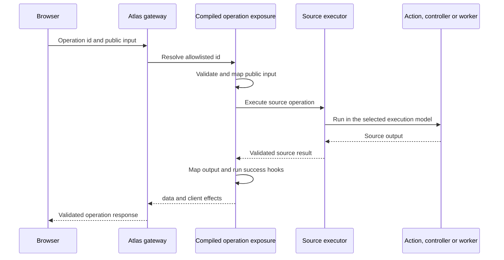
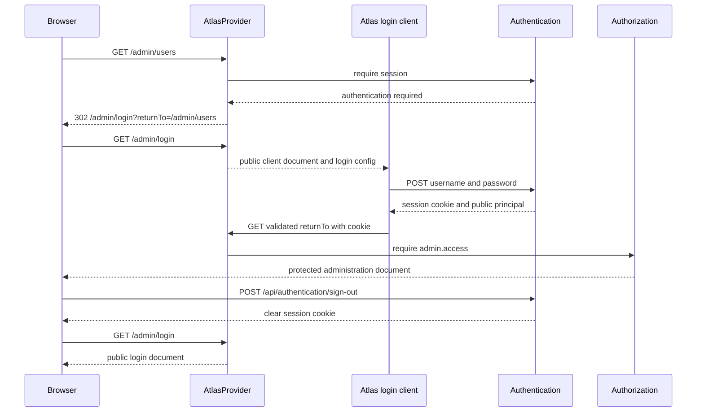

# Atlas

[Documentation](../README.md) · [Implementation index](./README.md) · [Usage guide](../usage/atlas.md)

The Atlas framework provides an efficient way to build internal applications such as operations panels, CRMs and HR tools. An Atlas application may be included with another application or deployed autonomously.

Its main goals are:

- provide a functional interface from a small declarative definition;
- automate conventional behavior while preserving progressive customization;
- reuse application contracts instead of describing the same operations again;
- support external APIs and specialized integrations in addition to application backends;
- allow reusable extensions for sources, resources, fields, components and pages;
- let development move progressively from generated behavior to configuration, composition and custom code.

The first implementation is code-first. No-code editing, external connectors and more advanced internal-tool features are introduced in later phases so the initial contracts can remain small and stable.

## Usage guide

For application setup and task-oriented examples, see the [Atlas usage guide](../usage/atlas.md).

## Validation modes

Catalog exposures inherit their action, HTTP controller or worker validation policy. Both operation and record-action gateways validate inputs with that policy, and mapped values are checked using the inner contract's policy.

`reference.mapInput(schema, mapper, validationMode?)`, `reference.mapOutput(schema, mapper, validationMode?)`, `mapAtlasOperationInput()` and `mapAtlasOperationOutput()` accept an optional final `"sync" | "async"` argument for the replacement schema. It defaults to sync and preserves the unchanged boundary's mode. Mappers can return promises independently of schema parsing mode. Collection-query exposure uses a synchronous public query schema while preserving the inner output policy, and success effects retain both policies. See [Definition validation](./definitions.md#schema-validation-policy).


## Public API

| API group | Main exports |
| --- | --- |
| Definition and composition | `defineAtlas()`, `Atlas`, `AtlasProvider`, base-path helpers and options |
| Resources | `defineAtlasResource()`, `defineAtlasResourceView()`, `defineAtlasRecordAction()` and resource, field, relation, view and action option types |
| Catalog sources | `defineCatalogAtlasSource()`, source/operation reference types, operation input/output mapping and success-hook helpers |
| Collection contracts | `atlasCollectionQuerySchema`, filter operators and query-to-catalog mapping |
| Manifest and gateway contracts | Atlas manifest, resource, field, operation, relation, defaults, notifications and response/effect types |
| Client effects | `atlasNotification()` and `atlasRedirect()` |
| Drizzle metadata | `defineDrizzleAtlasFields()` and override/result types |
| Client delivery | `AtlasClientAdapter`, `AtlasClientRender`, `ViteAtlasClientAdapter`, client configuration and asset-path exports |
| Icons | `fontAwesomeIcon()` and serializable SVG icon types |

## Adapter API

`AtlasClientAdapter.setup(server, atlas, clientConfig)` runs once in Atlas's encapsulated Fastify scope and returns an `AtlasClientRender`. Setup owns assets, development middleware, readiness and cleanup; the renderer sends the application document for a Fastify reply. Implementations must preserve the configured Atlas base path, use the stable Atlas asset path, serialize `clientConfig` as inert data and release watchers or sockets through the owning HTTP scope.

Sources are the data and operation extension boundary. A source definition exposes stable logical operations with runtime input and output schemas; its server-side executor must resolve only compiled allowlisted references, validate every mapping boundary, keep credentials outside the manifest and return normalized `{ data, effects }` responses. A client-provided identifier must never become an arbitrary URL, action name or storage query. The current `CatalogAtlasSource` implements this contract for actions, HTTP controllers and workers; external connector contracts remain a later evolution and must document their own authentication, consistency and failure semantics.

## Customization levels

Kestrel supports complementary levels of control:

1. **Automatic behavior** derives conventional resources, pages, fields and navigation from available contracts and metadata.
2. **Configuration** changes labels, fields, operations, navigation and page behavior in the Atlas definition.
3. **No-code composition** stores dynamic component configuration in the database and lets authorized Atlas users edit it through a visual editor.
4. **Low-code composition** lets developers assemble high-level React components and replace selected automated regions.
5. **Custom code** provides complete control over a component, page, operation or application shell.

These levels can coexist. A manually written React page may contain a dynamic dashboard configured in the database, and a conventional resource page may replace one generated region while retaining the remaining automatic regions.

The initial Atlas template will explicitly render the automatic shell and content. A future code generation command may expose an automatically resolved component as editable source code, but this ejection mechanism is not required for the first implementation. Stable composition points are preferred because they continue to benefit from Kestrel improvements.

The standard shell supports light, dark and system color themes. Users select their preference from the sidebar, where it is stored locally in the browser; the system choice follows operating-system theme changes. Built-in pages use semantic `--atlas-*` CSS variables so application-provided renderers can adopt the same theme. Synchronizing preferences across browsers or allowing an application to supply custom theme palettes remains a future evolution.

## Concepts

### Query

A Query is a side-effect-free read from Atlas's perspective. When it comes from an application catalog, its underlying operation may be an Action or an HTTP controller referenced with `catalogSource.query()`. The source reference adds the read effect used by Atlas; the underlying definition does not carry that distinction.

Atlas read capabilities such as listing, retrieving, searching and aggregating records reference Queries when the source is an application catalog. A connector may expose equivalent read operations for an external source.

### Action

An Action is an Atlas operation that may produce side effects. An application catalog source may expose an Action, an HTTP controller or a worker with `catalogSource.action()`. CRUD mutations, domain-specific operations such as `banUser` and `approveComment`, transport adapters and asynchronous job publication are Actions from Atlas's perspective.

This atlas-level distinction allows the client runtime to apply appropriate caching, invalidation, confirmation and interaction behavior. Additional operation metadata may later distinguish conventional writes from destructive operations.

### Source

A Source identifies the origin of operations and data. Examples include an application catalog, an external API and a database.

Source description and source execution are separate responsibilities:

- a source definition exposes the operations and resource information available to Atlas;
- a server-side connector executes external operations and retains credentials outside the browser.

The application catalog source accepts explicit Action, HTTP controller and worker catalogs. The browser sends operation identifiers and inputs to Atlas gateway without knowing how those operations are transported or executed. Actions run in the current application execution scope, HTTP controllers run through their logical handler, dependencies and middleware without an internal HTTP request, and workers are published through `WorkerClient` without running their handler in the HTTP process. External connectors and HTTP-backed sources are introduced later. They must be registered explicitly and addressed by stable logical identifiers rather than arbitrary client-provided URLs.

An HTTP controller exposed through Atlas gateway must declare an output schema and return a JSON-compatible value. It cannot take ownership of `FastifyReply`, because the gateway owns the `{ data, effects }` response envelope. A worker exposure validates its payload and returns `{ jobId }`. Future increments may add explicit enqueue options, batch publication or richer job receipts without placing those concerns in the initial operation contract.

#### Operation exposure and adaptation

The contract exposed to Atlas is independent from the contract understood by a Source. This is especially important for collection pagination and querying: the standard Atlas client uses one logical request and response contract, while an application catalog, REST API or other Source may use a different representation. Source adapters map between those contracts at the gateway boundary. They validate the public atlas input, map and validate the Source input, execute the Source operation, validate its output, then map and validate the public atlas output.

Contract adaptation is distinct from execution middleware. Middleware surrounds an execution without changing its input or output contract and remains appropriate for concerns such as transactions, authorization, logging and observability. A derivation or adapter explicitly changes an operation contract and carries the runtime schemas needed to validate the new boundary. Input and output transformations compose in opposite directions: public input is mapped towards the Source, while Source output is mapped back towards the public response. A typed adapter chain must verify both directions between every adjacent adapter.

Catalog sources provide default adapters for the standard atlas contracts they support. An individual Query or Action exposure may override that mapping explicitly. The expected public contract must be selected explicitly, for example as a collection Query, rather than inferred later from where an ordinary `query()` reference happens to be used.

Adapters and success hooks belong to the compiled exposure, not to the underlying catalog Action. One Action may therefore be exposed several times with different mappings or effects. Every exposure receives its own stable logical identifier, derived from its Resource capability, View or record Action, while the underlying Source operation identifier remains server-side. The gateway allowlist resolves these exposure identifiers to compiled invocations instead of resolving a public identifier directly to an Action name.

Successful operation exposures return `{ data, effects }`. Effects are validated serializable values consumed by the client, initially redirects and notifications. They form a discriminated `AtlasClientEffect` union rather than an unrestricted yield channel. When several redirects are emitted, the standard client applies the last one. Server-only observations are not automatically transported to the browser. Failure hooks and effects in error responses are deferred until the gateway has a normalized public error contract.

A record Action success hook is attached to its `applicationSource.action()` exposure rather than to `defineAtlasRecordAction()`. A success hook that preserves the output reuses the preceding output schema; an adapter that changes the response supplies a new runtime schema, which becomes the final public signature after composition.

Every record Action is tracked by one Base UI promise toast from submission until completion. Its default messages treat the Action label as a quoted name so labels do not need to fit a generated sentence: `Running “{label}”…`, `“{label}” completed.` and `“{label}” failed.`. `defineAtlasRecordAction()` accepts optional static `feedback.loading`, `feedback.success` and `feedback.error` overrides. Empty overrides fail during Resource compilation. Notifications form an animated collapsed stack that expands on hover or keyboard focus, supports position-aware swipe dismissal in every configured corner, handles varying content heights and disables motion when the user requests reduced motion.

The first successful notification emitted by an exposure-level success hook replaces the promise toast's static success message and retains its optional link. This prevents duplicate success notifications while keeping additional notifications and redirects intact. Static `feedback` is intended for ordinary messages, while success hooks remain available for data-dependent messages, links and multiple effects. Extending the same promise-toast convention and configurable messages to CRUD capability controls remains a future evolution after their operation-specific wording and validation feedback interactions are defined.

#### Collection Query contract

The standard Atlas client uses a source-independent collection contract. Its initial logical shape is:

```ts
interface AtlasCollectionQuery {
  pagination: {
    type: "page";
    page: number;
    pageSize: number;
  };
  search?: string;
  filters?: readonly AtlasCollectionFilter[];
  sorting?: readonly AtlasCollectionSort[];
}

interface AtlasCollectionFilter {
  field: string;
  operator: string;
  value?: unknown;
}

interface AtlasCollectionSort {
  field: string;
  direction: "asc" | "desc";
}
```

The first increment supports a flat list of filters combined with `AND`, an ordered list of multiple sorts and a limited operator allowlist determined by field kind. Resources publish which fields are searchable, filterable and sortable, together with their allowed filter operators. The gateway rejects unsupported fields and operators even if a caller bypasses the standard UI.

Search semantics remain owned by the Source operation. Resource metadata selects the searchable fields exposed to the standard UI, but the portable contract does not prescribe SQL case handling, accent handling, tokenization or full-text behavior.

The logical collection state has a dedicated URL serializer and parser. Search, filters, sorting and numbered pagination are shareable through the URL without making the URL encoding itself the domain contract. Changing search, filters or sorting resets numbered pagination to the first page.

Numbered pagination does not initially promise stable membership between requests. Kestrel does not append the Resource identity automatically to a configured sort, so records may move, repeat or be omitted when data changes or sort values are equal. Sorting remains an ordered list so a future cursor implementation can require and represent a complete stable order. Collection page information remains discriminated so cursor pagination can later be added as another strategy.

Source and atlas pagination strategies need not use the same representation, but a Source adapter may advertise only mappings it can implement correctly. In particular, a stateless gateway cannot generally translate an arbitrary numbered page to a Source that accepts only the preceding cursor. Unsupported strategy combinations fail during atlas compilation rather than degrading silently at execution time.

### Resource

A Resource is a declarative description that groups the CRUD capabilities, Views, record Actions and fields related to one concept. Its source-specific operation references are resolved into a serializable manifest consumed by the runtime. Typical resources include `User`, `Comment` and `Invoice`.

A Resource is an orchestration convenience, not a mandatory abstraction. Domain pages and dashboards may directly use operations and components without representing a CRUD resource.

A Resource definition does not execute operations, own client cache state or render React components. These responsibilities belong to the server gateway, client runtime and renderer layers respectively.

In the first implementation, a catalog-backed Resource explicitly references each Query or Action used for its `list`, `read`, `create`, `update` and `delete` capabilities. Automatic discovery from naming conventions is intentionally deferred because application catalogs can contain domain-specific operations whose intent cannot be inferred reliably. REST source adapters may later infer conventional capabilities more safely from routes and HTTP methods.

A Resource does not expose an unstructured collection of operations. Its additional behavior is described from the perspective of Atlas UI:

- `views` defines resource sub-pages, each backed by a dedicated Query and a registered renderer;
- `recordActions` defines Actions displayed on the read page of one record and explicitly maps the Resource identity to the Action input;
- `bulkActions` will later define Actions applied to records selected from the list page.

View routes use an explicit segment such as `/users/views/activity` so a View identifier cannot be confused with a record identifier. Views may appear as nested navigation items below their Resource list page.

#### Record Action invocation

The Resource identity input is supplied automatically when a record Action is invoked. Every other unresolved field in the Action input schema is an Action parameter. Parameter presentation first uses an explicit entry from the record Action `inputs` metadata, then inherits metadata from a same-named Resource field and finally falls back to schema inference. A parameter such as `spaceId` therefore reuses the Resource field's relation autocomplete without duplicating its target definition, while an Action-specific parameter can declare or override its own relation and optional specialized lookup exposure. An Action with no additional inputs can execute directly after its optional confirmation. When additional inputs exist, the standard UI links to a dedicated route such as `/users/:recordId/actions/:actionId` and renders a schema-derived form. The operation contract retains room for explicit bindings that can later supply an input from record data, application context or a configured constant instead of exposing it in the form.

The canonical Action route is always available for direct links, refreshes and keyboard navigation. Parameterized record Actions open the shared form in a dialog by default without leaving the current page. The dialog closes after successful submission and provides a `Permalink` to the canonical form page. Clicking the backdrop, pressing Escape or using Cancel also closes it; when the form contains a value, these dismissals first ask the user to confirm that the entered values may be discarded. Standard and confirmation dialogs animate their backdrop and panel through Base UI's opening and closing transition states, retain their content until the exit transition finishes and disable motion when the user requests reduced motion. `presentation: "page"` explicitly selects direct page navigation without changing the underlying route or duplicating form logic; `presentation: "dialog"` can still make the default explicit. Styling parent panels when nested dialogs are open remains a future evolution if deeper modal workflows are introduced.

A record Action exposure may use a server-side `onSuccess` generator. The gateway calls it only after the Action has completed successfully and passes the validated public input and output. Every yielded value is validated as a serializable client effect, currently a Resource record redirect or a notification with an optional Resource record link. An omitted return preserves the validated output. A separate output adapter changes the response contract and supplies the runtime schema required to validate the replacement.

Successful gateway responses use the uniform `{ data, effects }` envelope. The client unwraps `data` for ordinary operations and interprets record Action effects after invalidating affected Resource queries. Notifications remain mounted across navigation, and redirect targets use Resource identifiers and record identifiers rather than server-generated client URLs.

Record Actions can also be exposed for each row of the Resource list. Visibility follows a three-level override order:

1. `showInList` on the record Action, when explicitly configured;
2. `recordActionsInList` on the Resource;
3. `recordActionsInList` in the Atlas defaults.

The Kestrel fallback is `"all"`. Applications can select `"none"` globally, override that policy for one Resource and finally opt individual Actions in or out. The policy only changes presentation: the gateway continues to enforce the same compiled operation allowlist.

#### Relations

Fields and relations are part of the serializable Resource description. Every Resource selects a `displayField`, defaulting to its identity field, which represents records in page titles, relation values and other compact UI regions. A relation targets another Resource by stable identifier rather than a Drizzle model. Its stored value always references the target Resource identity; alternative-key relations are not represented until lookup, hydration and record navigation can support them as one coherent contract. A relation describes cardinality and optionality, and its presentation metadata can override the target Resource display field and additionally select the picker, label and whether a related collection appears inline or as a sub-page.

This makes Resources independent from their persistence implementation. Resources backed by a catalog, REST API, GraphQL API or another connector use the same relation contract, and a relation may connect Resources backed by different source types. A Resource can also describe a projection or domain concept that does not correspond to one database table.

The `defineDrizzleAtlasFields()` helper inspects public column metadata from the currently supported PostgreSQL Drizzle tables, produces ordinary field options and accepts explicit overrides for information the database cannot express. Database foreign keys do not identify source-independent atlas Resources, so relations remain explicit overrides. Generated and manually declared fields have the same runtime representation; there is no Drizzle-specific Resource subtype.

Manual Resource relations do not require a Drizzle upgrade. The installed Drizzle version can therefore remain in place while relation-aware rendering and forms are implemented. Adopting `defineRelations()` and generating richer metadata from that API remains an optional later integration and will require a deliberate Drizzle upgrade with database and repository regression tests.

Relations do not authorize Atlas to query a table directly or bypass Resource capabilities. The runtime loads related records through the target Resource. Every Resource provides a `readMany` capability accepting an `ids` collection so the runtime can deduplicate identifiers and hydrate relation values in one operation rather than issue one `read` operation per row. Sources that can efficiently return nested data may later expose an explicit nested-read convention as an optimization above this portable `readMany` strategy.

Record pages also compile incoming relations whose inverse cardinality is `many` into contextual collections below the main record details. These collections reuse the standard Resource collection engine with an immutable parent filter, independent pagination and an embedded presentation. They are enabled by default, may be disabled with `relatedRecords: false`, and may configure their label, page size, search, filters, sorting, pagination and record Actions. Search and user filters are available by default behind one collapsed toggle, remain applied when the controls are hidden and never expose the immutable parent filter. A relation backed by a join or another query shape may expose a dedicated related-records Query and bind the parent identity to one declared input instead of using the conventional filtered `list` capability.

Relation autocomplete does not require a second collection capability. By default, it searches candidates through the target Resource `list` capability and its standard collection contract. The client requests only a bounded first page, submits the target Resource identity and uses the configured relation display field or target Resource display field as the option label. Search, filters and sorting remain limited by the target Resource field metadata and enforced by the gateway exactly as they are on the standard list page.

A relation may explicitly reference a specialized lookup exposure when the target Resource list is not the right operation, for example because candidate selection requires fixed server-side constraints, different authorization, relevance ranking, a lightweight projection or a dedicated external endpoint. That exposure still presents the standard bounded collection contract to Atlas client. `defineModelLookupAction()` may be provided as a convenience for this specialized case, but it is not required for ordinary relation autocomplete and does not become a mandatory Resource capability.

Candidate search and selected-value hydration remain distinct. Autocomplete uses `list` or the relation's specialized lookup exposure to discover candidates, while `readMany` efficiently resolves values already present in records or form state without depending on the current search term.

Bulk mutation capabilities are distinct from relation hydration. Future Resource contracts may add `createMany`, `updateMany` and `deleteMany`, but their semantics must be settled before implementation: atomicity, partial successes, maximum batch size, confirmation, destructive effects and whether a sequential fallback may ever be enabled explicitly. The runtime must not silently emulate a missing bulk mutation capability with a series of unit operations.

The following API only illustrates the intended responsibilities; its exact shape is not yet a contract:

```ts
import { definition as faUsers } from "@fortawesome/free-solid-svg-icons/faUsers";
import { fontAwesomeIcon } from "@kestreljs/framework/atlas";

const catalogSource = defineCatalogAtlasSource({
  id: "application",
  actions: applicationActionCatalog,
  httpControllers: applicationHttpControllerCatalog,
  workers: applicationWorkerCatalog,
});

const userResource = defineAtlasResource({
  id: "user",
  label: "Users",
  icon: fontAwesomeIcon(faUsers),
  source: catalogSource,
  identity: "id",
  displayField: "email",
  capabilities: {
    // Every capability initially references its Query or Action explicitly.
    list: catalogSource.query(appCatalog.user.actions.list),
    read: catalogSource.query(appCatalog.user.actions.get),
    readMany: catalogSource.query(appCatalog.user.actions.getMany),
    create: catalogSource.action(appCatalog.user.actions.create),
    update: catalogSource.action(appCatalog.user.actions.update),
    delete: catalogSource.action(appCatalog.user.actions.delete),
  },
  views: {
    active: defineAtlasResourceView({
      label: "Active users",
      query: catalogSource.query(appCatalog.user.actions.listActive),
      renderer: "resource-list",
    }),
  },
  recordActions: {
    "fill-name": defineAtlasRecordAction({
      label: "Fill name",
      action: catalogSource.action(appCatalog.user.actions.fillName),
      recordInput: "id",
      showInList: true,
    }),
  },
  fields: {
    id: { kind: "id" },
    email: { kind: "email", searchable: true },
    name: { kind: "text" },
    organizationId: {
      kind: "relation",
      relation: {
        resource: "organization",
        cardinality: "one",
        lookup: {
          // Ordinary relations omit `query` and reuse the target Resource list.
          query: catalogSource.collectionQuery(organizationCandidateQuery),
          pageSize: 15,
          minimumSearchLength: 2,
        },
      },
    },
  },
});
```

### Component

A Component displays data or lets a user invoke operations. Components may compose other components and may be used by resource views or standalone pages.

There are two distinct composition mechanisms:

- **React components** are written and assembled by developers. High-level components provide a low-code way to compose an Atlas while arbitrary React remains available for custom behavior.
- **Dynamic components** are configured through Atlas UI and store their serializable configuration in the database. They provide no-code editing for selected parts of an application.

A dynamic component can be placed explicitly from React or contributed to a catalog of elements available to a dynamic canvas. Its renderer remains an ordinary registered React component, but its instance configuration is data rather than serialized React code.

### Reusable pages and forms

Route pages are thin adapters around reusable content components. A reusable list, read page, CRUD form or Action form receives resolved Resource data and callbacks through props or headless hooks; it does not read route parameters directly or navigate with `window.location`. Route adapters provide URL parameters and navigation behavior, while dialogs and embedded layouts reuse the same content component with different success and cancellation callbacks.

For example, `RecordActionForm` owns schema-derived fields, submission state and validation display. `RecordActionPage` wraps it for the canonical route, while `RecordActionDialog` wraps the same component for an in-context interaction. This split also applies to Resource list, read, create and update content so applications can embed them without recreating data and mutation behavior.

### Atlas application

An Atlas application gathers sources, resources, pages, navigation, component registries and runtime providers. It is the transport-independent description consumed by the React application and the server gateway.

```tsx
const atlas = defineAtlas({
  notifications: { position: "bottom-left" },
  resources: [userResource, commentResource],
});

// The client template receives the compiled manifest from the gateway.
export default function App({ manifest }: { manifest: AtlasManifest }) {
  return <AtlasApplication manifest={manifest} />;
}
```

The initial application is served by the same Fastify application as its backend under a configurable base path that defaults to `/atlas`. A dedicated provider owns Atlas routes and assets. The manifest, headless runtime and UI remain independent from that delivery adapter so Atlas can be built and deployed as an autonomous application later.

The standard notification stack defaults to the bottom-left viewport corner. The Atlas `notifications.position` option accepts `"top-left"`, `"top-right"`, `"bottom-left"` or `"bottom-right"`; the resolved position is published in the manifest so every standard client uses the same presentation choice.

## Metadata ownership

Automatic UI inference needs more information than structural schemas alone. For example, a string schema does not establish whether its value is an email, secret, image, relation identifier or Markdown document.

Metadata is therefore split by responsibility:

- **contract metadata** describes reusable semantic facts such as identity, human-readable descriptions, read or write intent, destructive effects, sensitivity and relationships when these facts belong to the application contract;
- **atlas metadata** describes presentation choices such as labels, icons, column order, widgets, widths, grouping and view visibility;
- **dynamic configuration** describes user-editable component instances and layouts stored by the no-code runtime.

Contract metadata remains deliberately small and optional. It can be reused by generated clients, Studio, documentation and other interfaces, so it must not contain React or atlas-specific presentation concerns. Atlas metadata can override inferred behavior without adding UI configuration to business code.

External resources define the semantic information needed for inference alongside their atlas source or resource definition because no application contract exists to provide it.

The resolution order is:

1. infer structural information from input and output schemas;
2. apply reusable contract metadata when available;
3. apply source adapter conventions;
4. apply explicit atlas resource and view configuration.

Explicit atlas configuration always wins. Resource definitions can supply any serializable SVG `icon` for standard navigation and overview cards. The `fontAwesomeIcon()` adapter accepts an explicitly imported Font Awesome definition without making the resource contract depend on Font Awesome. Deep icon imports avoid evaluating the complete style index in Node. Manifest compilation deduplicates definitions into a shared icon catalog, and Resources store only catalog references.

## Architecture

The solution is divided into layers with independent contracts.

### Domain contracts

Kestrel Actions, HTTP controllers and workers provide typed application contracts. The catalog source classifies each referenced Action or HTTP controller as an Atlas Query or Action and each referenced worker as an Action without introducing UI dependencies into the application definition.

### Atlas manifest

The manifest contains serializable source, resource, operation, field, page and navigation definitions. In the first implementation it is compiled from manually registered Resources whose capabilities reference entries in explicit application catalogs. There is no runtime file discovery or automatic capability matching.

The manifest uses stable identifiers so extensions, persisted configuration and generated code do not depend on display labels or array positions.

### Server gateway

The gateway exposes the manifest and executes only the operations referenced by the compiled Atlas definition. The browser calls a generic atlas endpoint with a stable exposure identifier and a JSON input; it never receives application controller routes or transport bindings. Record Actions retain a Resource- and exposure-specific gateway endpoint. The gateway resolves every public identifier to a compiled invocation containing its Source reference, adapters, final schemas and success effects. Public identifiers describe the exposure rather than reuse an underlying catalog definition name, allowing one Source operation to be exposed safely with several contracts or behaviors. For an application catalog source, the compiled invocation runs an Action, invokes an HTTP controller directly or publishes a worker job in the current application scope. For an external or HTTP-backed source, it will later delegate to the corresponding registered server-side connector.

The gateway is responsible for validation, secret isolation, error normalization and observability. Authentication and authorization will later be enforced at this boundary and on the underlying application operations.

### Headless client runtime

The client runtime interprets resources and operations independently from their visual representation. It owns query caching, mutation state, invalidation, form state, notifications and routing integration.

The initial React UI can use TanStack libraries internally, but public resource and operation contracts must not expose a particular table, form or visual component library.

### Standard UI

The standard UI renders an immediately usable application shell and conventional list, read, create, update and delete workflows. It selects default fields and widgets from resolved resource metadata. Delete is available from the beginning and uses destructive-operation metadata to render a standard confirmation before invoking the Action.

The production client keeps its public login entry independent from the protected application, Query runtime and router. Inside the application, TanStack Router preloads lazy default page renderers on navigation intent: the lightweight overview has its own entrypoint, while the related Resource list, View, read, form and record-Action adapters currently share one asynchronous Resource-page module. Application-supplied page and View renderers remain direct registry overrides and do not depend on those defaults. Splitting the shared Resource-page module into narrower list, read and form families remains a measured evolution if those workflows grow enough to justify extra request boundaries.

High-level components expose stable composition regions so developers can replace one part while retaining automatic content:

```tsx
<ResourceList resource={userResource}>
  <ResourceList.Toolbar>
    <ImportUsersButton />
    <RemainingActions />
  </ResourceList.Toolbar>

  <ResourceList.Table>
    <Column field="email" />
    <RemainingColumns except={["email"]} />
  </ResourceList.Table>
</ResourceList>
```

`RemainingActions`, `RemainingColumns`, `RemainingItems` and similar components resolve entries by stable identifiers. They make automatic and manual composition interoperable without requiring generated source code.

### Extension registries

Registries allow packages and applications to contribute sources, connectors, field renderers, form inputs, page renderers and dynamic components. Extensions declare stable identifiers and serializable contracts; client renderers and server implementations remain separated so Node.js dependencies do not enter browser bundles. Phase 1 introduces only the minimal View renderer registry required by resource sub-pages; the generalized extension registries remain part of Phase 2.

The generalized client renderer registries are local to one `AtlasApplication`, so multiple applications and tests do not share mutable global registrations. Field and input renderers resolve Resource-qualified field identifiers before ordinary field identifiers and semantic field kinds. Operation controls resolve stable operation identifiers before operation effects; their renderers provide presentational content while Kestrel retains ownership of the accessible button or menu item. Page and View registries retain built-in renderers as fallbacks, and the former `pageRenderers` and `viewRenderers` application properties remain compatibility aliases for their corresponding registries.

Studio already follows a comparable extension structure. Atlas can reuse its architectural principles, but Studio and the production atlas remain distinct products: Studio is a local development interface, whereas Atlas has its own runtime, deployment and future authentication requirements.

### No-code configuration

Dynamic pages and components are represented by versioned serializable documents. A document references registered component identifiers, validated properties, data bindings and child nodes. It never stores executable React or arbitrary JavaScript.

```ts
interface DynamicPageDocument {
  schemaVersion: number;
  id: string;
  revision: number;
  root: DynamicComponentNode;
}

interface DynamicComponentNode {
  id: string;
  component: string;
  props: unknown;
  bindings?: Record<string, DynamicDataBinding>;
  children?: DynamicComponentNode[];
}
```

A dynamic component definition provides its renderer, editor, property schema and configuration migrations. Documents eventually support draft and published revisions, validation, history, rollback and deterministic import and export between environments.

When rendering a dynamic page:

1. the client retrieves its published configuration through the gateway;
2. the client runtime resolves referenced Queries and prepares the required data requests;
3. the gateway executes the requests against the application or registered external connectors;
4. the client renders components as their configuration and required data become available.

Caching, request deduplication and dependency scheduling belong to the headless client runtime and can evolve without changing the document format.

## Execution scenarios

### Allowlisted operation execution



Unknown exposure ids, unsupported collection fields and invalid mapped values fail before source execution. An action executes in the current application scope, a controller executes its logical pipeline without an internal HTTP call, and a worker exposure enqueues work and returns its receipt.

## Security scope

The Atlas framework remains independent from a particular authentication or authorization implementation. `AtlasProvider.access` accepts reusable HTTP middleware for the complete configured boundary, while its optional `authentication` object describes the small browser-login bridge required by the Kestrel-owned client.

`AtlasProvider.enabled` lets an application omit every Atlas HTTP extension for deployments that do not expose an internal site. The standard application's Atlas-backed backoffice maps this option to the explicit `BACKOFFICE_ENABLED` setting outside local and test environments. Its URI-encoded browser configuration is inert data on the root HTML element rather than an inline executable script, so enabling Atlas does not weaken the production HTTP Content Security Policy.

```ts
new AtlasProvider({
  atlas: applicationBackoffice,
  authentication: {
    passwordSignInUrl:
      applicationAuthenticationHttp.signInWithPassword.route.url,
    signOutUrl: applicationAuthenticationHttp.signOut.route.url,
    requiredSession:
      applicationAuthenticationHttp.middleware.requiredSession,
    isAuthenticationRequired: (error) =>
      error instanceof AuthenticationRequiredError,
  },
  access: {
    required: [
      requireHttpAuthorization(permission(adminAccessPermission)),
    ],
    unsafe: [applicationAuthenticationHttp.middleware.trustedOrigin],
  },
});
```

The default login subpath is `/login`, resolved below the configured Atlas base path. It can be replaced with another non-root relative path. `requiredSession` is applied automatically before every authorization middleware on protected documents, APIs, and operations, so enabling the login integration cannot accidentally leave its data boundary anonymous. The password and sign-out endpoints are application-owned and remain the source of truth for credential verification, throttling, session creation or revocation, cookies, and errors. The predicate lets the provider recognize the authentication library's missing-session error without importing that library.

The application composes required session resolution with `admin.access` authorization once for the exact `/admin` path and every descendant. Manifest requests, APIs, known operations, and unmatched safe or unsafe routes cross the same server-side boundary. Unsafe requests additionally validate their Origin before session and permission checks. Kestrel client assets remain on a separate non-data prefix.

### Login navigation

Browser documents and programmatic endpoints deliberately behave differently:

| Request | Anonymous result |
| --- | --- |
| `GET /admin`, `GET /admin/`, or a SPA route | `302` to `/admin/login?returnTo=...` |
| `GET /admin/login` | Public Atlas login document |
| `GET /admin/api/*` | JSON `401 Unauthorized` |
| Unsafe `/admin/*` request | Transport error such as `401` or trusted-Origin `403`; never an HTML redirect |

The login document is registered before the protected SPA fallback and does not load the protected manifest. The injected client configuration contains only Atlas base path and title, the public login path, and the application password-sign-in and sign-out URLs. No session token, password policy, storage detail, or authorization rule is serialized into the page.

After a successful sign-in, the client navigates to `returnTo` or to the Atlas base path when it is absent. Both the server and browser constrain the target to the current Atlas boundary. Absolute URLs, protocol-relative URLs, normalized path traversal, the login page itself, and paths outside the boundary fall back to `/admin` in the standard application; this prevents open redirects and login loops.

The authenticated sidebar exposes a sign-out button in place of the former protection badge. It posts to the configured endpoint with same-origin credentials and returns to the public login page only after the server confirms session revocation. A transport or server failure keeps the current document visible and exposes a retryable error instead of presenting a false signed-out state.



Credential rejection uses one generic message. Rate limiting, an untrusted page origin, and service unavailability have distinct actionable messages without exposing credential details. Password fields use the standard username and current-password autocomplete semantics. An authenticated subject without `admin.access` still receives `403`; a dedicated access-denied page remains a future client improvement.

See [Authorization](./authorization.md) for the implemented policy, code-defined roles, persisted assignments, and response semantics.

Future security work includes:

- granular server-side authorization for individual pages, resources, operations, records and fields;
- separate permission to edit no-code configuration;
- tenant and organization isolation;
- audit trails for business operations and configuration changes;
- confirmation or reauthentication for destructive operations;
- connector secret management and host allowlists;
- CSRF, SSRF, rate-limit and request-size protections;
- pluggable login renderers and additional authentication mechanisms such as SSO, passkeys, OTP, and multi-factor continuation screens;
- redirecting an already-authenticated subject away from the login page and providing a dedicated access-denied page;

Hiding a client component is never sufficient authorization. The implemented operations boundary is authoritative for atlas HTTP access; genuinely operations-only business operations must additionally use Action middleware when a direct or alternative transport exists.

## Implementation plan

### Phase 1: integrated code-first Atlas

Status: completed.

The first phase validates the core model and delivers useful CRUD operations for an application:

- [x] define the source, resource, capability, operation, field and application contracts;
- [x] add `defineModelUpdateAction()` alongside the existing model Action helpers and expose conventional update Actions and HTTP controllers for Member, Space, Debate and Comment;
- [x] make `defineCatalogAtlasSource()` classify Actions from the application catalog as atlas Queries or Actions rather than referencing HTTP controllers;
- [x] let each Resource manually associate its CRUD capabilities with typed Query and Action references;
- [x] replace the unstructured `operations` collection with functional `views` and `recordActions` definitions, while reserving `bulkActions` for a later phase;
- [x] compile a serializable Atlas manifest from those explicit Resource definitions without automatic catalog discovery;
- [x] introduce the minimal reusable semantic metadata required for reliable inference;
- [x] expose the manifest and a generic operation endpoint through Atlas server provider;
- [x] maintain a server-side allowlist compiled from Atlas definition and execute catalog Actions directly through the application context;
- [x] mount the initial atlas and its assets on the existing Fastify application under `/atlas`, with a configurable base path and a delivery boundary that supports later standalone deployment;
- [x] implement the headless React runtime for queries, mutations and routing;
- [x] provide an application shell, navigation, list, read, create, update and delete workflows;
- [x] infer standard table columns and form inputs from schemas and metadata;
- [x] mark delete operations as destructive and display a standard confirmation before execution;
- [x] expose Views as nested Resource pages backed by dedicated Queries and a minimal renderer registry;
- [x] expose record Actions on Resource read pages, automatically provide the configured record identity input and invalidate affected data after success;
- [x] provide stable composition regions and a lightweight explicit application template;
- [x] add unit tests, client runtime tests and server integration tests through `fastify.inject()`, including gateway allowlisting and development and production asset delivery.

The application supplies two concrete operations to validate these extension points:

- `listActiveMembers` is an Action exposed as an Atlas Query and returns members who authored at least one Comment. It uses an inner join or equivalent existence condition, eliminates duplicate members and returns deterministic paginated results. The Member Resource exposes it through an `active` View rendered as a resource list and linked below the main Members navigation item.
- `fillMemberName` is an Action accepting a Member record identifier, selecting one adjective and one noun from application-owned English word lists, updating the Member name to their combination and returning the updated Member. The Member Resource exposes it as a `fill-name` record Action on the read page. Tests control the word selection so the Action remains deterministic under test, and successful execution invalidates both the Member record and Member lists.

The former `find-by-email` Member operation and Space `overview` operation are removed from Atlas Resource definitions. They remain ordinary application Actions and are not automatically exposed merely because they exist in the catalog.

Automatic capability discovery remains outside this phase. It can be investigated later for application catalogs and introduced earlier for REST adapters where routes and HTTP methods provide stronger conventions. Authentication and authorization are composed at the provider boundary and remain independent from Resource capability discovery.

### Phase 2: extensibility and complete resource workflows

Status: in progress. The reusable Resource workflow, record Action invocation, batched relation hydration, Drizzle field metadata and generalized client renderer registry increments are completed.

The second phase turns the initial implementation into a reusable framework:

#### Reusable Resource workflows

- [x] split route adapters from reusable list, read, CRUD form and Action form components, replacing hard-coded navigation with explicit success and cancellation callbacks;
- [x] add canonical record Action routes and infer Action parameters by subtracting the configured record identity input from the Action input schema;
- [x] execute parameterless record Actions directly and render parameterized Actions with the reusable schema-derived form;
- [x] support page and dialog presentation for the same record Action form while preserving a directly addressable canonical URL;
- [x] expose record Actions from Resource list rows according to the Action, Resource and Atlas `showInList`/`recordActionsInList` resolution policy;
- [x] let record Action parameters inherit same-named Resource field metadata and accept explicit `inputs` overrides, including relation lookup metadata;

#### Resource metadata and rendering

- [x] add source-independent field and relation definitions to Resources, including relations between Resources backed by different source types;
- [x] require a `readMany` capability and batch related-record hydration by target Resource so list and read pages avoid N+1 operation calls;
- [x] render relation values through target Resource display fields;
- [x] add optional helpers that derive ordinary Resource metadata from the currently supported Drizzle schema information while preserving manual overrides;
- [x] generalized registries for fields, inputs, operation controls and page renderers beyond the minimal View renderer registry introduced in Phase 1;

#### Catalog source transports

- [x] allow `applicationSource.action()` to support Actions, HTTP controllers and workers as arguments, and `applicationSource.query()` and `applicationSource.collectionQuery()` to support Actions and HTTP controllers;
- [x] preserve controller dependencies, middleware and Action-backed adapters without issuing internal HTTP requests, and publish workers through `WorkerClient` with a validated `{ jobId }` receipt;
- [ ] consider explicit worker enqueue options, batch publication and richer job receipts after their public atlas semantics are defined;

#### Collection queries and relation lookup

This work is split into three increments so collection contracts and relation lookup do not depend on unresolved saved-view persistence:

1. **Collection Query contract and standard list:**
   - [x] add the source-independent collection request, page response, field capability and URL-state contracts;
   - [x] support flat `AND` filters with operators limited by field kind, ordered multi-column sorting and Source-defined search semantics;
   - [x] compile stable exposure-specific operation identifiers and gateway invocations instead of exposing catalog Action names directly;
   - [x] introduce typed operation derivations or adapters for contract changes while retaining signature-preserving middleware for cross-cutting execution behavior;
   - [x] let catalog sources provide the default collection mapping and let individual Query or Action exposures override it explicitly;
   - [x] replace record Action-specific success handling with exposure-level success hooks and migrate the successful response envelope from `instructions` to validated client `effects`;
   - [x] keep numbered pagination without a temporary deterministic-order guarantee, while retaining ordered sorting and discriminated page information for future cursor pagination;
   - [x] implement search, filter, sorting and pagination controls in the reusable standard Resource list, with their state represented in the URL;
2. **Relation lookup and autocomplete:**
   - [x] use the target Resource `list` capability by default for candidate search, with an explicitly bounded first page and the same gateway-enforced search, filter and sorting allowlists as the standard Resource list;
   - [x] allow a relation to reference an optional specialized lookup exposure with fixed server-side constraints or other candidate-selection semantics, and provide `defineModelLookupAction()` as a semantic convenience for model-backed specialized lookups;
   - [x] provide relation-aware autocomplete inputs for one and many relations, with application input-renderer overrides for presentation and relation-level overrides for lookup behavior; direct identifier entry remains available as an alternative, and the standard UI never loads a complete target collection implicitly; a select may only be introduced when explicitly configured for a known bounded collection;
3. **Saved views:**
   - [ ] define saved-view ownership, persistence, sharing and naming separately after the first two increments; Query-backed Resource Views remain a distinct existing concept.

Failure hooks and effects in error responses are not part of these increments. They depend on the standardized operation-error and validation work below.

#### Bulk data workflows

- [ ] bulk selection and bulk Actions;
- [ ] file uploads;
- [ ] import and export;

#### Validation and operation feedback

- [ ] field-level and form-level server validation errors;
- [ ] notifications and standardized operation errors;

#### Other sources

- [ ] explicit external source definitions and server-side connector contracts;
- [ ] HTTP API source with REST standards

#### Extension delivery and source exposure

- [ ] extension packaging and application overrides;
- [ ] optional source generation that exposes resolved automatic components as code.

### Phase 3: no-code pages and components

The third phase introduces safe runtime configuration:

- [ ] dynamic component registry with validated props and bindings;
- [ ] visual editor and read modes;
- [ ] versioned page documents and component migrations;
- [ ] draft, publish, history and rollback workflows;
- [ ] database persistence and caching;
- [ ] deterministic import and export between environments;
- [ ] mixed React and dynamic page composition;
- [ ] permission hooks ready for the later authorization library.

### Phase 4: internal-tool platform capabilities

The fourth phase extends Atlas beyond resource operations:

- [ ] dashboard charts and aggregation Queries;
- [ ] richer visual data bindings and dependent Queries;
- [ ] reusable workflows and multi-step operations;
- [ ] define and implement optional `createMany`, `updateMany` and `deleteMany` capabilities after deciding atomicity, partial-success, size-limit, confirmation and fallback semantics;
- [ ] optionally upgrade Drizzle and add richer Resource metadata generation from its public `defineRelations()` API;
- [ ] environment variables and connector configuration without secret export;
- [ ] scheduled and delayed Actions;
- [ ] real-time updates and subscriptions;
- [ ] reusable extension distribution;
- [ ] collaboration on dynamic configuration.

## Later Kestrel features

The following cross-cutting capabilities are intentionally deferred but should remain compatible with the initial contracts:

- authentication and authorization;
- business and configuration audit logs;
- multitenancy;
- internationalization;
- accessibility auditing and keyboard interaction standards;
- application theming and design-system adapters;
- optimistic updates and conflict resolution;
- concurrent record editing and record versioning;
- cursor pagination and infinite lists;
- offline or degraded connector behavior;
- real-time data;
- usage analytics and operational limits;
- deployment of an autonomous atlas separately from its application backend.
- auto-expiring notifications with visual time indicator (progress like)
- Observability in BO operations

## Current implementation

The initial code-first vertical slice is available under `src/packages/kestrel/src/atlas`. It includes:

- typed catalog sources that allowlist Actions, HTTP controllers and workers from explicit catalogs, expose Actions and eligible controllers as Queries or Actions, and expose workers only as Actions;
- manually mapped Resources with required list, read, read-many, create, update and delete capabilities;
- source-independent collection requests mapped to the catalog collection contract at the gateway boundary, with flat filters, Source-defined search, ordered multi-column sorting and numbered pagination represented in Resource-list URLs;
- opt-in searchable, filterable and sortable field metadata, with filter operators constrained by field kind and validated at the gateway before Source execution;
- exposure-specific operation identifiers and typed input, output and success-effect derivations, allowing one catalog operation to be exposed with distinct public contracts;
- compilation to a serializable manifest with operation effects and JSON Schemas but no application transport details;
- schema-based field inference with atlas-owned field and relation overrides;
- optional Drizzle field metadata generation through `defineDrizzleAtlasFields()`, with explicit application overrides and no Drizzle-specific Resource contract;
- a Fastify provider serving the manifest, allowlisted operation gateway and React application under a configurable base path;
- a TanStack Router and TanStack Query client with an independently loaded login, lazy overview and Resource-page defaults, resource navigation, nested Views, numbered pagination, detail pages, reusable create and update forms, confirmed deletion and record Actions;
- thin route adapters around reusable list, read, CRUD form and Action form components, with explicit success and cancellation callbacks;
- canonical record Action routes, schema-derived Action parameter forms with same-named Resource field inheritance and explicit metadata overrides, direct parameterless execution, shared page or dialog presentation and validated client effects emitted by exposure-level success hooks;
- persistent promise-toast feedback for record Actions, with label-safe defaults, static loading/success/error overrides and dynamic success-notification precedence;
- record Actions on list rows with Action, Resource and Atlas visibility overrides and an `"all"` Kestrel fallback;
- source-independent Resource relations validated through stable Resource and field identifiers, with target Resource display fields used by default;
- batched and deduplicated relation hydration through mandatory `readMany` Queries, with display fields linked to target records in lists and record pages;
- inverse one-to-many and many-to-many collections embedded in record pages through the reusable Resource collection engine, with immutable contextual filters and per-relation presentation options;
- bounded relation autocomplete backed by the target Resource list by default, optional relation-specific collection exposures, one and many selections, and direct identity entry as an alternative;
- application-local registries for field renderers, form inputs, operation controls, pages and Views, with built-in fallbacks, stable resolution precedence and exported composition primitives;
- a Vite delivery adapter, a separate production client bundle and optional participation in an application-composed shared development runtime;
- the application-owned Member, Space, Debate and Comment Resources mounted as the application's backoffice at `/admin`;
- conventional `defineModelUpdateAction()`, `defineModelGetManyAction()` and optional `defineModelLookupAction()` support, with PATCH controllers and read-many Queries for those Resources;
- an Active members View backed by `listActiveMembersAction` as its Query and a `fill-name` record control backed by `fillMemberNameAction`.

The application's Atlas-backed backoffice is protected by password authentication and the `admin.access` permission, with a Kestrel-owned login page for anonymous browser navigation. Debate-to-Space, Debate-to-Member, Comment-to-Debate and Comment-to-Member relations are rendered through batched target Resource Queries and edited through bounded autocomplete inputs backed by their target Resource lists. Direct identity entry remains available from each picker, and relations may opt into a specialized lookup exposure when candidate selection differs from ordinary listing. Specialized widgets and field-level server errors remain part of later Phase 2 increments.

Record Actions infer their user-supplied parameters by removing the configured Resource identity input from the Action input schema. Parameters inherit same-named Resource field metadata unless the record Action supplies an explicit `inputs` override, so `copy-to-space.spaceId` uses the Debate-to-Space relation autocomplete. Parameterless Actions execute directly from read pages and list rows, while parameterized Actions reuse the same schema-derived form on their canonical page route or in a dialog. List visibility resolves explicit Action overrides before Resource and Atlas policies. Resource workflow content no longer owns route navigation and can be embedded with host-provided lifecycle callbacks.

Each Resource has a validated display field that defaults to its identity. Read pages use the loaded record's display value as their title, list pages place it in the first visible column, and relations inherit the target Resource display field unless they explicitly override it.

## Initial non-goals

The initial implementation does not attempt to provide a Retool-like general-purpose visual application builder. It does not execute arbitrary code stored in the database, discover application files at runtime, connect the browser directly to privileged external services, or replace application business logic with atlas configuration.

Atlas remains an interface over explicit typed operations. Progressive automation reduces repetitive work without weakening the application boundaries defined by Kestrel.

## Package ownership and distribution

Atlas lives in `src/packages/kestrel/src/atlas`, with its adapters, browser client and tests colocated. Server code imports lower-level Kestrel libraries through relative modules; those libraries do not depend on Atlas. The browser imports only browser-safe runtime modules and type-only server contracts.

The public entry point is `@kestreljs/framework/atlas`. Adapter contracts are also exported from `atlas/adapters` and `atlas/adapters/client`; `atlas/client_config` and `atlas/contract` expose browser-safe contracts. The framework build compiles the server declarations and builds `assets/atlas` separately from `assets/studio`. The Vite adapter resolves the installed package root from its relocated module and serves the `/_atlas_assets/` prefix. Applications may instead inject a shared development runtime pointing at the Atlas client source.

Installed-archive verification checks Atlas HTML, configuration and referenced JS/CSS assets outside the workspace. Library tests remain in Kestrel; consuming applications own their resource, permission and persistence integration tests. Optional lazy loading and finer-grained dependency distribution remain future improvements; there is no separate Atlas package or automatic npm publication.
