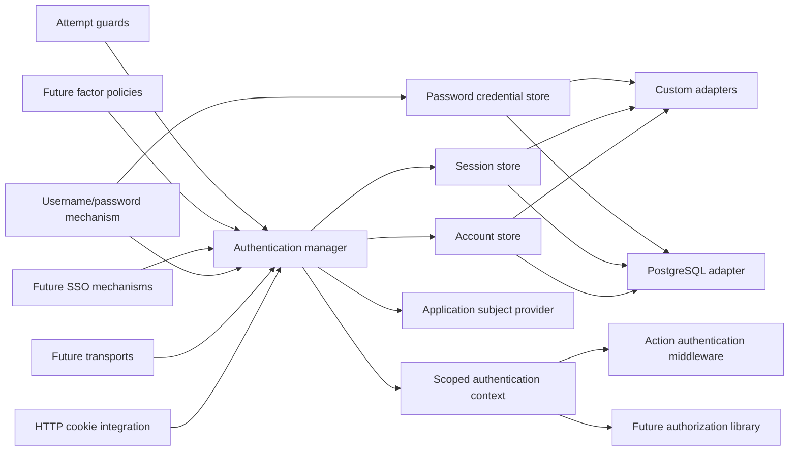
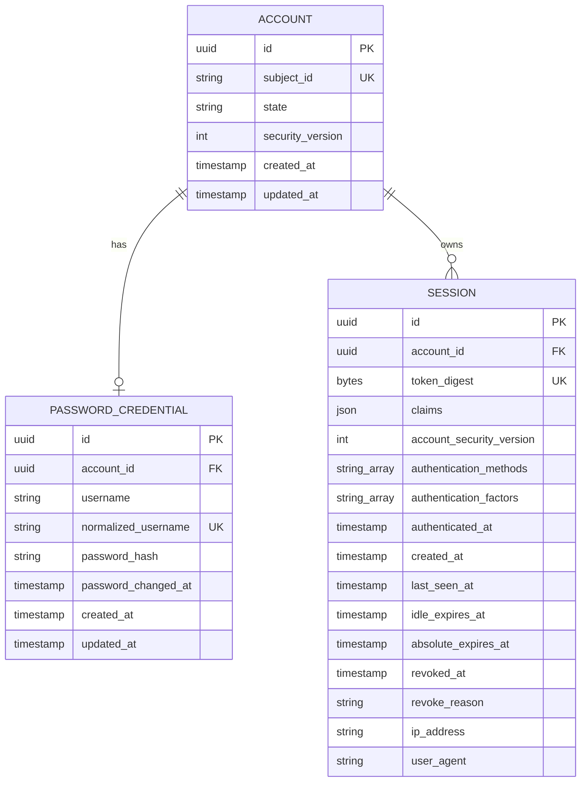
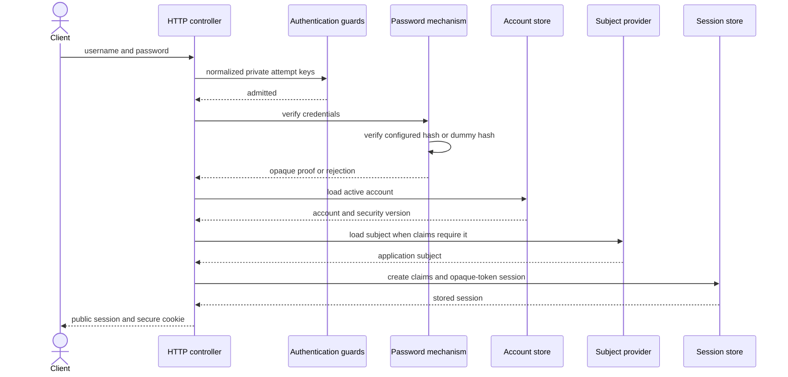
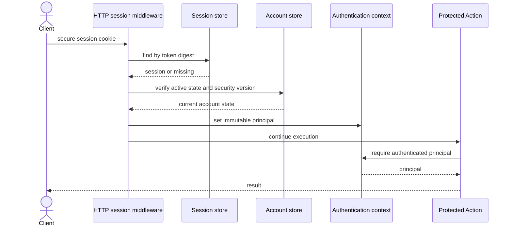
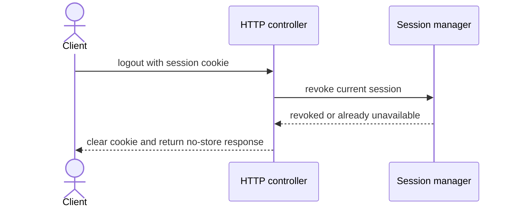

# Authentication

[Documentation](../README.md) · [Implementation index](./README.md) · [Usage guide](../usage/authentication.md)

The authentication library establishes who initiated an application execution and maintains that result across requests. It is transport-independent at its core, storage-independent through focused adapter contracts, and independent from the application's user model. HTTP cookies, PostgreSQL persistence, and username/password authentication are integrations around that core rather than assumptions embedded in it.

Authorization is a separate future library. Authentication produces a stable principal and authentication evidence; authorization decides what that principal may do.

## Goals

The library must:

- let the application define its own user class, object, repository, and lifecycle;
- support custom persistence while providing memory and PostgreSQL adapters;
- start with username/password authentication without making password authentication the core abstraction;
- provide secure, revocable, server-side sessions with validated custom claims;
- expose the authenticated principal through the current execution scope;
- protect transport-independent business operations through Action middleware;
- compose with the existing throttling, observation, logging, HTTP, dependency injection, and database libraries;
- leave explicit extension points for SSO, passkeys, OTP, multi-factor policies, step-up authentication, account administration, and session administration;
- remain convenient for the default PostgreSQL and HTTP-cookie use case.

## Non-goals for the first increment

The first increment does not provide:

- authorization roles, permissions, policies, or resource ownership decisions;
- user registration as a Kestrel-owned workflow;
- password reset or account recovery;
- email or username verification;
- SSO, OAuth, OIDC, SAML, passkeys, OTP, or multi-factor authentication;
- remembered devices, risk scoring, CAPTCHA, or third-party IP intelligence;
- a browser UI or client-side authentication state library;
- stateless JWT sessions;
- a universal plugin API capable of changing every authentication phase.

These features influence the stable concepts below, but their protocols and storage must be introduced only when implemented.

## Implementation status

The first increment described below is implemented. Kestrel now contains the storage-neutral contracts, scoped context and manager, memory and PostgreSQL adapters with a bundled schema, configurable password mechanism and Argon2id hasher, HTTP cookie integration, Action middleware, and privacy-preserving authentication throttling. The application supplies its user subject provider, configuration, provisioning Action, controllers, and one composite authentication provider.

The implementation deliberately stops before authorization, public registration, recovery, account administration, and session administration. Those capabilities remain the evolutions documented here rather than implicit behavior in the current API.

## Usage guide

For application setup and task-oriented examples, see the [Authentication usage guide](../usage/authentication.md).

## Public API

| API group | Main exports |
| --- | --- |
| Definition and composition | `defineAuthentication()`, `AuthenticationDefinition`, `AuthenticationProvider`, `authenticationConfigBase` |
| Runtime identity | `AuthenticationContext`, `AuthenticationManager`, `AuthenticationProof`, principal, account, subject, evidence and session-grant types |
| DI | authentication adapter, context, manager, subject provider, password mechanism and password hasher dependencies |
| Actions and enforcement | `createAuthenticationActions()`, sign-in input schemas and `requireAuthentication` |
| HTTP integration | cookie read/create/clear helpers, `createAuthenticationHttpControllers()`, `createAuthenticationHttpMiddleware()` |
| Password mechanism | `PasswordMechanism`, `DefaultUsernameNormalizer`, `PasswordHasher`, `UsernameNormalizer`, `Argon2idPasswordHasher` and related options/results |
| Attempt protection | `AuthenticationAttemptGuard`, `AllowAuthenticationAttemptGuard`, throttling guard/provider and rate-limit options |
| Errors | required, invalid-credential, rate-limited and untrusted-origin error classes |
| Bundled storage | memory and PostgreSQL adapters, PostgreSQL provider and schema/table exports |

## Adapter API

Authentication uses narrow capabilities so deployments can compose different stores:

- `AccountStore` creates and resolves authentication accounts, changes state and atomically increments the security version used to invalidate sessions.
- `SessionStore` creates, resolves, conditionally touches and revokes opaque server-side sessions. Touch must reject expired or stale state rather than resurrecting it.
- `SessionAccountResolver` is an optional single-snapshot optimization for colocated session and account storage; its result must be consistent enough to validate state and security version together.
- `PasswordCredentialStore` resolves normalized usernames, creates credentials and conditionally replaces a hash only when `previousHash` still matches.
- `AuthenticationAdapter` combines those capabilities for the bundled memory and PostgreSQL implementations, but the manager depends on focused ports.
- `SubjectProvider` is application-owned and resolves the current subject by the stable id stored on the account. Returning no subject makes authentication resolution fail closed.
- `PasswordHasher` hashes, verifies and identifies hashes needing upgrade. It must use a password-specific algorithm and avoid exposing comparison details through public errors.
- `AuthenticationAttemptGuard` admits or rejects a normalized attempt before credential verification and must not leak account existence.

Storage mutations must be atomic where their return values express conditional ownership or freshness. Adapter failures reject and remain distinguishable from invalid credentials; implementations must not turn backend failure into an authentication denial that looks authoritative. The detailed contracts and bundled implementations are described in [Storage contracts](#storage-contracts), [Memory adapter](#memory-adapter) and [PostgreSQL adapter and bundled schema](#postgresql-adapter-and-bundled-schema).

## Concepts and terminology

| Term | Meaning |
| --- | --- |
| Subject | The application-owned entity being authenticated. The first application subject is a user, but Kestrel does not define a `User` type. |
| Account | Authentication state associated with one subject, including whether authentication is enabled and the version that invalidates existing sessions. |
| Authenticator | A bound means of proving control of an account, such as a password credential, passkey, TOTP secret, or external identity. |
| Mechanism | A protocol that verifies one or more inputs and produces authentication evidence, such as username/password or an OIDC callback. |
| Factor | A category of evidence used by an authentication policy, such as knowledge, possession, or inherence. |
| Proof | Trusted internal evidence produced by a mechanism after verification. |
| Session | Server-side continuity state created after successful authentication. |
| Principal | The immutable identity and authentication metadata exposed to application code for one execution. |
| Claims | Application-defined, validated session data copied into the principal. |
| Assurance | Information about how and when authentication occurred, used later for step-up and authorization policies. |

An account aggregates the authenticators of one subject. Adding SSO or a passkey creates another authenticator or external identity associated with the same account; it does not create another application user by default.

## Design principles

### The application owns subjects

The library never defines or persists a `User` class. It uses a minimal subject contract at the authentication boundary:

```ts
export interface AuthenticationSubject {
  readonly id: string;
}

export interface SubjectProvider<Subject extends AuthenticationSubject> {
  // The application controls the concrete subject representation.
  findById(id: string): Promise<Subject | null>;
}
```

The initial canonical subject identifier is a string. The application currently uses UUID strings, while another application can serialize a numeric or external identifier to a stable string at this boundary. Expanding the public identifier type should wait for a concrete use case because identifiers are persisted in accounts, sessions, logs, and authorization decisions.

Subject loading is lazy. Resolving a valid session must not load a complete user record unless application code or claim validation needs it. The account remains the authoritative source for authentication enablement and session invalidation.

### Authentication state is not profile state

Application profile fields remain on the application user. Password hashes, external identities, session tokens, account disablement, authentication assurance, and authenticator lifecycle state live in the authentication domain. This separation prevents authentication concerns from turning the user table and user model into infrastructure objects.

### Narrow capabilities replace one universal adapter

The manager depends on focused storage contracts. A concrete adapter may implement several contracts, but callers receive only the capability they require. This lets a later deployment store accounts and credentials in PostgreSQL while storing sessions in Redis without changing the authentication manager.

### Proof construction is trusted

Public application inputs cannot construct an `AuthenticationProof`. Mechanisms receive an internal proof factory or return an opaque branded value. The authentication manager creates a session only from such a proof. Security guards and observers cannot manufacture or upgrade successful authentication.

### Explicit phases replace unrestricted hooks

The first version provides phase-specific policies, guards, and observers rather than a plugin API with unrestricted access to internal state. Ordering is part of the authentication contract and remains inspectable.

## Architecture



The core library must not import Fastify, PostgreSQL, application modules, or environment values. The HTTP and PostgreSQL integrations live below their respective library directories and implement core contracts.

## Public model

### Account

```ts
export type AuthenticationAccountState = "active" | "disabled";

export interface AuthenticationAccount {
  readonly id: string;
  readonly subjectId: string;
  readonly state: AuthenticationAccountState;
  readonly securityVersion: number;
  readonly createdAt: Date;
  readonly updatedAt: Date;
}
```

`disabled` prevents every mechanism from completing authentication and prevents existing sessions from resolving. External authentication responses must not reveal whether credentials were incorrect or the account was disabled.

`securityVersion` is monotonically incremented for events that must invalidate every existing session, including password replacement, account disablement, confirmed compromise, and an administrative revoke-all operation. Each session stores the version from its creation. A mismatch invalidates the session without requiring a synchronous update of every session row.

Temporary attempt throttling and IP exclusions do not belong on the account record. They are admission controls with different keys, expiration, and storage behavior. A later deliberate account-locking feature can introduce explicit lock state without overloading `disabled`.

### Authentication proof and assurance

```ts
export interface AuthenticationEvidence {
  readonly method: string;
  readonly factors: readonly string[];
  readonly authenticatedAt: Date;
}

export interface AuthenticationProof {
  readonly accountId: string;
  readonly evidence: AuthenticationEvidence;
  // The real contract carries an internal brand that application input cannot create.
}
```

The username/password mechanism initially emits method `password` and factor `knowledge`. Future mechanisms may be multi-step before producing a proof. Multi-factor authentication is a policy that requires sufficient evidence before session creation; it is not modeled as one more parallel sign-in method.

The first assurance model records method names, factors, and authentication time. A later version can add an application-defined or standard assurance level without reinterpreting existing data.

### Principal and execution context

```ts
export interface AuthenticatedPrincipal<Claims> {
  readonly accountId: string;
  readonly subjectId: string;
  readonly sessionId: string;
  readonly claims: Readonly<Claims>;
  readonly authentication: {
    readonly methods: readonly string[];
    readonly factors: readonly string[];
    readonly authenticatedAt: Date;
  };
}

export type AuthenticationContext<Claims> =
  | {
      readonly state: "anonymous";
    }
  | {
      readonly state: "authenticated";
      readonly principal: AuthenticatedPrincipal<Claims>;
    };
```

The explicit anonymous state avoids using `undefined` for both "not resolved yet" and "resolved without a session". The context is scoped to one execution. The HTTP integration resolves it at most once and application code observes an immutable result for the remainder of that execution.

The library exports a typed dependency descriptor created by the application-specific authentication definition. Actions and future authorization middleware depend on that descriptor rather than importing a global context or container.

The context can lazily resolve the complete subject through a separate service when required. The principal itself never embeds the application user object because it must stay small, immutable, and safe to pass across Kestrel boundaries.

## Session claims

The application declares the claims schema and the function that creates claims after authentication:

```ts
const sessionClaimsSchema = z.object({
  role: z.enum(["member", "moderator", "admin"]),
});

const authentication = defineAuthentication({
  subjectProvider: userSubjectProviderDependency,
  sessionClaims: {
    schema: sessionClaimsSchema,
    create: async ({ subject }) => ({
      role: subject.role,
    }),
  },
});
```

Claims must be JSON-compatible, schema-validated before storage, schema-validated after loading, and bounded by a configurable encoded size. Invalid persisted claims fail closed and invalidate the session. Claims must not contain passwords, session tokens, authenticator secrets, external provider tokens, or unnecessary personal data.

Claims are snapshots, not automatically authoritative application state. For the first increment, an application changing a security-relevant claim such as a role must revoke the subject's sessions or increment the account security version in the same workflow. A future claims-version resolver may allow selective refresh without invalidating complete sessions, but it must define consistency, failure, and storage-cost semantics before being introduced.

The authentication library deliberately has no built-in `role` or `permissions` field. Authorization may consume custom claims as a cache or coarse input, but it remains responsible for authoritative decisions and freshness requirements.

## Authentication context and authorization

The future authorization library depends only on the principal contract:

- `subjectId` identifies the application entity;
- claims carry application-selected session facts;
- authentication methods, factors, and time support step-up or freshness requirements;
- `accountId` and `sessionId` support audit and administration.

Authorization must not inspect password credentials, cookies, raw session tokens, or authentication adapters. Authentication middleware answers "is there a valid principal?"; authorization middleware answers "may this principal execute this operation on this resource?".


## Storage contracts

The base contracts are asynchronous even for the memory adapter.

```ts
export interface AccountStore {
  findById(id: string): Promise<AuthenticationAccount | undefined>;
  findBySubjectId(subjectId: string): Promise<AuthenticationAccount | undefined>;
  createAccount(input: CreateAuthenticationAccount): Promise<AuthenticationAccount>;
  setState(input: SetAuthenticationAccountState): Promise<AuthenticationAccount | undefined>;
  incrementSecurityVersion(accountId: string): Promise<number | undefined>;
}

export interface SessionStore {
  create(input: CreateStoredSession): Promise<StoredSession>;
  findByTokenDigest(tokenDigest: Uint8Array): Promise<StoredSession | undefined>;
  touch(input: TouchStoredSession): Promise<StoredSession | undefined>;
  rotate(input: RotateStoredSession): Promise<RotatedStoredSession | undefined>;
  revoke(input: RevokeStoredSession): Promise<boolean>;
  revokeAllForAccount(input: RevokeAccountSessions): Promise<number>;
  listForAccount(input: ListAccountSessions): Promise<readonly StoredSession[]>;
}

export interface PasswordCredentialStore {
  findByNormalizedUsername(
    normalizedUsername: string,
  ): Promise<PasswordCredential | undefined>;
  create(input: CreatePasswordCredential): Promise<PasswordCredential>;
  replaceHash(input: ReplacePasswordHash): Promise<boolean>;
}
```

The exact create and update inputs belong to their contracts and contain only logical values. They do not expose Drizzle tables, SQL fragments, Redis commands, or transport objects.

Conditional mutations use the previous version or hash identity where needed so concurrent password upgrades, revocations, and rotations do not overwrite newer state. Revocation is idempotent. Adapter failures fail closed and are never interpreted as missing credentials or anonymous sessions without diagnostic reporting.

Optional maintenance capabilities, such as bounded pruning of expired sessions, are separate interfaces. A provider contributes scheduled maintenance only when its selected adapter implements the required capability.

## Adapter composition

The default composition should remain concise:

```ts
app.register(
  new ApplicationAuthenticationProvider(app.config.authentication),
);
```

The application provider composes the PostgreSQL adapter, user subject provider, authentication throttling guard, selected password hasher, and Kestrel core provider. Generic database and throttling providers remain separate because they are shared application infrastructure.

Advanced applications may pass one optional child `customization` provider. Its registrations are applied after the defaults and before the core services, allowing focused stores, the subject provider, or guards to be replaced without expanding the ordinary application composition. The composite provider relays child `boot` hooks explicitly because internal children are not registered independently in the application lifecycle.

A custom composition supplies an adapter factory or registered dependencies implementing the same focused stores. The core provider does not instantiate PostgreSQL by default and does not require a dependency named `database` unless the PostgreSQL adapter is selected.

## Memory adapter

The memory adapter supports Kestrel unit tests and explicitly process-local applications. It implements the same atomic semantics as far as one JavaScript process permits, including conditional rotation, security-version checks, expiration, and idempotent revocation.

It must not be presented as a distributed production session store. Restarting the process loses accounts, credentials, and sessions, and multiple processes do not share state.

Every concrete adapter lives in its own directory with its implementation, tests, public exports, and adapter-specific supporting files.

## PostgreSQL adapter and bundled schema

The PostgreSQL adapter provides conventional tables in a dedicated schema named `authentication`. The application statically re-exports them from its aggregate Drizzle schema so Drizzle Kit and the typed database client discover them, but it does not redefine them.

`account.subject_id` is unique text without an application foreign key. This preserves the core `string` subject contract and prevents the Kestrel schema from importing or assuming an application member table, UUID identifiers, or user deletion policy. Subject existence is enforced by the application subject provider and provisioning workflow.

The adapter still accepts an optional typed table mapping for applications that deliberately own a different physical schema. The bundled tables are the default used by `PostgresAuthenticationAdapterProvider` when no mapping is supplied.

The initial logical schema is:



The bundled Kestrel tables use:

- `authentication.account`, with one account per opaque application subject identifier;
- `authentication.password_credentials`, with at most one password credential per account in the first increment;
- `authentication.session`, with any number of active or historical sessions per account.

The first application can choose hard deletion or retained revoked rows through explicit retention configuration. Active lookup indexes must cover token digest, account sessions, expiration pruning, and unique normalized usernames. Raw session tokens are never persisted.

Future authenticators use specialized tables such as `federated_identities`, `webauthn_credentials`, `totp_authenticators`, and `recovery_codes`. A generic JSON credential table is intentionally avoided because secrets, uniqueness rules, indexes, protocol state, and lifecycle operations differ between mechanisms.

## Username/password mechanism

### Username handling

The mechanism receives a `UsernameNormalizer`. The default implementation trims the input, applies Unicode NFKC normalization, and performs case folding suitable for the supported identifier policy. The normalized value is used for lookup and uniqueness; the original validated username is retained for display.

Normalization behavior becomes persistent identity semantics and therefore must be versioned or migrated if changed. Length limits are applied before expensive work. The external sign-in response never reveals whether a normalized username exists.

If the application later wants both email and username sign-in, it should model login identifiers deliberately rather than treating email as an undocumented alternate username.

### Configurable password hashing

Password hashing is selected through a replaceable contract. The authentication library does not hard-code Argon2id or inspect an environment value to select an algorithm.

```ts
export interface PasswordHasher {
  readonly id: string;

  // Hash output includes the algorithm and parameters required for verification.
  hash(password: string): Promise<string>;

  verify(password: string, encodedHash: string): Promise<boolean>;

  needsRehash(encodedHash: string): boolean;

  // A stable dummy hash makes missing-user verification follow the expensive path.
  getDummyHash(): Promise<string>;
}
```

The application selects a concrete hasher through configuration or dependency composition. Algorithm-specific settings belong to the selected hasher configuration. A built-in Argon2id hasher is the recommended default for the initial application, with memory, passes, parallelism, salt length, output length, and optional pepper dependency configured explicitly. Its parameters are calibrated against deployment hardware and bounded by safe validation.

`Argon2idPasswordHasher` applies a separate `verificationLimits` policy to parameters parsed from stored hashes. Before base64url decoding or key derivation, it rejects an encoded hash longer than 1,024 ASCII characters, memory above 256 MiB, more than 10 passes, parallelism above 16, or a salt or tag above 64 bytes. The application exposes these ceilings through the `APP_CONFIG__AUTHENTICATION__MECHANISMS__PASSWORD__HASHING__ARGON2ID__VERIFICATION_LIMITS__*` environment variables shown in `.env.example`. Applications can lower or deliberately raise each ceiling independently from the preferred parameters used for new hashes, but construction fails when the selected creation parameters would produce a hash outside the verification policy. A rejected hash behaves like any malformed hash: `verify()` returns `false` and `needsRehash()` returns `true`.

These ceilings are resource-admission limits, not recommendations for newly created hashes. Keeping them separate allows supported older parameters to remain verifiable and rehashable during a gradual migration. A future multi-policy or multi-tenant deployment can select distinct hasher instances when one process-wide verification budget is insufficient; the stored format does not need to change.

Other implementations, such as scrypt or PBKDF2 for a required compliance profile, can implement the same contract. Hashes use a self-describing encoded format so existing passwords remain verifiable after a configuration change. Successful authentication calls `needsRehash()` and conditionally replaces an obsolete hash without changing the public sign-in result.

The hasher is asynchronous. Synchronous password hashing must not block the Node.js event loop. Pepper material, when used, is supplied by an application secret dependency, is not stored beside hashes, and supports an explicit rotation strategy. Algorithm identifiers and parameters may be observed; passwords, hashes, salts, peppers, and derived keys may not.

The initial recommended Argon2id settings must meet or exceed the current OWASP baseline of 19 MiB memory, two passes, and parallelism one, then be calibrated. This is a default policy recommendation, not a restriction in the core interface.

### Verification behavior

Password authentication follows these rules:

- unknown username, incorrect password, disabled account, missing subject, and invalid security state have one generic external failure;
- an unknown username verifies against the configured hasher's stable dummy hash;
- comparisons are performed by the hasher and never by application string equality;
- a successful password check does not create a session until account and subject policies pass;
- a hash upgrade is conditional so it cannot overwrite a concurrent password change;
- passwords and encoded hashes never enter errors, logs, observations, execution context, Action output exposed to clients, or throttling keys.

Password creation policy is application-configurable and distinct from hashing. Minimum length is enforced when provisioning or changing a credential, not while verifying an existing stored hash: sign-in accepts any non-empty password up to the configured verification bound so legacy credentials and explicit local seed credentials remain usable. The initial creation policy should favor sufficient length, allow password-manager-generated values and Unicode, reject known-compromised values when such a service is configured, and avoid arbitrary composition rules.

## Authentication pipeline

The manager executes phases in a stable order:

1. validate and normalize public input;
2. derive privacy-preserving attempt keys;
3. run pre-verification guards such as IP and username throttling;
4. load the mechanism-specific authenticator;
5. verify the presented secret, including dummy verification when no credential exists;
6. record the mechanism result with internal diagnostic detail;
7. load and validate the account and optional subject;
8. run account and factor policies;
9. create application claims;
10. create a new session and raw client token;
11. publish a sanitized success event;

Failure observers receive a bounded reason category for operations and security monitoring. They cannot change the result. Public errors remain generic except for controls that intentionally communicate a different action, such as a bounded `429 Too Many Requests` response.

The first mechanism can implement one-step verification while the manager result reserves a continuation state for protocols that need a redirect, challenge, or second factor:

```ts
export type AuthenticationAttemptResult<Challenge, Claims> =
  | { readonly status: "rejected" }
  | { readonly status: "continuation"; readonly challenge: Challenge }
  | { readonly status: "authenticated"; readonly grant: SessionGrant<Claims> };
```

The continuation payload is mechanism-specific and schema-validated. The first increment does not expose it until a real multi-step mechanism is implemented.

## Throttling and security layers

Username/password authentication composes with the existing throttling library through an authentication-specific guard. It evaluates at least two independent constraints:

- a normalized-username constraint limiting distributed attacks against one account;
- an IP constraint limiting one source attacking many accounts.

A single combined `IP + username` key is insufficient because each new pair creates another bucket. Both independent constraints must admit the request. Additional global, network, device, or risk constraints may be introduced later.

Normalized usernames are transformed with a keyed digest before they enter throttling keys, logs, or observations. This prevents operational stores from becoming username directories. IP addresses are treated as personal and potentially spoofable metadata, retained only according to application policy. IP restrictions are controls and risk signals, not hard session binding, because legitimate client addresses change and many users share addresses.

Successful authentication resets or relaxes account-attempt state only through an explicit throttling policy. Storage failures follow the configured fail-closed security policy. Responses do not identify the constraint that rejected an attempt or expose precise remaining quotas useful for scheduling attacks.

The authentication manager defines phase-specific guard contracts so future temporary IP exclusion, CAPTCHA, risk scoring, or device policy can be added without modifying the password verifier.

## Stateful sessions

The first version uses revocable server-side sessions with an opaque client token. JWT and other stateless sessions are deliberately deferred because immediate revocation, account administration, claim changes, and per-device session management are primary requirements.

### Token model

Session creation generates a cryptographically secure random token containing at least 256 bits of entropy. The raw token is returned once in a `SessionGrant` to the transport integration. Persistence receives only a fixed-length digest. A database read therefore does not reveal directly usable bearer tokens.

The token is never accepted from a URL or request body. HTTP receives it only from the configured cookie. It is never logged, observed, serialized into an error, or returned in a public response body.

Lookup validates token encoding and length before computing its digest. Unknown, malformed, expired, revoked, and version-mismatched tokens all resolve to the anonymous context while producing appropriately sanitized internal instrumentation.

### Expiration

Every session has:

- an idle expiration, extended after meaningful use according to a configured refresh interval;
- an absolute expiration, never extended without reauthentication;
- an optional freshness limit used by future sensitive-operation middleware;
- revocation state retained according to the selected adapter's policy.

The session store is not written on every request. `lastSeenAt` and idle expiration are touched only after a configurable update interval. Touching is conditional and cannot revive a revoked, absolutely expired, or security-version-mismatched session.

All expiration decisions use adapter-authoritative time where practical for distributed stores. Manager clocks remain injectable for memory tests. A storage failure while resolving or touching a session fails closed rather than authenticating with stale unverifiable state.

### Rotation and revocation

Session identifiers are rotated after authentication, step-up authentication, or a privilege-level transition. The old token becomes unusable atomically with creation of the replacement. A later token-family model may detect replay during refresh, but the first opaque browser session does not need refresh-token semantics.

The manager supports:

- revoking the current session;
- listing sessions for the authenticated account;
- revoking one selected session;
- revoking every session for an account;
- invalidating all sessions through an account security-version increment.

Administrative operations and self-service operations will later apply distinct authorization policies even when they call the same manager capability.

## HTTP integration

The HTTP integration owns cookie parsing and rendering but not account or session persistence. Cookie configuration is resolved by the application and contains no environment lookup inside Kestrel.

The recommended production cookie has:

- a `__Host-` name when deployment topology permits it;
- `HttpOnly` enabled;
- `Secure` enabled;
- `SameSite=Lax` or `SameSite=Strict` selected explicitly;
- `Path=/`;
- no `Domain` attribute;
- no client-readable identity or claims.

Local non-HTTPS behavior is enabled only by explicit application configuration such as `secure: false` or `devMode: true`; the library never infers it from `NODE_ENV` or another environment variable.


Responses that create or rotate session tokens use `Cache-Control: no-store`. Logout revokes server state before clearing the cookie where possible; it still clears an invalid or already-revoked client cookie. Secure headers and trusted-proxy IP resolution remain HTTP runtime responsibilities configured by the application.

### Session resolution

The HTTP session middleware has optional and required forms:

- `optionalSession` resolves a cookie when present and otherwise continues anonymously;
- `requiredSession` performs the same resolution and raises a representable authentication error when no valid principal exists.

Resolution is cached in the scoped authentication context so nested Actions and multiple middleware do not repeatedly query session storage. Public sign-in endpoints do not require an existing session but may revoke or rotate an existing valid session according to explicit policy.

Session and account stores remain separate capabilities so deployments may place them in different backends. An adapter that colocates both may additionally implement `SessionAccountResolver`; the manager then reads the session and current account state from one storage snapshot. The PostgreSQL adapter uses this optimization with one indexed join, while independently supplied stores retain the generic two-read path. Permission resolution remains a separate authorization concern.


## Action and controller integration

Authentication use cases are Actions so they remain observable, testable, transaction-aware, and invocable from future transports. The application owns their catalog placement and public routes. Kestrel factories may provide conventional definitions without registering hidden application endpoints.

The initial application catalog contains:

- a password sign-in Action;
- a sign-out Action;
- a current-session query Action;
- session listing and targeted self-revocation only if they are included in the first administration scope.

The password sign-in Action receives logical credentials and a bounded attempt context containing transport-derived metadata such as IP address and user agent. A custom HTTP controller adapter supplies that context without exposing it as caller-controlled body input. The Action returns an internal `SessionGrant`; the HTTP controller writes the cookie and returns only a public, validated session representation.

The raw token inside `SessionGrant` is sensitive. It must not be attached to execution context, included in observations, passed through generated public clients, or exposed by error diagnostics.

`requireAuthentication` is Action middleware. It reads the scoped context and rejects anonymous execution, independently of HTTP. Direct application calls start anonymously unless the caller deliberately creates an execution with an authenticated context through a future trusted API. Tests inject the scoped context explicitly.

## Sign-in sequence



Every rejected credential path performs the configured expensive verification before returning the same public invalid-credentials representation, subject to pre-verification throttling.

## Authenticated request sequence



An expired, revoked, malformed, unknown, disabled, or version-mismatched session produces an anonymous context. Required middleware converts that state to the common unauthenticated error.

## Logout sequence



Logout is idempotent and does not reveal whether a stolen or expired token previously identified a session.

## Account provisioning

The Kestrel authentication library does not create application users. The application defines an Action that coordinates:

1. user creation or selection;
2. authentication account creation;
3. password credential creation using the selected hasher;
4. any application event or welcome workflow.

When the application user and authentication tables share PostgreSQL, the Action performs expensive password hashing before opening an explicit database transaction, verifies the existing subject, then creates the account and credential atomically. `CreateAuthenticationAccount.state` optionally selects the initial `active` or `disabled` state and defaults to `active`; this supports activation workflows without briefly exposing a usable account. A custom adapter in another system cannot assume that transaction; its application workflow must define compensation or an explicit provisioning protocol.

Deleting a user, disabling sign-in, and deleting authentication data are separate policies. The bundled schema intentionally has no foreign key from an account to an application subject, so deleting a user cannot silently cascade into security records. The application must coordinate deletion or retention explicitly.

## Configuration

The authentication configuration is resolved by the application and validated through the Kestrel configuration library. It contains behavior abstractions rather than environment access. The first increment needs settings equivalent to:

```ts
export interface AuthenticationConfig {
  readonly session: {
    readonly tokenBytes: number;
    readonly idleTtlSeconds: number;
    readonly absoluteTtlSeconds: number;
    readonly touchIntervalSeconds: number;
    readonly maxClaimsBytes: number;
  };
  readonly http: {
    readonly cookie: {
      readonly name: string;
      readonly secure: boolean;
      readonly sameSite: "lax" | "strict";
      readonly path: string;
    };
    // Additional origins for deliberately separate browser clients.
    readonly trustedOrigins: readonly string[];
  };
  readonly mechanisms: {
    readonly password: {
      readonly minLength: number;
      readonly maxLength: number;
      readonly hashing: {
        readonly algorithm: "argon2id";
        readonly argon2id: {
          readonly memoryKiB: number;
          readonly passes: number;
          readonly parallelism: number;
          readonly saltBytes: number;
          readonly tagBytes: number;
          readonly verificationLimits: {
            readonly maxEncodedHashChars: number;
            readonly maxMemoryKiB: number;
            readonly maxPasses: number;
            readonly maxParallelism: number;
            readonly maxSaltBytes: number;
            readonly maxTagBytes: number;
          };
        };
      };
    };
  };
  readonly security: {
    readonly throttling: {
      readonly keySecret: string;
      readonly username: {
        readonly requests: number;
        readonly perSeconds: number;
      };
      readonly ip: {
        readonly requests: number;
        readonly perSeconds: number;
      };
    };
  };
}
```

The generic Kestrel contract owns `session`, `http`, and the password policy below `mechanisms.password`. The application extends that validated base with the selected hasher configuration and `security.throttling`, keeping every authentication setting below the single `authentication` contribution. Hasher-specific validation remains owned by the selected implementation. The core library does not name application environments.

Configuration validation rejects unsafe or nonsensical combinations, including too-short tokens, non-positive TTLs, idle TTLs beyond absolute TTLs, claims limits beyond the adapter's capability, insecure `__Host-` cookie combinations, and empty trusted origins when cookie-authenticated unsafe HTTP operations are enabled.

## Errors

The library exposes typed operational errors while preventing credential enumeration:

| Internal condition | Public behavior |
| --- | --- |
| Unknown username | Generic invalid credentials |
| Incorrect password | Generic invalid credentials |
| Disabled account | Generic invalid credentials for sign-in; anonymous for session resolution |
| Missing subject | Generic invalid credentials and an operational diagnostic |
| Invalid or expired session | Anonymous context or common authentication-required error |
| Throttled attempt | Generic rate-limited representation |
| Invalid input shape | Normal Kestrel validation error |
| Storage or hasher failure | Safe service failure; never invalid credentials |

Storage failures must remain distinguishable internally from negative authentication results. Treating an unavailable database as an incorrect password would hide incidents and can create inconsistent security behavior.

## Observability, events, and privacy

Authentication instrumentation is storage-neutral and records one terminal event for an attempt or session operation. The application provider bridges it to the current observer when one exists.

Useful fields include:

- operation and mechanism;
- admitted, rejected, authenticated, revoked, expired, or failed result;
- public account or session identifier only after successful resolution and according to privacy policy;
- authentication methods and factors;
- duration and throttling category without exact quota state;
- hashed or redacted network and username correlation keys when explicitly enabled.

Instrumentation never includes passwords, password hashes, salts, peppers, raw tokens, token digests, external provider tokens, OTP values, recovery codes, complete cookies, or complete request bodies. Error messages authored inside authentication must also avoid these values because execution failures can be retained by observations.

Domain events such as `authentication.succeeded`, `authentication.failed`, `session.created`, `session.revoked`, and `account.disabled` may support notifications and audit later. Their schemas must separate durable business events from high-volume instrumentation and must define which identifiers are safe to retain.

## Provider and dependency lifetimes

The authentication definition and manager are singleton configuration and orchestration objects. Stores backed by the application database can use the scoped database manager so they join an active Action transaction. The authentication context is scoped. Password hashers are normally singleton and stateless; a pepper dependency may be a singleton secret handle rather than exposed bytes.

The provider registers factories lazily. Minimal CLI maintenance commands must not initialize authentication storage unless their handlers resolve it. HTTP-specific extensions are mounted only by the HTTP runtime.

The application owns adapter selection at composition time. The provider may expose protected factories for application specialization, consistent with other Kestrel providers, but a custom adapter must not require subclassing the complete authentication manager.

## Testing strategy

### Core unit tests

Core tests use fake focused stores and injected clocks. They cover:

- anonymous and authenticated context state;
- claims validation and size limits;
- generic failure behavior across credential and account states;
- stable phase ordering;
- security-version invalidation;
- idle and absolute expiration;
- touch coalescing;
- token rotation and idempotent revocation;
- storage and hasher failure propagation;
- sanitization of instrumentation;
- concurrent mutation semantics.

Tests remain compatible with Vitest `--no-isolate`: clocks, globals, timers, listeners, and resources are injected or explicitly restored, and modules contain no mutable test state.

### Password mechanism tests

Password tests cover normalization, duplicate normalized usernames, dummy verification, configurable hashers, automatic rehash, concurrent password replacement, maximum input size, and secret-free errors and instrumentation. Algorithm-specific hashers have known-vector and parameter-validation tests in their own directories.

Expensive production parameters are not used in every unit test. The implementation uses a test hasher or explicitly reduced test parameters while retaining separate verification that production configuration satisfies configured safety bounds.

### Adapter contract tests

A reusable adapter conformance suite runs against memory and PostgreSQL adapters. PostgreSQL tests use the Kestrel database and isolated transactions or connection-local temporary objects where possible. They verify unique identities, atomic rotation, concurrent revocation, expiration, pruning, and conditional hash replacement.

### Application integration tests

Application tests use `fastify.inject()` and do not start a server. They cover account provisioning, sign-in cookie attributes, Origin validation, authenticated requests, generic credential failures, throttling, logout, session invalidation after account changes, and transaction rollback. App tests exercise app wiring and behavior; Kestrel-only behavior stays in the relevant Kestrel library.

## Initial file structure

```text
packages/kestrel/src/authentication/
  adapters/
    memory/
      adapter.ts
      adapter.test.ts
      index.ts
    postgres/
      adapter.ts
      adapter.test.ts
      schema.ts
      index.ts
  mechanisms/
    password/
      hashers/
        argon2id/
          hasher.ts
          hasher.test.ts
          index.ts
      credential_store.ts
      mechanism.ts
      mechanism.test.ts
      normalization.ts
      index.ts
  http/
    cookie.ts
    middleware.ts
    controllers.ts
    index.ts
  account.ts
  configuration.ts
  context.ts
  dependencies.ts
  errors.ts
  manager.ts
  observations.ts
  provider.ts
  session.ts
  types.ts
  index.ts

src/server/authentication/
  actions/
  config/
  providers/
```

Exact splitting should follow actual cohesion discovered during implementation. Public exports remain explicit, and adapter-specific types are exported from their adapter directory before the library root selectively re-exports them.

## Initial application decisions

The Kestrel contracts and adapters can be implemented independently from product policy. Completing application integration requires explicit choices about provisioning and protection. Unless the application specifies otherwise, the first increment uses these conservative defaults:

| Decision | Proposed initial behavior | Reason |
| --- | --- | --- |
| Sign-in identifier | Store a distinct username on `authentication.password_credentials`; do not silently treat the current user email as a username. | Username and email have different normalization, verification, change, and privacy semantics. |
| Existing users | Do not create credentials implicitly for existing rows. Add deterministic test/seed accounts through an explicit application provisioning workflow. | Kestrel cannot invent passwords or decide which users may authenticate. |
| Public registration | Do not expose public password registration. Provision accounts through an application Action that can later be protected by administration or registration policy. | Registration, invitation, verification, and abuse controls are product workflows rather than authentication primitives. |
| Initial claims | Use an empty claims object until the application introduces a real role or other session fact. `subjectId`, `accountId`, and `sessionId` remain available on the principal. | The current user model has no authoritative role field, and inventing one would couple authentication to unfinished authorization design. |
| Existing business routes | Do not silently protect or expose different behavior on existing user and debate routes. Add the middleware and authentication endpoints, then select protected business Actions explicitly. | Authentication changes API behavior and must not imply authorization policy. |
| Authentication routes | Use application-owned routes for password sign-in, sign-out, and current-session inspection under one configurable prefix. | The routes remain visible to the application catalog and generated clients. |
| User deletion | Restrict deletion while an account exists until retention and cascade policy is chosen. | Accidental cascading deletion of security and audit state is harder to recover than explicit cleanup. |
| Cookie | Prefer `__Host-session` in secure deployments and use an explicitly configured non-secure local variant. | Kestrel does not infer deployment security from an environment variable. |
| Session administration | Implement manager capabilities and storage semantics first; defer public list/revoke-other-session endpoints until their authorization and presentation scope is selected. | The storage model should support administration without prematurely exposing an API. |

These defaults are sufficient to complete a secure technical integration without defining application authorization. They should be revisited before presenting authentication as a finished user-facing registration and account-management feature.

## First increment

The first implementation increment includes:

1. core subject, account, proof, principal, claims, context, and store contracts;
2. authentication manager phase ordering and safe errors;
3. memory account and session adapter sufficient for core tests;
4. stateful opaque-token sessions with idle and absolute expiration, conditional touch, and revocation;
5. configurable `PasswordHasher` and the recommended Argon2id implementation;
6. username/password credentials and mechanism, including dummy verification and conditional rehash;
7. PostgreSQL account, password credential, and session adapter with bundled tables and optional custom mappings;
8. HTTP cookie integration, trusted-origin validation, optional and required session middleware;
9. password sign-in, sign-out, and current-session Action/controller factories;
10. integration with the existing throttling library for independent username and IP constraints;
11. application schema aggregation, configuration, subject provider, catalog, provider composition, and provisioning workflow;
12. Kestrel, adapter, and application integration tests;
13. documentation of implemented behavior and retained evolutions.

Session administration can be included only after the basic lifecycle is complete. Authorization is the next separate library and is not implemented implicitly inside `requiredSession`.

## Potential evolutions

The initial contracts intentionally retain room for:

- OIDC and SAML redirects, callbacks, state, nonce, and external identity linking;
- WebAuthn/passkeys with phishing-resistant authentication evidence;
- email or SMS OTP, magic links, and bounded one-time challenge storage;
- TOTP and recovery codes as additional factors rather than independent account models;
- multi-factor and step-up policies based on factors, assurance, freshness, operation, and risk;
- password reset, compromised-password checks, username verification, and recovery workflows;
- account linking with explicit proof and collision policy;
- session families, replay detection, device labels, remembered devices, and risk history;
- selective claims refresh through versioned claims policies;
- Redis or dedicated session adapters and split adapter composition;
- stateless or hybrid sessions only when their revocation and freshness tradeoffs are explicitly accepted;
- self-service and administrative account/session management protected by authorization;
- security notifications and durable audit trails with retention and privacy policies;
- authentication-aware Studio tooling that never displays secrets;
- key and pepper rotation through an application secret-management abstraction;
- adapter-specific cancellable deadlines and availability policies;
- tenant-aware account and username namespaces when a multi-tenant requirement exists.

These evolutions must add explicit capabilities rather than changing the meaning of the first account, session, principal, or storage contracts.

## Security references

- [OWASP Authentication Cheat Sheet](https://cheatsheetseries.owasp.org/cheatsheets/Authentication_Cheat_Sheet.html)
- [OWASP Credential Stuffing Prevention Cheat Sheet](https://cheatsheetseries.owasp.org/cheatsheets/Credential_Stuffing_Prevention_Cheat_Sheet.html)
- [OWASP Password Storage Cheat Sheet](https://cheatsheetseries.owasp.org/cheatsheets/Password_Storage_Cheat_Sheet.html)
- [OWASP Session Management Cheat Sheet](https://cheatsheetseries.owasp.org/cheatsheets/Session_Management_Cheat_Sheet.html)
- [NIST SP 800-63B Authentication and Authenticator Management](https://pages.nist.gov/800-63-4/sp800-63b.html)
