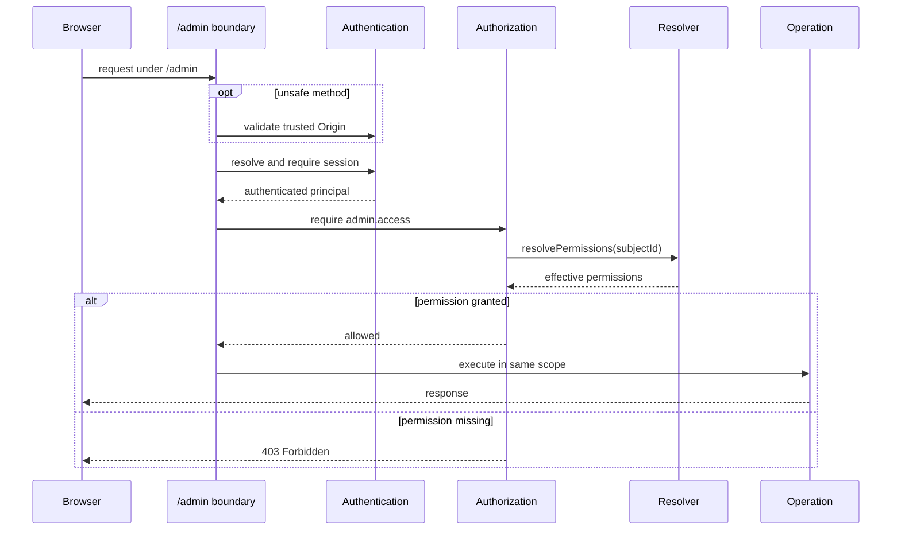

# Private authorization integration

Historical design record for the public Atlas library. See [Atlas usage](../usage/atlas.md) for application recipes.

## Complete administration boundary

The first protected resource is one logical boundary:

```text
/admin
/admin/
/admin/*
```

Every route owned below this boundary is protected, including current and future:

- SPA documents and client-side route fallbacks;
- manifest and configuration endpoints;
- resource queries;
- mutation operations;
- record Actions;
- error and fallback routes that could otherwise reveal route structure;
- any later administration endpoint added below the same base path.

Protection is configured once on `AtlasProvider` for its complete `basePath`. It must not rely on developers remembering to attach middleware to each generated endpoint. The provider owns the prefix exclusively and applies the configured access chain whenever it creates a route below it.

Kestrel-level client assets served from a separate internal asset prefix may remain public because they contain executable client code but no application manifest, records, credentials, or authorization state. If assets are ever moved below `/admin/`, they inherit the same boundary automatically.

### Atlas provider evolution

`AtlasProvider` receives generic HTTP access middleware without importing authorization:

```ts
new AtlasProvider(viteAtlasClient({}), {
  atlas: applicationBackoffice,
  access: {
    required: [
      applicationAuthenticationHttp.middleware.requiredSession,
      requireHttpAuthorization(permission(adminAccess)),
    ],
    unsafe: [
      applicationAuthenticationHttp.middleware.trustedOrigin,
    ],
  },
});
```

`required` applies to the exact base path and every descendant. `unsafe` additionally applies to state-changing methods. The resulting selected order for unsafe requests is:

1. validate the request Origin;
2. resolve and require a valid authentication session;
3. require `admin.access`;
4. execute the administration operation.

Safe top-level navigation may omit an `Origin` header, so the Origin requirement is not applied indiscriminately to GET and HEAD requests.

Every protected route must run through a normal application execution scope. This preserves scoped authentication and authorization contexts, observations, error handling, and disposal. The provider must not authorize a request in one scope and execute its operation in an unrelated scope.

### Administration request sequence



### Expected HTTP behavior

| Situation | Result |
| --- | --- |
| Missing, malformed, expired, or revoked session on `/admin/api/*` or an unsafe request | 401 Unauthorized |
| Missing, malformed, expired, or revoked session on an administration document | 302 redirect to `/admin/login` with a bounded `returnTo` |
| Valid authenticated subject without `admin.access` | 403 Forbidden |
| Valid subject with `admin.access` | Continue |
| Unsafe request with an untrusted or missing Origin | 403 Forbidden before the operation |
| Permission resolver unavailable | Safe operational failure; never continue |
| Client hides an operation but server permission is missing | 403; client presentation is not authoritative |

The Kestrel-owned client now provides the sign-in page and anonymous document redirect. API errors remain machine-readable and an authenticated subject without `admin.access` still receives `403`; a dedicated access-denied screen remains a later UX improvement.

