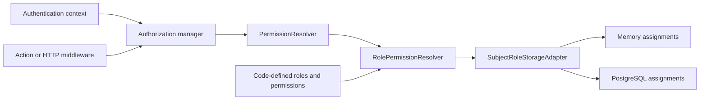

# Authorization

[Documentation](../README.md) · [Implementation index](./README.md) · [Usage guide](../usage/authorization.md)

Authorization evaluates requirements for the immutable principal established by authentication. Kestrel's bundled policy consists of code-defined roles and permissions, with live subject-role assignments stored separately. Application user models, authentication credentials, and session claims do not own authorization policy.

## Public API

| API group | Exports |
| --- | --- |
| Definitions | `definePermission`, `defineRole`, `PermissionDefinition`, `RoleDefinition` |
| Requirements | `permission`, `allOf`, `anyOf`, `AuthorizationRequirement` |
| Evaluation | `AuthorizationManager`, `AuthorizationDecision`, `PermissionResolver` |
| Enforcement | `requireAuthorization`, `requireHttpAuthorization`, `AuthorizationDeniedError` |
| Core composition | `AuthorizationProvider`, `authorizationManagerDependency`, `permissionResolverDependency` |
| Code-defined RBAC | `RolePermissionResolver`, `RolePermissionResolverOptions`, `RolePermissionResolverProvider` |
| Assignment storage | `SubjectRoleStorageAdapter`, `subjectRoleStoreDependency`, `MemorySubjectRoleStorageAdapter`, `PostgresSubjectRoleStorageAdapter`, `postgresSubjectRoles` |
| PostgreSQL schema | `authorizationSqlSchema`, `authorizationSubjectRoles`, `authorizationTables`, `PostgresAuthorizationTables`, `PostgresAuthorizationSubjectRoleTable` |

## Architecture



The manager depends only on `PermissionResolver.resolvePermissions(subjectId): Promise<ReadonlySet<string>>`. Applications may inject their own implementation, including an external policy engine. The only bundled implementation is `RolePermissionResolver`; neither assignment store resolves permissions or stores role definitions.

The core manager, requirements, and middleware remain independent of RBAC. Role resolution and its provider, tests, and exports live together under `authorization/resolvers/roles`. Assignment adapters retain their implementation, tests, schema, and exports under their own adapter directories.

## Code-defined policy

Permission identifiers and role keys use lowercase dot- or dash-separated segments, with at most 128 characters. Empty names, invalid identifiers, duplicate permissions within a role, and duplicate keys in a catalog are rejected. Empty role catalogs and roles without permissions are valid and grant nothing.

`definePermission` and `defineRole` produce immutable values. Role definitions copy and freeze nested permissions. `RolePermissionResolver` snapshots the catalog and maps role keys to permission identifiers. `RolePermissionResolverProvider` also validates and snapshots its input at construction, before executions begin.

On each resolution, the resolver asks the assignment store for the subject's current role keys and returns the union of the catalog permissions associated with those keys. Unknown or removed roles contribute nothing. Assignment-store errors propagate as operational errors, rather than authoritative empty permission sets. Each result is a fresh set, independent from retained policy and assignment state.

There is no stored role UUID, stored role state, role-permission join, seed of policy definitions, automatic policy synchronization, or runtime role editing. Removing a role from the deployed catalog disables its effect. Removing or adding a permission changes the meaning of all assignments of that role when that code is deployed.

Role keys are persistent identifiers. Renaming a key requires an explicit assignment migration. Retained assignments become effective again if the same key is reintroduced, so retired keys must not be reused accidentally. During rolling deployments, different versions can evaluate different policy catalogs; coordinate deployment where a policy transition must be atomic.

## Assignment-store contract

```ts
export interface SubjectRoleStorageAdapter {
  listRoleKeys(subjectId: string): Promise<ReadonlySet<string>>;
  grantRole(
    subjectId: string,
    roleKey: string,
    grantedBySubjectId?: string,
  ): Promise<boolean>;
  revokeRole(subjectId: string, roleKey: string): Promise<boolean>;
}
```

The store returns a current snapshot of assigned keys for one subject, or an empty set when no assignments exist. Grant and revoke return whether the association changed and are idempotent. Stores accept opaque application subject identifiers and do not verify application user existence or catalog membership. Application management actions must authorize the actor and validate user-supplied role keys against their catalog before granting them. Revocation of stale keys remains possible after a role is removed from the catalog.

`MemorySubjectRoleStorageAdapter` retains only assignment sets and returns copies. Its optional granting-subject argument is accepted for contract compatibility but grant metadata is not retained. It owns no external resources.

## PostgreSQL assignment store

The bundled schema contains only `authorization.subject_role`:

| Column | Purpose |
| --- | --- |
| `subject_id` | Opaque application subject identifier, text |
| `role_key` | Stable code-defined role key, text |
| `granted_at` | Timestamp defaulting to the database's current time |
| `granted_by_subject_id` | Optional granting subject identifier, text |

The composite primary key is `(subject_id, role_key)`, with a separate index on `role_key`. There are no foreign keys to application users or role definitions. Application deletion and retirement workflows own cleanup.

`PostgresSubjectRoleStorageAdapter.listRoleKeys` reads assignments in one query, without policy joins. Grants use `ON CONFLICT DO NOTHING`, preserving the original timestamp and actor on duplicate grants. Revocation deletes only the requested subject-key pair. Both mutations use `RETURNING` to report whether a row changed.

The constructor takes a `PostgresDrizzleManager` and optional `PostgresAuthorizationTables`, defaulting to the bundled schema. The optional mapping contains only `subjectRoles`. `postgresSubjectRoles(managerDependency, tables?)` declares execution-local assignment storage. Compose it with `rolePermissions` for permission resolution, or register it independently with `registerScopedAdapter` for assignment services.

Applications statically export the namespace and assignment table in their aggregate migration schema. Development schema-push filters must include the exported schema and table. Kestrel does not maintain application migration histories or mutate deployed schemas automatically.

## Composition

Register database and authentication infrastructure, then an assignment store, `RolePermissionResolverProvider(roles)`, and `AuthorizationProvider`. The resolver provider binds a scoped `permissionResolver` to the scoped `subjectRoleStore`. The core provider binds a scoped `authorizationManager` to the resolver and authentication context. Memory setups may register the store as a value shared across executions.

Custom integrations register `permissionResolver` directly and omit `RolePermissionResolverProvider`. No role-management ports are required for custom resolvers. See the [usage guide](../usage/authorization.md) for complete examples.

## Requirements and execution semantics

`permission`, `allOf`, and `anyOf` create immutable, inspectable requirement expressions. Empty combinations are rejected. Requirements refer to capabilities, not role names. This keeps enforcement stable as applications regroup permissions into roles.

`AuthorizationManager.check` returns an explicit decision; `require` throws on denial. Missing authentication produces `AuthenticationRequiredError` with HTTP 401 semantics. An authenticated subject lacking a required permission produces `AuthorizationDeniedError` with HTTP 403 semantics. External denial responses do not expose role names, permission identifiers, or resolver details. Backend failures propagate and never permit the protected operation.

The manager shares one in-flight resolution per execution and copies returned sets into private state. It has no cross-execution cache. Assignment changes affect subsequent executions without requiring session revocation; checks already performed in an execution retain their coherent snapshot.

Place `requireAuthorization` on Actions when every transport must enforce the requirement. Use `requireHttpAuthorization` to protect HTTP boundaries after session resolution. Cookie-authenticated unsafe requests also need trusted-Origin enforcement. Client-side visibility is presentation only. [Atlas integration](./authorization-integration.md) describes the complete administration boundary.

## Migrating the previous database role model

This is a breaking API and schema change. The old `MemoryAuthorizationAdapter`, `PostgresAuthorizationAdapter`, `PostgresAuthorizationAdapterProvider`, `RoleStore`, `roleStoreDependency`, `AuthorizationRole`, and `AuthorizationRoleState` are removed. The `authorizationRoles`, `authorizationRolePermissions`, and role-definition table mapping exports are removed as well.

Replace adapters with assignment stores plus `RolePermissionResolver`. Replace `findRoleByKey` followed by UUID-based grant/revoke calls with the application's role definition and its stable `.key`. Custom assignment stores must implement `listRoleKeys` and persist keys rather than UUIDs. Existing custom `PermissionResolver` implementations remain compatible.

For an existing application database, prepare an application-owned migration with these steps:

1. Review the existing roles, their states, and permission mappings. Declare the intended active policy in application code, including any roles previously defined only in the database.
2. Add a nullable `role_key` column to `authorization.subject_role` and populate it by joining the existing `role_id` to `authorization.role.id`, using the role's `key`.
3. Remove assignments to disabled roles, or otherwise explicitly preserve their denial in the deployment plan. Copying disabled-role assignments into the active catalog would grant access that was previously denied. Verify all remaining rows have mapped keys and retain grant timestamps and granting subjects.
4. Make `role_key` non-null, replace the composite primary key and role index to use it, and remove the old `role_id` column and foreign key.
5. Remove `authorization.role_permission` and `authorization.role` after the assignment conversion. Remove their aggregate schema exports and old policy seeds.
6. Deploy the updated application and schema together, or design an explicit compatibility phase if old and new application versions must overlap.

Review generated SQL instead of accepting a destructive drop-and-recreate of the assignment table. The repository has no application authorization migration history to update; schema transitions remain application-owned. Fresh installations create only the new assignment table.

## Validation

Tests cover role and permission validation, immutable catalogs, duplicate role keys, union semantics, unknown roles, store failures, live grants and revocations, subject isolation, idempotence, PostgreSQL grant metadata, and PostgreSQL assignment resolution with custom table mappings. Action and Atlas tests exercise the composed resolver through execution scopes and `fastify.inject()`, including 401, 403, allowed access, and revocation before the next Action execution. Tests do not start HTTP listeners and dispose owned resources.

## Deferred evolutions

Database-defined policies and runtime role editing are intentionally not supplied. External integrations remain possible through `PermissionResolver`. Organization-scoped grants, resource ownership, role inheritance, explicit deny rules, direct subject permissions, contextual conditions, durable audit history, and capability hints require separate semantics and tests before introduction. There is no global mutable policy registry or cross-request permission cache.

## Explicit provider adapters

`AuthorizationProvider(resolver)` accepts an execution-scoped permission resolver recipe. `rolePermissions(roles, storage)` composes code-defined roles with `postgresSubjectRoles(manager, tables?)` or an external assignment adapter. `RolePermissionResolverProvider(roles, storage)` remains available when registering the resolver separately. Standalone assignment operations can register the storage definition with `registerScopedAdapter` and inject `subjectRoleStoreDependency`.

See the [shared composition convention](../implementation/app.md#provider-adapter-convention) and [configuration recipes](../usage/configuration.md#additional-provider-composition).
