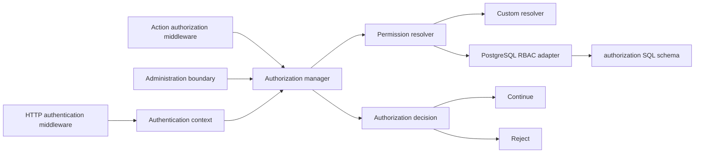
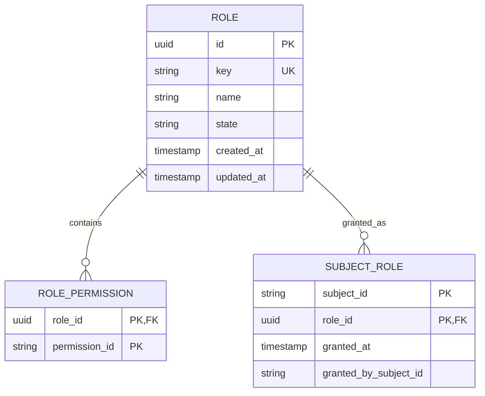

# Authorization

[Documentation](../README.md) · [Implementation index](./README.md) · [Usage guide](../usage/authorization.md)

The authorization library decides whether an authenticated principal may perform an operation. It is a separate Kestrel library built on the principal produced by authentication. Authentication establishes identity and assurance; authorization evaluates permissions and policies for that identity.

The first application use is protecting the complete administration boundary. The protected boundary is the exact `/admin` path and every descendant below `/admin/`. Protection is defined once for the subtree rather than repeated for the SPA shell, manifest, API operations, fallbacks, or future administration routes.

## Status

This document specifies the architecture and records the first implemented increment. The authorization core, memory and PostgreSQL adapters, application role policy, operator commands, database seed, and complete `/admin` protection are implemented.


The authentication foundation required by this design already exists: immutable scoped principals, opaque revocable sessions, HTTP session resolution, transport-independent Action middleware, account disablement, and session invalidation through account security versions.

## Usage guide

For application setup and task-oriented examples, see the [Authorization usage guide](../usage/authorization.md).

## Public API

| API group | Main exports |
| --- | --- |
| Definitions | `definePermission()`, `defineRole()`, permission and role definition types |
| Requirements | `permission()`, `allOf()`, `anyOf()` and `AuthorizationRequirement` |
| Evaluation | `AuthorizationManager`, `AuthorizationDecision`, manager dependency types |
| Enforcement | `requireAuthorization()`, `requireHttpAuthorization()`, `AuthorizationDeniedError` |
| Composition and DI | `AuthorizationProvider`, manager, resolver, role-store and subject-role-store dependencies |
| Storage contracts | `PermissionResolver`, `RoleStore`, `SubjectRoleStore`, authorization role/state types |
| Bundled adapters | `MemoryAuthorizationAdapter`, `PostgresAuthorizationAdapter`, PostgreSQL adapter provider and schema/table exports |

## Adapter API

The core storage port is `PermissionResolver.resolvePermissions(subjectId)`. It returns the subject's complete current effective permission-id set. The result must exclude disabled roles and unknown or inactive policy state according to the adapter's model. Failures reject; an unavailable backend must not be interpreted as an empty authoritative grant set unless the application deliberately wraps it with that fail-closed policy.

RBAC administration uses two narrower ports. `RoleStore.findRoleByKey()` resolves current role metadata. `SubjectRoleStore.grantRole()` and `revokeRole()` return whether they changed the association and must be idempotent under repeated operator requests. Grant metadata such as the granting subject remains adapter-owned but must not weaken those semantics.

The authorization manager caches one resolver result only within an execution. Adapters must therefore return a coherent snapshot for one call and must not rely on longer manager-side caching. The PostgreSQL and memory implementations satisfy all three ports; custom policy engines may implement only `PermissionResolver` when role administration is handled elsewhere. The detailed PostgreSQL behavior appears in [PostgreSQL RBAC adapter](#postgresql-rbac-adapter).

## Goals

The library must:

- deny operations by default;
- consume the authenticated principal without adding roles or permissions to authentication tables;
- remain independent from the application's `User` class and identifier format;
- remain independent from persistence through a focused permission resolver contract;
- provide a PostgreSQL RBAC adapter and Kestrel-owned Drizzle schema for the common case;
- allow applications to declare stable, inspectable permissions in code;
- support reusable requirements such as one permission, all permissions, or any permission;
- protect Actions independently from their transport;
- protect HTTP boundaries such as the complete administration subtree;
- distinguish missing authentication from denied authorization through consistent 401 and 403 responses;
- cache permission resolution only within one execution so grants and revocations take effect on the next execution;
- leave room for resource ownership, organizations, contextual policies, external policy engines, and richer role management without requiring those features now.

## Non-goals for the first increment

The first increment does not provide:

- resource ownership or row-level authorization;
- attribute-based policy evaluation;
- organization, workspace, or tenant boundaries;
- role inheritance or role hierarchies;
- explicit deny rules, rule priorities, or conflict resolution;
- time-based or network-based authorization conditions;
- permissions copied into authentication session claims;
- direct permission grants to subjects;
- a graphical role-management interface;
- self-service access requests or approval workflows;
- a general-purpose policy language;
- integration with an external IAM or policy engine;
- durable security audit history beyond normal observations and grant metadata;
- authorization for trusted operator CLI commands used to bootstrap the first administrator.

These features influence the contracts retained below, but they must be introduced only with concrete semantics and tests.

## Concepts and terminology

| Term | Meaning |
| --- | --- |
| Principal | The immutable authenticated identity available in the current execution. |
| Subject | The application-owned entity identified by `principal.subjectId`. |
| Permission | A stable application-defined capability such as `admin.access`. |
| Requirement | An inspectable expression describing which permissions are required. |
| Decision | The manager's allowed or denied result for one requirement. |
| Permission resolver | The storage-neutral port that loads a subject's effective permission identifiers. |
| Role | A PostgreSQL-adapter concept grouping permission identifiers. Roles are not a core authorization assumption. |
| Grant | An association between a subject and a role. |
| Policy enforcement point | Middleware or a boundary that prevents an operation after a denied decision. |
| Administration boundary | The exact `/admin` route and every route below `/admin/`. |

## Design principles

### Authentication and authorization remain separate

Authorization depends on authentication in one direction:

```text
authorization -> authentication
authentication -X-> authorization
```

Authentication does not define roles, permissions, or policies. Authorization reads `AuthenticationContext` and the resulting `AuthenticatedPrincipal`. This provides direct synergy without turning authentication accounts or sessions into authorization storage.

### Permissions are application language

Permission identifiers describe stable application capabilities. They are declared in code, reviewed like API contracts, and namespaced by domain:

```ts
export const adminAccess = definePermission({
  id: "admin.access",
  description: "Access the application administration.",
});
```

Permission identifiers are not UI labels and must not be renamed casually. Renaming a permission requires a storage migration for every role mapping that uses it.

### The core does not assume RBAC

The core asks a `PermissionResolver` for effective permissions. The bundled PostgreSQL adapter computes those permissions through roles, but a custom resolver may use an IAM service, LDAP groups, direct grants, static configuration, or another policy system.

This keeps `Role` out of the core manager and prevents a first RBAC implementation from becoming the universal authorization model.

### Server decisions are authoritative

Hiding an administration link or client route is only presentation. Every protected server operation must enforce authorization. The administration shell, manifest, APIs, and operations are protected on the server before any administration content or data is returned.

### Requirements are inspectable

The first version uses immutable requirement values rather than arbitrary callbacks. This keeps policies visible to tests, documentation, tooling, and future administrative introspection.

### Permission state is live across executions

Permissions are not copied into session claims in the first increment. The resolver is called at most once per execution and its result is cached only in that scope. A role grant or revocation therefore affects the next HTTP request or other execution without revoking an otherwise valid authentication session.

## Architecture



The manager owns requirement evaluation, scoped caching, failure semantics, and decision instrumentation. Resolvers own effective-permission retrieval. Enforcement points own the operation that continues or stops.

## Core model

### Permission definitions

Permissions are immutable definitions with a stable identifier:

```ts
export interface PermissionDefinition {
  readonly id: string;
  readonly description?: string;
}

export function definePermission(
  definition: PermissionDefinition,
): PermissionDefinition;
```

Identifiers use lowercase dot- or dash-separated segments such as `admin.access`, `users.manage`, or `debates.moderate`. Definition validation rejects empty segments, whitespace, duplicate permissions in one role definition, and unreasonably long identifiers.

The initial application declares only `admin.access`. More granular administration permissions are added only when the application needs different administrator capabilities.

### Requirements

The first requirement algebra is deliberately small:

```ts
export type AuthorizationRequirement =
  | {
      readonly type: "permission";
      readonly permission: PermissionDefinition;
    }
  | {
      readonly type: "all";
      readonly requirements: readonly AuthorizationRequirement[];
    }
  | {
      readonly type: "any";
      readonly requirements: readonly AuthorizationRequirement[];
    };
```

Public helpers create and freeze these values:

```ts
permission(adminAccess);
allOf(permission(adminAccess), permission(usersManage));
anyOf(permission(debatesModerate), permission(adminAccess));
```

Empty `allOf` and `anyOf` declarations are rejected because their implicit truth values are easy to misuse. Negation, explicit deny, dynamic predicates, and resource input are deferred.

### Permission resolver

The storage-neutral port is intentionally narrow:

```ts
export interface PermissionResolver {
  resolvePermissions(
    subjectId: string,
  ): Promise<ReadonlySet<string>>;
}
```

The resolver receives the stable application subject identifier, not a Kestrel-owned user or account. Returned sets are copied into manager-private state before being retained, so adapter-side mutation cannot alter a decision.

Unknown persisted permission identifiers do not grant access. They may produce an operational observation so stale role mappings can be repaired.

### Decisions

Decisions are explicit internal values:

```ts
export interface AuthorizationDecision {
  readonly allowed: boolean;
  readonly requirement: AuthorizationRequirement;
  readonly reason: "granted" | "missing-permission";
}
```

The public HTTP error never includes missing permission identifiers, role names, effective permissions, or resolver details. Those values could reveal administration capabilities to an unauthorized caller.

### Authorization manager

The manager depends on the scoped authentication context and permission resolver:

```ts
export class AuthorizationManager {
  check(
    requirement: AuthorizationRequirement,
  ): Promise<AuthorizationDecision>;

  require(
    requirement: AuthorizationRequirement,
  ): Promise<void>;
}
```

`check()` evaluates a decision without throwing for an authenticated principal. `require()` enforces it and raises a typed error when denied.

The manager behavior is:

1. read the principal from the scoped authentication context;
2. raise the common authentication-required error when no principal exists;
3. resolve the subject's permission set once for the execution;
4. evaluate the immutable requirement;
5. return the decision or enforce it.

Concurrent checks in one execution share one in-flight resolver promise. A resolver failure fails closed but remains an operational failure rather than being represented as an ordinary 403 denial. This distinction prevents an unavailable authorization backend from being mistaken for a valid negative decision.

## Enforcement

### Action middleware

Business operations use transport-independent middleware:

```ts
export const deleteUser = defineAction({
  name: "user.delete",
  middleware: [requireAuthorization(permission(adminAccess))],
  // ...
});
```

The middleware receives the same execution scope as the Action. It calls the authorization manager before the handler and output validation. Missing authentication produces 401 semantics; missing permission produces 403 semantics.


- administration-only and protected with `admin.access` at the Action boundary;
- intentionally available to non-administrative application users under a future or existing business policy;
- currently unsafe and removed from direct public exposure until its intended policy is defined.

### HTTP middleware

Authorization also provides HTTP middleware for transport boundaries that do not correspond to one business Action, such as the administration shell and manifest:

```ts
requireHttpAuthorization(permission(adminAccess));
```

The middleware reads the principal previously resolved by authentication and delegates decisions to the same authorization manager. It does not parse cookies or duplicate authentication logic.

Application HTTP controllers reference mandatory, named access policies defined in `src/server/authorization`. A policy owns the complete middleware chain required by its HTTP guarantee, while an explicitly anonymous policy has an empty chain. This keeps the decision visible on every controller and prevents moving a controller between future catalog groups from removing its access protection. Administration-only Actions retain their separate Action authorization as defense across every transport.


The application authentication integration exposes stable middleware instances:

```ts
applicationAuthenticationHttp.middleware.requiredSession;
applicationAuthenticationHttp.middleware.trustedOrigin;
```


## PostgreSQL RBAC adapter

### Kestrel-owned schema

The bundled PostgreSQL adapter owns a conventional Drizzle schema named `authorization`. The application statically re-exports these definitions from its aggregate Drizzle schema for migration discovery but does not redefine them.



The schema provides:

- `authorization.role`;
- `authorization.role_permission`;
- `authorization.subject_role`.

`subject_id` and `granted_by_subject_id` are text without foreign keys to application users. This keeps Kestrel independent from application models and deletion policy. Role foreign keys are internal to the authorization schema and cascade when a role is deliberately deleted.

Permissions remain code-defined identifiers rather than rows in a central permissions table. Unknown identifiers loaded from storage are inert unless application code declares and requires that exact identifier.

Disabled roles do not contribute permissions. Removing a subject-role grant or disabling a role takes effect on the next execution because there is no cross-request permission cache.

### Focused storage capabilities

The PostgreSQL implementation can expose focused ports for application management workflows while the core manager depends only on `PermissionResolver`:

```ts
export interface RoleStore {
  findRoleByKey(key: string): Promise<AuthorizationRole | undefined>;
}

export interface SubjectRoleStore {
  grantRole(
    subjectId: string,
    roleId: string,
    grantedBySubjectId?: string,
  ): Promise<boolean>;
  revokeRole(subjectId: string, roleId: string): Promise<boolean>;
}
```

Grant and revoke operations are idempotent. Composite constraints make concurrent duplicate grants safe. Role creation, permission replacement, role listing, and role state management remain later management features.

### Custom adapters

Applications may replace only `PermissionResolver` or supply a complete adapter. A custom resolver is not required to expose roles. The Kestrel core does not inspect adapter-specific role records.

Every Kestrel adapter has its own directory containing implementation, schema, tests, and public exports.

## Application composition

The application registers one authorization-specific provider:

```ts
app.register(
  new ApplicationAuthorizationProvider(),
);
```

The application provider composes:

- Kestrel authorization core services;
- the PostgreSQL permission resolver and management stores;
- application permissions and role definitions imported by seed and policy modules;
- optional custom child-provider overrides.

Database and authentication providers remain separate shared infrastructure. Authorization is registered after authentication so the scoped authentication context is available.

No authorization environment configuration is required in the first increment. Role assignments are data, not deployment flags.

## Initial application policy

The application declares one permission and role:

```ts
export const adminAccess = definePermission({
  id: "admin.access",
  description: "Access the complete administration boundary.",
});

export const adminRole = defineRole({
  key: "admin",
  name: "Administrator",
  permissions: [adminAccess],
});
```

The role and its permission mapping are installed deterministically by local database maintenance (and exercised directly by database tests). The same seed creates one application user, authentication account, password credential, and role grant so a fresh local installation is immediately usable:

```text
username: admin
password: admin
```

These deliberately weak bootstrap credentials are seed data only. Database maintenance is restricted to the local environment; tests invoke the seed declaration directly inside isolated transactions. The application has no production fallback, environment-based administrator, or runtime auto-provisioning. A deployed environment must provision its own subject, password, and role grant through controlled operations.

### Administrator bootstrap

A trusted operator CLI Action grants or revokes the role by subject identifier:

```text
authorization grant-role <subject-id> admin
authorization revoke-role <subject-id> admin
```

The workflow validates that the application subject and role exist, then performs an idempotent storage mutation. It is not exposed over public HTTP in the first increment.

The initial CLI is a trusted operational interface with the same authority as direct database maintenance. Authorization for operator transports, durable approval, and administrative self-management are later concerns.

## Errors

The library exposes typed errors with safe representations:

| Condition | Behavior |
| --- | --- |
| No authenticated principal | Reuse `AuthenticationRequiredError`, HTTP 401 |
| Authenticated principal lacks permission | `AuthorizationDeniedError`, HTTP 403 |
| Invalid requirement definition | Programming/configuration error during composition |
| Resolver unavailable or returns invalid data | Operational failure, fail closed |
| Unknown stored permission | Inert unless application code declares and requires it |

The 403 response uses a generic message such as `The operation is not permitted.` It does not identify the missing requirement.

## Observations and privacy

Authorization decision observations are deferred. When integrated with the existing observation system, a safe decision observation may include:

- stable requirement or permission identifiers;
- allowed or denied outcome;
- enforcement point kind such as Action or HTTP boundary;
- operation name or route already present in execution context;
- resolver duration and cache hit status.

It must not include:

- complete effective permission sets;
- role membership lists;
- session tokens or cookies;
- Action input or resource data by default;
- subject profile data.

Subject correlation follows the application's existing execution-context and privacy policy rather than being duplicated automatically in each decision event.

Role grants retain `granted_at` and an optional granting subject identifier. A durable append-only authorization audit log with reasons and operator metadata is deferred but should be added before broad self-service administration.

## Security properties

The first increment must preserve these properties:

- default deny for every unsatisfied or unknown requirement;
- no trust in client-side route visibility;
- no permission or role state in authentication cookies;
- no cross-request permission cache;
- no application user import from the Kestrel schema;
- no production administrator fallback based on email, creation order, or environment;
- generic external denial errors;
- fail closed on resolver failure;
- trusted-Origin protection for unsafe cookie-authenticated administration requests;
- one administration boundary covering the exact base path and all descendants;
- Action-level enforcement for operations that can be reached outside that boundary;
- one execution scope shared by authentication, authorization, and the protected operation.

## Testing strategy

### Core tests

Implemented Kestrel tests cover:

- permission identifier validation and duplicate detection;
- immutable permission and requirement definitions;
- one permission, `allOf`, and `anyOf` evaluation;
- rejection of empty composite requirements;
- default denial;
- 401 behavior without an authenticated principal;
- 403 behavior for an authenticated principal without permission;
- one resolver call across sequential checks in one scope;
- fail-closed resolver errors;
- safe decision error representations.

### Adapter tests

The implemented memory and PostgreSQL paths cover:

- effective permission resolution through active roles;
- duplicate idempotent grants;
- revocation;
- effective permission resolution by the real PostgreSQL joins;
- the deterministic initial role and subject grant.

Disabled-role, concurrency, non-UUID subject, and rollback conformance cases remain useful additions to the adapter suite.

### Administration integration tests

Tests use `fastify.inject()` and cover:

- `/admin`, `/admin/`, an arbitrary SPA path, manifest, operations, and unmatched descendants all pass through the same guard;
- an anonymous API request receives 401 and an anonymous document navigation is redirected to the login page;
- an authenticated non-administrator receives 403;
- an authenticated administrator reaches the requested route;
- Kestrel asset behavior matches the selected separate-prefix policy;
- no real server is started.

The application integration additionally exercises an anonymous document redirect, an anonymous API `401`, a real password sign-in with `admin` / `admin`, the authenticated 403-to-allowed transition, and trusted-Origin enforcement for an unsafe administration request. The deterministic PostgreSQL seed is tested separately with the real Argon2id verifier and PostgreSQL permission resolver. Future administration-only Action classifications can be added as the corresponding product policy grows.

## First implementation increment

The first increment is implemented through the following phases. Items explicitly deferred below are not silently implied by the completed boundary protection.

### Phase 0: authentication integration preparation

1. Expose one application-owned authentication HTTP integration containing `requiredSession` and `trustedOrigin` middleware.
3. Add a focused integration test proving a principal resolved by HTTP middleware is visible to later Action and authorization middleware in the same execution scope.

This is a small integration refinement, not a new authentication feature.

### Phase 1: authorization core

1. Add permission definitions and validation.
2. Add immutable `permission`, `allOf`, and `anyOf` requirements.
3. Add `PermissionResolver`.
4. Implement `AuthorizationManager` with one scoped in-flight permission resolution.
5. Add safe decisions and `AuthorizationDeniedError`.
6. Add Action and HTTP enforcement middleware.
7. Add dependency declarations and the Kestrel provider.
8. Add core unit tests.

Acceptance: an authenticated test principal with a memory resolver can run a protected Action, while an anonymous principal receives 401 and an authenticated principal without permission receives 403.

### Phase 2: adapters

1. Add the memory adapter and conformance tests.
2. Add the PostgreSQL adapter in its own directory.
3. Add Kestrel-owned `authorization` Drizzle tables.
4. Add focused role and subject-role management stores.
5. Default the PostgreSQL provider to the bundled schema while retaining optional custom mappings.
6. Add adapter tests for active and disabled roles, idempotent grants, revocation, custom subject identifiers, and PostgreSQL permission joins.

Acceptance: granting the `admin` role produces `admin.access`, revoking it removes the permission on a new execution, and no Kestrel code imports the application user schema.

### Phase 3: application composition and bootstrap

1. Statically aggregate the Kestrel schema into the application Drizzle schema.
2. Generate the application migration.
3. Define the application permission `admin.access` and the `admin` role in code.
4. Seed the role-to-permission mapping.
5. Add one `ApplicationAuthorizationProvider` with optional child customization.
6. Add idempotent CLI grant and revoke Actions.
7. Add deterministic role setup and the requested local administrator grant.

Acceptance: a trusted operator can grant and revoke the administrator role for an existing subject, and the application registers only one authorization-specific provider.

### Phase 4: complete administration protection

2. Apply required middleware once to the exact base path and every descendant.
3. Apply trusted-Origin validation additionally to unsafe methods.
4. Ensure the SPA shell, fallbacks, manifest, APIs, operations, and future routes cannot bypass the boundary.
5. Keep authentication, authorization, and operation execution in one execution scope.
6. Keep existing direct business endpoints unchanged until each one has an explicit product authorization policy.
7. Add integration tests for the complete prefix, anonymous page redirection, and the 401, 403, and allowed response classes.


### Phase 5: documentation and validation

1. Document public contracts, application permissions, role bootstrap, and operational recovery.
2. Document future evolutions retained by the design.
3. Generate HTTP clients if controller contracts change.
4. Run targeted tests, the complete `test:ai` suite, typecheck, build, Drizzle validation, and migration checks.

## Proposed file structure

```text
packages/kestrel/src/authorization/
  adapters/
    memory/
      adapter.ts
      adapter.test.ts
      index.ts
    postgres/
      adapter.ts
      adapter.test.ts
      provider.ts
      schema.ts
      tables.ts
      index.ts
  definition.ts
  dependencies.ts
  errors.ts
  manager.ts
  manager.test.ts
  middleware.ts
  provider.ts
  requirements.ts
  types.ts
  index.ts

src/server/authorization/
  actions/
    manage_subject_role.ts
    authorizationCatalog.ts
  permissions/
    application_permissions.ts
  providers/
    authorization_provider.ts
  db/
    seed.ts
```

Files may be combined where the implementation remains small, but every adapter retains its own directory, tests, exports, schema, and supporting types.

## Potential evolutions

The contracts intentionally retain room for:

- granular administration permissions such as `admin.users.manage` and `admin.debates.moderate`;
- resource requirements carrying validated resource type and identifier;
- ownership and membership resolvers;
- organization-scoped roles and grants;
- direct subject permissions;
- role hierarchy with explicit cycle handling;
- contextual conditions based on authentication assurance or freshness;
- step-up authentication requirements coordinated with authorization decisions;
- external IAM, Zanzibar-style relationship stores, or policy engines;
- batched permission and relationship resolution;
- bounded cross-request caches with explicit invalidation only when measurements require them;
- role and grant administration protected by dedicated permissions;
- durable audit trails and access reviews;
- client-visible capability hints that remain non-authoritative;
- service and machine principals once authentication supports them;
- policy simulation and explainability tooling restricted to authorized operators.

These evolutions should extend the requirement and resolver boundaries without placing authorization data in authentication accounts or weakening the simple `requireAuthorization(permission)` case.
