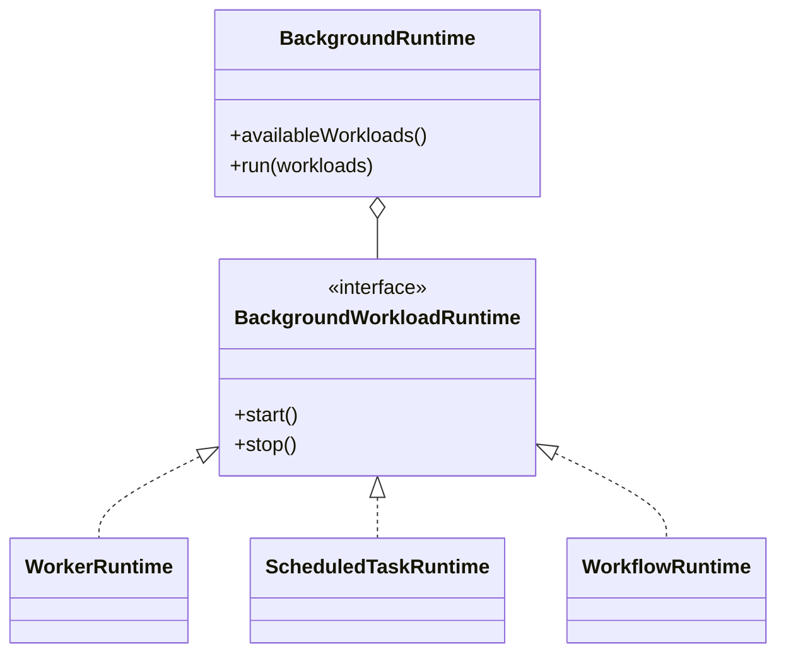
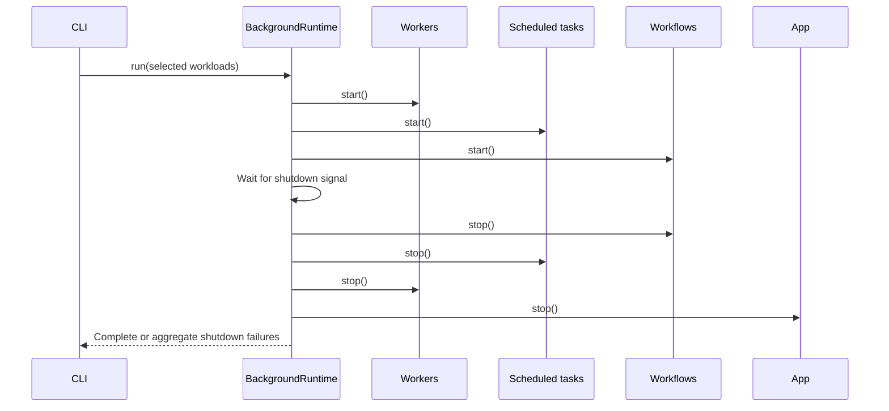

# Background runtime

[Documentation](../README.md) · [Implementation index](./README.md) · [Usage guide](../usage/background.md)

The background library hosts any selected combination of Kestrel's worker, scheduled-task and workflow runtimes in one process. It coordinates process startup and graceful shutdown without merging the schedulers or their storage contracts.

## Concepts and model

A `BackgroundWorkload` is one known scheduler category. A `BackgroundWorkloadRuntime` is the minimal start/stop lifecycle shared by those schedulers. `BackgroundRuntime` validates a requested selection, starts each available runtime in deterministic order and stops started runtimes in reverse order. `BackgroundProvider` discovers registered runtime dependencies and contributes the `run background` CLI controller.

## Usage guide

For application setup and task-oriented examples, see the [Background runtime usage guide](../usage/background.md).

## Design and implementation

The library depends only on the common start/stop shape and the narrow application runtime port. Each scheduler retains its own catalog selection, admission, leases and draining. Startup is sequential so failure has a deterministic boundary. The `finally` path stops only successfully started runtimes, in reverse order, then stops application admission.

Shutdown uses `Promise.allSettled()` so one failing runtime does not prevent the others from being asked to stop. Multiple failures are reported as one `AggregateError` after every cleanup attempt.

## Execution scenarios

If startup fails partway through, the same reverse cleanup runs for the workloads that already started. Unknown or unavailable selections fail before any runtime starts.

## Public API

| Export | Purpose |
| --- | --- |
| `BackgroundRuntime` | Starts selected workload runtimes and coordinates one graceful shutdown. |
| `BackgroundProvider` | Registers the runtime dependency and contributes the generic CLI controller. |
| `BackgroundWorkload` and `backgroundWorkloads` | Define the supported workload vocabulary. |
| `BackgroundWorkloadRuntime` | Minimal lifecycle contract implemented by hosted schedulers. |
| `BackgroundRuntimeOptions` | Injects the shutdown wait boundary. |
| `backgroundRuntimeDependency` | Resolves the composed singleton runtime. |
| `readRequestedWorkloads()` | Parses and validates repeatable CLI workload selections before bootstrap. |

## Adapter API

`BackgroundWorkloadRuntime` is the hosting adapter contract. `start()` may be synchronous or asynchronous and must return only when the workload is ready to own background work; if it rejects, it must clean up resources created by its incomplete startup because the host records only successfully started runtimes. After a successful start, `stop()` must stop admission, drain or cooperatively cancel owned work according to that runtime's documented policy and release its resources. Stop failures reject and are aggregated by the host.

The host calls each selected runtime at most once per `run()` invocation. Implementations retain their own idempotency policy because dedicated process entrypoints may also call them directly.

## Potential evolutions

Named custom workload registration could replace the fixed union if independently packaged schedulers need the same host. That change would require collision-safe identities, CLI discovery metadata and an explicit startup order rather than widening the current list ad hoc.
