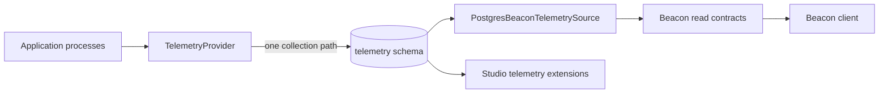
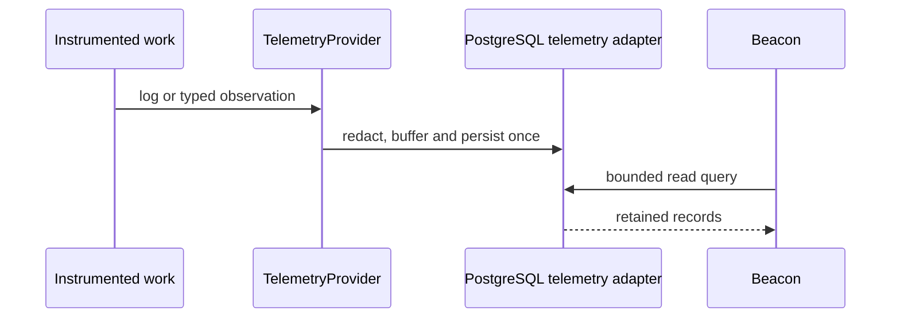

# Beacon

[Documentation](../README.md) · [Implementation index](./README.md)

> Checkout status: the `telemetry` and `beacon` source directories are absent from this checkout. This page is retained as a design record; its historical completion claims and code examples do not describe an available API here. Use the [logging](../usage/logging.md) and [observability](../usage/observability.md) guides for the implemented libraries.

Beacon is Kestrel's production-capable, read-only telemetry application. Its first vertical slice explores the logs and typed observations already retained by the unified telemetry pipeline. It deliberately does not collect telemetry, create a second storage path, or infer metrics and traces from retained events.

The first PostgreSQL adapter targets local development and low-traffic deployments. Higher-volume deployments are expected to export telemetry through OTLP and will require one of the explicitly supported Beacon query adapters rather than scaling the PostgreSQL tier indefinitely.

## Current scope

The first vertical slice provides:

- an independent React client and server extension under `src/packages/kestrel/src/beacon`;
- read-only pages for executions, execution details, logs, observations, errors, slow executions, slow database queries and telemetry pipeline health;
- bounded list APIs with exact filters and keyset cursors supplied by the shared PostgreSQL stores;
- TanStack Router navigation and TanStack Query server-state caching, preloading, retry classification and browser cursor pagination;
- snapshot time-range controls for the last hour, 24 hours, seven days or all retained data;
- an injected access policy for every HTML and data route;
- explicit unavailable states for metrics, traces and live producer health when their native source is absent;
- local application composition against the same `telemetry.log_records` and `telemetry.observations` tables read by Studio.

This vertical does not yet provide metric panels, trace waterfalls, application-defined time presets or a dedicated production read runtime. Those capabilities remain in the telemetry implementation plan.

## Architecture

Beacon is separated into four boundaries:



`BeaconTelemetrySource` is storage-neutral and contains only the queries needed by the current UI. `PostgresBeaconTelemetrySource` is the first adapter. It delegates to the same lower-level log and observation sources as Studio, serializes dates at the HTTP boundary and exposes no mutation operation.

The provider accepts the source as an object or as an application-composition factory. The factory form allows an application to resolve its database pool without making Kestrel code depend on application DI keys.

The browser client depends only on Beacon's public serialized contracts. It owns a dedicated Vite root and asset prefix, so its development graph, HMR lifecycle and production bundle are independent from other Kestrel or application clients. TanStack Router owns route matching, history, intent preloading and scroll restoration. TanStack Query owns request deduplication, freshness, retry policy and cursor-page caching; route loaders and pages share the same query declarations.

## Collection and storage

Beacon is never a telemetry sink. The write path remains:



Consequently:

- Beacon and Studio observe the same local records;
- enabling Beacon cannot duplicate logs or observations;
- disabling Beacon has no effect on collection;
- no Beacon table, writer, retention job or sampling policy exists;
- the current PostgreSQL source is appropriate only for the bounded low-traffic tier documented in the telemetry design.

The current source reads:

| Beacon capability | Shared source |
| --- | --- |
| Execution list | `execution.started` and `execution.completed` typed observations |
| Execution detail | observations and logs correlated by `executionId` |
| Generic and specialized observation views | `telemetry.observations` |
| Generic logs | `telemetry.log_records` |
| Live collection health | the process-local `TelemetryHealthRegistry`, when mounted in a producer runtime |

Live health is intentionally unavailable when Beacon runs in a dedicated read process without a producer health registry. A future remote health source should be explicit rather than presenting the read process's health as producer health.

## HTTP contract

The default mount point is `/_beacon` and may be changed by application configuration. API paths are relative to that mount point:

| Method and path | Purpose | Current bounds and filters |
| --- | --- | --- |
| `GET /api/executions` | Execution summaries | `limit` up to 100, numeric keyset `before` and ISO `from`/`to` bounds |
| `GET /api/executions/:executionId` | Correlated observations and logs | exact execution identifier, independently capped collections and explicit truncation flags |
| `GET /api/logs` | Structured logs | `limit` up to 100, exact severity, opaque keyset `before` and ISO `from`/`to` bounds |
| `GET /api/observations` | Typed observations | `limit` up to 100, keyset cursor, ISO `from`/`to`, exact name/category/execution/outcome and minimum duration |
| `GET /api/health` | Telemetry collection health | available or explicitly unavailable |

The browser does not receive SQL or a provider query language. Input validation happens before the query adapter is invoked. Unknown API routes return JSON `404` responses, while unknown non-API paths render the client so history navigation works.

Beacon's controllers disable execution-log and observation generation. This prevents its own read traffic from recursively dominating the telemetry it displays. The surrounding application's ordinary HTTP instrumentation may still classify Beacon traffic; complete internal-traffic suppression remains part of the dashboard hardening phase.

## Access control

Beacon does not define an authentication model. `BeaconProvider` requires an `HttpAccessPolicy`, and applies it to:

- the base document;
- client-side history fallbacks;
- every telemetry API route;
- API not-found handling.

Static compiled assets use an isolated prefix and contain no telemetry records. Applications must inject a policy suitable for operational data and should not mount Beacon publicly. The local application currently uses its existing administrator access policy.

This injection keeps Kestrel reusable and allows a deployment to require a session, an operator role, a private network identity or another application-owned mechanism without changing Beacon.

Read-only Beacon routes require the administrator session and permission but do not require an `Origin` header. Browsers generally omit that header for top-level GET navigation. Trusted-origin or equivalent CSRF enforcement belongs on unsafe administration methods; Beacon exposes no such method in this vertical.


The same login URL is serialized to the Beacon client without credentials or session state. If a cached client later receives a `401`, its API layer triggers one login navigation with the current Beacon location as `returnTo`. Query does not retry authorization or validation failures; it retries only bounded transient statuses such as `408`, `429` and server failures.

## Application composition

An application enables Beacon through explicit configuration and provides both access and a query source:

```ts
new BeaconProvider(config.beacon, {
  access: operatorAccess,
  authentication: {
    loginUrl: "/admin/login",
    isAuthenticationRequired: (error) =>
      error instanceof AuthenticationRequiredError,
  },
  source: (app) => new PostgresBeaconTelemetrySource(
    resolveTelemetryPool(app),
  ),
});
```

The configuration contract is:

| Field | Default | Meaning |
| --- | --- | --- |
| `enabled` | `false` | Registers neither source nor routes when disabled |
| `devMode` | `false` | Selects the Vite development runtime rather than built assets |
| `basePath` | `/_beacon` | Absolute mount path for pages and APIs |

Kestrel uses `devMode`, not environment names. Deciding which deployment enables Beacon and which credentials or storage source it uses belongs to the application.

## Pages and signal semantics

The initial pages intentionally expose only facts supported by retained logs and observations:

- **Executions** lists retained Kestrel execution boundaries and links to correlated artifacts.
- **Logs** and **Observations** provide generic inspection of the two retained signals.
- **Errors** selects observations whose outcome is `failure`.
- **Slow executions** selects completed execution observations at or above the initial one-second threshold.
- **Slow database queries** selects `database.query` observations at or above the initial 100 ms threshold.
- **Telemetry health** displays the combined process-local health snapshot when available.

The thresholds are first-version view defaults, not alert definitions or service-level objectives. They should become explicit view configuration when Beacon's dashboard configuration contract is introduced.

Metrics and traces are shown as unavailable rather than approximated. In particular, Beacon does not repeatedly scan logs or observations to fabricate request rates, percentiles, queue gauges, cache hit ratios or time series. Phase 4 will supply metric-backed panels and phase 5 will supply complete trace exploration.

## Testing

Kestrel tests verify:

- base-path validation and bounded request parsing;
- storage-neutral controller delegation and correlated detail assembly;
- disabled-provider behavior and lazy source creation;
- HTML, API, asset and not-found routing through a Kestrel-owned client fixture;
- PostgreSQL projection from the shared Studio-compatible read sources;
- inert injection of client configuration and selection of Beacon's dedicated Vite root.
- API URL and filter encoding, one-shot expired-session handling and transient-only Query retries.
- propagation of the optional login URL from the provider to the independent client.

Application configuration files are not unit tested. Production-style composition, query timeouts, paginated execution details, shared Studio renderers and complete internal-traffic classification remain required before phase 3.5 is complete.

## Planned evolution

The next Beacon work is intentionally incremental:

1. Complete phase 3.5 with paginated execution details, query deadlines, production-style read-runtime tests and production-safe renderer reuse with Studio. Browser keyset pagination and snapshot time windows are already backed by TanStack Query's per-query cache, while execution detail collections are capped and report truncation explicitly.
2. In phase 4, add PostgreSQL metric queries and metric-backed Overview, HTTP, Workers, Database and Cache panels.
3. In phase 5, add trace search and waterfalls with correlated logs and observations.
4. In phase 6, complete mixed-signal dashboards and validate concurrent operational use.
5. Add a small number of explicit external query providers when a real deployment requires them. OTLP remains the standard write/export protocol; it is not a read API for Beacon.

Higher-traffic storage must not be hidden behind the PostgreSQL adapter. A future provider should implement Beacon's bounded semantic queries for its selected backend, expose unsupported capabilities explicitly and preserve the browser contract where practical.
