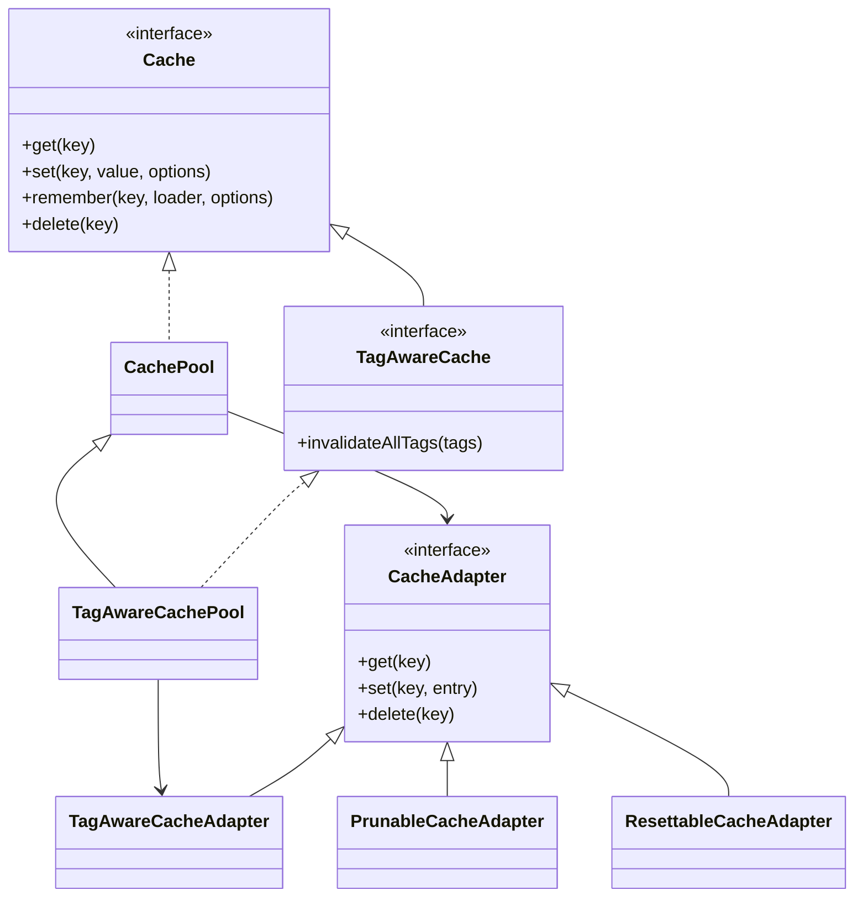
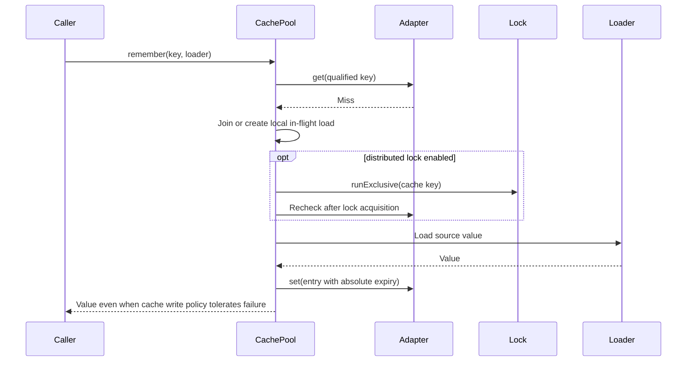

# Cache

[Documentation](../README.md) · [Implementation index](./README.md) · [Usage guide](../usage/cache.md)

Kestrel provides a transport-independent cache library in `src/packages/kestrel/src/cache`. The cache is an optimization: application behavior must remain correct when an entry is absent, expires, is evicted, or cannot be written.

The library ships memory, PostgreSQL and Redis adapters. PostgreSQL remains the default provider backend, while Redis implements only the base storage contract and relies on native expiration and server-managed capacity.

## Concepts and model

`CachePool` is the basic public facade that applies namespace, TTL, serialization, stampede prevention and instrumentation policy. `TagAwareCachePool` extends it with tag-aware writes and invalidation and requires a `TagAwareCacheAdapter` at construction. `CacheAdapter` stores normalized `CacheEntry` values under already-qualified keys. Optional adapter interfaces add pruning, reset and tag-aware invalidation without widening the minimum storage contract. `CacheProvider` composes one pool and its selected adapter into application dependencies.



## Usage guide

For application setup and task-oriented examples, see the [Cache usage guide](../usage/cache.md).

## Design and implementation

The pool qualifies keys and tags, computes absolute expiration, enforces configured limits and records storage-neutral observations before delegating to the adapter. Process-local in-flight promises coalesce concurrent `remember()` calls. Optional distributed locking extends that single-flight boundary across instances without making locks a requirement of the base cache.

Capabilities are detected through focused interfaces. This permits a minimal adapter to support ordinary reads and writes while pruning, reset or native tag invalidation remains available only when its semantics can be implemented correctly.

## Execution scenarios

### Read-through miss



## Scope

The first version provides:

- A small `Cache` facade for reads, writes, read-through loading and deletion, plus the optional `TagAwareCache` facade.
- An in-memory adapter for tests and process-local caching.
- A PostgreSQL adapter for shared caching across application instances.
- A Redis adapter for shared caching with native expiration and no tag, reset or pruning capability.
- Absolute expiration, explicit capacity limits and incremental pruning.
- Optional tag invalidation with explicit all-tags semantics for memory and PostgreSQL.
- Process-local stampede prevention for concurrent read-through calls.
- Optional distributed single-flight loading through the lock library.
- Typed storage-neutral instrumentation connected to execution observations.
- Dependency injection through an application-owned provider.

Layered caching, stale-while-revalidate, probabilistic early recomputation and batch loading are follow-up features. Their future requirements influence the stored entry model, but they should not complicate the current implementation.

## Public API

Cache operations are asynchronous, including operations backed by the in-memory adapter, so consumers can change adapters without changing their code.

```ts
export interface CacheWriteOptions {
  ttlSeconds?: number;
  tags?: never;
}

export interface CacheRememberOptions extends CacheWriteOptions {
  lock?: boolean | LockRunOptions;
}

export interface Cache {
  get<Value>(key: string): Promise<Value | undefined>;

  set<Value>(
    key: string,
    value: Value,
    options?: CacheWriteOptions,
  ): Promise<void>;

  remember<Value>(
    key: string,
    loader: () => Promise<Value>,
    options?: CacheRememberOptions,
  ): Promise<Value>;

  delete(key: string): Promise<boolean>;
}

export interface TagAwareCacheWriteOptions extends Omit<CacheWriteOptions, "tags"> {
  tags?: readonly string[];
}

export interface TagAwareCacheRememberOptions extends TagAwareCacheWriteOptions {
  lock?: boolean | LockRunOptions;
}

export interface TagAwareCache extends Cache {
  set<Value>(key: string, value: Value, options?: TagAwareCacheWriteOptions): Promise<void>;
  remember<Value>(key: string, loader: () => Promise<Value>, options?: TagAwareCacheRememberOptions): Promise<Value>;
  invalidateAllTags(tags: readonly string[]): Promise<number>;
}
```

`CacheWriteOptions.tags?: never` prevents tagged option variables from being silently accepted through structural typing. Basic `CachePool` instances also reject tag options at runtime before accessing storage or running a loader. `TagAwareCachePool` validates its adapter during construction. `isTagAwareCache(cache)` narrows a dynamically selected facade when optional tag-aware behavior is appropriate.

Dependency injection is a runtime composition boundary: TypeScript can check that a service declares `TagAwareCache`, but cannot prove which backend deployment configuration selects. `tagAwareCacheDependency` therefore fails explicitly during resolution when the selected adapter lacks tags. `cacheDependency` always exposes only the common contract, even when its underlying singleton supports tags. Existing tagged callers must migrate from `Cache` to `TagAwareCache`, from `cacheDependency` to `tagAwareCacheDependency`, and from direct `CachePool` construction to `TagAwareCachePool`. Ordinary cache callers require no changes.

`get()` is read-only. `remember()` implements read-through caching: it returns a cached value when present, otherwise calls the loader, attempts to store its result and returns it. Passing `lock: true` enables distributed single-flight loading with the lock manager defaults. Passing a `LockRunOptions` object enables it with per-call TTL, acquisition timeout, retry interval or cancellation overrides.

`undefined` represents a cache miss and cannot be stored. `null` is a cacheable value. The generic parameter of `get()` is a compile-time assertion by the caller, not runtime validation. The initial cache accepts JSON-compatible values; schema-based decoding can be added later if cache contents cross a less trusted boundary.

The write options are declarative rather than exposed as a mutable cache item. If a future use case requires tags or expiration derived from a loaded result, a dedicated loader result can be added without changing the stored entry model.

### Keys and namespaces

The pool receives an application namespace and constructs the final adapter key as `namespace:key`. Both parts must be non-empty and validated. The separator is forbidden inside a namespace so composition remains unambiguous. Adapters only receive the final string and do not model namespaces separately.

Application keys should name both the resource type and its identity, for example `user:42`. With the `app` namespace, every adapter receives `app:user:42`. PostgreSQL stores that final value in a single primary-key column; Redis adds its configured infrastructure prefix to form the physical key.

Tags follow the same rule. Callers use application tags such as `users`, while the pool stores `app:users`. This prevents a pool from invalidating tags owned by another namespace without adding namespace awareness to adapters.

Backend-specific key length limits must not leak into business code. An adapter may hash an oversized physical key while retaining enough diagnostic metadata to identify it during development.

## Stored entry model

Adapters exchange an internal entry distinct from public write options:

Concrete adapters and their focused tests live in `src/packages/kestrel/src/cache/adapters` and are re-exported by the cache library's public index.

```ts
export interface CacheEntry {
  value: unknown;
  expiresAt: Date;
  tags: readonly string[];
  createdAt: Date;
  sizeBytes: number;
}
```

Expiration is stored as an absolute instant. This prevents a later layered cache from accidentally renewing an entry when promoting it from one layer to another.

The adapter owns expiration enforcement: `get()` never returns an entry whose `expiresAt` is in the past. Expired entries may be deleted lazily, but their physical removal is not required before returning a miss.

The first version should require a finite effective TTL. A write uses its explicit `ttlSeconds` or the pool's configured default. The configured maximum TTL caps excessively large values. Zero or negative TTL values are rejected instead of being assigned implicit behavior.

Time must be supplied through a small clock dependency or injectable function so expiration behavior can be tested without real delays.

## Adapter contract

The base storage contract stays minimal:

```ts
export interface CacheAdapter {
  get(key: string): Promise<CacheEntry | undefined>;
  set(key: string, entry: CacheEntry): Promise<void>;
  delete(key: string): Promise<boolean>;
}
```

Optional capabilities are represented separately:

```ts
export interface PrunableCacheAdapter extends CacheAdapter {
  prune(options: { limit?: number }): Promise<number>;
}

export interface ResettableCacheAdapter extends CacheAdapter {
  reset(): Promise<number>;
}

export interface TagAwareCacheAdapter extends CacheAdapter {
  invalidateAllTags(tags: readonly string[]): Promise<number>;
}
```

Tag invalidation remains isolated because the pool composes tags before passing them to the adapter. `reset()` deliberately clears the complete adapter and is therefore an infrastructure operation rather than a public pool operation. Public facade types expose tags only through `TagAwareCache`; the provider validates that stronger dependency during resolution. Optional adapter capabilities must not be implemented as misleading no-ops. Return values report whether or how many entries were affected, which helps tests and future observability.

Cache reads and writes should normally be fail-open because the cache is an optimization:

- A storage read failure is treated as a miss.
- A storage write failure does not prevent `remember()` from returning the loaded value.
- Loader failures are always propagated and are never cached.
- Deletion and invalidation failures are propagated because silently retaining known-stale data threatens correctness.

Ignored storage errors must be reported through the application logger. A stricter failure policy may later be made configurable for caches whose contents are required for correctness, though such data should normally not live only in a cache.

## Tag invalidation

`invalidateAllTags(["users", "admins"])` removes entries containing both tags. The method name deliberately exposes its AND semantics. An OR operation can later be added as `invalidateAnyTags()` if a concrete use case requires it.

Tags should describe invalidation groups, while keys identify individual entries. For example, a cached user can have `users` and `user:42`; a mutation of that user can invalidate `user:42`, while a bulk mutation can invalidate `users`.

Invalidation can race with an in-progress loader:

1. A cache miss starts loading a value.
2. The source data changes and its tag is invalidated.
3. The old loader completes and writes stale data back into the cache.

The first implementation must document this limitation and keep cache TTLs finite. A later robust implementation should associate a generation with every tag. A loader records tag generations and only writes, or an entry only remains valid, while those generations are unchanged. This solves stale resurrection without requiring invalidation to wait for every loader.

## Stampede prevention

The pool always coalesces simultaneous `remember()` calls for the same physical key within one process by storing the in-flight promise. All callers await the same promise, and the promise is removed from the map in a `finally` block.

The loader is only coalesced by key; reads and explicit writes remain independent. Failed loaders are not cached, and a later caller may retry.

Distributed locking is a separate coordination concern and is not implemented by a cache storage adapter. When `remember()` receives `lock: true` or lock options, the pool performs an initial read, waits to acquire a lease, reads the cache again, loads a remaining miss, attempts the cache write and safely releases the lease. The second read is required because another process may fill the cache while the caller waits.

`waitTimeoutMs` specifically bounds how long the caller waits to acquire the lease. It is not a general timeout for the loader or complete cache operation. A caller can use `AbortSignal` to cancel lock acquisition as part of its wider operation deadline. After acquiring a lease that another process released, the caller normally returns the value found by its second cache read without running its loader.

The lock key is derived as `lockKeyPrefix:storageKey`, where `storageKey` already contains the cache namespace. `lockKeyPrefix` defaults to `cache-fill` and can be changed globally through `CachePoolOptions` or `APP_CONFIG__CACHE__LOCK_KEY_PREFIX`. Callers cannot override the derived key per invocation, ensuring that every caller coordinates on the same lease for a cache entry.

Distributed loading is fail-closed for coordination failures. Acquisition timeouts, cancellation and lock storage errors are propagated without running the loader because silently falling back would remove the requested concurrency guarantee. Calling `remember()` without `lock` retains the regular fail-open cache behavior.

The guarantee is intentionally precise: at most one loader is active per key across cooperating processes while its lease remains valid. It is not exactly-once execution. The lock manager renews the lease automatically while the loader runs, but a renewal failure can still expose the key to a new owner before a loader that ignores cooperative cancellation has stopped. A failed cache write can also cause a later caller to calculate the value again. Cache reads and writes remain fail-open, loader failures are propagated, and the lock is released so a later caller may retry.

## Instrumentation and observations

`CachePool` accepts an optional synchronous `CacheInstrumentation` sink and emits terminal events for four distinct cache concerns:

- `cache.access` records `get` and `remember` lookups as `hit`, `miss`, `error` or `local-coalesced`. A `remember` lookup includes an `initial` or `after-lock` phase so the second read performed after lock acquisition is unambiguous.
- `cache.load` is emitted only by the caller that invokes the source loader. It records `loaded` or `error` and whether the load was coordinated by a distributed `lock` or by no distributed coordination.
- `cache.write` records explicit `set` and read-through `remember` writes as `stored`, `oversized` or `error`, together with TTL, logical size and tag count when entry preparation succeeded.
- `cache.invalidation` records key deletion and all-tags invalidation, including the affected entry count when the adapter completed the operation.

The events intentionally describe policy-level steps rather than every adapter method call. Local in-flight reuse is visible without pretending that the waiting caller ran a loader, while lock acquisition, release and contention remain represented by the separate `lock.*` events.

Storage failures have a failure observation outcome even when the public cache policy is fail-open. This distinction makes degraded cache infrastructure visible without implying that the surrounding application execution necessarily failed. Loader and invalidation errors retain their existing propagation behavior.

Observation payloads never contain cached values, raw errors or tag contents. They contain the namespaced logical cache key by default. Applications can use `formatObservationKey` to redact, normalize, truncate or hash sensitive and high-cardinality keys before instrumentation receives them. Only tag counts are recorded.

Durations use `performance.now()` through an injectable `monotonicNow` function and are clamped to non-negative values. When instrumentation is absent, the pool does not perform monotonic measurements. Exceptions from the sink, key formatter or clock are contained and never change cache semantics.

The application provider bridges the instrumentation sink to the `Observer` active for the current direct, HTTP or CLI execution. The bridge uses asynchronous execution context, allowing singleton cache and lock services to emit events with the correct `executionId`. Work outside an execution scope remains functional and produces no stored observation.

## Capacity and storage management

TTL and capacity solve different problems. TTL limits how long an entry remains useful; capacity limits how many entries or bytes can coexist. Expired entries also continue to occupy memory or PostgreSQL storage until they are physically removed.

Capacity and cleanup are backend-specific. Memory and PostgreSQL support bounded pruning; Redis manages entry expiration and eviction itself and has no `prune()` operation. Pruning must never scan or delete an unbounded amount of data on a request path.

### In-memory adapter

The in-memory adapter uses an LRU policy backed by insertion-ordered maps or an equivalent constant-time structure. It applies these rules on every write:

1. Reject or skip caching a value larger than `maxEntrySizeBytes`.
2. Remove expired entries encountered by normal reads and writes.
3. Insert or replace the entry.
4. Evict least-recently-used entries until both `maxEntries` and `maxSizeBytes` are respected.

`maxEntries` is a hard and reliable bound. `maxSizeBytes` counts the serialized JSON value plus the encoded key and tags. It remains an estimate of JavaScript heap usage, not an exact measurement: object overhead and engine internals are not observable precisely. Both limits are useful together because an entry-count limit alone does not protect against a single unusually large value or metadata set.

The adapter must not create one timer per entry. Expiration is checked lazily, with a bounded prune pass on writes and an explicit `prune()` operation for maintenance. Per-entry timers add substantial overhead and become unreliable under load.

Refreshing LRU position on every successful read is appropriate for an in-process map because it is an inexpensive local mutation. Oversized values should normally bypass the cache rather than make the application operation fail.

### PostgreSQL adapter

PostgreSQL reads `utils.cache_entry`, filters expired rows, and writes with an upsert keyed by the final composed key. The shared `utils` PostgreSQL schema groups reusable operational infrastructure tables such as cache entries, local logs and future locks without mixing them with application-domain tables. Each table keeps its own lifecycle: the cache is migration-owned, while local logs are managed only by development tooling.

The cache table stores the JSON value, absolute expiration, creation time, logical size and tags. Tags use a PostgreSQL text array with a GIN index, which directly supports the required AND containment query without a separate metadata table.

The cache table is `UNLOGGED`. Cache writes therefore avoid PostgreSQL WAL overhead, while a crash or unclean shutdown may clear the complete table and its contents are not replicated to standbys. This is compatible with the cache's fail-open and reconstructible-data contract: a restart or failover starts with a cold cache rather than losing authoritative data.

Drizzle does not currently represent table persistence in its TypeScript schema. The declaration therefore wraps the table with `defineUnloggedTable()`. This attaches a custom schema contribution without changing the table's Drizzle type. `npm run db:generate` automatically adds `ALTER TABLE ... SET UNLOGGED` after the table DDL, or creates a custom-only migration if this property changes independently. The historical manual migration remains in the migration history, while a custom contribution snapshot records that its desired state is already installed.

The initial PostgreSQL policy uses:

- A finite default TTL and configurable maximum TTL.
- A maximum serialized entry size checked before writing.
- An index beginning with `expires_at` to support pruning.
- Small, repeatable deletion batches for expired rows.

Pruning runs periodically through the definition contributed by `CacheProvider` to the application scheduled-task registry. The cache resource itself exposes only one-shot maintenance and owns no timer. Multiple instances may prune concurrently only if the query safely claims bounded batches, for example through a CTE using `FOR UPDATE SKIP LOCKED` before deletion.

A TTL does not impose a strict upper bound during a burst of distinct writes. A configurable logical row limit may therefore trigger eviction after expired rows have been pruned. PostgreSQL eviction should prefer the earliest expiration and then the oldest creation time. It should not update an access timestamp on every read merely to implement perfect LRU, because those writes create contention, dead tuples and table bloat.

PostgreSQL cannot cheaply enforce an exact on-disk byte budget from the cache hot path. JSON size excludes row and index overhead, and PostgreSQL's MVCC means deleted rows do not immediately return disk space to the operating system. Disk capacity should consequently be protected at two levels:

- Application limits bound entry size, TTL and optionally logical row count.
- Operations monitor table and index size, dead tuples and pruning progress, with PostgreSQL autovacuum responsible for reclaiming reusable table space.

Large or strict disk budgets belong in operational configuration and alerts rather than a `pg_total_relation_size()` query performed for every cache write.

### Redis adapter

`RedisCacheAdapter` implements only `CacheAdapter`. It supports `GET`, `SET ... PXAT` and single-key `DEL`, with no `prune()`, `reset()` or tag invalidation. Redis 6.2 or later is required for `PXAT`. See the [Redis SET contract](https://redis.io/docs/latest/commands/set/).

Physical keys use a configurable adapter prefix (default `kestrel:cache:`), followed by the already-qualified pool key. For example, pool key `service:user:42` becomes `kestrel:cache:service:user:42`. Deployments sharing Redis must choose non-overlapping prefixes and namespaces. The adapter never runs database-wide cleanup commands.

Values use a versioned JSON envelope containing the value, creation date, absolute expiration and logical size. Reads validate this envelope and restore dates; malformed data raises a storage error that the pool reports and treats as a miss. A stored JSON `null` remains a hit. The adapter also checks absolute expiration using its injectable clock. It does not delete expired reads because a concurrent write might already have replaced the key. An already-expired write removes the previous value instead of retaining stale data.

The adapter enforces `maxEntrySizeBytes`. Redis capacity is configured operationally through `maxmemory` and an eviction policy, rather than emulating PostgreSQL's `maxEntries` limit. Redis cache eviction is allowed by the cache contract. See [Redis key eviction](https://redis.io/docs/latest/develop/reference/eviction/).

The `create-kestrel` Redis generator configures the shared development instance with `maxmemory-policy noeviction`. `RedisProvider` owns the default connection independently of cache, allowing future locking and rate-limiting consumers to share it. Evicting a live coordination key would invalidate those consumers' guarantees, so memory pressure rejects writes requiring more memory instead. TTL expiration still runs normally. Cache write failures remain fail-open: a computed value can be returned even when it cannot be stored. The generated service is ephemeral development infrastructure; this eviction choice does not provide persistence or failover guarantees.

A possible evolution is an explicit dedicated-cache infrastructure profile using Redis's native approximate LRU (`allkeys-lru`). Applications can already register another `RedisProvider` under a custom dependency descriptor and pass that descriptor to `RedisCacheProvider`; the dedicated Redis instance and its eviction configuration must currently be supplied by the application. Automating that instance's generation is deferred. A second connection, key prefix or logical database on the same instance does not isolate eviction. `volatile-lru` is also unsuitable for the shared instance because expiring locks and rate-limit counters would remain eligible for eviction.

#### Standalone and Kestrel-integrated usage

The recommended integrated path injects an adapter into `CacheProvider`. The application supplies a connected `RedisCacheClient` command transport and owns its connection lifecycle. A standard node-redis client using default string replies provides `sendCommand`; other clients can bridge their command method to this small interface. No Redis client package is required by Kestrel itself.

```ts
import {
  CachePool,
  CacheProvider,
  RedisCacheAdapter,
  type CacheConfig,
  type RedisCacheClient,
} from "./src/packages/kestrel/src/cache/index.js";

// The application owns connecting, error listeners, timeouts and shutdown.
function createRedisCacheProvider<Config>(client: RedisCacheClient, config: CacheConfig) {
  const adapter = new RedisCacheAdapter(client, {
    maxEntrySizeBytes: config.maxEntrySizeBytes,
    keyPrefix: "service-cache:",
  });
  return new CacheProvider<Config>(config, adapter);
}

// Standalone use shares the same storage contract and cache policies.
function createStandaloneCache(client: RedisCacheClient) {
  return new CachePool(new RedisCacheAdapter(client, { maxEntrySizeBytes: 1_048_576 }), {
    namespace: "service",
    defaultTtlSeconds: 60,
    maxTtlSeconds: 3_600,
    maxEntrySizeBytes: 1_048_576,
  });
}
```

An injected Redis adapter does not resolve the `database` dependency and contributes no prune task, even when `pruneIntervalSeconds` is positive. `maxEntries` and pruning settings apply to backends that support that maintenance. Locks remain optional: register a lock provider only if distributed `remember()` calls need one. A Redis cache can use the existing PostgreSQL lock backend.

#### Lifecycle and failures

Neither the adapter nor `CacheProvider` connects, reconnects or closes the borrowed Redis client. The owning application/provider must install client error handling, bound connection and command waits, and select an offline-queue policy appropriate for a best-effort cache. Disabling offline queuing avoids replaying delayed cache commands after reconnection. See [node-redis production guidance](https://redis.io/docs/latest/develop/clients/nodejs/produsage/).

Redis errors propagate from the adapter. `CachePool` retains its normal fail-open reads and writes and propagates deletion failures. Tag options are rejected by the basic facade before storage access, and the adapter also rejects non-empty entry tags when called directly.

The adapter integration suite uses the official `@redis/client` development dependency against the real Redis service, selecting the dedicated Kestrel database `2`. `createRedisTestContext()` provides a connected client and unique key prefix for each test, then removes only that prefix and closes the connection in fixture cleanup. `KESTREL_TEST_REDIS_URL` selects the test endpoint and must explicitly end in `/2`; the host default is `redis://127.0.0.1:6379/2`. Tests fail explicitly if Redis is unavailable. They verify exact native expiration deadlines, actual server-driven expiration, replacement/deletion, corrupt stored data, real Redis errors and sharing between independent clients. Focused unit tests retain injected command transports for connection failures and impossible protocol replies. No Redis client dependency is added to production cache code. See [testing](./testing.md#redis-integration-tests) for configuration and isolation.

#### Possible evolutions

Client-specific connection providers, batch operations and a separately designed tag-aware Redis adapter can be added when required. A future tag implementation must account for index eviction, expiry cleanup and concurrent writes; it must not advertise the capability until those semantics are defined. Redis-backed distributed locks belong in the lock library.

### Suggested initial defaults

Defaults should be defined by application configuration and adjusted from observed workloads. Conservative starting values are:

- Memory: 1,000 entries, 32 MiB estimated serialized values and metadata, and 1 MiB per entry.
- PostgreSQL: one-hour default TTL, one-day maximum TTL, 1 MiB per entry, 100,000 logical entries for the adapter and pruning in batches of 1,000 rows. The dedicated scheduled-task process owns the pruning cadence.

These values are starting points, not Kestrel constants. Tests should use much smaller limits to exercise eviction deterministically.

## Layered caching

A future layered cache can put the in-memory adapter before PostgreSQL. A hit in a lower layer may be promoted upward, but the original `expiresAt` and tags must be preserved.

Every layer must receive deletion and invalidation operations. This only clears the memory of the current process; other application instances can retain stale L1 entries. Until shared invalidation generations or pub/sub exist, process-local layers must use short TTLs and explicitly accept eventual consistency.

Layered writes also need a declared failure and ordering policy. These semantics should be implemented by a dedicated composition abstraction only after the individual adapters are stable.

## Application integration

`CacheProvider` lives in `src/packages/kestrel/src/cache`, receives a resolved `CacheConfig` and an optional borrowed `CacheAdapter`, and registers lazy singleton factories during composition. Without an injected adapter it creates PostgreSQL storage lazily. It constructs `TagAwareCachePool` for tag-capable adapters and `CachePool` otherwise. `CacheResource.prune` is optional, and `maintenance.cache-prune` is contributed only for prunable backends with a positive interval. The resource owns no timer. Its boot hook resolves the resource in standard mode; minimal mode leaves it lazy. Applications can inject an adapter directly or subclass the default PostgreSQL adapter factory and resource/maintenance factories.

Kestrel exports a typed dependency descriptor from `src/packages/kestrel/src/cache/index.ts`:

```ts
export const cacheDependency = dep<Cache>("cache");
export const tagAwareCacheDependency = dep<TagAwareCache>("tagAwareCache");
```

Actions and services declare this dependency instead of importing a global cache or accessing the dependency container directly. Tests can register a bounded in-memory cache or a small fake adapter.

Application configuration selects default and maximum TTLs, entry-size limits, adapter capacity, pruning batch settings and the cache-fill lock prefix. Configuration values are resolved once before composition and the dedicated cache value is passed to the provider. When distributed loading is needed, register `LockProvider` before cache resolution; the cache provider resolves `Locks` only when registered and passes its coordination contract to the pool. Ordinary cache use needs no lock provider.

## Implementation plan

Implementation should proceed in small independently tested stages:

1. Define cache entries, the base adapter contract, optional capability interfaces, key validation, time abstraction and public exports in `src/packages/kestrel/src/cache`.
2. Implement the cache facade with `get`, `set`, `remember`, `delete`, namespace handling, finite TTL validation, fail-open storage behavior and process-local in-flight request coalescing.
3. Implement the in-memory adapter with expiration, tag invalidation, LRU eviction, entry-count and estimated-size limits, and bounded pruning.
4. Add focused unit tests for misses, cached `null`, expiration, loader and adapter failures, concurrent loaders, AND tag semantics, replacement accounting, oversized values, LRU behavior and pruning limits.
5. Define the PostgreSQL cache schema and migration, then implement atomic upserts, expiration-aware reads, deletion, indexed tag invalidation and bounded concurrent pruning.
6. Add PostgreSQL adapter integration tests using the existing database test conventions. Verify query behavior and concurrency through the adapter directly; no HTTP server is needed.
7. Add application cache configuration, the library-owned `CacheProvider`, the named dependency descriptor and bootstrap registration. Document ownership and failure policy in the provider.
8. Run type checking, unit tests and the production build, then update the roadmap status and this specification if implementation decisions changed.

Follow-up stages may add tag generations, batch APIs, stale-while-revalidate, probabilistic early recomputation and layered caching. Each should be introduced from a demonstrated application need rather than bundled into the initial cache.
