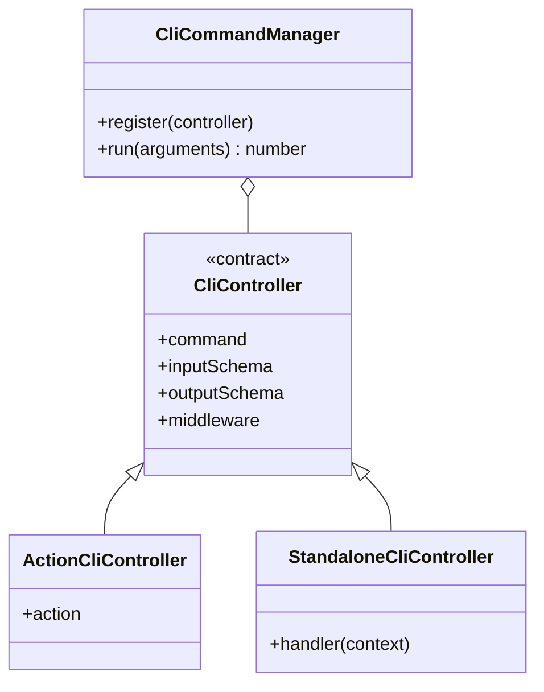
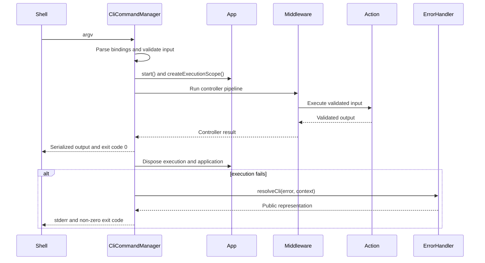

# CLI

[Documentation](../README.md) · [Implementation index](./README.md) · [Usage guide](../usage/cli.md)

The CLI exposes standalone transport handlers and application actions as commands while keeping parsing, presentation and process behavior outside business logic.

Commander is the underlying command parser. Application code depends on Kestrel's CLI controller and command manager APIs rather than importing Commander directly.

## Concepts and model

A CLI controller is a transport contract. It maps command-line strings to validated input and either delegates to an application action or invokes a standalone handler. `CliCommandManager` builds the command tree, creates one application execution scope per invocation, runs middleware, serializes the result and maps failures to exit codes.



## Validation modes

Standalone controllers use synchronous schema parsing by default. Asynchronous refinements or transforms require `validation: { input: "async", output: "async" }` with only the necessary boundaries included. Action-backed controllers inherit the action input policy when they inherit its schema and do not specify `validation`; a replaced input and a declared CLI output default to sync. An explicit `validation` object resets omitted boundaries to sync. Handlers and Commander execution can remain asynchronous regardless of schema mode. See [Definition validation](./definitions.md#schema-validation-policy).


## Usage guide

For application setup and task-oriented examples, see the [CLI usage guide](../usage/cli.md).

## Design and implementation

The library separates declaration, parsing and execution. Controller definitions retain Zod schemas, DI declarations, middleware and boot metadata without depending on Commander. The manager is the only layer that translates those contracts into a Commander command tree. Business execution remains in actions, and process startup and exit remain in the launcher.

Input validation occurs before middleware. A successful execution unwinds middleware, validates any controller output, serializes it and disposes its scope. Every failure still crosses the error handler and scope-disposal boundary.

## Execution scenarios

### Action-backed command



## Public API

| Export | Purpose |
| --- | --- |
| `defineCliController()` | Defines a standalone command and its handler. |
| `defineActionCliController()` | Exposes an action through a CLI-specific contract. |
| `defineModelListActionCliController()` | Adds conventional CLI bindings for a model-list action. |
| `param()`, `option()`, `repeatableOption()` | Override schema-field bindings to positional, named or repeated command inputs. |
| `defineCliMiddleware()` | Defines transport middleware for CLI controller executions. |
| `CliCommandManager` | Registers controllers and runs command arguments without owning process exit. |
| `buildCli()`, `loadApp()`, `runCli()` | Provide the generic application-module launcher path. |
| Controller, context, binding and output-format types | Describe declaration and extension contracts for TypeScript consumers. |

The CLI library has no storage adapter contract. Its replaceable boundaries are controller handlers, middleware, the application `ErrorHandler`, command-manager output writers and the application module loader.

## Controllers

Action controllers are declared next to their related actions:

```ts
export const userCliControllers = {
  create: defineActionCliController(userActions.create, "user create"),
  get: defineActionCliController(userActions.get, "user get"),
  list: defineModelListActionCliController(userActions.list, "user list"),
  delete: defineActionCliController(userActions.delete, "user delete"),
};
```

A command that does not represent a reusable business operation can be implemented directly:

```ts
const healthController = defineCliController({
  command: "health read",
  description: "Report application health.",
  output: z.object({ status: z.literal("ok") }),
  handler: () => ({ status: "ok" }),
});
```

Omitting `input` uses an empty object schema. A standalone controller handler is required and receives its parsed input, dependencies and execution scope. `defineActionCliController()` instead inherits its input and description from the action and runs it when no custom handler is provided.

By default, every field in the controller's Zod input schema is mapped to a `--<field>` option. Required Zod fields produce mandatory options. The schema validates and converts the collected strings before the standalone handler or action runs.

The controller inherits its description from the action. Passing `description` to `defineActionCliController` overrides it for that interface without changing the action.

A controller may override its input schema for CLI-specific coercion and selected bindings:

```ts
const controller = defineActionCliController(action, "user rename", {
  input: cliInputSchema,
  bindings: {
    id: param(0),
    name: option("new-name"),
  },
});
```

`param(index)` defines a positional parameter. Parameter indexes are zero-based, unique and contiguous. `option(name)` changes an option's public name. Controller-specific dependencies are resolved in the command execution scope. A custom action controller handler may be provided when the controller needs explicit mapping before running its action.

Controllers can declare `middleware` created with `defineCliMiddleware()`. Middleware receives validated controller input and the execution scope, and surrounds the handler or delegated action plus controller output validation. See [Middleware](./middleware.md).

Controller executions are observed by default. Infrastructure commands that temporarily interrupt their observation store can set `observe: false`; their handler and normal error representation still run through `CliCommandManager`.

## Registration

Business controllers are declared in domain subcatalogs composed by `src/server/core/app_catalog.ts`. Providers contribute infrastructure controller subcatalogs through `app.catalog.contribute()`; the database and runtime providers use this path for maintenance and `run …` commands. The consolidated `app.catalog.cliControllers` index is the only input to the command manager, and there is no automatic file or module discovery.

The manager builds nested command paths such as `user create`, invokes controllers asynchronously and leaves process exit management to the entrypoint.

## Output

Controllers may declare an optional `output` Zod schema. When present, the returned value is parsed before serialization, including Zod transformations. When absent, the result is serialized without controller-level output validation. Actions always retain their own output validation.

`--_format` is a global option and is not passed to controller inputs:

- `--_format=pretty` is the default and prints indented JSON.
- `--_format=json` prints compact JSON.

Serialized results are written to standard output with a trailing newline. Commands returning `undefined` do not print a result.

## Errors and exit codes

- `0`: command completed successfully, or help/version was displayed.
- `1`: an unexpected action execution or result serialization failure occurred.
- `2`: command syntax, option usage or controller input validation failed.

Command and validation errors are written to standard error. Errors implementing `CliRepresentableError` provide their own public message and may select another exit code. Unexpected errors are opaque outside debug mode and include their execution identifier; debug mode includes their stacks and complete `cause` chain. `CliCommandManager.run()` returns the exit code instead of terminating the process, which keeps it suitable for embedding and unit tests. See [Errors](./errors.md) for representation and customization contracts.

## Bootstrap

The root `do` script runs the generic Kestrel launcher with `src/server/core/app.ts` as its application module:

```sh
./do user create --email=user@example.com
./do user get --id=00000000-0000-4000-8000-000000000000
./do user list --page=2 --pageSize=20
./do user delete --id=00000000-0000-4000-8000-000000000000 --_format=json
./do run server
./do run workers
./do run scheduled-tasks --group maintenance
./do run workflows
./do run background --workload workers --workload workflows
```

The launcher loads the module's default-exported `App`, builds `CliCommandManager` from `app.catalog.cliControllers` and resolves the selected controller before bootstrap. Its explicit runtime identity, workload metadata and `runningMode` (`standard` by default or `minimal`) become the immutable application boot plan. Provider boot hooks can therefore select infrastructure without knowing command names, and the final structured `App started` log distinguishes `server`, `background`, `worker`, `scheduled-tasks`, `workflow` and ordinary `command` processes. Application and action logs use the same DI facade as HTTP without depending on Fastify, while minimal commands use a console backend and skip PostgreSQL observations, cache and locks. Functional command results remain on stdout independently from structured logging. The application is always disposed in a `finally` block.

The two modes deliberately cover the current infrastructure split without introducing command-specific profiles. Background commands additionally declare workload metadata before bootstrap. `run background` accepts repeatable `--workload` values (`workers`, `scheduled-tasks`, or `workflows`) and starts every registered workload when omitted. The three dedicated commands start only their own scheduler, allowing local composition in one process and independent production deployments without changing application definitions.
