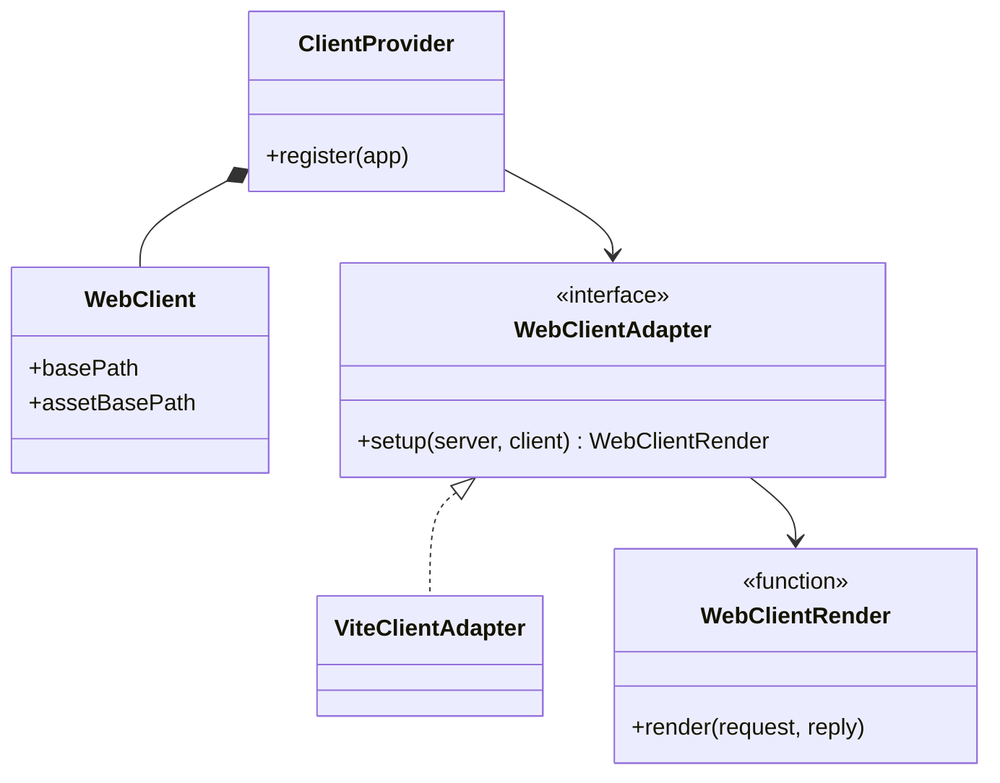
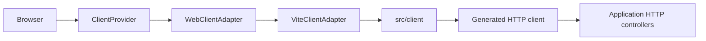
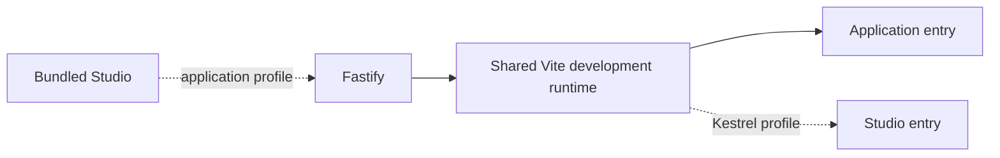
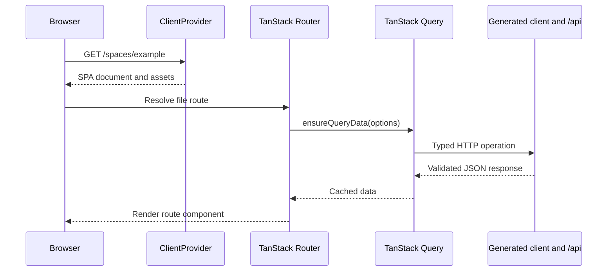
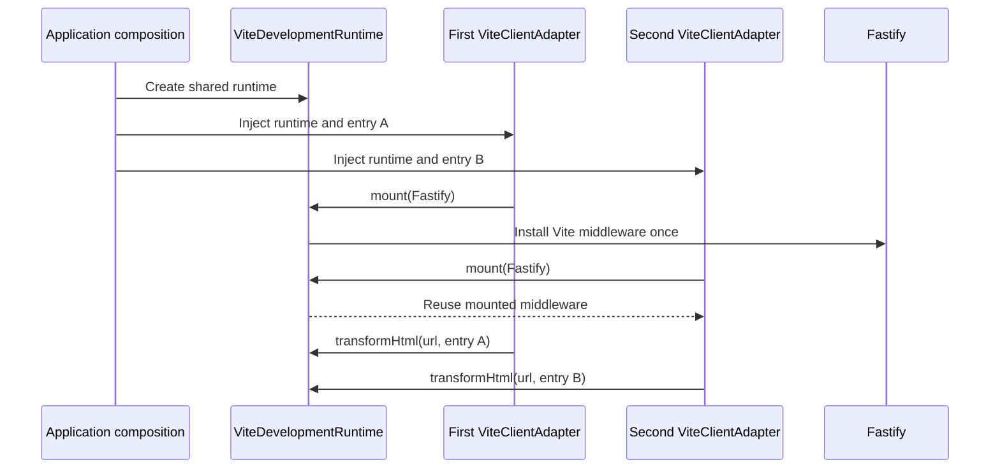

# Client delivery

[Documentation](../README.md) · [Implementation index](./README.md) · [Usage guide](../usage/client.md)

The client library mounts a browser application on the Kestrel HTTP runtime without depending on its component framework, router, cache, or business modules. The application client currently uses React, TanStack Router, and TanStack Query, but these choices remain below `src/client` and do not enter `packages/kestrel/src/client`.

## Concepts and model

A `WebClient` is the normalized description of one browser application mount. `ClientProvider` owns its HTTP routes and delegates document delivery to a `WebClientAdapter`. The adapter returns a `WebClientRender` function after it has installed any development or production runtime support on Fastify.



## Usage guide

For application setup and task-oriented examples, see the [Client delivery usage guide](../usage/client.md).

## Design and implementation



`ClientProvider` owns the HTTP boundary: the configured base path, asset sentinel, excluded JSON namespaces, and SPA fallback. It contributes an encapsulated HTTP extension and delegates document delivery to a `WebClientAdapter`. The renderer receives both the Fastify request and reply even though the first SPA adapter only needs the reply; this keeps request-aware SSR possible without changing the public contract.

`ViteClientAdapter` owns only Vite development middleware, production asset delivery, readiness, and HMR cleanup. Its required `devMode`, runtime-visible `projectRoot`, and `distDir` values are resolved and passed by the application. The application derives this root from `config.core.runtimeRoot`; the separately configurable editor project root must not enter filesystem operations. The adapter does not inspect environment variables or assume that the Vite application uses React.

An application may inject one `ViteDevelopmentRuntime` into several Vite adapters. The runtime creates one middleware-mode Vite server and owns its watcher, dependency optimizer, module graph, middleware and HMR socket. `runtime.entry({ root })` resolves a client's conventional `index.html` and `src/main.tsx` against that same shared root, with explicit `html` and `module` overrides available for other layouts. Each adapter still owns its standalone HTML contract and performs any client-specific configuration injection. Without an injected runtime, every adapter retains its autonomous Vite behavior; production delivery always remains bundle-based.




The development container keeps `NODE_ENV=development` for its long-running processes. Every standalone Vite bundle command explicitly scopes `NODE_ENV=production` so package export conditions select production React and TanStack implementations; Vite's production mode alone does not replace an existing process value. Development servers retain the ambient development condition.


## Application stack

The application-owned Vite project lives in `src/client`. TanStack Router generates its route tree from `.ts` route declarations. Route components live in separate `.tsx` modules so React Fast Refresh modules export components only.

The TanStack Router Vite plugin automatically separates non-critical route components into dynamic entries. The generated route manifest remains in the initial bundle so matching and loaders can start immediately, while each screen is fetched when navigation needs it. The build relies on these source-level boundaries and Rolldown's automatic shared-chunk analysis instead of forcing a broad vendor chunk, which would change cache topology without reducing the JavaScript required by the first screen.

TanStack Query is the single owner of server-state freshness and retries. Route loaders call `queryClient.ensureQueryData()` to start or reuse requests before rendering, while components consume the same query declarations. Router preloading remains enabled with `defaultPreloadStaleTime: 0`, allowing Query to perform deduplication and freshness decisions rather than maintaining a competing route-data cache.

The default retry policy retries network failures, `408`, `429`, and server errors at most twice. Client and authorization errors are final, and mutations are never assumed to be idempotent. Query functions call the generated application client, which remains independent from React and converts documented controller outputs to their JSON wire types.

## Execution scenarios

### SPA navigation



An excluded path follows a deliberately different branch: `ClientProvider` returns a JSON `404` without asking the adapter to render the SPA document. A missing path below `assetBasePath` also returns a dedicated asset `404`, preventing the SPA fallback from hiding deployment errors.

### Shared development runtime



## Public API

| Export | Purpose |
| --- | --- |
| `ClientProvider` | Contributes one encapsulated browser-client mount to the Kestrel HTTP runtime. |
| `ClientProviderOptions` | Configures the base path, asset path, excluded JSON namespaces and delivery adapter. |
| `WebClient` | Supplies the normalized mount paths to an adapter. |
| `WebClientRender` and `WebClientRenderContext` | Describe the request-aware document renderer returned by an adapter. |
| `WebClientAdapter` | Defines the delivery extension point. |
| `ViteClientAdapter` | Delivers a Vite application in autonomous development, shared development or bundled production mode. |
| `ViteDevelopmentRuntime` | Owns one reusable Vite development server and its entry resolution. |
| `DEFAULT_CLIENT_ASSET_BASE_PATH` | Exposes the default `/_client_assets/` sentinel path. |

## Adapter API

A client adapter implements one operation:

```ts
interface WebClientAdapter {
  setup(server: FastifyInstance, client: WebClient): Promise<WebClientRender>;
}
```

`setup()` runs once while the encapsulated Fastify extension is mounted. It may register routes, hooks, middleware and lifecycle cleanup, then must return a renderer for document requests. The renderer receives the original `request` and `reply`, may complete the reply itself, and may use request-specific information for SSR. Asset delivery must remain below `client.assetBasePath`; document delivery must honor `client.basePath`. Setup failures abort HTTP runtime construction, and render failures flow through Fastify's normal error handling. An adapter owns every resource it creates and must register cleanup with the Fastify scope that owns those resources.

## Product-specific user interfaces


## Potential evolutions

- Add a request-aware SSR adapter while preserving `ClientProvider` and the generated HTTP contracts.
- Move manual `/api` prefixes into application-owned controller groups once shared route transformations are implemented.
- Add other Vite component-framework applications without changing the Vite delivery adapter.
- Allow the application to derive shared-runtime optimizer entries from a client registry if the number of browser clients grows beyond the current explicit composition.
- Integrate self-hosted meta-frameworks such as Next or Nuxt through a dedicated runtime or reverse-proxy boundary when their ownership model cannot be represented as a Fastify renderer.
- Derive distributable declaration-only generated clients without type-only links to the application source tree.

## Composition reference

Applications normally compose the library through `ClientProvider` and the bundled Vite adapter:

```ts
app.register(new ClientProvider({
  basePath: "/",
  assetBasePath: "/_client_assets/",
  excludedPaths: ["/api"],
  adapter: new ViteClientAdapter({
    devMode: config.devMode,
    projectRoot: config.projectRoot,
    distDir: "dist/client",
  }),
}));
```

Use `ViteDevelopmentRuntime` when several browser clients should share one development server. Use `WebClientAdapter` directly when delivery is owned by another bundler, an SSR runtime, or a remote rendering boundary. The library is not intended to be called by browser code; it composes server-side delivery for a browser application.
