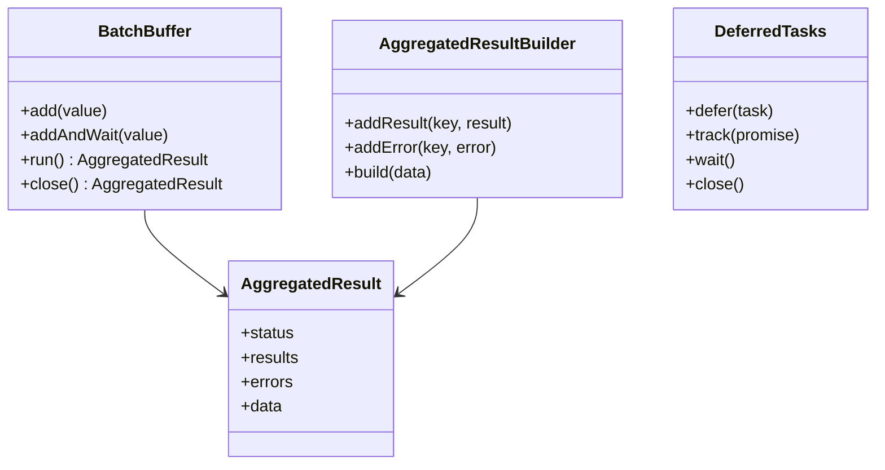
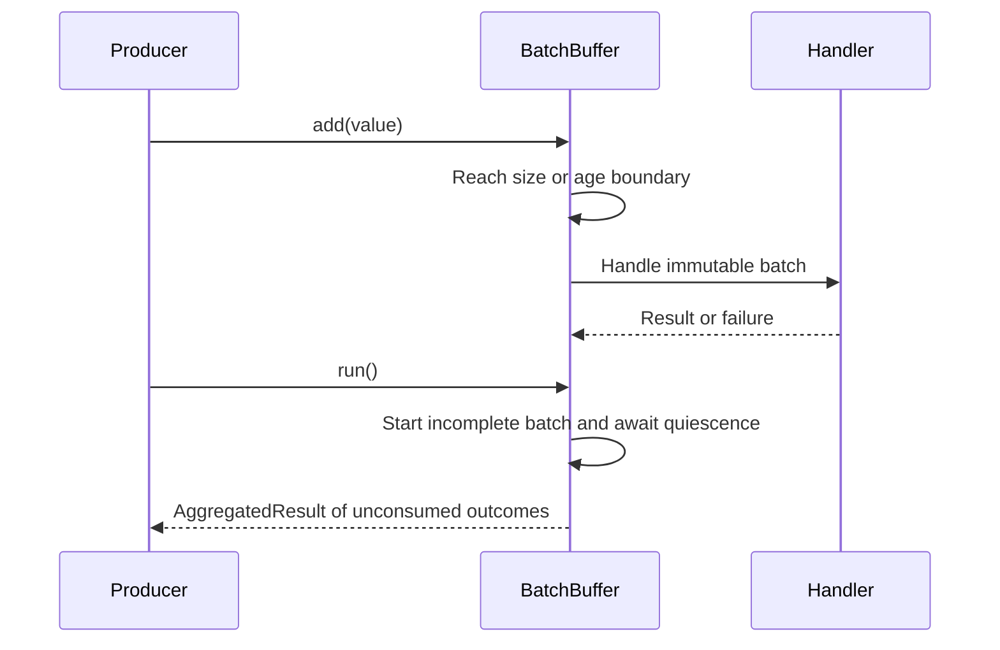
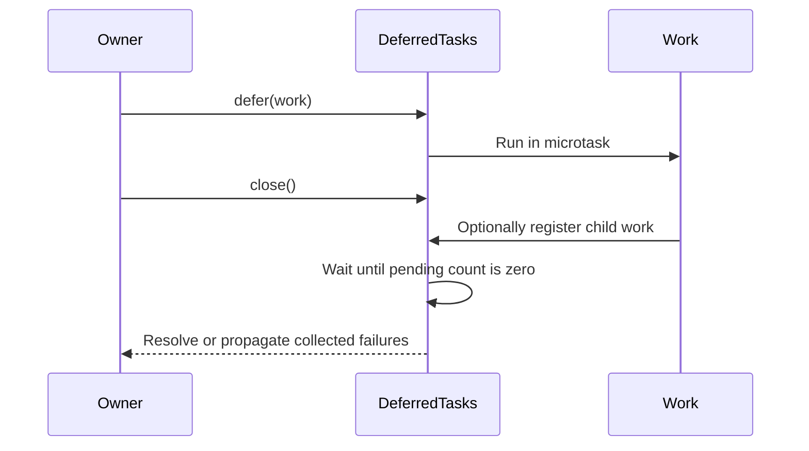

# Concurrency

[Documentation](../README.md) · [Implementation index](./README.md) · [Usage guide](../usage/concurrency.md)

Kestrel provides infrastructure-neutral concurrency primitives in `src/packages/kestrel/src/concurrency`. It includes in-memory batch buffering, deferred task tracking and a standard representation for aggregated bulk operation results.

## Concepts and model

The library contains three independent primitives rather than one shared runtime:

- `BatchBuffer` owns admission, size and age boundaries for ephemeral in-memory batches.
- `AggregatedResult` represents item-level successes and failures without losing a bulk operation's partial outcome.
- `DeferredTasks` gives an owning scope an explicit quiescence and close boundary for asynchronous work.



## Usage guide

For application setup and task-oriented examples, see the [Concurrency usage guide](../usage/concurrency.md).

## Design and implementation

All primitives are process-local and infrastructure-neutral. `BatchBuffer` serializes admission decisions synchronously and stores settled handler outcomes until a caller consumes them. `AggregatedResult` uses immutable snapshots so builders and source arrays cannot mutate completed results. `DeferredTasks` registers work before scheduling it and waits for the pending count to reach zero, including child work registered during draining.

The library deliberately does not infer delivery guarantees. A buffer handler owns admitted values, an aggregate only reports supplied outcomes, and a deferred-task group can wait only for explicitly registered work.

## Execution scenarios

### Buffered batch and drain



### Deferred task shutdown



## Public API

| API group | Main exports |
| --- | --- |
| Batch buffering | `BatchBuffer`, `BatchBufferOptions`, `BatchBufferResult`, `BatchBufferClosedError`, `BatchBufferResultNotFoundError` |
| Aggregated outcomes | `createAggregatedResult()`, `AggregatedResultBuilder`, `collectAggregatedResult()`, `runAggregatedResult()`, `mergeAggregatedResults()`, `createAggregatedResultSchema()` and their result and producer types |
| Deferred ownership | `DeferredTasks`, `DeferredTask`, `DeferredTasksState`, `DeferredTasksOptions`, `DeferredTasksClosedError` |

The concurrency library has no adapter API. Callers inject ordinary handlers, producers and callbacks, keeping infrastructure concerns outside these primitives.

## Batch buffers

`BatchBuffer` collects individual in-memory values and passes them to an asynchronous handler in strictly bounded batches. A batch becomes ready when it reaches `maxBatchSize`, when `maxWaitMs` has elapsed since its first value was added, or when `run()` forces the current incomplete batch.

```ts
const buffer = new BatchBuffer<AuditEvent>({
  maxBatchSize: 100,
  maxWaitMs: 25,
  execution: "sequential",
  handler: async (events) => {
    await auditWriter.append(events);
  },
});

buffer.add(event);
const result = await buffer.run();
```

`add()` is synchronous. Size and timeout triggers run in the background without creating an unhandled rejection: each handler invocation produces one outcome retained until the next `run()` boundary. The outcome key is the exact readonly batch passed to the handler, the successful result is the handler's return value, and a rejection is kept as an `unknown` error. `run()` starts the current incomplete batch, waits for quiescence including values added while it is draining, and returns all unconsumed outcomes as an `AggregatedResult`. A later run does not repeat outcomes that a previous run has consumed.

When the handler itself returns an `AggregatedResult` keyed by the exact buffered values, `addAndWait()` adds one value and returns its individual result. An error associated with that value rejects the returned promise with the original error. Every awaited value must have exactly one outcome in the handler aggregate; an omitted outcome rejects with `BatchBufferResultNotFoundError`. Equal values are matched to outcomes in their admission order.

The buffer never retries or reinserts a failed batch. The handler owns a batch as soon as its invocation is admitted and must provide any domain-specific delivery or idempotency policy. Other ready batches still execute after a failure, allowing `run()` to report a complete `partial` result.

`execution: "sequential"` admits ready batches in order but starts each handler only after the previous one settles. `execution: "parallel"` starts all ready batches independently. In sequential mode, `maxWaitMs` controls when a batch becomes ready; a slow earlier handler can still delay its execution.

`close()` synchronously rejects later additions, drains the remaining values and shares one terminal aggregated result across repeated calls. Timers are unreferenced, so an otherwise idle Node.js process is not kept alive solely by buffered values. The primitive does not persist values and process termination can lose pending data.

### Potential evolutions

A numeric `maxConcurrency` could generalize the current sequential and unbounded parallel policies when a consumer needs bounded parallelism. A maximum pending value count and an explicit overflow policy could also provide memory backpressure; they are omitted until a caller has requirements for rejecting, dropping or blocking producers.

The observation recorder uses `BatchBuffer` for size, age, sequential execution and drain boundaries. It retains overload accounting, retry delays, storage-failure policy and health in the observability library because those concerns are domain-specific. In particular, a recorder batch remains owned by its handler until its bounded write attempts settle; `BatchBuffer` does not reinsert it. The PostgreSQL log transport uses similar size and time boundaries around an asynchronous iterator and can be reconsidered separately if its lifecycle requirements justify the same primitive.

## Aggregated results

`AggregatedResult` represents the complete outcome of a bulk operation. It keeps successful results and errors in separate collections and derives a global `success`, `error` or `partial` status from their contents.

```ts
const aggregated = createAggregatedResult({
  results: [
    { key: "contact-1", result: { imported: true } },
  ],
  errors: [
    { key: "contact-2", error: { code: "duplicate" } },
  ],
  data: {
    durationMs: 24,
  },
});

aggregated.status; // "partial"
```

The key, successful result, error and global data types are independent generic parameters. Consumers can therefore use domain errors that are safe to serialize instead of exposing `unknown` when the aggregate crosses a transport boundary.

The global status follows these invariants:

- `success` means that no item failed. An empty bulk operation is therefore successful.
- `error` means that at least one item failed and none succeeded.
- `partial` means that the operation contains both successful and failed items.

`createAggregatedResult()` copies its input collections. The returned arrays are readonly and remain stable if the source collections are later changed.

### Building and collecting results

`AggregatedResultBuilder` accumulates outcomes without copying the complete result after every item. `build()` creates a stable snapshot, optionally with global result data, and the builder can continue to accumulate items afterward.

```ts
const builder = new AggregatedResultBuilder<string, Contact, ImportError>();

for (const contact of contacts) {
  try {
    builder.addResult(contact.id, await importContact(contact));
  } catch (error) {
    builder.addError(contact.id, normalizeImportError(error));
  }
}

const result = builder.build({ processedAt: new Date() });
```

`collectAggregatedResult()` accepts an `Iterable` or `AsyncIterable` of discriminated outcomes. This is useful for streamed bulk APIs whose items settle progressively:

```ts
const result = await collectAggregatedResult(processContacts(contacts));
```

### Running result producers

`runAggregatedResult()` standardizes operations that may be implemented as either a regular function or a generator. A regular function receives an `AggregatedResultBuilder`; its return value becomes the aggregate's global data:

```ts
const result = await runAggregatedResult(async (builder) => {
  for (const contact of contacts) {
    try {
      builder.addResult(contact.id, await importContact(contact));
    } catch (error) {
      builder.addError(contact.id, normalizeImportError(error));
    }
  }

  return { processed: contacts.length };
});
```

A synchronous or asynchronous generator instead yields discriminated item outcomes. Its final `return` value supplies the same global data:

```ts
const result = await runAggregatedResult(async function *() {
  for (const contact of contacts) {
    try {
      yield {
        key: contact.id,
        status: "success",
        result: await importContact(contact),
      };
    } catch (error) {
      yield {
        key: contact.id,
        status: "error",
        error: normalizeImportError(error),
      };
    }
  }

  return { processed: contacts.length };
});
```

The generator is advanced manually so its return value is preserved; `for await...of` would discard it. The optional `onYield` callback is awaited before each outcome is added to the aggregate, allowing a consumer such as the worker scheduler to validate or persist progressive results. A callback failure closes the generator before propagating the original error.

A regular function with no return and a generator returning nothing both produce `data: undefined`. If the producer throws or generator iteration fails, the error is propagated and no partial aggregate is returned. Consumers that persist outcomes from `onYield` remain responsible for tracking that progressive state when handling a later producer error.

`mergeAggregatedResults()` combines several completed aggregates, such as paginated or chunked operations. The source global data is deliberately not merged implicitly; the caller may provide new global data describing the combined operation.

### Runtime schemas

`createAggregatedResultSchema()` creates a Zod schema from the schemas for keys, results, errors and optional global data:

```ts
const importResultSchema = createAggregatedResultSchema({
  key: z.string(),
  result: importedContactSchema,
  error: importErrorSchema,
  data: z.object({ durationMs: z.number() }),
});
```

The generated schema applies transformations from its component schemas and rejects a global status that is inconsistent with the parsed result and error collections. When `data` is omitted, the schema accepts only `undefined` global data.

### Worker composition

Batch workers use `runAggregatedResult()` to consume their result generators. Its per-yield callback validates job identities and sends successful outcomes to a shared acknowledgement buffer, while the final aggregate determines the remaining failure transitions. A handler returning nothing retains its meaning that every job succeeded, and a generator can attach batch-level data through its final return value.

### Potential evolutions

A generic expected-key validator may be added when several consumers need the same completeness and uniqueness guarantees. Keeping it separate from the core aggregate avoids imposing worker-specific cardinality rules on bulk operations that legitimately return only a subset of their inputs.

Global data merging policies may also be introduced for common chunked operations. The current explicit replacement behavior avoids guessing whether domain data should be summed, concatenated or recomputed.

## Deferred tasks

`DeferredTasks` represents asynchronous work that must settle before an owning resource scope is released. The owner may be an application execution, the complete application or any other component with an asynchronous lifetime.

The primitive does not depend on the application, dependency injection or events. Those layers can compose it without introducing their own promise tracking policy.

```ts
const tasks = new DeferredTasks({
  onError: (error, context) => {
    logger.error({ err: error, task: context.name }, "Deferred task failed");
  },
});
```

### Deferring work

`defer()` schedules a callback in a microtask and registers it synchronously before returning:

```ts
tasks.defer(
  async () => {
    await auditLog.write(entry);
  },
  { name: "audit-log.write" },
);
```

The method deliberately returns `void`: ownership of completion and failure passes to the group. Synchronous callback errors and promise rejections are both captured.

`track()` attaches a promise that has already been created. Its returned promise preserves the original value or rejection for callers that need it:

```ts
const result = await tasks.track(client.send(request), {
  name: "client.send",
});
```

An internal rejection observer makes it safe to ignore the returned promise. The failure remains recorded by the group and is surfaced at its next wait boundary.

### Waiting for quiescence

`wait()` resolves when the number of pending tasks reaches zero. It includes tasks registered by work that was already pending, rather than waiting for a fixed initial snapshot:

```ts
tasks.defer(async () => {
  await firstStep();
  tasks.defer(secondStep);
});

await tasks.wait(); // Both steps have settled.
```

The group stays open after `wait()`, so another work cycle can be registered and awaited later.

One failure is propagated directly. Several failures produce an `AggregateError` after every task has settled. A completed wait consumes the errors accumulated since the previous boundary, preventing an old failure from rejecting later lifecycle stages. Concurrent waiters for the same active cycle receive the same result.

The optional `onError` callback reports each failure immediately. Synchronous and asynchronous failures from the reporter are contained and never replace the original task result.

### Closing a group

`close()` waits for quiescence and permanently closes registration:

```ts
try {
  await tasks.close();
} finally {
  await ownedResources.dispose();
}
```

The group moves through `open`, `closing` and `closed` states. Pending tasks may register child work while the group is closing. The transition to `closed` happens atomically when the pending count reaches zero, and later `defer()` or `track()` calls throw `DeferredTasksClosedError` synchronously.

Repeated `close()` calls share the same promise and result.

`DeferredTasks` can only account for explicitly registered work. A pending task may create more registered tasks before settling, but work launched later by an untracked timer or callback cannot be discovered automatically.

## Kestrel composition

An application execution owns one group. `listenAsync()` work dispatched from that execution is registered in this group, including listeners declared by an ancestor bus, and other execution-level components can defer work directly. Once primary work has produced its result, execution disposal dispatches `execution.completed`, closes the group and only then disposes its scoped dependency container.

The application owns a separate group for work that must finish before global application resources are released. Keeping these groups separate prevents one request or command from inheriting the lifetime of unrelated work.

The concurrency library itself still only defines task ownership and quiescence semantics. Event and application modules perform the integration without introducing dependencies back into this base primitive.
