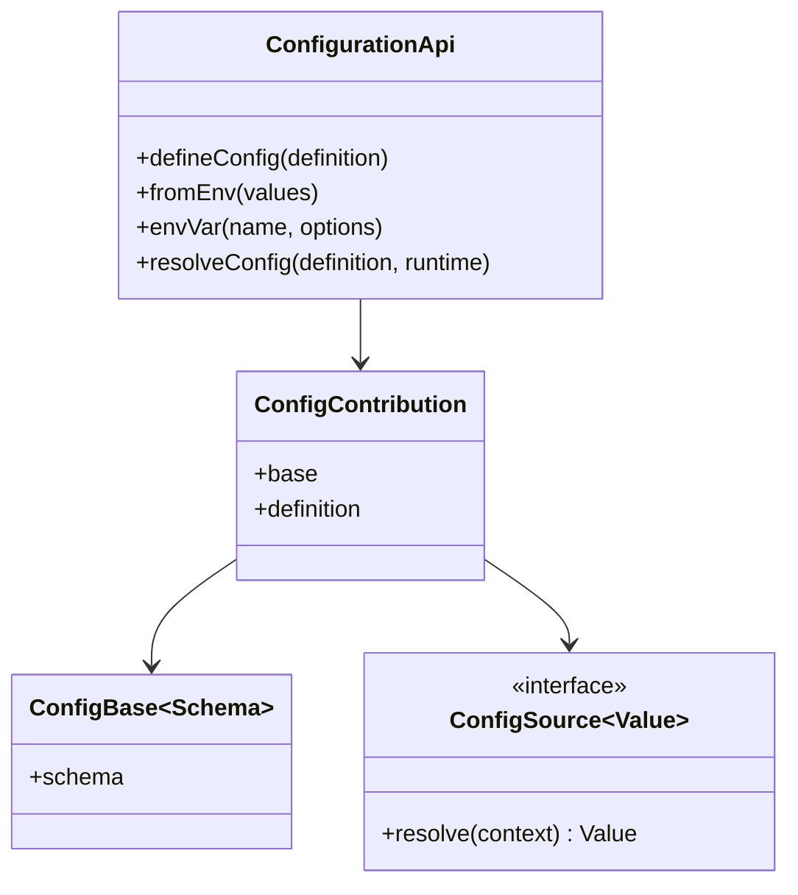
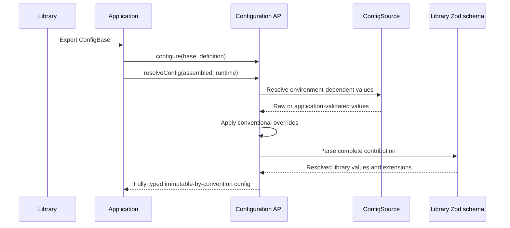

# Configuration

[Documentation](../README.md) · [Implementation index](./README.md) · [Usage guide](../usage/configuration.md)

Configuration is declared in TypeScript and resolved once at application boot. Application code receives a fully resolved and typed object and must never access `process.env` directly.

The configuration system separates three responsibilities:

- The configuration library defines the primitives used to declare, complete and resolve configuration.
- Each library owns a Zod configuration base describing its required values, accepted inputs, transformations and defaults.
- The application supplies deployment-specific values and overrides through focused factories, then declares its environments and assembles the final configuration in `src/server/core/app_config.ts`.

## Concepts and model

A `ConfigBase` is the runtime-validated contract owned by one library. `configure()` combines that base with application values and extensions to produce a `ConfigContribution`. A `ConfigSource` defers one value until resolution has the active environment, runtime variables and complete property path. `resolveConfig()` walks the assembled definition, resolves sources and validates each contribution.



## Usage guide

For application setup and task-oriented examples, see the [Configuration usage guide](../usage/configuration.md).

## Design and implementation

Configuration is a synchronous, recursive resolution pass followed by Zod parsing at every library contribution. Exact TypeScript shapes preserve application extensions, while runtime schemas remain authoritative for values consumed by libraries. Explicit environment-variable bindings are tracked by path, and conventional overrides are derived only from stable schema leaves. Unknown, colliding or doubly bound variables fail resolution.

There is no implicit deep merge. Composition is explicit TypeScript object construction, which keeps ownership and precedence visible. The library does not define environment names or access `process.env`; the application passes both through `ResolveConfigOptions`.

## Execution scenario



## Public API

| API group | Main exports |
| --- | --- |
| Library contracts | `defineConfigBase()`, `ConfigBase`, `ConfigDefinition`, `ConfigOutput` |
| Application composition | `configure()`, `ConfigContribution`, `createConfigurationApi()`, `defineConfig()` on the specialized API |
| Runtime sources | `ConfigSource`, `fromEnv()`, `envVar()` and `envs()` on the specialized API |
| Resolution | `resolveConfig()` on the specialized API, `ResolveConfigOptions`, `ResolvedConfig`, `RuntimeEnvironment` |
| Failures | `ConfigurationError` |

The configuration library has no adapter API. Runtime sources are intentionally small value resolvers, not infrastructure adapters; future secret or remote-configuration integrations would need to preserve path-aware validation and the current explicit resolution boundary.

## Library configuration bases

A library declares its contract with `defineConfigBase()`:

```ts
import { z } from "zod";

import {
  defineConfigBase,
  type ConfigOutput,
} from "../configuration/index.js";

export const cacheConfigBase = defineConfigBase(z.object({
  namespace: z.string().min(1),
  defaultTtlSeconds: z.union([z.number(), z.string()])
    .pipe(z.coerce.number<string | number>().int().positive())
    .default(3_600),
  maxEntries: z.union([z.number(), z.string()])
    .pipe(z.coerce.number<string | number>().int().positive())
    .default(100_000),
}));

export type CacheConfig = ConfigOutput<typeof cacheConfigBase>;
```

The base is the source of truth for the fields consumed by the library. A property without a Zod default is required from the application. `ConfigOutput` exposes the resolved type guaranteed to library consumers.

Configuration bases are object schemas because an application may add sibling fields without changing the library. Library validation runs in passthrough mode during resolution: declared fields are parsed by Zod and application extensions are preserved.

## Application completion and extensions

The application completes a base with `configure()`. Its second argument is contextually typed from the base, so editors suggest the library fields and TypeScript checks required and static values.

```ts
import { z } from "zod";

import type { AppConfigurationApi } from "../app_config.js";
import { cacheConfigBase } from "@kestreljs/framework/cache";
import { configure } from "@kestreljs/framework/configuration";

export function createCacheConfig({ envVar }: AppConfigurationApi) {
  return configure(cacheConfigBase, {
    // The application supplies required deployment identity.
    namespace: "application",

    // This field belongs only to the application and remains available in AppConfig.
    metricsPrefix: "application_cache",

    // Dynamic application extensions must carry their own validation.
    alertThreshold: envVar(
      "CACHE_ALERT_THRESHOLD",
      z.coerce.number().positive().default(1_000),
    ),
  });
}
```

The resolved result combines the base output and the exact resolved extension type:

```ts
config.cache.defaultTtlSeconds; // number from the library base
config.cache.metricsPrefix; // "application_cache" from the application
config.cache.alertThreshold; // number from the application
```

Static application extensions rely on their inferred TypeScript type. Dynamic extensions must use a validating source because no library schema knows their contract.

## Conventional environment overrides

An application can reserve a prefix for schema-derived environment variables:

```ts
const configurationApi = createConfigurationApi({
  environments: ["local", "test", "stage", "prod"],
  defaultEnvironment: "local",
  environmentOverrides: {
    prefix: "APP_CONFIG",
  },
});
```

Every stable leaf declared by a `ConfigBase` then receives one conventional name. Double underscores separate configuration path segments, while camel-case boundaries inside a segment become single underscores:

```env
APP_CONFIG__CACHE__NAMESPACE=shared
APP_CONFIG__CACHE__DEFAULT_TTL_SECONDS=7200
APP_CONFIG__LOGGER__EXECUTION_LOG__ENABLED=false
```

The complete application path is part of the name, so two instances of the same library mounted at different paths remain distinct. Conversion is mechanical: for example, `authentication.mechanisms.password.hashing.argon2id.memoryKiB` becomes `APP_CONFIG__AUTHENTICATION__MECHANISMS__PASSWORD__HASHING__ARGON2ID__MEMORY_KI_B`.

Conventional values are applied after `fromEnv()` and every other `ConfigSource` has resolved, but before the contribution's final Zod parse. They therefore override both static values supplied to `configure()` and fields selected for an application environment. Fields omitted from `configure()` remain addressable because the catalog comes from the library schema rather than the application definition. Zod defaults still apply when neither the definition nor the environment supplies a value.

Raw strings are tried first so string schemas and coercing schemas retain their normal behavior. If a raw string is rejected, JSON primitive decoding is tried before the value is rejected; this allows `true`, `false` and values accepted only as numbers to reach boolean and numeric schemas without making string values ambiguous.

The reserved prefix is strict. Resolution fails when a defined variable under `APP_CONFIG__` has no known target, when two paths collapse to the same name, or when an invalid value is supplied. Errors include both the variable name and configuration path. This turns misspellings and ambiguous conversions into boot failures instead of ignored deployment settings.

Arrays, tuples, records, maps, sets, lazy or intersected schemas, and unions containing object branches are intentionally excluded. Indices and dynamic keys are not stable deployment interfaces, while polymorphic objects require an explicit discriminator-aware representation. Such fields can still use `envVar()` with application-owned parsing.

Purely application-owned sections declared with `defineConfig()` are also excluded because they have no runtime schema from which to derive validation or supported paths. They continue to use static values, `fromEnv()` or explicit `envVar()` sources.

## Runtime sources

Dynamic values are represented as unresolved `ConfigSource` values. `fromEnv()` selects a value for the active application environment and `envVar()` reads a runtime environment variable.

Locally, environment variables can be loaded from a `.env` file with `dotenv` at the application resolution boundary.

When an environment variable fills a field declared by a configuration base, its validation is intentionally omitted:

```ts
export function createHttpConfig({
  envVar,
  fromEnv,
}: AppConfigurationApi) {
  return configure(httpConfigBase, {
    host: envVar("HOST"),
    port: envVar("PORT"),
    fastifyLogs: fromEnv({
      local: false,
      test: false,
      default: true,
    }),
  });
}
```

The raw string or `undefined` is resolved first, then the base schema validates and transforms it. Preserving `undefined` allows Zod defaults to apply. For example, an absent `PORT` variable can become the default port declared by `httpConfigBase`.

An application-specific fallback can be supplied without repeating validation:

```ts
namespace: envVar("CACHE_NAMESPACE", { fallback: "application" }),
```

The fallback is also passed through the library base. The validating `envVar(name, schema)` overload remains available for standalone application fields that do not belong to a library base.

An explicit `envVar()` binding is authoritative for its path and disables the conventional alias. Supplying both `PORT` and `APP_CONFIG__HTTP__PORT` when `http.port` explicitly uses `envVar("PORT")` fails instead of choosing a hidden precedence. An explicit binding may itself use the exact conventional name when that is useful.

## Final assembly and resolution

Configuration factories receive the already specialized API and are gathered explicitly in the application bootstrap:

```ts
const configurationApi = createConfigurationApi({
  environments: ["local", "test", "stage", "prod"],
  defaultEnvironment: "local",
  environmentOverrides: {
    prefix: "APP_CONFIG",
  },
});

export type AppConfigurationApi = typeof configurationApi;

const configDefinition = configurationApi.defineConfig({
  core: createCoreConfig(configurationApi),
  cache: createCacheConfig(configurationApi),
  database: createDatabaseConfig(configurationApi),
  http: createHttpConfig(configurationApi),
});

export const appConfig = configurationApi.resolveConfig(configDefinition, {
  environment,
  env: process.env,
});

export type AppConfig = typeof appConfig;
```

The factories import `AppConfigurationApi` with a type-only import, so they retain exact environment-name checks without creating a JavaScript initialization cycle with the bootstrap. Resolution recursively evaluates every source, applies conventional overrides, and then parses each contribution with its library base. Validation failures include the complete application path, such as `cache.defaultTtlSeconds`.

`defineConfig()` remains appropriate for purely application-owned sections that do not complete a library base.

## Environments

Kestrel does not define application environment names. It exposes a factory that creates an environment-aware configuration API:

```ts
const configurationApi = createConfigurationApi({
  environments: ["local", "test", "stage", "prod"],
  defaultEnvironment: "local",
});

export type Environment =
  (typeof configurationApi.environments)[number];
```

The same value can target several environments without repeating its declaration:

```ts
const ssl = configurationApi.fromEnv({
  ...configurationApi.envs(["local", "test"], false),
  default: true,
});
```

The application specializes this API in `src/server/core/app_config.ts`. The environment is resolved at the same configuration boundary using the validated `ENVIRONMENT` variable and defaults to `local` when omitted. The `test` environment is used by automated tests both locally and in CI.

The application-owned `config.core.debug` value is enabled for `local` and `test`, and disabled for `stage` and `prod`. Transport error handlers use it to decide whether unexpected error details may be exposed; it does not affect complete internal logging. `config.core.executionContext.maxEntrySizeBytes` and `maxTotalSizeBytes` bound JSON diagnostics retained by each execution, defaulting to 16 KiB and 64 KiB and accepting overrides through `EXECUTION_CONTEXT_MAX_ENTRY_SIZE_BYTES` and `EXECUTION_CONTEXT_MAX_TOTAL_SIZE_BYTES`. The application explicitly passes this policy to `App`, so Kestrel remains independent from both the application configuration shape and environment variables. `config.core.runtimeRoot` retains the application working directory used for mounted files and runtime integrations. `config.core.projectRoot` separately identifies the project root as seen by developer tools. It defaults to the runtime root and can be overridden through `PROJECT_ROOT` when the application runs in a container whose source paths differ from the host editor paths. Studio combines both values when generating source links; runtime integrations such as Vite must never resolve files through the editor path.

## Future evolutions

The contribution wrapper deliberately leaves room for additional runtime sources such as encrypted or asynchronous secrets, generated configuration documentation and deprecated-field metadata. These features are not implemented yet. Resolution currently remains synchronous and each application supplies one definition per library base; deep implicit merging remains intentionally unsupported.

The conventional target catalog is currently internal to resolution. A future inspection API could expose it for deployment manifests, generated `.env.example` files and secret-manager templates without duplicating naming logic. Complex values could later opt into explicit schema metadata, but arrays and polymorphic objects should not become implicitly addressable without a stable representation.

Configuration factories currently use a type-only reference to `app_config.ts` so unsupported environment names fail where a fragment is authored. A future declaration API could instead carry environment names as phantom source metadata and validate them during final assembly. That would make fragments completely independent from the final configuration assembly, but the additional Kestrel type machinery is deferred until configuration fragments need to be shared between applications.

Drizzle Kit uses the side-effect-free `drizzle.database.ts` tooling boundary because its CommonJS configuration loader cannot load the complete application composition graph. This helper validates credentials with the Kestrel database schema and mirrors the application's database environment policy. A future configuration artifact format could let external tools consume selected resolved sections directly without either loading the bootstrap or maintaining this explicit tooling adapter.


## Backend-specific configuration

Feature providers receive common validated settings separately from adapter definitions. Application contributions can nest another `configure()` result under `adapter`; the existing resolver preserves its schema, inferred output and conventional environment overrides. Cache, throttling and workflow backend schemas live beside their concrete adapters. No connection instance or factory is placed in resolved configuration. See [usage and migration](../usage/configuration.md#configure-providers-and-their-backends) and [resource lifecycle](./app.md#adapter-definitions-and-resource-ownership).
