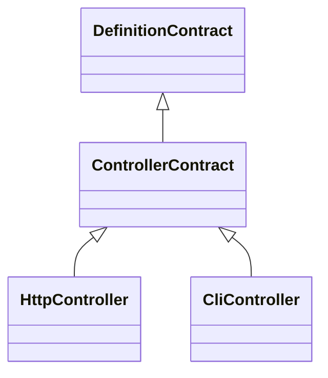
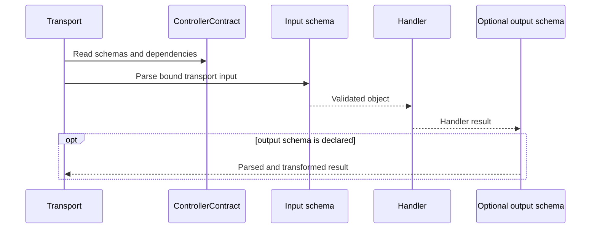

# Controller contracts

[Documentation](../README.md) · [Implementation index](./README.md) · [Usage guide](../usage/controllers.md)

The controllers library contains the transport-independent type contract shared by HTTP and CLI controllers. It is a lower-level modeling library; concrete declaration, execution and middleware APIs remain in their transport libraries.

## Concepts and model

A `ControllerContract` is an inspectable executable definition with an object input schema, an optional output schema, optional description metadata and dependency declarations. `ControllerHandlerResult` derives what a handler may return from the presence of its output contract.

## Usage guide

For application setup and task-oriented examples, see the [Controller contracts usage guide](../usage/controllers.md).

## Design and implementation

The library is types-only except for the shared empty input schema kept internal to transport factories. It prevents HTTP and CLI declarations from independently redefining output and dependency inference while leaving route, command, request and presentation behavior to their owning libraries.

When no output schema is declared, `ControllerHandlerResult` is `unknown`: the transport may send an undocumented value. When a schema exists, the handler returns that schema's input type so output transformations can still run before serialization.

## Execution scenario

## Public API

| Export | Purpose |
| --- | --- |
| `ControllerContract` | Shared definition shape implemented by transport controllers. |
| `ControllerObjectSchema` | Zod object constraint required for named input binding. |
| `ControllerOutputSchema` | Optional Zod output contract. |
| `ControllerHandlerResult` | Infers the handler return input accepted by an output schema. |

The library has no adapter API. A new transport specializes `ControllerContract` and documents its own binding, lifecycle, middleware and error representation contracts.

## Potential evolutions

Common example or deprecation metadata should move here only when every controller transport gives it the same semantics. Transport-specific fields must remain with their owner.
