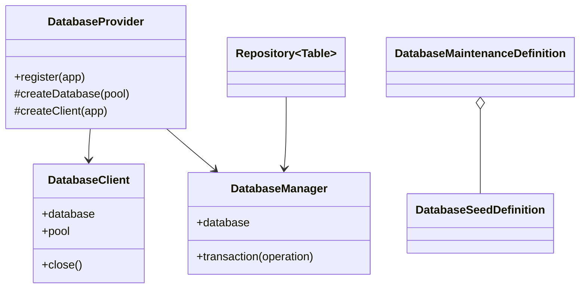
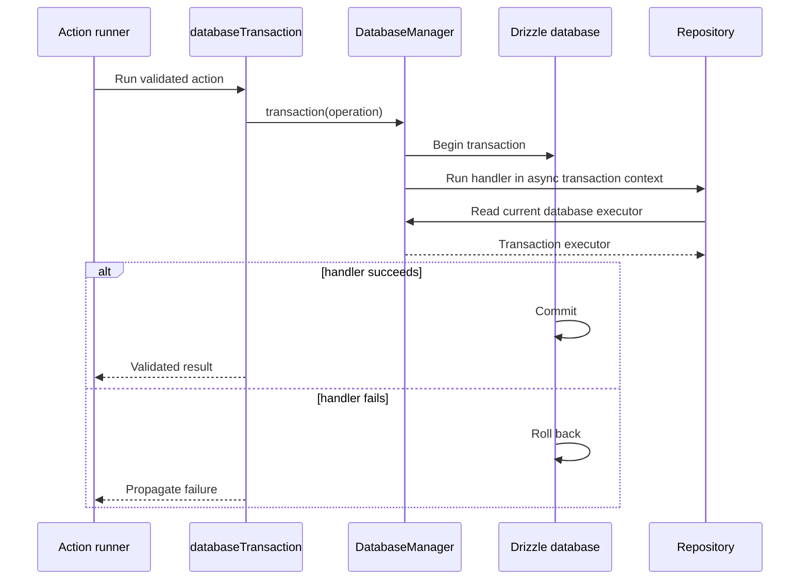
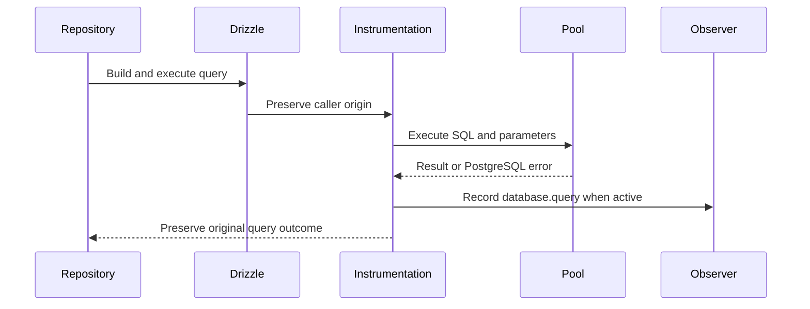
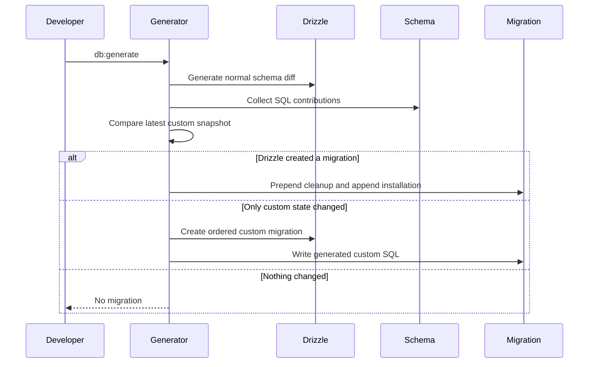
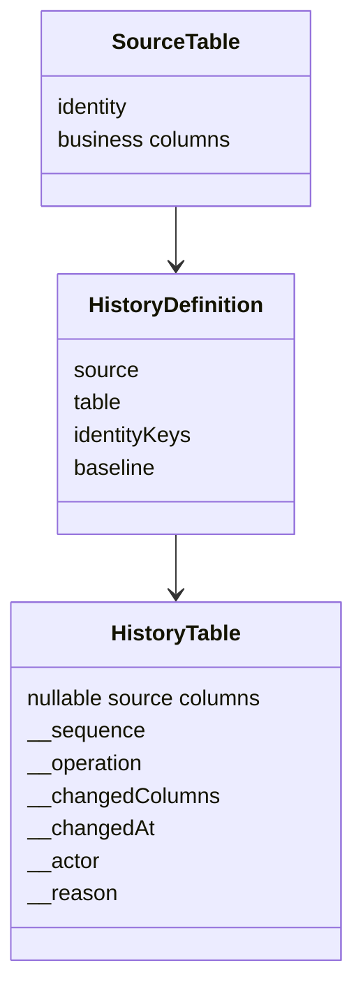
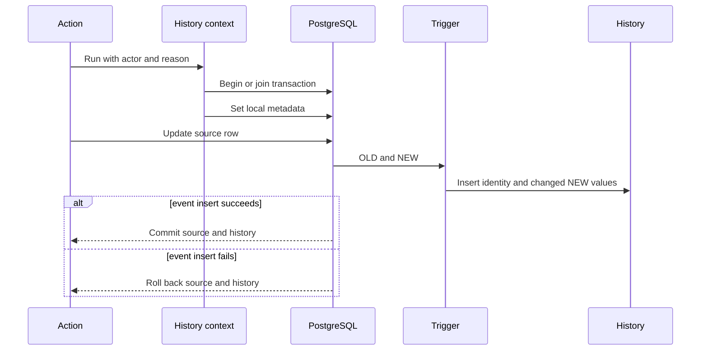

# Database

[Documentation](../README.md) · [Implementation index](./README.md) · [Usage guide](../usage/database.md)

The database libraries provide PostgreSQL and Drizzle composition, execution-scoped transaction selection, reusable repository and pagination foundations, query observations, and declarative local maintenance and seeding.

## UUID generation and PostgreSQL compatibility

PostgreSQL adapters require PostgreSQL 18 or later. Database-generated UUID columns use Drizzle's `.default(sql`uuidv7()`)`, and SQL reservation operations use the same native function. IDs generated before insertion use `createUuid()` from `utils/uuid.js`; injectable generator options remain supported. UUID columns and generic UUID validators continue accepting caller-supplied identifiers of other versions.

Changing a column default affects subsequent inserts only. Existing identifiers, foreign keys and history references are preserved when applying migrations to an existing database. Recreating disposable databases and seeding them after migrations produces new v7 identities. Keep migration-owned schema changes in ordered migrations and development-only objects in the existing aligned push-schema exports and table filters.

See [Kestrel utilities](../usage/utilities.md#generate-an-identifier) for timestamp, ordering and runtime guarantees. Support for older PostgreSQL versions through an injected SQL UUID function is a possible future extension, not an automatic fallback.

## Concepts and model

`DatabaseProvider` owns one lazy `DatabaseClient`, which combines a node-postgres pool and a Drizzle facade. Every execution resolves a scoped `DatabaseManager`; repositories ask that manager for the current executor, so an ambient transaction is selected without changing repository instances. Database maintenance is declared separately as reset and seed definitions and executed by focused CLI controllers.



## Usage guide

For application setup and task-oriented examples, see the [Database usage guide](../usage/database.md).

## Design and implementation

The provider registers the pool and Drizzle facade lazily as application singletons and registers `DatabaseManager` as scoped. `AsyncLocalStorage` binds a Drizzle transaction to the current asynchronous branch. Nested transactions join the existing boundary, while parallel branches in one execution do not leak transaction state into each other.

Query instrumentation wraps both the physical pool and deferred Drizzle builders so raw, prepared, generated and transactional commands share observation semantics. Repositories own deterministic ordering and persistence mapping; schema composition and migration policy remain application concerns.

## Execution scenarios

### Transactional action



### Query observation



## Public API

| API group | Main exports |
| --- | --- |
| Runtime composition | `DatabaseProvider`, `DatabaseClient`, `databaseConfigBase`, `DatabaseConfig` |
| Scoped execution | `DatabaseManager`, `DatabaseExecutor`, `databaseTransaction` |
| Repository and collections | `Repository`, repository option types, collection query/filter/sort types |
| Pagination | `paginateQuery()`, `getPaginationQueryWindow()`, `getCursorPaginationCondition()`, `createPaginatedResult()` and pagination model types |
| Observability | `databaseQueryObservation`, `recordDatabaseQueryInstrumentation()` and query instrumentation/origin types |
| Shared schema | `utilsSchema` |
| Custom schema contributions | `defineDatabaseSchemaContribution()`, `defineDatabaseSchemaDescription()`, `defineDatabaseTableDescriptions()`, `defineUnloggedTable()`, `getDatabaseSchemaContributions()`, `applyDatabaseSchemaContributions()`, `generateDatabaseMigration()` and contribution/generation types |
| History | `defineHistoryTable()`, `runWithHistoryContext()`, `getHistoryTableDefinitions()`, `createHistoryTriggerSql()` and the history definition/context types |
| Maintenance and seeding | `migrateDatabase()`, `defineDatabaseMaintenance()`, `defineDatabaseSeed()`, `resetDatabase()`, `seedDatabase()`, `LocalDatabaseMaintenance`, `databaseCliControllers` and migration/seed/reset contract types |

Repositories support `all`, `page` and forward `cursor` strategies through `findAll()` and the protected `findAllWhere()` helper. Cursor-enabled repositories declare `cursor.orderBy`, `cursor.getCursor` and `cursor.getCondition` in `RepositoryOptions`, with an optional fifth repository type argument for the structured cursor. See [pagination](./pagination.md#cursor-pagination) for configuration, standalone query composition, precision guarantees and future transport integration. Conventional `findCollection()` queries continue to use numbered pagination.

## Custom schema contributions

For application setup and library installation, follow [Install library schemas](../usage/database.md#install-library-schemas).

Drizzle Kit models tables, columns, indexes and other supported schema objects, but not every PostgreSQL property or object. A database schema contribution attaches the missing declarative SQL to an object already exported by the Drizzle schema. The metadata is stored under a non-enumerable symbol, so Drizzle continues to receive the original table unchanged.

Library helpers should normally own the details. For example, `defineUnloggedTable(table)` attaches the `SET UNLOGGED` lifecycle and returns the same typed table. `defineHistoryTable()` similarly attaches its generated functions, triggers and optional baseline copy without requiring application SQL. A library with another PostgreSQL object can use `defineDatabaseSchemaContribution(target, definition)` directly. Each definition has a globally stable id, installation SQL, optional update SQL and optional cleanup on either side of Drizzle's DDL.

```ts
export const records = defineDatabaseSchemaContribution(
  databaseSchema.table("record", columns),
  {
    id: "postgres.table:example.record:custom-property",
    installSql: 'ALTER TABLE "example"."record" ...;',
    updateSql: 'ALTER TABLE "example"."record" ...;',
    uninstallAfterSql: 'ALTER TABLE "example"."record" ...;',
  },
);
```

The id describes desired schema state rather than one migration occurrence. SQL strings may contain several PostgreSQL statements. Cleanup belongs in `uninstallBeforeSql` when it must see old table names or structures, and in `uninstallAfterSql` when it should observe Drizzle's new state. Helpers should prefer idempotent DDL where PostgreSQL supports it.

### Database descriptions

PostgreSQL comments are the canonical descriptions of database schemas, tables and columns. `defineDatabaseSchemaDescription()` and `defineDatabaseTableDescriptions()` attach their declarative `COMMENT ON` lifecycle to the corresponding Drizzle object while returning that same typed object. Column descriptions use Drizzle property names in TypeScript; the helper resolves their physical PostgreSQL names before generating SQL.

```ts
export const contentSchema = defineDatabaseSchemaDescription(
  pgSchema("content"),
  "Content published by the application.",
);

export const entries = defineDatabaseTableDescriptions(
  contentSchema.table("entry", {
    id: uuid("id").primaryKey(),
    publishedAt: timestamp("published_at", { withTimezone: true }),
  }),
  {
    description: "A publishable content entry.",
    columns: {
      id: "The stable entry identifier.",
      publishedAt: "When the entry became publicly visible.",
    },
  },
);
```

Both objects must remain exported through the aggregated Drizzle schema so the migration generator can collect their contributions. `npm run db:generate` emits the comments in the ordered migration, emits replacements when a description changes and removes comments before a described object is removed or renamed. Raw `COMMENT ON` statements in manually authored migrations are also valid and visible to database tooling, but they do not provide the declarative update and removal lifecycle of the helpers.

Local-only tables created by Drizzle Push cannot receive these non-enumerable contributions from Drizzle itself. The local maintenance paths therefore call `applyDatabaseSchemaContributions()` after Push has created them. This replays each idempotent installation statement in stable contribution-id order, including descriptions and other desired PostgreSQL properties, without adding development-only objects to deployed migrations.

The native Studio Database schema page reads descriptions from the PostgreSQL catalog with `obj_description()` and `col_description()`. It therefore displays comments regardless of whether a Kestrel helper or raw SQL created them. A disclosure chevron marks each documented schema, table or column and reflects whether its description is collapsed or expanded. Descriptions stay collapsed by default, can be opened independently, and can all be expanded or collapsed from the page-level control. Descriptions are optional and the transport omits them when PostgreSQL has no comment. Database comments are visible to connected database users and must not contain secrets.

Descriptions of foreign-key relations are deliberately deferred until Studio exposes relations in its database layout. That evolution should use comments on named PostgreSQL constraints rather than introduce a separate metadata store.

`npm run db:generate` wraps the normal interactive Drizzle Kit generator. It compares contributions from the aggregated schema with the latest `custom-meta/*.json` snapshot. This folder is deliberately separate because Drizzle Kit reserves every entry directly under `meta/`. When Drizzle creates a migration, cleanup that must precede table changes is prepended and installation SQL is appended to the same file. When only contributions changed, the wrapper asks Drizzle Kit to create an ordered custom migration and fills it automatically. No DDL is reconciled at application startup or after deployment migrations.



The contribution snapshot stores the complete lifecycle SQL rather than only a hash. This lets a later migration clean up a removed or replaced definition. Snapshots are associated with journal tags, and the generator only considers snapshots whose migrations still occur in Drizzle's journal. Generated migrations also contain an encoded snapshot marker, making an interrupted sidecar write recoverable on the next run. Explicit `db:generate -- --custom` calls remain delegated untouched for one-off data changes that are not persistent schema declarations.

### Generation lifecycle and verification

An absent journal is treated as empty only before invoking Drizzle Kit, allowing a new application to generate its first migration without precreating the migrations directory. Drizzle owns journal creation; subsequent reads require the journal to exist. Invalid JSON and filesystem errors other than a missing initial journal propagate.

Repeated unchanged generations preserve existing SQL, snapshots and journal entries. Removing the last contribution records an empty snapshot so its cleanup is not generated again. Table description cleanup runs before a rename or drop, while `UNLOGGED` cleanup runs afterward and checks whether the old relation still exists. A renamed table then receives contributions derived from its new physical name.

The generator tests use real temporary migration files and an injected Drizzle command runner. They cover first generation without a journal, invalid journal JSON, repeated unchanged generations, contribution removal while retaining a table, and table renames and drops. These tests verify generated SQL and ordering without starting PostgreSQL; Drizzle rename detection and PostgreSQL execution are outside their scope. Each test owns its temporary directory cleanup, including under Vitest's `--no-isolate` mode.

Potential evolutions remain explicit contribution dependencies for ordering beyond stable identifiers, atomic publication of all generated artifacts, and broader integration checks against real Drizzle output and PostgreSQL catalogs. The current before/after lifecycle and generated snapshots remain the supported contract.

## Differential history tables

### Concepts and model

`defineHistoryTable()` derives a typed append-only event table from a PostgreSQL Drizzle table. A creation stores a complete row, an update stores the identity and only the new values that differ from the previous row, and a deletion stores only the identity. Every event carries its operation, ordered sequence, statement time, changed Drizzle property names and optional actor and reason.



The identity columns are always present so the composite index `(identity..., __sequence desc)` can retrieve an entity stream efficiently. They are immutable once history is enabled. All other copied columns are nullable even when the source column is not, because `NULL` represents an unchanged value in sparse update events. `__changedColumns` distinguishes an unchanged column from a column explicitly changed to `NULL`.

### Usage

History is normally declared beside its source table and exported through the application's aggregated Drizzle schema:

```ts
export const articleHistory = defineHistoryTable(articles, {
  identity: [articles.id],
});
```

The identity defaults to the source primary key. Specify it explicitly for a table without a primary key or when a different stable composite identity is intentional. The history table defaults to the source schema and the singular name `<source>_history`. Source physical column names and TypeScript property keys beginning with `__` are reserved.

When history is added to a table that already contains rows, request a one-time baseline:

```ts
export const articleHistory = defineHistoryTable(articles, {
  baseline: "existing_rows",
});
```

The generated migration locks the source against concurrent writes, copies existing rows, and then installs the triggers in the same migration transaction. The baseline SQL exists only in the contribution's installation lifecycle, so later trigger updates do not copy the rows again. A local reset naturally executes it once while replaying that migration.

Actor and reason metadata must be installed before the write and in the same transaction:

```ts
await runWithHistoryContext(databaseManager, {
  actor: memberId,
  reason: "Correct the published title",
}, async () => {
  await articleRepository.update(articleId, changes);
});
```

The helper starts or joins `DatabaseManager.transaction()`, stores both values with transaction-local PostgreSQL settings, and restores a parent context for successful nested calls. Parameterized `set_config()` calls prevent SQL injection and transaction-local settings prevent connection-pool leakage. Parallel history contexts must not share one database transaction because PostgreSQL settings belong to the transaction rather than to an asynchronous JavaScript branch.

### Design and implementation

The history table recreates supported source types with Drizzle custom columns that delegate the original driver conversions. Defaults, generated behavior, nullability, primary keys, foreign keys and uniqueness are deliberately not copied. Serial pseudo-types become their underlying integer type. Unsupported PostgreSQL types fail during schema declaration with the source table and column in the error rather than producing a potentially incompatible history table.

Sparse rows use PostgreSQL's null bitmap, avoiding repeated storage for unchanged values while retaining ordinary typed columns for direct SQL access. Operations are stored as small integers and mapped to the typed `insert`, `update`, and `delete` API values. `__changedColumns` currently uses a readable `text[]`; a permanent ordinal bitmap could use less space but would make column removal and schema evolution substantially more fragile.

The trigger function is generated from the current Drizzle declarations and uses explicit quoted column lists. `AFTER INSERT`, `AFTER UPDATE`, and `AFTER DELETE` row triggers keep the source mutation and event atomic. The update function compares every column with `IS DISTINCT FROM` to ignore no-op updates while preserving correct null semantics. PostgreSQL `json` columns are compared through `to_jsonb()` because the original `json` type has no equality operator. A trigger failure rolls back the source mutation.

Drizzle Kit does not model functions and triggers. `defineHistoryTable()` therefore registers their generated PL/pgSQL as a custom schema contribution. The application only exports the derived table. `db:generate` places the trigger lifecycle in the same ordered, reviewable migration as the related Drizzle diff, and both deployment migration and local reset replay that file without a history-specific runtime reconciliation step.

### Execution scenarios



An entity state at a point in time is reconstructed by starting with its `insert` event and applying each ordered `update` event using `__changedColumns`; a `delete` event marks the entity absent. The live source remains the efficient path for the current state.

### Public contract and guarantees

- Every successful source insert, meaningful update and delete produces one event in the same transaction.
- Every event contains the stable identity and a monotonically increasing global sequence.
- Insert events contain all source columns, update events contain only changed new values, and delete events contain no non-identity source values.
- `__changedColumns` contains typed Drizzle property names. On insert it contains every source column and on delete it is empty.
- Actor and reason are nullable text without application foreign keys so Kestrel remains independent of application identity models.
- The history table is append-oriented but the first implementation does not enforce append-only permissions against the database owner.

Potential evolutions deliberately kept for later include periodic full checkpoints for very long event streams, retention and time partitioning, a more compact stable change bitmap, bulk statement triggers using transition tables, append-only roles, tamper-evident hashes or external audit export. Schema migrations that remove a source column currently remove the derived history column too; retaining retired columns across application schema versions will require an explicit archival policy before destructive source changes.

## Extension API

The database runtime does not expose a general database adapter because it deliberately targets node-postgres and Drizzle. Applications specialize `DatabaseProvider` through its protected construction hooks: `createPoolConfig()` maps validated settings, `createDatabase(pool)` attaches an application schema, `createClient(app)` may replace complete client construction, and `registerExtensions(app)` contributes application-specific maintenance or services. An override must preserve lazy ownership, close its pool through `DatabaseClient.close()` and keep query instrumentation semantics when observations are expected.

Repositories may target any executor satisfying `DatabaseExecutor`'s `select`, `insert`, `update` and `delete` surface. Maintenance definitions are data contracts rather than adapters; implementations must keep destructive reset targets explicit and preserve the dependency order declared by seed steps.

The DB schema can be declared with a helper library as many frameworks do.

Migrations queries could be generated by analysing a diff between to schemas, be it from current schema against git diff or against the DB.

Helpers can be defined for recurring patterns, for example to create easily a history table logging changes in another table, or to add "created" and "updated" columns in tables.

The schema should be readable at scale. In order to achieve this goal, it can be declared split in modules, e.g. the authentication-related tables in a dedicated file, and maybe separated using PG namespaces. Tooling should also be able to display a diagram of the schema; it would be great to have a general view and a view by namespace.

Application types are inferred directly from Drizzle schemas using
`$inferSelect` and `$inferInsert`. Additional types can extend these inferred
types when needed. Persistence remains handled by repositories and actions.

The database seeder supports both generated volume and curated application scenarios. Explicit records use stable aliases and exact references so related content remains coherent without hard-coded database identifiers.

There should be some tooling to ease filling and testing DB queries at scale. For example to fill a table with a million lines with index update disabled, and recreate the index afterwards. These tools will be to create manually.

The test suite expects the PostgreSQL service provided by the dev container. Application database migrations are managed with the `db:generate`, `db:check`, and `db:migrate` npm scripts. Local-only development objects use a separate Drizzle configuration and are synchronized directly without a migration history.

## Files structure

```
- src/
  - kestrel/
    - database/
      - migrator/             -> application migration and library-owned database object orchestration
      - seeder/               -> generic seed declarations, reset workflows and CLI controllers
    - db/
      - history/              -> differential history declarations, context, trigger generation and reconciliation
    - log/
      - db/
        - schema.ts           -> logging table declarations owned by the library
  - server/
    - app/                    -> general server code, common dependencies
      - db/
        - migrations/         -> DB migration files are gathered here
        - seed.ts             -> application seed and local database maintenance declaration
        - schema/
          - app_schema.ts     -> deployable schema gathering feature declarations
          - dev_schema.ts     -> application and development schemas for local browsing
          - push_schema.ts    -> development-only schema synchronized locally
    - <feature>
      - db/
        - repositories/       -> code for interactions with DB
        - schema/             -> DB schemas and inferred entity types
        - seed_data.ts        -> optional curated product scenarios without persistence details
        - seed.ts             -> feature-owned generated or explicit seed steps
```

A few bits of explanation:

- Each module may define some part of the schema; they are all gathered in `src/server/core/db/schema/app_schema.ts`
- Each feature owns its seed steps; `src/server/core/db/seed.ts` composes them in cross-module dependency order and declares application-wide maintenance settings
- Schema-generated and custom migration files all land in `src/server/core/db/migrations/` so Drizzle can preserve a single execution order
- Custom migration names use the `custom_` prefix to distinguish manually authored SQL from schema-generated SQL without splitting the migration journal
- `src/server/core/db/schema/dev_schema.ts` re-exports the application schema and gathers development-only declarations such as the logging schema from `src/packages/kestrel/src/log/db/schema.ts`
- `src/server/core/db/schema/push_schema.ts` gathers the declarations synchronized directly in local environments
- Development-only objects are pushed directly to the local database and never enter the application migration history
- Entity types are inferred directly from their Drizzle schemas

Future environment-specific schema entrypoints can be added beside these files while keeping database composition discoverable in one directory.

## Current implementation

The application uses Drizzle ORM with the node-postgres driver. Drizzle Kit reads the global schema through `drizzle.config.ts`.

At runtime, the library `DatabaseProvider` receives a resolved `DatabaseConfig`, creates the database client, registers it in the dependency container and closes its connection pool when the application is disposed. It also registers one Kestrel `DatabaseManager` per execution scope. The thin subclass in `src/server/core/providers` overrides protected extension points to attach the complete application Drizzle schema and local maintenance controllers. Repositories depend directly on the manager and resolve their Drizzle executor through it for every query, so the same repository instance automatically uses an ambient transaction when one is active.

### Query observations

`DatabaseProvider` instruments every physical node-postgres client created by its pool. The hook sits below Drizzle, so `database.query` observations cover generated queries, raw pool queries, named prepared statements and transaction commands such as `BEGIN`, `COMMIT` and `ROLLBACK`. Promise and callback APIs share the same result semantics, including node-postgres' `null` callback error on success. A query is recorded only when an execution-scoped observer is active; database work performed during bootstrap or outside an execution keeps its normal behavior without producing an event.

Each completed query records the SQL with its PostgreSQL placeholders, its outcome and total duration including time spent waiting behind earlier work on the same client. Successful results may add their command and affected row count. Failures add the PostgreSQL error code but not the database error message. Named prepared statements also expose their stable statement name. Diagnostic recording is isolated from the query result: a failing observation sink is ignored and cannot turn a successful query into a failure.

The `queryObservability` database configuration controls sensitive or comparatively expensive fields:

```ts
queryObservability: {
  parameters: "omit", // "include" stores a separate JSON-safe parameter array.
  origin: "caller", // "none", "caller", or the complete application "stack".
}
```

Kestrel defaults parameters to `omit`, while the local application configuration opts into `include`; other environments retain omission unless `DB_OBSERVATION_PARAMETERS` explicitly changes it. Parameters are never interpolated into the SQL string. `caller` captures the first stack frame outside the Kestrel instrumentation, node-postgres and dependencies when the Drizzle query builder is created, then propagates it until the builder's deferred execution through an asynchronous context. Capturing before execution is required because Drizzle query builders are custom thenables whose later driver stack no longer contains the repository caller. `stack` retains every remaining application frame and therefore costs more. Source file and line quality depends on the runtime's source-map support.

Potential evolutions deliberately kept for later include duration thresholds or sampling for high-volume systems, OpenTelemetry span export and selective parameter redaction. Selective redaction cannot be inferred reliably from positional `$1` parameters alone, so it will require query metadata rather than guessing from SQL text.

Actions can request an automatic transaction with the `databaseTransaction` middleware. The middleware is owned by the database library rather than the action runner and wraps the handler and output validation in `DatabaseManager.transaction()`. Nested transactional actions join the current transaction, leaving commit and rollback ownership to the outermost callback.

```ts
const createUser = defineAction({
  name: "user.create",
  input: createUserInputSchema,
  output: userOutputSchema,
  middleware: [databaseTransaction],
  dependencies: {
    repository: UserRepository,
  },
  handler: (input, { repository }) => repository.create(input, { returning: true }),
});
```

Code coordinating several actions or repositories can also define an explicit callback boundary:

```ts
await databaseManager.transaction(async () => {
  await execution.get(firstAction).run(firstInput);
  await execution.get(secondAction).run(secondInput);
});
```

The manager uses asynchronous context propagation so parallel branches in the same HTTP request or CLI command do not accidentally inherit each other's transaction. Only work started inside the transaction callback uses its executor.

The available migration commands are:

```sh
npm run db:generate
npm run db:check
npm run db:migrate
```

`db:generate` preserves Drizzle Kit's normal schema diff and interactive rename decisions, then adds custom schema contributions to the migration it generated. `db:check` remains a direct Drizzle Kit operation. `db:migrate` runs the versioned SQL through the Kestrel CLI; it requires no implicit post-migration DDL.

After applying migrations, an empty local database can be populated with coherent members, spaces, debates and comments:

```sh
./do database seed
```

The command is restricted to the `local` environment and seeds only application resource tables, excluding Kestrel infrastructure such as cache, lock, worker and workflow tables. It refuses to run when any target table already contains data, so it cannot silently mix different scenario versions. Use `reset-seed` to refresh an existing local installation.

The local database can be dropped, recreated and migrated from scratch, with optional seeding afterwards:

```sh
./do database reset
./do database reset-seed
```

All three maintenance commands are implemented by the generic `kestrel/database/seeder` module, contributed to `app.catalog` by `DatabaseProvider` and restricted to the `local` environment. Feature modules can declare generated steps for interchangeable volume or explicit record steps for curated scenarios. Explicit records have a stable key, exact references to records from earlier steps and access to one shared reference time. Local maintenance supplies the current time so activity remains recent; integration tests inject a fixed time for reproducibility. The complete seed runs in one transaction and rolls back when any record or reference fails.

The application seed composes feature steps in cross-module dependency order and declares the migration folder, local push schema and owned schemas. The current scenario creates 20 local members, 6 editorial spaces, 18 debates and 47 topic-specific comments, including empty, short and active discussions. Only the administrator has a local password credential; the other members are editorial personas rather than authentication fixtures.

Reset controllers declare the `minimal` running mode. The CLI command manager resolves this metadata before bootstrap, so providers select console logging, no PostgreSQL observation storage and no cache or lock initialization without inspecting command names. The lazy database singleton is then created only when the maintenance handler resolves it. Resetting drops and recreates every declared application-owned schema, applies versioned migrations through the Drizzle migrator and applies the local schema through Drizzle Kit's programmatic API. No interactive subprocess is involved, so `reset-seed` continues directly with seeding after the local push completes. The test database and PostgreSQL system databases are not targeted.

The application does not currently expose standalone resource factories because the previous factories had no consumers beyond their own tests. Concrete, deterministic factories can be introduced beside their resource schemas when tests or Studio require generated values independently from database seeding. Future large-volume performance scenarios should remain separate from the curated local product scenario so scaling data does not dilute its editorial guarantees.

Schema migrations are generated from changes to the aggregated Drizzle schema:

```sh
npm run db:generate -- --name=add_example_table
```

Persistent custom schema behavior should be declared beside its Drizzle object with a library helper or `defineDatabaseSchemaContribution()`. The generator records it automatically. For a one-off database or data operation that is not desired schema state, create an empty custom migration and prefix its name with `custom_`:

```sh
npm run db:generate -- --custom --name=custom_example_operation
```

Add the one-off SQL to the generated file. Passing `--custom` deliberately bypasses automatic contribution merging so the file remains fully author-owned; a later normal `db:generate` still detects any pending declarative contribution. Both migration kinds remain in `src/server/core/db/migrations/` and in the same `meta/_journal.json` history because custom SQL may depend on a preceding schema migration, and later schema migrations may depend on custom SQL. Do not move custom migrations into a separate subdirectory. The historical `0003_custom_cache_unlogged.sql` retains its exact position, while the current declaration is now represented by `defineUnloggedTable()` and the latest custom snapshot prevents a redundant migration during adoption.

The complete local schema is prepared with:

```sh
npm run db:dev:migrate
```

`npm run db:dev:migrate` first applies the complete versioned application migrations, preserving the normal `drizzle.__drizzle_migrations` history. It then moves any existing development tables from `utils` to `dev` before using `drizzle-kit push` with `drizzle.dev-push.config.ts` to synchronize the disposable local declarations. This dedicated configuration explicitly exports both PostgreSQL schemas required by Drizzle's diff. It includes every migration-owned `utils` table (`cache_entry`, `lock_lease`, and the throttling tables) and every development-owned `dev` table in both the TypeScript schema and introspection filter. Drizzle Kit introspects every sequence in a selected schema regardless of `tablesFilter`, while its programmatic push API compares all exported tables; keeping both sides aligned prevents existing durable tables from being recreated and identity or fencing sequences from being mistaken for orphans. Push applies only detected local differences, so no development SQL migrations, snapshots or journal are stored in the repository. The separate aggregated `drizzle.dev.config.ts` remains available to Drizzle Studio for browsing both application and development objects.

The `dev` schema is reserved for disposable local-development data such as captured emails, structured logs and observations. The `utils` schema contains reusable operational infrastructure that also participates in deployed application migrations. The one-time pre-push move preserves existing local rows and lets PostgreSQL relocate the tables together with their indexes, constraints and owned identity sequences. It stops if a source and destination table both exist rather than choosing a destructive merge policy.

The one-time `0024_rename_development_tables` compatibility migration moves existing local `utils.logs` and `utils.observations` data, identity sequences and indexes to their singular names before push runs. It also recovers an interrupted non-transactional push by replacing only empty singular tables; if either replacement already contains data, migration stops instead of choosing a destructive merge policy. Clean installations do not create these development objects through the migration and continue to let push own them.

The initial member module contains:

- A `member` table with a generated UUID, unique email, and timestamps.
- Select and insert types inferred directly from the Drizzle schema.
- Zod action contracts derived from the Drizzle schema with `drizzle-zod`.
- A repository providing create, find, list, update, and delete operations.

Repository collection queries always return `{ items, pageInfo }`. `findAll()` supports all-record and numbered-page strategies, using the all-record strategy when called without an argument as detailed in [Pagination](./pagination.md). Specialized repositories can reuse the same ordering and pagination behavior through the protected `findAllWhere()` method while supplying their own SQL condition, or use the public pagination query helpers for custom query shapes.

Repository write methods do not add a PostgreSQL `RETURNING` clause and return nothing by default. Callers can opt in with `{ returning: true }`: `create()` then returns the created record, `update()` and `delete()` return the affected record or `null`, and `updateAllWhere()` returns an array. Both update methods apply the same `getUpdateValues()` transformation, preserving repository-specific values such as modification timestamps.

Application database integration tests use the application-configured test database, while Kestrel-owned PostgreSQL integration tests use the separate database selected by `KESTREL_TEST_DATABASE`, defaulting to `kestrel`. Tests use transactions or connection-local temporary tables for isolation. The dev container runs an idempotent post-start script that creates both local databases when either is missing.
