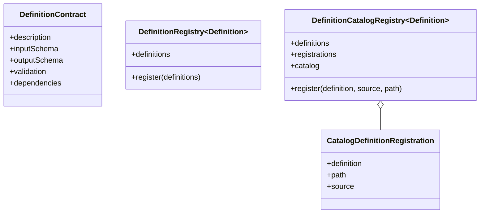
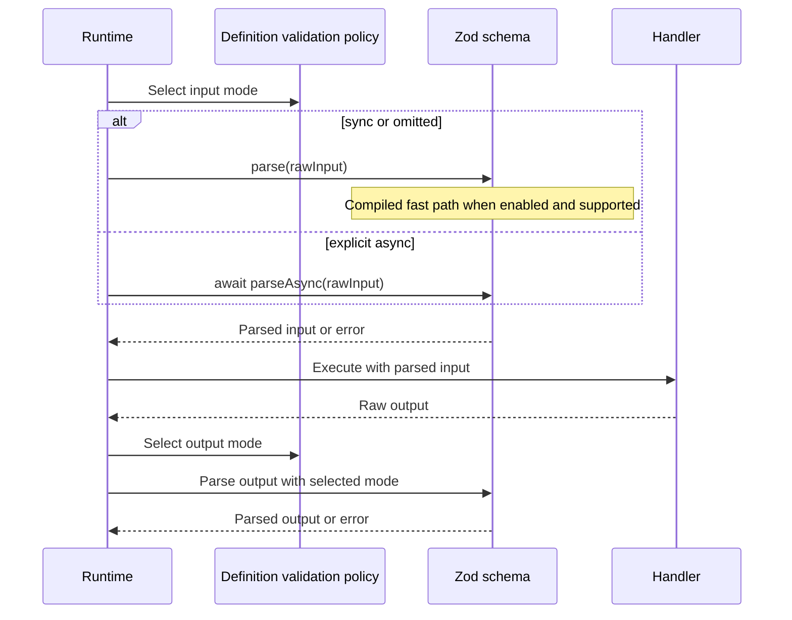
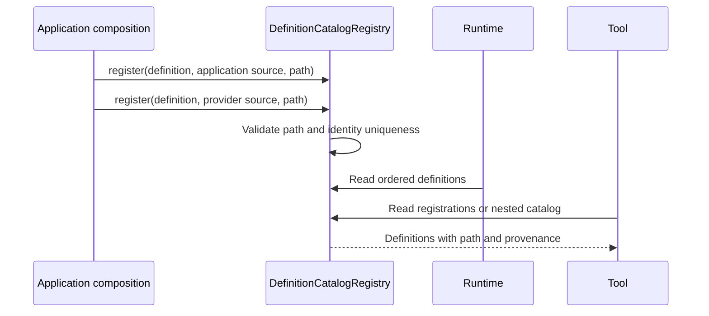

# Definition registries

[Documentation](../README.md) · [Implementation index](./README.md) · [Usage guide](../usage/definitions.md)

The definitions library provides shared metadata and deterministic registries for inspectable Kestrel definitions. It lets runtimes and tools consume application declarations without file discovery or string-based lookup conventions.

## Concepts and model

`DefinitionContract` is the common schema, validation policy, dependency and description shape for executable definitions. `DefinitionRegistry` stores an ordered flat collection. `DefinitionCatalogRegistry` additionally retains each definition's catalog path and application/provider provenance and can reconstruct a homogeneous nested view.

## Usage guide

For application setup and task-oriented examples, see the [Definition registries usage guide](../usage/definitions.md).

## Design and implementation

Registration order is declaration order and is retained in every flat view. Catalog registration copies paths and rejects duplicate paths, branch/leaf path collisions and configured identity collisions immediately. The nested `catalog` getter reconstructs a fresh homogeneous tree, preventing consumers from mutating registry state.

The registry validates structural uniqueness only. Each owning library remains responsible for validating the definition itself and deciding its identity semantics.

## Schema validation policy

Executable definitions accept `validation: { input?: "sync" | "async", output?: "sync" | "async" }`. Omitting `validation`, supplying `{}`, or omitting either boundary selects synchronous parsing for that boundary. Workers and workflow signals accept only `validation.input`, which controls their incoming payload. Factories retain a frozen, normalized policy alongside the original schemas; schemas remain available for introspection and JSON Schema generation.

| Declaration | Input parsing | Output parsing |
| --- | --- | --- |
| No `validation` or `{}` | `parse()` | `parse()` |
| `{ input: "async" }` | `parseAsync()` | `parse()` |
| `{ output: "async" }` | `parse()` | `parseAsync()` |
| `{ input: "async", output: "async" }` | `parseAsync()` | `parseAsync()` |

An asynchronous handler or mapping function does not require asynchronous schema validation. Only asynchronous schema refinements, checks or transforms require the explicit mode. An undeclared asynchronous schema raises a programming error. Kestrel never retries a synchronous parse asynchronously, since that could execute callbacks twice. Invalid values continue to produce Zod issues; `safeParseSchema()` does not hide programming errors as ordinary invalid input.

### Application-controlled compilation

Zod 4.5 can accelerate synchronous parsing. Applications can preload `zod/compile` before loading Kestrel or application schemas, for example `node --import zod/compile app.js`. An equivalent first import works only if earlier modules have not already constructed schemas. Preloading also covers schemas created by a generic CLI before it loads an application module. Kestrel itself does not import `zod/compile` or change Zod's global configuration.

Global compilation is lazy on first parsing. Explicit `z.compile(schema)` is also supported and should be applied to the final schema. Async parsing still uses Zod's standard parser. Unsupported schema features may retain the standard parser in all or part of a schema. Compilation uses `new Function()` at runtime and is subject to the host's code-generation restrictions; it is not build-time code generation. See [Zod compilation](https://zod.dev/compile).

Keep refinements and transforms free of externally visible side effects: compiled validation can invoke them again when invalid input falls back to the standard parser. Durable workflows can also validate contracts repeatedly during replay independently of compilation. Prefer business operations in handlers or durable activities.

## Execution scenario

## Public API

| Export | Purpose |
| --- | --- |
| `DefinitionMetadata` | Shared optional descriptive metadata. |
| `DefinitionContract` | Shared schema and dependency contract for executable definitions. |
| `ValidationMode`, `ValidationOptions`, `InputValidationOptions` | Public parsing policy for both boundaries or an input-only definition. |
| `DefinitionValidation`, `resolveValidation()` | Normalized immutable policy with synchronous defaults. |
| `parseSchema()`, `safeParseSchema()` | Select the declared Zod parser, preserving transformed output and errors without automatic retries. |
| `DefinitionRegistry` | Ordered flat registration. |
| `DefinitionCatalogRegistry` | Ordered catalog registration with hierarchy, provenance and uniqueness checks. |
| `CatalogDefinitionRegistration` | One definition together with copied path and source metadata. |
| `CatalogDefinitionSource` | Distinguishes application declarations from provider contributions. |
| `DefinitionCatalogRegistryOptions` | Configures stable identity extraction and diagnostics. |

The library has no adapter API. Callers supply ordinary definition values and an optional pure identity function.

## Potential evolutions

Explicit sealing, lookup by identity and generated documentation indexes can be added if multiple consumers need them. They should preserve deterministic order and must not introduce runtime module discovery.

Automatic detection of async schemas is deferred until a public Zod API can guarantee it without executing callbacks. Per-contract compilation, startup warming and representative validation benchmarks can be added if application measurements justify them. Current compilation remains an application choice independent of the definition's parsing mode.
