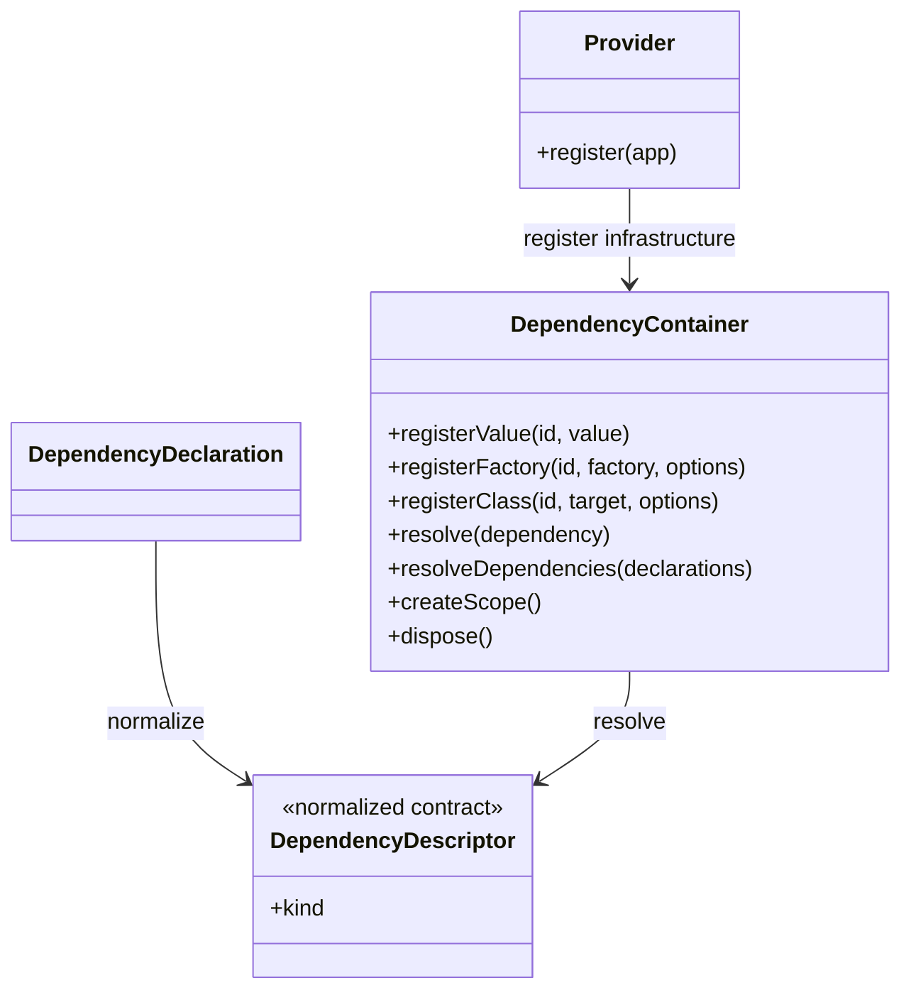
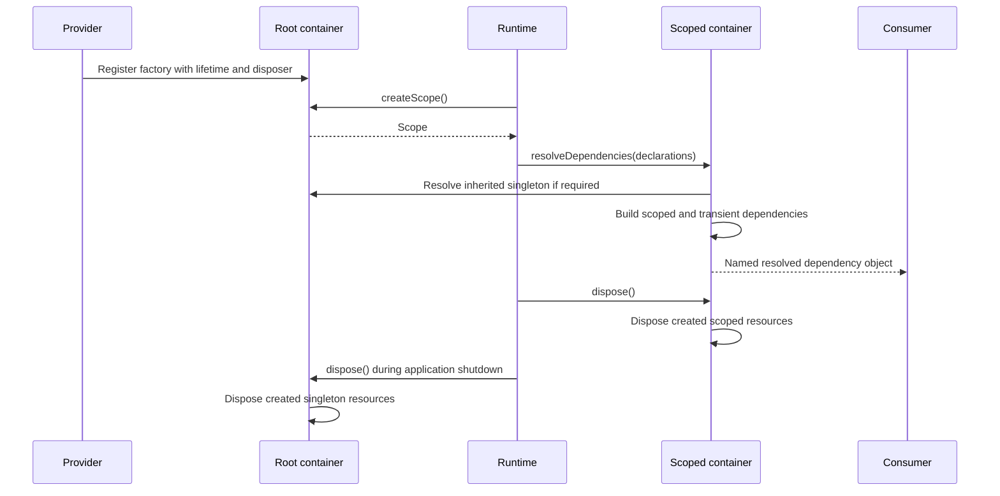

# Dependency Injection

[Documentation](../README.md) · [Implementation index](./README.md) · [Usage guide](../usage/di.md)

Kestrel uses dependency injection to keep actions independent from runtime infrastructure and easy to test.

Dependency injection is handled at the Kestrel level. Application actions, models, repositories and services should not import or access a global container directly. Instead, dependencies are declared explicitly where they are needed, and Kestrel resolves them when the action is executed.

## Concepts and model

A dependency declaration describes what a consumer needs. Normalization converts its ergonomic class, configuration-selector, named-reference or resolvable-definition form into a `DependencyDescriptor`. A `DependencyContainer` owns registrations and resource lifetimes; child containers provide isolated scoped instances while inheriting singleton registrations.



## Usage guide

For application setup and task-oriented examples, see the [Dependency Injection usage guide](../usage/di.md).

## Design and implementation

The Kestrel API isolates consumers from the underlying container implementation. Dependency normalization centralizes declaration semantics, while the container handles registration, constructor injection, child scopes, caching by lifetime and disposal. A resource disposer is attached to its registration so the container that owns the instance also owns cleanup.

Dependency directions remain explicit in source: consumers name their requirements, providers supply implementations, and the application composes the two. The container does not perform module discovery or infer application policy.

## Execution scenarios



## Public API

| Export | Purpose |
| --- | --- |
| `createDependencyContainer()` | Creates a root container from resolved application configuration. |
| `DependencyContainer` | Registration, resolution, scoping and disposal contract used by Kestrel composition. |
| `dep()` | Declares a typed named dependency. |
| `fromConfig()` | Declares a dependency selected from resolved application configuration. |
| `createDependencyApi()` | Specializes declaration helpers for one application configuration type. |
| `normalizeDependency()` | Converts ergonomic declarations to the descriptor contract used by Kestrel runtimes. |
| `resolveDependency`, `ResolvableDependency<Config, Value>` | Symbol protocol for definitions that produce a typed value in the active container. |
| `ResolvableDependencyDescriptor<Config, Value>` | Normalized `resolvable` descriptor retaining the protocol implementation as its target. |
| Dependency declaration, descriptor, resolution and lifetime types | Preserve the relation between declaration maps and the values supplied to consumers. |

The DI library has no adapter API. The `DependencyContainer` is the Kestrel runtime abstraction; applications replace individual registrations and factories rather than implementing a second container adapter.

## Dependency declarations

An action can declare the dependencies required by its handler:

```ts
export const banUserAction = defineAction({
  name: "user.ban",
  input: banUserInputSchema,
  output: banUserOutputSchema,
  dependencies: {
    userRepository: UserRepository,
    featureEnabled: fromConfig(c => c.userFeature.enabled),
    userResolver: dep<EntityResolver<User>>("resolver.user"),
  },
  handler: async (input, deps) => {
    if (!deps.featureEnabled) {
      return;
    }

    const user = await deps.userResolver.get(input);

    await deps.userRepository.update(user, {
      status: "banned",
      reason: input.reason,
      duration: input.duration,
    });
  },
});
```

Dependencies can be declared in several ways:

- A concrete class, for simple dependencies that can be instantiated automatically.
- A configuration selector, for values resolved from the typed application config.
- A named dependency id, for dynamic dependencies, abstractions, external clients, or dependencies requiring a specific runtime registration.
- A resolvable definition, such as an action, that binds its own runtime value to the current container.

## Dependency normalization

The dependency declaration syntax is intentionally ergonomic. It lets action authors declare dependencies using concise values such as concrete classes, configuration selectors, or named dependency references.

Internally, Kestrel normalizes every dependency declaration into an explicit dependency descriptor before resolving it.

For example, this declaration:

```ts
dependencies: {
  userRepository: UserRepository,
  featureEnabled: fromConfig(c => c.userFeature.enabled),
  userResolver: dep<EntityResolver<User>>("resolver.user"),
}
```

is normalized into descriptors similar to:

```ts
type DependencyDescriptor<T> =
  | {
      kind: "class";
      target: Constructor<T>;
    }
  | {
      kind: "config";
      selector: (config: AppConfig) => T;
    }
  | {
      kind: "registered";
      id: string;
    }
  | {
      kind: "resolvable";
      target: ResolvableDependency<AppConfig, T>;
    };
```

The normalized form is the internal contract used by Kestrel. This keeps the public API pleasant to write while giving the runtime a precise and inspectable representation of what must be resolved.

Resolution then follows the descriptor kind:

```ts
if (descriptor.kind === "class") {
  return scope.build(descriptor.target);
}

if (descriptor.kind === "config") {
  return descriptor.selector(resolvedConfig);
}

if (descriptor.kind === "registered") {
  return scope.resolve(descriptor.id);
}

if (descriptor.kind === "resolvable") {
  return descriptor.target[resolveDependency](scope);
}
```

This normalization step also gives Kestrel a single place to handle future features such as dependency lifetimes, diagnostics, dependency graph inspection, test overrides, circular dependency detection, and documentation generation.

Application code should rely on the ergonomic declaration syntax. Kestrel code should operate on normalized dependency descriptors.

## Resolvable definitions

The DI library exports a unique `resolveDependency` symbol and a structural protocol. A library-owned definition implements the method to produce the value consumers should receive:

```ts
import {
  dep,
  resolveDependency,
  type ResolvableDependency,
} from "@kestreljs/framework/di";

// Bind a small facade to a service from the caller's scope.
const clock = {
  [resolveDependency](container) {
    return { now: container.resolve(dep<() => Date>("currentTime")) };
  },
} satisfies ResolvableDependency<never, { now(): Date }>;
```

The contract is `[resolveDependency](container: DependencyContainer<Config>): Value`. `ResolvedDependency` infers the returned `Value`, and `ResolvedDependencies` preserves each declaration's type in the handler dependency map. Use a concrete `Config` when the implementation needs configuration selectors; config-independent definitions such as actions use `never`, like the existing definition declaration contracts.

Normalization checks the symbol before treating functions as constructors and retains the definition in a `resolvable` descriptor. The container invokes the method with its original receiver and the current container, including child-scope registrations. Errors propagate to the caller. The protocol has no asynchronous initialization, implicit awaiting, cache, lifetime registration or automatic disposal of its return value; implementations should bind lightweight facades and resolve owned resources through ordinary registrations. A new action runner is therefore created for each resolution while the services it uses retain their registered lifetimes.

DI does not import action code: the actions library implements this protocol to return a runner. Dependency graph inspection, protocol-specific overrides, cycle detection and additional lifetime controls remain deferred. Protocol authors must avoid resolving themselves recursively and must keep returned scope-bound values within the scope's lifetime.

## Class dependencies

When a dependency is declared as a concrete class, Kestrel may instantiate it automatically without requiring explicit registration in the application container.

This is intended for simple dependencies such as repositories, stateless services, mappers, validators, and small domain helpers.

```ts
dependencies: {
  userRepository: UserRepository,
}
```

Kestrel resolves this as a class dependency and builds it through the dependency container. Constructor dependencies of this class must still be resolvable by the container.

For example:

```ts
export class UserRepository {
  constructor({ db, logger }: { db: DbClient; logger: Logger }) {
    // ...
  }
}
```

In this case, `db` and `logger` are infrastructure dependencies and must be registered in the container during application bootstrap.

## Configuration dependencies

Configuration values can be injected through typed selectors:

```ts
dependencies: {
  featureEnabled: fromConfig(c => c.userFeature.enabled),
}
```

Application modules can create a focused `fromConfig` helper with `createDependencyApi<AppConfig>()` near their dependency declarations. Selectors therefore keep autocompletion and type checking without importing the resolved configuration object or expanding the bootstrap's runtime exports.

This keeps configuration access typed, navigable by the IDE, and independent from string keys. Application code should not read environment variables directly. Configuration is resolved once during bootstrap, then exposed as a typed object.

## Named dependencies

Some dependencies cannot be represented by a concrete class. This includes interface-like dependencies, dynamically selected services, external clients, resolvers, or dependencies that require custom lifecycle management.

These dependencies can be accessed through an explicit id:

```ts
dependencies: {
  userResolver: dep<EntityResolver<User>>("resolver.user"),
}
```

Named dependencies must be registered by a provider at the application composition boundary.

## Providers

Dependency registrations are grouped into provider classes. A transport-independent library provider is generic over the application configuration, receives its own resolved configuration in the constructor and receives the base `App` through its `register` method:

```ts
export class PostgresDrizzleProvider<Config> implements Provider<Config> {
  constructor(protected readonly config: PostgresDrizzleConfig) {}

  register(app: App<Config>): void {
    app.container.registerFactory("databaseClient", () => this.createClient(), {
      lifetime: "singleton",
      dispose: (client) => client.close(),
    });
  }
}
```

Providers are added at the application composition boundary:

```ts
const app = new App(config)
  .register(new PostgresDrizzleProvider(config.database));
```

Library providers expose focused protected construction hooks for complex application adaptations. Application subclasses override those hooks instead of copying the complete registration flow; simple choices remain constructor configuration.

Providers always receive the shared `App`. Transport-specific setup is declared through registries such as `app.httpExtensions` and is consumed only when the corresponding runtime is constructed. This keeps Fastify, scheduler and polling state out of application composition.

This keeps infrastructure construction out of actions, repositories and entrypoints. Providers may register values, factories or classes and select the appropriate lifetime. Resources transferred to the container can declare a disposer, which is called when the application is disposed.

## Container responsibility

The container is a runtime concern. It is responsible for:

- Storing infrastructure dependencies such as config, database clients, loggers and external clients.
- Creating scopes owned by transport executions such as HTTP requests and CLI commands.
- Resolving named dependencies.
- Building simple class dependencies.
- Managing dependency lifetimes when needed.
- Normalizing action dependency declarations into explicit dependency descriptors before resolution.

Kestrel may use Awilix as the underlying dependency injection engine, but application code should depend on the Kestrel dependency declarations rather than Awilix directly.

## Lifetimes

Simple class dependencies may be built automatically with a default lifetime. The default should be conservative, usually transient or request-scoped.

Dependencies requiring a specific lifetime must be declared explicitly.

Examples:

- Database client: singleton
- Database manager: scoped
- Logger factory: singleton or scoped
- Request logger: scoped
- Repository: scoped or transient
- External API client: singleton or scoped
- Domain service without state: transient

## Rule

Business code must declare what it needs, not how to build it.

Providers define infrastructure, the application gathers providers and Kestrel resolves dependencies. Actions receive already-resolved dependencies.
