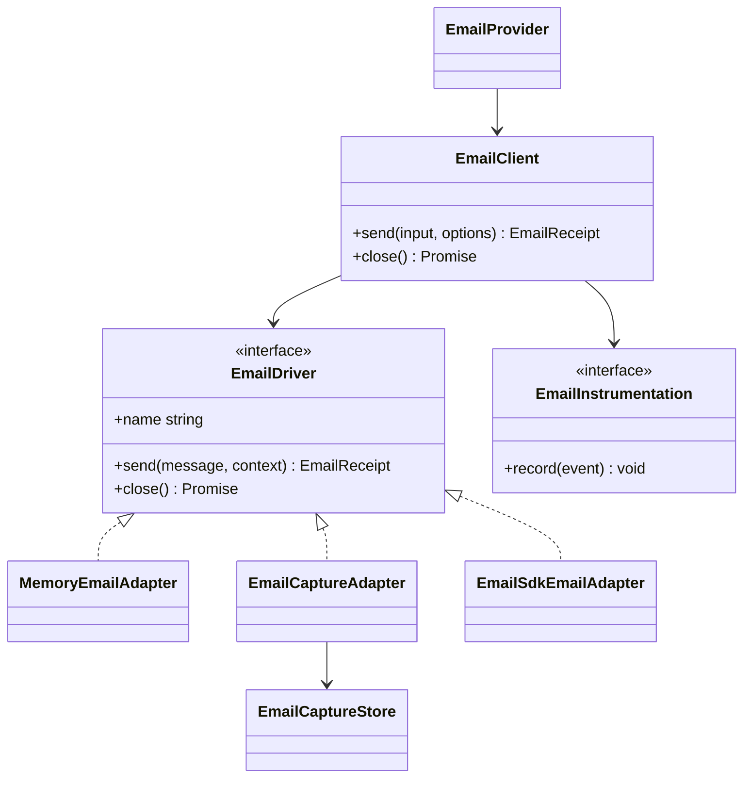
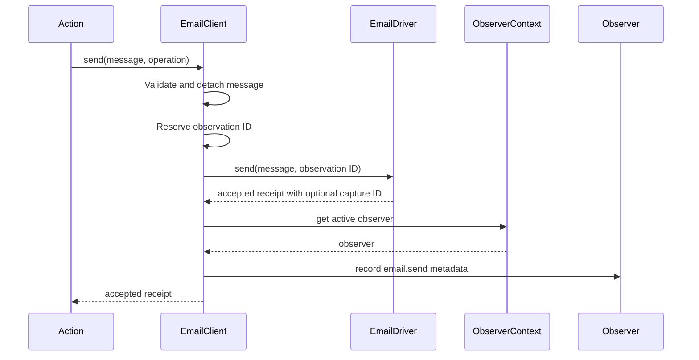
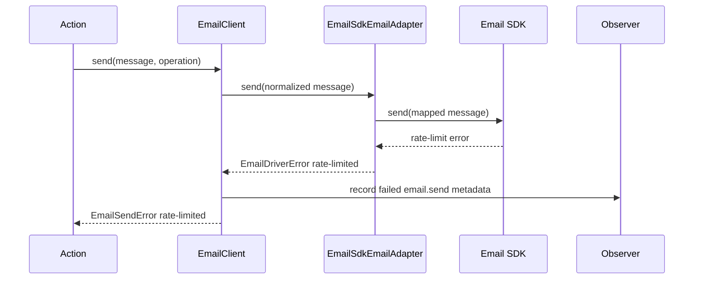
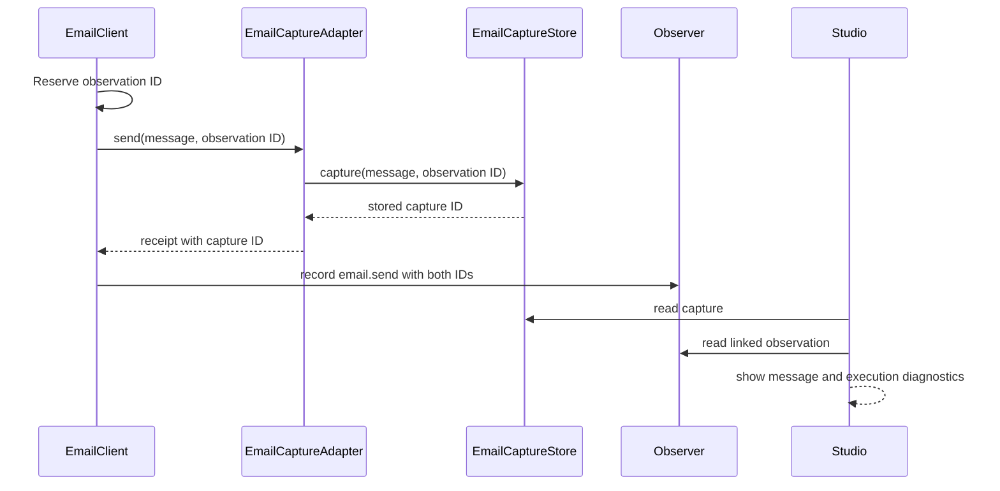

# Email

[Documentation](../README.md) · [Implementation index](./README.md) · [Usage guide](../usage/email.md)

The email library provides one provider-neutral API for transactional outbound messages. Applications describe a message once and select a transport adapter such as Email SDK, while Kestrel adds consistent validation, failures, lifecycle ownership and observations.

An accepted send means that the configured transport accepted the message for further processing. It does not prove delivery to a recipient mailbox. Delivery, bounce, complaint and engagement events require a later inbound webhook model.

## Solution concepts and model

`EmailClient` is the application-facing facade. It validates caller input, reserves the observation identity and creates a detached `EmailMessage` snapshot before crossing the `EmailDriver` boundary. A driver translates that stable message into a transport-specific request and returns an `EmailReceipt`. The first adapters are an in-memory testing transport, a development capture transport and a bridge to Email SDK.



The normalized model deliberately contains only capabilities shared by the first transport set:

- one sender and one or more primary recipients;
- optional carbon-copy, blind-carbon-copy and reply-to recipients;
- a subject and at least one text or HTML body;
- optional custom headers;
- optional text or binary attachments, including inline content identifiers.

Rendering, provider-side templates, scheduled delivery, bulk personalization and inbound messages are not part of this initial contract. Those features need their own portable semantics rather than leaking one provider's behavior into the core model.

## Client and provider composition reference

### Standalone library

Construct an `EmailClient` directly when dependency injection and ambient observations are not required:

```ts
import {
  EmailClient,
  MemoryEmailAdapter,
} from "@kestrel/framework/email";

const adapter = new MemoryEmailAdapter();
const email = new EmailClient({
  name: "transactional",
  driver: adapter,
});

const receipt = await email.send({
  from: { address: "hello@example.com", name: "Example" },
  to: "member@example.com",
  subject: "Welcome",
  text: "Welcome to the application.",
}, {
  operation: "member.welcome",
});

await email.close();
```

Address fields accept either a plain mailbox string or `{ address, name }`. Recipient fields accept one address or an array. Drivers always receive arrays of validated address objects.

### Email SDK adapter

The Email SDK adapter accepts any Email SDK transport adapter and keeps its types behind the adapter-specific boundary. External SDK telemetry is always disabled by this bridge so Kestrel remains the only automatic diagnostic owner. For example, SMTP composition is:

```ts
import {
  EmailClient,
  EmailSdkEmailAdapter,
} from "@kestrel/framework/email";
import { smtp } from "@opencoredev/email-sdk/smtp";

const driver = new EmailSdkEmailAdapter({
  adapter: smtp({
    host: "smtp.example.com",
    port: 587,
    auth: {
      user: "smtp-user",
      pass: "smtp-password",
    },
    requireTLS: true,
  }),
});

const email = new EmailClient({
  name: "transactional",
  driver,
});
```

SES, Resend, Postmark, SendGrid and other Email SDK transports use the same bridge with another `@opencoredev/email-sdk/*` factory. Mailjet can use its SMTP relay until a dedicated Email SDK or Kestrel adapter is justified. Each SDK adapter advertises its own capabilities and can reject fields that its transport does not implement.

Kestrel owns only the stable `EmailDriver` contract. Email SDK remains an implementation detail, so a future SDK breaking change is isolated to `EmailSdkEmailAdapter`.

### Kestrel-integrated usage

`EmailProvider` is the recommended application composition path. It receives the resolved general `EmailConfig`, creates the driver selected by `driver.type`, registers the singleton `emailClientDependency`, owns its disposal and combines explicitly configured instrumentation with observations from the active execution scope. The built-in configured driver types are `capture`, `memory`, `smtp` and `ses`:

```ts
import { EmailProvider } from "@kestrel/framework/email";

app.register(new EmailProvider({
  enabled: true,
  name: "transactional",
  driver: {
    type: "smtp",
    host: "smtp.example.com",
    port: 587,
    auth: {
      user: "smtp-user",
      pass: "smtp-password",
    },
    requireTLS: true,
    secure: false,
    allowInsecureAuth: false,
    timeoutMs: 15_000,
  },
  capture: {
    storage: "postgres",
    retentionDays: 7,
    maxMessageBytes: 10 * 1024 * 1024,
  },
}));
```

Applications normally produce that value through `configure(emailConfigBase, applicationValues)`, so environment selection and secrets remain application concerns. `enabled`, `name` and `driver` describe email as a whole. The `capture` object contains only capture storage, retention and size policy and is used when `driver.type` is `capture`.

The default provider maps SMTP and SES configurations to `EmailSdkEmailAdapter`, while callers continue to depend only on `EmailClient`. `{ type: "custom", name: "mailjet" }` reserves extension dispatch for an application subclass. Such a subclass overrides `createCustomDriver()` and may also override `createDriver()`, `createSmtpDriver()`, `createSesDriver()` or `createCaptureStore()` when it needs different composition without changing the email core.

```ts
class ApplicationEmailProvider extends EmailProvider<AppConfig> {
  protected override createCustomDriver(app, name) {
    if (name === "mailjet") return new MailjetEmailAdapter(app.config.email.mailjet);
    return super.createCustomDriver(app, name);
  }
}
```

Services and Actions can declare the registered dependency without importing a concrete adapter:

```ts
import { emailClientDependency } from "@kestrel/framework/email";

const dependencies = {
  email: emailClientDependency,
};
```

The email library validates resolved configuration but does not read environment variables or interpret application environment names.

### Local capture inbox

`EmailCaptureAdapter` is a development transport that persists the normalized message instead of contacting recipients. It accepts any `EmailCaptureStore`; `MemoryEmailCaptureStore` is useful in standalone tests and `PostgresEmailCaptureStore` provides a process-independent local inbox. `emailConfigBase` validates its nested capture storage, retention and maximum-message-size settings.

The application currently selects `{ driver: { type: "capture" }, capture: { storage: "postgres" } }` and enables email only in its local configuration. The Kestrel provider then registers `emailCaptureStoreDependency`, `emailCaptureInboxDependency` and the ordinary `emailClientDependency`. On boot, persistent stores can prepare themselves and remove expired captures using the configured retention window. The `dev.email_capture` and `dev.email_capture_attachment` tables are disposable development push-schema objects and are not part of deployable migrations.

```ts
const store = new MemoryEmailCaptureStore();
const email = new EmailClient({
  name: "development",
  driver: new EmailCaptureAdapter({
    store,
    maxMessageBytes: 10 * 1024 * 1024,
  }),
});
```

`EmailCaptureInbox` adds explicit replay behavior around a store without coupling storage to an email client. Replaying uses the original normalized sender, recipients and content, runs through the currently configured client and creates a new capture when the local capture transport remains active.

## Design and implementation

The dependency direction is intentionally one way:

```text
application configuration -> email provider -> selected email adapter -> email core
email provider -> Email SDK adapter -> Email SDK transport
email provider -> capture adapter -> capture store
Studio email extension -> email capture and observation source contracts
```

The email core never imports Studio, application code or application configuration. The higher-level Kestrel email provider imports its own adapters and maps resolved configuration to them. The Studio email extension lives below `src/packages/kestrel/src/studio/extensions/email` and depends on injected email and observation source contracts. PostgreSQL storage remains an adapter below the email library, and the Kestrel provider exposes it to Studio through DI while the application selects it by configuration.

Drizzle schema entrypoints import `kestrel/email/postgres_schema` instead of the general email barrel. This schema-only facade deliberately avoids provider and transport evaluation because Drizzle Kit loads TypeScript schemas through a CommonJS compatibility path, while Email SDK exposes ESM modules. The disposable attachment table intentionally has no database foreign key: Drizzle Push can otherwise emit that reference before the capture UUID uniqueness constraint on both fresh and partially created local schemas. `PostgresEmailCaptureStore` preserves the same invariant by inserting atomically and deleting attachments before captures during clearing and retention pruning.

Captures and observations are separate records with a bidirectional logical correlation. `EmailClient` reserves the observation UUID before calling the driver. The capture stores that UUID immediately, while the successful observation stores the returned `captureId`. There is intentionally no database foreign key from capture to observation because observation writes are buffered and may complete later, be disabled or expire under a different retention policy. Studio therefore treats a missing linked observation as a valid pending or expired state.

### Validation and snapshots

`EmailClient.send()` validates stable operation identifiers, addresses, headers, attachment metadata and the required message content synchronously before the driver runs. It rejects control characters in address and header fields but leaves complete RFC mailbox validation to the selected transport.

The normalized message is detached from caller-owned arrays, records and binary attachments. This prevents mutations made after `send()` from changing an in-flight request. Drivers receive a read-only TypeScript contract and must treat it as immutable.

### Failure semantics

Every application-facing failure is an `EmailSendError` with:

- the stable logical `operation`;
- a provider-neutral `code`;
- a `retryable` hint supplied by the adapter;
- an optional transport status code;
- the original error retained as `cause` for controlled diagnostics.

The current failure codes are `authentication`, `cancelled`, `invalid-message`, `provider`, `rate-limited`, `timeout`, `transport`, `unavailable` and `unsupported`. Adapters should throw `EmailDriverError` when they can classify a failure. Unknown driver exceptions become non-retryable `transport` failures so implementation-specific exception classes do not escape the facade.

The retryable flag is descriptive rather than an automatic retry policy. Callers must not blindly retry sends because a transport failure can occur after a provider accepted a message. Reliable retries require an idempotency contract and are deferred.

### Lifecycle

`EmailClient.close()` is idempotent and releases driver resources such as SMTP connection pools. A closed client rejects new sends with `unavailable`. `EmailProvider` transfers lifecycle ownership to the application container and closes the singleton during application disposal.

## Execution scenarios

### Successful Kestrel send



### Rejected transport send



Instrumentation errors are isolated from both paths. An observation sink cannot turn an accepted email into an application failure or suppress the original transport failure.

### Local capture and Studio correlation



## Observability

Each logical send produces one `email.send` observation when an observer is active. Its data contains only:

| Field | Meaning |
| --- | --- |
| `client` | Stable configured client name |
| `operation` | Stable caller-supplied use-case identity |
| `transport` | Driver name such as `smtp` or `ses` |
| `result` | `accepted` or a normalized failure code |
| `recipientCount` | Combined `to`, `cc` and `bcc` count |
| `attachmentCount` | Number of attachments |
| `captureId` | Development capture identity when the selected driver created one |

Duration and success or failure outcome use the common observation envelope. Sender and recipient addresses, display names, subject, bodies, headers, attachment names, attachment contents, provider payloads and message identifiers are never recorded automatically.

The Studio Email history is built entirely from these observations, so it also includes failed sends that never produced a capture. The capture inbox stores email content separately and links back to the observation for timing and execution diagnostics. Its list contract omits bodies, headers and attachment contents. Detail responses expose HTML and text bodies for local preview, redact credential-like header values and return attachment metadata only. HTML is rendered in a sandboxed iframe with a restrictive content security policy that blocks scripts and remote resources.

Standalone users can supply `EmailInstrumentation` for metrics or diagnostics. `EmailProvider` combines that sink with ambient Kestrel observations and isolates failures between them.

## Public API

| Export | Intent |
| --- | --- |
| `EmailClient` | Validate messages, execute logical sends, normalize failures and emit instrumentation |
| `EmailProvider`, `EmailProviderOptions` | Select a configured driver, register and own one Kestrel-integrated client with ambient observations |
| `emailClientDependency` | Declare the application-owned email client as a dependency |
| `emailConfigBase`, `EmailConfig` | Validate general email, driver and nested capture configuration |
| `EmailDriverConfig` | Discriminated configuration for capture, memory, SMTP, SES or subclass dispatch |
| `EmailCaptureAdapter` | Capture a send locally without contacting recipients |
| `EmailCaptureStore` | Storage-neutral contract for local captures |
| `MemoryEmailCaptureStore`, `PostgresEmailCaptureStore` | Process-local and PostgreSQL capture stores |
| `EmailCaptureInbox`, `emailCaptureInboxDependency` | Read, clear and explicitly replay local captures |
| `EmailMessageInput` | Flexible caller-facing message contract |
| `EmailMessage` | Validated and detached driver-facing message contract |
| `EmailAddress`, `EmailAttachment` | Provider-neutral message value objects |
| `EmailReceipt` | Confirmation that a transport accepted a message |
| `EmailDriver` | Contract implemented by transport adapters |
| `EmailDriverError`, `EmailSendError` | Adapter-facing and application-facing normalized errors |
| `EmailInstrumentation` | Optional synchronous diagnostic sink |
| `emailSendObservation` | Stable Kestrel observation definition |
| `MemoryEmailAdapter` | Capturing transport for tests and local development |
| `EmailSdkEmailAdapter` | Bridge from any Email SDK adapter to the stable Kestrel contract |

`normalizeEmailMessage()` and `normalizeEmailSendError()` are also public for adapter authors and lower-level integrations that need exactly the same boundary behavior.

## Adapter contract

An adapter implements `EmailDriver`:

```ts
interface EmailDriver {
  readonly name: string;
  send(message: EmailMessage, context: EmailDriverContext): Promise<EmailReceipt>;
  close?(): Promise<void>;
}
```

The following guarantees apply:

- `name` is a stable, non-sensitive identifier suitable for observations;
- `send()` receives a validated snapshot and must not mutate it;
- `context.observationId` is reserved before delivery and may be retained by a diagnostic adapter for correlation;
- successful completion means transport acceptance and returns `status: "accepted"`;
- a provider message identifier and acceptance time are optional because not every transport exposes them consistently;
- classified failures use `EmailDriverError` and must not place secrets or message content in their public message;
- `retryable` indicates provider guidance, not proof that retrying is duplicate-safe;
- unknown internal failures may be thrown and will be normalized by `EmailClient`;
- `close()` releases owned resources, supports application shutdown and should tolerate being called once by the client lifecycle.

Adapter-specific implementation, tests, public exports and support files live together below `src/packages/kestrel/src/email/adapters/<adapter>`.

Capture stores implement `EmailCaptureStore`. `capture()`, `get()`, `list()` and `clear()` have the same semantics for every storage backend. The optional `prepare(retentionDays)` lifecycle hook verifies persistent storage and applies its bounded retention policy when the provider boots. Store list results must omit bodies, headers and attachment contents, while `get()` returns a detached complete message for preview and explicit replay.

## Potential evolutions

The current boundary leaves the following work explicit for later phases:
- portable template and rendering contracts, potentially backed by a dedicated rendering adapter;
- idempotency keys and documented retry semantics before adding automatic retry middleware;
- durable queues and scheduled sends as separate orchestration concerns;
- delivery, bounce, complaint, unsubscribe and engagement events through verified webhooks;
- suppression lists and recipient preferences with explicit data-governance rules;
- several named email clients or routing policies when one application needs distinct transactional and marketing transports;
- bounded message and attachment sizes enforced before the transport boundary;
- adapter conformance helpers shared by all future transport implementations.

Studio must consume redacted observation or capture contracts rather than raw provider responses. Production administration would additionally require explicit authorization, retention and sensitive-data policy.
