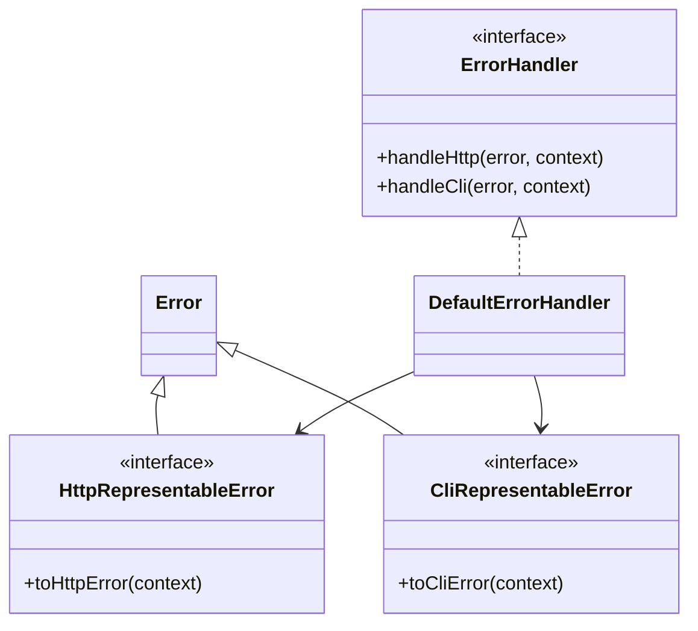
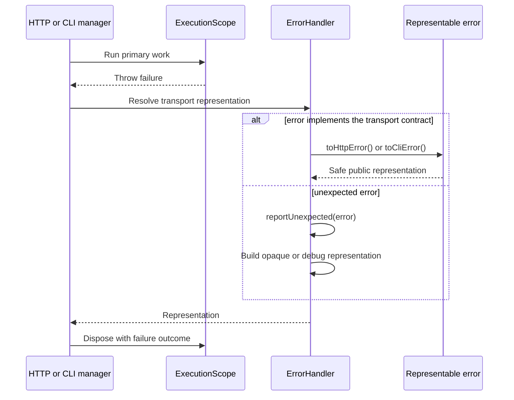

# Errors

[Documentation](../README.md) · [Implementation index](./README.md) · [Usage guide](../usage/errors.md)

The error library separates application failures from their transport representation. It lives in `src/packages/kestrel/src/errors` and does not depend on Fastify, Commander or application configuration.

## Concepts and model

The original thrown value is an internal failure. A transport representation is a deliberately public projection of that failure. `ErrorHandler` applies application policy and selects the projection for the active transport; representable errors can provide a safe default directly.



## Usage guide

For application setup and task-oriented examples, see the [Errors usage guide](../usage/errors.md).

## Design and implementation

Representation detection is structural and transport-neutral. The default handler prefers an explicit representation, otherwise reports the unexpected failure and creates an opaque response correlated with the current execution. Debug mode enriches unexpected responses but does not alter explicitly representable errors. The handler executes before scope disposal, so custom reporting can still resolve scoped diagnostics and services.

## Execution scenarios



## Public API

| Export | Purpose |
| --- | --- |
| `ErrorHandler` | Contract used by transports to resolve HTTP and CLI failures. |
| `DefaultErrorHandler` | Safe default policy and subclassing surface for application mappings and reporting. |
| `errorHandlerDependency` | Scoped DI declaration resolved by execution managers. |
| `HttpRepresentableError` and `CliRepresentableError` | Opt-in contracts implemented by errors with intrinsically safe public forms. |
| `HttpErrorRepresentation` and `CliErrorRepresentation` | Serializable transport results returned by handlers and representable errors. |
| `isHttpRepresentableError()` and `isCliRepresentableError()` | Runtime guards for the opt-in contracts. |
| `getHttpErrorName()` | Resolves the public HTTP error name used by the default representation policy. |

The library has no adapter API. Application-specific error policy is expressed through `ErrorHandler`, which is a scoped service contract rather than a persistence or transport adapter.

## Transport representations

Errors expose public transport information only by opting into a representation contract:

```ts
class ResourceConflictError extends Error implements HttpRepresentableError, CliRepresentableError {
  toHttpError() {
    return {
      statusCode: 409,
      message: "The resource already exists.",
      extensions: { code: "resource_exists" },
    };
  }

  toCliError() {
    return {
      exitCode: 3,
      message: "The resource already exists.",
    };
  }
}
```

An error may implement either interface, both or neither. Domain errors that do not know about a transport remain plain `Error` subclasses and can be mapped by an application handler instead.

`HttpErrorRepresentation` contains a status code and public message, with optional error name, headers and response extensions. `CliErrorRepresentation` contains an exit code and public message. Implementing a representation is an explicit declaration that its content is safe to expose in every environment.

## Execution handler

Every `ExecutionScope` resolves an `ErrorHandler`. HTTP and CLI managers catch execution failures and invoke this handler before disposing scoped dependencies. The handler can therefore use execution-scoped loggers and other services safely.

`DefaultErrorHandler` first uses an error's transport contract. Errors without a representation are unexpected. Its safe default returns an opaque message and execution identifier, while debug mode also exposes the error name, message, stack and complete cause chain.

Applications can subclass the default handler and override `resolveHttp()` or `resolveCli()` for application-specific mappings before delegating to `super`. They can override `reportUnexpected()` to send complete unexpected errors to their logging or reporting infrastructure.

## Application policy

The current application handler lives in `src/server/core/errors`. `ErrorProvider` lives with the other application providers in `src/server/core/providers` and replaces the Kestrel fallback with a scoped `AppErrorHandler`, which reads `config.core.debug` and reports unexpected errors through the execution logger.

Debug output is enabled in `local` and `test`, and disabled in `stage` and `prod`. Unexpected errors are fully logged in every environment. Expected representable errors retain their declared public response independently from debug mode.
