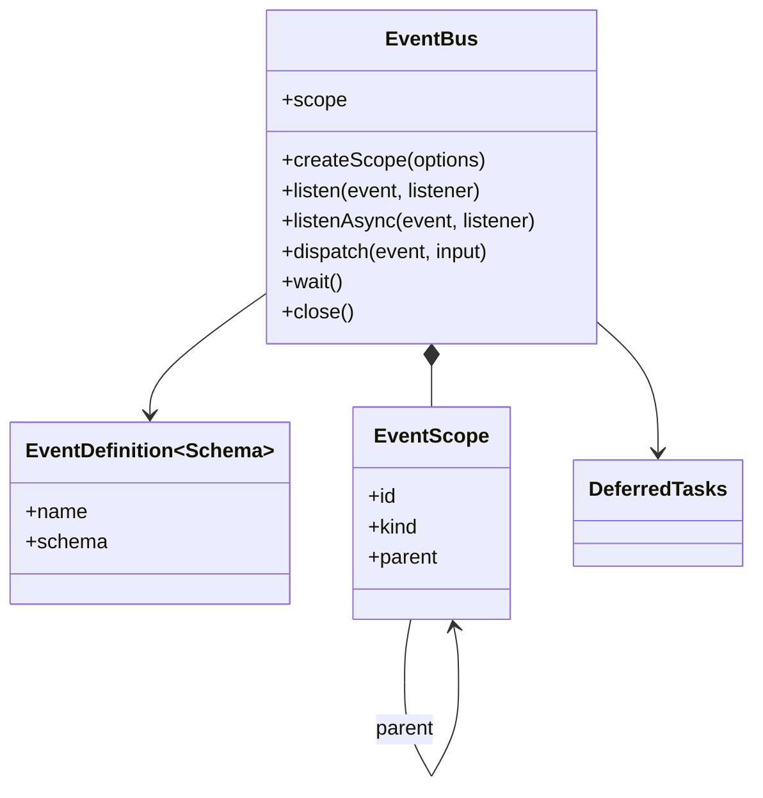
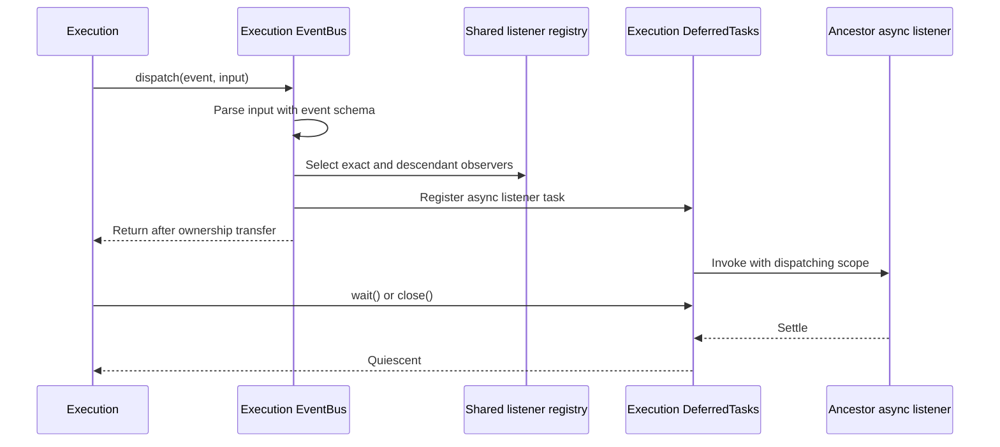

# Events

[Documentation](../README.md) · [Implementation index](./README.md) · [Usage guide](../usage/events.md)

Kestrel provides a typed in-memory event bus in `src/packages/kestrel/src/events`. It lets application code, Kestrel modules and extensions react to process-local events without coupling dispatchers to listeners.

This bus is not a persistent message broker. Events are not stored, delivered across processes or replayed to listeners registered after dispatch.

## Concepts and model

An `EventDefinition` binds a stable name to a Zod payload schema. An `EventBus` is a scope-bound facade over a shared listener registry. Child buses share that registry while retaining their own identity and deferred-task owner, which makes listener visibility and asynchronous resource lifetime explicit.



## Usage guide

For application setup and task-oriented examples, see the [Events usage guide](../usage/events.md).

## Design and implementation

Dispatch parses input once, takes a listener snapshot and invokes matching synchronous listeners in registration order. Asynchronous listeners are registered in the dispatching bus's `DeferredTasks` group before `dispatch()` returns. Child buses share an internal engine containing the registry and closed-scope set; each facade separately owns the listeners registered through it.

Scope selection is explicit. The default `exact` selection observes only the registration scope. `descendants` lets an ancestor observe its subtree without implicit bubbling. Closing a scope removes listeners owned by that scope and its descendants while leaving ancestor and sibling registrations intact.

## Execution scenarios

### Scoped asynchronous dispatch



## Public API

| Export | Purpose |
| --- | --- |
| `defineEvent()` | Creates a typed event definition from a stable name and Zod schema. |
| `EventBus` | Registers listeners, dispatches validated events and creates hierarchical scopes. |
| `eventBusDependency` | Resolves the bus bound to the active Kestrel scope. |
| `eventListenerFailed` | Technical event emitted when a listener fails, with recursion protection. |
| `isEventDefinition()` | Identifies event definitions when flattening mixed catalogs. |
| Event input, payload, listener, scope and option types | Preserve schema transformations and describe listener and scope contracts. |

The event library has no persistent broker adapter. Cross-process delivery, replay and durable subscriptions require a separate integration with different guarantees rather than an implementation of `EventBus`.

## Event definitions

Every event connects a stable name to a Zod payload schema:

```ts
import { z } from "zod";

import { defineEvent } from "@kestrel/framework/events";

export const userCreated = defineEvent({
  name: "user.created",
  schema: z.object({
    userId: z.string().uuid(),
  }),
});
```

The definition is a regular exported TypeScript value and does not depend on the dependency container. Its schema validates every dispatched payload. Zod input and output types are preserved separately, so schemas may coerce or transform input before a listener receives it.

Names are used for configuration, diagnostics and exported catalogs. Listener registration uses the event definition itself, retaining IDE navigation and the static connection between an event and its payload.

Nested event exports can be flattened for registration or Studio metadata with the shared catalog utility:

```ts
const eventCatalog = {
  user: { userCreated },
  billing: { invoicePaid },
} as const;

const events = flattenCatalog(eventCatalog, isEventDefinition);
```

## Synchronous listeners and dispatch

`listen()` registers work that must complete synchronously. `dispatch()` parses the payload and invokes matching listeners immediately in registration order:

```ts
const stopListening = eventBus.listen(userCreated, (event) => {
  metrics.increment("users.created", { userId: event.userId });
});

eventBus.dispatch(userCreated, { userId });
stopListening();
```

The dispatch returns only after every synchronous listener has run and every asynchronous listener has transferred its work to deferred task ownership. A synchronous failure stops later listener invocation, emits the technical `events.listenerFailed` event and is rethrown directly from `dispatch()`.

TypeScript allows an `async` function where a `void` callback is expected. The bus therefore also checks the result at runtime and throws an explanatory error if a listener registered through `listen()` returns a promise. Use `listenAsync()` for all promise-returning listeners.

`listenOnce()` removes its listener before invocation, ensuring overlapping or nested dispatches cannot invoke it twice. `waitFor()` is a promise-based convenience that resolves with the next parsed payload. Neither API observes an event that has already been dispatched.

## Asynchronous listeners

`listenAsync()` makes asynchronous ownership explicit without repeating direct `DeferredTasks` access:

```ts
eventBus.listenAsync(bootstrapStartedEvent, async () => {
  await database.connect();
  await logCollector.start();
});

eventBus.dispatch(bootstrapStartedEvent, {});
await eventBus.wait();
```

The bus registers each asynchronous listener as a deferred task before `dispatch()` returns. Listeners are scheduled in registration order and then execute concurrently. `wait()` waits for quiescence in the bus's bound deferred task group. One failure is propagated directly; multiple failures produce the deferred task group's `AggregateError` after every listener settles.

`listenOnceAsync()` provides the same ownership for a one-time asynchronous listener. Both asynchronous methods return the same idempotent removal function as their synchronous counterparts.

Lifecycle owners decide where to wait. Application bootstrap waits after each bootstrap event; execution disposal closes its task group after `execution.completed`; application shutdown closes the root group after `shutdown.completed`. Ordinary domain dispatch can remain fire-and-forget because the owning scope still drains its registered tasks before releasing resources.

## Event scopes

The application owns one root event bus. Every execution receives a child bus that shares the listener registry while binding dispatch to its execution scope and task lifetime. Optional nested scopes inherit their parent's deferred tasks by default:

```ts
const transactionEvents = executionEventBus.createScope({
  id: transactionId,
  kind: "transaction",
});
```

A listener observes its exact bound scope by default. An ancestor can explicitly observe its complete descendant tree:

```ts
app.eventBus.listenAsync(userCreated, async (event, context) => {
  await auditLog.write({
    userId: event.userId,
    sourceScope: context.scope.id,
  });
}, { scope: "descendants" });
```

The dispatching scope, rather than the listener's registration scope, owns asynchronous work. In this example an event dispatched by an execution registers the audit task in that execution's deferred tasks. Its scoped resources therefore remain available until the ancestor listener settles.

An execution listener does not receive events from another execution, and an application listener does not receive execution events unless it opts into descendants. Events do not bubble implicitly.

Closing a bound bus removes listeners registered in its complete scope subtree and prevents later use of that scope. This cleanup avoids retaining execution listeners after their dependency container has been released.

## Dependency injection

The event bus is an application primitive, created directly with the configuration and dependency container rather than contributed by a provider. This lets `App` dispatch lifecycle events itself:

```ts
const app = new App(config);
```

The root container exposes the application bus. Each execution container overrides the same dependency with its bound child bus, so consumers use one declaration regardless of scope:

```ts
const eventBus = app.container.resolve(eventBusDependency);
```

## Lifecycle events

Application lifecycle definitions live in `src/packages/kestrel/src/app/events.ts` because their meaning belongs to `App`, not to the generic event library:

```text
bootstrap.started   -> bootstrap async work may begin
bootstrap.completed -> bootstrap-start work has settled
runtime.started     -> executions may be admitted
runtime.stopping    -> execution admission is closed
execution.started   -> the scoped container is initialized
execution.completed -> primary work produced its outcome
shutdown.started    -> executions drained; application cleanup begins
shutdown.completed  -> final observable boundary before disposal
```

All these transitions use synchronous dispatch followed by the appropriate deferred task boundary. `execution.completed` carries `executionId` and `outcome`. Completion listeners retain access to scoped dependencies; the execution closes its tasks, event bus and dependency container only after they settle.

Conceptual phases without events, state transitions and transport ownership are documented in [Application](./app.md).
