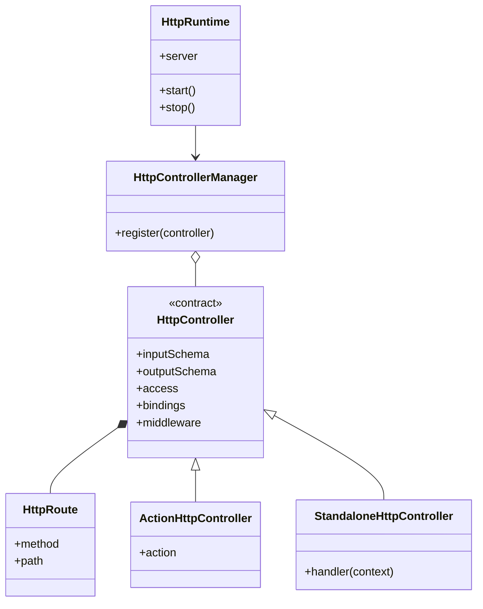
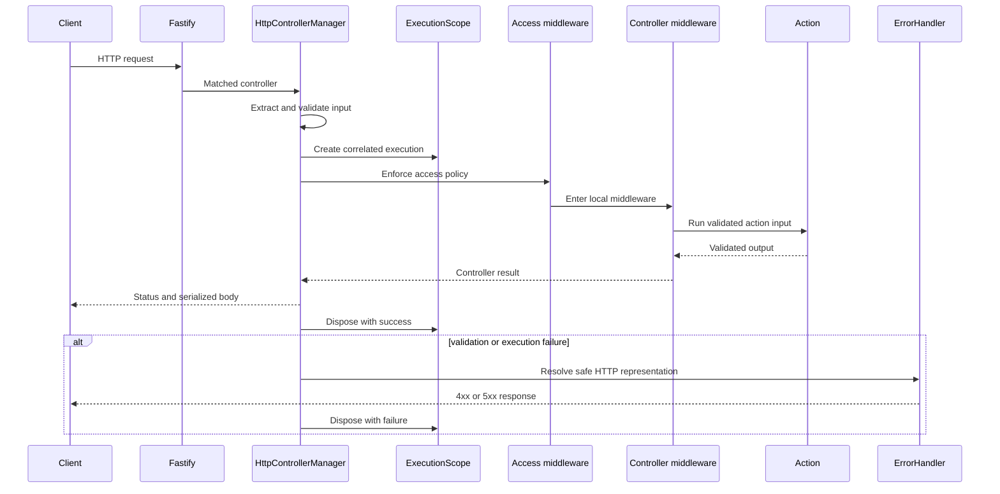
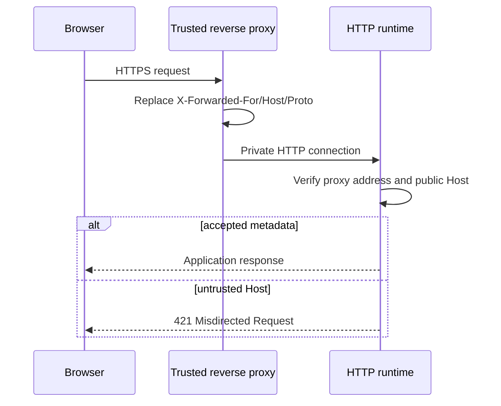

# HTTP

[Documentation](../README.md) · [Implementation index](./README.md) · [Usage guide](../usage/http.md)

The HTTP Kestrel exposes standalone transport handlers and application actions as Fastify routes while keeping request mapping, validation and response behavior outside business logic.

## Concepts and model

An `HttpRoute` describes method and path. An `HttpController` combines that route with input bindings, schemas, access policy, middleware and either a standalone handler or an action reference. `HttpControllerManager` registers these contracts on Fastify and owns one execution scope per request. `HttpRuntime` owns the Fastify lifecycle; HTTP extensions mount additional encapsulated surfaces without changing the controller catalog.



## Validation modes

Standalone controllers default both boundaries to synchronous parsing. Set `validation.input` or `validation.output` to `"async"` for asynchronous schema logic. This is independent of an asynchronous HTTP handler. Action-backed controllers inherit a boundary's mode with its action schema when no controller `validation` is specified; a replaced schema defaults to sync. An explicit `validation` object replaces the inherited policy, with omitted fields defaulting to sync. Input data failures still produce HTTP 400, while using an async schema in sync mode is a programming error. See [Definition validation](./definitions.md#schema-validation-policy).


## Usage guide

For application setup and task-oriented examples, see the [HTTP usage guide](../usage/http.md).

## Design and implementation

Declaration is independent from Fastify registration. During runtime construction, the manager converts each controller contract to a route, validates explicit bindings and installs one handler. Per request, input extraction and Zod parsing precede access and local middleware. The pipeline resolves controller dependencies, optionally delegates to an execution-bound action runner, validates the effective output and maps it to the reply. Error representation and execution disposal remain outside middleware.

Fastify is intentionally retained at the outer transport boundary: standalone handlers and middleware may use `request` and `reply`, while actions remain transport-independent. Providers defer server and extension construction until the selected process actually starts the HTTP workload.

## Execution scenarios

### Managed action request



## Public API

| API group | Main exports |
| --- | --- |
| Routes and bindings | `get()`, `post()`, `patch()`, `del()`, `path()`, `query()`, `body()` and route/binding types |
| Controller declarations | `defineHttpController()`, `defineActionHttpController()`, `defineModelListActionHttpController()` and controller option, context and example types |
| Access and middleware | `defineHttpAccessPolicy()`, `defineHttpMiddleware()` and their policy, context and target types |
| Execution and runtime | `executeHttpController()`, `HttpControllerManager`, `HttpRuntime`, `HttpRuntimeProvider`, `httpRuntimeDependency`, `HttpExtension` |
| Configuration and hardening | `httpConfigBase`, `createHttpHardeningProfile()`, `httpHardeningConfigBase` and resolved configuration/profile types |
| Client runtime | `createHttpClientTransport()`, `HttpClientError` and operation, input-binding, output and transport types |
| Audience and generation | audience definition, catalog filtering and validation helpers, `generateHttpClientSource()`, `writeHttpClient()`, `HttpClientGenerationProvider` and generation configuration types |

## Extension API

The HTTP library has no replaceable request-storage adapter. Its integration contracts are:

- `HttpExtension.mount(context)` installs an encapsulated HTTP surface when `HttpRuntime` is constructed. It must register all routes and hooks before Fastify readiness and let that Fastify scope own cleanup.
- `HttpClientTransport` executes generated operation metadata against a remote HTTP server. Implementations must resolve path, query and body bindings consistently and reject non-success responses with transport-visible failure details.
- Client generation is replaceable through the protected factories of `HttpClientGenerationProvider`; generated outputs must preserve controller audience filtering and effective input/output contracts.

The bundled Fastify runtime remains the concrete server implementation rather than an adapter interface. A different HTTP server would require a separate runtime and controller-registration integration that preserves the execution, middleware and representation semantics above.

## Routes

Route helpers declare the method and URL independently from Fastify:

```ts
post("/users");
get("/users/:id");
del("/users/:id");
patch("/users/:id");
```

`del()` avoids the JavaScript `delete` keyword. It is also exported as `delete` for aliased imports. `patch()` defines partial-update routes.

## Controllers

Action controllers are declared next to their related actions:

```ts
export const userHttpControllers = {
  create: defineActionHttpController(userActions.create, post("/users"), anonymousHttpAccess),
  get: defineActionHttpController(userActions.get, get("/users/:id"), anonymousHttpAccess),
  list: defineModelListActionHttpController(userActions.list, "/users", anonymousHttpAccess),
  delete: defineActionHttpController(userActions.delete, del("/users/:id"), authenticatedHttpAccess),
};
```

Controllers that do not represent reusable business operations can be defined directly. Both input and output contracts are optional:

```ts
const healthController = defineHttpController({
  access: anonymousHttpAccess,
  route: get("/health"),
  description: "Report application health.",
  output: z.object({ status: z.literal("ok") }),
  handler: () => ({ status: "ok" }),
});
```

Omitting `input` uses an empty object schema. A standalone controller handler is required and receives its parsed input, controller dependencies, request, reply and execution scope. `defineActionHttpController()` instead inherits its input, output and description from the action and runs it when no custom handler is provided. A custom action controller that changes the response representation declares its transport-specific `output`; an explicitly empty response uses a schema such as `z.void()` or `z.undefined()`.

By default, an input field matching a route parameter is read from the path. Every other field is read from the query string for GET routes and from the request body for POST, PATCH and DELETE routes. The controller input schema validates and converts the collected unknown values before the standalone handler or action runs.

The default success status is `201` for POST routes and `200` for GET, PATCH and DELETE routes. `successStatusCode` can override it with another 2xx status.

## Access policies

Every HTTP controller selects an explicit access policy. There is no implicit anonymous default: adding a controller requires a visible decision at its definition site. `defineActionHttpController()` and conventional model helpers receive the policy immediately before their optional options object, while standalone controllers declare `access` in their options.

The Kestrel-owned `defineHttpAccessPolicy()` helper stores a stable name and the HTTP middleware that enforce the boundary. Applications define their concrete policies in their own authorization integration:

```ts
export const anonymousHttpAccess = defineHttpAccessPolicy(
  "application.http.anonymous",
);

export const adminHttpAccess = defineHttpAccessPolicy(
  "application.http.admin",
  [requiredSession, requireAdminAuthorization],
);
```

An empty middleware list is therefore an explicit anonymous decision rather than an omitted configuration. Access middleware always surrounds controller-local middleware, dependencies, a delegated Action and output validation. Catalog organization and future route groups cannot remove the controller's access policy.

## Explicit bindings

`path()`, `query()` and `body()` override the source or public name of an input field:

```ts
const controller = defineActionHttpController(
  action,
  get("/users/:id"),
  authenticatedHttpAccess,
  {
    bindings: {
      userId: path("id"),
      projection: query("fields"),
    },
  },
);
```

Explicit path bindings are checked when the controller is registered. A binding referring to a parameter absent from the route is rejected during bootstrap.

## Custom handlers and dependencies

A custom handler can perform interface-specific mapping while continuing to use the action runner:

```ts
const controller = defineActionHttpController(
  action,
  post("/users/:id/notify"),
  authenticatedHttpAccess,
  {
    dependencies: {
      presenter: dep<NotificationPresenter>("notificationPresenter"),
    },
    handler: async ({ action, input, deps, request, reply }) => {
      const notification = await action.run(input);

      return deps.presenter.present(notification);
    },
  },
);
```

Controller dependencies are available to standalone and action controller handlers. They are resolved in a request scope and disposed after handling. If a handler sends the Fastify reply itself, Kestrel does not apply its default result mapping.

Controllers can declare local `middleware` created with `defineHttpMiddleware()`. Middleware receives validated controller input, the request, reply and execution scope, and surrounds the handler or delegated action plus controller output validation inside the mandatory access policy. See [Middleware](./middleware.md).

The `fastify` option accepts Fastify route settings such as hooks, constraints and body limits. The method, URL, schema and handler remain owned by the controller Kestrel so its contracts cannot be replaced accidentally.

## Responses and errors

Controllers may declare an `output` Zod schema independently from their input. When present, the returned value is parsed before it is sent, including Zod transformations. Action-backed controllers expose their action output as the effective HTTP contract by default; delegated action results are not parsed twice, while custom handlers are checked against that inherited contract. Standalone controllers without an output remain undocumented and their returned value is sent without controller-level output validation. Actions always retain their own output validation. A reply sent directly by a handler bypasses controller output validation.

- Invalid controller input returns `400` with a JSON body containing the Zod issues.
- A `null` result returns `404`; when an output schema is declared, it must accept `null` for this mapping to apply.
- Errors implementing `HttpRepresentableError` use their declared status, message, headers and extensions.
- Unexpected errors pass through the execution error handler and return `500`.
- Successful non-null results are sent directly through Fastify using the controller's success status.

Unexpected errors include their execution identifier. In debug mode their name, message, stack and cause chain are included; otherwise their internal details are replaced with a generic message. The complete error is logged in both cases. See [Errors](./errors.md) for representation and customization contracts.

The application bootstrap passes `app.config.http.executionIdHeader` to `HttpControllerManager`. A request may provide a UUID through this header to establish correlation before its response; an absent or invalid value is replaced with a generated UUID. The manager returns the accepted identifier through the same header on every managed response, including validation and application errors. `APP_CONFIG__HTTP__EXECUTION_ID_HEADER` configures the field name and defaults to `x-execution-id`. The manager receives this name as an option rather than depending on the application configuration shape; internal Studio controllers omit it because their observation capture is disabled.

The input error body has this shape:

```json
{
  "statusCode": 400,
  "error": "Bad Request",
  "message": "The request input is invalid.",
  "issues": []
}
```

## Registration and bootstrap

Controllers are declared beside their domain actions in optional `controllers.http` subcatalogs. `AppCatalog` derives the consolidated hierarchical and flat HTTP views, and the HTTP runtime registers that index through `HttpControllerManager`. There is no automatic file or module discovery.

`HttpControllerManager` receives the shared `App`, a Fastify instance and optional manager options. HTTP extensions such as Studio use it to register controllers inside an encapsulated plugin scope while retaining the parent application execution context.

`HttpRuntimeProvider` declares a lazy `HttpRuntime` and contributes the `run server` CLI controller. The runtime resolves the root logger, constructs Fastify, mounts `app.httpExtensions` and registers `app.catalog.httpControllers`. Fastify readiness starts the application for both network listening and `fastify.inject()`, while close stops execution admission before draining requests. The runtime owns Fastify, but the common CLI launcher owns final application disposal. Request scopes use collision-safe execution UUIDs independently from Fastify's process-local request ids. Tests resolve or construct the runtime and exercise its server through `fastify.inject()` without opening a network port.

## Production hardening

The HTTP library provides an application-selected hardening profile. Kestrel never reads environment names or deployment variables: the application resolves those choices and passes the profile to `HttpRuntimeProvider` only when it wants the production policy.

```ts
const profile = config.http.hardening.enabled
  ? createHttpHardeningProfile(config.http.hardening)
  : undefined;

new HttpRuntimeProvider(config.http, {
  ...(profile === undefined ? {} : { profile }),
});
```


| Control | Default production value | Notes |
| --- | ---: | --- |
| Connection inactivity | 30 seconds | Bounds inactive backend sockets. |
| Complete headers | 10 seconds | Applied directly to Node's HTTP server. |
| Complete request reception | 30 seconds | Protects request body admission; it does not limit handler execution. |
| Handler lifecycle | 30 seconds | A route may select another positive `handlerTimeout`. Cancellation is cooperative through `request.signal`. |
| Keep-alive | 65 seconds plus a 1 second socket buffer | Must remain slightly above the front proxy's idle timeout; change it when the proxy does not use a 60 second timeout. |
| Request body | 256 KiB | A route may declare a lower or higher Fastify `bodyLimit`; password sign-in uses 8 KiB. |
| Incoming header count | 100 | Applied directly to Node's HTTP server. |
| Requests per socket | 1,000 | Periodically retires long-lived HTTP/1.1 connections. |

JSON prototype and constructor poisoning remain fail-closed, idle connections are closed during draining, and new requests receive `503` once shutdown begins. A handler timeout sends a response and aborts `request.signal`, but asynchronous work that ignores the signal may continue. Database and external HTTP adapters should therefore propagate the signal when their underlying driver supports cancellation.

### Reverse proxy and host contract

The profile accepts either `{ mode: "direct" }` or an explicit list of trusted proxy IP addresses/CIDR blocks. It deliberately has no trust-all shortcut. When proxy trust is enabled, Fastify derives `request.ip`, `request.protocol` and `request.host` from forwarding metadata only for connections arriving through those networks.



The supported deployment must enforce all of these assumptions:

- the application listener is unreachable from the public network;
- the reverse proxy replaces client-supplied `X-Forwarded-*` fields;
- `HTTP_TRUSTED_PROXY_CIDRS` lists only the networks that can reach the listener as proxies;
- `PUBLIC_ORIGIN` is the exact external HTTPS origin, including a non-default port when applicable;
- health checks use an accepted host and, when they cross the trusted proxy, consistent forwarding metadata.

The runtime derives an exact Host allowlist from the configured public origins and rejects other hosts before authentication origin checks run. The application reuses `PUBLIC_ORIGIN` for authentication's trusted origins so Host admission and cookie-session CSRF protection cannot drift independently.

CORS remains absent by default. A browser on another origin therefore receives no cross-origin permission. Cookie-authenticated unsafe routes additionally require an exact `Origin` through authentication middleware; the Host allowlist makes the request-derived same-origin comparison trustworthy. A future cross-origin API should add an explicit CORS adapter with an allowlist rather than broaden this profile.

### Security response headers and browser clients

The profile registers `@fastify/helmet` globally. It sends HSTS for one year without `includeSubDomains` or `preload`, denies framing, disables MIME sniffing, uses a no-referrer policy, isolates same-origin opener/resources, and denies camera, geolocation, microphone, payment and USB through Permissions Policy. HSTS assumes the public origins use HTTPS; subdomain inclusion and preloading remain explicit application decisions because they affect hosts outside this process.


`HttpClientGenerationProvider` is separate from the runtime provider and receives the structured HTTP controller catalog explicitly during application composition. It registers the minimal, unobserved `generate http-clients` CLI controller, so generation does not start HTTP or optional persistent infrastructure. Audience vocabularies and TypeScript client generators are declared under `http.clientGeneration` in the application HTTP configuration. Protected provider factories keep audience, generation-option and output creation replaceable without moving application-specific code into Kestrel.

The user list controller maps flat query parameters to the action's nested pagination contract. It accepts numbered pages such as `GET /api/users?page=2&pageSize=20`. The public user endpoint does not expose the unbounded `all` strategy.

## Generated TypeScript clients

`./do generate http-clients` filters the application HTTP catalog using the audiences declared directly on each generator and writes deterministic, versioned clients to `src/generated/appClient/appClient.ts` and `src/generated/adminClient/adminClient.ts`. `npm run api:generate` remains a convenience alias for the same CLI controller. Each output owns a dedicated directory so generation-specific metadata and supporting artifacts can be added next to it later. The generated `createAppClient()` and `createAdminClient()` factories preserve the selected catalog hierarchy and accept a framework-independent transport configuration containing `baseUrl`, an optional `fetch` implementation and optional shared headers.

### Configuration and standalone generation

The recommended Kestrel composition uses `HttpClientGenerationProvider` with `http.clientGeneration`: `audiences` defines the shared vocabulary and controller defaults, and each entry in `generators` declares its own `name`, `audiences`, factory name, output file and import paths. The generator name determines the exported type prefix (`admin` produces `AdminClient`), independently of the selected audiences. A controller is included when at least one of its resolved audiences matches the generator's selection. An explicit empty controller audience list excludes it from every generated client; missing metadata uses `defaultAudiences`. This selection controls generated contracts, not server authorization.

Standalone callers can render a client without a provider or named intermediate selection:

```ts
const controllerAudiences = defineHttpControllerAudiences({
  audiences: ["app", "admin"],
  defaultAudiences: ["app"],
});

const source = generateHttpClientSource({
  catalog,
  controllerAudiences,
  name: "admin",
  // This client combines both audience selections.
  audiences: ["app", "admin"],
  factoryName: "createAdminClient",
  catalogImportPath: "./catalog.js",
  runtimeImportPath: "./client.js",
});
```

`writeHttpClient()` accepts the same options plus `outputFile` and writes only when the generated source changes. `filterHttpControllerCatalog(catalog, controllerAudiences, audiences)` can also be used independently: it validates the nonempty selection, resolves controller defaults, preserves the selected hierarchy and removes empty branches. `validateHttpControllerAudienceFilter()` rejects empty, duplicate or unknown audience names; `validateHttpControllerCatalog()` rejects duplicate operation identifiers and ambiguous catalog paths. Generation additionally rejects colliding TypeScript type names.

The provider validates all generator configurations and audience selections, then rejects duplicate output files before starting concurrent writes. For migration, move each former target's audiences onto its generator and replace the generator's `target` reference with `name`, retaining the former name to preserve exported types. The target registry and `HttpControllerTarget` API are removed.

### Generated operations and transport

Each generated operation embeds its HTTP method, route, operation identifier and resolved path, query or body bindings. Input and response types are derived from the effective controller schemas through type-only imports of the server catalog. Generated JSDoc links point back to the corresponding catalog symbol for IDE navigation, while the imports disappear from client bundles. Output inference excludes a missing optional schema before resolving the payload, so documented controllers retain their concrete JSON type while undocumented outputs resolve to `void`. Response types convert server-side `Date` values to their JSON string representation.

Successful calls return the decoded response payload. Empty responses resolve to `undefined`. Non-successful responses throw `HttpClientError`, which retains the operation identifier, status, status text and decoded error body. The generated layer deliberately has no React, router or cache dependency.

Potential evolutions intentionally kept for later include making client generation consume `app.catalog.httpControllers` lazily instead of receiving the derived typed HTTP view, adding generator implementations for other outputs such as audience-filtered OpenAPI documents, and applying route prefixes or shared middleware through catalog groups. Catalog groups will remain independent from mandatory controller access policies so moving a controller cannot remove its security boundary. The explicit view currently preserves type-only navigation into the application declaration. If several outputs later need identical audience selections, the application can share an audience array in its configuration. A reusable named selection abstraction is deferred until a concrete need justifies it.
