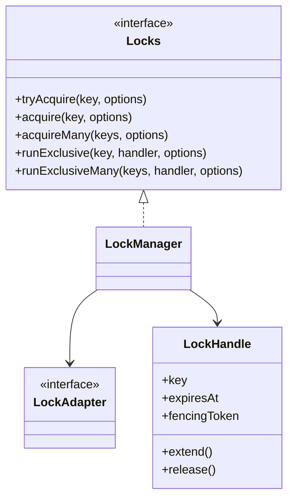
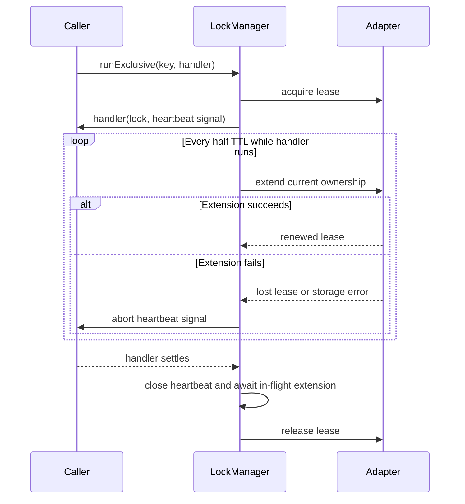
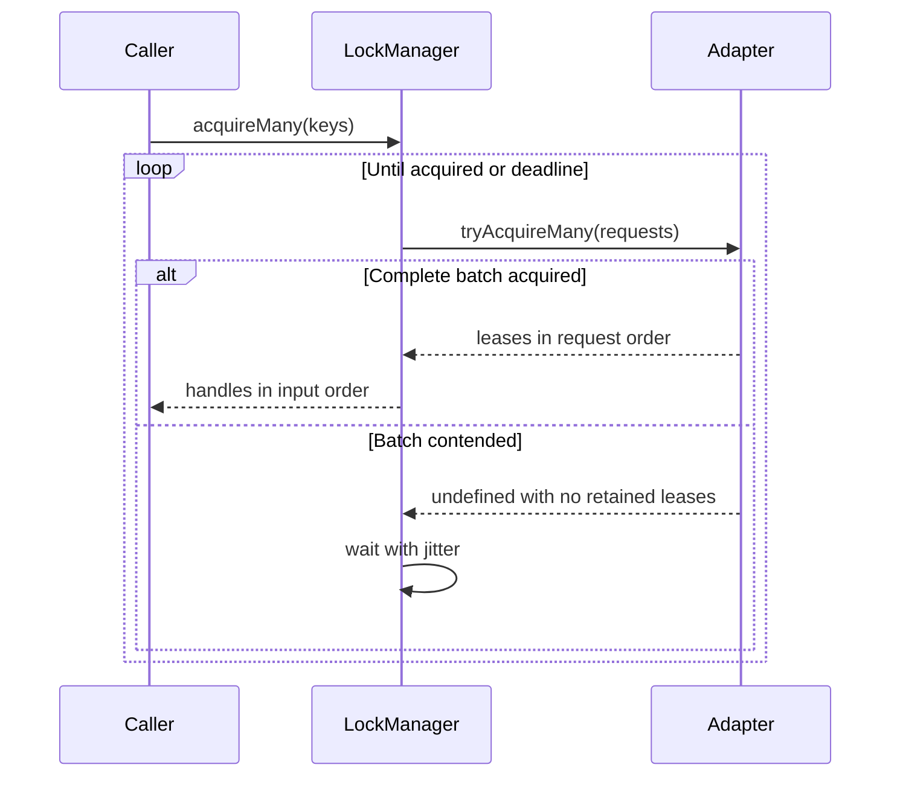

# Locks

[Documentation](../README.md) · [Implementation index](./README.md) · [Usage guide](../usage/lock.md)

Kestrel provides a transport-independent lock library in `src/packages/kestrel/src/lock`. Locks coordinate work that must have at most one active owner across application instances. Unlike the cache, lock storage is part of application correctness and every adapter error is propagated.

The library supports exclusive locks with automatic lease renewal around callback-based operations. Shared read/write locks can be added later through explicit APIs rather than changing the meaning of the base lock contract.

## Concepts and model

`LockManager` implements the application-facing `Locks` facade. A `LockAdapter` owns authoritative lease acquisition, extension and release using store time. `LockHandle` represents one owned lease and carries a monotonically increasing fencing token. Optional batch and pruning operations retain atomicity and maintenance outside the minimum single-lock flow.



## Usage guide

For application setup and task-oriented examples, see the [Locks usage guide](../usage/lock.md).

## Design and implementation

The manager qualifies application keys, applies wait and retry policy, coordinates automatic heartbeats and translates stale ownership into explicit errors. The adapter remains the authority for store time, expiry, ownership checks and fencing-token allocation. Batch acquisition is atomic from the caller's perspective: contention never exposes partial ownership.

Every adapter error propagates because lock storage participates in correctness. Cleanup attempts are aggregated so one failed release does not prevent the remaining acquired leases from being released.

## Execution scenarios

The lease and heartbeat sequence below is the nominal callback path. A contended wait repeatedly performs atomic acquisition attempts until success, timeout or cancellation. A heartbeat failure aborts the handler signal, waits for cooperative settlement, then still attempts release; stale external writes remain prevented by fencing.

## Public API

Application code depends on the `Locks` facade:

```ts
export interface LockRunContext {
  readonly signal: AbortSignal;
}

export interface Locks {
  tryAcquire(
    key: string,
    options?: LockAcquireOptions,
  ): Promise<LockHandle | undefined>;

  acquire(
    key: string,
    options?: LockWaitOptions,
  ): Promise<LockHandle>;

  acquireMany(
    keys: readonly string[],
    options?: LockWaitOptions,
  ): Promise<readonly LockHandle[]>;

  runExclusive<Value>(
    key: string,
    handler: (
      lock: LockHandle,
      context: LockRunContext,
    ) => Value | Promise<Value>,
    options?: LockRunOptions,
  ): Promise<Value>;

  runExclusiveMany<Value>(
    keys: readonly string[],
    handler: (
      locks: readonly LockHandle[],
      context: LockRunContext,
    ) => Value | Promise<Value>,
    options?: LockRunOptions,
  ): Promise<Value>;
}
```

`tryAcquire()` performs one attempt and returns `undefined` when another live owner holds the key. `acquire()` retries until it succeeds, its waiting timeout expires, or its `AbortSignal` is aborted. `runExclusive()` is the preferred API because it renews the lease while the handler runs and awaits release after both successful and failed handlers.

`acquireMany()` applies the same waiting policy to an ordered list of unique keys. It only returns after every lock has been acquired and returns handles in input order. No partial ownership remains visible when an attempt is contended. An empty list succeeds immediately, while duplicate keys are rejected because one caller cannot own the same logical lock twice in a batch. `runExclusiveMany()` provides the corresponding callback API and attempts every release even when the handler or another release fails.

```ts
await locks.runExclusive(
  `invoice:${invoiceId}`,
  async (lock, { signal }) => {
    await generateInvoice(invoiceId, lock.fencingToken, signal);
  },
  {
    ttlMs: 30_000,
    waitTimeoutMs: 5_000,
  },
);
```

Several related resources can be protected as one logical unit:

```ts
await locks.runExclusiveMany(
  [`account:${sourceId}`, `account:${destinationId}`],
  async ([sourceLock, destinationLock], { signal }) => {
    await transferFunds({ sourceLock, destinationLock, signal });
  },
  { waitTimeoutMs: 5_000 },
);
```

The option timeout and abort signal cover acquisition of the complete batch rather than each key independently. `LockBatchAcquisitionTimeoutError` and `LockBatchAcquisitionAbortedError` expose the requested keys when the operation cannot complete. Once acquired, the handler context provides a separate signal dedicated to heartbeat failure.

Manual ownership remains available when work cannot be expressed as one callback:

```ts
const lock = await locks.tryAcquire("daily-report");

if (lock === undefined) {
  return;
}

try {
  await generateReport();
} finally {
  await lock.release();
}
```

Every key is prefixed with the configured namespace before reaching an adapter. The handle exposes the application key, absolute store expiration and fencing token without exposing the owner identifier.

## Leases and ownership

A lock is a finite lease, not an indefinite mutex. Each acquisition receives a random owner identifier. Extension and release are conditional on that identifier, so an expired handle cannot modify a lease acquired later by another process.

`extend()` asks the store to start a new TTL from store time. It updates the handle only after confirmation. A missing or expired lease raises `LockLostError`. Calling `extend()` after an explicit release raises `LockReleasedError`; `release()` itself is idempotent.

The TTL must be positive and is capped by `maxTtlMs`. Manually acquired handles must still be extended explicitly before expiration. `runExclusive()` and `runExclusiveMany()` instead start a process-local, non-blocking heartbeat after acquisition. It requests a non-overlapping extension every half TTL and stops before release. This timer only decides when to contact the adapter; the adapter remains the authority for ownership and expiration.

If an automatic extension fails or ownership has been lost, the heartbeat stops and aborts the handler context signal with the extension failure as its reason. JavaScript cannot forcibly stop an asynchronous handler, so handlers must pass this signal to cancellable work or check it at safe boundaries. The facade waits for the handler to settle, stops any in-flight heartbeat, then attempts every release. Fencing tokens remain necessary because cancellation is cooperative and an unresponsive previous owner may continue after losing its lease.



## Fencing tokens

Every successful acquisition receives a monotonically increasing `bigint` fencing token. A lease prevents cooperative callers from starting concurrent work, while a fencing token protects against a previous owner that resumes after its lease expired. When the protected system supports it, writes should include the token and reject values older than the most recently accepted token.

The in-memory adapter maintains a process-local counter. PostgreSQL uses the `bigserial` sequence behind `utils.lock_lease.fencing_token`; sequence values remain monotone when released or expired rows are deleted. Contended attempts may create gaps, which do not affect the guarantee.

## Adapter contract

Adapters implement three ownership operations atomically:

Concrete adapters and their focused tests live in `src/packages/kestrel/src/lock/adapters` and are re-exported by the lock library's public index.

```ts
export interface LockAdapter {
  tryAcquire(
    request: LockAcquireRequest,
  ): Promise<LockLease | undefined>;
  tryAcquireMany?(
    requests: readonly LockAcquireRequest[],
  ): Promise<readonly LockLease[] | undefined>;
  extend(
    request: LockExtendRequest,
  ): Promise<LockLease | undefined>;
  extendMany?(
    requests: readonly LockExtendRequest[],
  ): Promise<readonly LockLease[] | undefined>;
  release(request: LockReleaseRequest): Promise<boolean>;
}
```

`tryAcquire()` succeeds only when no live lease exists. The optional `tryAcquireMany()` must acquire every unique request atomically and return leases in request order, or return `undefined` without retaining any acquisition. `extend()` succeeds only for the live current owner. The optional `extendMany()` applies the same ordered, atomic all-or-nothing contract to batch renewal. `release()` deletes only the current owner's lease and reports whether it did so. Adapter methods remain asynchronous so consumers can switch between memory, PostgreSQL and future stores without API changes.

When an adapter does not implement `tryAcquireMany()`, the manager sorts storage keys to give concurrent callers a stable acquisition order, calls `tryAcquire()` sequentially, and releases every partial acquisition before retrying. Cleanup failures are propagated rather than treated as contention. When `extendMany()` is unavailable, the heartbeat calls every handle extension through `Promise.allSettled()`. Any failed extension loses the logical batch, aborts the handler signal and eventually releases all handles, even though successful fallback extensions are not rolled back.



Adapters can additionally implement `PrunableLockAdapter`. Pruning removes a bounded number of expired leases and must be safe when several application instances run it concurrently.

## PostgreSQL adapter

The PostgreSQL adapter stores leases in `utils.lock_lease`. Single acquisition is one conditional upsert. Batch acquisition uses one set-based conditional upsert inside a transaction and rolls the transaction back when any requested key is contended. Keys are sorted before the statement to give concurrent batches a consistent row-lock order. Single extension is one conditional update, while batch extension uses one set-based transactional update and rolls back every update if any lease is missing, expired or owned by another caller. Release is one conditional delete. Acquisition and extension compute expiration from `statement_timestamp()`, avoiding clock differences between application processes.

Expired rows are claimed in bounded batches with `FOR UPDATE SKIP LOCKED` before deletion. `LockProvider` exposes this as one `prune()` resource operation and owns no timer. The provider contributes `maintenance.lock-prune` through `app.catalog`; the dedicated scheduled-task process invokes it at `APP_CONFIG__LOCK__PRUNE_INTERVAL_SECONDS`, while a zero interval disables the contribution.

## Dependency injection and configuration

`LockProvider` lives in `src/packages/kestrel/src/lock`, receives a resolved `LockConfig` in its constructor and registers lazy singleton factories for the resource and public facade during composition. Its boot hook resolves the PostgreSQL adapter and manager in standard mode after the database provider has booted. Protected adapter, resource and maintenance-task factories allow an application subclass to replace complex behavior without duplicating registration. Actions and services declare the exported descriptor rather than accessing the container directly:

```ts
export const locksDependency = dep<Locks>("locks");
```

The application exposes the following schema-derived environment overrides:

- `APP_CONFIG__LOCK__NAMESPACE`
- `APP_CONFIG__LOCK__DEFAULT_TTL_MS`
- `APP_CONFIG__LOCK__MAX_TTL_MS`
- `APP_CONFIG__LOCK__DEFAULT_WAIT_TIMEOUT_MS`
- `APP_CONFIG__LOCK__RETRY_INTERVAL_MS`
- `APP_CONFIG__LOCK__RETRY_JITTER_RATIO`
- `APP_CONFIG__LOCK__PRUNE_BATCH_SIZE`
- `APP_CONFIG__LOCK__PRUNE_INTERVAL_SECONDS`

Retry jitter spreads contending processes across slightly different retry instants. Waiting is finite by default and can be cancelled with an `AbortSignal`.

## Failure policy

Lock operations are fail-closed: storage failures are propagated and are never interpreted as successful acquisition, extension or release. A waiting deadline raises `LockAcquisitionTimeoutError` or `LockBatchAcquisitionTimeoutError`, cancellation raises `LockAcquisitionAbortedError` or `LockBatchAcquisitionAbortedError`, and rejected ownership during extension raises `LockLostError`.

If only one stage fails, the facade propagates that error unchanged. If the handler, heartbeat or one or more releases fail together, it raises an `AggregateError` in that order. `runExclusiveMany()` always attempts every release. This preserves the application error without hiding lost ownership or cleanup that could not be confirmed.

## Instrumentation and observations

The lock manager supports an optional synchronous `LockInstrumentation` sink. The sink receives one terminal event per public acquisition, extension or release call. Retries are summarized through an attempt count rather than emitted individually, preventing contention from flooding observation storage.

```ts
export interface LockInstrumentation {
  record(event: LockInstrumentationEvent): void;
}

const locks = new LockManager(adapter, {
  // Other lock policy options are omitted from this example.
  instrumentation: {
    record(event) {
      lockMetrics.record(event);
    },
  },
});
```

`lock.acquisition` records the logical key, immediate or waiting mode, terminal result, attempt count, effective TTL, optional wait timeout and successful fencing token. Its generic `durationMs` covers the complete acquisition call, including waiting. Contention returned by `tryAcquire()` is a successful operation with a `contended` result; timeout, cancellation and storage errors have a failure outcome.

`lock.batch-acquisition` records one terminal event for the public batch operation rather than one event per internal key attempt. It contains the ordered logical keys, aggregate attempt count, effective TTL, wait timeout and the ordered fencing tokens on success. Formatting is applied independently to every key before the event reaches instrumentation.

`lock.extension` records `extended`, `lost`, `already-released` or `error` for both explicit extensions and automatic heartbeat attempts. A lost result means the adapter no longer recognizes the handle as the live owner and the manager raises `LockLostError` as before.

`lock.release` records `released`, `not-owned`, `already-released` or `error`. The event's `durationMs` covers the release storage call, while `heldDurationMs` covers the complete interval since acquisition. A `not-owned` result does not change the idempotent public release API, but its failure outcome makes an expired or replaced lease visible to instrumentation.

Fencing tokens are represented as decimal strings because observation payloads are JSON-compatible and do not accept `bigint`. Owner identifiers and raw errors are never included. Events contain the public logical key rather than the adapter's namespaced storage key. Applications can provide `formatObservationKey` to redact, normalize, truncate or hash sensitive and high-cardinality keys before they reach the sink.

Durations use `performance.now()` through an injectable `monotonicNow` function and are clamped to non-negative values. The wall clock used for acquisition deadlines remains separate. When instrumentation is absent, the manager does not perform monotonic measurements.

Instrumentation is strictly diagnostic. Exceptions from the sink, key formatter or injected monotonic clock are contained and never change lock acquisition, ownership or release semantics. Invalid operation input is rejected before instrumentation begins and therefore does not produce an event.

The lock library owns typed `lock.acquisition`, `lock.extension` and `lock.release` observation definitions in `src/packages/kestrel/src/lock/observations.ts`. The instrumentation contract remains independent from observation storage so it can also feed logs or metrics. The application provider bridges its singleton lock manager to the execution-scoped `Observer` through the shared asynchronous observer context. Lock work performed outside a direct, HTTP or CLI execution remains functional and produces no stored observation.
