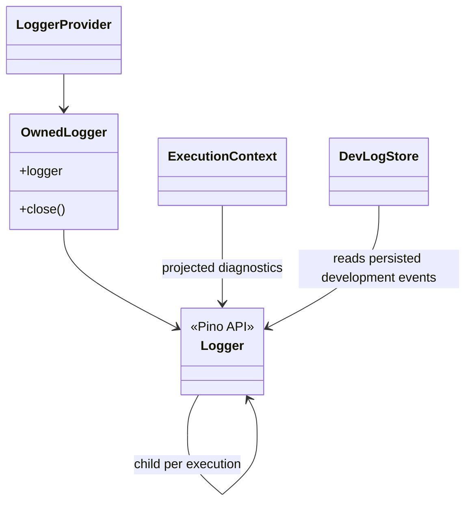
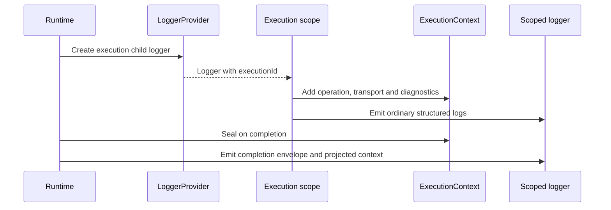

# Logging

[Documentation](../README.md) · [Implementation index](./README.md) · [Usage guide](../usage/logging.md)

The current implementation described below uses Pino. The [native Kestrel logging implementation plan](./native_logging_plan.md) defines its proposed replacement, including bounded delivery, saturation policy, adapter contracts and performance acceptance gates.

The application uses Pino for structured logs in every transport. The reusable `LoggerProvider` lives in `src/packages/kestrel/src/log`, receives a resolved `LoggerConfig` and transfers logger ownership to the common `App`. The thin subclass in `src/server/core/providers` overrides the protected backend factory to select the application development database when configured. Deployed environments keep Pino's newline-delimited JSON output on stdout so the hosting platform can collect it without an application-specific integration.

## Concepts and model

The application logger is the root Pino instance owned for the complete process. The scoped logger is a child associated with one execution. `ExecutionContext` diagnostics may be projected either into a completion entry or dynamically into scoped log calls. Development storage is a separate Pino transport and `DevLogStore` is its read-side query API.



## Usage guide

For application setup and task-oriented examples, see the [Logging usage guide](../usage/logging.md).

## Design and implementation

The provider exposes a stable logger facade during composition and selects its active backend during bootstrap from abstract configuration and the finalized boot plan. Once the application reaches `running`, it emits one structured `App started` entry at `debug` level containing the runtime identity, composition and bootstrap durations, total startup duration and per-provider composition and boot timings. Execution log projection is implemented at the scoped boundary, keeping Pino transport behavior independent from application execution semantics. Completion mode emits one summary; dynamic mode decorates scoped calls without changing caller code.

The PostgreSQL transport runs in a Pino worker thread and therefore owns a serializable database configuration and its own pool. It buffers writes independently from the application's pool and applies the same configured Pino level as standard destinations before sending entries to the worker. Development querying is separated into `DevLogStore`, allowing Studio to read through normal application infrastructure.

## Execution scenarios

### Scoped completion logging



## Public API

| API group | Main exports |
| --- | --- |
| Composition and DI | `LoggerProvider`, `loggerConfigBase`, `applicationLoggerDependency`, `loggerDependency`, `setExecutionLogEnabledDependency` |
| Logger construction | `createLogger()`, `createDevLogger()`, `createDelegatingLogger()`, `createDynamicExecutionLogger()`, `OwnedLogger`, `Logger` |
| Execution diagnostics | `executionContextLogDestination`, `projectExecutionLogContext()` and execution log context types |
| Development storage | `createDevLogStore()`, `DevLogStore`, `DevLogSource`, page types and the `logs` Drizzle declaration |

## Extension API

The library exposes no generic log-storage adapter. Pino's transport protocol is the write-side extension point, while `DevLogSource` is the read-side contract consumed by development tooling. A custom provider may override focused logger construction, but must return an `OwnedLogger` whose `close()` drains and releases every backend resource. A custom execution logger must preserve child logger behavior, structured fields and the global/local enablement rules.

The `local` environment replaces stdout with the PostgreSQL transport provided by the dedicated `src/packages/kestrel/src/log` library. Pino runs this transport in a worker thread; the worker therefore creates and owns a small node-postgres pool instead of receiving the application's non-serializable pool. It buffers up to 50 events and flushes every 100 milliseconds, closes the pool with the application lifecycle and removes entries older than seven days when it starts. Tests use a silent Pino logger, while stage and production use JSON stdout.

## Application integration

The transport-independent application is created before HTTP, CLI or future worker contexts. `LoggerProvider` registers the root logger as `applicationLogger` and a child logger as the scoped `logger` dependency. Fastify is then constructed with the already registered root instance through `loggerInstance`; CLI uses the same application composition without depending on Fastify.

Actions and services declare `loggerDependency` from the logging library:

```ts
const action = defineAction({
  name: "example.process",
  input: inputSchema,
  output: outputSchema,
  dependencies: {
    logger: loggerDependency,
  },
  async handler(input, { logger }) {
    logger.info({ id: input.id }, "Processing input");
  },
});
```

Each execution scope receives one child logger containing its UUID `executionId`. HTTP accepts a valid caller-provided execution UUID through its configured correlation header or generates one, while CLI and direct executions always generate one. Fastify's process-local request id remains available separately on its own request logs. `App.dispose()` flushes or closes the root logger after HTTP shutdown, a CLI invocation or another transport lifecycle.

Every execution context starts with its `executionId` as a log diagnostic. Transport boundaries also contribute `operation` and `transport`, making each emitted execution log identifiable without joining it to observation storage. Execution code can add more JSON-compatible information with `executionContext.setDiagnostic()` or `appendDiagnostic()`; both logs and observations receive it by default, while `{ destinations: [executionContextLogDestination] }` restricts it to logs. Diagnostic values are validated, copied, deeply frozen and bounded when contributed. The logger configuration controls whether and how these values are projected:

```ts
executionLog: {
  enabled: true,
  contextMode: "completion",
}
```

- `executionLog.enabled` globally enables execution-context logging. A local scope cannot override `false`.
- `contextMode: "completion"` is the default. One `Execution context completed` entry is emitted at the end of each enabled execution. Its envelope carries `executionId`, `outcome`, `operation` and `transport`, while its optional `executionContext` field contains only additional contributed values.
- `contextMode: "dynamic"` enriches each scoped log emitted while execution logging is enabled. The dynamic projection is also retained by child loggers. No separate completion summary is emitted in this mode.

`LoggerProvider` registers the scoped `setExecutionLogEnabledDependency`. Middleware and technical transport boundaries may call it with `false` without removing context values or affecting observations. Calling it with `true` restores the local default only when `executionLog.enabled` is globally enabled. Studio applies `false` to its complete managed HTTP scope, so its polling and data APIs do not generate execution logs while the application endpoints invoked through Studio remain observable normally.

The application exposes this library configuration through `APP_CONFIG__LOGGER__EXECUTION_LOG__ENABLED` and `APP_CONFIG__LOGGER__EXECUTION_LOG__CONTEXT_MODE`. Omitting them retains the enabled `completion` defaults.

Both modes promote the reserved `executionId`, `operation` and `transport` fields to the stable log envelope and remove them from the nested projection. Other contributed fields remain namespaced below `executionContext`, preventing collisions with Pino bindings and fields supplied explicitly by the caller; the object is omitted when no additional fields remain. Internal values and observation-only diagnostics are not logged. Execution-log suppression is a presentation policy rather than redaction: log diagnostics remain available to the scope and any other selected destination. Because context diagnostics may reach durable development storage or platform stdout, producers must apply the same secret and personal-data policy as for explicit log fields.

Transport startup fails when the development table is missing or PostgreSQL is unavailable. This is intentional because continuing would silently discard the only local log output. Prepare the application and development schemas before starting the local server:

```sh
npm run db:dev:migrate
npm run dev
```

## Development storage

Local logs are stored in `dev.log`. The logging library owns the table declaration in `src/packages/kestrel/src/log/db/schema.ts`, but the table remains development-only. The aggregated development entrypoint in `src/server/core/db/schema/dev_schema.ts` re-exports the application schema and adds this declaration for Drizzle Studio. Synchronization uses the separate `drizzle.dev-push.config.ts`, whose `src/server/core/db/schema/push_schema.ts` entrypoint includes the development tables and the migration-owned utility declarations needed for a safe diff. Logs therefore never enter deployment migrations. Each row promotes timestamp, Pino level, message and Fastify request id into queryable columns while retaining the complete structured event as JSONB.

`src/packages/kestrel/src/log/index.ts` is the public boundary for logger construction, storage and the Studio extension. Application code should import the library through this entrypoint rather than its internal files.

The transport has its own database connection because its worker is isolated from the main application. Studio reads the same table through the application pool and its development-only Drizzle facade.

## Studio

Studio's Logs page refreshes the newest events every two seconds, filters by exact Pino level, expands complete JSON payloads, paginates older entries and can clear the table. Execution views and HTTP requests launched from Studio also reuse the expandable log row below their observation timeline, querying the JSONB envelope by `executionId` and preserving emission order. Requests made by these APIs are filtered in the transport so the viewers do not recursively generate entries about themselves.

Direct `console` calls do not pass through Pino. They should be reserved for failures that occur outside the logger lifecycle, such as an unrecoverable bootstrap error.

The dynamic mode currently wraps Pino calls at the scoped logger boundary. If it becomes the dominant policy, execution-context propagation through an asynchronous logging context or a native Pino integration can replace that facade without changing the `ExecutionContext` producer API.

Because local structured logs do not reach stdout, the HTTP bootstrap explicitly prints its resolved `Listening on <address>` readiness message after Fastify has opened the port. Other environments already expose Fastify logs on stdout and do not print this additional line.

## Explicit provider adapters

`LoggerProvider(config, adapter)` accepts `pinoLogger()`, `postgresLogger(connection, settings)` or `defineLoggerAdapter(...)`. The facade remains Pino-compatible. The finalized boot plan is passed to the definition, allowing minimal mode to avoid development storage. Disposal occurs during final container teardown so feature shutdown can still log.

See the [shared composition convention](../implementation/app.md#provider-adapter-convention) and [configuration recipes](../usage/configuration.md#additional-provider-composition).

The PostgreSQL logger accepts the database provider's boolean or native TLS object in `ssl`, including a private CA or client certificate. Pino sends these options to a worker thread, so use structured-clone-compatible TLS values (for example PEM strings); function-valued TLS hooks and native secure-context objects cannot cross that boundary. The transport still owns a separate pool and does not inherit the database provider's resource policy.
