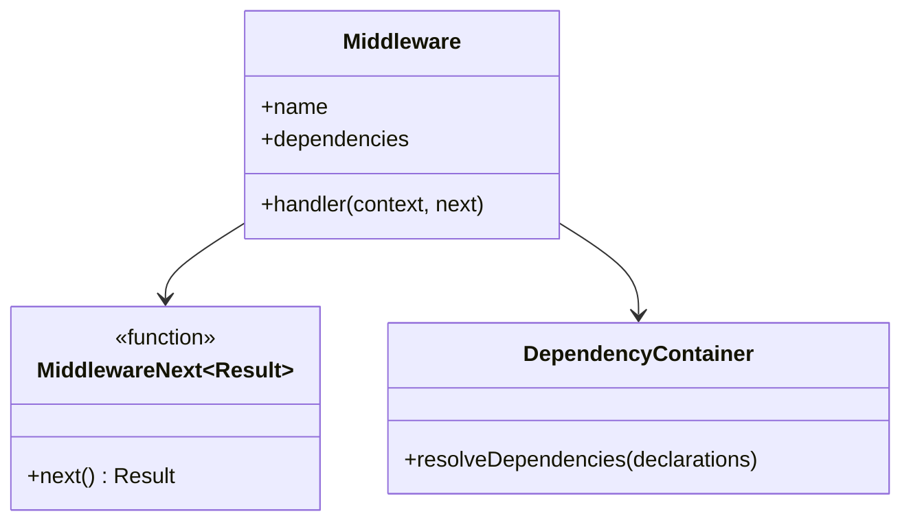
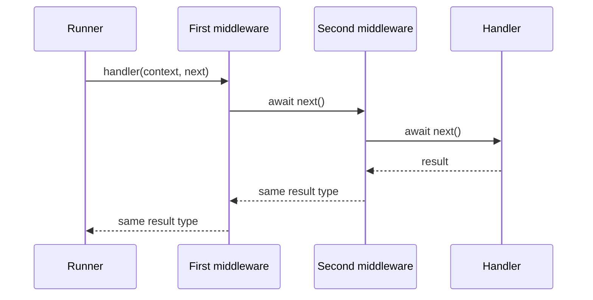

# Middleware

[Documentation](../README.md) · [Implementation index](./README.md) · [Usage guide](../usage/middleware.md)

Middleware surrounds actions and transport controllers with reusable infrastructure behavior. A middleware receives a validated execution context and an asynchronous `next()` function. Calling `next()` enters the remaining pipeline; awaiting it lets the middleware perform work after the handler and output validation have completed.

## Concepts and model

A middleware is a named definition containing dependency declarations and one generic handler. A pipeline combines ordered middleware around a terminal operation. The generic `MiddlewareNext<Result>` contract preserves the successful result type across every layer.



## Usage guide

For application setup and task-oriented examples, see the [Middleware usage guide](../usage/middleware.md).

## Design and implementation

`runMiddlewarePipeline()` uses onion-style composition. It resolves each middleware's dependencies when that layer is entered, calls the terminal after the final layer, then unwinds in reverse order. Every `next()` call creates an independent traversal of the downstream suffix, so repeated and concurrent continuations do not share a dispatch cursor.

The generic library owns composition only. Input parsing, output schemas, execution-scope disposal and transport error rendering remain with the calling action or controller library. A middleware may call `next()` repeatedly; every call starts a fresh traversal of the complete downstream suffix.

## Execution scenarios



If a middleware throws before `next()`, later layers and the terminal do not run. If it throws while unwinding, the successful terminal result becomes a failure handled by the caller's normal error boundary. Calling `next()` repeatedly replays every later middleware and the terminal operation, sequentially or concurrently according to how the caller awaits the returned promises. This supports concerns such as retries while making the replaying middleware responsible for the downstream operation's idempotency and concurrency safety.

## Public API

| Export | Purpose |
| --- | --- |
| `defineMiddleware()` | Creates a named, inspectable middleware definition. |
| `runMiddlewarePipeline()` | Resolves dependencies and executes a middleware chain around a terminal callback. |
| `Middleware` | Describes the definition, dependencies and generic handler contract. |
| `MiddlewareNext` | Describes the one-shot continuation and preserves the pipeline result type. |
| `MiddlewareOptions` | Configures dependencies and the handler accepted by `defineMiddleware()`. |

The generic middleware library has no adapter API. Transport libraries specialize its context and expose their own middleware factories while reusing the same pipeline semantics.

Middleware runs in declaration order and unwinds in reverse order. Given `middleware: [first, second]`, execution is equivalent to `first(context, () => second(context, handler))`.

Every middleware has a stable name and may declare its own dependencies. Those dependencies are resolved from the current execution scope only when the middleware runs:

```ts
const audit = defineActionMiddleware("audit.action", {
  dependencies: {
    logger: Logger,
  },
  handler: async ({ action, deps }, next) => {
    deps.logger.info({ action: action.name }, "Action started");
    const result = await next();

    deps.logger.info({ action: action.name }, "Action completed");

    return result;
  },
});
```

An action or controller attaches middleware explicitly:

```ts
const action = defineAction({
  name: "user.create",
  input: inputSchema,
  output: outputSchema,
  middleware: [audit, databaseTransaction],
  handler: createUser,
});
```

The middleware handler is generic over the pipeline result. Successful execution must therefore return the exact result obtained from `next()` or another value that is valid for that same generic type. A middleware cannot replace an action result with an unrelated success value. It may interrupt execution by throwing an exception, which is then handled by the normal transport error boundary.

`next()` is a replayable continuation. Each invocation resolves the downstream middleware dependencies again and executes the remaining pipeline through the terminal operation. Scoped and singleton dependency lifetimes still follow the owning execution scope, while transient dependencies may therefore be recreated for every traversal. Middleware that retries work must classify retryable failures, bound its attempts and ensure that replaying downstream side effects is safe.

## Action middleware

`defineActionMiddleware()` creates transport-independent middleware. Its context contains the action metadata and validated input. The input is exposed as `unknown` because middleware is inherited by derived actions whose public input schema may differ; middleware that inspects input must narrow or validate it explicitly.

Action middleware surrounds dependency resolution, the action handler and action output validation. Input validation happens before the pipeline, so invalid input never starts a transaction or authorization check.

Business authorization belongs in action middleware when it must also protect direct application calls, HTTP routes and CLI commands.

## HTTP middleware

`defineHttpMiddleware()` receives the controller metadata, typed controller input, Fastify request and reply, and execution scope. HTTP middleware surrounds controller dependency resolution, an optional action execution, and controller output validation.

Transport authentication and request-specific authorization can live here. Authorization failures should normally throw a representable error rather than send a reply directly, keeping error rendering centralized.

Every HTTP controller uses its explicit `options.access` policy or inherits the runtime's `defaultAccess`, which is anonymous when unconfigured. An explicit policy replaces the default. The effective policy's middleware run before and surround controller-local middleware. See [HTTP access policies](./http.md#access-policies). Given access middleware `[access]` and controller middleware `[local]`, execution is equivalent to `access(context, () => local(context, handler))`.

Access policies protect the HTTP boundary only. Business authorization that must also apply to CLI commands, workers or direct application calls remains Action middleware.

## CLI middleware

`defineCliMiddleware()` receives the controller metadata, typed controller input and execution scope. It surrounds controller dependency resolution, an optional action execution, and controller output validation.

## Execution boundaries

Kestrel input parsing, transport error representation and execution-scope disposal remain outside middleware. This guarantees that middleware always receives validated input and cannot bypass resource cleanup.
