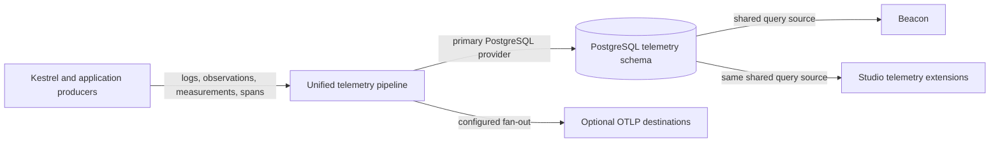
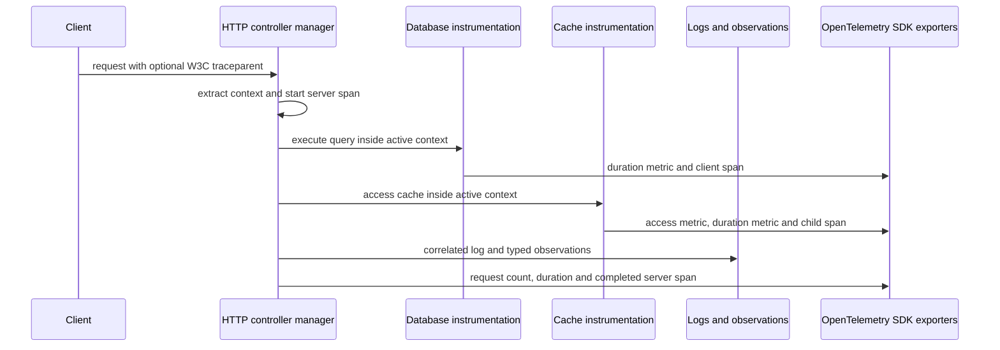
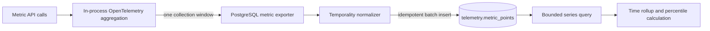
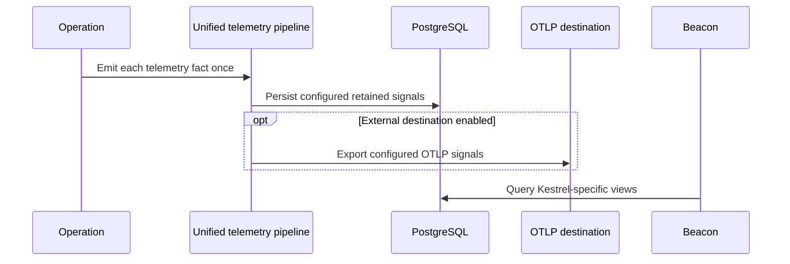

# Telemetry and Beacon

[Documentation](../README.md) · [Implementation index](./README.md)

> Checkout status: the `telemetry` and `beacon` source directories are absent from this checkout. This page is retained as a design record; its historical completion claims and code examples do not describe an available API here. Use the [logging](../usage/logging.md) and [observability](../usage/observability.md) guides for the implemented libraries.

Logging design update (2026-09-18): the [native Kestrel logging implementation plan](./native_logging_plan.md) replaces this document's target decision to retain Pino with a Kestrel-owned logger and bounded delivery contracts. Pino-specific passages below remain historical design context until that migration is implemented. The inspected checkout still contains the separate `log` and `observability` libraries rather than `telemetry`; implementation status claims below must be reconciled with the target checkout before resuming these phases.

Status: approved target design. Phases 1 through 3 are complete, the first phase 3.5 Beacon vertical is implemented, and phase 0 capacity validation remains in progress; the implementation plan at the end of this document tracks the remaining work.

This document defines a unified Kestrel facility for collecting, storing, exporting and exploring production telemetry. It covers structured logs, typed observations, metrics and traces, and defines how the production Beacon application and the local Studio application consume the same data.

The design deliberately separates telemetry production from visualization while keeping one coherent Kestrel library and one application-owned lifecycle. OpenTelemetry is the recommended optional instrumentation adapter and supplies OTLP export, while Kestrel-owned contracts permit another instrumentation library or a no-op implementation. PostgreSQL is the first complete reference storage and query provider, subject to measured capacity limits rather than assumed to fit every production scale. Additional OTLP destinations and a small number of explicitly selected query providers can be added without turning Beacon into a universal observability frontend.

## Goals

- Provide the production Beacon application optimized for Kestrel concepts such as executions, controllers, workers, queues, cache pools, database operations, locks and throttling.
- Make Beacon usable in `local`, `stage` and `prod` according to application configuration.
- Give Studio and Beacon access to the same telemetry records instead of maintaining development-only log and observation tables.
- Consolidate the current `log` and `observability` libraries into one `telemetry` library with a shared resource context, lifecycle, health model, configuration and delivery pipeline.
- Preserve the distinct semantics of logs, observations, metrics and traces while collecting them through one logical pipeline.
- Provide storage-neutral Kestrel instrumentation contracts with no-op defaults.
- Supply OpenTelemetry as an optional metrics, tracing, propagation and OTLP adapter without preventing alternative instrumentation adapters.
- Store all four signals in PostgreSQL through the first provider.
- Export selected signals easily to one or more OTLP-compatible destinations, including hosted services such as New Relic.
- Keep telemetry outside the critical path of application work and make overload, storage failure, retry and loss visible.
- Bound storage, cardinality, retained detail and sensitive data explicitly.

## Non-goals

- Support every observability backend or query language in the first implementation.
- Reimplement a general-purpose Prometheus, log search or distributed tracing platform.
- Derive all production metrics from stored logs or observations.
- Guarantee lossless delivery during process crashes without an explicitly configured durable intermediary.
- Turn observations into an application event bus.
- Require OpenTelemetry in applications that select another instrumentation adapter or disable metrics and tracing.
- Make Studio available in production. Beacon is the production-capable application; Studio remains a local development tool.

## Signals and responsibilities

The four signals are related but not interchangeable:

| Signal | Primary responsibility | Typical retention and volume |
| --- | --- | --- |
| Logs | Human-readable operational detail and structured diagnostics. | Potentially high volume; filtered by level and policy. |
| Typed observations | Kestrel-owned events with stable names, versions and typed payloads. | Selectively retained according to each definition and deployment policy. |
| Metrics | Low-cardinality aggregates, rates, gauges and latency distributions. | Every measurement contributes to an in-memory aggregation; aggregated points are persisted. |
| Traces | Causal execution flow and critical-path detail across nested or distributed operations. | Spans are sampled and retained for diagnostic exploration. |

Metrics answer whether a problem exists and how it evolves. Traces and observations explain concrete executions. Logs provide contextual detail. Dedicated Beacon views may combine the four signals, but one signal must not silently replace another.

## Unified library boundary

The production boundary is `src/packages/kestrel/src/telemetry`. Logging and typed observations now live below that boundary with their tests, public exports and supporting files. Metrics and tracing currently expose neutral contracts and tested no-op implementations; their concrete adapters remain future work.

```text
src/packages/kestrel/src/telemetry/
├── configuration.ts
├── dependencies.ts
├── health.ts
├── resource.ts
├── provider.ts
├── index.ts
├── instrumentation/
├── logs/
├── observations/
└── adapters/
    ├── opentelemetry/
    ├── postgres/
    └── otlp/
```

Every adapter owns its implementation, tests, public exports and adapter-specific support files. Kestrel production code does not import application configuration or infer behavior from environment names. The application selects instrumentation, storage and destinations when composing `TelemetryProvider`.

The Kestrel-owned contracts cover metric instruments, span lifecycles, active context and propagation without exposing a concrete vendor SDK. Their default implementations are no-ops. Logs and typed observations can therefore remain enabled even when metrics and tracing are disabled. The OpenTelemetry adapter implements these contracts with OpenTelemetry APIs and SDKs; another library can replace it by implementing the same contracts. An experimental PostgreSQL metric exporter now validates the storage model but is deliberately excluded from application composition and migrations until phase 0 measurements are complete.

The consolidation creates one logical collection pipeline, not one undifferentiated queue or failure domain. Signals need different correctness and overload semantics:

- logs may prioritize higher severity records;
- observations use per-definition retention and sampling policies;
- metrics aggregate measurements in memory and export completed collection windows;
- traces make sampling decisions and export completed spans.

Every signal processor owns its bounded buffer, retry state, circuit state and loss accounting. Every destination also owns isolated delivery state where needed. Log saturation cannot consume metric capacity, a failing OTLP destination cannot block PostgreSQL, and a trace exporter failure cannot prevent observation persistence.

One application-owned `TelemetryResource` starts these isolated processors, shares their resource metadata and correlation context, reports their combined health, flushes them in a defined order and closes them before dependent infrastructure. A producer emits a fact once; configured sinks perform persistence and optional external fan-out without reinstrumenting the operation.

## Applications and reusable UI

`src/packages/kestrel/src/beacon` owns the production-capable server extension, query contracts and client. It is independent from Studio and can be mounted locally or in deployed environments with application-provided authentication and authorization.

Local composition may mount Beacon in the ordinary HTTP runtime for convenience. Stage and production should be able to run the same application and query contracts in a dedicated read runtime so analytical queries, read credentials and UI traffic do not compete with application requests. This is a deployment separation, not a second telemetry implementation: producer processes still use the same `TelemetryProvider`, and the read runtime only queries retained data.

Studio remains in `src/packages/kestrel/src/studio`. Its telemetry extensions reuse the same query contracts and rendering components where useful, but retain local-only capabilities such as clearing retained data, source-code links and interactive execution tools.

The intended relationship is:



With the initial PostgreSQL query provider, Beacon and Studio both read the `telemetry` schema. Phase 3 switched the log and observation writers together with Studio and removed the disposable `utils.logs` and `utils.observations` tables without a backfill. Beacon will therefore use the same local records that Studio displays.

## Common resource and correlation model

Every signal carries common resource metadata where applicable:

- `service.name`;
- `service.version`;
- `service.instance.id`;
- deployment environment;
- process identity and runtime version;
- optional host, container and orchestrator attributes supplied by configured resource detectors.

Every Kestrel execution retains its UUID `executionId`. It does not replace the OpenTelemetry `traceId`:

- `executionId` identifies one Kestrel execution scope;
- `traceId` may cross several services, processes, transports and worker invocations;
- `spanId` identifies the active operation inside that trace.

Logs and observations produced inside an active span receive its `traceId` and `spanId`. Spans receive the execution identifier as a Kestrel attribute. Beacon can therefore move from an execution to its trace, logs and observations without forcing unrelated identifier formats to be equal.

HTTP requests extract an incoming trace context or create a new root context. CLI commands, direct actions and scheduled tasks create roots. Worker publication propagates a message creation context and worker processing creates or links a consumer span according to the messaging model. A batch invocation links every included message creation context instead of pretending that several messages have one parent.

## Optional instrumentation and OpenTelemetry

Kestrel libraries depend on Kestrel-owned instrumentation contracts, not OpenTelemetry runtime packages. Stable OpenTelemetry semantic conventions may inform Kestrel definition names and attributes without making the OpenTelemetry implementation mandatory. The optional `telemetry/adapters/opentelemetry` adapter owns OpenTelemetry API and SDK integration, processors, readers, exporters and W3C propagation. It uses explicit Kestrel instrumentation and its own asynchronous context rather than registering global OpenTelemetry providers, so several application instances and non-isolated tests cannot replace one another's SDK state.

The application explicitly selects one metrics and tracing instrumentation adapter:

- `NoopTelemetryInstrumentation` disables Kestrel metrics and tracing with minimal overhead;
- `OpenTelemetryInstrumentation` enables the recommended OpenTelemetry implementation and OTLP export;
- an alternative adapter can bridge another metrics or tracing library to the Kestrel contracts.

Signal selection is independent where useful. An application may retain Pino logs and typed observations through PostgreSQL while metrics and tracing are no-ops, or use an alternative metrics adapter while leaving tracing disabled. The provider validates incompatible combinations during composition instead of silently starting partial SDKs.

The currently implemented generic OTLP HTTP composition is:

```ts
import {
  createOtlpOpenTelemetryInstrumentation,
} from "@kestrel/framework/telemetry/adapters/opentelemetry";

new TelemetryProvider({
  resource: {
    serviceName: config.telemetry.serviceName,
    serviceVersion: config.telemetry.serviceVersion,
    deploymentEnvironment: config.telemetry.environment,
  },
  // The same configuration works with a Collector or a vendor endpoint.
  instrumentation: createOtlpOpenTelemetryInstrumentation({
    endpoint: config.telemetry.otlp.endpoint,
    headers: config.telemetry.otlp.headers,
    metrics: true,
    traces: true,
  }),
  components: [loggerProvider, observationProvider],
});
```

Omitting `instrumentation` selects `NoopTelemetryInstrumentation` and disables Kestrel metrics and tracing. Passing `OpenTelemetryInstrumentation` directly accepts injected SDK span processors and metric readers, which makes alternative exporters and deterministic tests possible. Replacing it with another contract-compatible adapter changes the instrumentation library without changing HTTP, database, cache, worker or application producers. The experimental PostgreSQL telemetry provider remains independent from this instrumentation choice.

The first vertical slice validates the native path without OpenTelemetry auto-instrumentation:



The integration test asserts a shared trace across the HTTP, database and cache spans, correlation fields on logs and observations, all five metrics, remote W3C parent extraction and exporter-failure isolation. OTLP uses independent metric and trace exporters and contains flush or shutdown failures in instrumentation health instead of rejecting application shutdown. OpenTelemetry recommends placing a Collector between applications and observability backends in production; direct vendor OTLP endpoints remain supported by the same factory.

Automatic instrumentation is not enabled indiscriminately. Kestrel already owns HTTP, PostgreSQL, worker and execution boundaries and should instrument those boundaries natively with stable Kestrel metadata. Selected external-client instrumentations may be enabled by application configuration. An instrumentation that duplicates a native Kestrel span or metric must be disabled.

Kestrel exposes application instrumentation through DI facades or definition helpers backed by the selected adapter:

- counters for monotonic totals;
- up-down counters for additive current state;
- histograms for durations, sizes and distributions;
- observable gauges for authoritative values read at collection time;
- tracers or structured `runInSpan()` helpers for application operations.

Metric definitions declare a stable name, unit, description, instrument kind and permitted attribute keys. Adapter configuration may select aggregation views, histogram boundaries or exponential histograms without changing producers.

With `OpenTelemetryInstrumentation`, any standards-compatible OTLP endpoint is configured as a named destination rather than requiring a provider-specific implementation. Endpoint, protocol, headers, enabled signals and batching are configuration. Provider presets such as New Relic may supply verified defaults, but they do not change Kestrel instrumentation.

## Unified logging

Pino remains the structured logging API. The current provider and scoped execution logger move below `telemetry/logs`. A telemetry log bridge converts each Pino record once into the internal log record accepted by configured destinations.

In local configuration:

- PostgreSQL is the only log destination;
- no application log is written to stdout;
- trace, span and execution correlation is injected before persistence;
- Studio and Beacon read the same `telemetry.log_records` rows.

In production, configuration may enable PostgreSQL persistence, OTLP export, or both. Fan-out occurs behind the single log bridge. A record is not written to stdout and independently submitted through OTLP unless the application explicitly selects stdout as its delivery adapter. This prevents accidental duplicates while still allowing deliberate multiple destinations.

The bridge preserves Pino overloads, severity, message, error data and structured bindings. Redaction happens before any destination receives a record. Destination-specific retries or failures cannot make a completed application operation fail.

Unifying collection does not predetermine its execution thread. Phase 0 benchmarks an in-process bridge against worker-thread delivery for event-loop cost, serialization overhead and crash behavior. The selected implementation remains behind the same log processor and destination contracts, so physical isolation does not reintroduce a separate logging architecture.

## Typed observations

Typed observations remain first-class records. The existing stable definition name, category, schema version, outcome, duration and JSON-compatible data are retained. The envelope additionally carries resource, trace and span correlation.

An observation definition may provide conservative default retention metadata, while application configuration owns the final policy. A policy can match stable names or categories and combine:

- retain every event;
- retain failures;
- retain events above a duration threshold;
- deterministic ratio sampling;
- bounded reservoir sampling;
- disable production retention.

For example, circuit state transitions may be retained completely, database failures and slow queries may always be retained, and ordinary cache hits may be sampled very sparsely. Policy evaluation occurs before storage admission and OTLP conversion so dropped detail does not consume downstream capacity.

Dedicated Beacon views may query observations directly for worker transitions, throttling decisions, circuit changes, lock contention, slow operations and custom diagnostics. Aggregate rates and percentiles still come from metrics so observation sampling does not bias dashboards.

An OTLP destination represents a retained observation as a structured OTLP log record with stable observation attributes and trace correlation. It must not export the observation only as a span event because trace sampling could otherwise remove an independently retained observation.

## Metrics model

Metric API calls never perform PostgreSQL writes. The selected metrics adapter aggregates measurements in process for a configured collection interval. `OpenTelemetryInstrumentation` delegates this responsibility to the OpenTelemetry metrics SDK. The PostgreSQL metric exporter persists the resulting data points in batches.

The initial provider prefers delta temporality for counters and histograms because deltas compose across process restarts and service instances. Gauges and other current-state instruments retain their appropriate point semantics. A destination may override temporality and histogram aggregation when its documented ingestion requirements differ.

Metrics use bounded dimensions. Stable route templates, controllers, worker definitions, queues, operation kinds, outcomes, status codes and bounded error classifications are suitable attributes. Raw URLs, cache keys, SQL text, execution identifiers, trace identifiers, job identifiers and user identifiers are forbidden metric attributes.

High-cardinality questions such as the users generating the most requests require a separate bounded Top-K aggregator or an explicitly governed analytical event stream. They must not create one metric series per user.

The initial Kestrel metrics include:

- execution count and duration by transport, stable operation and outcome;
- HTTP request count, active requests and duration by method, route template and status class;
- worker publication, processing, retry, dead-letter, queue delay and handler duration;
- authoritative ready, scheduled and reserved queue gauges collected once from the queue store;
- cache access results, loads, writes, invalidations and durations;
- database operation duration, failures, returned rows and pool state;
- lock acquisition result, wait and held duration;
- throttling admission, rejection, wait, reconciliation, lease and circuit transitions;
- process CPU, RSS, heap, event-loop and runtime measurements;
- telemetry buffer, export, retry, failure and drop measurements.

Host, container and cluster metrics that cannot be attributed correctly from one application process should be collected by an infrastructure agent or Collector and exported through the same conventions.

## Tracing model

Tracing instruments lifecycles rather than translating only completed observations. A span must be active while nested work executes so database, cache, lock, HTTP and worker operations receive the correct causal context.

The initial span model includes:

- one transport span for each HTTP, CLI, direct, scheduled-task or worker execution;
- action spans when an action is a useful independent operation;
- database client spans around physical or logical database work;
- cache load spans and selected miss/error events rather than a span for every cheap cache hit;
- lock and throttling spans when waiting or coordination is operationally meaningful;
- producer, receive, process and settlement relationships for workers;
- outbound HTTP spans once the integrated HTTP client exists.

Span attributes follow OpenTelemetry semantic conventions where available and add a bounded Kestrel namespace only for Kestrel-specific concepts. Query parameters, unrestricted SQL values, request bodies and credentials are excluded.

## PostgreSQL provider

PostgreSQL is the first provider implementing both write and query sides. It uses the same table definitions in every environment.

It is deliberately the low-traffic compatibility tier, not an unlimited-scale commitment. Its targets are local development and small production sites whose telemetry volume fits a simple PostgreSQL retention policy. Phase 0 establishes the supported ingest rate, daily volume, retention, concurrent query and dashboard-latency envelope for that tier. A deployment outside it must use another supported storage provider; optimizing PostgreSQL until it competes with a specialized high-volume telemetry backend is not a goal.

### Database placement

Production should use a dedicated telemetry database where possible. A separate database in the same cluster is an acceptable first deployment; a separate pool and roles are the minimum. Telemetry must not consume the business pool or make business transactions wait behind retention work.

Recommended roles are:

- an ingest role with insert-only access to signal tables;
- a read role used by Beacon;
- a local Studio role with read and explicitly authorized clear access;
- a migration and maintenance role that owns schemas, partitions and retention.

Local development may place the `telemetry` schema in the application development database. It still uses the same tables and query implementation as deployed Beacon.

### Tables

`telemetry.log_records` stores one retained structured log with occurrence time, severity, message/body, resource, correlation identifiers and attributes.

`telemetry.observations` stores one retained typed observation with its stable definition envelope, resource, correlation identifiers and JSON-compatible payload.

`telemetry.spans` stores one sampled completed span with trace relationships, kind, timing, status, resource, attributes, events and links.

`telemetry.metric_points` stores one exported aggregate point or histogram for one collection window and attribute set. It does not store every counter increment or histogram recording.

The flat representation favors direct, idempotent writes, self-contained rows and straightforward queries over minimum bytes per point. Phase 0 measurements quantify the cost of repeated resource, series and textual identity data, but that cost remains acceptable for the intended low-traffic tier when retention is bounded. A normalized layout is a possible future optimization, not a prerequisite for the first PostgreSQL provider.

Each signal directory owns its schema, public exports and PostgreSQL store. Batch inserts use stable signal identities with `ON CONFLICT DO NOTHING`, making a retry after an uncertain write safe. Monitoring reads require a bounded time range, accept signal-specific exact filters and return at most 10,000 rows. Logs, observations and spans are ordered newest first with a complete keyset cursor; metric series retain their chronological `(endTime, id)` cursor for rollup processing. No query relies on an unbounded offset.

The adapter configuration defaults every raw signal to three retention days. Metric retention is limited to the measured seven-day PostgreSQL ceiling; the other signals remain configurable because their safe ceilings depend on record size and actual volume and have not yet been measured. One retention pass deletes at most 1,000 rows per signal by default, configurable up to 10,000. Every deletion selects candidates with `FOR UPDATE SKIP LOCKED`, so concurrent maintenance instances can make progress without waiting on the same rows. `PostgresTelemetryAdapter` is deliberately passive: it exposes the four stores and one bounded `pruneExpired` pass, while the composing provider owns scheduling, retries and health reporting.

### PostgreSQL metric points

The implementation lives in `src/packages/kestrel/src/telemetry/adapters/postgres/metrics`. Phase 2 promoted its `telemetry.metric_points` declaration into the shared PostgreSQL schema and the production migration. Local development receives the same table through migrations; it is not duplicated in the development-only `utils` push schema.

The implementation follows this write and query model:



Each row represents one aggregate for one service, instrumentation scope, metric, bounded attribute set, source instance and collection window. A deterministic point identifier makes a repeated batch insert safe. `seriesHash` identifies a logical cross-instance series; `sourceHash` adds the resource and instance identity required to distinguish cumulative state and per-instance gauges. Explicit and exponential histogram buckets remain intact in JSONB, so percentile queries do not require retaining individual samples.

The exporter requests delta temporality from the OpenTelemetry SDK. The normalizer also accepts cumulative input to validate compatibility with another producer: it derives deltas independently per `sourceHash`, treats a changed start time as a process restart, and rejects an older cumulative point because it cannot safely difference it after newer state. Already-delta late points remain independently mergeable and are accepted. For cumulative histograms, bucket counts and sums can be differenced, but delta-window minima and maxima cannot be reconstructed and are therefore omitted. This is one reason delta export is the normal path.

The first rollup implementation proves the data semantics rather than the final SQL execution plan. Delta sums and compatible histogram buckets merge across instances. Gauges stay separated by source because summing arbitrary CPU, memory or queue gauges is not universally correct. Explicit and exponential histogram percentiles are estimates derived from bucket upper bounds. Phase 2 may move compatible rollups into SQL or maintained aggregate tables after query measurements.

The following planning profiles describe row volume, not measured PostgreSQL capacity. An active series is one unique metric and bounded attribute set on one instance; an entire histogram window still creates one row regardless of its bucket count.

| Planning profile | Instances | Active series per instance | Collection interval | Aggregate rows per day |
| --- | ---: | ---: | ---: | ---: |
| Local/small | 2 | 100 | 60 s | 288,000 |
| Medium | 10 | 1,000 | 30 s | 28.8 million |
| High | 50 | 5,000 | 15 s | 1.44 billion |

Only the local/small profile targets the PostgreSQL provider. The medium and high profiles document the point where an application must select another storage provider; they are not targets for PostgreSQL schema optimization. The daily and endurance measurements below define the initial low-traffic reference envelope.

Prototype unit tests cover mapping and stable identity, delta and cumulative temporality, restarts, independent instances, duplicate-write protection, late points, explicit and exponential histograms, bounded reads, rollups and percentile estimates. The executable benchmark below adds throughput, storage, retention, concurrency, endurance and real PostgreSQL plan measurements. Persisted cumulative normalizer state and simultaneous PostgreSQL and OTLP failure isolation remain unvalidated.

#### Measured flat-layout reference

The reproducible benchmark is available through `npm run benchmark:telemetry-postgres`. It refuses any database name that does not end in `_benchmark`, creates or reuses `kestrel_telemetry_benchmark`, and destructively recreates only its `telemetry` schema. It inserts through `PostgresMetricPointStore`, analyzes the table, measures relation and WAL sizes, and runs `EXPLAIN (ANALYZE, BUFFERS)` for a logical series, one source instance, a bounded metric window and a five-minute sum rollup.

The reference runs on 19 August 2026 used PostgreSQL 17.10 with `synchronous_commit=on`, 128 MB `shared_buffers`, and a Docker environment exposing 8 CPUs and approximately 8 GB memory. They used one sequential writer and represent a development reference, not a production capacity guarantee. Query timings include a mixture of cached and read blocks after ingestion and `ANALYZE`; they are useful for relative model decisions, not service-level objectives.

| Rows | Batch | Active source series | Represented time | Ingest rate | Table + indexes | WAL |
| ---: | ---: | ---: | ---: | ---: | ---: | ---: |
| 250,000 | 500 | 500 | 4 h 10 min | 15,051 points/s | 302.8 MB | 416.0 MB |
| 1,000,000 | 1,000 | 500 | 16 h 40 min | 14,308 points/s | 1.216 GB | 1.810 GB |
| 288,000 | 500 | 200 | 24 h | 14,267 points/s | 380.3 MB | 494.2 MB |

At one million rows, the heap uses 852 bytes per point and indexes add 363 bytes per point, for 1,216 bytes total. The average logical row is 816 bytes: resource attributes account for 157 bytes, metric attributes for 86 bytes, the histogram field averaged across all point kinds for 184 bytes, and the three textual hashes for 195 bytes. Resource attributes, metric attributes and textual identities therefore consume about 54% of the logical row before other repeated descriptor fields are counted.

| Query | 250,000 rows | 1,000,000 rows | One-million-row behavior |
| --- | ---: | ---: | --- |
| Logical cross-instance series | 6.3 ms / 5,000 rows | 11.5 ms / 10,000-row limit | Uses `metric_points_series_time_idx`; the complete series already contains 20,000 rows. |
| One source instance | 0.6 ms / 500 rows | 6.4 ms / 2,000 rows | Uses `metric_points_source_time_idx`. |
| Metric window | 20.3 ms / 10,000-row limit | 21.8 ms / 10,000-row limit | Chooses the global time index for this deliberately high-selectivity four-metric dataset. |
| Five-minute sum rollup | 69.2 ms / 65,000 input rows | 127.0 ms / 260,000 input rows | Switches from the metric index to a parallel sequential scan at high selectivity. |

Using the measured 1,216 bytes per point, the local/small planning profile initially projected approximately 350 MB of retained raw data and 521 MB of WAL generation per day. The complete daily run measured 380 MB and 494 MB respectively. WAL is normally recycled and is not retained data unless archiving or replication keeps it, but its volume still affects I/O and replicas. Actual small sites may have substantially fewer than 200 active source series, so configuration must expose the collection interval and retention instead of assuming the full planning ceiling.

The medium profile would produce approximately 35 GB of raw points per day and the high profile approximately 1.75 TB per day. Those projections confirm the provider boundary: both require a different storage provider rather than a more elaborate PostgreSQL schema.

The final low-traffic operational run used the complete local/small planning ceiling: two instances, 100 active series per instance, a 60-second collection interval and 288,000 points representing 24 hours. While eight readers issued 80 paginated source or logical-series queries, retention deleted the oldest 71,800 points in batches of 1,000. Concurrent read latency was 10.4 ms at p50, 25.9 ms at p95 and 40.0 ms maximum. Retention completed in 365 ms, generated 8.6 MB of WAL and left ingestion and reads available throughout. A full logical series query returned 2,880 cross-instance points in 5.9 ms; one source returned 1,440 points in 1.0 ms; a five-minute rollup over 72,000 points took 121.9 ms.

These results accept the flat metric layout, its four compact indexes and bounded deletion for the first PostgreSQL provider.

#### Retention endurance result

The endurance mode, invoked with `npm run benchmark:telemetry-postgres -- --endurance-days 8 --retention-days 3`, compresses one complete 288,000-point day into approximately 20 seconds while preserving timestamps, collection windows and the full low-traffic cardinality ceiling. An interrupted or deliberately extended run can continue through `--endurance-start-day` without recreating the dedicated schema. The eight-day reference run retained three logical days and deleted one day in 1,000-row batches after every subsequent insertion cycle. Each cycle also ran 80 paginated reads with concurrency eight during deletion.

This workload is intentionally much harsher than the target deployment: the supported ceiling produces only 3.33 points per second in real time, whereas the compressed run sustained 12,100 to 15,000 points per second. Daily deletion removed 288,000 points in 2.0 to 3.1 seconds. Concurrent read p95 remained between 17.7 and 28.4 ms after retention began, with no availability failure.

Because eight days were compressed into 191 seconds, the standard 60-second autovacuum launcher did not complete a cycle while writes and deletes continued. Physical size grew to 3.05 GB with 1.44 million estimated dead tuples even though exactly 864,200 rows remained. Once the compressed load stopped, standard PostgreSQL autovacuum completed without an application-issued `VACUUM` and reduced dead tuples to zero.

The ninth day reused all released heap pages: heap size remained exactly 2.022 GB and total size grew only through 91 MB of index pages. After the next standard autovacuum, the tenth insertion-and-deletion cycle increased the complete 3.145 GB relation by only 172 kB. This demonstrates stable space reuse after autovacuum rather than unbounded growth. The 3.145 GB stabilized size is a conservative artifact of delaying vacuum across several compressed days; in real time, the threshold is crossed after each daily expiration and PostgreSQL has hours rather than seconds to reclaim reusable pages.

The first provider will therefore default to three days of raw metric retention. Retention will run hourly in bounded batches, which spreads approximately 288,000 worst-case daily expirations across smaller maintenance windows. Applications may configure a shorter duration or raise it up to a documented seven-day ceiling after accounting for their measured active-series count and available disk. The application will never run blocking `VACUUM FULL`; it will rely on PostgreSQL autovacuum and report dead tuples, last autovacuum, relation size and failed pruning through telemetry health.

The flat layout is retained for the first PostgreSQL provider. Its operational requirements are deliberately modest:

- configurable and bounded raw retention, defaulting to three days with seven days as the documented low-traffic ceiling;
- the implemented `FOR UPDATE SKIP LOCKED` deletion in configurable batches; the provider will schedule bounded passes without allowing retention to monopolize the database;
- the implemented keyset pagination ordered by `(endTime, id)`, with a cursor whenever another page exists rather than silent truncation;
- optional coarse rollups only if a small deployment needs history beyond raw retention;
- telemetry health that exposes storage growth, failed retention and dropped points.

Normalizing resources and series remains a documented future option if measurements inside the low-traffic envelope show a concrete operational problem. It should not be implemented preemptively because it adds dimension upserts, joins, caching and failure cases to a provider chosen primarily for simplicity.

### Indexes, partitions and retention

Time is the primary retention dimension. The first low-traffic provider may use bounded indexed deletions because they keep the schema and maintenance lifecycle simple. Time partitions are a future option only if measurements show that deletion creates an operational problem inside the supported PostgreSQL envelope.

Indexes are selected for concrete Beacon queries:

- occurrence time and severity for logs;
- observation name, category, outcome, execution and time;
- trace ID, span ID, service, operation, status and time;
- metric name, time and bounded attribute projections required by standard panels.

Indexes over arbitrary JSON values are not enabled by default. Every retained signal has a configurable raw retention. Metrics may later add minute, five-minute and hourly rollups with longer retention.

### Writing and failure behavior

Each signal has a bounded asynchronous processor owned by `TelemetryResource`. PostgreSQL writes are batched and execute outside the active observation and trace context to prevent recursive telemetry. Retries use bounded backoff. Once retry capacity is exhausted, the processor accounts for loss and frees memory according to its policy.

Telemetry health reports current pending work, oldest pending age, dropped records by cause, consecutive failures and last successful export for every signal and destination. These values are also exposed as metrics so Beacon can distinguish application health from broken monitoring.

## OTLP destinations

OTLP is an output destination, not the first Beacon query provider. A deployment can keep PostgreSQL as the source read by Beacon and simultaneously export selected signals to one or more external OTLP-compatible systems.



The OTLP adapter supports per-destination configuration for:

- endpoint and HTTP/protobuf or gRPC protocol;
- secret headers supplied by application secret configuration;
- enabled signals;
- batching, compression, timeout, retry and bounded queue settings;
- metric temporality and histogram aggregation preferences;
- resource attribute additions and filters;
- redaction and destination-specific attribute restrictions.

New Relic supports native OTLP ingest for metrics, traces and logs. Its current documentation recommends OTLP/HTTP with binary protobuf, authentication through the `api-key` header, delta temporality for counters and histograms, and destination-aware payload sizing. These are destination presets or application configuration, not hard-coded Kestrel behavior: [New Relic OTLP endpoint](https://docs.newrelic.com/docs/opentelemetry/best-practices/opentelemetry-otlp/).

An OTLP destination is write-only from Kestrel's perspective. Beacon continues to query PostgreSQL until a deliberate external read adapter is implemented. Supporting a future New Relic query adapter, for example, is a separate product decision from supporting New Relic OTLP ingest.

## Environment-independent behavior

Kestrel never switches on `local`, `stage` or `prod`. The application resolves a telemetry configuration for each environment.

Recommended application selections are:

| Application environment | Storage and destinations | Consumers |
| --- | --- | --- |
| Test | No-op or deterministic in-memory adapter. | Tests. |
| Local | PostgreSQL provider; no stdout log destination; optional disabled OTLP destinations. | Beacon and Studio read the same tables. |
| Stage | The provider intended for production volume; PostgreSQL only for a low-traffic deployment. | Beacon and optional external platform. |
| Small production | Dedicated PostgreSQL provider with bounded retention; optional OTLP fan-out. | Beacon and external platforms according to configuration. |
| Higher-traffic production | A supported high-volume storage and query provider; PostgreSQL telemetry persistence disabled. | Beacon through the selected provider and optional external platforms. |

Signal contracts, correlation and Beacon query contracts remain stable across environments. Physical tables, query implementation, activation, retention, sampling and capacity are provider-specific.

## Beacon

Beacon is the production operations application. `telemetry` remains reserved for the Kestrel library, PostgreSQL schema and signal model. Beacon is read-only initially and requires application-provided authentication and authorization. It must not expose ingest credentials or database administration capabilities to the browser.

Initial pages are:

1. Overview: service instances, process health, traffic, latency and error rate.
2. HTTP: requests per minute, active requests, route/controller latency and errors.
3. Workers: queue depth, reserved jobs, processing rate, retries, dead letters and queue delay.
4. Database: operation latency, errors, pool pressure and retained slow-query observations.
5. Cache: hit ratio, loader behavior, writes, invalidations and latency.
6. Errors: bounded fingerprints, rate evolution and correlated example logs, observations and traces.
7. Slow executions: latency distributions and retained traces or observations above thresholds.
8. Traces: trace search and waterfall display with correlated artifacts.
9. Logs and observations: generic search, exact Kestrel filters and execution correlation.
10. Telemetry health: processor queues, retries, drops, destination failures and retention status.

Beacon is delivered incrementally. Phase 3.5 builds the production-capable application shell and the views supported by logs, observations and current health snapshots: executions, generic and specialized observations, logs, recent errors, slow executions, slow database queries and telemetry health. Overview, HTTP, Workers, Database and Cache initially expose only facts available through those retained records. They must not approximate rates, percentiles, gauges or time series by repeatedly scanning logs and observations. Phase 4 adds the metric-backed panels, phase 5 adds complete trace search and waterfalls, and phase 6 completes the first operational dashboard set.

The server-side query interface is shaped by these views rather than exposing arbitrary SQL or a universal backend query language. The PostgreSQL adapter implements the first interface. New adapters are introduced only for selected providers and may explicitly declare unsupported views.

## Studio integration

Studio stops owning development-specific log and observation stores. Its existing pages migrate to the shared telemetry query source:

- the Logs page reads `telemetry.log_records`;
- the Observations and Executions pages read `telemetry.observations` and correlated shared records;
- future Metrics and Traces pages can reuse Beacon renderers;
- execution details query all correlated signal types from the same source;
- local clear operations call explicitly local-only maintenance methods against the shared tables.

Studio continues suppressing telemetry for its polling and data endpoints so the viewers do not recursively record themselves. Beacon applies an equivalent configurable internal-traffic policy without disabling telemetry for application endpoints launched from development tools.

## Sampling and overload

Sampling and overload are signal-specific policies applied inside the unified resource:

- metrics aggregate every accepted measurement and protect storage through cardinality limits and collection intervals;
- traces start with deterministic parent-based head sampling;
- observations use per-definition policies;
- logs use level, rule and optional rate policies;
- every processor has a strict memory bound and observable loss counters.

Tail sampling is a future OTLP pipeline capability. It requires complete traces to reach a stateful Collector or backend before the final decision. PostgreSQL direct export does not pretend to provide distributed tail sampling. Errors and operational failures remain visible through unsampled metrics, retained observations and logs even when their traces are not selected.

## Security and data governance

Telemetry producers must not record credentials, tokens, unrestricted bodies or raw personal data. The unified pipeline applies common redaction before fan-out so a secondary OTLP destination cannot receive data removed only by the PostgreSQL adapter.

Metric attribute allowlists are enforced at definition and recording boundaries. Observation and log payloads have size and depth bounds. Trace attributes and events have count and value-length limits. SQL parameters and cache values remain excluded by default.

User-related analytics require an explicit application policy covering purpose, access, retention, deletion and whether approximate Top-K aggregation is sufficient. User identifiers never become metric dimensions by default.

## Implementation plan

The phases are ordered to keep the repository working and to establish one source of truth before adding new signals.

### Phase 0: measurements and decisions

Status: in progress.

Validated by the first executable vertical slice:

- OpenTelemetry JS SDK 2.x implements the neutral contracts without global SDK registration or automatic instrumentation.
- Generic OTLP HTTP/protobuf metric and trace exporters accept one base endpoint and headers; metrics and traces can be enabled independently.
- A remote W3C parent propagates through the native HTTP boundary to database and cache child spans.
- HTTP, database and cache metrics use bounded Kestrel attributes rather than raw routes or cache keys.
- Scoped logs and typed observations carry the active `traceId` and `spanId`; local PostgreSQL tables retain those fields for Studio.
- Injected in-memory exporters prove the signal model without external processes, while a failing exporter degrades telemetry health without failing shutdown.
- The experimental PostgreSQL metric exporter maps OpenTelemetry aggregates, requests delta temporality and writes deterministic, retry-safe point batches.
- The metric prototype preserves service-instance identity, explicit and exponential histogram buckets, and validates cumulative conversion across normal operation and process restarts.
- A bounded query and in-memory reference rollup validate cross-instance sums, per-source gauges and bucket-derived percentiles before choosing a final SQL rollup strategy.
- PostgreSQL 17 reference runs up to one million flat points establish end-to-end ingest, heap, index, WAL and query-plan baselines and confirm that the layout is viable only as a bounded low-traffic tier.
- The complete 288,000-point daily ceiling remains responsive during eight-reader concurrency and bounded retention, accepting the flat schema and compact indexes for the first PostgreSQL provider.
- Eight compressed days plus two post-autovacuum cycles validate three-day retention, standard autovacuum recovery and stable page reuse without explicit application vacuuming.

Still required before freezing the production provider:

- Benchmark the current local Pino PostgreSQL transport and buffered observation recorder.
- Compare in-process and worker-thread log delivery for event-loop cost, serialization overhead, failure isolation and shutdown behavior.
- Record expected local, stage and production volumes, acceptable loss, retention and query latency targets.
- Decide whether the first production deployment uses a dedicated database or a separate database in the existing PostgreSQL cluster.
- Define the initial resource attributes, metric cardinality budgets and sensitive-data policy.
- Define how configuration rejects or clearly warns about a PostgreSQL deployment outside its supported point-volume envelope.
- Extend the vertical slice to a disposable generic OTLP receiver, then display PostgreSQL metric points through a minimal shared query.
- Verify PostgreSQL and OTLP failure isolation together; OTLP-only shutdown isolation and absence of duplicate auto-instrumentation are already covered.
- Write an architecture decision recording PostgreSQL as the first full provider and OTLP as optional fan-out.

Exit criteria: capacity targets, failure semantics and the initial provider scope are explicit enough to test, and the vertical slice has validated the riskiest storage and fan-out assumptions.

### Phase 1: create the unified telemetry library

Status: complete.

Implemented:

- `src/packages/kestrel/src/telemetry` provides neutral metrics, tracing, active-context and propagation contracts without an OpenTelemetry runtime dependency.
- Tested no-op implementations make instrumentation optional while preserving producer control flow.
- `TelemetryProvider` registers the neutral dependencies, owns instrumentation startup, flush and shutdown, and composes the existing log and observation providers under one application lifecycle.
- The current application uses this unified composition without changing local PostgreSQL logging, typed-observation persistence or Studio behavior.
- Logging and observations live respectively in `telemetry/logs` and `telemetry/observations`; the old top-level libraries and parallel entrypoints no longer exist.
- Kestrel producers import focused low-level contracts instead of complete signal indexes, preserving explicit dependency directions.
- Immutable resource metadata is supplied to the selected instrumentation adapter at startup.
- The telemetry health registry aggregates instrumentation and observation-recorder snapshots and can accept future signal and destination sources.
- Logging, observability, Studio, database and application documentation reference the unified boundary.

Exit criteria: all existing tests pass through the unified provider, and Kestrel code no longer registers separate log and observation providers.

### Phase 2: define the shared PostgreSQL schema

Status: complete. Activation of the shared log and observation writers remains intentionally assigned to phase 3.

Implemented:

- The PostgreSQL adapter owns one shared `telemetry` schema and signal-specific `logs`, `observations`, `metrics` and `spans` directories.
- `telemetry.log_records`, `telemetry.observations`, `telemetry.spans` and `telemetry.metric_points` use flat, self-contained rows suited to the explicitly bounded low-traffic PostgreSQL tier.
- Every table carries the same explicit resource identity fields plus complete resource attributes. Logs, observations and spans also carry their applicable execution and trace correlation fields.
- Query-oriented indexes cover chronological signal reads, trace and execution timelines, severity and status views, observation definitions, metric series and metric sources.
- The phase 0 metric-point prototype is now the definitive table declaration. It includes explicit service version and deployment environment fields without introducing normalization.
- The application migration creates the schema and all four tables from the same declarations exported by its Drizzle runtime schema.
- Local development discovers these migration-owned tables through the application schema. The development push remains restricted to its strictly aligned `utils` exports and `tablesFilter`, so it cannot recreate or drift the `telemetry` tables.
- Database reset includes the `telemetry` schema before replaying migrations.
- Schema contract tests verify the common namespace, resource envelope and initial query indexes; an application migration test verifies that all four tables are installed.
- Signal-specific stores provide idempotent batch writes, bounded time-range queries, exact filters and stable keyset pagination for logs, observations, spans and metrics.
- All four stores implement bounded row retention through locked batches. Shared validation caps every query and maintenance operation at 10,000 rows.
- The PostgreSQL configuration defaults to three raw retention days for every signal, enforces the measured seven-day metric ceiling and configures the common prune batch size. Other signal ceilings remain deployment decisions until they are measured.
- The passive `PostgresTelemetryAdapter` composes the four stores and one retention pass without registering a writer or scheduler, preventing dual writes during the transition.

The phase 3 migration removes any remaining disposable `utils.logs` and `utils.observations` tables without a backfill after their writers and Studio switch to the shared schema.

Exit criteria met: local and deployed PostgreSQL configurations use identical table and store contracts, while activation remains isolated from schema rollout.

### Phase 3: unify log and observation collection

Status: complete. OTLP destination hardening remains assigned to phase 8 and prolonged failure testing to phase 9.

- Bring the Pino delivery implementation and observation resource behind signal processors owned by `TelemetryResource`; retain worker-thread delivery if phase 0 measurements justify its physical isolation.
- Bridge Pino records into the unified pipeline while preserving logger APIs and execution context behavior.
- Persist local logs only to `telemetry.log_records`; verify that stdout receives no local application logs.
- Persist retained observations to `telemetry.observations` in every enabled environment.
- Add trace and span correlation fields to both signals.
- Implement per-definition observation policy and common redaction.
- Publish combined and per-signal health.

Implemented:

- The worker-thread Pino transport writes only `telemetry.log_records` when PostgreSQL storage is selected and never falls back to stdout.
- The buffered observation recorder writes idempotent batches to `telemetry.observations` with the immutable telemetry resource attached.
- Both signals retain explicit execution, trace and span correlation fields.
- Studio reads and clears the shared tables; log execution views use the explicit correlation column rather than querying JSON.
- A common recursive redactor protects conventional credential and token keys before either PostgreSQL write.
- Per-definition observation configuration supports disabling capture and probabilistic sampling before event allocation.
- A custom migration removes the two disposable `utils` tables, while development push exports and filters remain aligned around the remaining infrastructure tables.
- Logging and observations both publish lifecycle health through the combined telemetry registry.
- The PostgreSQL log worker acknowledges persisted and explicitly discarded records so combined health reports queue depth, oldest pending age, drops by cause and consecutive storage failures.
- PostgreSQL log delivery supports explicit `fail-fast` and `best-effort` policies; local development keeps fail-fast visibility while deployed composition defaults to failure isolation.
- One immutable telemetry data policy adds application redaction keys and independent bounded log-record and observation-payload sizes on top of conservative defaults.

Deferred to later phases:

- Complete production destination selection with OTLP fan-out in phase 8; the current non-PostgreSQL logger behavior remains stdout.
- Exercise prolonged PostgreSQL log outages and saturation in the phase 9 load and failure campaign; phase 3 unit coverage already verifies bounded settlement and policy semantics.

Exit criteria: each log and observation is collected once, local Studio can read it from the shared schema, overload is bounded, and storage failures cannot change application results.

### Phase 3.5: build the first Beacon application

Status: in progress. The first retained-signal vertical is implemented and usable locally.

- Create `src/packages/kestrel/src/beacon` as a production-capable, read-only Kestrel application with stable routes, page identifiers and client contracts.
- Keep Beacon independent from Studio and from application code. The application supplies configuration, mounting, authentication and authorization through explicit providers.
- Define bounded storage-neutral query contracts for executions, correlated artifacts, logs, observations and telemetry health. Providers may explicitly report unsupported capabilities.
- Implement the first PostgreSQL query provider against `telemetry.log_records` and `telemetry.observations`, reusing the existing stores or extracting shared lower-level query abstractions without introducing a second collection path.
- Support mounting in the ordinary local HTTP runtime and preserve the contract required for a future dedicated stage or production read runtime.
- Build navigation and initial pages for executions, execution details, generic logs, generic observations, errors, slow executions, slow database queries and telemetry health.
- Reuse production-safe presentation components between Beacon and Studio by moving them to an appropriate lower-level Kestrel boundary. Keep Studio-only clear actions, source-code links and controller execution workflows in Studio.
- Add bounded time ranges, exact filters, stable keyset pagination and query timeouts. Do not expose arbitrary SQL or a provider-specific query language to the browser.
- Classify or suppress Beacon's own polling and query traffic so it does not recursively dominate the telemetry it displays.
- Add explicit unavailable states for metric and trace panels. Do not derive RPM, percentiles, infrastructure gauges, cache hit ratios or worker queue histories through recurring scans of retained logs and observations.
- Verify local use against the same PostgreSQL tables as Studio and verify application-provided access control through integration tests using Kestrel-owned fixtures.

Implemented in the first vertical:

- `src/packages/kestrel/src/beacon` owns storage-neutral serialized contracts, a read-only server extension, an independent React client and dedicated Vite delivery.
- `PostgresBeaconTelemetrySource` reuses the shared low-level PostgreSQL log and observation readers; Beacon adds no writer, table, sampling policy or retention process.
- Stable APIs expose execution pages, correlated execution artifacts, logs, filtered observations and telemetry health under a configurable base path.
- Initial pages cover Overview, executions, execution detail, logs, observations, errors, slow executions, slow database queries and telemetry health.
- TanStack Router owns Beacon navigation and route preloading, while TanStack Query owns server-state caching, retry classification, deduplication and cursor-page retention.
- Execution, log and observation lists expose browser navigation over their existing stable keyset cursors without translating them to numbered database offsets.
- The same list contracts accept validated ISO time bounds, and the client offers stable snapshot presets for one hour, 24 hours, seven days or all retained data.
- Correlated execution details cap logs and observations independently at 100 records and expose truncation instead of allowing an unbounded PostgreSQL read.
- Optional login integration redirects anonymous documents, preserves API `401` responses and returns authenticated operators to an explicitly allowlisted Beacon path.
- Metrics, traces and live producer health render explicit unavailable states when their native source is absent.
- Every page and API controller receives an application-injected access policy, while isolated static assets contain no telemetry data.
- Local application composition uses the administrator policy and the same `telemetry.log_records` and `telemetry.observations` rows as Studio.
- Beacon's own controllers disable execution-log and observation production, preventing its queries from recursively creating those retained signals.
- Kestrel integration tests cover configuration-independent mounting, lazy source creation, bounded input validation, source projection and client delivery.

Still required to complete phase 3.5:

- Add explicit query deadlines.
- Add cursor pagination to correlated execution details; their storage reads are already capped and expose truncation explicitly.
- Extract production-safe shared Studio renderers where doing so preserves dependency direction and Fast Refresh boundaries.
- Add a production-style dedicated read-runtime fixture and complete classification of surrounding HTTP telemetry for Beacon traffic.
- Refine the first shell and specialized views without introducing metric or trace approximations.

The detailed component and HTTP design is documented in [Beacon](./beacon.md).

Exit criteria: Beacon can be mounted locally and in a production-style read-only composition, displays the currently retained signals through bounded query contracts, shares no application code, and leaves metric- and trace-dependent panels ready for phases 4 and 5 without fabricating their data.

### Phase 4: add the optional OpenTelemetry adapter and metrics

Status: pending.

- Add OpenTelemetry API and SDK dependencies only inside the OpenTelemetry adapter boundary.
- Implement the Kestrel metrics and tracing contracts with OpenTelemetry while keeping `NoopInstrumentation` selectable.
- Add a fake instrumentation adapter for Kestrel tests and contract tests that alternative adapters can reuse.
- Preserve the minimal generic OTLP exporter proven by the phase 0 vertical slice behind an explicitly experimental configuration until phase 8 hardens it.
- Implement the PostgreSQL metric exporter and batch persistence of aggregate points.
- Define metric naming, unit, attribute and cardinality validation helpers.
- Instrument execution, HTTP, workers, cache and database first.
- Add locks, throttling, process/runtime and telemetry self-metrics.
- Implement authoritative worker queue gauges without duplicating global state per worker process.
- Add tests for aggregation, temporality, process restarts, multiple instances and forbidden attributes.

Exit criteria: the initial Beacon dashboards can be computed from stored metric points without scanning logs or observations, and disabling or replacing OpenTelemetry requires no Kestrel producer changes.

### Phase 5: add tracing and propagation

Status: pending.

- Create active transport spans around every execution boundary.
- Add native action, database, cache-load, lock, throttling and worker spans according to the tracing model.
- Propagate and extract W3C trace context for HTTP and worker messages.
- Inject trace and span identifiers into logs and observations.
- Implement parent-based head sampling and bounded span processors.
- Disable or configure third-party instrumentations that would duplicate native spans.

Exit criteria: one execution can be followed across nested dependencies and worker boundaries, and correlated logs and observations are reachable from its trace.

### Phase 6: complete Beacon's metric and trace dashboards

Status: pending.

- Extend the phase 3.5 query capabilities with PostgreSQL metric rollups and trace search without changing existing routes or client contracts unnecessarily.
- Complete Overview, HTTP, Workers, Database and Cache with rates, gauges, distributions and time series backed by metric points.
- Add trace search and waterfall display backed by retained spans, with correlated logs and observations.
- Complete bounded error fingerprints, rate evolution and representative correlated examples.
- Support local and deployed asset delivery and the dedicated stage or production read runtime without reading application environment variables inside Kestrel.
- Verify mixed-signal query bounds, concurrent dashboard users and Beacon internal-traffic suppression.

Exit criteria: the Beacon application started in phase 3.5 exposes the complete first dashboard set locally and in the first production deployment, with metric and trace panels backed by their native signals and the production read runtime independently deployable.

### Phase 7: migrate Studio to the shared source

Status: storage migration completed early in phase 3; Beacon renderer reuse is assigned to phase 3.5.

- Replace development log and observation sources with the shared telemetry query source. Completed in phase 3.
- Reuse Beacon trace, log and observation renderers where their production-safe contracts fit.
- Preserve Studio-only clear actions, code links and interactive execution flows.
- Remove `utils.logs`, `utils.observations`, their table declarations and push-schema exports. Completed in phase 3.
- Move all related tests with the implementation and update development database documentation.

Exit criteria: Studio and Beacon display the same local records and no duplicate development telemetry tables or pipelines remain.

### Phase 8: productionize OTLP fan-out

Status: pending.

- Complete the OTLP adapter started by the phase 0 vertical slice in its own directory.
- Export metrics, traces and logs through configured OTLP/HTTP or OTLP/gRPC destinations.
- Convert retained observations to structured OTLP log records without losing their stable envelope.
- Support multiple named destinations, per-signal enablement, secret headers, batching, compression, timeout, retry and bounded queues.
- Add destination presets only where they encode verified interoperability requirements; keep endpoints and credentials application-owned.
- Add an integration fixture for a generic OTLP Collector and a documented New Relic configuration example.
- Verify that fan-out does not duplicate collection and that one failing external destination does not block PostgreSQL or application work.

Exit criteria: an application can keep Beacon backed by PostgreSQL while sending selected telemetry to New Relic or another OTLP-compatible destination through configuration only.

### Phase 9: production hardening

Status: pending.

- Load-test writes, queries, retention and concurrent Beacon users at target volume.
- Introduce time partitions and metric rollups before row counts require emergency migration.
- Test complete PostgreSQL outage, slow storage, external OTLP outage, queue saturation, process crash and graceful shutdown.
- Add telemetry health alerts and operator documentation.
- Verify redaction, authorization, retention and deletion policies.
- Establish budgets for CPU, memory, allocations, network and PostgreSQL load added by each signal.

Exit criteria: measured overhead and degraded behavior satisfy the targets established in phase 0.

## Deferred evolutions

- A Collector or gateway tier for distributed tail sampling and durable retry.
- Selected external Beacon query adapters, such as a New Relic adapter, when maintaining built-in views against that provider is justified.
- A storage provider optimized for high-volume logs and traces when PostgreSQL measurements justify replacement.
- Browser and client telemetry once the server model is stable.
- Alert definitions, service-level objectives and notification integrations.
- Continuous profiling when the OpenTelemetry profiling signal and JavaScript support are mature enough for Kestrel's requirements.
- Durable local spillover for telemetry that must survive application-process crashes.
