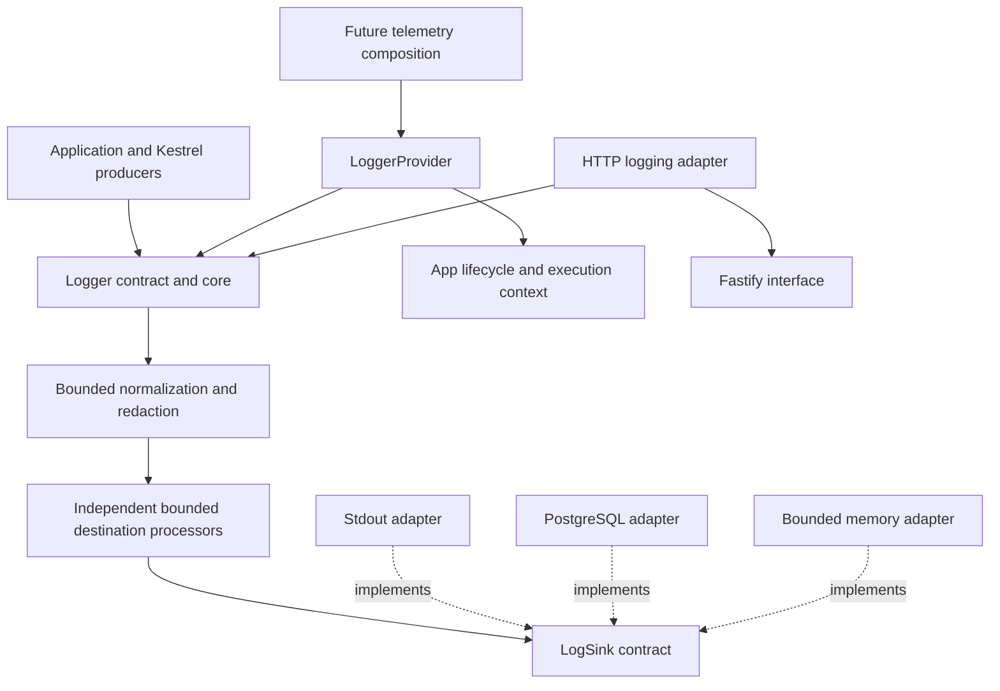
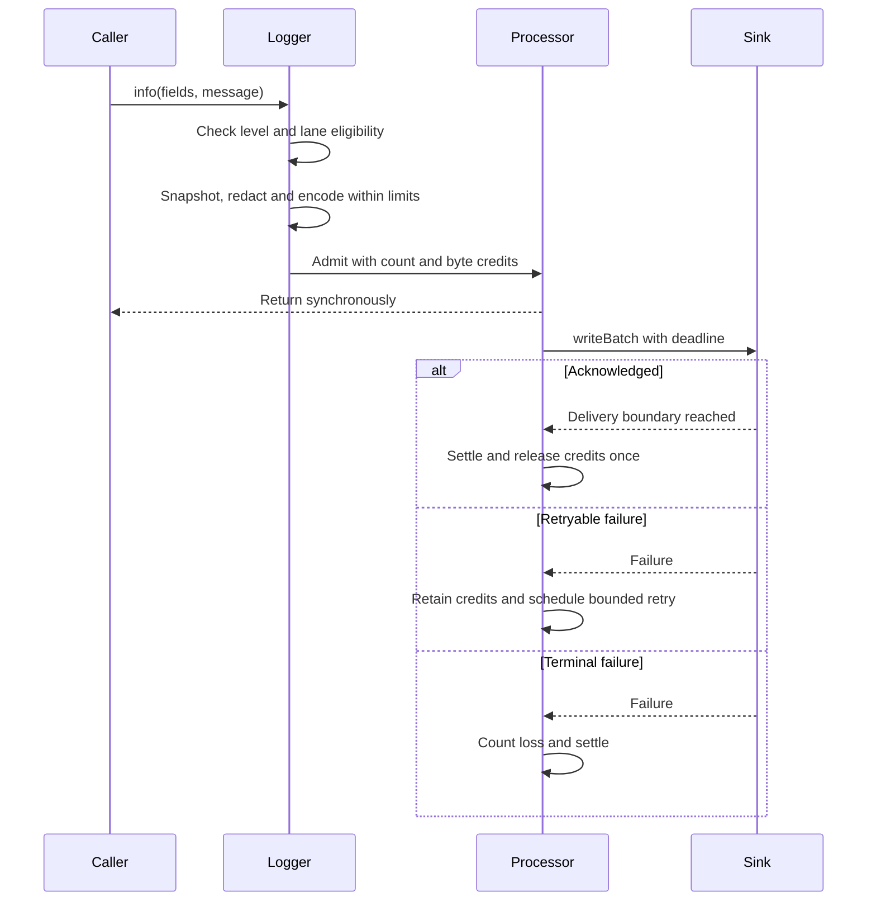
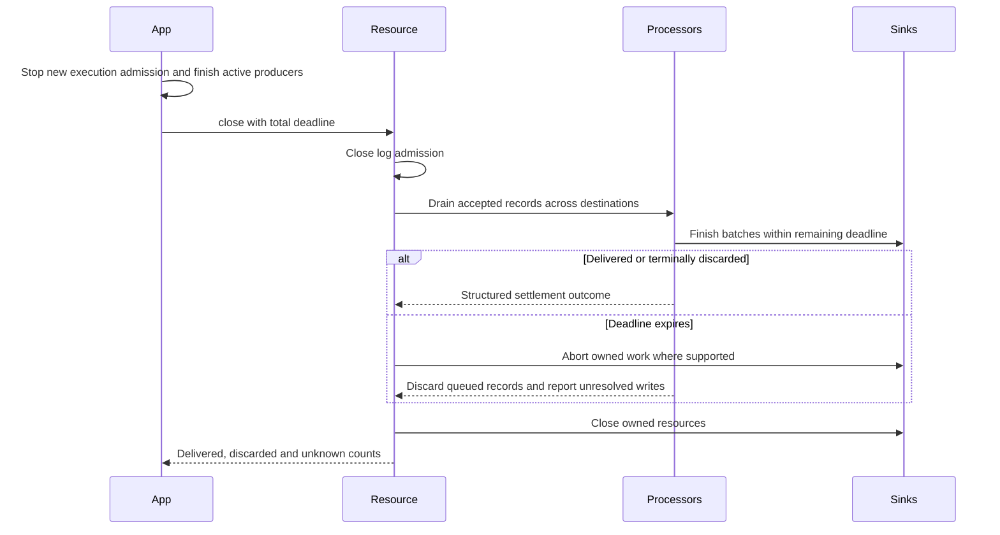

# Native Kestrel logging implementation plan

[Documentation](../README.md) · [Implementation index](./README.md)

> Proposed implementation plan. The current logger still uses Pino; see the [logging usage guide](../usage/logging.md).

Status: proposed implementation plan, 2026-09-18. No runtime changes are implemented by this document.

## Objective and repository baseline

Replace the Pino-owned logging API and engine with a small Kestrel library that owns structured records, execution integration, bounded delivery, lifecycle and health. Performance and bounded resource usage are acceptance criteria for the replacement, not follow-up optimizations.

The inspected checkout contains `src/packages/kestrel/src/log`, `src/packages/kestrel/src/observability` and development storage in `dev.log`. It does not contain `src/packages/kestrel/src/telemetry`. Some implementation status statements in [the monitoring design](./monitoring.md) describe a different repository state. This plan starts from the actual checkout and treats telemetry consolidation as a separate integration target. Its native logging decision supersedes the target design's intention to retain Pino as the public logging API; historical Pino measurements remain relevant.

Existing behavior to preserve includes scoped execution identifiers, workload metadata, dynamic and completion context projection, child bindings, application startup reporting, configurable execution-log presentation, local PostgreSQL storage, Studio correlation and JSON stdout. The application's existing missing-development-table fallback must remain an explicit application policy, never an environment check inside Kestrel.

## Scope and decisions

- Own the logger contract and implementation. Use Pino only as a temporary migration backend and performance reference.
- Keep the initial library at `src/packages/kestrel/src/log`. Future telemetry composition consumes this library or moves it with its tests in a separate structural change; do not create competing logging pipelines or entrypoints.
- Provide standalone use and a Kestrel provider. Inject context into the core rather than importing `App`, HTTP, database infrastructure or observations there.
- Use synchronous producer methods returning `void`, with no destination I/O and no Promise per log call. Delivery is asynchronous and lossy under an explicitly documented saturation policy.
- Bound outstanding delivery by both record count and encoded bytes, including active batches, retries and worker handoff. Bound normalization work and individual record size as well.
- Ship stdout JSON, PostgreSQL and bounded in-memory test adapters. Keep a no-op logger for disabled composition. Every adapter owns its implementation, exports, tests and support files in one directory.
- Keep logs and typed observations separate. Do not convert logs into observations or make the observation library depend on a logging provider.
- Exclude durable disk spooling, exactly-once delivery, arbitrary Pino compatibility, custom log levels, automatic process termination on `fatal`, OTLP implementation and browser logging from the first release.

## Model and dependency directions



Proposed layout:

```text
src/packages/kestrel/src/log/
  contracts.ts               # Logger, record, context and sink contracts
  logger.ts                  # Producer fast path and concrete child loggers
  normalization.ts           # Bounded snapshot, error handling and redaction
  delivery/
    buffer.ts                # Fixed-capacity rings and byte accounting
    processor.ts             # Batches, retries and settlement
    resource.ts              # Startup, flush and close
    health.ts                # Fixed-cardinality counters and snapshots
    worker/                  # Optional bounded handoff, only if measurements justify it
  adapters/
    stdout/
    postgres/                # Writer, schema, reader and adapter support
    memory/
    pino/                    # Temporary backend, removed at migration completion
  integration/
    execution_context.ts     # Kestrel context projection
  configuration.ts
  dependencies.ts
  provider.ts
  index.ts
src/packages/kestrel/src/http/adapters/logging/
  index.ts                   # Fastify compatibility belongs to the HTTP boundary
```

Tests live beside their implementation, including within each adapter directory. Move existing PostgreSQL reader tests with the reader. Preserve public exports while reorganizing internals. Reuse a lower-level concurrency primitive only if it satisfies logging's ownership and allocation requirements; do not import the observation recorder into logging. The current `BatchBuffer` does not itself enforce total outstanding byte capacity, so wrapping it is not automatically sufficient.

## Public API and composition

| Export | Intended behavior |
| --- | --- |
| `Logger` | `trace`, `debug`, `info`, `warn`, `error`, `fatal`, `child` and `isLevelEnabled`. Fixed levels with documented ordering. |
| Level methods | Support `logger.info(message)` and `logger.info(fields, message)`. Preserve common `{ err: error }` usage through native error normalization. Migrate other overloads explicitly after auditing callers. No printf formatting in the native contract. |
| `child(bindings)` | Creates a lightweight logger with an immutable, bounded binding snapshot and the same resource reference. Merge and normalize bindings at child creation, not by walking an ever-growing parent chain per record. |
| `LogRecord` | Versioned envelope with timestamp, level, message, normalized error, attributes, correlation and stable emission identity. Resource identity and process-local sequence distinguish order from wall-clock time. |
| `LogContextSource` | Supplies optional correlation and bounded diagnostic fields. Standalone use has no context source. Kestrel integration captures the current execution snapshot at emission time. |
| `LogSink` | Batch delivery contract with explicit acknowledgement, timeout, cancellation and ownership semantics. |
| `createLogger` | Creates a resource and root logger from explicit options and injected destinations; no environment inspection. |
| `LoggerResource` | Owns `start`, `flush`, idempotent `close` and `getHealth`. Lifecycle operations return structured delivery outcomes. |
| `LoggerProvider` | Registers the stable root logger and execution-scoped loggers, selects destinations at bootstrap and participates in ordered disposal. |

Use a fixed-shape logger with explicit methods and a shared mutable resource reference instead of stacked `Proxy` objects. Children created before bootstrap must follow the same activated resource. Calls before activation remain silent, matching current behavior, and increment a scalar skipped counter; there is no implicit startup buffer. Bootstrap failures are surfaced by `start`. After close, log calls are harmless and counted as rejected-after-close.

The recommended Kestrel path remains dependency injection through `loggerDependency` and `applicationLoggerDependency`. Standalone callers own the resource lifecycle directly. Application configuration selects destinations, levels, capacities, redaction and failure policy; the provider supplies execution integration. Neither mode requires global singleton state or global asynchronous context installation.

Keep envelope keys protected from caller attributes. Define precedence explicitly: resource-owned envelope and correlation cannot be overwritten by fields, call attributes override child attributes, and execution diagnostics remain in a separate namespace. Preserve the current distinction between disabling execution-context presentation and suppressing explicit application logs. Only completion summaries and dynamic context projection follow the execution-log policy.

## Producer path and serialization

1. Check lifecycle, severity threshold and destination eligibility before accessing context or allocating a record. When every eligible destination is full, count rejection without normalizing fields.
2. Read the execution context only for an eligible call. Snapshot it before handing work to asynchronous delivery so later mutation cannot change an emitted record.
3. Build a bounded, redacted representation with deterministic handling of errors, cause chains, aggregate errors, dates, bigint, unsupported values, circular references and truncation. Do not invoke arbitrary getters or `toJSON` methods.
4. Encode one canonical UTF-8 representation using a capped encoder. Account for escaping and Unicode bytes. Do not first stringify an unrestricted object or allocate an unrestricted string and only then truncate it.
5. Admit independently to destinations whose count and byte budgets permit the completed record. Schedule delivery once per destination, not once per message.

Limit depth, visited properties, array elements, key length, strings, stack length, cause depth and total encoded size. Redact before encoding and before every destination receives data. On exhausted limits, emit a valid bounded record with truncation metadata; if the minimum envelope cannot fit, reject the record with a named reason. Configuration must guarantee room for that minimum envelope.

The contract accepts bounded plain diagnostic data and errors, not arbitrary live request objects. HTTP serializers extract allowed request/response fields first. Reflection on arbitrary JavaScript objects can invoke Proxy traps, and bulk key enumeration can allocate in proportion to input width: phase 2 must document this limit, avoid bulk enumeration on the supported fast path, and reject unsupported object shapes where feasible. Do not claim a hard wall-time guarantee for executing user-defined context callbacks, Proxy traps or lazy error-stack generation. Catch failures and use a bounded fallback record without recursively logging the failure.

Prefer one encoded retained payload plus compact metadata over retaining both the complete object graph and its serialized form. Adapters may perform bounded batch conversions; temporary decoding, database parameters and stream chunks need their own explicit workspace budget. The exact representation is selected by phase 0/2 measurements, with these ownership invariants unchanged.

## Bounded delivery and saturation

### Capacity accounting

For each destination, count every admitted record until it is acknowledged or terminally discarded:

`outstanding = queued + inFlight + retryWaiting`

Worker-owned records remain in that same accounting domain. Moving data between these states never releases admission credits. Settlement releases credits exactly once; late or duplicate acknowledgement must not release them again.

Use fixed-capacity ring buffers with constant-time enqueue/dequeue; avoid `Array.shift`, queue-wide scans, sorting, per-record deferred Promises and an accumulating chain of pending batch closures. Maintain bounded waiter state for lifecycle calls too: coalesce overlapping flush operations and share close completion rather than retain an unbounded list of waiters.

Enforce both `maxPendingRecords` and `maxPendingBytes`, and validate an aggregate resource budget against the sum of configured destination budgets. Conservatively charge each destination for the full payload even when immutable bytes are shared. Bound the number of destinations through configuration. No destination can consume another destination's reserved credits.

Encoded bytes are a deterministic payload bound, not an exact V8 heap or RSS bound. The complete resource budget includes ring slots, record metadata, one normalization workspace, active batch workspaces, stream/driver copies and any worker heap baseline. Record-count and structural limits bound associated metadata. Measure retained heap, external memory and RSS separately and document the measured overhead envelope; do not describe an 8 MiB payload budget as an 8 MiB process-memory guarantee.

### Initial saturation policy

Use two fixed lanes per destination: ordinary (`trace` through `warn`) and critical (`error`, `fatal`). Reserve count and byte capacity exclusively for critical records. The initial implementation does not borrow between lanes or evict accepted messages. This sacrifices some utilization for simple, predictable admission and accounting.

When a lane lacks record or byte capacity, drop the incoming record for that destination and increment counters by level and reason. A full ordinary lane cannot consume the critical reserve. Critical records can still be dropped if their own lane is full; `fatal` does not promise durability or synchronously terminate the process.

Drain by comparing the sequence at the two lane heads, preserving accepted emission order within each destination. The reserve protects admission, not immediate priority delivery. A batch held for retry retains its place in that destination's order. Destinations are independent, so cross-destination completion order is unspecified.

### Candidate defaults to benchmark

These values are starting points, not validated capacity claims. All are application-configurable and must pass relational validation.

| Setting | Initial candidate |
| --- | --- |
| Pending records per destination | 4,096 total: 3,584 ordinary and 512 critical |
| Pending encoded bytes per destination | 8 MiB total: 7 MiB ordinary and 1 MiB critical |
| Maximum encoded record | 16 KiB |
| Maximum batch | 128 records and 256 KiB, whichever is reached first |
| Delivery wakeup | Batch threshold or 100 ms since the oldest queued record, when the sink is available |
| Concurrent batches per destination | 1 |
| Retry policy | Up to 3 total attempts with capped exponential backoff and injected jitter |
| Write deadline | 2 seconds per attempt, subject to effective adapter cancellation |
| Flush / close deadline | 5 seconds total per operation, not multiplied by destinations or retries |

At 1 KiB per ordinary record, the 3,584-record lane holds roughly 0.36 seconds of a 10,000-record/second burst if delivery stops. Larger records hit the byte cap sooner. The buffer absorbs finite bursts; it cannot compensate for a permanently slower destination. Size deployment budgets using measured ingress, sustainable delivery rate and tolerated outage duration.

### Scheduling and failure isolation

Wake a destination on batch thresholds, maximum queue age, explicit flush or retry readiness. Keep at most one scheduled wakeup and one active attempt per destination. Drain only a configured amount of work per event-loop turn and yield before continuing, including when an adapter resolves immediately. Idle automatic timers must not keep CLI processes alive; explicit flush/close must retain the resources needed until completion or deadline.

Retries retain the same batch and credits; never copy failed records into an extra retry queue. Classify retryable and terminal failures, stop on exhausted attempts or maximum delivery age, and count terminal loss. A slow sink must neither serialize other sinks' progress nor throw into an application log call. Use a capped cooldown after repeated failures rather than issuing a tight sequence of failed writes.

Runtime failure policy is explicit: best-effort degrades health and reports loss; fail-fast reports failure through owned lifecycle/control boundaries. It must not use an unhandled rejection or a microtask throw from a producer call. Required destination startup failure fails bootstrap. No destination silently redirects to stdout. Diagnostic callbacks are optional, guarded, rate-limited and protected against reentrancy; health does not report through its own logger.

## Adapter contract and delivery guarantees

`LogSink.writeBatch(batch, { signal, deadline })` acknowledges only when the adapter's stated delivery boundary is reached. A sink must not acknowledge after merely placing data in a hidden unbounded queue. It must release batch references on settlement, expose fixed capabilities and state how it stops timed-out operations. Sink start and close are idempotent resource operations. The processor owns retries and admission; adapters must not add independent unbounded retries.

| Adapter | Acknowledgement and ownership |
| --- | --- |
| Stdout | Write completion means acceptance by the Node stream, not persistence by the platform collector. Respect `write() === false` and wait for `drain`; never close process stdout. Allow only bounded outstanding chunks and retain accounting through callbacks. A broken pipe degrades this destination without fallback recursion. |
| PostgreSQL | Acknowledgement follows successful completion of the batch insert. Use a bounded pool, parameterized batch SQL, query deadlines and an explicit ownership option for injected versus owned pools. Never end an injected application pool. Retention work is bounded and separate from the producer path. |
| Memory | Fixed-capacity deterministic capture for tests, with explicit overflow and injectable clock/scheduler. It must not hide unbounded accumulation. |

Node stream `highWaterMark` is a backpressure threshold rather than a strict memory limit, so the processor must maintain its own capacity accounting. See the [Node stream buffering contract](https://nodejs.org/download/release/v25.9.0/docs/api/stream.html#buffering).

A timeout implemented only with `Promise.race` does not cancel an underlying write. Do not release credits and start unlimited replacements while timed-out operations remain live. Each adapter must implement cancellation/destruction where it owns the resource, or stop further dispatch and retain the outstanding operation within its cap. Non-cancellable borrowed resources have an explicit degraded/unknown outcome; close can meet its reporting deadline without pretending that external work was cancelled.

Delivery is best-effort, with retry duplicates possible after ambiguous outcomes. Give each record a stable emission identity reused across retries. Initially preserve `dev.log` and its reader contract; do not claim idempotency from its generated database row id. Retry-safe PostgreSQL storage requires a separate schema change and uniqueness constraint on emission identity. Keep the existing numeric severity mapping and Studio envelope compatibility during cutover. New schema names must be singular and schema exports must remain aligned with Drizzle push filters.

## Worker decision

Implement and measure an in-process prototype first, then compare it with bounded worker delivery and the existing Pino worker under equivalent payload, redaction and durability conditions. PostgreSQL I/O alone is not a reason to add a worker; serialization CPU, main-loop latency, stdout behavior, isolation and worker baseline memory all affect the decision. Node documents the CPU/I/O distinction and the clone/transfer model in its [worker thread reference](https://nodejs.org/docs/latest-v24.x/api/worker_threads.html).

If selected, worker delivery uses a small number of batch messages with credits covering the message port, worker queue, active writes and retries together. Sending a message is not settlement. Require versioned batch/ack messages, worker startup readiness, duplicate/late acknowledgement handling, explicit crash settlement and bounded restart policy. Account for copies during transfer and avoid transferring pooled buffers with unrelated backing memory. Bound health/control messages too.

Core APIs and sink semantics stay the same in either execution mode. Worker delivery is optional implementation work, gated by the benchmark decision, not a second independent queue architecture.

## Lifecycle and significant scenarios





`flush` captures an admission watermark per destination and waits only for records accepted up to that watermark. New logs must not extend the wait indefinitely. Results distinguish successful delivery, explicit loss and unresolved outcomes. Concurrent calls share bounded flush state; an earlier flush cannot be extended by a later caller. Deadline expiration does not falsely acknowledge an in-flight write.

`close` rejects new records, drains within one total deadline, cancels owned work where possible and clears timers/listeners. Repeated close calls share completion. Dispose the logging resource after execution producers but before any borrowed database resource it needs. A process crash or forced termination may lose pending logs; this is not an audit journal.

Health exposes pending records and encoded bytes, in-flight records, oldest pending age, lane utilization, delivery counts, retries, loss by fixed reason/level, consecutive failures and lifecycle state. Keep unknown delivery outcomes distinct from confirmed loss. Never label counters by arbitrary message, execution identifier or error text. A health snapshot must not scan the whole queue.

## Implementation phases and acceptance gates

### Phase 0: baseline and performance protocol

- [ ] Inventory Pino calls, overloads, serializers, direct type imports, Fastify child options, lifecycle dependencies and Studio payload assumptions.
- [ ] Add reproducible benchmark scripts under `src/packages/kestrel/src/log/benchmarks`, with injected sinks and no running application server. Keep benchmark results separate from unit-test pass/fail timing.
- [ ] Measure current direct Pino and current Kestrel-wrapped Pino to distinguish engine cost from integration cost. Include stdout and the existing PostgreSQL transport in dedicated capacity runs.
- [ ] Compare disabled logging, plain messages, 1 KiB structured records, bounded errors, nested child loggers, dynamic execution context, oversized input, sustained saturation, slow sinks, stalled writes and independent destinations.
- [ ] Record Node 24 version, CPU, OS, source/build mode, payload distribution, warmup, offered rate, accepted/delivered rate, drops, producer p50/p95/p99 latency, CPU, allocation rate, heap/external memory/RSS, event-loop delay and shutdown duration. Measure worker memory separately when used.
- [ ] Select representative target loads and freeze performance gates before accepting the native engine. Initial comparison gate: native producer p99 and CPU per accepted record no more than 10% above the existing scoped path for representative non-saturated workloads; disabled logging should be no slower beyond measurement noise. Adjust only through an explicit documented tradeoff.

Exit: a baseline artifact, repeatable commands, hardware-specific absolute budgets and a documented worker comparison protocol. No fabricated throughput target. Use at least five repeated runs with warmup and report spread; compare equal delivered work and equal loss policies. Node's [performance hooks](https://nodejs.org/docs/latest-v24.x/api/perf_hooks.html) provide event-loop delay and utilization measurements.

### Phase 1: introduce the native contracts and migrate consumers

- [ ] Add documented contracts, fixed levels, resource lifecycle and context-source boundaries.
- [ ] Place the temporary Pino implementation inside its adapter directory and keep the existing runtime behavior during contract migration. Mark native bounded-delivery guarantees as not yet available on this transitional backend.
- [ ] Replace direct Pino type dependencies in Kestrel producers and application consumers with focused Kestrel contracts; inventory and migrate unsupported calls deliberately.
- [ ] Introduce the HTTP compatibility adapter and move its tests with it. Verify `info`, `error`, `debug`, `fatal`, `warn`, `trace`, `silent`, `level`, `child` and the child options actually used by the installed Fastify version. Implement serializers and error conversion explicitly instead of relying on Pino internals. See [Fastify custom logger requirements](https://fastify.dev/docs/latest/Reference/Logging/#using-custom-loggers).
- [ ] Keep dependency direction from HTTP to logging. Exercise HTTP behavior through `fastify.inject()` and ensure disabled HTTP logging does not construct an unnecessary Pino backend in the final mode.

Exit: application and Kestrel consumers no longer expose Pino types, current tests pass, and the remaining Pino coupling is localized. This phase is independently reviewable and reversible.

### Phase 2: native producer and bounded records

- [ ] Implement concrete root/child loggers, early eligibility checks, protected envelope and bounded immutable binding snapshots.
- [ ] Implement normalization, redaction, capped encoding and error handling with injected context and clocks.
- [ ] Test input mutation after emission, nested/circular values, Unicode and JSON escaping, truncation, large error causes, throwing accessors and unsupported object handling.
- [ ] Verify that filtered calls do not resolve context, read fields or serialize, and that no raw sensitive data reaches any sink.
- [ ] Benchmark allocation and producer latency against phase 0, including dynamic context and child creation.

Exit: deterministic emission snapshots, explicit input limitations, byte-accurate record caps and validated fast-path performance.

### Phase 3: bounded processor, health and lifecycle

- [ ] Implement two-lane ring buffers, count/byte admission, aggregate budgets and exactly-once settlement accounting.
- [ ] Implement count/byte batch thresholds, bounded scheduling, total delivery age, retries, cooldown, per-destination isolation and guarded health reporting.
- [ ] Implement watermark flush, shared close, timeouts, cancellation behavior and disposal ordering.
- [ ] Use injected clocks/schedulers and controllable sink promises to test full queues, both lane limits, byte limits before count limits, retries, hung writes, late acknowledgements, ongoing production during flush and close races.
- [ ] Run randomized operation sequences to assert that credits are never negative or exceeded and that every admitted record remains outstanding or has exactly one terminal classification.
- [ ] Saturate the resource for at least 60 seconds in a dedicated benchmark and verify bounded retained memory without accumulation of timers, promises or hidden batches. Validate that a failed destination does not affect another's credits or progress.

Exit: strict logical capacity bounds throughout the lifecycle, measured memory plateau, no producer exceptions from delivery failure, and deadlines with truthful unresolved outcomes.

### Phase 4: production adapters and execution-mode decision

- [ ] Implement stdout with bounded chunks, backpressure, callback/error handling and ownership-safe shutdown.
- [ ] Move and adapt the PostgreSQL writer, schema, reader and tests into their adapter directory; preserve `dev.log`, batch SQL, local retention and read APIs initially.
- [ ] Implement bounded memory capture and deterministic adapter conformance tests.
- [ ] Compare in-process and worker prototypes with the same bounded processor contract. Implement the worker protocol only if the measured tradeoff justifies it.
- [ ] Verify PostgreSQL semantics with an injected query client in unit tests. Run separate opt-in capacity benchmarks against a disposable database to measure real ingest, outage behavior and query interference without starting an application server.
- [ ] Document delivery ambiguity and defer retry deduplication unless the schema change is explicitly included in this phase's scope.

Exit: adapter conformance, measured throughput and shutdown behavior, explicit resource ownership, selected execution mode and no hidden capacity escape through streams, pool queues or message ports.

### Phase 5: Kestrel integration and native cutover

- [ ] Replace proxy-based execution wrappers with the native context-source integration, preserving scoped identifiers, child behavior, startup entries and dynamic/completion policies.
- [ ] Replace backend-specific configuration with destination and delivery options while providing an explicit migration for existing application configuration.
- [ ] Switch the application provider to the native engine. Keep destination selection and the missing-table fallback in application composition.
- [ ] Update Studio wording and payload readers while preserving level filters, request/execution correlation, chronological views and local log suppression. Classify internal viewer traffic at the HTTP integration boundary rather than hard-coding Studio URLs in the generic PostgreSQL sink.
- [ ] Test provider startup/close, application error handling, workers, scheduled tasks, workflows and HTTP injection. Test bootstrap child loggers and logging during shutdown.
- [ ] Keep the native sink contract ready for later telemetry resource composition; do not add a second fan-out path or couple this cutover to unfinished metrics/tracing work.

Exit: all existing logging scenarios run natively, selected local storage does not also emit stdout, and library-only tests remain inside Kestrel.

### Phase 6: performance gate, cleanup and documentation

- [ ] Repeat the benchmark matrix and capture a before/after report, including no-logging comparison, accepted versus dropped load, p99 application work latency, event-loop delay, memory plateau and close deadlines.
- [ ] Confirm no uncontrolled regressions against phase 0 gates; optimize or record a reviewed tradeoff before removing the transition backend.
- [ ] Remove the temporary Pino adapter and direct `pino` / `pino-abstract-transport` dependencies once unused. Pino may remain transitively installed through Fastify; the target is no Kestrel runtime/type dependency on it.
- [ ] Update logging, observability, HTTP, Studio, app and monitoring documentation. Clearly distinguish implemented behavior from the future telemetry target and preserve historical migration/benchmark records.
- [ ] Run targeted `npm run test:ai -- <relevant test paths>`, then `npm run typecheck`, the full `npm run test:ai`, `npm run build:ai` and `git diff --check`. Do not start an application server. Test compiled worker asset resolution if worker delivery is selected.

Exit: a documented native library with performance evidence, complete migration and no duplicate pipeline. Tests remain compatible with `--no-isolate`, with explicit cleanup of timers, workers, listeners, streams and global state.

## Future evolutions

- Integration with a unified telemetry resource and independent OTLP delivery, reusing the same log record and bounded processor contracts.
- Retry-safe PostgreSQL writes using a stable emission identity and an explicit uniqueness migration.
- Optional lane borrowing, severity-aware eviction or priority delivery, only with a demonstrated need and updated ordering guarantees.
- Bounded lazy-field APIs if measurements show that application-side construction of disabled log attributes is significant; `isLevelEnabled` is sufficient initially.
- Shared-memory or transferable batch optimization if profiling proves message transfer to be the bottleneck.
- Sampling and rate limits as admission policies, with distinct loss accounting from saturation.
- Durable audit logging as a separate contract with persistence guarantees, rather than an implicit promise added to this best-effort logger.
- Browser-specific producers and adapters through a separately defined portable subset.
