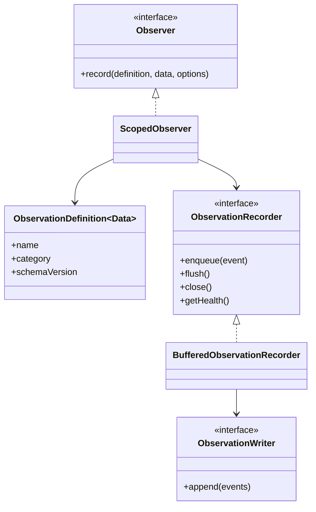
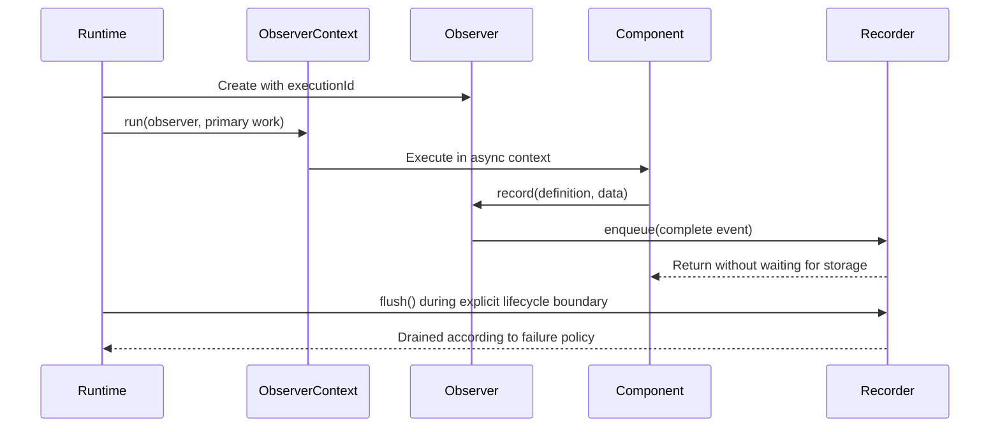
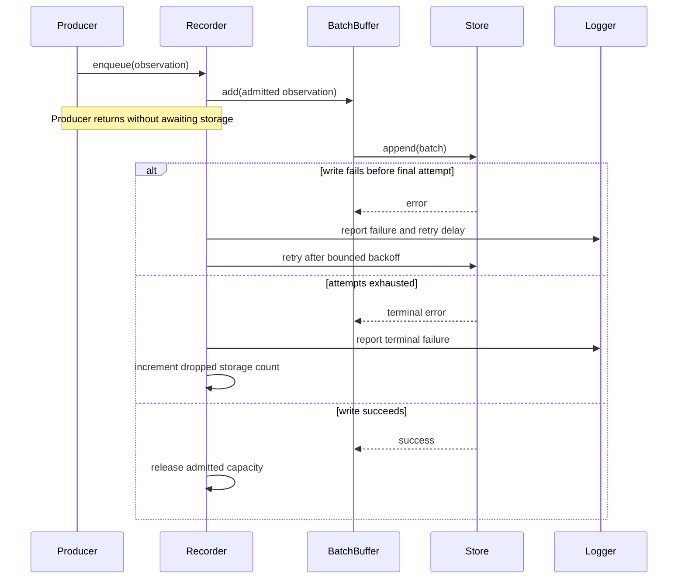

# Observability

[Documentation](../README.md) · [Implementation index](./README.md) · [Usage guide](../usage/observability.md)

Kestrel captures local observations so Studio can explain what happened during one request, command or direct action execution. Observations are typed, append-only development events grouped by the existing application `executionId`. They are not an application event bus and cannot be subscribed to by business code.

Logs and observations remain separate concepts and use separate PostgreSQL tables. A Kestrel observation may also be logged when that is useful to a developer, but ordinary Pino logs are never converted into observations automatically.

## Concepts and model

An `ObservationDefinition` gives one technical fact a stable name, category, schema version and payload type. A scoped `Observer` adds execution identity and envelope metadata, then submits an `ObservationEvent` to an application-owned `ObservationRecorder`. A recorder owns buffering and lifecycle; an `ObservationWriter` is the minimal persistence boundary used by the buffered implementation.



## Usage guide

For application setup and task-oriented examples, see the [Observability usage guide](../usage/observability.md).

## Design and implementation

The execution-scoped observer creates the immutable event envelope, while one singleton recorder controls capacity, retries, failure policy and shutdown. `AsyncLocalObserverContext` connects singleton instrumentation to the current execution without making those resources scoped. Storage writes run in an explicitly empty observer context to prevent recursive database observations.

The design keeps production policy replaceable: no-op, buffered and delegating recorders implement the same lifecycle contract. Persistence and Studio querying remain separate read/write concerns; `PostgresObservationStore` currently supplies both for development storage.

## Execution scenarios

The buffered recording sequence is detailed below. At the Kestrel boundary, one execution follows this higher-level flow:



## Public API

| API group | Main exports |
| --- | --- |
| Definitions | `defineObservation()` and observation definition, data and value types |
| Producer API | `Observer`, `ScopedObserver`, `RecordObservationOptions`, `observerDependency` |
| Async propagation | `ObserverContext`, `AsyncLocalObserverContext`, `observerContextDependency` |
| Recording lifecycle | `ObservationRecorder`, `BufferedObservationRecorder`, `NoopObservationRecorder`, `DelegatingObservationRecorder`, recorder health, overflow and failure-policy types |
| Kestrel composition | `ObservationProvider`, `observationConfigBase`, `observationRecorderDependency` |
| Development persistence | `ObservationWriter`, `PostgresObservationStore`, development source/page types and the `observations` Drizzle declaration |

## Adapter API

Custom observation persistence implements `ObservationWriter.append(events)`. The writer receives an immutable batch of complete events and must resolve only after that batch is durably accepted according to its own storage contract. It must reject on failure so `BufferedObservationRecorder` can apply its configured retry and terminal-failure policy. It must not mutate events, call producer APIs recursively or silently drop part of a batch.

A complete custom recorder instead implements `enqueue()`, `flush()`, `close()` and `getHealth()`. `enqueue()` is synchronous and cannot surface asynchronous storage failure to the producer. `flush()` drains all work admitted before and during that boundary according to the recorder's failure policy. `close()` is idempotent, permanently stops admission and releases owned resources. `getHealth()` must be synchronous and safe after closure.

## Observation contracts

`defineObservation()` declares a stable name, category, schema version and compile-time JSON payload. Producers pass the definition to the execution-scoped `Observer` instead of repeating string event names:

```ts
interface CacheAccessObservationData extends ObservationData {
  operation: "get" | "set";
  result?: "hit" | "miss";
}

const cacheAccessObservation =
  defineObservation<CacheAccessObservationData>({
    name: "cache.access",
    category: "cache",
  });

observer.record(
  cacheAccessObservation,
  { operation: "get", result: "hit" },
  { durationMs: 2, outcome: "success" },
);
```

`Observer.record()` returns immediately and automatically adds an event UUID, the current `executionId` and the occurrence time. Common optional fields promote outcome and duration for generic Studio rendering, while definition-specific data remains JSON. Producers own redaction and must not capture credentials, secrets or unrestricted request payloads.

The API deliberately has no listener or subscription mechanism. Observation capture cannot influence the operation being observed.

## Definition catalogs

Files that gather observation definitions are conventionally named `observations.ts` and live beside the Kestrel or application component that owns their meaning. For example, application execution lifecycle definitions live in `src/packages/kestrel/src/app/observations.ts`, not in the generic observability library. A component imports `defineObservation()` from observability but keeps its event names and payload contracts within its own public boundary.

The generic definition only carries its payload as a type parameter. `name` and `category` are inferred as ordinary definition metadata, so producers write `defineObservation<Payload>({ name, category })` without repeating string literals in generic arguments.

## Execution lifecycle

HTTP controllers, CLI commands, scheduled tasks, worker invocations and actions invoked through `App.get()` emit `execution.started` before their work and `execution.completed` before disposing their scope. The start event records the transport and stable operation name. The completion event records the outcome, duration and transport-specific result such as an HTTP status code. Failed completions also retain a JSON-safe diagnostic containing the error name, message, optional stack and acyclic cause chain; this diagnostic is intentionally operational and must not include secrets in application-authored error messages. Individual worker jobs each own an execution, while one batch handler invocation owns one execution for its complete batch. A batch is marked as failed when any job result fails and retains its first failure diagnostic.

Scheduled-task definitions may set `observe: false` to omit this lifecycle and ambient instrumentation for their invocations. The built-in cache, lock and expired-run maintenance tasks use that policy by default; setting their definition option to `true` restores observations when global capture is enabled.

Every execution context starts with its `executionId` as a diagnostic for both observations and logs. Execution code may add JSON-compatible values with `executionContext.setDiagnostic()` or `appendDiagnostic()`; both destinations receive them by default, while `{ destinations: [executionContextObservationDestination] }` restricts them to observations. Values are validated, copied, deeply frozen and bounded when contributed. Every transport projects observation diagnostics under the optional `context` field of its final `execution.completed` observation. Standard fields already carried by the observation envelope, including `executionId`, `operation` and `transport`, are removed from this nested projection, which is omitted when empty. The namespace keeps other lifecycle fields such as `statusCode` protected from contributed-key collisions, and log-only diagnostics do not enter observation storage.

Studio controllers disable this instrumentation when they are registered, preventing the observation explorer from recursively recording its own API requests.

## Singleton instrumentation

Kestrel resources such as cache pools and lock managers are application singletons, while an `Observer` belongs to one execution scope. `AsyncLocalObserverContext` propagates the current observer through the asynchronous call tree created by direct, HTTP, CLI and worker execution boundaries. Storage-neutral instrumentation sinks consult this context synchronously and forward events only when an observer is active.

The context is explicitly entered with no observer for an unobserved transport boundary, including Studio controllers. This prevents an outer asynchronous context from accidentally attributing internal Studio work to another execution. Concurrent executions remain isolated by `AsyncLocalStorage`.

Cache instrumentation emits `cache.access`, `cache.load`, `cache.write` and `cache.invalidation`. Lock instrumentation emits `lock.acquisition`, `lock.extension` and `lock.release`. Database instrumentation emits `database.query` below Drizzle so raw, prepared and transactional PostgreSQL queries share the same coverage. Their typed definitions and payload semantics remain owned by their respective libraries.

Studio selects observation detail renderers by stable observation name and falls back to lossless pretty-printed JSON for unknown types. Failed observation rows open by default so their stored diagnostic or error code is immediately visible. The `database.query` renderer formats PostgreSQL for display, lists captured parameters separately, and links captured caller locations to VS Code. SQL formatting sits behind a small client-side interface so a future width-aware engine can replace the lightweight JavaScript implementation without changing observation components. Formatting never changes stored SQL, never interpolates parameters, and falls back to the original query on invalid or unsupported syntax.

## Recording and storage

`ObservationProvider` installs one application-owned recorder and asynchronous observer context after the database and logger providers, plus one scoped `Observer`. Tests, stage and production currently use a no-op recorder. The local application selects the explicit `drop-new` overload policy and `best-effort` storage-failure policy. These defaults are application configuration rather than environment checks inside Kestrel, so a future production recorder can select its policy deliberately.

`BufferedObservationRecorder` delegates size, age, sequential execution and drain boundaries to `BatchBuffer`. The default configuration admits at most 10,000 unsettled events, writes batches of 50 and gives an incomplete batch at most 100 milliseconds before it becomes ready. The admission count includes events in active writes and sequentially waiting batches, not only values still pending inside `BatchBuffer`. Once capacity is reached, `drop-new` retains the already admitted timeline and rejects newer observations without blocking their producer.

Storage writes use at most five attempts by default. Retry delays grow exponentially from 100 milliseconds and are capped at five seconds. A success resets the consecutive-failure state. Exhausting the attempts settles the in-memory batch and increments the storage-failure loss counter, preventing an unavailable observation backend from retaining memory indefinitely.

The named failure policy controls explicit lifecycle boundaries:

| Policy | Background recording | `flush()` and `close()` |
| --- | --- | --- |
| `best-effort` | Reports failures, retries, then records the loss without affecting application work. | Drains all admitted work and resolves after terminal losses have been accounted for. |
| `fail-fast` | Still cannot throw into the execution that called synchronous `enqueue()`. Terminal failures are retained by the recorder. | The next explicit boundary rejects with each retained terminal failure exactly once. |

Every failed storage attempt is reported through the application logger with its attempt, batch size, policy, terminal state and next delay when applicable. The default recorder no longer throws from a microtask. The first overflow in each continuous saturation episode is also logged; reporter failures are contained so diagnostic infrastructure cannot replace the configured outcome.

The recorder exposes a synchronous health snapshot with its current state, unsettled count, cumulative losses split between overflow and storage failure, consecutive storage failures and the current oldest pending age. `healthy` means there is no active storage failure and the buffer is below capacity; `degraded` identifies current storage failure or saturation; `closed` identifies terminal lifecycle state. The counters remain available after recovery or closure so future metrics and health facilities can publish exact totals without changing the recorder contract.



Observation batches are written inside an explicitly empty observer context so their own PostgreSQL insert cannot emit another `database.query` event and recursively refill the recorder. `App.dispose()` explicitly flushes remaining observations before asking the dependency container to close its resources because Awilix may dispose the recorder and shared database pool concurrently. This ordering is especially important for short CLI commands that usually exit before the periodic flush. Under `fail-fast`, that application flush owns a terminal failure; the later idempotent resource close does not report the same failure a second time.

Local observations live in the disposable `dev.observation` table. `ObservationProvider` lives in `src/packages/kestrel/src/observability`, receives the resolved activation and retention configuration, and owns the standard recorder, context and PostgreSQL store wiring. The application currently enables it locally with seven days of retention. Frequently queried envelope fields are stored as columns, while definition payloads remain JSONB. The table is synchronized by the development-only Drizzle push configuration and never enters application migrations. Its storage is independent from `dev.log`.

## Studio

The development observations extension exposes a paginated execution list and a chronological event timeline. The initial renderer is intentionally generic: it displays category, event name, duration and expandable JSON data. New event definitions therefore remain inspectable before a specialized renderer exists.

The same timeline component appears below requests sent from Studio's HTTP Controllers page. Studio generates a UUID before sending the request through the configured execution-id header, so the timeline can start loading while the controller is still running. Because the recorder persists asynchronously, the timeline continues polling during the request and for up to two seconds after the response until `execution.completed` appears, instead of forcing observation storage into the request's critical path.

Every execution also has a dedicated route at `/_studio/executions/<executionId>`. The list timeline exposes this route as a permalink, while other Kestrel contexts can construct its Studio-relative part with `getStudioObservationExecutionPath(executionId)` and qualify it through `joinStudioPath()` when the configured Studio base path is needed. The dynamic page remains in the client manifest so the router can resolve direct navigation and browser reloads, but `showInNavigation: false` keeps it out of the sidebar.

The extension reads through an explicit `DevObservationSource`. Its controllers list executions, load the complete timeline for one execution and clear all captured observations. Execution summaries are currently derived from lifecycle events; a dedicated execution table should only be introduced if observed query volume justifies it.

A future diagnostic policy may add configurable redaction, error fingerprints and transport-specific expected-error classification. The current completion diagnostic deliberately preserves the original failure and cause chain so local debugging is lossless, while application code remains responsible for avoiding secrets in error messages.

Future recorder evolutions deliberately kept out of this change include jittered retry delays, a half-open circuit breaker shared across batches, durable spillover storage and first-class metric or health endpoint publication. `getHealth()` is the stable bridge for the last item. A production deployment must still choose storage durability, capacity and failure policy according to the monitoring guarantee it needs; enabling capture alone does not make an in-memory queue durable across process termination.

## Explicit provider adapters

`ObservationProvider(config, adapter)` receives an `ObservationAdapterDefinition`. Its value exposes a writer and, optionally, a query source; capability `query` controls registration of `observationSource`. PostgreSQL retention belongs to `postgresObservationsConfigBase`. A writer-only backend need not support Studio browsing. Buffered writes drain before backend disposal.

See the [shared composition convention](../implementation/app.md#provider-adapter-convention) and [configuration recipes](../usage/configuration.md#additional-provider-composition).
