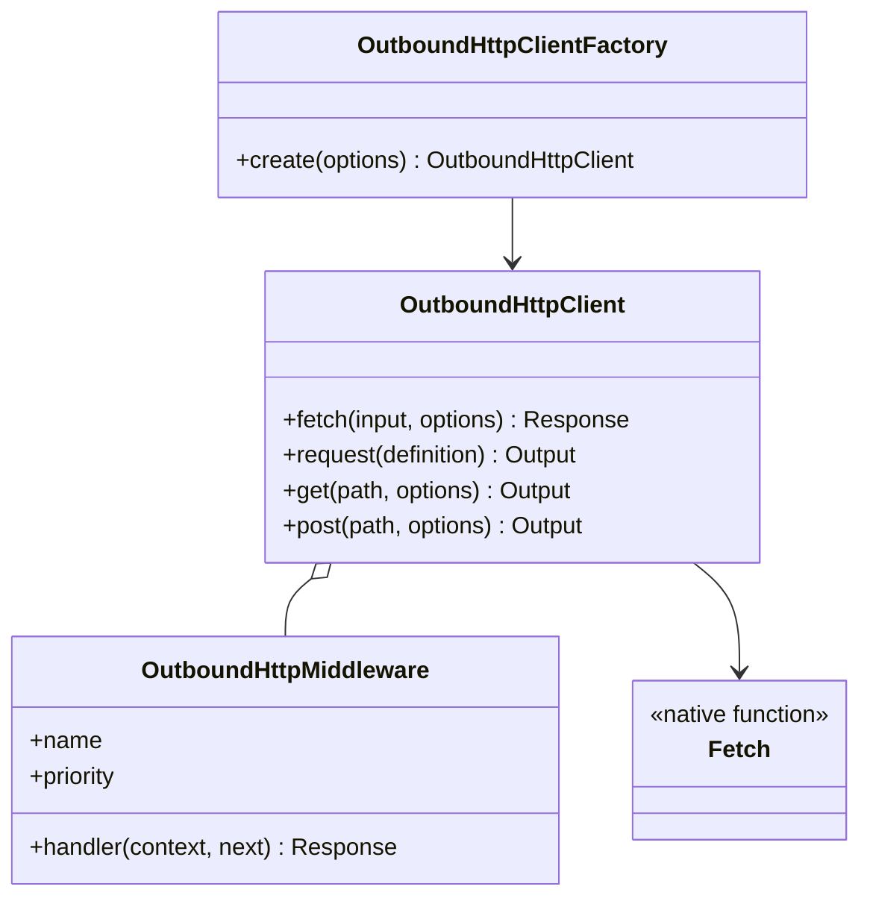
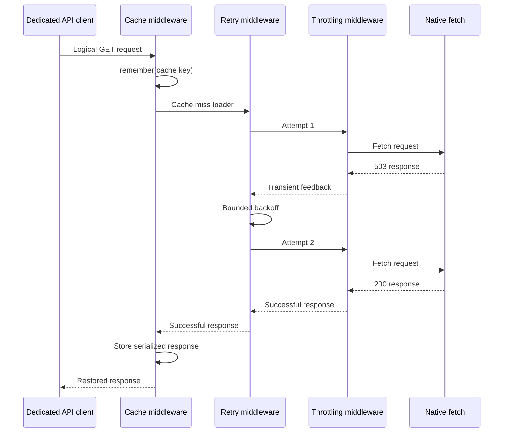

# Outbound HTTP

[Documentation](../README.md) · [Implementation index](./README.md) · [Usage guide](../usage/outbound_http.md)

The server-only outbound HTTP library in `src/packages/kestrel/src/outbound_http` creates dedicated clients for external APIs while centralizing retries, response caching, throttling, deadlines, validation and execution observations. It builds on the native Node.js `fetch`, `Request`, `Response`, `Headers` and `AbortSignal` contracts instead of introducing a replaceable transport adapter without a concrete second transport.

The inbound HTTP controller Kestrel and its generated browser-compatible clients remain in `src/packages/kestrel/src/http`. They have different dependency and runtime boundaries and do not depend on this server-only library.

## Concepts and model

`OutboundHttpClient` is the structured facade used inside dedicated API classes. Its `fetch()` method is the low-level native surface, while `request()`, `get()`, `post()`, `put()`, `patch()`, `delete()` and `head()` add base URL resolution, path and query mapping, JSON request bodies, response decoding and typed errors. `OutboundHttpProvider` registers a factory that automatically bridges instrumentation to the observer active for the current execution.

Middleware surrounds a logical request in ascending numeric priority. Calling `next()` repeatedly replays the complete downstream suffix. A retry middleware therefore creates multiple attempts, and every attempt reaches inner middleware such as throttling before native fetch.



## Usage guide

For application setup and task-oriented examples, see the [Outbound HTTP usage guide](../usage/outbound_http.md).

## Design and implementation

The client normalizes every invocation into a native `Request`. Shared headers are applied first, input request headers second and invocation headers last. Structured paths retain their template for observations while concrete parameters are encoded into the URL. Query values support scalars, dates and repeated array parameters.

The library does not inspect JavaScript stacks to infer operation names. For structured methods, an omitted operation becomes `<client>.<METHOD>.<route template>`, for example `weather.GET./forecast/:city`. A direct low-level `fetch()` has no reliable template and therefore defaults to `<client>.<METHOD>.request`; callers may provide explicit `route` and `operation` metadata. Concrete URL paths are never inferred into observations because they may contain identifiers. Explicit operation names remain available when a stable business identity is more useful.

Client middleware and request middleware are merged and stably sorted by ascending priority. Client definitions precede request definitions when priorities are equal. The exported conventional priorities are cache `100`, retry `200`, default `500` and throttling `800`. Custom middleware may use any finite number, so a priority below retry executes once per logical request while one above retry executes for every attempt.

The total `timeoutMs` deadline includes middleware, throttling waits, retry backoff and network attempts. Caller cancellation and deadline expiration remain distinct typed failures. Native request bodies are cloned by retry middleware from an untouched template; unsafe methods are not retried unless explicitly included in the middleware configuration.

## Execution scenarios

### Cached request with a transient first attempt



The retry boundary is outside throttling, so each actual dependency attempt acquires and completes its own permit. Cache is outside retry, so a hit performs neither admission nor network work.

### Automatic observations

The core emits one `http.client.attempt` event for every native fetch and one terminal `http.client.request` event for the logical request. Both include only the client, operation, method, stable route template, result, status when available, attempt identity and duration. URLs, path values, query values, headers and bodies are never observed.

The standard provider obtains the observer through asynchronous execution context. Calls outside an observed execution remain functional and produce no stored observation. Cache and throttling middleware reuse their existing Kestrel facades, so their own observations correlate with the same execution automatically.

## Public API

| Export | Purpose |
| --- | --- |
| `OutboundHttpClient` and `createOutboundHttpClient()` | Structured server-only client facade. |
| `createOutboundFetch()` | Low-level fetch-compatible callable using the same execution engine. |
| `OutboundHttpProvider` and `outboundHttpClientFactoryDependency` | Application composition with ambient observations. |
| `defineOutboundHttpMiddleware()` | Creates named middleware with a finite numeric priority. |
| `outboundHttpMiddlewarePriorities` | Conventional cache, retry, default and throttling positions. |
| `retryRequests()` | Bounded retries for configured methods, statuses and transport failures. |
| `cacheResponse()` and `cacheResponses()` | Fixed or dynamically selected read-through response caching. |
| `throttleRequests()` | Per-attempt admission and external feedback classification. |
| `json()`, `text()`, `bytes()` and `nativeResponse()` | Successful response decoders. |
| Typed outbound errors | Distinguish response, decode, timeout, cancellation and transport failures. |

`fetch()` returns non-successful responses unchanged, matching native fetch behavior. The structured convenience methods instead throw `OutboundHttpResponseError` after retaining a bounded decoded error body. Successful response decoder failures become `OutboundHttpDecodeError` with the original failure as their cause.

## Middleware contract

An outbound middleware receives immutable request metadata and a replayable continuation:

```ts
interface OutboundHttpMiddleware {
  readonly name: string;
  readonly priority: number;
  handler(
    context: OutboundHttpMiddlewareContext,
    next: OutboundHttpNext,
  ): Promise<Response>;
}
```

Every `next()` invocation starts a fresh traversal of the remaining middleware. It may replace the native `Request` and assign a one-based attempt number. Middleware is responsible for bounding repeated execution, respecting cancellation and ensuring that replaying downstream effects is safe.

Cache middleware uses `Cache.remember()` so the existing local and optional distributed single-flight behavior is preserved. Only successful responses are stored. Cached bodies are serialized as base64 and only explicitly retained response headers are stored, with `content-type` as the safe default. The final cache key is qualified with the outbound client name. Policies infer the supplied cache capability: ordinary `Cache` accepts TTL and lock options, while `tags` requires `TagAwareCache`. This applies to both fixed `cacheResponse()` options and dynamic `cacheResponses()` policies. Services using tagged policies must inject `tagAwareCacheDependency`; untyped unsupported policies fail before contacting the source.

Throttling middleware uses `Throttling.run()` for every attempt. HTTP 429 feedback is classified as throttled with a parsed `Retry-After` instant when possible. Timeouts, transport failures and selected transient response statuses feed existing circuit-breaker behavior without duplicating admission state.

## Potential evolutions

Potential future additions include conditional ETag requests, explicit `Cache-Control` policies, stale-while-revalidate, replayable streaming-body factories, per-attempt timeouts distinct from the total deadline, OAuth token refresh middleware, mTLS or proxy-specific transport support, metrics exporters and a dedicated Studio renderer. A public transport adapter should only be introduced when a concrete second implementation requires semantics that an injected fetch function cannot provide.

## Composition reference

### Kestrel-integrated usage

The recommended application composition registers `OutboundHttpProvider` after the observation provider. A dedicated API provider resolves `outboundHttpClientFactoryDependency` and registers its business client with the required cache or throttling dependencies.

```ts
app.container.registerFactory("weatherApi", ({
  cache,
  outboundHttpClientFactory,
}) => new WeatherApiClient(
  outboundHttpClientFactory.create({
    name: "weather",
    baseUrl: config.weatherApiUrl,
    middleware: [retryRequests()],
  }),
  cache,
));
```

```ts
export class WeatherApiClient {
  public constructor(
    private readonly http: OutboundHttpClient,
    private readonly cache: Cache,
  ) {}

  public async getForecast(city: string): Promise<Forecast> {
    return this.http.get("/forecast/:city", {
      path: { city },
      response: json(forecastSchema),
      middleware: [
        cacheResponse({
          cache: this.cache,
          key: `forecast:${city}`,
          ttlSeconds: 300,
        }),
      ],
    });
  }
}
```

The example's `cache` should be injected by the application provider rather than imported from application-global state. Authentication headers may be supplied through an asynchronous client-level header factory so rotating credentials are resolved immediately before each logical request.

### Standalone usage

Construct a client directly when automatic execution observations and dependency injection are not required:

```ts
const http = createOutboundHttpClient({
  name: "weather",
  baseUrl: "https://weather.example",
  middleware: [retryRequests()],
});

const forecast = await http.get("/forecast", {
  query: { city: "Paris" },
  response: json(forecastSchema),
});
```

`createOutboundFetch()` exposes only the low-level callable surface while retaining middleware, deadlines and instrumentation:

```ts
const outboundFetch = createOutboundFetch({
  name: "weather",
  middleware: [retryRequests()],
});

const response = await outboundFetch("https://weather.example/forecast");
```
