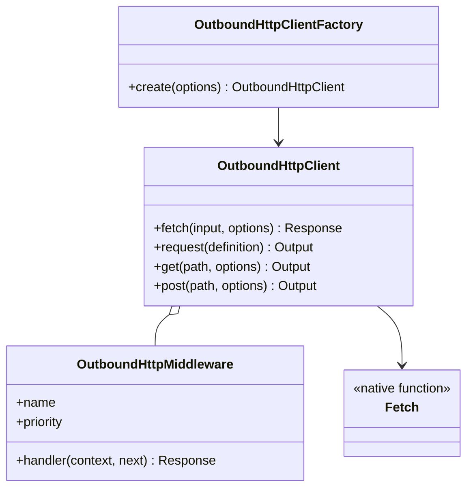
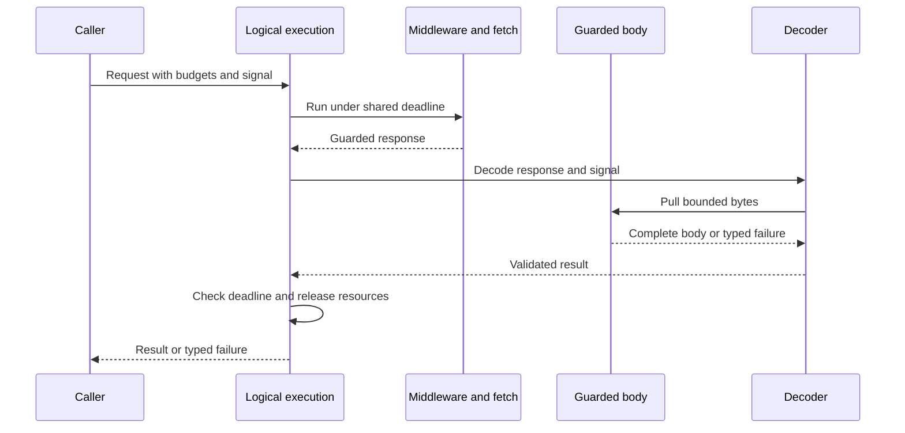
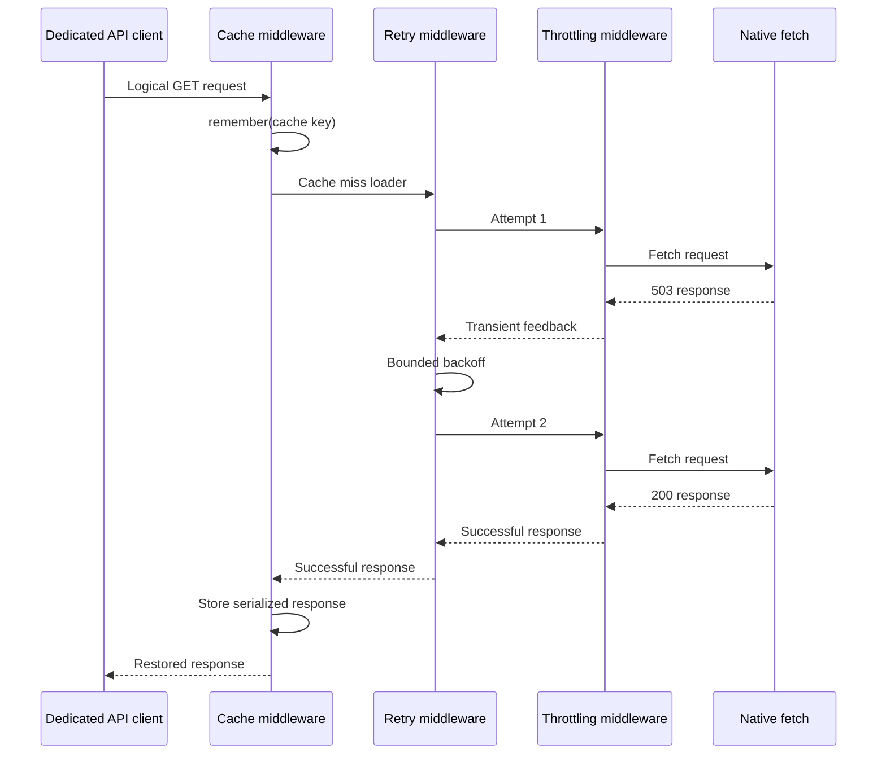

# Outbound HTTP

[Documentation](../README.md) · [Implementation index](./README.md) · [Usage guide](../usage/outbound_http.md)

The server-only outbound HTTP library in `src/packages/kestrel/src/outbound_http` creates dedicated clients for external APIs while centralizing retries, response caching, throttling, deadlines, validation and execution observations. It builds on the native Node.js `fetch`, `Request`, `Response`, `Headers` and `AbortSignal` contracts instead of introducing a replaceable transport adapter without a concrete second transport.

The inbound HTTP controller Kestrel and its generated browser-compatible clients remain in `src/packages/kestrel/src/http`. They have different dependency and runtime boundaries and do not depend on this server-only library.

## Concepts and model

`OutboundHttpClient` is the structured facade used inside dedicated API classes. Its `fetch()` method is the low-level native surface, while `request()`, `get()`, `post()`, `put()`, `patch()`, `delete()` and `head()` add base URL resolution, path and query mapping, JSON request bodies, response decoding and typed errors. `OutboundHttpProvider` registers a factory that applies shared budget defaults and bridges instrumentation to the observer active for the current execution. `outboundHttpConfigBase` owns the portable budget schema; applications supply deployment values and endpoint configuration.

Middleware surrounds a logical request in ascending numeric priority. Calling `next()` repeatedly replays the complete downstream suffix. A retry middleware therefore creates multiple attempts, and every attempt reaches inner middleware such as throttling before native fetch.



## Usage guide

For application setup and task-oriented examples, see the [Outbound HTTP usage guide](../usage/outbound_http.md).

## Design and implementation

The client normalizes every invocation into a native `Request`. Shared headers are applied first, input request headers second and invocation headers last. Structured paths retain their template for observations while concrete parameters are encoded into the URL. Query values support scalars, dates and repeated array parameters.

The library does not inspect JavaScript stacks to infer operation names. For structured methods, an omitted operation becomes `<client>.<METHOD>.<route template>`, for example `weather.GET./forecast/:city`. A direct low-level `fetch()` has no reliable template and therefore defaults to `<client>.<METHOD>.request`; callers may provide explicit `route` and `operation` metadata. Concrete URL paths are never inferred into observations because they may contain identifiers. Explicit operation names remain available when a stable business identity is more useful.

Client middleware and request middleware are merged and stably sorted by ascending priority. Client definitions precede request definitions when priorities are equal. The exported conventional priorities are cache `100`, retry `200`, default `500` and throttling `800`. Custom middleware may use any finite number, so a priority below retry executes once per logical request while one above retry executes for every attempt.

The total `timeoutMs` deadline includes asynchronous headers, middleware, cache waits, throttling waits, retry backoff, network attempts, success/error body reads and asynchronous decoding. Caller cancellation and deadline expiration remain distinct typed failures. Native request bodies are cloned by retry middleware from an untouched template; unsafe methods are not retried unless explicitly included in the middleware configuration.

## Deadlines and response ownership

`fetch()` and `request()` call the same internal execution engine. `OutboundHttpDeadline` owns one monotonic expiration and combines its controller with the caller signal. Each awaited stage races that boundary, including cancellation without a timeout. Checks before downstream dispatch and after completion prevent late work from succeeding or starting another attempt. Long timeout values are scheduled in bounded timer intervals to avoid Node timer overflow. Middleware request replacement combines signals rather than detaching downstream work from its caller.

`OutboundHttpBodies` installs a pull-driven stream guard on transport responses and on responses crossing middleware boundaries. It does not eagerly read or clone the body. This bounds standard decoders, custom decoders, middleware reads and synthetic responses before buffering. Reusing a guarded body preserves its guard and error-truncation metadata. Wrapped responses retain status, headers, URL, redirect and response-type metadata. Counters apply per response representation; retries have separate byte counters but share one deadline. This is not a process-wide memory quota or a total downloaded-byte quota across all attempts.

| Setting | Default | Contract |
| --- | --- | --- |
| `timeoutMs` | Unset | Positive finite milliseconds on client or call; the call overrides the client. |
| `maxResponseBytes` | 8 MiB | Positive safe integer; actual body bytes exposed by fetch, including cache hits. |
| `maxErrorBodyBytes` | 64 KiB | Positive safe integer; structured error diagnostics use the smaller byte limit. |

Success and low-level fetch bodies fail with `OutboundHttpResponseTooLargeError` when a chunk would exceed the budget. Structured HTTP errors retain only the permitted prefix and mark truncation. Neither `Content-Length` nor successful cache admission is considered proof of response size. A byte violation remains terminal even if a custom decoder catches the stream error. The wrapper cannot prevent allocation of a chunk already produced by an injected source or the transport; it prevents retention and further consumption beyond the configured budget. Decoded object graphs, concurrent calls and application-created clones have additional memory costs.

The request observation is emitted after decoding or failure, while attempt observations describe transport response acquisition. A decoding timeout therefore produces a failed terminal request observation even if headers arrived successfully. Streaming calls instead emit their request observation at handoff; later stream errors belong to the consumer.

On rejection, exhaustion or completed decoding, owned readers are released and unfinished bodies are canceled. Cancellation promises are observed but not awaited indefinitely. A response arriving after its request expired is also canceled. The deadline timer and its listener are removed in the execution finalizer. A streaming handoff retains the live stream pipeline and its signal listeners until exhaustion or cancellation; no logical deadline timer remains active after handoff.

Custom decoders receive `decode(response, { signal })`. They should propagate the signal to asynchronous work and settle when canceled. `lifetime: "stream"` explicitly transfers the response pipeline to their caller, and `nativeResponse()` declares this policy. A regular decoder must finish its body work before resolving: the engine cancels unread bodies at that point. Middleware owns discarded responses, any additional cloned branches and resources it creates. In particular, returning a transformed stream transfers the upstream pipeline along with it. All consumers must read or cancel retained streams.

Expiration bounds asynchronous waiting, not synchronous CPU work: parsing or application code that blocks the event loop cannot be interrupted in-process. A completion-time monotonic check rejects a result that finished after expiration, but cannot make it finish earlier. Non-cooperative asynchronous application code and cache storage operations may continue after the caller has failed. A cache write already in progress may complete; response serialization never submits a partial body.



## Execution scenarios

### Cached request with a transient first attempt



The retry boundary is outside throttling, so each actual dependency attempt acquires and completes its own permit. Cache is outside retry, so a hit performs neither admission nor network work.

### Automatic observations

The core emits one `http.client.attempt` event for every native fetch and one terminal `http.client.request` event for the logical request. Both include only the client, operation, method, stable route template, result, status when available, attempt identity and duration. URLs, path values, query values, headers and bodies are never observed.

The standard provider obtains the observer through asynchronous execution context. Calls outside an observed execution remain functional and produce no stored observation. Cache and throttling middleware reuse their existing Kestrel facades, so their own observations correlate with the same execution automatically.

## Public API

| Export | Purpose |
| --- | --- |
| `OutboundHttpClient` and `createOutboundHttpClient()` | Structured server-only client facade. |
| `createOutboundFetch()` | Low-level fetch-compatible callable using the same execution engine. |
| `outboundHttpConfigBase` and `OutboundHttpConfig` | Shared validated budget schema and resolved configuration type. |
| `OutboundHttpProvider` and `outboundHttpClientFactoryDependency` | Application defaults and ambient observations. |
| `defineOutboundHttpMiddleware()` | Creates named middleware with a finite numeric priority. |
| `outboundHttpMiddlewarePriorities` | Conventional cache, retry, default and throttling positions. |
| `retryRequests()` | Bounded retries for configured methods, statuses and transport failures. |
| `cacheResponse()` and `cacheResponses()` | Fixed or dynamically selected read-through response caching. |
| `throttleRequests()` | Per-attempt admission and external feedback classification. |
| `json()`, `text()`, `bytes()` and `nativeResponse()` | Successful response decoders. |
| Typed outbound errors | Distinguish response, decode, timeout, cancellation and transport failures. |

`fetch()` returns non-successful responses unchanged, matching native fetch behavior. The structured convenience methods instead throw `OutboundHttpResponseError` after retaining a bounded decoded error body. Successful response decoder failures become `OutboundHttpDecodeError` with the original failure as their cause, except timeout, cancellation and response-size failures, which retain their typed identities.

Provider construction accepts `Partial<OutboundHttpConfig>` and validates/copies it once, filling the library byte defaults while leaving `timeoutMs` optional. Factory creation merges each budget independently with the client settings. Calls then override client values through the existing execution engine. The effective priority is call, client, provider, library; undefined inherits and cannot disable a configured limit. Standalone clients use the same byte constants without depending on configuration resolution or reading environment variables. Configuration changes require a newly composed provider/client rather than mutating existing singleton state.

## Middleware contract

An outbound middleware receives immutable request metadata and a replayable continuation:

```ts
interface OutboundHttpMiddleware {
  readonly name: string;
  readonly priority: number;
  handler(
    context: OutboundHttpMiddlewareContext,
    next: OutboundHttpNext,
  ): Promise<Response>;
}
```

Every `next()` invocation starts a fresh traversal of the remaining middleware. It may replace the native `Request` and assign a one-based attempt number. Middleware is responsible for bounding repeated execution, respecting cancellation and ensuring that replaying downstream effects is safe.

Cache middleware uses `Cache.remember()` so successful loads preserve the existing local and optional distributed single-flight behavior. The load owner's deadline and signal govern fetching and serialization; each waiter also has its own wait deadline. Canceling a waiter does not cancel the owner, but owner failure can reject coalesced waiters. Unsuccessful responses bypass serialization and storage; coalesced waiters fetch their own error responses rather than sharing a one-shot stream. Only successful responses are stored. Bodies are bounded before serialization, and restored entries are checked against the current request limit before allocating decoded bytes. Cached bodies are serialized as base64 and only explicitly retained response headers are stored, with `content-type` as the safe default. The final cache key is qualified with the outbound client name. Policies infer the supplied cache capability: ordinary `Cache` accepts TTL and lock options, while `tags` requires `TagAwareCache`. This applies to both fixed `cacheResponse()` options and dynamic `cacheResponses()` policies. Services using tagged policies must inject `tagAwareCacheDependency`; untyped unsupported policies fail before contacting the source.

Throttling middleware uses `Throttling.run()` for every attempt. HTTP 429 feedback is classified as throttled with a parsed `Retry-After` instant when possible. Timeouts, transport failures and selected transient response statuses feed existing circuit-breaker behavior without duplicating admission state.

## Potential evolutions

Deferred budget evolutions include a separately managed streaming deadline, process-wide response memory admission, aggregate downloaded-byte limits across retries, independently owned coalesced cache loads, and worker-based isolation for CPU-heavy decoders. These are not guarantees of the current logical deadline.

Potential future additions include conditional ETag requests, explicit `Cache-Control` policies, stale-while-revalidate, replayable streaming-body factories, per-attempt timeouts distinct from the total deadline, OAuth token refresh middleware, mTLS or proxy-specific transport support, metrics exporters and a dedicated Studio renderer. A public transport adapter should only be introduced when a concrete second implementation requires semantics that an injected fetch function cannot provide.

## Composition reference

### Kestrel-integrated usage

The recommended application composition registers `OutboundHttpProvider` after the observation provider. A dedicated API provider resolves `outboundHttpClientFactoryDependency` and registers its business client with the required cache or throttling dependencies.

```ts
app.container.registerFactory("weatherApi", ({
  cache,
  outboundHttpClientFactory,
}) => new WeatherApiClient(
  outboundHttpClientFactory.create({
    name: "weather",
    baseUrl: config.weatherApiUrl,
    middleware: [retryRequests()],
  }),
  cache,
));
```

```ts
export class WeatherApiClient {
  public constructor(
    private readonly http: OutboundHttpClient,
    private readonly cache: Cache,
  ) {}

  public async getForecast(city: string): Promise<Forecast> {
    return this.http.get("/forecast/:city", {
      path: { city },
      response: json(forecastSchema),
      middleware: [
        cacheResponse({
          cache: this.cache,
          key: `forecast:${city}`,
          ttlSeconds: 300,
        }),
      ],
    });
  }
}
```

The example's `cache` should be injected by the application provider rather than imported from application-global state. Authentication headers may be supplied through an asynchronous client-level header factory so rotating credentials are resolved immediately before each logical request.

### Standalone usage

Construct a client directly when automatic execution observations and dependency injection are not required:

```ts
const http = createOutboundHttpClient({
  name: "weather",
  baseUrl: "https://weather.example",
  middleware: [retryRequests()],
});

const forecast = await http.get("/forecast", {
  query: { city: "Paris" },
  response: json(forecastSchema),
});
```

`createOutboundFetch()` exposes only the low-level callable surface while retaining middleware, deadlines and instrumentation:

```ts
const outboundFetch = createOutboundFetch({
  name: "weather",
  middleware: [retryRequests()],
});

const response = await outboundFetch("https://weather.example/forecast");
```
