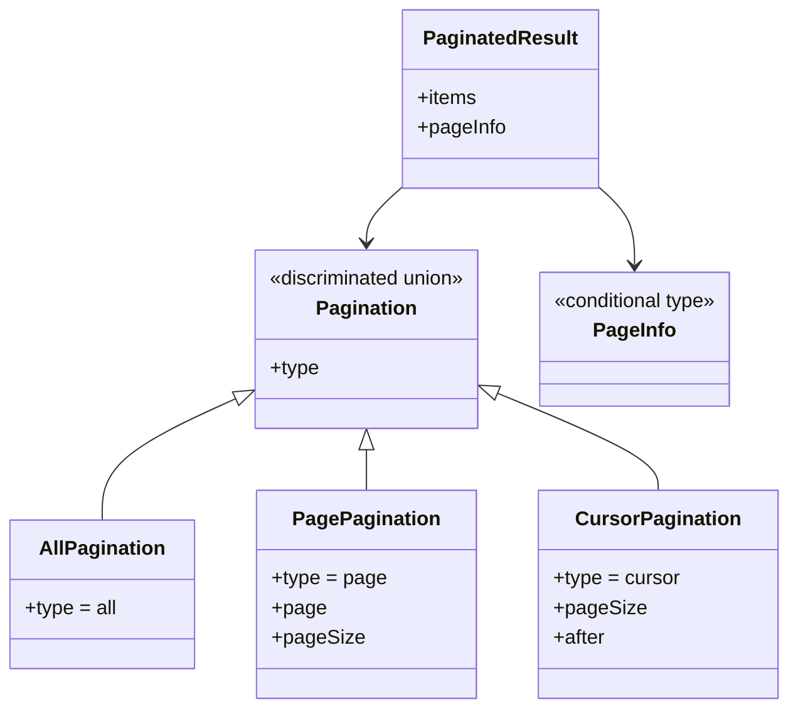
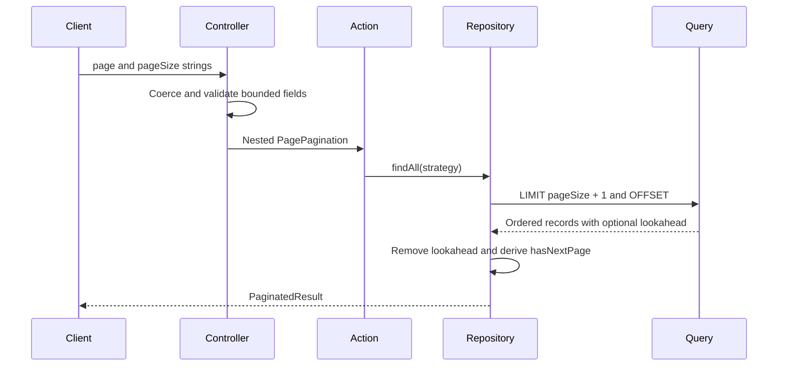
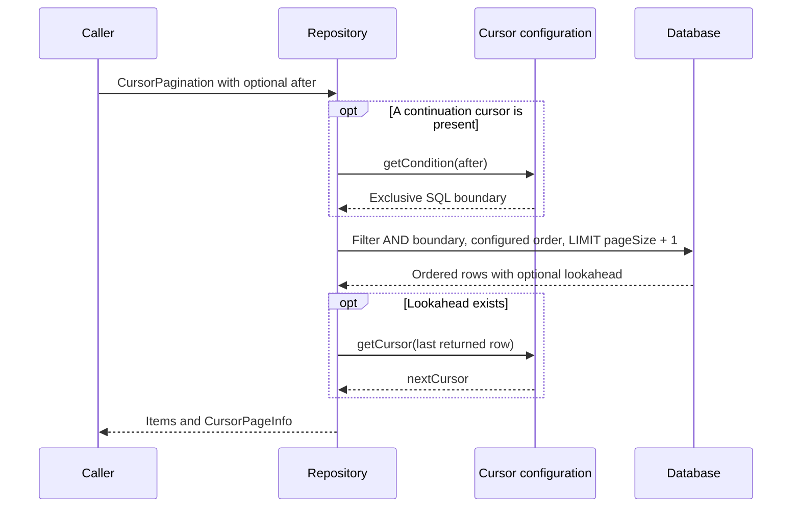
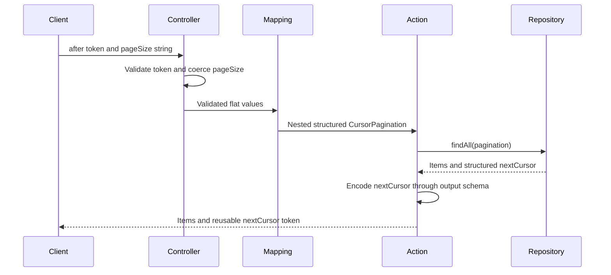

# Pagination

[Documentation](../README.md) · [Implementation index](./README.md) · [Usage guide](../usage/pagination.md)

Pagination provides a shared contract for repository collection queries, actions, and their controllers. The database layer supports retrieving every record, numbered pages, and forward cursor pages. Conventional model-list actions expose `all` and `page`; dedicated cursor schemas and action derivations provide typed URL/CLI mapping for cursor-enabled actions.

## Concepts and model

`Pagination` is the requested strategy. `PageInfo` is the strategy-specific response metadata. `PaginatedResult` always combines items and page information, allowing repositories, actions and controllers to share one result shape while selecting different public input representations.



## Usage guide

For application setup and task-oriented examples, see the [Pagination usage guide](../usage/pagination.md).

## Design and implementation

The page strategy uses one-based indexes and offset pagination. Query helpers request `pageSize + 1` records, remove the lookahead item and derive `hasNextPage` without a count query. The repository must apply deterministic ordering before pagination. Cursor pagination uses an exclusive keyset predicate and no offset. A repository explicitly declares cursor ordering, extraction and comparison together. Conditional TypeScript types retain the exact `pageInfo` variant selected by the caller, including the cursor type on the first page.

Transport coercion is deliberately separated from repository types. The repository receives numbers and a discriminated strategy, while HTTP and CLI controllers may accept strings and flat fields before Zod maps them to that contract.

## Execution scenario



## Public API

| Layer | Main exports |
| --- | --- |
| Core result model | `Pagination`, `AllPagination`, `PagePagination`, `CursorPagination`, `CursorPageInfo`, `PageInfo`, `PaginatedResult`, `createPaginatedResult()` |
| Query integration | `getPaginationQueryWindow()`, `paginateQuery()`, `getCursorPaginationCondition()`, `CursorPaginationOptions`, `PaginationQueryWindow` |
| Action schemas and mapping | `createPaginationInputSchema()`, `createPaginatedOutputSchema()`, `mapPaginationInput`, `paginationControllerInputSchema`, `mapPaginationControllerInput()` |
| Cursor transport | `createPaginationCursorCodec()`, `createCursorPaginationInputSchema()`, `createCursorPaginatedOutputSchema()`, `mapCursorPaginationInput()`, `createCursorPaginationControllerInputSchema()`, `mapCursorPaginationControllerInput()` |
| Defaults | `DEFAULT_PAGINATION_PAGE_SIZE`, `MAX_PAGINATION_PAGE_SIZE` |
| Conventional controllers | `defineModelListActionHttpController()` and `defineModelListActionCliController()` from their transport libraries |

Pagination has no adapter lifecycle. Custom persistence honors the query-window and result-construction contracts. Cursor configuration additionally follows the ordering, precision and boundary contract described below.

## Strategies

The three mutually exclusive strategies are represented by a discriminated union:

```ts
export interface AllPagination {
  type: "all";
}

export interface PagePagination {
  type: "page";
  page: number;
  pageSize: number;
}

export interface CursorPagination<Cursor = unknown> {
  type: "cursor";
  pageSize: number;
  after?: Cursor;
}

export type Pagination<Cursor = unknown> =
  | AllPagination
  | PagePagination
  | CursorPagination<Cursor>;
```

The `type` discriminator makes invalid combinations unrepresentable and provides straightforward narrowing in TypeScript and validation with Zod.

- `all` returns every matching record.
- `page` uses a one-based page number and an offset derived from `page` and `pageSize`.
- `cursor` resumes strictly after a structured value in a configured total order; omit `after` for the first page.

## Results

Every collection query returns the same top-level shape with `items` and a discriminated `pageInfo` object:

```ts
export interface AllPageInfo {
  type: "all";
}

export interface NumberedPageInfo {
  type: "page";
  page: number;
  pageSize: number;
  hasNextPage: boolean;
}

export interface CursorPageInfo<Cursor = unknown> {
  type: "cursor";
  pageSize: number;
  hasNextPage: boolean;
  nextCursor: Cursor | null;
}

export type PageInfo<
  Strategy extends Pagination,
  Cursor = Strategy extends CursorPagination<infer Value> ? Value : never,
> =
  Strategy extends AllPagination
    ? AllPageInfo
    : Strategy extends CursorPagination
      ? CursorPageInfo<Cursor>
      : NumberedPageInfo;

export type PaginatedResult<
  Item,
  Strategy extends Pagination,
  Cursor = Strategy extends CursorPagination<infer Value> ? Value : never,
> = Strategy extends Pagination ? {
  items: Item[];
  pageInfo: PageInfo<Strategy, Cursor>;
} : never;
```

An unpaginated result remains explicit and consistent with numbered pages:

```json
{
  "items": [],
  "pageInfo": {
    "type": "all"
  }
}
```

`totalItems` and `totalPages` are not included by default because calculating them generally requires an additional count query. They may later be introduced as an explicit option for use cases that require them.

## Repository API

`Repository.findAll()` always returns a `PaginatedResult`. Omitting its argument selects the `all` strategy:

```ts
public async findAll<
  const Strategy extends Pagination<Cursor> = AllPagination,
>(
  pagination?: Strategy,
): Promise<
  PaginatedResult<
    Table["$inferSelect"],
    Strategy,
    Cursor
  >
>;
```

The inferred result retains the selected strategy:

```ts
const allUsers = await repository.findAll();
// allUsers.pageInfo is AllPageInfo.

const secondPage = await repository.findAll({
  type: "page",
  page: 2,
  pageSize: 20,
});
// secondPage.pageInfo is NumberedPageInfo.
```

Numbered pages retrieve one more record than requested. The extra record is removed from `items` and used to calculate `hasNextPage`. The `all` strategy does not apply a limit.

Page-based pagination uses:

```ts
const offset = (pagination.page - 1) * pagination.pageSize;
```

Repositories always apply their configured order so repeated numbered queries remain deterministic.

### Custom repository queries

Repository methods using joins, projections, aggregations, or other custom query shapes can apply the same behavior without going through `findAllWhere()`:

```ts
const query = database
  .select({
    domain: users.email,
    postCount: count(posts.id),
  })
  .from(users)
  .leftJoin(posts, eq(posts.userId, users.id))
  .groupBy(users.id)
  .orderBy(users.createdAt, users.id);

return paginateQuery(query, pagination);
```

The query must provide deterministic ordering before it is passed to `paginateQuery()`. The helper only applies the fetch window. Execute the returned query, then pass the fetched records to `createPaginatedResult()` to remove lookahead and create the shared result.

For custom query executors that do not use a Drizzle select builder, `getPaginationQueryWindow()` exposes the required limit and offset and `createPaginatedResult()` builds the result from the fetched records.

## Cursor pagination

The recommended database composition is `Repository.findAll()` or a specialized method that calls `findAllWhere()`. Supply the cursor type as the fifth `Repository` type argument and configure `RepositoryOptions.cursor`. The cursor contract owns its own ordering; numbered queries continue to use the repository's existing `orderBy`. `findAllWhere()` rejects an explicit ordering override for a cursor request. `findCollection()` remains a numbered-page contract with caller-selected sorting.

For example, a record ordered by a non-null integer priority descending and an integer identifier ascending needs both values in the cursor:

```ts
import { and, asc, desc, eq, gt, lt, or } from "drizzle-orm";
import type { CursorPaginationOptions } from "./index.js";

type RecordCursor = { priority: number; id: number };

const cursor: CursorPaginationOptions<typeof records.$inferSelect, RecordCursor> = {
  orderBy: [desc(records.priority), asc(records.id)],
  getCursor: ({ priority, id }) => ({ priority, id }),
  // Descending priority advances toward smaller values; tied IDs advance upward.
  getCondition: (after) => or(
    lt(records.priority, after.priority),
    and(eq(records.priority, after.priority), gt(records.id, after.id)),
  )!,
};

// Pass `cursor` alongside `table`, `idColumn` and `orderBy` in repository options.
const first = await repository.findAll({ type: "cursor", pageSize: 20 });
if (first.pageInfo.nextCursor !== null) {
  const next = await repository.findAll({
    type: "cursor",
    pageSize: 20,
    after: first.pageInfo.nextCursor,
  });
}
```

`CursorPageInfo` contains `pageSize`, `hasNextPage` and `nextCursor`. The next cursor comes from the last returned item only when lookahead proves another page exists. Empty, partial and exactly full final pages return `hasNextPage: false` and `nextCursor: null`. Do not submit that null value as `after`; omit `after` to start a new traversal. The cursor extractor must return a non-null value. Cursor page sizes must be positive safe integers with room for the extra lookahead record. Public actions should additionally enforce an application-specific maximum.

### Cursor configuration contract

- `orderBy` must describe a deterministic total order, with a unique tie-breaker. The library cannot infer uniqueness from arbitrary SQL expressions.
- `getCursor(item)` must preserve every ordered value needed by the predicate, including its database precision. Avoid rounding PostgreSQL microsecond timestamps through JavaScript `Date`; use lossless string representations or an appropriate exact key instead. Preserve large integers and decimals similarly.
- `getCondition(after)` must return a strict, parameterized SQL predicate matching that exact order. Mixed directions require a lexicographic expression such as the example above. Nullable columns require explicit `NULLS FIRST` or `NULLS LAST` ordering and a matching predicate that handles nulls; ordinary `=` and inequality comparisons do not suffice.
- Keep filters and ordering unchanged across a traversal. The repository combines the cursor predicate with the original filter using `AND`. Errors in configuration callbacks propagate to the caller. Missing cursor configuration and invalid cursor requests are rejected before database execution.
- Each page is a separate query. Deleting a boundary row does not prevent continuation, and inserts before the boundary do not shift subsequent pages. Changes to sort keys or filter membership can still skip or repeat records; cursor pagination does not create a snapshot across requests. Use suitable indexes for the filter and ordered columns.

### Standalone query composition

Custom projections and joins can use the same helpers with a `CursorPaginationOptions` definition whose extractor accepts the selected row shape:

```ts
const condition = getCursorPaginationCondition(pagination, cursor, existingFilter);
const query = database.select().from(records)
  .where(condition)
  .orderBy(...cursor.orderBy)
  .$dynamic();

const rows = await paginateQuery(query, pagination).execute();
return createPaginatedResult(rows, pagination, cursor.getCursor);
```

`paginateQuery()` only applies the fetch window and preserves existing query predicates. It does not derive a cursor predicate or ordering: custom queries must apply both explicitly as above. Start with a query without an existing limit or offset. `getPaginationQueryWindow()` returns `{ limit: pageSize + 1 }` for cursors, with no `offset` property. A custom executor may use that window after applying the same predicate and ordering.



## Action contracts

The conventional model list helper creates the standard pagination input and output schemas:

```ts
const listUserAction = defineModelListAction(
  "user",
  UserRepository,
  userOutputSchema,
);
```

The generated action defaults to the first numbered page, limits page sizes to the Kestrel maximum, returns the generic paginated result schema, and connects directly to a repository implementing the paginated `findAll()` contract.

`createPaginationInputSchema()` and `createPaginatedOutputSchema()` remain available for custom actions. The input factory provides positive integer validation, configurable default and maximum page sizes, and explicit control over whether `all` is accepted.

`mapPaginationInput` is an action derivation built on `mapActionInput()`. It preserves every other action input field while replacing the nested `pagination` field with the flat, coercing `page` and `pageSize` controller contract:

```ts
const controllerAction =
  listUsersByEmailAction.derive(mapPaginationInput);
```

CLI and HTTP controllers can share this derived action without defining custom mapping handlers. The original action retains its nested repository-facing pagination contract.

### Cursor actions and URL mapping

The shared codec implementation is owned by `utils/cursor_codec.ts`; actions re-export `createPaginationCursorCodec()` and `PaginationCursorCodec`. Lower-level libraries and persistence adapters should import that utility directly rather than depend on action helpers. Domain libraries own their specific cursor schemas and ordering semantics.

Define a cursor schema matching the repository's cursor type, then reuse its codec for the nested input, serialized output and flat controller derivation. Use the same page-size options at both input boundaries. The recommended composition is a dedicated action derived with `mapCursorPaginationInput(codec, options)`, exposed through the generic HTTP or CLI controller helper:

```ts
import { z } from "zod";
import {
  createPaginationCursorCodec,
  createCursorPaginationInputSchema,
  createCursorPaginatedOutputSchema,
  defineAction,
  mapCursorPaginationInput,
} from "./index.js";

const cursorCodec = createPaginationCursorCodec(z.object({
  priority: z.number().int(),
  id: z.number().int(),
}));
const pageSizes = { defaultPageSize: 20, maxPageSize: 100 };

const listAction = defineAction({
  name: "record.list",
  input: z.object({
    pagination: createCursorPaginationInputSchema(cursorCodec, pageSizes),
  }),
  output: createCursorPaginatedOutputSchema(recordOutputSchema, cursorCodec),
  // `repository` is a cursor-configured repository supplied by the application.
  handler: ({ pagination }) => repository.findAll(pagination),
});

const controllerAction = listAction.derive(mapCursorPaginationInput(cursorCodec, pageSizes));
const controller = defineActionHttpController(controllerAction, get("/api/records"), accessPolicy);
```

The first request is `GET /api/records?pageSize=20`. A continuation uses `GET /api/records?after=<nextCursor>&pageSize=20`. The returned `pageInfo.nextCursor` is a URL-safe string, or `null` when traversal is complete. Additional action fields remain available as flat controller fields; `after` and `pageSize` are reserved for pagination. Existing numbered pagination helpers and conventional model-list controller factories keep their current contracts.

Standalone URL parsing uses the same contract without an action:

```ts
const schema = createCursorPaginationControllerInputSchema(cursorCodec, pageSizes);
const fields = schema.parse(Object.fromEntries(new URL(requestUrl).searchParams));
const { pagination } = mapCursorPaginationControllerInput(cursorCodec, fields);
// pagination is CursorPagination<{ priority: number; id: number }>.
const result = await repository.findAll(pagination);
```

The flat schema validates `after` while retaining its string representation. Mapping decodes it to a structured cursor. This keeps controller/action validation idempotent. Missing `after` starts a traversal; an empty, malformed, incompatible or oversized token is rejected. HTTP input validation returns 400 before the repository runs. Both schemas default and bound `pageSize`; the flat schema also coerces numeric strings and rejects repeated query values represented as arrays. The derivation retains source-action validation, including stricter application refinements.

`createPaginationCursorCodec(schema, { maxLength })` returns a synchronous Zod codec. `z.encode(codec, cursor)` produces unpadded base64url containing `{ version: 1, value: ... }`; `z.decode(codec, token)` validates the envelope, version, UTF-8, canonical encoding and cursor schema. The default maximum token length is 4096 characters, enforced in both directions. Null and undefined are not cursor values. The schema's input must be losslessly JSON-serializable. For dates, bigint or custom values, declare bidirectional Zod field codecs with JSON-compatible input; ordinary one-way transforms cannot be encoded. Preserve PostgreSQL precision as described in the database cursor contract.

Tokens are encoded, not encrypted or signed. The caller must retain authorization filters and keep filter/sort context stable across requests. Include and validate context in the cursor schema when the application needs to bind a token to a particular query. Schema and format evolution remain explicit rather than silently accepting incompatible cursors.



## Public access to the `all` strategy

The repository always supports `all` because it is the default for `findAll()` without arguments. Public actions and controllers do not expose it automatically.

`createPaginationInputSchema()` requires an explicit `allowAll: true` option when an action is intended to accept `type: "all"`:

```ts
const paginationSchema = createPaginationInputSchema({
  allowAll: true,
  maxPageSize: 100,
});
```

This allows trusted administrative actions to retrieve complete collections while public endpoints remain bounded. An action that does not allow `all` defaults to the first numbered page.

## Controllers

Controllers own transport-specific pagination representations and map them to the nested action contract. The user HTTP controller exposes flat query parameters:

```http
GET /api/users?page=2&pageSize=20
```

Kestrel provides conventional CLI and HTTP controller helpers. They create the flat controller schema, coerce interface values, apply defaults, declare HTTP query bindings, and map the result to the nested action contract:

```ts
const cliController = defineModelListActionCliController(
  listUserAction,
  "user list",
);

const httpController = defineModelListActionHttpController(
  listUserAction,
  "/api/users",
  anonymousHttpAccess,
);
```

Other controller types can choose representations suited to their interfaces while reusing the same action.

## Responsibilities

- Repositories define deterministic SQL ordering and use the shared query helpers for offsets and lookahead records.
- Actions define reusable pagination contracts and enforce public limits.
- Controllers parse interface-specific inputs and map them to action inputs.
- Clients select one of the strategies allowed by an action.

## Testing

Repository tests cover all strategies, empty collections, partially filled pages, exact page boundaries, stable ordering, and `hasNextPage`. Cursor tests exercise composite keys with mixed sort directions, preserved filters, deletion of the boundary record, inserts before the cursor, typed extraction, and invalid requests. Query compilation tests verify parameterized predicates and the absence of `OFFSET`.

Action tests cover schema defaults, size limits, serialized results, and the opt-in behavior of `all`. Cursor tests cover codec round trips, malformed/version-incompatible tokens, Unicode, limits, field preservation, source validation and bidirectional date fields.

HTTP tests use `fastify.inject()` to cover query coercion and serialized results without opening a network port, including reusing a response cursor in the next request and rejecting invalid tokens before repository execution.

## Future extensions

- Add optional signed cursors and a reusable filter/sort context binding policy where applications need integrity guarantees beyond validation.
- Support backward traversal with `before`, inverted SQL ordering and restoration of the requested result order.
- Offer a declarative lexicographic predicate builder with explicit nullable-column ordering and lossless database-value codecs.
- Add optional count metadata separately from page retrieval for applications that need it.
