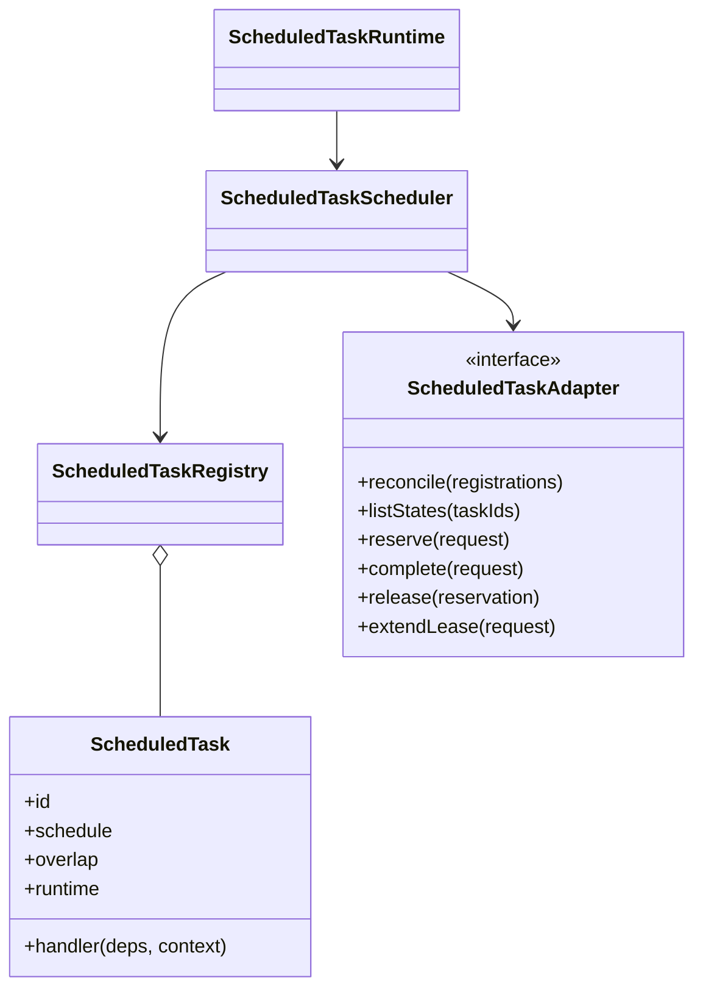
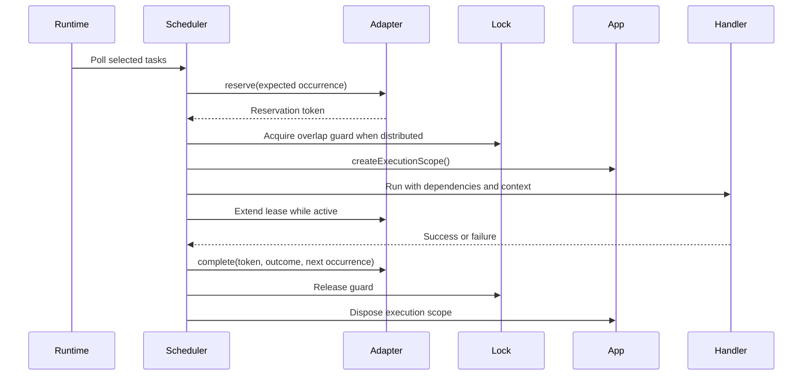
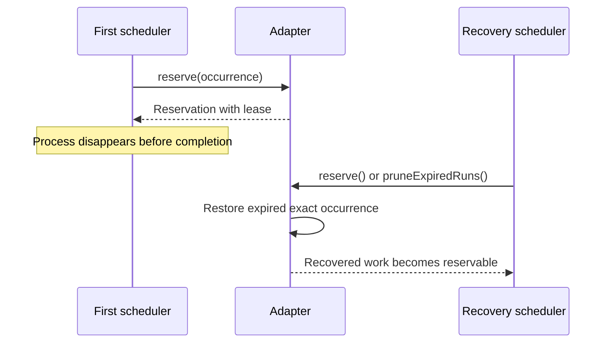

# Scheduled tasks

[Documentation](../README.md) · [Implementation index](./README.md) · [Usage guide](../usage/scheduled_tasks.md)

The scheduled-task library defines recurring application work independently from its storage and coordination guarantees. It supports fixed intervals, completion-based loops and timezone-aware cron expressions, then runs handlers inside ordinary application execution scopes.

## Concepts and model

A `ScheduledTask` combines a stable identity, schedule, execution policy, dependencies and handler. `ScheduledTaskRegistry` indexes selected catalog definitions. `ScheduledTaskRuntime` owns process lifecycle and delegates polling to `ScheduledTaskScheduler`. The scheduler persists occurrence state through `ScheduledTaskAdapter` and may use the lock library for distributed overlap coordination.



## Usage guide

For application setup and task-oriented examples, see the [Scheduled tasks usage guide](../usage/scheduled_tasks.md).

## Design and implementation

Schedule calculation, occurrence persistence, overlap guarding and handler execution are separate responsibilities. The scheduler polls only selected definitions, reserves exact occurrences, optionally acquires distributed coordination, creates an application execution scope and maintains both reservation and lock heartbeats. No storage transaction remains open while user code executes.

State reservations preserve occurrence identity and recovery. Distributed locks prevent overlapping handlers across processes. Keeping both contracts avoids asking a lock lease to represent schedule cadence or asking the state adapter to duplicate general lock semantics.

## Execution scenarios

### Reserved occurrence completes



### Process loss and recovery



## Public API

| API group | Main exports |
| --- | --- |
| Definitions and schedules | `defineScheduledTask()`, `every()`, `loop()`, `cron()`, `durationToMs()` and task, schedule, overlap and runtime option types |
| Catalog and runtime | `ScheduledTaskRegistry`, `selectScheduledTasks()`, `ScheduledTaskRuntime`, `ScheduledTaskScheduler` |
| Kestrel composition | `ScheduledTaskProvider`, `scheduledTasksConfigBase`, scheduler and adapter dependencies |
| Adapter contracts | `ScheduledTaskAdapter` and registration, state, reservation, completion, lease, pruning and serialized-error types |
| Bundled adapters | `MemoryScheduledTaskAdapter`, `PostgresScheduledTaskAdapter` and PostgreSQL schema exports |

## Adapter API

`ScheduledTaskAdapter` must provide atomic occurrence transitions:

- `reconcile()` creates missing selected states without deleting unrelated definitions or replacing existing controls and cadence.
- `listStates()` returns current states for the requested ids and may recover relevant expired leases.
- `reserve()` compares `expectedScheduledAt`, applies pause and overlap policy, consumes manual or scheduled work exactly once, and returns a unique reservation token or an explicit non-reserved status.
- `skip()` atomically consumes the same exact occurrence when an external overlap guard is busy.
- `complete()`, `release()` and `extendLease()` use both task id and reservation token and return `false` for stale ownership.
- `pruneExpiredRuns()` restores occurrence state and removes at most the requested bounded batch, including runs for definitions absent from the current process.
- `requestRun()` coalesces a durable manual request. `setPaused()` changes future admission without aborting active runs and may install a replacement future occurrence on resume.

Adapter methods must use storage time consistently enough for lease ownership, avoid transactions spanning handler execution and preserve at-least-once recovery. Errors reject to the scheduler; they must not be converted to contention or stale-ownership results. The memory and PostgreSQL adapters implement the same contract for local and distributed deployments.

## Definitions

`defineScheduledTask()` retains typed dependency declarations and runtime policy in one catalog-friendly value:

```ts
const cleanup = defineScheduledTask({
  id: "maintenance.cleanup",
  description: "Remove expired application data.",
  groups: ["maintenance"],
  schedule: loop({ delay: { minutes: 1 } }),
  dependencies: { repository: repositoryDependency },
  overlap: "skip",
  executionLog: false,
  observe: false,
  handler: async ({ repository }, context) => {
    // Idle work can postpone its next regular occurrence.
    const removed = await repository.prune();

    if (removed === 0) {
      context.deferNextRun({ minutes: 5 });
    }
  },
});
```

Task ids are stable lowercase identifiers. Groups are selection metadata and one task can belong to several groups.

`executionLog` controls the automatic execution-context log for each invocation. It defaults to `true`; setting it to `false` suppresses both completion-mode emission and dynamic context enrichment without affecting ordinary handler logs or execution observations. The option belongs to the task definition, so changing it back to `true` opts that task into the globally configured execution-log policy.

`observe` independently controls execution observations and ambient Kestrel instrumentation. It also defaults to `true`. A false value omits the `execution.started` and `execution.completed` observations and runs singleton instrumentation without an active observer, while leaving execution logs and explicit handler behavior unchanged. Setting it back to `true` opts the task into the globally configured observation policy; disabled global observation storage remains authoritative.

Three schedule helpers are available:

- `every(duration)` keeps a fixed cadence based on scheduled occurrences. Missed occurrences are coalesced and the next future occurrence remains aligned to the original cadence.
- `loop({ delay })` starts its delay after the previous handler completes. It runs immediately by default.
- `cron(expression, { timeZone })` accepts standard five-field cron syntax. UTC is used unless an IANA timezone is provided. `cron-parser` only calculates occurrences; it does not own timers or handler execution.

`every()` accepts `start: "immediate"`; `loop()` accepts `start: "after-delay"`. Duration objects support milliseconds through weeks. Rich calendar constraints such as weekdays remain a future extension, either on `every()` or through a dedicated `calendar()` helper, without changing the scheduler contract.

The handler context contains its cooperative `AbortSignal`, the claimed occurrence time, the `scheduled` or `manual` trigger, and `deferNextRun()`. Multiple deferrals retain the longest delay. Manual runs do not move the regular cadence and do not apply handler deferrals to it.

## Overlap policy

Every definition chooses one of three policies:

- `skip` is the default. A due occurrence is consumed if an earlier execution still owns the overlap guard.
- `wait` retains and coalesces the due occurrence until the active execution completes.
- `parallel` allows distinct occurrences to execute concurrently, subject to global scheduler slots.

Loops naturally calculate only one next occurrence after completion. The policy matters principally to interval and cron schedules, and to manual requests that arrive during an active execution.

## State and coordination

Occurrence state and overlap coordination are independent runtime choices:

```ts
runtime: {
  state: "memory" | "persistent",
  coordination: "local" | "distributed",
}
```

The scheduler supplies defaults and task definitions may override them unless overrides are disabled. The application defaults are persistent state and distributed coordination.

Memory state avoids storage traffic for frequent process-local work. Persistent state stores controls, the next occurrence, active reservation leases and the latest outcome in PostgreSQL. Distributed overlap uses the Kestrel lock library under the `scheduled-task:<task-id>` key; the state adapter does not duplicate lock ownership. Persistent occurrence reservations still use their own token and expiry because a lock prevents concurrent handlers but cannot by itself preserve occurrence identity across completion and crashes.

The PostgreSQL schema contains `scheduled_tasks.state` and `scheduled_tasks.run`. A task can have several active run rows for `parallel`. Completion and lease extension require both task id and reservation token. Expired reservations restore their exact manual or scheduled occurrence before new admission, providing at-least-once execution after a crash. Handlers must consequently be idempotent.

Normal completion and explicit release remove a run immediately. Admission and state reads recover expired runs for the relevant definitions. `pruneExpiredRuns()` additionally claims a bounded global batch with `FOR UPDATE SKIP LOCKED`, restores each occurrence and deletes its expired run. This global path also handles definitions that were removed, renamed or excluded from the current scheduler selection.

The scheduler reconciles only its selected definitions and never deletes unrelated state. A newly discovered task receives the initial occurrence calculated at reconciliation time, while an existing task retains its controls and cadence.

## Scheduler

`ScheduledTaskScheduler` polls state adapters, orders due occurrences, admits at most its available slots and executes each reservation in a dedicated `ExecutionScope`. Dependencies are resolved from that scope. Start and completion observations use the `scheduled-task` transport, and handler failures are persisted without terminating the polling loop.

Occurrence reservations and distributed locks are extended halfway through the configured lease. Shutdown stops admission, aborts cooperative handlers, waits for active invocations and then allows the application to dispose scoped resources. A handler failure does not cause an immediate retry; the task continues according to its normal schedule. Persistent delivery remains at-least-once when a process disappears before it confirms completion.

`ScheduledTaskAdapter` defines reconciliation, state listing, exact occurrence reservation, skipping, completion, release, lease extension, global expired-run pruning, manual requests and pause controls. `MemoryScheduledTaskAdapter` provides process-local state and deterministic tests. `PostgresScheduledTaskAdapter` implements durable state using short transactions and row locks; no transaction remains open while a handler executes.

## Controls

Adapters expose `requestRun()` and `setPaused()` for application tooling. Pause is soft: it prevents new scheduled admissions without aborting active handlers; an explicit manual request remains allowed. Resume may provide a freshly calculated future occurrence so missed runs are not replayed. Manual requests are durable and coalesced into one outstanding request. The Studio extension exposes Run now, Pause and Resume through these operations; direct handler invocation remains owned by the scheduled-task process.

## Bootstrap

Business tasks are declared in optional `scheduledTasks` sections of their domain subcatalogs. Constructing `AppCatalog` registers them in `app.catalog.scheduledTasks` with application provenance and their declaration paths intact. Providers contribute infrastructure task subcatalogs during composition, keeping technical definitions next to the resources they maintain. Duplicate ids are rejected immediately with both sources in the error. `ScheduledTaskRuntime` and the HTTP Studio extension consume the same consolidated definitions.

Start all selected tasks with:

```sh
./do run scheduled-tasks
```

Repeatable task and group filters form a union:

```sh
./do run scheduled-tasks --task maintenance.cache-prune --group maintenance
```

Unknown ids and groups fail before polling starts, while unknown arguments fail during CLI parsing. With no filters the complete application registry is selected. `npm run dev` runs the scheduled-task runtime concurrently with the HTTP server, database tooling and workers.

The scheduler capacity, lease duration, polling interval and default runtime guarantees are configured through the `APP_CONFIG__SCHEDULED_TASKS__*` variables documented in `.env.example`.

## Application maintenance

Three providers conditionally contribute their own maintenance definitions to `app.catalog`:

- `maintenance.cache-prune` removes expired and excess cache entries.
- `maintenance.lock-prune` removes expired distributed lock leases.
- `maintenance.scheduled-task-runs-prune` globally restores and removes expired scheduled-task runs.

The cache, lock and scheduled-task libraries respectively own these providers and definitions. Each provider receives its resolved component configuration and exposes protected construction hooks for application-specific behavior. All three tasks use persistent state, distributed coordination and `overlap: "skip"`. They declare `executionLog: false` and `observe: false` by default because successful no-op maintenance is expected and already represented by scheduled-task state. An application-specific definition or provider override can set either option to `true` when those execution logs or observations are useful. Cache and lock intervals retain their component configuration. Expired-run maintenance uses `APP_CONFIG__SCHEDULED_TASKS__EXPIRED_RUN_PRUNE_INTERVAL_SECONDS` and `APP_CONFIG__SCHEDULED_TASKS__EXPIRED_RUN_PRUNE_BATCH_SIZE`. An interval of zero prevents the corresponding provider contribution. Providers expose one-shot operations and no longer start process-local maintenance timers.

## Studio

The local Studio Scheduled tasks page reads definitions and provenance from `app.catalog.scheduledTasks`. Application tasks retain their declared subcatalog hierarchy; infrastructure tasks are grouped by their contributing provider. The table shows schedule parameters, overlap, execution-log and observation policies, groups, next occurrence, outstanding manual requests, active runs and the latest outcome or bounded error.

Studio controls persistent tasks only through `ScheduledTaskAdapter`. Run now creates a manual request and remains available while a task is paused. Pause is soft, and Resume computes a new strictly future occurrence rather than replaying missed schedules. Process-local memory tasks remain visible, but their controls are disabled because the HTTP and scheduled-task processes do not share memory state. A persistent definition is also temporarily read-only until its scheduler has reconciled the corresponding state row.

## Deferred evolution

The first implementation intentionally defers rich calendar helpers such as weekdays, configurable catch-up strategies, immediate retry policies, complete execution history, one-shot tasks, priorities, rate limits, per-task slot limits and cooperative cancellation controls. A future inter-process control channel could make memory tasks operable from Studio without adding database pressure. ScheduledTasks, Workers, and workflows now share lower-level abort-aware delay and lease-heartbeat primitives where their semantics match; storage-specific reservation, capacity, and admission policies remain separate rather than being forced into one scheduler algorithm.

## Explicit provider adapters

`ScheduledTaskProvider(config, adapter)` accepts `postgresScheduledTasks(database)` or `memoryScheduledTasks(settings?)`, as well as external definitions. Runtime dependencies use `ScheduledTaskAdapter`, not the PostgreSQL implementation. Locks remain a separate coordination dependency.

See the [shared composition convention](../implementation/app.md#provider-adapter-convention) and [configuration recipes](../usage/configuration.md#additional-provider-composition).
