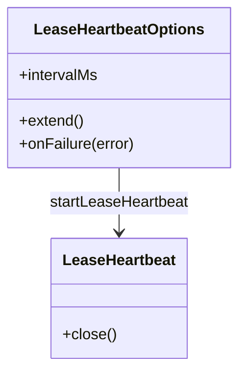
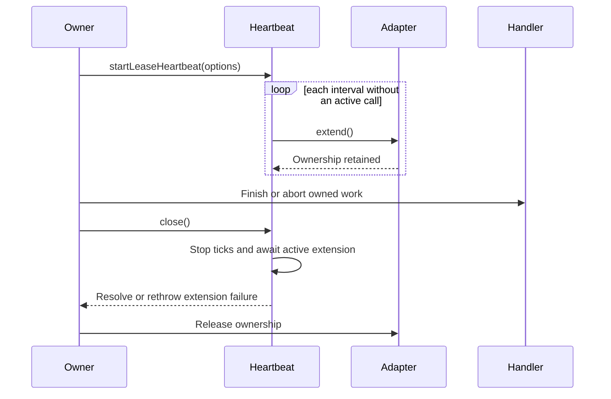

# Scheduling primitives

[Documentation](../README.md) · [Implementation index](./README.md) · [Usage guide](../usage/scheduling.md)

The scheduling library contains small process-local primitives shared by schedulers: abort-aware unreferenced delays and non-overlapping lease heartbeats. It does not define jobs, persistence, retry policy or application lifecycle.

## Concepts and model

`abortableDelay()` is a timer boundary that resolves either when its duration elapses or when its signal aborts. `startLeaseHeartbeat()` owns one interval and at most one active extension. The returned `LeaseHeartbeat` gives the owner an explicit close boundary.

## Usage guide

For application setup and task-oriented examples, see the [Scheduling primitives usage guide](../usage/scheduling.md).

## Design and implementation

Both timers call `unref()`, so pending scheduling infrastructure alone does not keep the Node.js process alive. `abortableDelay()` removes its listener and clears its timeout through one shared completion path. The heartbeat skips ticks while an extension is active, preventing overlapping ownership mutations.

The first extension failure stops future ticks, records the original failure and invokes `onFailure` defensively. `close()` clears the interval, waits for any active extension and then rethrows the recorded extension failure. A notification callback failure never replaces it.

## Execution scenarios

## Public API

| Export | Purpose |
| --- | --- |
| `abortableDelay()` | Resolves after a delay or early cancellation without retaining the process. |
| `startLeaseHeartbeat()` | Starts non-overlapping periodic extension and returns its close handle. |
| `LeaseHeartbeat` | Explicit asynchronous close boundary. |
| `LeaseHeartbeatOptions` | Configures interval, extension and failure notification. |

## Adapter API

The injected `extend()` callback is the storage-facing port. It must resolve only when current ownership has been extended and reject when storage fails or ownership is stale. It must be safe to call repeatedly but is never invoked concurrently by one heartbeat. `onFailure()` is notification only and cannot recover or replace the failed heartbeat.

The owner must close the heartbeat before releasing its lease. Reversing that order could let an in-flight extension revive ownership after release.

## Potential evolutions

Jitter or a monotonic injectable scheduler can be added when measured synchronized-heartbeat load or broader deterministic testing requires it. Ownership-specific retry belongs to the scheduler or adapter rather than this primitive.
