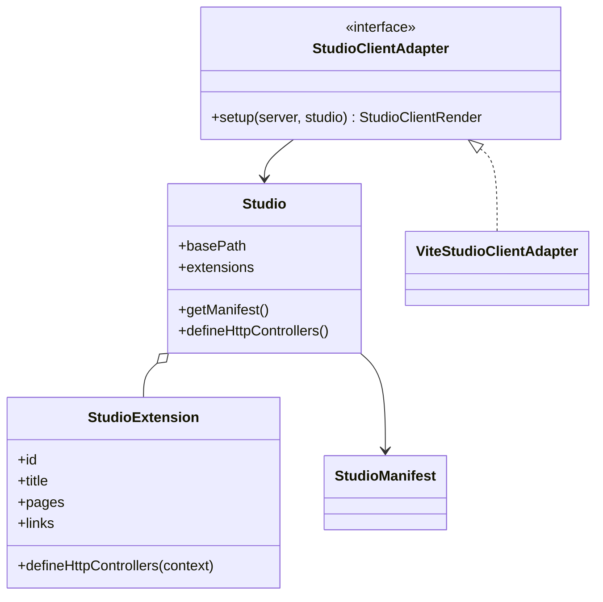
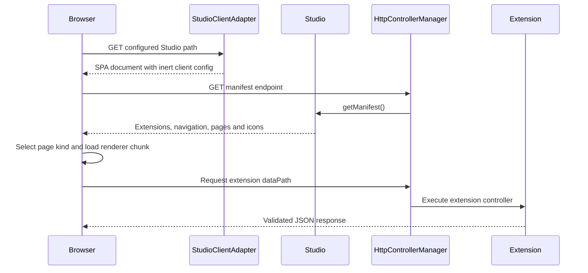

# Studio

[Documentation](../README.md) · [Implementation index](./README.md) · [Usage guide](../usage/studio.md)

Studio is Kestrel's development interface. It provides a place for introspection and development workflows without exposing those tools unless the application explicitly enables them.

The durable-workflows extension adds definition/version inventory, paginated execution search, history and archived generations, an execution-specific graph, parent/child/retry navigation, observation links, validated signals, and operational controls. Its optional `authorize` callback lets an application enforce operation-level policy, while reusable production administration endpoints should call the storage-neutral `WorkflowOperations` service behind the application's standard security boundary. See [Durable workflows](./workflows.md#studio) for control semantics and sensitive-data guidance.


Studio is available at `/_studio` by default. `StudioProvider` can configure another `basePath` without rebuilding the client because client assets use the separate stable internal prefix `/_studio_assets/`. The provider declares a sentinel route for this prefix in Studio's Fastify scope so the encapsulated Vite middleware receives asset requests. The server places the URI-encoded client configuration in the root element's `data-studio-config` attribute; this keeps configuration non-executable and compatible with the production HTTP profile's `script-src 'self'` policy.

The Database extension includes a read-only schema layout at `/_studio/database`. It queries PostgreSQL's catalog through the application pool and groups application tables by SQL schema, with column types, nullability and primary keys. PostgreSQL system schemas are excluded. The layout is intentionally card-based rather than a relationship graph so the complete database remains easy to scan and can gain filters or foreign-key links later.

Generated applications include a separate Drizzle Studio Compose service bound to `127.0.0.1:4983`. The Database extension links to its hosted interface at the configured `DRIZZLE_STUDIO_URL` in a separate tab for browsing and editing data. The application owns this URL and its database schema entrypoint; the Studio library only receives an external link through the extension.

Studio follows the operating system's light or dark appearance through `prefers-color-scheme`. Shared semantic CSS variables keep the shell and installed extensions on the same palette, and theme changes apply without a reload or a client-side preference.

## Concepts and model

The public `@kestrel/framework/studio/configuration` entry exports `studioConfigBase` and `StudioConfig` without the provider or browser adapters. Application configuration shared with Drizzle uses this entry so its CommonJS loader does not attempt to require the ESM-only `@fastify/vite` adapter dependency. The main Studio entry retains its existing configuration re-exports for compatibility.

`Studio` validates and combines `StudioExtension` definitions into a serializable `StudioManifest`. An extension contributes navigation metadata, pages, external links and optional HTTP controllers. `StudioProvider` mounts the definition through the Kestrel HTTP runtime and delegates browser delivery to `StudioClientAdapter`. The browser selects a renderer from each page's stable `kind`.



## Usage guide

For application setup and task-oriented examples, see the [Studio usage guide](../usage/studio.md).

## Design and implementation

Server extensions remain declarative until the HTTP workload mounts. Studio validates identifiers, route paths, navigation sections and external URLs, deduplicates icons into the manifest, then registers extension JSON APIs through the common HTTP controller manager. The generic browser shell knows only page kinds and dynamically loads extension-owned renderer chunks.

Shared server/client data lives in transport-neutral contracts. Browser modules never import server extension definitions, and Kestrel extensions receive required catalogs or sources explicitly rather than discovering application modules.

Extension renderers use `StudioPageHeader` with `page` and `eyebrow` properties. The shared header displays the category, title and optional description; it has no capability badge property or default badge.

## Execution scenarios

### Studio bootstrap and extension page



## Public API

| API group | Main exports |
| --- | --- |
| Definition and manifest | `Studio`, `StudioOptions`, `StudioExtension` and extension, page, navigation, link and manifest types |
| Composition | `StudioProvider`, `StudioProviderOptions`, `studioConfigBase`, `StudioConfig` |
| Client delivery | `StudioClientAdapter`, `StudioClientRender`, `ViteStudioClientAdapter` and its options |
| Paths and client config | `DEFAULT_STUDIO_BASE_PATH`, `joinStudioPath()`, `STUDIO_ASSET_BASE_PATH`, client configuration and source-path mapping types |
| Icons | `fontAwesomeIcon()` and serializable SVG icon definition types |

Built-in extensions expose their own public APIs from `src/packages/kestrel/src/studio/extensions/<extension>/index.ts`; they are intentionally not flattened into the generic Studio entrypoint.

## Adapter API

`StudioClientAdapter.setup(server, studio)` runs once inside Studio's encapsulated Fastify scope and returns a `StudioClientRender` function. Setup may install asset middleware, readiness hooks and cleanup. The renderer receives a Fastify reply and must return or send the Studio document. It must serialize client configuration as inert data, honor `studio.basePath`, keep assets below `STUDIO_ASSET_BASE_PATH` and release watchers, sockets or other resources through the owning Fastify scope. Setup failures abort HTTP runtime construction and rendering failures flow through Fastify.

`StudioExtension` is a plugin contract rather than a storage adapter. Its manifest data must be serializable, identifiers and paths must remain stable, and `defineHttpControllers()` must return controllers below the configured base path using the supplied context. Extension-specific data sources define their own read or control contracts and must document them with the owning extension.

## Composition

The reusable `StudioProvider` lives in `src/packages/kestrel/src/studio`, receives a resolved `StudioConfig` and contributes a deferred entry to `app.httpExtensions` before any Fastify instance exists. It exposes protected factories for the Studio definition, client adapter, extensions and HTTP mount. The subclass in `src/server/core/providers` overrides only `createExtensions()` to attach application catalogs and lazy DI sources:

```ts
new ApplicationStudioProvider(config.studio);
```

The application configuration enables Studio locally and disables it in every other environment. The ordinary `npm run dev` profile selects `devMode: false` and builds Studio before startup, while `npm run dev:kestrel` selects `devMode: true` and injects the shared application Vite runtime. Kestrel never reads or interprets environment names or development-profile values. When disabled the provider is a no-op; when enabled its extension remains declarative until `HttpRuntime` mounts it, so CLI, worker and scheduled-task processes do not initialize Fastify or Vite.

## Extensions

A `StudioExtension` contributes a serializable manifest and may define standalone HTTP controllers for its JSON APIs. Its pages become navigation entries and code-based TanStack routes in the client:

```ts
import { definition as faPuzzlePiece } from "@fortawesome/free-solid-svg-icons/faPuzzlePiece";
import { fontAwesomeIcon, type StudioExtension } from "@kestrel/framework/studio";

const extensionIcon = fontAwesomeIcon(faPuzzlePiece);

const extension: StudioExtension = {
  id: "example",
  title: "Example",
  icon: extensionIcon,
  section: { id: "tools", title: "Tools", order: 50 },
  pages: [
    {
      id: "overview",
      title: "Overview",
      path: "/example",
      icon: extensionIcon,
      kind: "example-page",
      dataPath: "/api/extensions/example",
      order: 10,
    },
  ],
  defineHttpControllers({ basePath }) {
    return [
      defineHttpController({
        access: studioHttpAccess,
        route: get(joinStudioPath(basePath, "/api/extensions/example")),
        description: "Return example Studio data.",
        output: z.object({ value: z.literal("example") }),
        handler: () => ({ value: "example" as const }),
      }),
    ];
  },
};
```

Extension, section and page identifiers use lowercase kebab-case. An extension can define a navigation section with `{ id, title, order }`, reference one already defined by its id or title, or omit `section` to receive a section based on its own identity. Unknown string references create a section automatically. Pages and links from separate extensions that resolve to the same section are merged and sorted by their optional `order`; section order works the same way. Extensions, pages and external links may supply any serializable SVG `icon`. The `fontAwesomeIcon()` adapter converts an explicitly imported Font Awesome definition, while callers can provide the transport-neutral `SvgIconDefinition` directly. Deep Font Awesome imports keep Node from evaluating the complete style index. Studio compiles all contributed icons into one deduplicated manifest catalog and exposes only catalog references on extensions, pages and links. Page paths are unique across Studio and may contain TanStack Router parameters such as `$executionId`. A page's `kind` selects its React renderer, while `dataPath` points to optional extension data. Studio qualifies relative data paths with its configured base path before exposing the manifest to the browser. Setting `showInNavigation: false` keeps a detail page routable without adding it to the sidebar or Studio's visible tool counts.

`Studio` creates the manifest controller and gathers extension controllers. `StudioProvider` registers them through `HttpControllerManager` on Studio's encapsulated Fastify instance, so they use the standard input validation, execution scope and error handling without escaping Vite's plugin boundary. Vite assets, application-shell rendering and wildcard fallbacks remain direct Fastify routes because they belong to client delivery and routing infrastructure rather than JSON APIs.

Extensions may also expose absolute HTTP links for separately hosted development tools. Studio validates these links, excludes embedded credentials and opens them in a new tab. The built-in Database extension uses this mechanism for Drizzle Studio alongside its native read-only schema page.

Reusable built-in extensions own their server definition, client renderer, styles, tests and public exports below `src/packages/kestrel/src/studio/extensions/`. Each extension exposes its API from an `index.ts` at its own root instead of adding extension-specific exports to Studio's generic `index.ts`. Application code in `src/server/core/providers` only composes them through its Studio provider subclass, while extensions may still depend on Kestrel-owned data sources such as logs, observations or workers. Each extension's `client/definition.ts` declares the page kinds it owns and dynamically imports its `client/index.tsx`, whose evaluation registers the renderers. Vite eagerly discovers the small definitions and emits the renderer entrypoints as independent chunks, so adding a built-in extension does not require editing a central renderer list and the generic router remains independent from extension-specific UI.

Studio delivery adapters live in `src/packages/kestrel/src/studio/adapters`. The initial Vite implementation and its contract are re-exported by the Studio public index so providers remain independent from the internal layout.

Extension constants and serialized data types shared with a client renderer live in a transport-neutral `contract.ts` module. Client code must not import the server extension module because its controller definitions depend on the HTTP runtime and Node.js APIs that cannot enter the browser bundle.

The actions extension lives in `src/packages/kestrel/src/studio/extensions/actions`. It receives explicit action catalogs and keeps the flat JSON list for namespace-tree rendering. Its optional `ActionsStudioExtensionOptions` enables execution by default, supports `execution: false`, named `exclude` entries, JSON `examples` and opt-in `observability`. Metadata-only sources remain accepted for documentation. Complete action definitions are inspected with strict `z.toJSONSchema(..., { io: "input" })`; unrepresentable schemas are disabled rather than relaxed to `any`. Documentation and generated examples never parse input or call user transformations. Explicit catalogs preserve IDE navigation and avoid runtime file discovery.

The execute endpoint validates a JSON envelope, looks up the action only in its captured catalog and checks the same capability exposed to the client. `executeStudioAction` calls the runner in the HTTP-owned execution scope, preserving dependency disposal and middleware. A per-run middleware marker distinguishes input validation failures (400) from execution/output failures (500) without parsing twice. Structured failures implement the HTTP error representation contract and are thrown so the scope retains a failure outcome. Responses include the scope execution ID and duration. Successful output is snapshotted with `JSON.stringify` followed by `JSON.parse`, without a JSON-compatibility prefilter. Native conversion rules apply, including enumerable getters, `toJSON()` hooks, omitted undefined properties and null for non-finite numbers. Serialization runs once before transport delivery so getters and hooks are not repeated. A thrown serialization error or an undefined serialization result produces an unavailable-result success instead of an execution error.

When enabled, action observations explicitly record start/completion around the runner and bind the scoped observer to the ambient observation context, because Studio's HTTP manager disables technical request observations. The action timeline loads after the response through the shared execution-details component. The React runner guards duplicate submissions, keeps selection fixed while pending, and never automatically retries a lost response. Custom input adapters, generated forms, pre-response live observation correlation and background runs remain deferred.

The controllers extension receives the nested HTTP portion of the application controller catalog so its explorer preserves the same domain and module hierarchy as application composition. Each controller exposes its method, route, description, effective path/query/body bindings and input JSON Schemas. The page prepares URL fields and a JSON payload from the controller's optional named `examples`; when none are declared, it derives a deterministic fallback from the Zod input schema. Before sending a same-origin request, Studio generates a UUID and includes it through the configured execution-id header, allowing the generic observation timeline to appear and update while the controller is still running. The response status, duration, headers and body then appear above that timeline, which also links to the complete execution page. Like Studio itself, this execution tool is local-development-only.

The workers extension receives `applicationWorkerCatalog`, preserving its nested groups while showing the ready, scheduled, leased and enabled state of every queue in one table. Selecting a worker navigates to a dedicated `/_studio/workers/<workerId>` page, where Studio loads the current worker details or returns a `404` when the hierarchical identifier no longer exists. This page provides a payload editor populated from the worker's optional named examples or from a deterministic Zod-derived fallback. Studio validates and enqueues the payload through an extension-owned endpoint, assigning the first handler attempt a UUID generated by the client. Its generic observation timeline begins polling immediately and follows events until the worker execution completes. A correlated batch job is isolated into a one-job invocation, while ordinary batch invocations continue to share one generated execution ID.

The scheduled-tasks extension receives the shared application registry and persistent adapter. It preserves application catalog paths, groups technical definitions by provider and displays schedule parameters, provenance, overlap policy, next and active executions, pending manual requests and the latest outcome. Persistent tasks expose Run now, soft Pause and Resume controls without invoking handlers in the HTTP process. Resume calculates a new future occurrence. Memory tasks remain visible but read-only because their state belongs to another process; persistent tasks also remain read-only until their runtime has reconciled state.

The development logs extension reads the local `dev.log` table through a paginated endpoint and provides level filtering, live refresh, JSON payload inspection and clearing. Its own API traffic is excluded from persistence to avoid recursive log growth.

The development observations extension reads the separate `dev.observation` table. Its Observations page lists every event newest first, refreshes the newest page, paginates older data and provides exact filters for category, name, outcome and execution identifier. Rows link back to their complete execution and reuse the same specialized renderers as execution timelines, with lossless JSON as the fallback. The Executions page groups observations by execution and renders each chronological timeline. The shared execution-details component follows those observations with the structured logs correlated by `executionId`; it is used by the execution list, the stable `/_studio/executions/<executionId>` detail route and HTTP requests launched from the Controllers explorer. Interactive requests poll briefly after their response so the asynchronous Pino transport can persist its final batch. Studio registers all of its extension controllers with observation capture disabled, so browsing either tool does not produce recursive observations. Logs remain separate records and are not converted into observations.

The development email extension combines two intentionally separate sources. Email history reads `email.send` observations to show timing, transport and normalized outcomes, including failed sends without captures. Email inbox reads the disposable local capture store and links each captured message back to its observation and execution. A successful capture is also linked from its history row. Details provide text and sandboxed HTML previews, credential-header redaction and attachment metadata without attachment contents. Remote preview resources and scripts are blocked. Clearing the inbox and replaying one message are explicit development controls with browser confirmation; replay uses the configured email client and original recipients, then links to the new capture when one is created.

## HTTP endpoints

- `GET /_studio` and client-side page paths return the Studio application shell.
- `GET /_studio/api/manifest` returns registered extensions and pages.
- `GET /_studio/api/extensions/database/schema` returns application tables grouped by PostgreSQL schema.
- `GET /_studio/api/extensions/actions-documentation/actions` returns actions with execution capabilities, examples, the execution endpoint and optional observation metadata.
- `POST /_studio/api/extensions/actions-documentation/actions/execute` accepts `{ name, input }` and returns a correlated execution result; unknown actions return 404 and disabled actions return 403.
- `GET /_studio/api/extensions/controllers` returns the nested HTTP controller catalog and its request metadata.
- `GET /_studio/api/extensions/development-observations/logs?executionId=<id>` returns chronological logs correlated with one execution.
- `GET /_studio/api/extensions/development-observations/observations` returns observations newest first and accepts `before`, `limit`, `category`, `name`, `outcome` and `executionId` filters.
- `DELETE /_studio/api/extensions/development-observations/observations` clears all captured observations.
- `GET /_studio/api/extensions/development-email/history` returns paginated `email.send` observation summaries.
- `GET /_studio/api/extensions/development-email/captures` returns safe paginated inbox summaries.
- `GET /_studio/api/extensions/development-email/captures/:captureId` returns one captured message, safe attachment metadata and its linked observation when available.
- `POST /_studio/api/extensions/development-email/captures/:captureId/resend` explicitly replays one local capture through the configured email client.
- `DELETE /_studio/api/extensions/development-email/captures` clears the disposable local inbox.
- `GET /_studio/api/extensions/workers/catalog` returns the nested worker catalog, queue state, payload schemas and examples.
- `GET /_studio/api/extensions/workers/catalog/:workerId` returns one worker and its current queue state.
- `POST /_studio/api/extensions/workers/enqueue` validates and enqueues an interactive worker payload.
- Extensions own endpoints below `/_studio/api/extensions/<extension-id>` by convention.
- Unknown Studio API paths return a JSON `404` instead of the application shell.
- `GET /_studio/api/extensions/scheduled-tasks/catalog` returns registered definitions and their current state.
- `POST /_studio/api/extensions/scheduled-tasks/control` requests a run, pause or resume for one persistent task.

All paths follow the provider's configured `basePath`.

## Deferred evolution

The application subclass currently assembles every built-in extension in one protected factory. If several applications reuse the same extension groups, future provider options or extension bundles can make those groups composable without widening the provider's protected surface. Studio configuration currently selects one client delivery mode for the complete instance; independently hosted clients or multiple Studio instances would also require named registrations and collision-resistant asset prefixes before they can be supported safely.

Extensions that share heavy presentation modules may still produce a common asynchronous chunk. The current automatic chunk graph preserves semantic extension boundaries and avoids manual library groups; further subdivision should follow measured navigation cost, not the bundler warning threshold alone.

Execution-scoped logs are intentionally returned without pagination so the local detail remains complete and simple. If development executions become log-heavy, the storage can promote `executionId` from JSONB into an indexed column and the UI can add incremental loading without changing the correlation contract.

Observation filters intentionally use exact values so the existing category and name indexes remain useful. A future iteration can add server-provided facets, time ranges, partial search and URL-persisted filters when the number and variety of observation definitions make free-form exact filters insufficient.

## Operational page refresh

The worker catalog and worker detail, scheduled-task catalog and workflow catalog clients load immediately and poll their existing read endpoints every two seconds. Each effect clears its timer when the component unmounts or its load callback changes, including when workflow filters change. Existing component state keeps worker payload drafts and selected workflow filters intact across successful refreshes. The scheduled-task clock continues updating relative times every second independently of server-state refreshes.

Email history, inbox and capture details already poll every two seconds; workflow execution details poll every three seconds. This is HTTP polling rather than server push. As with the existing email and execution lists, workflow catalog refreshes replace the newest page and its pagination cursor. Retaining loaded older pages and introducing server-pushed invalidations are deferred.
