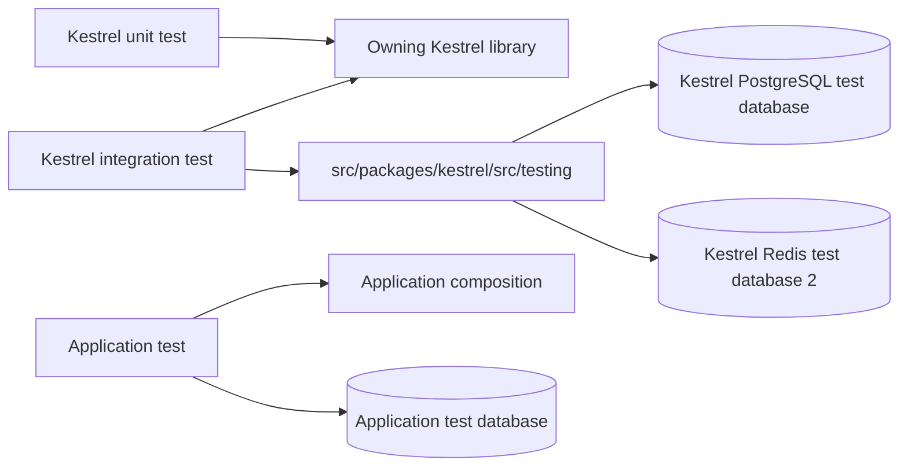
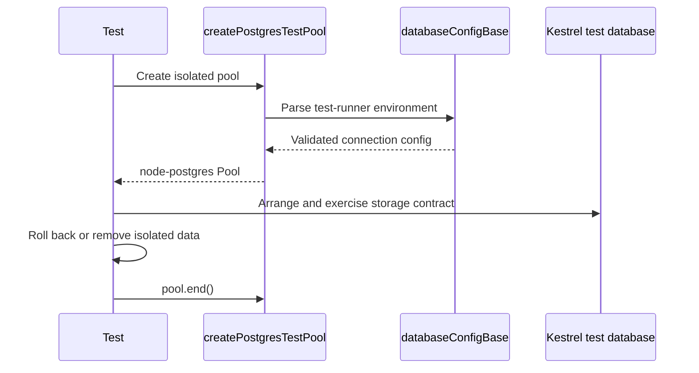

# Testing

[Documentation](../README.md) · [Implementation index](./README.md) · [Usage guide](../usage/testing.md)

Vitest is the default test runner for unit and integration tests.
Playwright may be used later for end-to-end browser tests, but not now.

Fastify HTTP bindings are tested with `fastify.inject()`.

## Concepts and model

Kestrel unit tests exercise one library without application composition. Kestrel integration tests compose only the lower-level Kestrel dependencies they need and use dedicated PostgreSQL or Redis test databases. Application tests remain outside `src/packages/kestrel/src` and verify application policy and composition rather than retesting generic library behavior.



## Usage guide

For application setup and task-oriented examples, see the [Testing usage guide](../usage/testing.md).

## Design and implementation

The helpers stay below `src/packages/kestrel/src/testing` so Kestrel tests never depend on application bootstrap, application schema or application test support. The PostgreSQL helper reuses `databaseConfigBase` validation, reads only test-runner connection variables and defaults to the isolated `kestrel_test` database. It does not run migrations or own schema setup beyond the pool it returns.

Tests must remain compatible with Vitest's `--no-isolate` mode. Mutable global state, fake timers, event listeners, dependency overrides and resources must be restored explicitly.

## Execution scenario



## Public API

| Module export | Purpose |
| --- | --- |
| `createPostgresTestPool()` from `src/packages/kestrel/src/testing/postgres.ts` | Creates a validated pool targeting the Kestrel integration-test database. |
| `createRedisTestContext()` from `src/packages/kestrel/src/testing/redis.ts` | Connects to Redis database 2 and returns a client, unique key prefix and cleanup operation. |
| `testHttpAccess` from `src/packages/kestrel/src/testing/http_access.ts` | Supplies an explicit unrestricted HTTP access policy for Kestrel tests. |

The testing library has no adapter API. Tests use the same public adapter contracts and bundled implementations as production libraries; the helpers only provide isolated test composition.

Local integration tests use dedicated databases inside the same PostgreSQL instance. Application tests use the application-configured test database, while Kestrel tests use the database selected by `KESTREL_TEST_DATABASE`, defaulting to `kestrel_test`; the repository-owned `infra:prepare` command creates the framework test database idempotently, independently of playground initialization. Kestrel-only helpers live in `src/packages/kestrel/src/testing`, keeping Kestrel tests inside the same source boundary. Application runtime test support lives separately in `src/server/tests` and must never be imported by Kestrel code or tests. `createPostgresTestPool()` reads the test runner's `DB_HOST`, `DB_PORT`, `DB_USER`, `DB_PASSWORD`, `DB_SSL` and `KESTREL_TEST_DATABASE` variables and otherwise uses local development defaults.
Transaction rollback isolation is to be used between unit tests using the database.

Specs in the form of comments may help drive the tests, there's an example in [Actions](./actions.md).

## Redis integration tests

Redis integration tests use the existing development Redis service and logical database `2`. The test helper reads only `KESTREL_TEST_REDIS_URL`, defaults to `redis://127.0.0.1:56379/2`, and rejects URLs that do not explicitly select `/2`. Container runs use `redis://redis:6379/2`; the dev-container environment provides it after rebuilding. It deliberately does not fall back to the application's `REDIS_URL`. The framework test client is `@redis/client`, installed as a development dependency after a script-disabled lockfile security preflight.

`createRedisTestContext()` returns `{ client, keyPrefix, dispose }`. Connections and commands have bounded timeouts, with reconnection and offline queuing disabled so unavailable infrastructure fails tests instead of hanging or silently skipping them. The helper installs an error listener and reports asynchronous client failures at cleanup. Every context creates its own UUID-based `kestrel:test:` prefix. All test-created keys must remain under that prefix, including alternate adapter prefixes and manually inserted corrupt entries.

Cleanup scans and unlinks only that context's prefix, then closes its socket and removes its error listener even if cleanup fails. Never use `FLUSHDB` or `FLUSHALL`: other suites and developers can use the same logical database concurrently. Tests do not modify global Redis configuration or select application databases. An interrupted process can leave keys behind; their random prefixes prevent collisions, but automatic stale-test cleanup remains a possible future addition.

```sh
npm run test:ai -- src/packages/kestrel/src/cache/adapters/redis src/packages/kestrel/src/testing/redis.test.ts
```

The cache adapter suite checks that Redis reports `db=2`, validates the absolute TTL with `PEXPIRETIME`, and polls the physical key until native expiration removes it. Those TTL checks use real time because fake timers cannot advance the Redis server clock. Separate unit tests use injected transports for controlled failure paths. Missing infrastructure is a test failure, not an automatic skip.

## Specific rules

Here are some specific rules gathered over time:

- Don't test configuration files

The repository Compose services use dedicated host ports 55432 (PostgreSQL) and 56379 (Redis). See [infrastructure setup](../usage/installation.md#independent-integration-test-infrastructure). PostgreSQL and Redis helpers are repository test infrastructure and are excluded from the runtime archive; the HTTP policy fixture has an explicit testing subpath.
