# Throttling

[Documentation](../README.md) · [Implementation index](./README.md) · [Usage guide](../usage/throttling.md)

Kestrel provides a transport-independent throttling library in `src/packages/kestrel/src/throttling`. Its purpose is to protect external dependencies and local resources by deciding whether work may start now, should wait, should be deferred or must be rejected.

The public name is **throttling** because the library regulates more than request counts. Internally, the central concept is admission control: rate quotas, concurrent capacity, dependency health and local resource pressure all contribute to one admission decision without pretending that they share the same lifecycle or storage model.

This document defines the expected API and implementation plan. API details may be refined during implementation, but the simple usage and semantic guarantees should remain stable.

Phases 1 through 7 are implemented. The current library provides simple and composed rate definitions, process-local continuous token buckets, concurrency limits, circuit breakers and local resource-pressure gates, exact and leased PostgreSQL coordination, multidimensional costs, classified external feedback, immediate or bounded FIFO admission, cancellation, terminal permits, advisory inspection, storage-neutral instrumentation, typed observations and worker admission control. Adaptive concurrency and learned costs remain planned phases.

## Goals

The library should:

- keep a simple external API rate limit simple to declare and use;
- support request-per-second, request-per-minute and other quota periods;
- compose several independent constraints with AND semantics;
- support weighted and multidimensional costs;
- protect both process-local and application-wide capacity;
- expose bounded waiting and cancellation;
- let workers account for dependency availability before starting handlers;
- report enough state for optional feature degradation without making inspection authoritative;
- react conservatively when authoritative throttling state is unavailable;
- support exact, leased and explicitly approximate distributed coordination;
- support deterministic local resource-pressure signals and later incorporate adaptive capacity control.

The library does not infer dependency costs, adapt limits automatically, coordinate pressure across processes or provide every distributed coordination strategy at once.

## Current surface

The implemented files live in `src/packages/kestrel/src/throttling`. `ThrottlingManager` receives a `RateLimitAdapter` and resolved options. `MemoryRateLimitAdapter` owns process-local bucket state, `PostgresRateLimitAdapter` owns authoritative shared state, and `LeasedRateLimitAdapter` consumes bounded PostgreSQL grants locally. The application-facing dependency descriptor is `throttlingDependency`; `ThrottlingProvider` composes exact and leased capabilities behind the same API.

The current public surface includes:

- `defineRateLimit()` with `milliseconds()`, `seconds()` and `minutes()` duration helpers;
- `defineAdmissionPolicy()`, `rateLimit()`, `concurrencyLimit()` and `circuitBreaker()` for AND composition;
- `localResourcePressure()` with cached CPU, heap, RSS, event-loop-delay and injectable custom signals;
- `ThrottlingManager.acquire()` and the preferred `ThrottlingManager.run()`;
- multidimensional estimated and actual costs, with one request unit as the simple default;
- atomic shared-rate reservation, process-local concurrency held until completion, and process-local circuit health;
- advisory `inspect()` without reservation or state creation;
- immediate typed rejection with a safe `retryAt`;
- explicit `maxWaitMs` and cooperative `AbortSignal` cancellation;
- a global `maxPendingAcquisitions` bound and FIFO ordering per logical limit;
- one active cancellable sleep per logical limit rather than one timer per waiter;
- idempotent manager closing and single-completion permits;
- `throttling.acquisition`, `throttling.completion`, `throttling.reconciliation`, `throttling.lease`, `throttling.circuit` and `throttling.pressure` instrumentation.

The memory adapter is deliberately process-local. A memory manager provides application-wide behavior only when the application itself has one process. The standard provider now uses exact PostgreSQL coordination so the same definition and public API enforce one application-wide bucket across processes.

## Usage guide

For application setup and task-oriented examples, see the [Throttling usage guide](../usage/throttling.md).

## Public API

| API group | Main exports |
| --- | --- |
| Definitions | `defineRateLimit()`, `defineAdmissionPolicy()`, `rateLimit()`, `concurrencyLimit()`, `circuitBreaker()`, `localResourcePressure()` and definition/constraint option types |
| Durations | `milliseconds()`, `seconds()`, `minutes()`, `throttlingDurationToMs()` |
| Runtime | `Throttling`, `ThrottlingManager`, permit, completion, run, acquire, inspect, availability, cost and feedback types |
| Composition | `ThrottlingProvider`, `throttlingConfigBase`, `throttlingDependency` and provider/resource option types |
| Pressure | `LocalResourcePressureMonitor`, Node pressure source, built-in process signal definitions and evaluation/state types |
| Instrumentation | observation definitions, recording helper and instrumentation event types |
| Adapters | memory, PostgreSQL, leased, denial-caching and backend-failure adapters plus their options and PostgreSQL schema exports |
| Errors | typed rejection, timeout, cancellation, lifecycle, capability, cost, backend, circuit and pressure failures |

## Adapter API

`RateLimitAdapter.reserve()` atomically evaluates and consumes one qualified rate reservation using authoritative store time. `reserveMany()`, when implemented, must apply AND semantics atomically: either every request is admitted or none is consumed. `inspectMany()` is read-only and advisory. `reconcile()` applies actual-cost adjustments to earlier reservations without inventing admission guarantees. `close()` releases adapter-owned resources and must be idempotent.

`LeasableRateLimitAdapter.allocateLeases()` atomically returns exact reservations or bounded grants for all requested dimensions and may accept unused units from completed leases in the same operation. Lease ids and expiry must prevent stale owners from returning or spending units after reassignment. `returnLeases()` returns only still-owned unused units. `PrunableRateLimitAdapter.prune()` removes a bounded amount of expired state without changing live quota semantics.

Adapters must use the normalized key, rate definition, burst, period and cost supplied by the manager, preserve a safe authoritative `retryAt`, and reject backend failures instead of reporting ordinary quota denial. Wrapper adapters must document whether they cache denials, provide emergency-local behavior or trade exactness for leases; they cannot silently change the policy selected by composition.

## Conceptual layers

Throttling groups several related layers behind one facade while keeping their responsibilities distinct:

| Layer | Responsibility | Examples |
| --- | --- | --- |
| Quotas | Enforce contractual budgets | RPS, RPM, tokens per minute, daily units |
| Capacity | Protect instantaneous resources | Maximum concurrency, CPU, memory, event-loop delay |
| Health | React to dependency failures | Circuit breaker, throttling responses, timeouts |
| Admission | Decide what happens to one operation | Run, wait, defer or reject |
| Integrations | Apply decisions in Kestrel consumers | API clients, workers, optional features |

These constraints have different lifecycles. A rate token is normally consumed, a concurrency permit must be released, a circuit breaker records the outcome, process pressure is local, and a quota shared by credentials may require application-wide coordination.

### Conceptual model

The public facade accepts either the simple rate-limit shorthand or an admission policy composed from one or more independent constraints. The manager compiles that immutable definition, evaluates process-local constraints itself, delegates shared rate state to an adapter and returns a terminal permit. Integrations depend on the facade rather than on a concrete storage strategy:

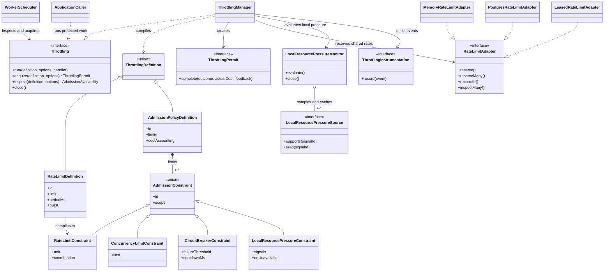

The model deliberately separates decision semantics from state ownership:

| Component | Owns | Does not own |
| --- | --- | --- |
| Definition | Immutable intent, identifiers, thresholds and guarantees | Runtime counters or connections |
| `ThrottlingManager` | Composition, waiting, local concurrency, circuits and permit lifecycle | Authoritative distributed rate state |
| `RateLimitAdapter` | Rate reservation guarantees and storage protocol | Handler execution or local pressure policy |
| `LocalResourcePressureMonitor` | Shared short-lived signal snapshots and hysteresis | PostgreSQL state or adaptive concurrency |
| Permit | One admitted execution's terminal completion | Reusable or transferable capacity |
| Integration | When to inspect, acquire, defer, shed or execute work | Reimplementation of throttling algorithms |

### Runtime model

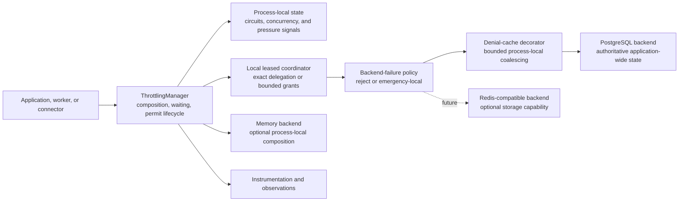

The manager owns policy semantics and local lifecycle state. Adapters own rate-state guarantees and storage operations. This boundary lets the simple API remain stable while exact, leased, memory or future Redis-compatible coordination use different storage mechanics.

## Simple API

The common case uses `defineRateLimit()` and the `Throttling.run()` facade:

```ts
export const partnerApiLimit = defineRateLimit({
  id: "partner-api",
  requests: 20,
  per: seconds(1),
});

// Admission and permit completion are handled automatically.
const account = await throttling.run(
  partnerApiLimit,
  () => partnerApi.getAccount(),
);
```

This shorthand has documented defaults:

- one execution costs one `requests` unit;
- a token bucket controls the rate;
- burst capacity equals the declared period capacity unless overridden;
- a directly constructed memory adapter is process-local;
- the standard provider uses application-wide exact PostgreSQL coordination;
- exhaustion rejects immediately with a typed error;
- a throttling backend failure rejects rather than bypassing protection;
- duration and terminal outcome are instrumented automatically;
- no adaptive behavior is enabled.

Integrations that apply one stable rate definition to many independent identities can provide a bounded `rateKey`. The manager partitions only the rate-limit storage keys; it still registers and validates the immutable definition by its stable identifier, so dynamic identities do not grow the definition registry:

```ts
await throttling.run(
  authenticationUsernameLimit,
  { rateKey: keyedUsernameDigest },
  verifyPassword,
);
```

`rateKey` is limited to 256 characters and must contain a non-empty opaque partition value. Callers remain responsible for privacy: authentication uses an HMAC digest rather than putting normalized usernames or raw IP addresses into operational storage keys. The same option is accepted by `acquire()` and advisory `inspect()` calls.

Waiting is explicit, bounded and cancellable:

```ts
const account = await throttling.run(
  partnerApiLimit,
  {
    maxWaitMs: 2_000,
    signal,
  },
  () => partnerApi.getAccount(),
);
```

The application keeps a small integration exercise in `src/server/tests`: `POST /api/tests/throttling` runs a log-only simulated task through an exact five-request-per-minute definition. Its dedicated `testCatalog` keeps this diagnostic behavior separate from business and core application modules while still exercising the ordinary HTTP and throttling composition path. Restricting test catalogs to selected environments or audiences remains a future application-level policy when these exercises must not be exposed by every deployment.

`maxWaitMs` starts before the first adapter reservation attempt and bounds the complete admission wait. It is not a timeout for the protected operation. Callers should pass the same `AbortSignal` to the dependency when they need one wider operation deadline.

Waiting follows FIFO order within one logical limit. `ThrottlingManagerOptions.maxPendingAcquisitions` bounds the total number of queued acquisitions across limits and defaults to 1,000. A full queue raises `ThrottlingQueueFullError` rather than allocating an unbounded waiter. `close()` rejects pending waiters, prevents later acquisitions and can be awaited repeatedly.

## General definitions

`defineRateLimit()` compiles to the same internal representation as the advanced `defineAdmissionPolicy()` helper. Advanced definitions can combine limits with independent units, scopes and coordination needs:

```ts
export const aiProviderAdmission = defineAdmissionPolicy({
  id: "ai-provider",
  limits: [
    rateLimit({
      id: "requests-per-minute",
      unit: "requests",
      limit: 500,
      per: minutes(1),
      burst: 20,
      scope: "application",
    }),
    rateLimit({
      id: "tokens-per-minute",
      unit: "tokens",
      limit: 100_000,
      per: minutes(1),
      scope: "application",
    }),
    concurrencyLimit({
      id: "local-concurrency",
      limit: 8,
      scope: "process",
    }),
    circuitBreaker({
      id: "provider-health",
      failureThreshold: 5,
      cooldown: seconds(30),
      halfOpen: {
        maxConcurrentProbes: 1,
        successThreshold: 1,
      },
    }),
    localResourcePressure({
      id: "provider-process-pressure",
      signals: {
        "process.event-loop-delay-p99-ms": {
          degradedAt: 100,
          limitedAt: 250,
        },
      },
    }),
  ],
});
```

Rate, concurrency, circuit and pressure constraints remain separate even when they participate in one admission definition. Constraint identifiers address shared state within the provider namespace: reusing an identifier across policies intentionally shares the same rate, capacity, circuit health or pressure state and requires an identical kind and configuration. Conflicting reuse is rejected before admission. Rate definition conflicts are additionally protected by PostgreSQL columns; circuit, concurrency and pressure conflicts are local because their state is process-local.

## Costs

Costs are a record of independent dimensions rather than one universal Request Unit. A provider that exposes one scalar Request Unit can still use a single dimension, while a more complex provider can retain its real constraints:

```ts
const response = await throttling.run(
  aiProviderAdmission,
  {
    estimatedCost: {
      requests: 1,
      tokens: estimateTokens(prompt),
    },
    signal,
  },
  async (context) => {
    const result = await aiClient.generate(prompt);

    // Report the authoritative usage returned by the provider.
    context.reportActualCost({
      requests: 1,
      tokens: result.usage.totalTokens,
    });

    return result;
  },
);
```

Simple callbacks may ignore the context argument. The advanced context reports actual cost once after the dependency exposes authoritative usage.

Every rate dimension needs a finite non-negative estimate before admission, and unknown or missing dimensions are rejected. Zero skips reservation for that dimension. Connector-specific definitions own defaults such as read, write, row or byte weights because the generic library cannot assign portable costs to those operations.

Reporting actual usage is diagnostic by default so observations can guide manual estimate changes without adding storage work or changing admission state. A composed policy can select another behavior explicitly:

```ts
const policy = defineAdmissionPolicy({
  id: "ai-provider",
  limits: [/* ... */],
  costAccounting: {
    reconciliation: "disabled", // Default: observe only.
  },
});
```

`disabled` records estimated and actual costs without adjusting buckets. `synchronous` reconciles before permit completion and prioritizes ordered state over completion latency. `asynchronous` releases local capacity and returns first, then tracks a best-effort adjustment during graceful shutdown and emits a separate terminal observation. Asynchronous adjustment can temporarily expose stale capacity, can be reordered with later admissions and can be lost on a crash, so it is explicitly less precise. A durable ordered outbox or provider-side usage import remains a possible later mode for crash-safe deferred accounting.

When reconciliation is enabled, underestimation deducts the difference and may make token state negative, creating debt that delays later admissions. Overestimation refunds the difference without exceeding burst capacity. Without an actual report, including on operation failure, the estimate remains consumed.

### Learned costs

The initial implementation uses declared costs, a default cost of one for simple calls, or a deterministic function of an input. Captured actual usage is initially diagnostic and supports reconciliation only.

A future `CostEstimator` may aggregate prior executions with an exponentially weighted moving average, percentile or input class. A plain average is not conservative for skewed workloads, so an estimator should retain a declared floor and safety margin:

```text
estimated cost = max(declared floor, learned estimate + safety margin)
```

Learned profiles will need an explicit identity, version, sample count, cold-start policy and reset behavior. They must not become an implicit source of truth until those semantics are defined.

## Admission lifecycle

`run()` is the recommended API because it guarantees terminal permit completion. Integrations that cannot express their work as one callback may acquire a permit directly:

```ts
const permit = await throttling.acquire(aiProviderAdmission, {
  estimatedCost: {
    requests: 1,
    tokens: 500,
  },
  signal,
});

try {
  const response = await aiClient.generate(prompt);

  await permit.complete({
    outcome: "success",
    actualCost: {
      requests: 1,
      tokens: response.usage.totalTokens,
    },
  });
} catch (error) {
  await permit.complete({
    outcome: "failure",
  });

  throw error;
}
```

A permit can be completed only once. Completion follows the policy's actual-cost reconciliation mode and always releases concurrency capacity, including when validation or synchronous storage reconciliation fails. The default observation-only mode records actual cost without calling storage. When both the protected operation and synchronous permit completion fail, `run()` preserves both failures in an `AggregateError`. An asynchronous reconciliation failure is reported through instrumentation and never changes an operation result that has already returned.

### Composed acquisition

AND composition requires more than checking every constraint independently. The manager must avoid consuming one reservation and then leaking it when a later constraint rejects the operation.

Constraints sharing the PostgreSQL adapter are reserved atomically in a transaction. Rows are processed in stable key order to avoid opposite lock orders between overlapping policies. A rejected dimension rolls the complete transaction back, including newly created buckets and successful sibling dimensions.

Process-local concurrency is the reversible preparation step. The manager checks and increments every local constraint synchronously, attempts the atomic shared-rate commit, and releases all local capacity if the adapter rejects or fails. A caller waiting for rate never immobilizes concurrency. Successful permits retain their local capacity until terminal completion. Future heterogeneous non-reversible stores would require a broader prepare and commit protocol; they are not silently composed by the current capability contract.

A process-local concurrency limit protects resources owned by one process, such as outbound sockets, memory, CPU-heavy work or a local executor. It is not an exact approximation of a global concurrency quota. Dividing a global maximum statically between replicas can underuse capacity when load is uneven, while rounding upward can exceed the global maximum. A contractual application-wide concurrency limit therefore needs expiring distributed permits or bounded leases and remains a separate future capability.

## Circuit breaking and external feedback

Circuit breaking is explicit and process-local. A localized failure therefore protects the affected process without automatically opening every replica:

```ts
const partnerAdmission = defineAdmissionPolicy({
  id: "partner-operation",
  limits: [
    circuitBreaker({
      id: "partner-health",
      failureThreshold: 5,
      cooldown: seconds(30),
      halfOpen: {
        maxConcurrentProbes: 1,
        successThreshold: 1,
      },
    }),
    rateLimit({
      id: "partner-requests",
      unit: "requests",
      limit: 100,
      per: minutes(1),
    }),
  ],
});
```

`failureThreshold` counts consecutive `transient` and `timeout` feedback. A successful completion resets the count. `permanent` feedback, such as a valid dependency response that rejects application input, is considered evidence that the dependency is reachable: it also resets the count and satisfies a half-open probe. An unclassified failed completion is conservatively classified as `transient`.

```ts
await throttling.run(partnerAdmission, {
  estimatedCost: { requests: 1 },
}, async ({ reportFeedback }) => {
  try {
    return await partner.call();
  } catch (error) {
    if (isTimeout(error)) reportFeedback({ kind: "timeout" });
    else if (isPermanentProviderError(error)) {
      reportFeedback({ kind: "permanent" });
    }
    throw error;
  }
});
```

Feedback is invocation-wide and can also accompany a successful operation result. This supports callers that return a fallback after a dependency failure while still updating circuit health. It can be reported once through `ThrottlingRunContext.reportFeedback()` or supplied to `permit.complete()`. The supported failure classifications are `transient`, `timeout`, `permanent`, and `throttled`.

A `throttled` feedback opens the circuit immediately without waiting for the ordinary failure threshold. A future valid `retryAt` is used as the open deadline; an absent or elapsed deadline falls back to the configured cooldown, while an invalid date is rejected by feedback validation. This feedback gate does not refund, consume, accelerate, or otherwise modify static rate tokens.

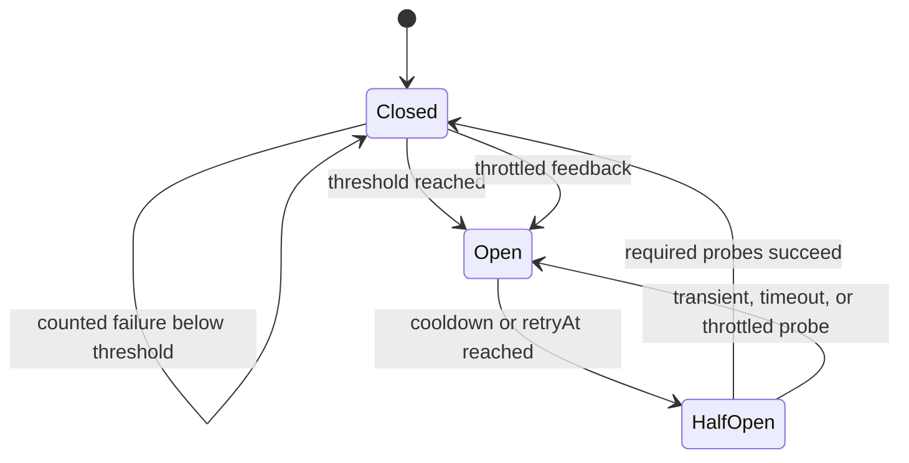

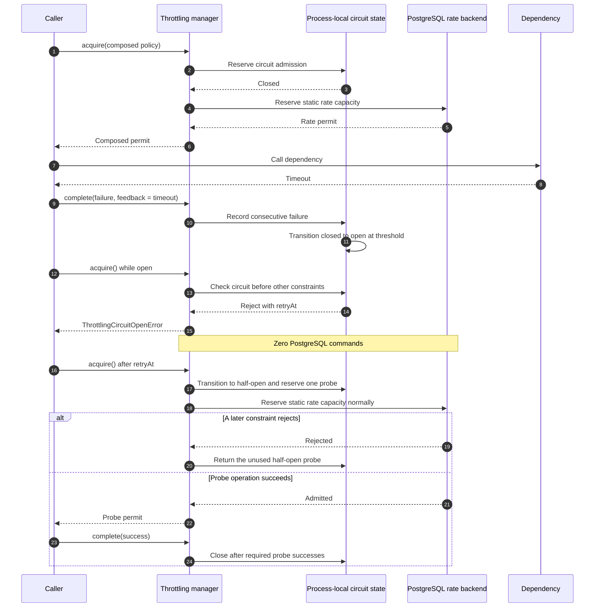

The circuit check is the first reversible preparation step. An open circuit therefore adds no PostgreSQL work. Half-open probe capacity is independent from rate and concurrency capacity, but an admitted probe must still satisfy and consume the other declared constraints. If concurrency or rate admission later fails, the manager returns the unused probe immediately. Probe completions carry a circuit generation; a late completion from a previous closed or half-open generation cannot close or reopen newer state.

Bounded `maxWaitMs` acquisitions sleep until the circuit deadline and then compete for half-open probe capacity. Excess probes remain locally rejected or queued until an active probe completes. `inspect()` exposes open circuits and saturated half-open probes as `kind: "circuit"` reasons without reserving a probe.

HTTP classification is deliberately deferred. This phase does not change the HTTP client or inspect transport-specific errors and headers automatically; integrations explicitly translate their own results into the transport-neutral feedback contract.

## Local resource pressure

Local pressure is an explicitly declared process-scoped constraint. It is evaluated before circuits, concurrency and rate capacity, so a pressured process consumes no half-open probe, handler slot, rate token or PostgreSQL round trip:

```ts
const workerProcessPressure = localResourcePressure({
  id: "worker-process",
  signals: {
    "process.cpu": {
      degradedAt: 0.75,
      limitedAt: 0.9,
    },
    "process.heap": {
      degradedAt: 0.8,
      limitedAt: 0.9,
    },
    "process.event-loop-delay-p99-ms": {
      degradedAt: 100,
      limitedAt: 250,
    },
  },
});

export const workerProcessPressurePolicy = defineAdmissionPolicy({
  id: "worker-process-pressure",
  limits: [workerProcessPressure],
});

// A pressure-only policy needs no estimated cost and performs no rate storage call.
await throttling.run(
  workerProcessPressurePolicy,
  { maxWaitMs: 1_000, signal },
  () => runCpuIntensiveStep(signal),
);
```

The standard Node source exposes:

| Signal | Unit and meaning |
| --- | --- |
| `process.cpu` | CPU core equivalents used by the process during the sample; `1` means one fully occupied core |
| `process.heap` | V8 heap usage divided by the V8 heap limit |
| `process.rss-bytes` | Resident set size in bytes, allowing deployment-specific absolute thresholds |
| `process.event-loop-delay-p99-ms` | p99 event-loop delay in milliseconds over the cached sampling window |

Applications can contribute additional `LocalResourcePressureSource` instances through `ThrottlingProviderOptions`, for example a bounded executor or worker queue depth. Stable signal identifiers are configuration, not payload-derived labels.

```ts
class ExecutorQueuePressureSource implements LocalResourcePressureSource {
  public constructor(
    private readonly executor: { readonly pending: number },
  ) {}

  public supports(signalId: string): boolean {
    return signalId === "executor.pending";
  }

  public read(signalId: string): number | undefined {
    // The monitor calls read only for identifiers accepted by supports().
    return this.supports(signalId) ? this.executor.pending : undefined;
  }
}

const executorPressure = localResourcePressure({
  id: "local-executor",
  signals: {
    "executor.pending": {
      degradedAt: 50,
      limitedAt: 100,
      recoveryRatio: 0.8,
    },
  },
});

app.register(new ThrottlingProvider(throttlingConfig, {
  resourcePressureSources: [
    new ExecutorQueuePressureSource(executor),
  ],
}));
```

The provider owns contributed sources and closes them with its singleton monitor. A custom reader should return quickly, avoid I/O and expose a cached or constant-time gauge; the monitor supplies cross-policy caching and sampling cadence. The `executorPressure` constraint can then be composed into any admission policy like the built-in signals.

Each signal uses deterministic thresholds and recovery hysteresis. `recoveryRatio` defaults to `0.9`, so a signal must fall below 90% of an exceeded threshold before leaving that state:

| State | Admission | Inspection |
| --- | --- | --- |
| `healthy` | Admit | `available` when no other constraint blocks |
| `degraded` | Admit | `degraded` with pressure reasons, allowing optional feature shedding |
| `limited` | Reject locally | `limited` with signal identifiers and sampled values |
| `unknown` with `onUnavailable: "reject"` | Reject locally by default | `unknown` |
| `unknown` with `onUnavailable: "ignore"` | Admit explicitly | `degraded` so loss of visibility remains visible |

`ThrottlingResourcePressureError` is a local `ThrottlingRejectedError` without `retryAt`: resource recovery has no safe wall-clock deadline. A bounded acquisition waits until the shared snapshot expires and retries, while still respecting the manager's global waiter bound, timeout and cancellation.

### Shared progressively precise sampling

Reading process metrics for every acquisition would duplicate work and give concurrent callers slightly different views. `LocalResourcePressureMonitor` therefore keeps one short-lived snapshot per signal and shares it across policies. Cache durations use a monotonic clock and are selected from configurable bounded intervals:

```ts
const resourcePressureSampling = {
  healthyIntervalMs: 1_000,
  nearThresholdIntervalMs: 500,
  pressuredIntervalMs: 250,
  nearThresholdRatio: 0.2,
};
```

- healthy and farther than `nearThresholdRatio` below the degraded threshold uses `healthyIntervalMs`;
- healthy but near the degraded threshold uses `nearThresholdIntervalMs`;
- degraded, limited or unavailable uses `pressuredIntervalMs`;
- validation requires `pressuredIntervalMs <= nearThresholdIntervalMs <= healthyIntervalMs`.

The healthy interval remains a hard maximum staleness bound. Pressure can jump because of already-running or external work, so the cache is never allowed to grow without bound merely because the previous sample had headroom. The event-loop histogram starts lazily only when its signal is read, and the monitor closes every source with the throttling manager.

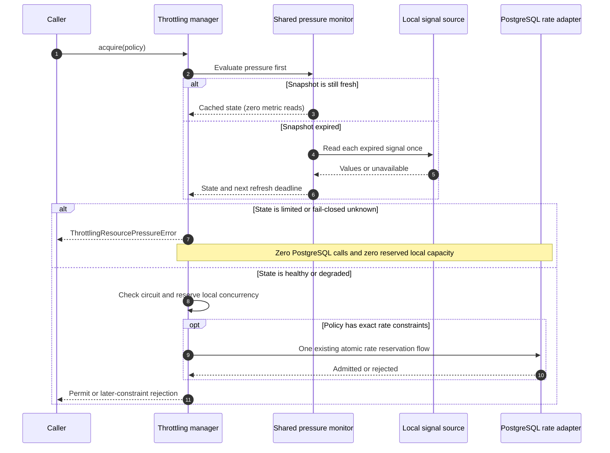

For a pressure-only policy, an admission performs zero PostgreSQL calls in every state. For a composed policy, pressure rejection also performs zero calls; an admitted healthy or degraded sample preserves the existing exact or leased backend-call count. `throttling.pressure` records state transitions and rejected signals, while ordinary healthy samples do not create dedicated events.

## Advisory inspection

`inspect()` supports scheduling hints and graceful feature degradation without reserving capacity:

```ts
const availability = await throttling.inspect(aiProviderAdmission, {
  estimatedCost: {
    requests: 1,
    tokens: 500,
  },
});

if (availability.state !== "available") {
  return renderWithoutAiFeatures();
}
```

The result is:

```ts
interface AdmissionAvailability {
  state: "available" | "limited" | "degraded" | "unknown";
  retryAt?: Date;
  reasons: readonly AdmissionReason[];
}
```

Inspection is advisory and may be stale immediately. Only `acquire()` grants permission to start work. Observations are also diagnostic and must never participate in admission decisions.

`available` means every inspected rate, concurrency, and circuit constraint currently fits. `limited` includes explicit rate, concurrency, or circuit reasons and uses the latest known `retryAt`, because an AND policy becomes usable only after all timed constraints recover. `degraded` means the configured emergency-local backend policy currently appears usable. `unknown` means authoritative inspection failed under the conservative backend policy. Inspection does not create missing PostgreSQL rows, consume tokens, increment concurrency, or reserve a half-open probe.

## Execution scenarios and storage cost

The following diagrams describe the current exact PostgreSQL implementation. Let `N` be the number of positive-cost rate constraints, including separate windows over the same cost unit, and let `M` be the number of rate constraints whose estimated and actual costs differ. Process-local circuit and concurrency constraints never add a PostgreSQL statement.

### One warm rate limit

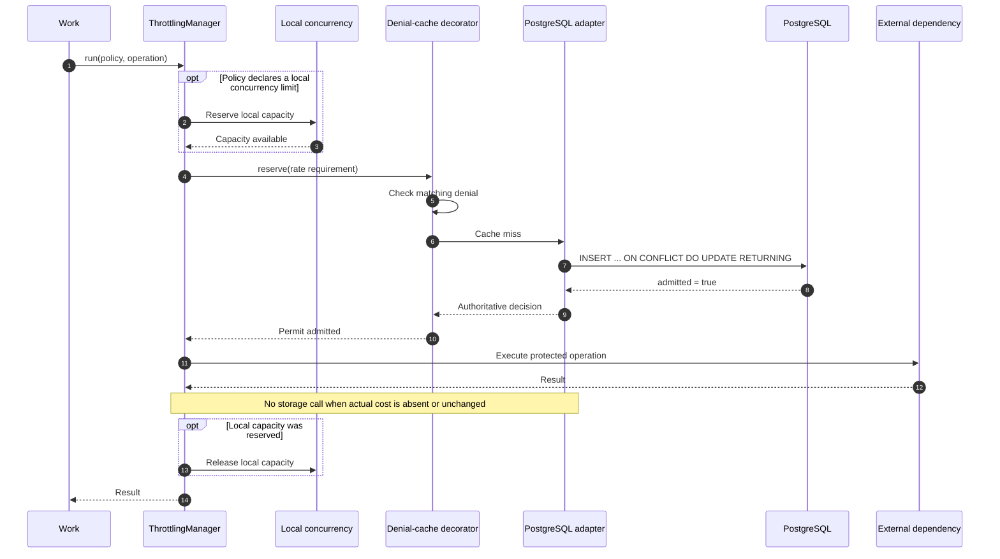

A single-limit acquisition performs one atomic upsert for both warm and missing buckets. PostgreSQL handles a concurrent creator through `ON CONFLICT`; no explicit `BEGIN` or `COMMIT` is needed around this one statement. Definition matching in the conflict branch distinguishes a conflicting policy from an exhausted bucket, and a rejection never deducts its cost.

The conflict update computes its transition through three lateral stages: current available capacity and the direct input cost, admission, then remaining capacity. A grouped assignment persists the resulting tokens, refill timestamp, full timestamp and decision together. This keeps the generated SQL proportional to the transition model instead of recursively expanding the same arithmetic fragments, while retaining one statement, one PostgreSQL time snapshot and the row lock established by the upsert.

The adapter receives the application-scoped database object. Its statement or short batch transaction does not join an ambient business transaction held by the caller. Acquisition may therefore use another pool connection, commits independently from later business work, and never keeps quota row locks open while the external dependency runs. Passing an execution-specific transaction object into the standard throttling provider is not a supported integration model.

### Atomic AND composition

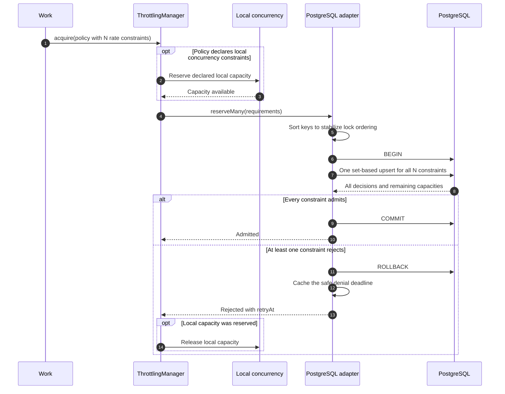

The batch path uses one data statement plus `BEGIN` and `COMMIT` or `ROLLBACK`, independently of `N`. The explicit transaction remains necessary because the upsert returns every individual decision and a rejected sibling must roll successful sibling mutations back. One transaction pins one pool connection for three commands.

Running updates concurrently is not a safe latency optimization. Commands issued on one PostgreSQL transaction connection are serialized by the protocol, while using several connections would create independent transactions and lose the all-or-nothing guarantee. The implemented set-based statement passes sorted requirements through `jsonb_to_recordset`, lets PostgreSQL lock and mutate the rows in stable input order, and returns every decision at once.

A future server-side function or a statement that conditionally writes only when every dimension admits could remove the remaining explicit batch transaction. The current three-command path already removes the previous linear round-trip growth while keeping rollback behavior straightforward and testable.

### Rejection coalescing and waiting

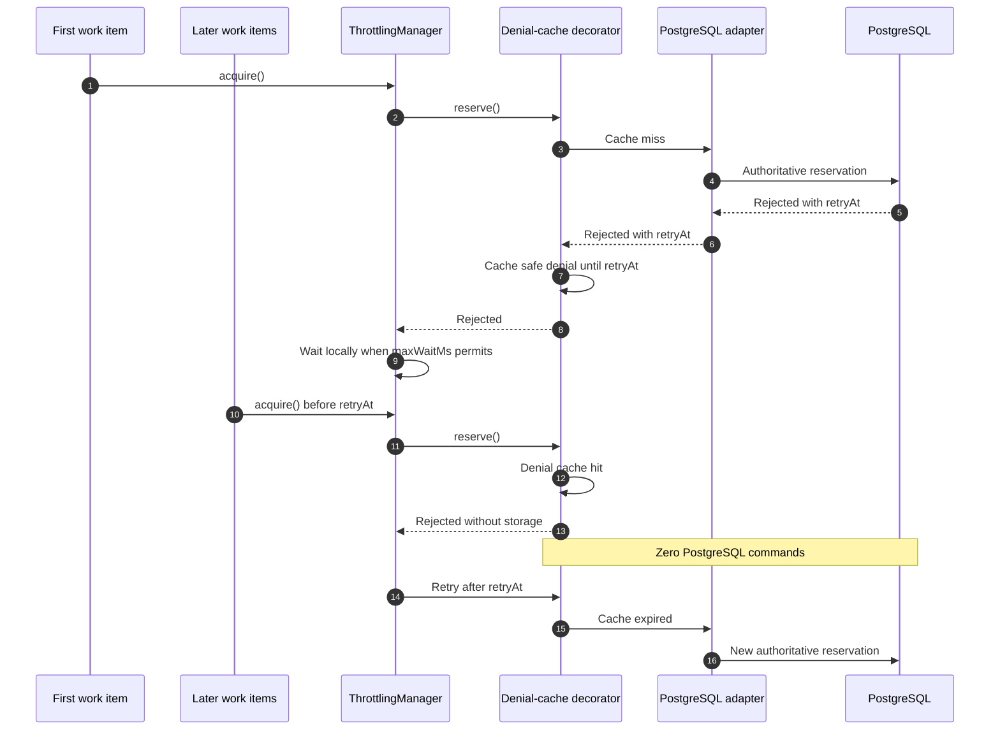

`DenialCachingRateLimitAdapter` is a storage-neutral decorator backed by a bounded monotonic in-memory structure. It serializes only matching reservation signatures: requests waiting behind a rejection reuse its safe deadline, while requests waiting behind a successful admission still perform their own authoritative mutation. Batch denials are keyed by the complete sorted batch signature so a rejected AND composition cannot incorrectly deny an unrelated subset.

The general Kestrel cache remains deliberately unused: that facade is asynchronous, JSON-oriented, fail-open, and may itself use PostgreSQL, while denial coalescing is a small correctness-aware adapter concern. PostgreSQL, Redis or another authoritative adapter can use the same decorator or provide a stronger native equivalent.

When local concurrency is already full, or an immediate request targets a policy that is already queued, the manager rejects or waits locally without calling the rate adapter or PostgreSQL.

### Leased coordination

Leased coordination is opt-in on advanced rate constraints. Every rate constraint in one atomic policy must use the same coordination strategy:

```ts
const providerAdmission = defineAdmissionPolicy({
  id: "provider-api",
  limits: [
    rateLimit({
      id: "requests",
      unit: "requests",
      limit: 500,
      per: minutes(1),
      burst: 500,
      coordination: {
        strategy: "leased",
        maxLeaseUnits: 50,
        leaseMs: 5_000,
        maxOutstandingUnits: 150,
        guardBandUnits: 25,
      },
    }),
  ],
});
```

`maxLeaseUnits` bounds one grant, `leaseMs` bounds how long a process may use it, `maxOutstandingUnits` bounds capacity immobilized by all active processes for one key, and `guardBandUnits` switches replenishment to an exact per-admission mutation near exhaustion. The persisted bucket includes these values and the coordination strategy; replicas using incompatible definitions receive `ThrottlingDefinitionConflictError`.

#### Local fast path

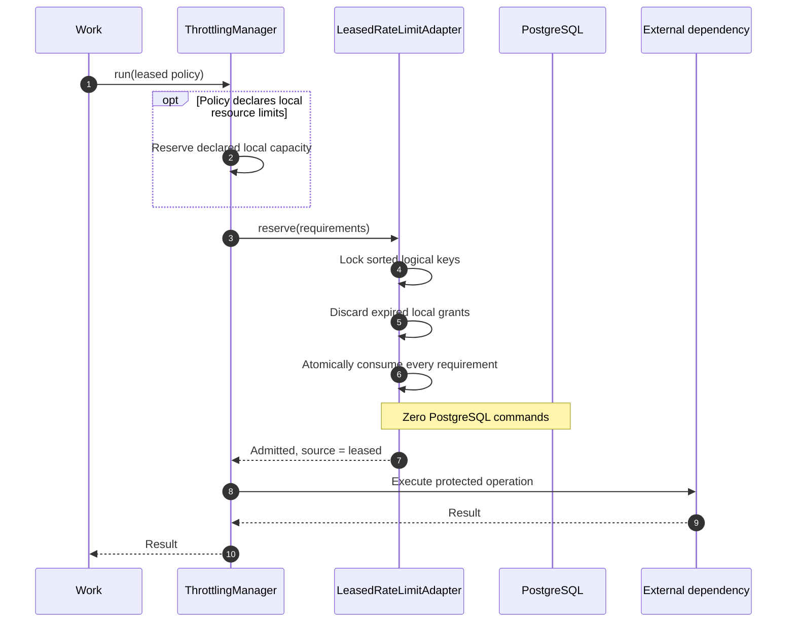

The common fast path is entirely process-local. A multidimensional admission locks all involved local keys in stable order and verifies every dimension before consuming any of them, so a failed dimension cannot partially spend another local grant. Local concurrency is consulted only when the policy explicitly declares a process-local resource constraint.

#### Replenishment and progressive precision

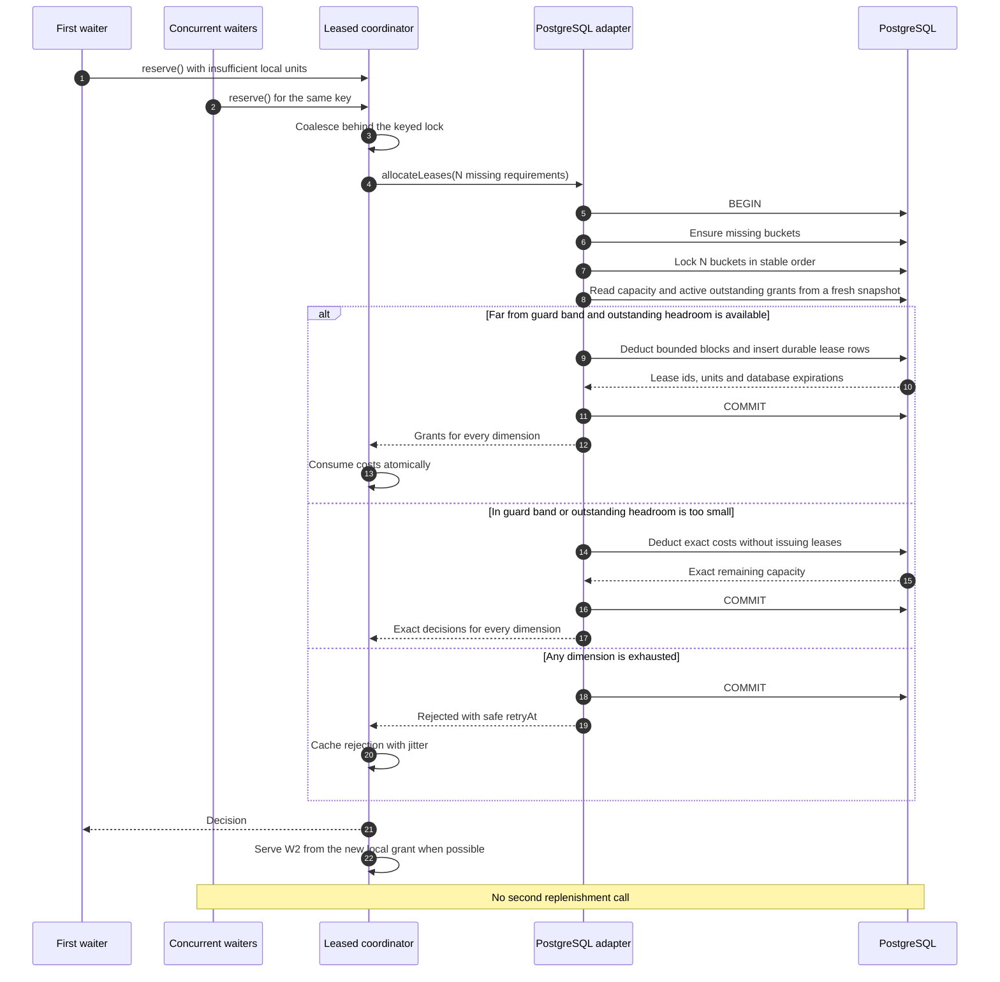

One replenishment handles all missing dimensions in a single transaction, so its command count does not grow with `N`. The current implementation uses six logical PostgreSQL commands for an accepted replenishment: `BEGIN`, bucket creation, stable row locking, a fresh-snapshot capacity read, one set-based bucket-and-lease mutation, and `COMMIT`. The separate post-lock read is intentional under PostgreSQL `READ COMMITTED`: after waiting for another issuer, it must see the leases that issuer committed before enforcing `maxOutstandingUnits`. A rejection uses five commands because it omits the mutation. Reporting exhausted prior leases during replenishment adds one set-based return statement. These infrequent transactions trade more latency per replenishment for zero database latency on each locally admitted operation; a server-side function could reduce round trips while retaining the snapshot boundary if measurements justify the extra SQL complexity.

The allocator grants up to `maxLeaseUnits` while preserving `guardBandUnits` in authoritative storage. It falls back to exact reservation when the available capacity enters that guard band or the global `maxOutstandingUnits` headroom cannot safely cover the current cost. Active outstanding capacity is computed from full issued grants, not optimistic process reports, so quiet or crashed processes can reduce utilization but cannot cause over-admission.

#### Expiration, shutdown and failure

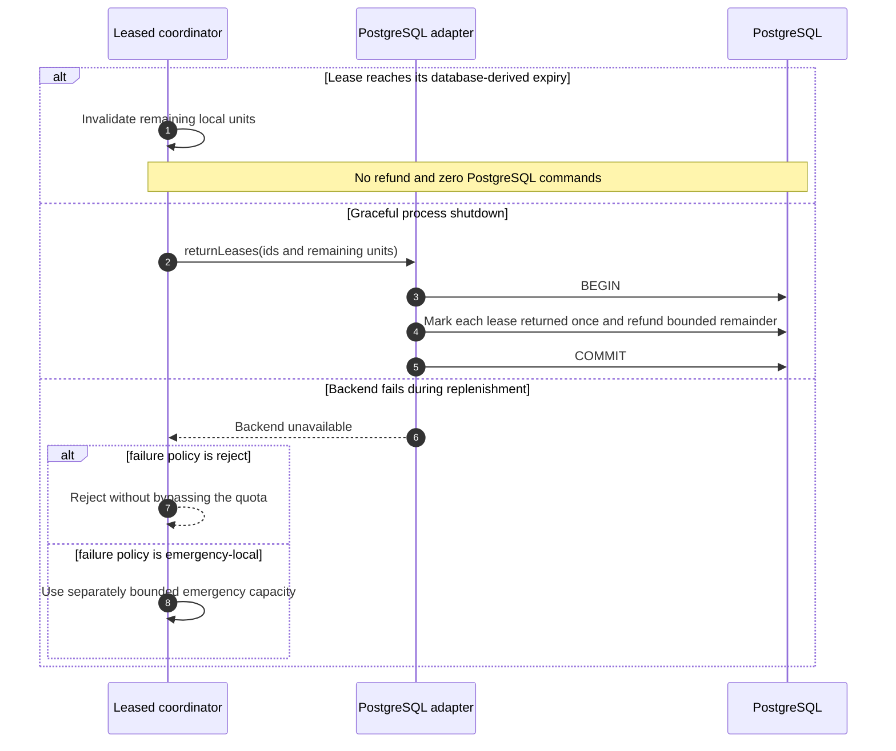

Expiration is deliberately conservative: unused local units are abandoned and are not refunded implicitly. A graceful return is idempotent because the lease UUID is a unique capability token and PostgreSQL marks it returned once; a stale return cannot affect a newer lease. A crash can therefore immobilize capacity until refill and lease pruning, but cannot create extra capacity. Existing unexpired local grants remain usable during a backend outage; only replenishment needs the backend. `throttling.lease` observations report issue, consume, exact fallback, rejection, expiration and return transitions so local/backend admission ratios, utilization and immobilized units can be derived without changing correctness.

### Completion and actual cost

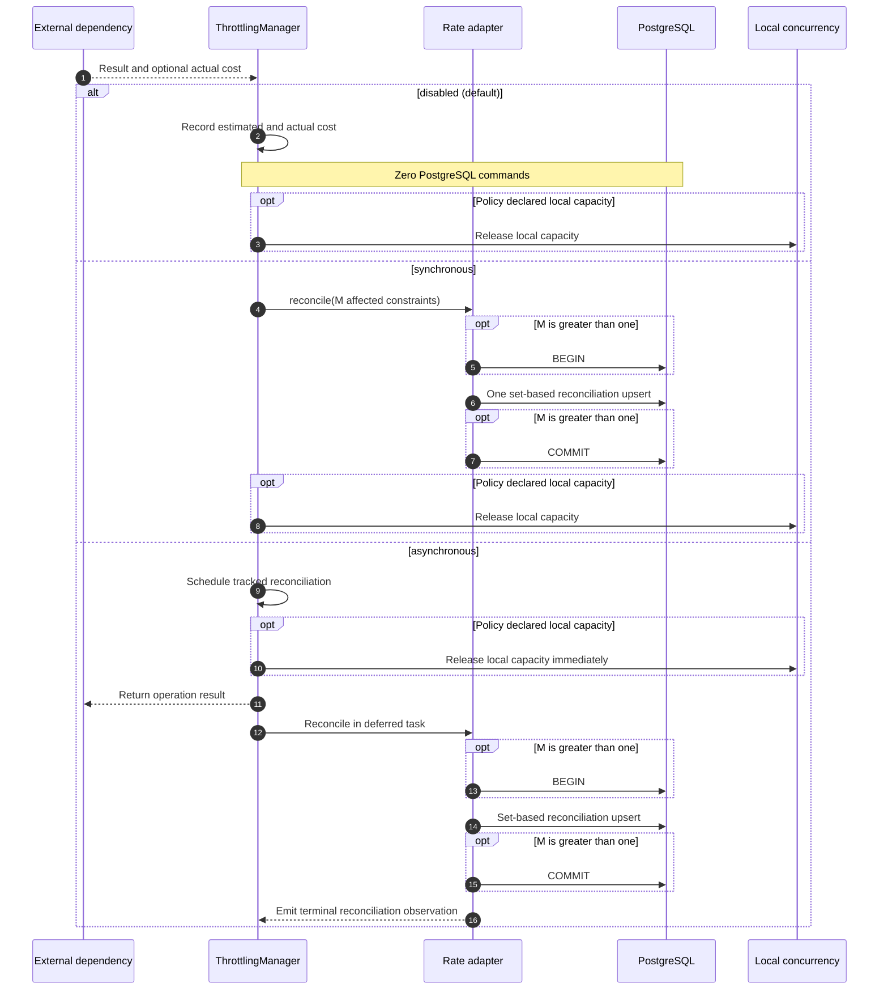

Reconciliation uses one set-based data statement. One affected constraint needs no explicit transaction; multiple constraints use `BEGIN`, the one statement, and `COMMIT` so a definition conflict can roll every adjustment back. Synchronous mode holds declared local capacity until this finishes. Asynchronous mode releases it first, tracks work already launched during graceful manager shutdown and reports success or failure through `throttling.reconciliation`.

Asynchronous mode deliberately accepts temporarily stale capacity, possible reordering with later admissions and loss on a process crash. It is not exact. Crash-safe deferred reconciliation still requires a durable ordered outbox or equivalent protocol.

### Advisory inspection

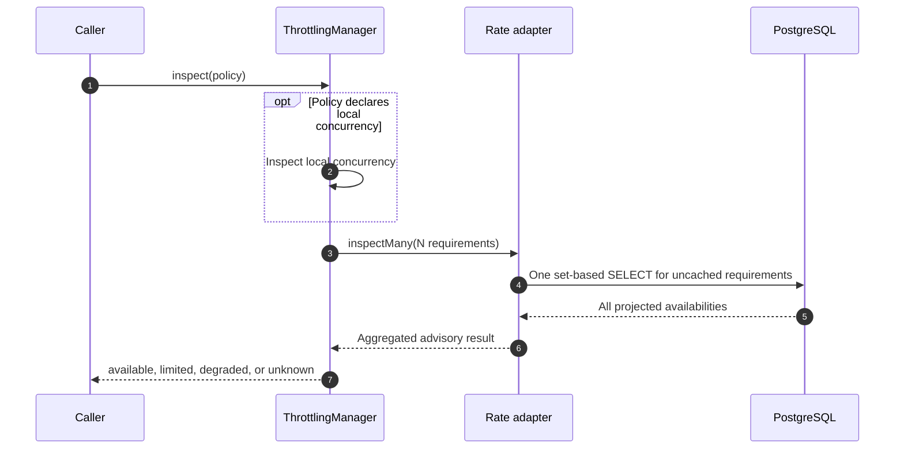

Inspection performs one set-based `SELECT` without an explicit transaction, regardless of `N`. The query joins `jsonb_to_recordset` input against stored buckets, represents missing rows explicitly and uses one database-time snapshot. Cached single-limit denials are resolved by the decorator before the remaining requirements reach PostgreSQL.

### Current round-trip summary

| Scenario | Data statements | Transaction commands | Total logical PostgreSQL commands |
| --- | ---: | ---: | ---: |
| Local concurrency full or concurrency-only policy | 0 | 0 | 0 |
| Denial-cache hit | 0 | 0 | 0 |
| One warm or missing rate limit | 1 atomic upsert | 0 | 1 |
| `N` rate limits | 1 set-based upsert | `BEGIN` + `COMMIT` or `ROLLBACK` | 3 |
| Reconcile one constraint | 1 set-based upsert | 0 | 1 |
| Reconcile `M > 1` constraints | 1 set-based upsert | `BEGIN` + `COMMIT` or `ROLLBACK` | 3 |
| Inspect `N` uncached constraints | 1 set-based `SELECT` | 0 | 1 |
| Leased local admission for `N` constraints | 0 | 0 | 0 |
| Accepted leased replenishment for `N` missing constraints | 4 set-based statements | `BEGIN` + `COMMIT` | 6 |
| Rejected leased replenishment for `N` missing constraints | 3 set-based statements | `BEGIN` + `COMMIT` | 5 |
| Graceful return of any number of leases | 1 set-based statement | `BEGIN` + `COMMIT` | 3 |

If `R` is one application-to-database round trip, exact acquisition adds approximately `R` for one rate constraint and `3R` for an atomic batch, before pool, gate, row-lock and server execution time. Leased acquisition normally adds no database latency and pays approximately `6R` only when a grant must be replenished. The cost no longer grows linearly with `N`. Driver and protocol details can change the number of wire packets, but the application still awaits each logical transaction command. Hot rows serialize exact admissions and every accepted update creates PostgreSQL MVCC, WAL and vacuum work. Denial caching reduces rejected traffic and leased coordination amortizes accepted traffic.

## Exhaustion and failure behavior

When capacity is unavailable, a caller may reject immediately or wait up to `maxWaitMs`. Internal waiting must be bounded, cancellable and instrumented. The library must not hide an unbounded queue behind `run()`.

When authoritative backend state cannot be read or updated, the provider supports explicit policies:

```ts
type ThrottlingBackendFailurePolicy =
  | { strategy: "reject" }
  | {
      strategy: "emergency-local";
      capacity: number;
      per: Duration;
    }
  | { strategy: "allow" };
```

`reject` is the conservative default. `emergency-local` provides a small bounded allowance when availability is important. `allow` is an explicit opt-in because it removes the protection the library exists to provide.

Rejected acquisition, waiting timeout, cancellation, unsupported adapter capability and lost permits have distinct typed errors. A rejection should expose a safe `retryAt` when the policy can calculate one.

## Scope and distributed coordination

Every constraint declares process-local or application-wide scope. Application-wide policies can override the provider's default coordination strategy:

```ts
rateLimit({
  id: "provider-quota",
  unit: "requests",
  limit: 500,
  per: minutes(1),
  scope: "application",
  coordination: {
    strategy: "exact",
  },
});
```

The public rate strategies are:

```ts
type CoordinationStrategy =
  | { strategy: "exact" }
  | {
      strategy: "leased";
      maxLeaseUnits: number;
      leaseMs: number;
      maxOutstandingUnits: number;
      guardBandUnits: number;
    };
```

- `exact` consults authoritative shared state for every reservation.
- `leased` atomically allocates bounded blocks from global state and consumes them locally.

Process-local rate limiting remains available by constructing the manager with the memory adapter. A future explicitly approximate distributed strategy may trade precision for availability or throughput, but it must first define its error bound.

Leasing can preserve a strict issuance budget when every block is deducted atomically from global capacity. Its main cost is temporarily immobilized capacity held by quiet or failed processes. Leases expire, cannot cross a quota reset boundary and should use backend time. A later adaptive allocator may issue large blocks far from exhaustion, shrink them near the limit and use a guard band in the critical zone.

### Progressive precision and storage pressure

The distributed fast path should avoid consulting authoritative storage for every admission. Each process consumes a local lease and coalesces concurrent replenishment attempts so at most one request per logical limit is refreshing capacity at a time.

Lease allocation becomes progressively more precise as a quota approaches exhaustion:

```text
far from exhaustion      -> large local lease
moderate remaining quota -> smaller local lease
critical guard band      -> unit lease or exact reservation
exhausted                -> local rejection until retryAt
```

The thresholds are policy configuration rather than universal constants. Allocation may consider remaining global capacity, time until reset, recent local consumption and the maximum capacity that can be immobilized across active processes. The global invariant is checked when blocks are issued; changing block size must not change the promised exact or bounded guarantee.

After authoritative storage rejects a request, the process caches the safe `retryAt` and rejects matching local attempts without repeatedly querying the backend. Replenishment uses jitter to prevent every process from retrying at the same instant. Multi-dimensional requirements should be grouped into one adapter operation where possible.

This design makes storage traffic proportional to lease replenishment rather than application traffic. `throttling.lease` transitions provide the raw issued, consumed, exact, returned, expired and rejected units required to derive local/backend admission ratios, lease utilization and immobilized capacity. Explicit lock-wait and replenishment-contention timings remain a future metrics refinement.

## Adapters and storage capabilities

Policies describe behavior; adapters provide storage capabilities. The base implementation should avoid one universal adapter method that hides incompatible state lifecycles. Capability interfaces may include:

- atomic multi-requirement reservation;
- exact rate state;
- expirable concurrency permits;
- token block leasing;
- feedback persistence;
- bounded pruning.

The in-memory adapter provides deterministic process-local behavior and focused tests. The standard distributed adapter uses PostgreSQL. A specialized Redis-compatible adapter can implement the same capabilities when the required throughput or isolation justifies another infrastructure dependency.

### PostgreSQL

The initial PostgreSQL implementation should use logged tables for authoritative quotas. `UNLOGGED` removes write-ahead logging pressure, but it does not remove row-level serialization, MVCC row versions or vacuum requirements. It is therefore a useful optimization only when WAL is a meaningful part of measured throttling cost.

An unlogged table is reasonable for short-lived, reconstructible or explicitly best-effort state when a database crash also stops dependent application work long enough for the protected window to expire. That assumption must be part of the configured guarantee rather than inferred implicitly. A brief database restart can otherwise clear a one-minute, daily or monthly quota before its real provider window resets and incorrectly restore full capacity.

Authoritative long-horizon budgets should remain logged. Short-window quotas may opt into unlogged storage when they define conservative cold-start behavior, such as beginning empty and refilling naturally or rejecting for one complete safety window after database restart. Expirable concurrency state needs the same analysis because work admitted before a datastore failure may still be running after recovery. The storage choice therefore belongs to adapter configuration and cannot silently weaken an individual definition's declared guarantee.

PostgreSQL atomic increments are not the main difficulty: a conditional upsert can update a counter atomically. A single hot quota row instead creates serialization under pressure. Exact coordination accepts that cost; block leasing amortizes it; sharding requires an explicit approximation or reconciliation model. The library cannot bypass coordination while still claiming strict global accuracy.

PostgreSQL calculations should use database time to avoid clock skew. Expired leases and obsolete windows are pruned in bounded batches by a contributed maintenance task rather than an internal timer.

The exact PostgreSQL adapter runs behind a configurable process-local concurrency gate and bounds both the number of pending storage reservations and the time spent waiting for that gate. The provider derives this second queue bound from `maxPendingAcquisitions`, so an initial wave of immediate acquisitions cannot allocate an unbounded storage queue before reaching the manager's ordinary waiting path. The storage-neutral denial-cache decorator serializes matching probes and caches authoritative deadlines using a monotonic local duration, so requests queued behind a rejected reservation become local denials. Successful exact admissions are never coalesced: each consumes capacity through an authoritative atomic mutation. Short statement and lock timeouts are currently inherited from PostgreSQL connection policy; adapter-specific cancellable query deadlines remain a potential evolution if the shared database pool exposes cancellation safely.

The persisted bucket records its definition, remaining fractional tokens, last refill time, safe full time and last atomic decision. An update only matches an identical definition; reusing a namespaced key with different rate settings raises a typed conflict instead of silently changing quota semantics. Database time calculates refill, while the returned retry delay is projected onto the process clock so application clock skew cannot cause an early retry. Rows are prunable only after `fullAt`, when deleting the row is semantically identical to retaining a full bucket.

The standard provider uses a logged table and contributes bounded pruning as a scheduled maintenance operation. It also registers the application-scoped `throttling` dependency and closes local wait queues during application disposal. The application currently selects conservative `reject` failure behavior. `emergency-local` is available as an explicit provider policy with its own process-local capacity and period; its usage appears as the `emergency-local` acquisition source and it is not reconciled into PostgreSQL in this phase.

### Redis-compatible stores

A Redis-compatible store is a natural optional backend for high-frequency centralized decisions because atomic increments, expirations and server-side scripts avoid PostgreSQL MVCC churn. It also isolates throttling load from the relational database.

It is not an automatically stronger guarantee. Persistence, asynchronous replication, failover and eviction configuration determine whether recent quota state can be lost. The adapter must advertise the guarantee it can actually provide and apply the same conservative restart or failure policy as PostgreSQL when state durability is weaker than the definition requires.

The first implementation should not require Redis solely for throttling. PostgreSQL exact coordination establishes correctness for low and moderate rates, and leased coordination supplies the standard high-frequency fast path. A Redis-compatible adapter becomes a prioritized evolution when measurements show persistent PostgreSQL contention, the application already operates such a datastore, or centralized per-admission decisions are a hard requirement.

## Dependency feedback and adaptive control

Static quotas and adaptive protection remain separate policies even when both affect one admission. The implemented circuit consumes explicit terminal feedback and safe retry times as described above. It does not infer latency health, alter contractual refill rates, or persist health across processes.

Adaptive concurrency may later reduce capacity when latency or queue delay rises and recover gradually after stable successes. It requires minimum sample counts, smoothing, hysteresis, lower and upper bounds, a cooldown policy and observable state transitions. Provider latency must not silently change a contractual quota refill rate.

## Worker integration

Workers declare estimated dependency requirements so the scheduler can account for them before starting a handler:

```ts
export const synchronizeAccountWorker = defineWorker({
  name: "synchronize-account",
  queue: "account-synchronization",
  input: synchronizeAccountInput,
  throttling: {
    requirements: (job) => ({
      admission: partnerApiLimit,
      estimatedCost: {
        requests: job.payload.pageCount,
      },
    }),
    buffering: {
      strategy: "hold",
      maxBlockedJobs: 20,
      maxHoldMs: 30_000,
    },
  },
  handler: async (job, dependencies, { signal, reportActualCost }) => {
    // The scheduler has acquired the declared permits before invocation.
    const result = await synchronizeAccount(job.payload, dependencies, signal);
    reportActualCost({ requests: result.pagesFetched });
  },
});
```

The scheduler reserves a bounded number of jobs, retains and extends their existing worker leases, parses their payloads, calculates requirements and acquires one composed throttling permit per invocation before entering the handler-slot gate. Requirements do not need to be persisted at enqueue time unless a later optimization filters jobs before worker reservation. Admission waiting does not occupy ordinary handler slots; process-local concurrency applies only when the admission definition explicitly contains a local concurrency constraint.

Blocked jobs support configurable strategies:

- `hold` retains a bounded ready buffer and keeps leases alive;
- `defer` makes the job unavailable until the dependency's `retryAt`;
- `release` returns the reservation immediately and makes it ready again.

`skip` is an execution invariant rather than a fourth storage disposition: every invocation has an independent pipeline, so a blocked dependency does not consume a handler slot or prevent unrelated admitted work from proceeding. The default strategy is `defer`. A `hold` buffer defaults to no more than one useful unit of prefetched work, derived from available scheduler slots for individual workers or one batch for batch workers, and defers surplus blocked jobs. A dependency outage therefore cannot fill the complete incoming buffer or starve unrelated queues. Batch requirements are calculated per job and combined before acquiring one atomic permit for the invocation; every job must resolve to the same admission definition and cost dimensions.

The handler can report one invocation-wide actual cost. The policy keeps that usage diagnostic by default because the next execution can follow another data-dependent path or a newer worker version. Explicit synchronous or best-effort asynchronous reconciliation modes are also supported when their accuracy and latency trade-offs are acceptable.

The complete worker API, admission/disposition sequence diagrams and backend-call table live in [workers.md](./workers.md#throttled-admission).

## Provider and dependency injection

`ThrottlingProvider` receives resolved configuration and registers a singleton `Throttling` facade. The Kestrel library does not read environment values or refer to application code. Applications map their own configuration sources before constructing the provider.

The expected dependency descriptor is:

```ts
export const throttlingDependency = dep<Throttling>("throttling");
```

The provider owns standard adapter construction, namespace configuration, default coordination, backend failure policy and maintenance contribution. Definitions may override coordination only where the provider and adapter advertise the required capability.

The standard resolved configuration is deliberately provider-level rather than repeated on simple definitions:

```ts
const config = {
  namespace: "my-app",
  maxPendingAcquisitions: 1_000,
  maxConcurrentReservations: 8,
  storageWaitTimeoutMs: 1_000,
  backendFailurePolicy: { strategy: "reject" },
  pruneBatchSize: 1_000,
  pruneIntervalSeconds: 60,
  resourcePressureSampling: {
    healthyIntervalMs: 1_000,
    nearThresholdIntervalMs: 500,
    pressuredIntervalMs: 250,
    nearThresholdRatio: 0.2,
  },
} satisfies ThrottlingConfig;

app.register(new ThrottlingProvider(config));
```

An availability-oriented deployment can replace `reject` with `{ strategy: "emergency-local", capacity: 2, periodMs: 60_000 }`. This is a per-process emergency allowance applied independently to every requested rate dimension, so the maximum distributed over-admission grows with the number of live processes. The option must therefore remain small and explicit, while remaining large enough for the maximum estimated cost of any operation allowed during degradation. An acquisition that can never fit raises the same typed cost-exceeds-burst error; advisory inspection reports it as limited.

## Instrumentation and observations

The manager accepts an optional synchronous instrumentation sink independent from observation storage. The application provider bridges it to the observer active in the current asynchronous execution context.

Terminal events should distinguish:

- immediate admission, admission after waiting and rejection;
- constraint identifiers and normalized cost dimensions;
- wait duration and optional safe retry time;
- coordination strategy without exposing storage keys;
- permit completion outcome and held duration;
- estimated and actual cost without recording request content;
- circuit feedback, probes and state transitions;
- local pressure transitions and rejected signals;
- adaptive state transitions in later phases;
- backend failures even when an emergency policy admits the operation.

Definition identifiers and dimensions must be bounded and must not contain credentials, raw URLs, user identifiers or unrestricted payload values. Formatters can redact or aggregate high-cardinality logical keys before instrumentation receives them. Instrumentation failures never change admission behavior.

## Implementation plan

### Phase 1: contracts and simple local rate limiting

Status: complete.

- Add `src/packages/kestrel/src/throttling` with public definitions, types and errors.
- Implement `defineRateLimit()`, `Throttling.run()` and `Throttling.acquire()`.
- Implement a weighted token bucket and in-memory adapter.
- Support immediate rejection, bounded waiting and `AbortSignal`.
- Define the permit lifecycle and idempotent terminal completion.
- Add storage-neutral instrumentation and Kestrel observations.
- Document exact semantics, failure behavior and deferred evolutions.

The acceptance path is the simple `await throttling.run(apiLimit, operation)` example. This phase excludes workers, circuit breaking and learned costs.

### Phase 2: exact PostgreSQL coordination

Status: complete.

- Add logged PostgreSQL tables and a standard adapter.
- Use atomic reservation and database time.
- Support exact application-wide rate limits.
- Add bounded pruning through a maintenance operation.
- Implement `reject` and bounded `emergency-local` backend failure policies.
- Coalesce concurrent denial probes for the same logical limit and cache safe denial deadlines; successful exact admissions still mutate authoritative state individually.
- Bound throttling connection use and storage wait times.
- Verify behavior with focused adapter tests rather than a running server.

### Phase 3: composition and costs

Status: complete.

- Add `defineAdmissionPolicy()` and AND composition.
- Support multidimensional estimated and actual costs.
- Specify atomic prepare, commit and compensation semantics.
- Add process-local concurrency limits and terminal release.
- Add `inspect()` as an explicitly advisory API.
- Report composition and reconciliation through instrumentation.

### Phase 3 hardening: round trips and cost accounting

Status: complete.

- Add a single-rate PostgreSQL fast path using one atomic upsert and no redundant explicit transaction while preserving exhaustion and definition-conflict semantics.
- Replace sequential multi-rate updates with one set-based atomic reservation statement or server-side function that preserves AND rollback behavior and stable lock ordering.
- Replace sequential reconciliation updates with one set-based atomic statement.
- Replace sequential inspection reads with one set-based query; do not spend several pool connections merely to parallelize advisory reads.
- Move authoritative denial coalescing from the PostgreSQL adapter into a reusable storage-neutral adapter decorator backed by a dedicated monotonic in-memory structure, not the general cache facade.
- Make actual-cost observation the default, with explicit synchronous and best-effort asynchronous reconciliation modes per policy. Do not describe asynchronous reconciliation as exact without a durable ordered protocol.
- Assert logical PostgreSQL command counts in focused adapter tests. Keep pool and gate wait, row-lock wait, transaction duration, hot-key contention and accepted-write benchmarks for leased-coordination measurements.
- Keep process-local concurrency explicitly local; design expiring distributed concurrency permits separately when an exact application-wide concurrency use case is required.

### Phase 4: leased coordination

Status: complete.

- Add expiring token block leases.
- Make block size and duration configurable.
- Use backend-derived expiration for continuous token buckets; a future fixed-window adapter must additionally prevent grants from crossing reset boundaries.
- Track issued, consumed, returned, expired and immobilized units.
- Establish fixed leases as the correctness baseline.
- Add progressive precision with large leases far from exhaustion, smaller leases near the limit and exact or unit reservations inside a guard band.
- Coalesce replenishment, add retry jitter and locally reject until an authoritative `retryAt`.
- Preserve the declared exact or bounded invariant across every allocation tier.
- Add focused concurrency, expiration, return, definition-conflict and command-count tests; retain production contention benchmarks as operational measurement work.
- Keep logged PostgreSQL state as the baseline; decide from production measurements whether unlogged short-lived state or a Redis-compatible adapter is warranted.

### Phase 5: worker integration

Status: complete.

- Add declared worker dependency requirements.
- Calculate requirements after bounded job reservation and before invocation.
- Acquire permits immediately before handlers start.
- Support bounded blocked-job buffers and hold, defer and release dispositions while keeping skip as a cross-invocation scheduling invariant.
- Avoid head-of-line blocking and starvation across unrelated dependencies.
- Combine costs for batch invocations.
- Keep captured usage diagnostic by default and honor explicitly configured synchronous or asynchronous reconciliation.

### Phase 6: circuit breaking and external feedback

Status: complete.

- Add classified terminal feedback.
- Support throttling responses and safe retry times.
- Implement process-local circuit breaking with cooldown and half-open probes.
- Keep feedback transport-neutral and defer optional HTTP-client classification.
- Keep circuit capacity independent from static quota accounting.

### Phase 7: local resource pressure

Status: complete. This phase depends on the existing admission, local constraint, inspection and observation foundations, not on adaptive concurrency or learned costs.

- Add built-in Node signals for process CPU, heap utilization, RSS and event-loop delay, plus injectable custom sources such as queue depth.
- Cache shared snapshots with configurable healthy, near-threshold and pressured sampling intervals.
- Feed those signals into admission before other constraints without using distributed quota storage.
- Expose degraded, limited and unknown state for optional feature shedding and explicit fail-open or fail-closed behavior.
- Keep pressure policies deterministic and explicitly configured; phase 7 must not silently introduce the feedback controller deferred to phase 8A.
- Expose transitions and rejected signals through bounded observations without adding PostgreSQL calls.
- Let workers optionally inspect a job-independent pressure policy before queue reservation while retaining authoritative per-invocation admission before handlers.
- Coordinate this work with the broader device resource exhaustion roadmap item.

### Phase 8A: adaptive concurrency

Status: deferred. This phase is independent from phase 8B and is not a prerequisite for phase 7.

- Add an explicitly enabled `adaptiveConcurrencyLimit()` constraint alongside the fixed `concurrencyLimit()` constraint.
- Keep the first controller process-local, shared by constraints with the same identifier and compatible configuration, and reset it to its configured initial state after a process restart.
- Provide a simple required surface with `id`, `min`, `initial` and `max`, while keeping controller tuning optional and defaulted.
- Use a bounded gradient-style controller based on permit-held latency, a smoothed latency signal and estimated congestion. Increase capacity gradually only when latency is healthy and demand exists; decrease it when congestion, timeouts or transient failures rise.
- Require a minimum sample count before adapting, and use smoothing, hysteresis and an adjustment cooldown to prevent oscillation. Never move the effective limit outside the configured bounds.
- Keep circuit health independent from adaptive capacity: a circuit decides whether a dependency is usable, while adaptive concurrency decides how much simultaneous work is reasonable.
- Document that permit-held latency is meaningful only when the permit closely surrounds the protected operation. Unrelated work inside the permit can bias the controller.
- Expose the current effective limit through advisory inspection without mutating controller state.
- Add dedicated bounded observations for samples, adjustments, cold starts and state transitions. Adaptive state must not add PostgreSQL calls.

The intended simple API is:

```ts
adaptiveConcurrencyLimit({
  id: "external-ai",
  min: 1,
  initial: 8,
  max: 32,
});
```

Advanced controller configuration may override defaults such as `minimumSamples`, `smoothing`, `targetQueue`, `decreaseRatio` and `adjustmentCooldown` without making those parameters mandatory for ordinary use.

### Phase 8B: learned costs

Status: deferred. This phase is independent from phase 8A and is not a prerequisite for phase 7.

- Add explicitly enabled, versioned learned-cost estimators to policy cost accounting.
- Start with a process-local exponentially weighted moving average so each sample requires constant time and bounded memory, and so learning adds no PostgreSQL calls.
- Calculate a conservative estimate as `max(declared floor, EWMA * (1 + safety margin))`, capped by the rate dimension's burst capacity.
- Use a declared initial estimate until the configured minimum sample count has been reached.
- Let an explicit per-invocation `estimatedCost` take precedence; the estimator only supplies configured dimensions that the caller did not provide.
- Select an optional bounded `costProfile` per invocation. Limit the number of profiles, expire idle profiles, and fall back to the cold-start estimate with an observation instead of creating state beyond the cardinality bound.
- Treat estimator `id` and `version` as its state identity. Changing the version deliberately starts a fresh profile, and restarting a process resets all local profiles.
- Ignore invalid or incomplete samples without corrupting learned state.
- Keep learning separate from actual-cost reconciliation. Learned estimates can consume diagnostic actual-cost reports while `reconciliation` remains `disabled`.
- Document that replicas may temporarily learn different values and cold-start independently. A separate persistent `CostEstimatorAdapter` remains a future option if measurements justify shared state and its additional storage pressure.
- Add dedicated bounded observations for learning, cold starts, profile expiry and cardinality fallback.

The intended policy surface is:

```ts
const policy = defineAdmissionPolicy({
  id: "ai-provider",
  limits: [/* ... */],
  costAccounting: {
    estimation: learnedCost({
      id: "ai-token-cost",
      version: "v1",
      dimensions: {
        tokens: {
          initial: 2_000,
          floor: 500,
          safetyMargin: 0.25,
          minimumSamples: 20,
        },
      },
      maxProfiles: 100,
      profileIdleTtl: hours(24),
    }),
  },
});
```

## Testing strategy

Core policies receive injected wall clocks, monotonic clocks, sleep functions, randomness and feedback classifiers. Tests use per-instance dependencies instead of import mocks or mutable module state so they remain compatible with Vitest `--no-isolate`. Every test that creates timers, pending waiters, listeners or resources closes them explicitly.

Focused tests should cover boundary bursts, concurrent acquisition, cancellation, wait deadlines, cost debt, duplicate completion, compensation, adapter failures, lease expiration, clock skew avoidance and worker head-of-line behavior. Configuration-only `defineConfig` files do not require tests.

Storage strategy tests should additionally cover progressive lease thresholds, concurrent refresh coalescing, denial caching, reset boundaries, conservative recovery after lost ephemeral state and identical public guarantees across PostgreSQL and future Redis-compatible adapters.

## Potential evolutions

The following capabilities are deliberately kept for later phases:

- automatic provider quota discovery and header-specific connectors;
- a Redis-compatible distributed adapter when measured load justifies it;
- fair sharing and criticality tiers between tenants or workloads;
- monthly monetary budgets and other long-horizon policies;
- heavy-hitter or hot-key detection;
- request coalescing, batching and cache composition;
- durable learned cost profiles;
- distributed circuit state where a concrete use case justifies its blast radius;
- Studio views for definitions, current state, rejections and capacity history;
- administrative overrides and emergency capacity controls;
- generalized admission planning shared by workers and scheduled tasks.

These evolutions should extend the same definition, permit and instrumentation contracts without making the simple rate-limit API more complex.
