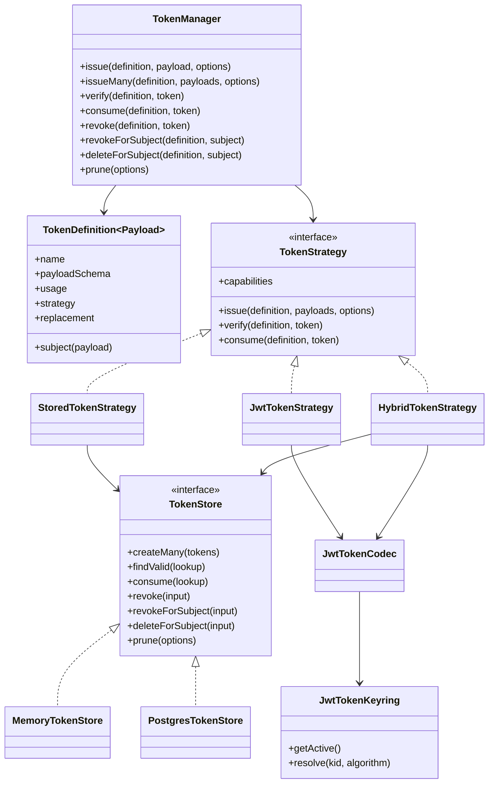
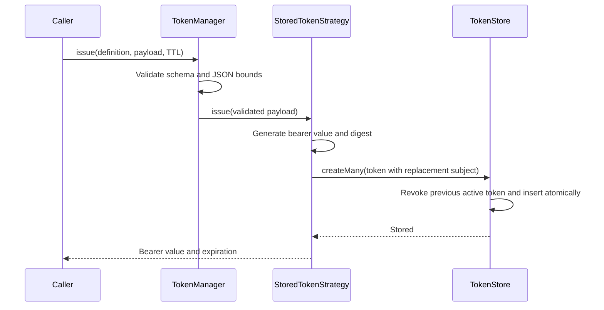
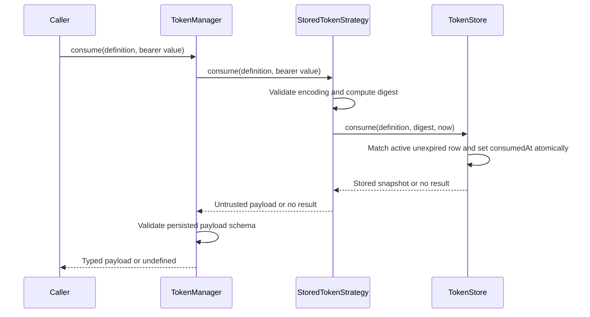
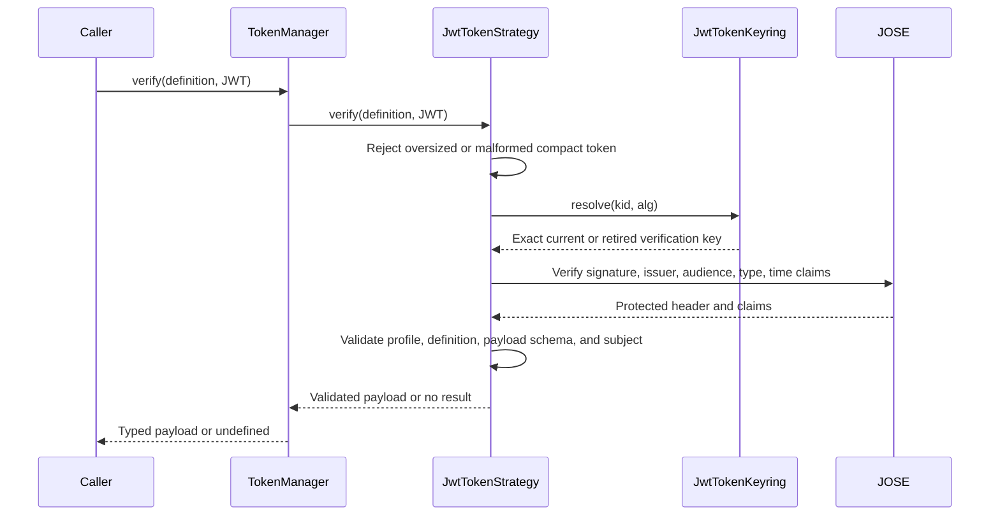
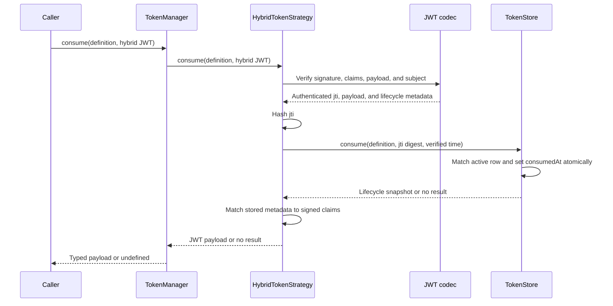

# Tokens

[Documentation](../README.md) · [Implementation index](./README.md) · [Usage guide](../usage/tokens.md)

Kestrel provides a transport-independent token library in `src/packages/kestrel/src/tokens`. It manages temporary bearer values that authorize a bounded action or recover a validated payload. Authentication sessions, queue reservations, lock fencing tokens, and other domain-specific ownership markers remain in their owning libraries.

The library provides opaque stored tokens, signed stateless JWTs, and hybrid JWTs with minimal persisted lifecycle state. Stateless JWTs deliberately do not claim revocation or single-use guarantees; hybrid JWTs add those guarantees without storing their application payload.

## Concepts and model

A `TokenDefinition` declares application semantics: a stable name, a runtime payload schema, single- or multiple-use behavior, a strategy name, and optional subject-based replacement. `TokenManager` validates payloads and lifecycle calls, then routes the definition to a `TokenStrategy`. `StoredTokenStrategy` generates opaque bearer values and delegates durable state to a `TokenStore`. `JwtTokenStrategy` signs self-contained payloads using a rotating `JwtTokenKeyring` and never presents unsupported stateful capabilities. `HybridTokenStrategy` uses the same strict JWT codec while persisting the minimum state needed for revocation, replacement, and atomic consumption.



The definition name is persisted by stored tokens and integrity-protected inside JWTs. It participates in every resolution, so a bearer value issued for one definition cannot be presented as another token kind even when both definitions use the same payload shape and strategy.

| Strategy | Single use | Revocation | Subject replacement | Pruning | Payload visibility |
| --- | --- | --- | --- | --- | --- |
| Stored opaque | Yes | Yes | Yes | Yes | Server-side only |
| Signed JWT | No | No | No | Not applicable | Readable by the bearer |
| Hybrid JWT | Yes | Yes | Yes | Yes | Readable by the bearer |

## Usage guide

For application setup and task-oriented examples, see the [Tokens usage guide](../usage/tokens.md).

## Design and implementation

The core definition, manager, and strategy contracts do not depend on PostgreSQL, authentication, HTTP, workers, or scheduled tasks. The PostgreSQL adapter depends only on the lower-level database manager. An application owns scheduling and calls `prune()` from its maintenance workload, which avoids a dependency from Tokens to a particular scheduler.

The opaque strategy generates at least 256 random bits and encodes them with canonical base64url. It rejects malformed or incorrectly sized bearer values before hashing. SHA-256 is appropriate for uniformly random 256-bit secrets, and only the digest reaches the store. Applications with a different cryptographic policy can inject token generation and digest functions when constructing `StoredTokenStrategy`.

The shared JWT codec uses `jose` and requires an explicitly listed algorithm for every key. Verification first resolves an exact `kid` and algorithm pair, then allows only that algorithm during signature verification. Missing, unknown, duplicated, or algorithm-mismatched keys are rejected rather than falling back to another key. The supported policy includes EdDSA, ECDSA, RSA-PSS, RSA PKCS#1, and HMAC families; deployments should prefer asymmetric keys when issuers and verifiers have different trust boundaries.

Every issued JWT includes protected `alg`, `kid`, and `typ` headers; standard `iss`, `aud`, `sub`, `jti`, `iat`, `nbf`, and `exp` claims; and dedicated `token_definition` and `token_payload` claims. Verification requires all lifecycle claims, enforces issuer, audience, type, key algorithm, clock tolerance, optional maximum lifetime, exact definition, and agreement between `sub` and the subject derived from the validated payload. The payload is signed but not encrypted and must never contain secrets merely because the token is integrity-protected.

The hybrid strategy hashes the integrity-protected `jti` with SHA-256 and stores the digest, definition, optional subject, issuance and expiration timestamps, lifecycle timestamps, and a small representation marker. It never stores the raw JWT, raw `jti`, or application payload. Verification authenticates the JWT before deriving a storage lookup, then requires the persisted subject and timestamps to match the signed claims. A valid signature without matching active state fails closed.

Opaque and hybrid strategies can share one `TokenStore` and the default table. Their common pruning scope ensures that one `TokenManager.prune()` call applies its batch limit only once to that store, rather than once per strategy.

Payloads are validated before issuance, serialized as JSON, bounded by `maxPayloadBytes`, decoded, and validated again. This round trip prevents a definition from accepting runtime values whose persisted JSON representation no longer satisfies its schema. Persisted payloads are also validated after resolution; invalid data fails closed.

The library never requires a caller to reveal why resolution failed. Malformed, unknown, expired, consumed, revoked, wrong-definition, and invalid-payload tokens all resolve to `undefined`. Callers should map this result to one generic public failure.

## Execution scenarios

### Issue with subject replacement



The raw bearer value exists only in the returned grant. Storage receives its digest and the validated payload.

### Single-use consumption



Concurrent consumers cannot both succeed because the store mutation includes the unused-state predicate.

### Signed verification with key rotation



Removing a retired verification key immediately invalidates every unexpired JWT signed by it. Rotation policy must therefore retain old public keys for at least their maximum token lifetime plus configured clock tolerance.

### Hybrid single-use consumption



Signature validation always precedes storage access, so malformed or untrusted unsigned claims cannot select lifecycle rows. Concurrent consumers still rely on the store's atomic mutation and only one can succeed.

## Public API

`defineToken()` is the entry point for application declarations. `usage: "single"` requires `consume()` and rejects `verify()` so security-sensitive code cannot accidentally split validation from mutation. Reusable definitions require `verify()` and reject `consume()`.

`issue()` creates one token. `issueMany()` validates the complete input batch before invoking one strategy operation, allowing a store to persist it atomically. Expiration is explicit as either a positive `ttlSeconds` or a future `expiresAt`.

`revoke()` invalidates one presented bearer value. `revokeForSubject()` invalidates every active token for one definition and subject. `deleteForSubject()` physically removes all matching rows and is intended for privacy finalization or domain deletion, normally inside the same application transaction. `prune()` removes at most the requested number of expired or sufficiently old consumed and revoked rows from every prunable strategy.

Definitions using subject replacement must provide a non-empty subject resolver. The subject is operational metadata for replacement, revocation, and deletion; it does not replace the validated payload returned to callers.

`TokenStrategy.capabilities` makes lifecycle differences explicit. `consume`, revocation, subject deletion, and pruning are optional strategy operations. `TokenManager` rejects a call when the selected strategy cannot provide its guarantee. Stateless JWT definitions cannot use `usage: "single"` or `replacement: "same-subject"`; callers must choose stored or hybrid tokens for those semantics.

`TokenStrategy.pruningScope` identifies shared maintenance state. The manager prunes each scope once even when several strategies use the same store. Custom stateful strategies should expose their store through this property when their pruning operation covers shared rows.

## Adapter contract

Storage adapters used by opaque and hybrid strategies implement `TokenStore`:

```ts
export interface TokenStore {
  createMany(tokens: readonly CreateStoredToken[]): Promise<void>;
  findValid(input: StoredTokenLookup): Promise<StoredToken | undefined>;
  consume(input: StoredTokenLookup): Promise<StoredToken | undefined>;
  revoke(input: StoredTokenRevocation): Promise<boolean>;
  revokeForSubject(input: StoredTokenSubjectMutation): Promise<number>;
  deleteForSubject(input: StoredTokenSubjectMutation): Promise<number>;
  prune(options: TokenPruneOptions): Promise<number>;
}
```

`createMany()` is atomic across replacement and insertion. `findValid()` never returns expired, consumed, revoked, or wrong-definition rows. `consume()` applies the same predicates and marks the row consumed in one atomic mutation. Revocation only counts active, unexpired rows. Subject deletion removes every matching lifecycle state. Pruning is bounded, orders eligible rows deterministically, and may remove expired rows immediately while retaining consumed and revoked rows until `inactiveBefore`.

The memory and PostgreSQL adapters implement the same contract. PostgreSQL joins an existing `DatabaseManager` transaction, allowing token consumption and the protected application mutation to commit or roll back together.

## Stored model

The default singular table is `tokens.token`:

| Column | Purpose |
| --- | --- |
| `id` | Non-secret persistent identity |
| `definition` | Stable token-kind discriminator |
| `subject` | Optional replacement and lifecycle scope |
| `subject_exclusive` | Whether the active definition-subject pair must be unique |
| `digest` | Unique digest of the opaque bearer value or hybrid JWT ID |
| `payload` | Validated opaque-token application data or a hybrid representation marker |
| `expires_at` | Absolute validity deadline |
| `consumed_at` | Successful single-use mutation time |
| `revoked_at` | Explicit invalidation or replacement time |
| `created_at` | Deterministic maintenance ordering |

The raw token is never stored. Hybrid rows also omit the application payload and raw JWT ID. Indexes cover digest lookup, definition-subject lifecycle operations, expiration, consumed retention, and revoked retention.

## Potential evolutions

- Add a dedicated lifecycle-only table shape if measured hybrid workloads justify avoiding the shared table's JSON representation marker.
- Add bulk state lookup and consumption APIs when measured hybrid workloads need multi-token verification or consumption.
- Add an encrypted JWE strategy for use cases where self-contained payload confidentiality is required.
- Add remote JWKS resolution only with bounded caching, explicit network failure semantics, and issuer-specific trust configuration.
- Expose sanitized token lifecycle instrumentation that never records bearer values, digests, subjects, or unrestricted payloads.
- Add batch revocation and deletion contracts when measured workloads need them.
- Return per-strategy pruning statistics if applications need maintenance diagnostics beyond the aggregate count.
- Add optional HMAC digest key rotation for deployments whose token entropy policy cannot guarantee uniformly random high-entropy bearer values.

## Composition reference

### Kestrel-integrated usage

The recommended composition installs the PostgreSQL adapter before the core provider:

```ts
app
  .register(new PostgresTokenAdapterProvider())
  .register(new TokenProvider(config.tokens));
```

Application modules declare reusable definitions and resolve `tokenManagerDependency` in their service or action dependencies:

```ts
const passwordResetToken = defineToken({
  name: "authentication.password-reset",
  payload: z.object({ accountId: z.uuid() }),
  usage: "single",
  replacement: "same-subject",
  subject: ({ accountId }) => accountId,
});

const grant = await tokens.issue(
  passwordResetToken,
  { accountId },
  { ttlSeconds: 3_600 },
);

const payload = await tokens.consume(passwordResetToken, grant.token);
```

`replacement: "same-subject"` invalidates every active token with the same definition and subject in the same storage transaction before inserting the new token. A batch cannot contain the same replacement subject twice because there would be no unambiguous active result.

The default PostgreSQL table also enforces one active subject-exclusive row per definition and subject. Concurrent replacement attempts can therefore never leave two usable tokens; one transaction may receive a uniqueness conflict and retry its complete issuance workflow when the application requires both requests to succeed.

### Signed JWT usage

JWT definitions explicitly select the `jwt` strategy and must remain reusable and non-replacing:

```ts
const memberLookupToken = defineToken({
  name: "member.lookup",
  payload: z.object({ memberId: z.uuid() }),
  strategy: "jwt",
  subject: ({ memberId }) => memberId,
});
```

The application imports its private and public keys, then constructs a keyring. The active signing key must have a matching verification entry. Retired public keys remain in `verification` until every token they signed has expired:

```ts
const privateKey = await importPKCS8(privateKeyPem, "EdDSA");
const publicKey = await importSPKI(publicKeyPem, "EdDSA");
const keyring = new JwtTokenKeyring({
  active: { id: "2026-08", algorithm: "EdDSA", key: privateKey },
  verification: [
    { id: "2026-08", algorithm: "EdDSA", key: publicKey },
    { id: "2026-07", algorithm: "EdDSA", key: previousPublicKey },
  ],
});
const jwt = new JwtTokenStrategy({
  issuer: "https://identity.example.com",
  audience: "example-api",
  keyring,
  maximumTokenLifetimeSeconds: 15 * 60,
});

app
  .register(new PostgresTokenAdapterProvider())
  .register(new TokenProvider(config.tokens, {
    strategies: { jwt },
  }));
```

Applications using only signed definitions can omit PostgreSQL and set `stored: false` in `TokenProvider` options. Key material remains application-owned: Kestrel never reads environment values or files to discover it.

### Hybrid JWT usage

Hybrid definitions select the `hybrid` strategy and may use every lifecycle guarantee:

```ts
const passwordResetToken = defineToken({
  name: "authentication.password-reset",
  payload: z.object({ accountId: z.uuid() }),
  strategy: "hybrid",
  usage: "single",
  replacement: "same-subject",
  subject: ({ accountId }) => accountId,
});
```

The provider creates stateful strategies from the scoped `TokenStore`. A hybrid-only composition can disable the bundled opaque strategy while retaining the store required by the factory:

```ts
app
  .register(new PostgresTokenAdapterProvider())
  .register(new TokenProvider(config.tokens, {
    stored: false,
    strategyFactories: {
      hybrid: (store) => new HybridTokenStrategy(store, {
        issuer: "https://identity.example.com",
        audience: "example-api",
        keyring,
        maximumTokenLifetimeSeconds: 15 * 60,
      }),
    },
  }));
```

`strategyFactories` also supports several named hybrid strategies sharing the configured store while using different keyrings, audiences, or lifetime policies. Direct `strategies` entries take precedence when both options declare the same name. Applications requiring physically dedicated stores can compose separate managers or subclass the provider's protected strategy composition hook.

### Standalone usage

Focused tests and applications without provider composition can construct the layers directly:

```ts
const store = new MemoryTokenStore();
const strategy = new StoredTokenStrategy(store, { tokenBytes: 32 });
const tokens = new TokenManager(
  { stored: strategy },
  { maxPayloadBytes: 4_096 },
);
```

All operations remain asynchronous so changing stores does not alter callers.

### Shared and dedicated PostgreSQL tables

`tokenRecords` is the default table in the `tokens` schema and stores every definition together. It is the recommended composition because it centralizes indexing, retention, and migration work.

An application that needs physical isolation, different database permissions, or a dedicated retention boundary can create a compatible table and pass it to `PostgresTokenAdapterProvider`:

```ts
const securitySchema = pgSchema("security");
const passwordResetTokens = createPostgresTokenTable(securitySchema, {
  tableName: "password_reset_token",
  indexPrefix: "security_password_reset_token",
});

app.register(new PostgresTokenAdapterProvider(passwordResetTokens));
```

Multiple stored strategies can be composed directly with separate `PostgresTokenStore` instances and routed through distinct definition strategy names when shared and dedicated tables are required in the same application. Every custom table must be exported through the application's deployable schema. Local push-schema exports and `tablesFilter` values must also remain aligned whenever a custom table participates in local push maintenance.
