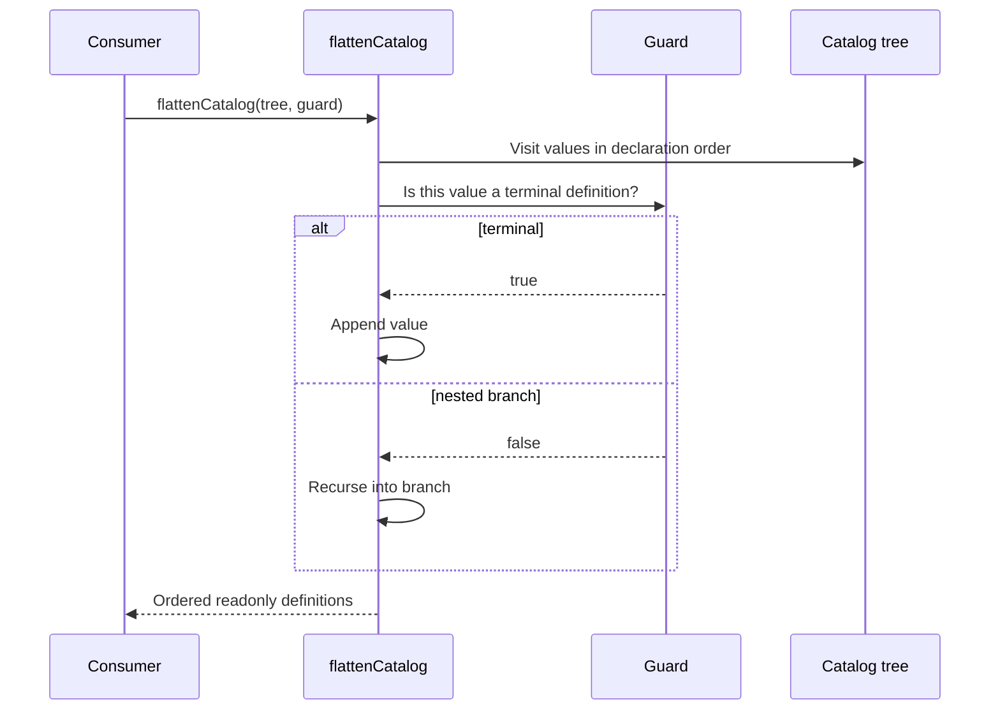

# Kestrel utilities

[Documentation](../README.md) · [Implementation index](./README.md) · [Usage guide](../usage/utilities.md)

The utilities library provides UUID v7 generation, catalog flattening and runtime guards used when heterogeneous application catalogs cross into homogeneous Kestrel registries. It is a Kestrel support library rather than an application service.

## Concepts and model

A `CatalogTree<Item>` is a recursively nested object whose leaves share one conceptual type. `flattenCatalog()` walks that tree in declaration order and relies on a caller-supplied guard to distinguish object-valued leaves from branches. The bundled guards identify Kestrel's action, HTTP controller, CLI controller, worker, workflow and scheduled-task definitions.

## Usage guide

For application setup and task-oriented examples, see the [Kestrel utilities usage guide](../usage/utilities.md).

## Design and implementation

### Pagination cursor codecs

Server-side consumers can import `createPaginationCursorCodec` and `PaginationCursorCodec` directly from `utils/cursor_codec.js`. The module depends only on Zod and Node's Buffer, keeping storage adapters independent from action and database-query composition. The actions library re-exports the same factory for compatibility with its pagination helpers. This entry point is server-only; browser clients should retain cursor strings without interpreting them.

The factory wraps schema-validated JSON in a versioned base64url token. `z.encode(codec, value)` and `z.decode(codec, token)` validate both directions, including a configurable length limit, canonical base64url, UTF-8 and envelope version. Use bidirectional field codecs for non-JSON values. Encoding supplies neither confidentiality nor authenticity. See [pagination](./pagination.md#cursor-actions-and-url-mapping) for the full contract. Codec unit tests live alongside this utility; transport mapping tests remain under actions.

The traversal uses object value order and never performs module discovery. A predicate is required because many Kestrel definitions are themselves plain objects and cannot be distinguished from catalog branches generically. The bundled guards check stable structural discriminants owned by each definition type.

The `Any*` aliases deliberately erase concrete schema and dependency generics only after definitions enter a heterogeneous registry. They must not replace precise types at declaration sites.

## Execution scenario

## Public API

| Export | Purpose |
| --- | --- |
| `uuidV7()` | Generates a server/browser UUID v7 without database access. |
| `createPaginationCursorCodec()`, `PaginationCursorCodec` | Encodes and validates typed, versioned server-side cursor tokens without a dependency on actions or database libraries. |
| `CatalogTree` | Recursive catalog type. |
| `flattenCatalog()` | Extracts terminal definitions in deterministic declaration order. |
| `isAction()`, `isHttpController()`, `isCliController()` | Guards executable action and controller leaves. |
| `isWorker()`, `isWorkflow()`, `isScheduledTask()` | Guards background definition leaves. |
| `isObject()` | Narrows unknown non-null object values. |
| `AnyAction`, `AnyHttpController`, `AnyCliController`, `AnyWorker`, `AnyWorkflow`, `AnyScheduledTask` | Erased types for heterogeneous registry boundaries. |

The utilities library has no adapter API. Consumers supply a pure leaf predicate when the bundled guards do not cover their catalog type.

## Potential evolutions

Additional traversal metadata such as paths should be added only if consumers cannot use `DefinitionCatalogRegistry`, which already retains path and provenance. Keeping one owner for that richer behavior avoids parallel catalog abstractions.

A native UUID v7 implementation can replace the formatting helper once the minimum server runtime and browser support permit it. Process-local monotonic counters remain deferred: they would add state without guaranteeing distributed or transaction ordering.
