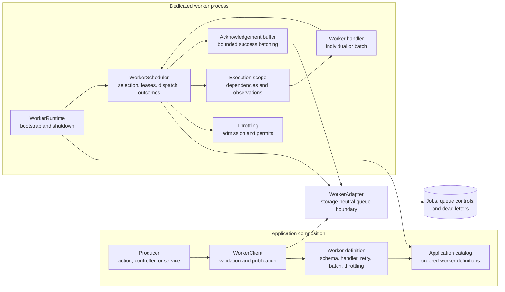
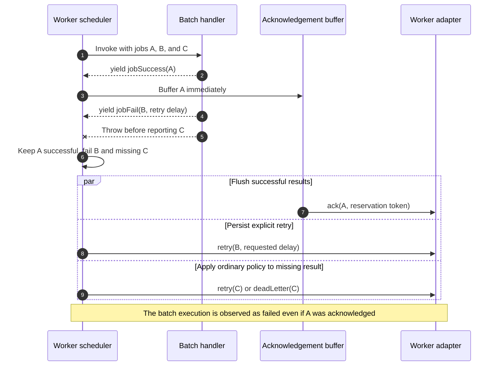
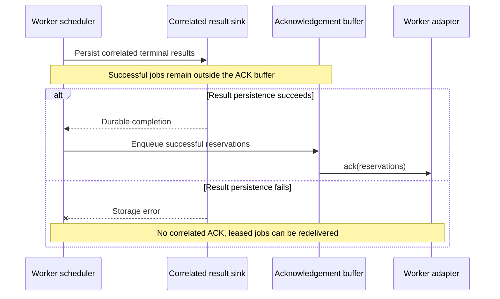
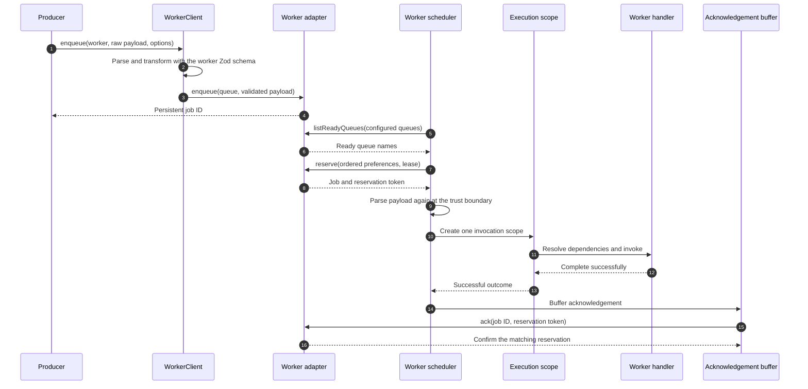
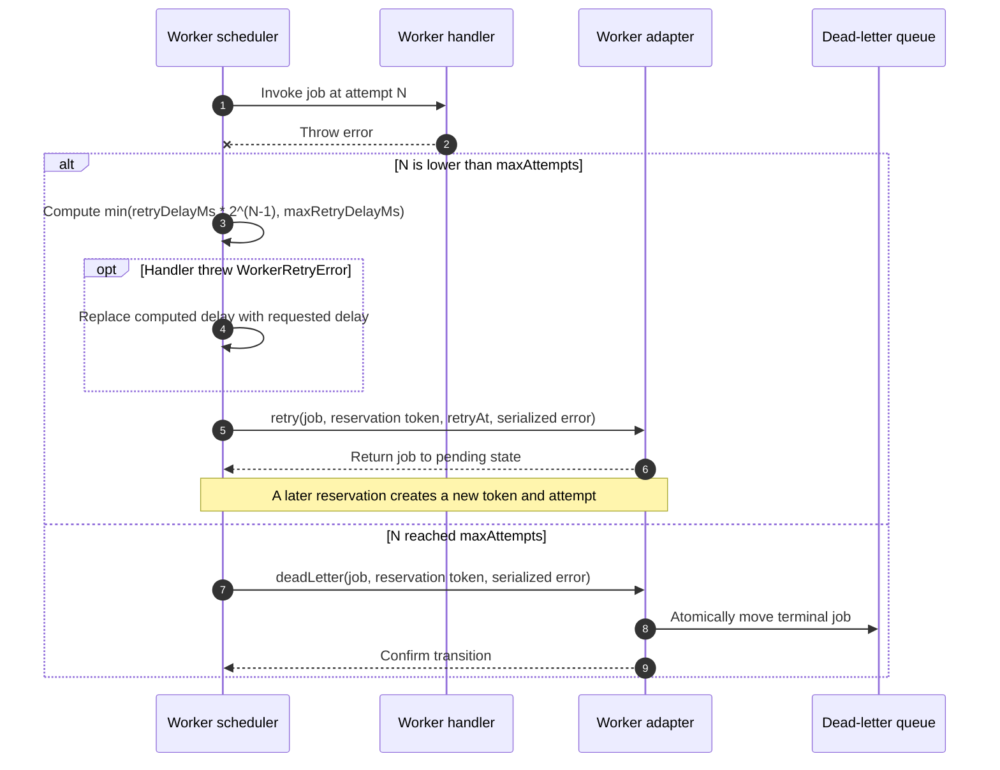
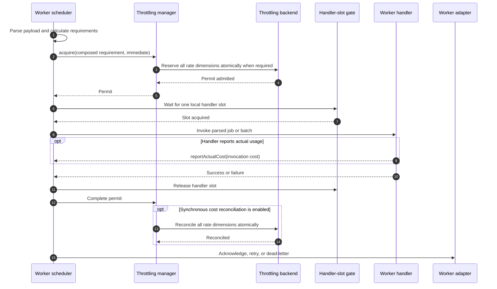
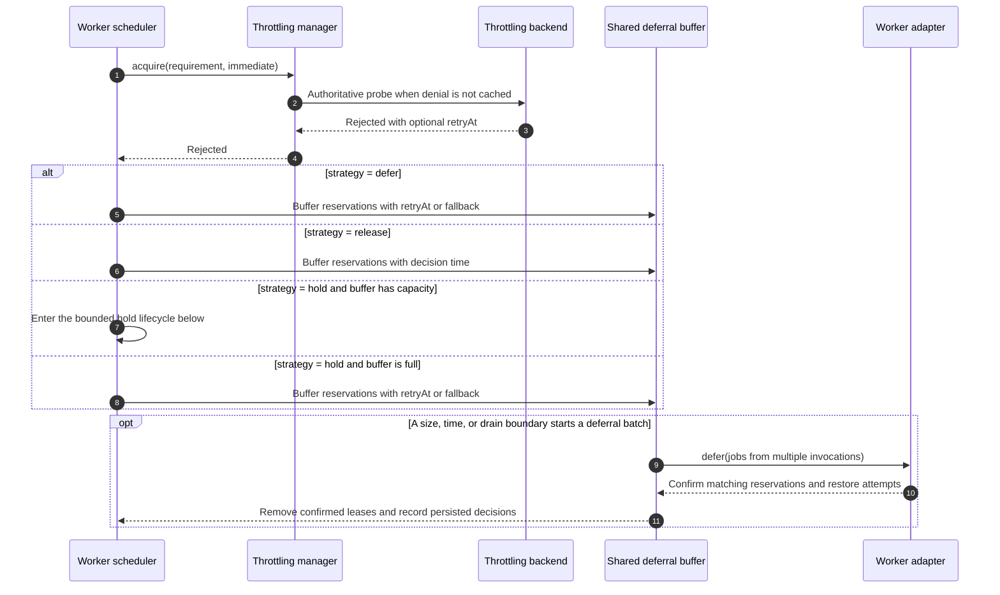
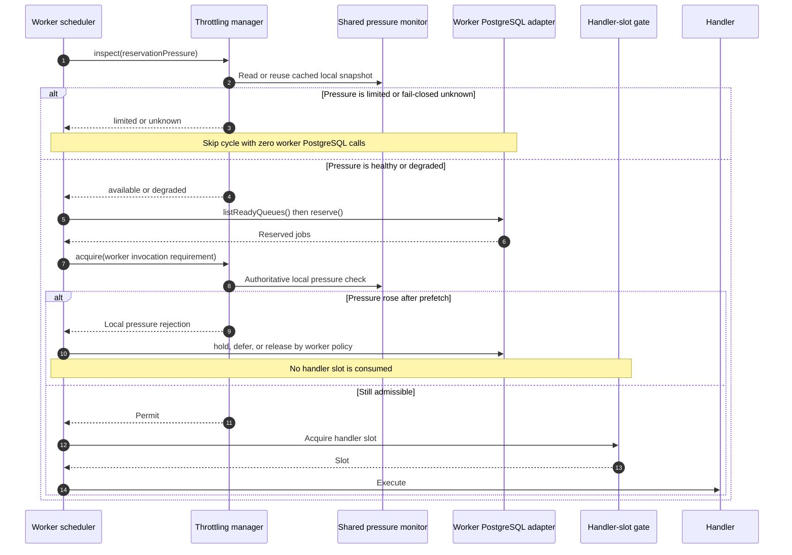
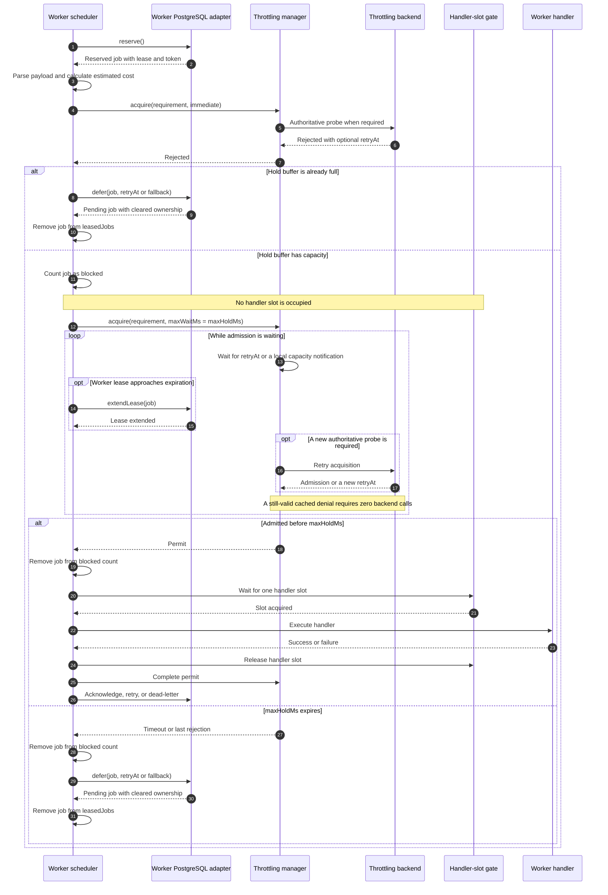
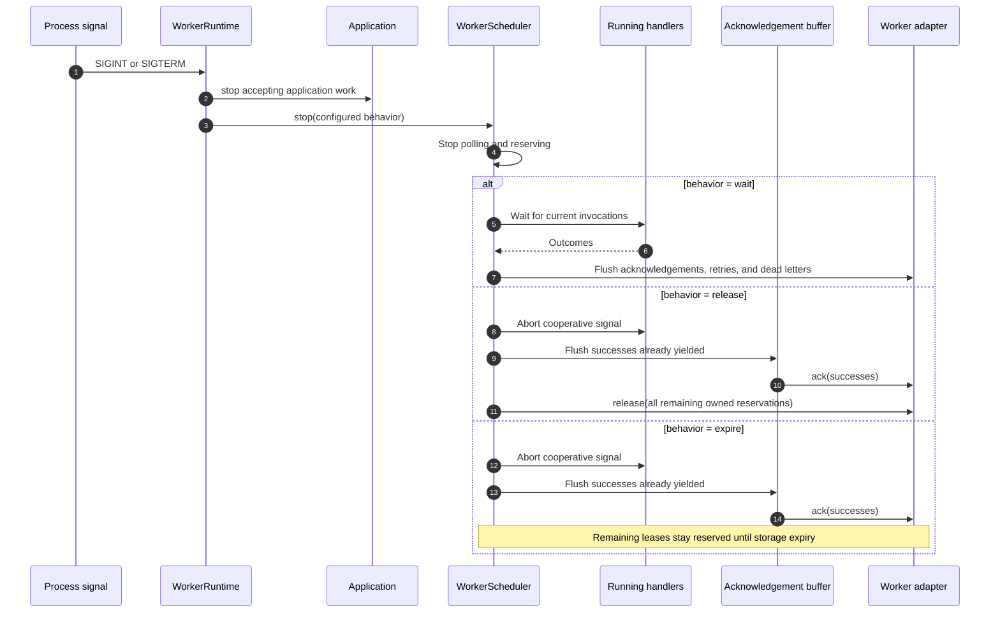

# Workers

[Documentation](../README.md) · [Implementation index](./README.md) · [Usage guide](../usage/workers.md)

Kestrel workers execute typed background jobs through a storage-neutral scheduler. The implementation provides PostgreSQL and in-memory adapters, atomic leases, retries, a dead-letter queue, individual and batch handlers, dependency admission control, and a dedicated application bootstrap.

The detailed design decisions and planned scheduling features remain in [workers_specs.md](./workers_specs.md).

## Usage guide

For application setup and task-oriented examples, see the [Workers usage guide](../usage/workers.md).

## Validation modes


## Design and implementation

Definitions and publication are independent from scheduling. The scheduler rotates ready queues, reserves bounded batches through the adapter, applies process-wide and definition-level admission, creates execution scopes and maps outcomes to acknowledgement, retry, defer or dead-letter transitions. Lease heartbeat and acknowledgement buffering reduce storage traffic without weakening reservation-token ownership.

Queue state is adapter-owned; application catalogs remain the source of handler and policy definitions. No storage transaction remains open while user code runs. Correlated completions are routed before acknowledgement so workflows and interactive tooling can observe terminal results without owning queue storage.

## Public API

| API group | Main exports |
| --- | --- |
| Definitions and outcomes | `defineWorker()`, `jobSuccess()`, `jobFail()` and worker, individual, batch, retry, throttling, execution-context and example types |
| Publication | `WorkerClient`, `WorkerEnqueueOptions` |
| Runtime | `WorkerRuntime`, `WorkerScheduler`, scheduler options, shutdown and throttling-decision types |
| Composition and DI | `WorkerProvider`, `workersConfigBase`, worker adapter/client/runtime dependencies and correlated completion router/sink contracts |
| Adapter contracts | `WorkerAdapter` and enqueue, reservation, acknowledgement, retry, defer, dead-letter, lease, correlation and queue-statistics types |
| Bundled adapters | memory and PostgreSQL adapters, options, Drizzle schema and row types |
| Errors | batch-result, job-identity and retry errors plus `serializeWorkerError()` |

## Adapter API

`WorkerAdapter` owns durable job state. `enqueue()` atomically accepts each supplied job and returns ids in request order. `reserve()` leases only eligible jobs from enabled queues and returns a unique reservation token for every result. All post-reservation mutations (`ack`, `retry`, `defer`, `deadLetter`, `release`, `extendLease`) compare job id and token and return exactly the references they changed; omitted references are stale ownership, not backend failure.

`listReadyQueues()` is a scheduling hint and may return a subset only when queues have no currently eligible work. `listQueueStatistics()` returns coherent operational counts for requested queues. `setQueueEnabled()` changes future reservation without deleting or aborting active jobs. `acknowledgementGrouping` declares whether acknowledgements from different queues may share one call, allowing the scheduler to batch safely without assuming a backend transaction layout.

Adapter operations must reject infrastructure failures, use storage time consistently for availability and leases, bound returned work by the reservation request and never keep a transaction open during handler execution. Expired leases may be reclaimed, so payload and retry transitions must preserve at-least-once delivery. The detailed reservation and result sequences below define the scheduler-visible semantics.

## Conceptual model

The workers library separates the declaration of application work from scheduling and storage. Application modules define typed workers and publish jobs through `WorkerClient`; the dedicated worker process discovers those definitions through the application catalog and executes them through `WorkerRuntime`. The scheduler owns the delivery lifecycle while adapters keep queue ownership durable.



| Element | Responsibility | Lifecycle |
| --- | --- | --- |
| Worker definition | Declares the payload schema, queue, handler, dependencies and execution policies. | Immutable application definition. |
| Application catalog | Collects workers from domain subcatalogs and preserves their declaration order and hierarchy. | Built during application composition. |
| `WorkerClient` | Validates payloads and publishes one or several jobs without exposing the storage adapter. | Shared application dependency. |
| `WorkerProvider` | Registers the adapter, client, runtime and `run workers` CLI controller. | Application composition. |
| `WorkerRuntime` | Starts the scheduler, observes process signals and coordinates application and scheduler shutdown. | One instance per worker process. |
| `WorkerScheduler` | Selects queues, reserves jobs, renews leases, admits invocations, limits handler concurrency and persists outcomes. | One instance per worker process. |
| `WorkerAdapter` | Atomically owns publication, reservation, lease and terminal queue transitions. | Shared storage boundary; PostgreSQL in production or memory in tests. |
| Throttling facade | Decides whether an invocation can start and owns rate, capacity and dependency-health permits. | Optional shared dependency, required by throttled workers. |
| Execution scope | Resolves handler dependencies and groups logs and observations for one invocation. | One scope per individual handler or batch invocation. |
| Acknowledgement buffer | Coalesces successful outcomes across concurrent invocations before calling the adapter. | Owned and flushed by the scheduler. |

The durable unit is a **job**. The execution unit is an **invocation**, which contains one job for an individual worker and up to `batch.size` jobs for a batch worker. A **reservation** is temporary ownership of a job identified by both its persistent ID and a generation-specific token. A **worker slot** limits concurrent handler invocations, not reserved jobs or jobs waiting for throttling admission.

## Worker definitions

Workers declare their queue payload with Zod and receive dependencies from one execution scope per handler invocation:

```ts
import { z } from "zod";

import {
  defineWorker,
  jobFail,
  jobSuccess,
} from "@kestrel/framework/workers";

export const sendEmailWorker = defineWorker({
  name: "email.send",
  queue: "emails",
  input: z.object({
    recipient: z.email(),
    subject: z.string(),
  }),
  examples: [{
    name: "Welcome email",
    payload: {
      recipient: "user@example.com",
      subject: "Welcome",
    },
  }],
  dependencies: {
    emailClient: EmailClient,
  },
  maxAttempts: 5,
  retryDelayMs: 1_000,
  maxRetryDelayMs: 60_000,
  handler: async (job, { emailClient }, { signal }) => {
    await emailClient.send(job.payload, { signal });
  },
});
```

Unhandled errors use exponential backoff. A handler can throw `WorkerRetryError` to select a specific delay for one failure. Handlers must tolerate replay because the scheduler provides at-least-once delivery.

### Definition options

`defineWorker()` accepts the following options:

| Option | Required | Default | Behavior |
| --- | --- | --- | --- |
| `name` | Yes | — | Stable worker identifier used by catalogs and diagnostics. Names must be unique within one scheduler. |
| `queue` | Yes | — | Storage queue consumed by the worker. One scheduler cannot register two workers for the same queue. |
| `input` | Yes | — | Zod schema used to validate and transform payloads both when enqueueing and before handler execution. |
| `handler` | Yes | — | Function invoked for one job or one batch. It receives resolved dependencies and an execution context containing an `AbortSignal`, an actual-cost reporter and a terminal dependency-feedback reporter. |
| `description` | No | — | Human-readable description available to documentation and future inspection tooling. |
| `examples` | No | — | Named valid payloads used by Studio's interactive publisher. Studio derives a deterministic fallback from the Zod schema when no example is declared. |
| `dependencies` | No | `{}` | Dependency declarations resolved in a new application execution scope for every individual handler or batch invocation. |
| `weight` | No | `1` | Positive scheduling weight. A higher value requests a larger initial queue allocation when worker slots are reserved. |
| `maxAttempts` | No | `3` | Positive number of deliveries allowed before a confirmed handler failure moves the job to the dead-letter queue. Lease expiry can cause an additional delivery because only a confirmed failure performs the terminal transition. |
| `retryDelayMs` | No | `1000` | Initial retry delay. The scheduler doubles it for each attempt unless the handler requests a manual delay. |
| `maxRetryDelayMs` | No | `60000` | Upper bound applied to exponential retry delays. |
| `batch` | No | `false` | Enables batch execution when set to an object containing `size` and optional `allowOverflow`. |
| `throttling` | No | — | Declares one admission requirement per job and selects the behavior when the composed invocation cannot be admitted. |

For batch workers, `batch.size` is the maximum number of jobs passed to one handler invocation. `batch.allowOverflow` defaults to `true`; when `false`, the opportunistic reservation pass cannot take more jobs from this queue than its initial scheduler allocation.

The individual handler receives `(job, dependencies, context)`. The job exposes its validated `payload`, identifier, queue, attempt, lease timestamps and reservation token. `context.signal` is aborted during non-waiting shutdown and should be forwarded to cancellable dependencies. `context.reportActualCost(cost)` may be called once to report the invocation-wide actual cost; the policy decides whether that value is diagnostic only, synchronously reconciled or reconciled asynchronously. `context.reportFeedback(feedback)` may be called once to classify a dependency timeout, transient failure, permanent response or explicit throttling response for declared circuit constraints.

Each individual handler invocation emits the application `execution.started` and `execution.completed` observations with the worker name as its operation and `worker` as its transport. The execution outcome follows the job result, including retries and dead-letter failures. The scoped observation context remains active inside the handler so instrumented dependencies contribute to the same Studio timeline.

## Batch workers

Batch handlers return nothing to acknowledge every job after the invocation, or yield exactly one generic result for every job. The worker helpers create the generic outcomes without exposing the `undefined` result carried by a successful job:

```ts
export const importWorker = defineWorker({
  name: "contact.import",
  queue: "contact-imports",
  input: contactImportSchema,
  batch: {
    size: 100,
    allowOverflow: false,
  },
  async *handler(jobs) {
    for (const job of jobs) {
      try {
        await importContact(job.payload);
        yield jobSuccess(job.id);
      } catch (error) {
        yield jobFail(job.id, {
          cause: error,
          retryDelayMs: 1_000,
        });
      }
    }
  },
});
```

Each yielded outcome is validated before it is accepted. An unknown or duplicate job identifier stops generator consumption. An uncorrelated successful outcome enters the scheduler's shared acknowledgement buffer immediately and remains successful if the generator later throws or omits another job. Correlated successes wait for their durable result handoff before entering the buffer. Failed and missing jobs follow their own retry or dead-letter policy, so one invocation may complete partially.

The acknowledgement buffer is shared by concurrent invocations and delegates its in-memory batching lifecycle to the concurrency library's `BatchBuffer`. `ackBufferSize` is the strict maximum number of successes in one buffered batch and triggers processing when reached; `ackFlushIntervalMs` bounds the wait from the first success in a smaller batch. Acknowledgement batches execute sequentially. The adapter's `acknowledgementGrouping` capability is `global` by default; adapters that can only acknowledge one queue per backend call declare `queue`, causing the worker handler to partition each bounded batch accordingly.

The final return value of a batch generator becomes the aggregated result's global data. It is retained by the concurrency primitive but is not currently exposed outside the worker invocation.

One ordinary batch handler invocation owns one observed execution for the complete batch. Its execution is marked as failed when validation, the handler, result collection or any per-job result fails, including when earlier yielded jobs were already acknowledged successfully. A job carrying a first-attempt execution ID is the exception: the scheduler flushes the ordinary jobs before it, invokes the batch handler with that job alone, then resumes ordinary batching in reservation order.

### Partial batch outcome



Successful yields are not rolled back if a later result fails. Consequently, batch handlers must not rely on all-or-nothing queue acknowledgement and should still make each job's side effects idempotent.

## Enqueueing jobs

`WorkerProvider` lives in `packages/kestrel/src/workers`, receives the resolved `WorkersConfig` and registers the public client lazily. PostgreSQL is the default adapter. Passing `adapter` installs an application-owned implementation such as SQS without requiring the workflow library or workflow tables; protected factories remain available for provider subclasses.

Application code resolves the shared `WorkerClient` and enqueues against a worker definition. The definition keeps the payload type and performs runtime validation:

```ts
const workers = app.container.resolve(workerClientDependency);

await workers.enqueue(sendEmailWorker, {
  recipient: "user@example.com",
  subject: "Welcome",
});
```

Multiple payloads are validated completely and inserted through one adapter operation with `enqueueMany()`:

```ts
const jobIds = await workers.enqueueMany(
  sendEmailWorker,
  [
    { recipient: "first@example.com", subject: "Welcome" },
    { recipient: "second@example.com", subject: "Welcome" },
  ],
);
```

Keeping `enqueue()` and `enqueueMany()` separate makes array-valued payload schemas unambiguous. An invalid payload rejects the complete multi-job call before the adapter writes any job. The PostgreSQL adapter inserts up to 1,000 requests per statement. A publication without identities fitting that bound needs no explicit transaction. Larger publications use one transaction covering every chunk, so failure in a later chunk rolls back earlier inserts.

For publications containing identities, PostgreSQL acquires all distinct advisory lock keys in numeric order, reads existing jobs in one subsequent statement with a fresh snapshot, validates every request, and inserts only missing jobs in bounded chunks. Repeated identities within the same call return the same ID or fail the complete publication on incompatible content. Availability does not participate in identity comparison; the first publication's date remains authoritative. UUID v7 IDs are assigned before insertion, preserving request-to-ID correspondence independently of database result ordering.

| PostgreSQL publication | Commands, including transaction boundaries |
| --- | ---: |
| No identities, 1–1,000 jobs | 1 insert |
| No identities, larger publication | 2 + number of insert chunks |
| With identities | 4 + number of insert chunks for missing jobs |
| Identity replay with no missing jobs | 4 |

The identity transaction has one lock statement and one lookup statement regardless of the number of identities. Its lock ordering includes hash collisions to prevent opposite publication order from introducing lock-order inversions.

The optional `availableAt` value schedules a future delivery and `groupId` prepares jobs for the planned fair-queue policy. These options apply to every job in a bulk call.

`identity` gives one logical job a stable publisher-controlled identity. Repeating an enqueue with the same identity and equivalent queue, payload, grouping, execution, and correlation returns the existing active job ID; reusing it for different content raises `WorkerJobIdentityConflictError`. One identity describes one job and is therefore rejected by a multi-payload `enqueueMany()` call. This is publication idempotency for active queue state, not an exactly-once side-effect guarantee.

`correlation` contains an adapter-neutral namespace, ID, and optional data. A successful individual handler calls `context.setResult(value)`; a batch uses `jobSuccess(jobId, value)`. Before acknowledging a correlated success or terminal failure, the scheduler invokes the optional `WorkerCorrelatedCompletionSink`. If result persistence fails, the queue mutation is not made and the leased delivery can be retried. Workflow activities use this ordering to durably append their completion before the Worker ACK.

Pending correlated successes remain outside the acknowledgement buffer until the cycle's handoffs succeed. Reaching `ackBufferSize`, expiring `ackFlushIntervalMs`, or flushing during shutdown cannot acknowledge an uncommitted correlated result. The sink remains idempotent because a crash after result persistence and before queue acknowledgement can repeat the handoff.



`executionId` is an optional first-attempt correlation value intended for transports and development tools that need to know the execution before a worker starts. An individual job uses it for its first handler invocation. A batch job carrying one is isolated into a one-job handler invocation so its observations have an unambiguous execution. If that job is retried, the retry receives a newly generated execution ID; Studio therefore follows the requested attempt without combining later attempts into the same timeline.

## End-to-end execution scenarios

### Publication and successful execution



Validation happens both before publication and before execution. The second check protects the handler from malformed data inserted by an older producer, a manual database operation or another implementation of the adapter.

### Failure, retry, and dead-letter transition



The attempt is incremented when storage reserves the job. Only a handler or preparation failure consumes that attempt. Throttling `defer` and `release` transitions undo the reservation increment because the handler did not start. A lease expiry can lead to one more delivery than `maxAttempts`, since expiry is not a confirmed terminal handler failure.

## Queue selection and reservation size

The scheduler chooses queues and reservation sizes once per execution cycle. The policy is storage-neutral; the adapter applies the resulting ordered preferences atomically.

### 1. Rotate the queue order

Workers initially follow their declaration order in `app.catalog.workers.definitions`. Every cycle rotates this list by one position, so a different queue becomes the first candidate. This is process-local round robin: schedulers do not coordinate their rotation state, and the order is a prioritization hint rather than a global fairness guarantee.

### 2. Filter queues using the ready-queue cache

The scheduler asks the adapter which configured queues currently contain at least one ready job, meaning a job whose `availableAt` is no later than the backend time. The result is cached for `readyQueueRefreshMs` and only workers whose queues appear in this hint are included in the reservation request.

The cache reduces readiness queries but is not a source of truth. A stale positive entry may produce an empty reservation, while a newly non-empty queue may wait until the next refresh. Paused queues are filtered authoritatively by the adapter even if they remain in a scheduler cache.

### 3. Calculate the initial allocation per queue

For every ready worker, the scheduler calculates:

```text
jobsPerInvocation = batch.size for a batch worker, otherwise 1
reservationLimit = max(1, ceil(slots × weight × jobsPerInvocation))
```

`slots` counts concurrent handler invocations, not individual jobs. Multiplying by `batch.size` therefore gives a batch worker enough jobs to occupy the available handler slots. `weight` increases or decreases the queue's requested share. The per-queue limits are deliberately not normalized and may add up to more than the global `reservationLimit`; the ordered reservation stops as soon as that global limit is reached.

For example, with four slots, an individual worker of weight `1` requests up to four jobs, an individual worker of weight `2` requests up to eight, and a batch worker of size `10` and weight `1` requests up to forty.

### 4. Reserve in two passes

The adapter receives the rotated queues, their calculated limits, their `allowOverflow` values and the global reservation limit.

During the first pass, it visits queues in order and takes at most the queue's calculated limit or the remaining global capacity. It stops visiting later queues as soon as the global capacity is full. A queue with fewer ready jobs than requested leaves unused capacity.

During the second pass, the adapter revisits queues in the same order and fills unused global capacity without applying the initial per-queue limit. Individual workers always allow this overflow. Batch workers use `batch.allowOverflow`, which defaults to `true`; setting it to `false` prevents the opportunistic pass from exceeding their initial allocation.

The PostgreSQL adapter considers only available jobs from enabled queues, orders candidates by `available_at` then `id`, and uses `FOR UPDATE SKIP LOCKED`. Concurrent schedulers consequently skip jobs already being claimed instead of waiting for their transactions.

### 5. Dispatch the reservation

Reserved jobs are grouped by queue. Individual jobs become one handler invocation each; batch jobs are split into chunks of at most `batch.size`. The scheduler admits every invocation independently and runs at most `slots` admitted handlers concurrently. Admission waits remain outside the handler-slot gate, so a blocked external dependency cannot consume local CPU, socket or executor capacity unless its admission policy explicitly declares a local concurrency constraint. Reserved job leases are extended together halfway through the configured lease duration until the invocation completes or its reservation is returned to storage.

When a cycle reserves no job or fails, the scheduler waits for `pollIntervalMs` before trying again. After a productive cycle it immediately computes the next rotation and reservation.

## Throttled admission

A worker can declare a simple external limit without configuring scheduler internals:

```ts
const partnerApiLimit = defineRateLimit({
  id: "partner-api",
  requests: 100,
  per: seconds(1),
});

export const synchronizeAccountWorker = defineWorker({
  name: "synchronize-account",
  queue: "account-synchronization",
  input: synchronizeAccountInput,
  throttling: {
    requirements: (job) => ({
      admission: partnerApiLimit,
      estimatedCost: { requests: job.payload.pageCount },
    }),
  },
  handler: async (
    job,
    dependencies,
    { signal, reportActualCost, reportFeedback },
  ) => {
    try {
      const result = await synchronizeAccount(job.payload, dependencies, signal);
      reportActualCost({ requests: result.pagesFetched });
    } catch (error) {
      if (isTimeout(error)) reportFeedback({ kind: "timeout" });
      throw error;
    }
  },
});
```

The default buffering strategy is `defer` with a one-second fallback when an authoritative `retryAt` is unavailable. A simple one-request rate limit may omit `estimatedCost`; the scheduler uses `{ requests: 1 }`. Advanced rate policies require an explicit estimate for every declared rate dimension.

The scheduler parses each reserved payload before evaluating `requirements`. A batch must resolve to the same admission definition for every job; its per-job estimated costs are summed into one atomic invocation requirement. This avoids partially admitting a batch. Different definitions or cost dimensions fail the invocation before its handler starts and follow the ordinary retry or dead-letter policy.

Circuit feedback is invocation-wide like actual cost. An unclassified failed handler is conservatively treated as a transient dependency failure by any declared circuit. Explicit feedback can distinguish timeouts, permanent provider responses and throttling with a safe `retryAt`. A circuit rejection uses the ordinary buffering strategy, so `defer` and expired `hold` naturally schedule the job at the circuit deadline without consuming a worker attempt.

### Composed throttling policy

Use an admission policy when a dependency needs more than a single request rate. Constraints have AND semantics: the invocation starts only after every rate, local concurrency, circuit and pressure constraint admits it.

```ts
import {
  circuitBreaker,
  concurrencyLimit,
  defineAdmissionPolicy,
  minutes,
  rateLimit,
  seconds,
} from "@kestrel/framework/throttling";
import { defineWorker } from "@kestrel/framework/workers";
import { partnerClientDependency } from "../partner/dependencies.js";

const partnerAdmission = defineAdmissionPolicy({
  id: "partner-import",
  limits: [
    rateLimit({
      id: "partner-requests-per-minute",
      unit: "requests",
      limit: 600,
      per: minutes(1),
      // One batch can cost up to 50 requests, so the burst must admit it.
      burst: 50,
    }),
    concurrencyLimit({
      id: "partner-local-concurrency",
      limit: 4,
    }),
    circuitBreaker({
      id: "partner-health",
      failureThreshold: 5,
      cooldown: seconds(30),
    }),
  ],
});

export const importPartnerRecordsWorker = defineWorker({
  name: "partner.importRecords",
  queue: "partner-imports",
  input: partnerImportInput,
  batch: { size: 50, allowOverflow: false },
  dependencies: {
    partner: partnerClientDependency,
  },
  throttling: {
    requirements: (job) => ({
      // Every job in a batch must return the same immutable definition.
      admission: partnerAdmission,
      estimatedCost: { requests: 1 },
    }),
    buffering: {
      strategy: "hold",
      maxBlockedJobs: 100,
      maxHoldMs: 5_000,
      fallbackDelayMs: 2_000,
    },
  },
  handler: async (jobs, dependencies, { signal, reportFeedback }) => {
    try {
      // This provider exposes one request per record.
      await Promise.all(jobs.map((job) =>
        dependencies.partner.import(job.payload, { signal })
      ));
    } catch (error) {
      if (isPartnerTimeout(error)) {
        reportFeedback({ kind: "timeout" });
      }

      throw error;
    }
  },
});
```

For a batch invocation, the scheduler sums every job's `estimatedCost` and acquires one atomic permit. The policy and the set of cost dimensions must therefore be identical for all jobs in the batch. The maximum possible combined cost must fit every relevant rate limit's `burst`; otherwise that invocation can never be admitted. Advanced policies containing a rate constraint always require an explicit estimate, while policies containing only concurrency, circuit or pressure constraints use an empty cost.

### Choosing a buffering strategy

Buffering determines what happens to the already reserved jobs when admission is unavailable. It does not change the throttling definition itself.

| Strategy | Storage transition | Worker attempt | Handler slot | Use when |
| --- | --- | --- | --- | --- |
| `defer` (default) | Return to `pending` at `retryAt`, or after `fallbackDelayMs` (default `1,000`). | Restored; no attempt consumed. | Not occupied. | The expected wait is long or process memory should stay bounded. |
| `hold` | Keep the lease and renew it while waiting up to `maxHoldMs` (default `30,000`); defer on timeout or when the blocked-job bound is full. | Restored if deferred; retained once the handler starts. | Not occupied while waiting. | Admission is expected soon and avoiding another reservation round trip is valuable. |
| `release` | Return immediately to `pending`. | Restored; no attempt consumed. | Not occupied. | Another scheduler or worker process may be better placed to run the job. |

```ts
// Default behavior, written explicitly for clarity.
throttling: {
  requirements: () => ({ admission: partnerApiLimit }),
  buffering: { strategy: "defer", fallbackDelayMs: 1_000 },
}

// Keep a bounded number of jobs leased while waiting for near-term capacity.
throttling: {
  requirements: () => ({ admission: partnerApiLimit }),
  buffering: {
    strategy: "hold",
    maxBlockedJobs: 20,
    maxHoldMs: 5_000,
    fallbackDelayMs: 1_000,
  },
}

// Make the job immediately eligible for another scheduler.
throttling: {
  requirements: () => ({ admission: partnerApiLimit }),
  buffering: { strategy: "release" },
}
```

Admission always happens before the handler-slot gate. A throttled dependency therefore does not consume one of the process's `slots`; only `concurrencyLimit()` deliberately retains local capacity for the lifetime of an admitted invocation. See [throttling.md](./throttling.md) for storage coordination, cost reconciliation, circuit semantics and resource-pressure configuration.

### Admitted invocation



There is one logical throttling acquisition per handler invocation regardless of the number of jobs or rate dimensions. The PostgreSQL work performed by that acquisition depends on coordination: an exact single-rate acquisition uses one statement, an exact multi-rate acquisition uses one three-command transaction, a leased local fast path uses no PostgreSQL command, and a lease replenishment uses one transaction. The detailed command counts and latency model are documented in [throttling.md](./throttling.md#current-round-trip-summary).

Actual-cost reporting is disabled by default as an accounting mutation: the value remains observable but adds no backend call. Synchronous reconciliation adds one backend reconciliation operation before `runOnce()` can finish. Asynchronous reconciliation schedules best-effort work and releases local concurrency without waiting; it is intentionally less durable.

### Rejected invocation



`hold` defaults to a 30-second maximum. Its blocked-job bound is configurable; when omitted the scheduler derives a conservative per-worker bound from available handler slots for individual jobs or one batch for batch workers. `skip` is not a storage disposition: independent invocation pipelines naturally continue, so an unavailable dependency neither blocks unrelated workers nor consumes a handler slot. The explicit dispositions are `hold`, `defer`, and `release`.

Throttling strategies `defer` and `release` both submit requests to a scheduler-wide deferral buffer, which calls the adapter's `defer()` operation. `defer` selects a future `availableAt`; `release` uses the decision time. This buffer combines jobs across queues and invocations, retains each job's own date and token, and uses sequential batches capped by `deferBufferSize` (default 100). A partial batch starts after `deferFlushIntervalMs` (default 10 ms), or earlier when the cycle or shutdown drains it. Invocations do not await individual writes, allowing an entire wave of rejections to coalesce without adding a timer delay at the cycle boundary.

Each PostgreSQL deferral batch uses one set-based statement. It validates each reservation token, clears lease ownership, returns jobs to `pending`, and undoes their reservation attempt increments because no handler started. Confirmed references leave `leasedJobs` after persistence, while an invocation's throttling decision is recorded after all its chunks succeed. Stale references are ignored by storage. Infrastructure failures surface at the buffer drain boundary, leave failed jobs leased for expiry and redelivery, and do not trigger handler retry or dead-letter transitions. The separate adapter `release()` operation used during shutdown retains its existing attempt semantics.

Deferrals flush concurrently with the cycle's ordinary outcomes and also drain if a correlated handoff fails. Their leases remain protected while writes are pending during normal execution. Non-waiting shutdown aborts cooperative work, drains queued acknowledgements and deferrals, then optionally releases remaining reservations.

### Process-wide reservation pressure gate

A worker process may configure a job-independent policy containing only `localResourcePressure()` constraints:

```ts
const workerProcessPressure = localResourcePressure({
  id: "worker-process",
  signals: {
    "process.cpu": {
      degradedAt: 0.75,
      limitedAt: 0.9,
    },
    "process.heap": {
      degradedAt: 0.8,
      limitedAt: 0.9,
    },
  },
});

const workerProcessPressurePolicy = defineAdmissionPolicy({
  id: "worker-process-pressure",
  limits: [workerProcessPressure],
});

app.register(new WorkerProvider(workersConfig, {
  reservationPressure: workerProcessPressurePolicy,
}));

export const locallyGuardedWorker = defineWorker({
  name: "locally-guarded",
  queue: "locally-guarded",
  input: locallyGuardedInput,
  throttling: {
    // This second check is authoritative for each handler invocation.
    requirements: () => ({ admission: workerProcessPressurePolicy }),
    buffering: {
      strategy: "defer",
      fallbackDelayMs: 1_000,
    },
  },
  handler: runLocallyGuardedJob,
});
```

The scheduler inspects this policy before listing ready queues or reserving jobs. `limited` and fail-closed `unknown` states skip the cycle, so a pressured process performs no worker PostgreSQL call and reserves no job lease. `healthy` and `degraded` states continue normally. This inspection is an optimization rather than permission to execute: workers that need protection must also include the same local pressure constraint in their invocation requirements, which performs the authoritative check immediately before the handler-slot gate.



### Held invocation lifecycle



The scheduler retains an operational in-memory reference only during the bounded hold. PostgreSQL remains the ownership source of truth, and the scheduler extends the existing worker lease while it waits. Once a defer transition succeeds, the local reference may remain reachable until the current cycle unwinds, but it is removed from `leasedJobs`, receives no more lease extension and cannot enter the handler-slot gate.

### Backend calls by worker scenario

| Worker scenario | Throttling calls | Worker adapter calls before a handler | PostgreSQL throttling commands |
| --- | ---: | ---: | ---: |
| Unthrottled invocation | 0 | 0 | 0 |
| Open process-local circuit | 1 rejected acquisition | Shared deferral batch unless held | 0 |
| Exact admitted invocation, one rate | 1 acquisition | 0 | 1 statement |
| Exact admitted invocation, multiple rates | 1 acquisition | 0 | `BEGIN` + one set-based statement + `COMMIT` |
| Leased admission with enough local units | 1 acquisition | 0 | 0 |
| Reservation pressure gate limited | 1 advisory inspection | 0, including no ready-queue or reservation query | 0 |
| Pressure rises after reservation | 1 invocation acquisition | Shared deferral batch unless held | 0 |
| First authoritative rejection followed by defer or release | 1 acquisition | Shared deferral batch | Backend-dependent probe, then later matching denials may be cached |
| Held invocation | 2 acquisition entry points; the bounded call may retry internally | 0 if admitted, otherwise shared deferral batch | 0 while waiting on a safe cached denial; otherwise backend-dependent retries |
| Synchronous actual-cost reconciliation | 1 permit completion | 0 | One reconciliation statement or transaction after the handler |
| Diagnostic or asynchronous actual-cost mode | 1 permit completion | 0 | 0 on the handler's critical path |

## Reservation ownership

Every reservation receives a new token. Acknowledgement, retry, dead-letter transfer, release and lease extension all match both the job ID and reservation token. A mutation that affects no row is stale and is ignored. This prevents an expired handler from changing a newer reservation.

PostgreSQL stores active jobs in `workers.job` and terminal failures in `workers.dead_letter_queue`. Reservation uses `FOR UPDATE SKIP LOCKED` inside one short atomic statement; no transaction remains open while handlers execute.

## Bootstrap

Application workers are declared in optional `workers` sections of their domain subcatalogs. `AppCatalog` derives `app.catalog.workers`, which preserves hierarchy for Studio and exposes the ordered definitions consumed by the scheduler:

```ts
import { defineCatalog } from "@kestrel/framework/app";

export const billingCatalog = defineCatalog({
  workers: {
    generateInvoice: generateInvoiceWorker,
    sendInvoice: sendInvoiceWorker,
  },
});
```

`WorkerProvider` declares the lazy adapter, client and runtime and contributes its operational controller. The Kestrel configuration base can be embedded in the application's configuration and mapped to any application-owned source. Environment variables are resolved by the application configuration boundary rather than read directly by the workers library:

```ts
import { configure } from "@kestrel/framework/configuration";
import { workersConfigBase } from "@kestrel/framework/workers";

export function createWorkersConfig(_api: AppConfigurationApi) {
  // Library defaults remain conventionally overridable after configure().
  return configure(workersConfigBase, {});
}
```

The resolved configuration is passed explicitly during application composition. Register `ThrottlingProvider` before `WorkerProvider` when at least one worker declares throttling or a reservation-pressure policy:

```ts
app
  .register(new DatabaseProvider(app.config.database))
  .register(new ThrottlingProvider(app.config.throttling))
  .register(new WorkerProvider(app.config.workers, {
    reservationPressure: workerProcessPressurePolicy,
    // Optional: route jobs through an SQS-backed WorkerAdapter.
    adapter: applicationWorkerAdapter,
  }));
```

Omit `reservationPressure` when process-wide pre-reservation shedding is not needed. Omit `ThrottlingProvider` only when no worker has a `throttling` declaration and no reservation-pressure policy is configured. Without the facade, a throttled worker invocation fails during preparation instead of running unprotected, while a configured reservation-pressure policy prevents scheduler construction.

### Runtime settings

| Setting | Default | Meaning |
| --- | ---: | --- |
| `slots` / `APP_CONFIG__WORKERS__SLOTS` | `10` | Maximum concurrent handler invocations in this process. |
| `leaseMs` / `APP_CONFIG__WORKERS__LEASE_MS` | `300000` | Reservation duration, renewed halfway through while the scheduler still owns the job. |
| `reservationLimit` / `APP_CONFIG__WORKERS__RESERVATION_LIMIT` | `100` | Global maximum jobs returned by one reservation operation. |
| `pollIntervalMs` / `APP_CONFIG__WORKERS__POLL_INTERVAL_MS` | `1000` | Delay after an empty cycle or cycle failure. Productive cycles continue immediately. |
| `readyQueueRefreshMs` / `APP_CONFIG__WORKERS__READY_QUEUE_REFRESH_MS` | `1000` | Lifetime of the process-local ready-queue hint. |
| `ackBufferSize` / `APP_CONFIG__WORKERS__ACK_BUFFER_SIZE` | `100` | Strict number of successes that triggers an acknowledgement flush. |
| `ackFlushIntervalMs` / `APP_CONFIG__WORKERS__ACK_FLUSH_INTERVAL_MS` | `10` | Maximum wait from the first success in a smaller acknowledgement batch. |
| `deferBufferSize` / `APP_CONFIG__WORKERS__DEFER_BUFFER_SIZE` | `100` | Maximum rejected jobs in one shared deferral batch. |
| `deferFlushIntervalMs` / `APP_CONFIG__WORKERS__DEFER_FLUSH_INTERVAL_MS` | `10` | Maximum wait before starting a partial deferral batch. |
| `shutdownBehavior` / `APP_CONFIG__WORKERS__SHUTDOWN_BEHAVIOR` | `wait` | Ownership policy during graceful shutdown: `wait`, `release`, or `expire`. |

Choose `leaseMs` comfortably above ordinary adapter latency. It does not need to exceed handler duration because the scheduler renews leases, but a very short lease increases storage traffic and makes transient renewal delays more likely to expose the same job to another process. `reservationLimit` bounds jobs, whereas `slots` bounds invocations; batch workers can therefore need a reservation limit of at least `slots × batch.size` to fill every slot in one cycle.

Start the dedicated scheduler with:

```sh
./do run workers
```

The scheduler responds to `SIGINT` and `SIGTERM`. `wait` is the safe default because it stops new polling and lets the current cycle persist every outcome. The non-waiting modes abort the cooperative handler signal, flush successes already produced and then either release all remaining reservations immediately or leave them to expire.



Handlers should forward `context.signal` to cancellable dependencies. Under `release`, a handler that ignores cancellation may overlap with a new delivery after its reservation has been returned. Under `expire`, overlap becomes possible after the lease expires. Idempotency remains required for every shutdown mode because ordinary lease loss can also cause replay.

## Studio workers

The local Studio Workers page preserves the hierarchy of `applicationWorkerCatalog` while keeping every queue and its state in one table, including queues without jobs. Counts distinguish ready jobs, future scheduled jobs and currently leased jobs; the waiting total is the sum of ready and scheduled jobs.

Queue consumption can be paused or resumed from this page. The override is stored in `workers.queue_control`, so the HTTP server and every scheduler process share the same state. A queue without an override is enabled by default. Pausing is soft: the scheduler stops passing the queue to reservation after its next ready-queue refresh, queued jobs remain stored, and already leased handlers are allowed to finish. The in-memory adapter implements the same contract for tests.

Selecting a worker navigates to its dedicated Studio page, keeping the global queue table compact even for large catalogs. The detail page displays the worker and queue state together with a JSON publisher initialized from its named `examples` or a generated schema-based payload. Studio validates the payload against the worker's input schema before enqueueing it. It generates the first-attempt execution ID before the request is sent, so the observation timeline can start polling immediately and update as the scheduler and handler emit events. For a paused or delayed queue, polling continues until that execution completes or the page is closed or replaced.

## Potential batching evolutions

The publication, acknowledgement-ordering and deferral improvements above are implemented. The following remain design directions rather than supported APIs:

- Add client publication batches with per-job options so workflow outbox dispatches can share identity-aware insertion and published/retry transitions.
- Batch correlated result delivery through an adapter-neutral completion contract and a workflow-owned external completion buffer. Persist accepted results before buffering their queue acknowledgements, including partial failures.
- Separate reservation admission from invocation completion, with bounded local prefetch and refill thresholds. Keep handler slots, held jobs, pending persistence and lease renewal independently bounded, and preserve queue fairness and shutdown guarantees.
- Extend progressive outcome buffering to individual successes, retries and dead letters, without forcing a storage call for every completed invocation.
- Evaluate integrating PostgreSQL readiness and queue pause checks into reservation, and extending collective lease maintenance to workflow and scheduled-task schedulers.

Measure SQL commands per job, actual batch sizes, handler-to-persistence latency, active leases and handler-slot utilization before choosing buffer sizes or refill thresholds. Larger buffers trade lower storage traffic for longer acknowledgement or deferral latency.
