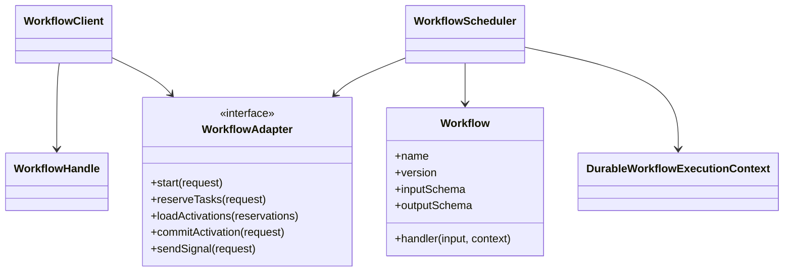
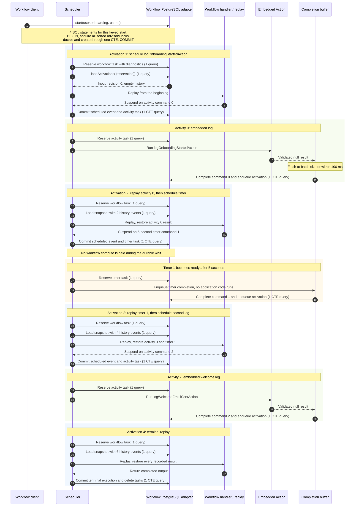
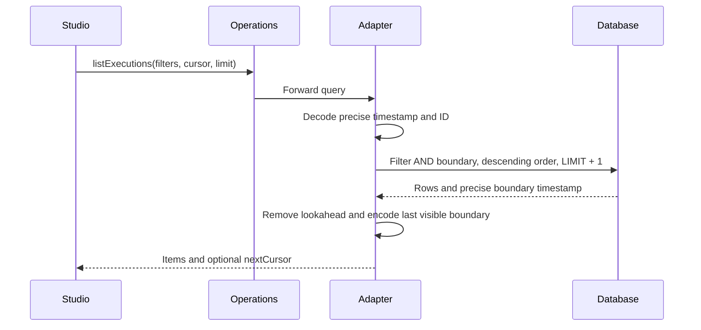
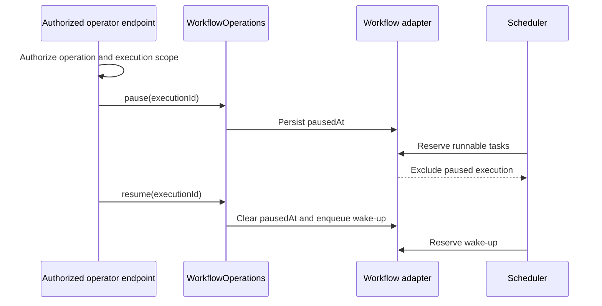

# Durable workflows

[Documentation](../README.md) · [Implementation index](./README.md) · [Usage guide](../usage/workflows.md)

The Workflows library provides code-first durable orchestration inside Kestrel. A workflow handler can use ordinary TypeScript control flow while the runtime persists every operation that can wait, produce a side effect, or observe nondeterministic data. A process restart therefore causes replay from the beginning with recorded results instead of restarting completed work.

The library provides workflow definitions and clients, deterministic replay, embedded and Worker-backed Action execution, memory and PostgreSQL adapters, durable concurrency admission, and selectable background-process integration. Workflow history remains in the workflow adapter even when activities use an independent Worker adapter such as SQS.

## Concepts and model

A `Workflow` is a versioned definition with input/output schemas and a deterministic handler. `WorkflowClient` starts executions and returns `WorkflowHandle` objects for status, completion and signals. `WorkflowScheduler` reserves tasks from `WorkflowAdapter`, replays each history through `DurableWorkflowExecutionContext`, and commits newly emitted commands and events atomically. Activities move side effects outside replay and may execute embedded or through the worker outbox transport.



## Validation modes

Workflow input and output parsing defaults to sync. Declare `validation.input` and/or `validation.output` as `"async"` only for asynchronous schema logic. The policy is applied when starting executions, processing tasks and continuations, replaying fixtures, running children and returning results. Actions invoked as activities retain their own input/output policies in workflow contexts and activity transports.

Signals use `validation: { input: "async" }` for asynchronous payload schemas; omitted signal validation remains sync. Publication, operator signaling and consumption use that same policy. Workflow handlers remain asynchronous independently of parsing mode. Avoid side effects in refinements: replay can validate the same payload repeatedly. See [Definition validation](./definitions.md#schema-validation-policy).


## Usage guide

For application setup and task-oriented examples, see the [Durable workflows usage guide](../usage/workflows.md).

## Design and implementation

The adapter journal is authoritative. A scheduler activation loads one immutable history snapshot, replays the pinned definition version, collects deterministic commands and attempts one optimistic commit. Duplicate scheduling and completion events are identified by execution and command sequence. Conflicts discard the activation and retry from the newly committed history.

Workflow orchestration, embedded activities and outbox publication have separate leases and retry paths. No transaction spans user workflow or activity code. Version inventories, replay fixtures and patch markers make compatibility explicit rather than relying on deployment timing.

## Execution scenarios

The runtime and persistence section contains the activation and external-activity sequences. In summary, a successful activation follows reserve, load, deterministic replay and conditional commit; a concurrent commit conflict causes the losing scheduler to discard its commands and replay the new history rather than merging decisions.

## Public API

| API group | Main exports |
| --- | --- |
| Definitions | `defineWorkflow()`, `defineWorkflowSignal()` and workflow, version, signal, example, input/output and concurrency types |
| Durable context | `DurableWorkflowExecutionContext`, activity, child, duration, retry, signal-wait and side-effect contracts |
| Client | `WorkflowClient`, `WorkflowHandle`, start and signal options/results |
| Runtime | `WorkflowRuntime`, `WorkflowScheduler`, runtime/scheduler options and cycle result types |
| Activities | embedded and action transports, worker outbox dispatcher/completion sink and activity execution context helpers |
| Operations | `WorkflowOperations`, execution graph/wait/detail types, `WorkflowVersionOperations` and diagnostics/inventory types |
| Replay and testing | `WorkflowReplayer`, replay fixtures, parser/stringifier/exporter and compatibility assertion/error types |
| Serialization and history | JSON payload codec, payload helpers/errors, command and history-event types |
| Composition and DI | `WorkflowProvider` and workflow adapter/client/operations/runtime dependencies |
| Adapter contract and implementations | `WorkflowAdapter`, request/result/state types, memory/PostgreSQL adapters and PostgreSQL schema exports |
| Errors and observations | workflow lifecycle errors, serialization helpers and instrumentation definitions/types |

## Adapter API

`WorkflowAdapter` must treat execution history, task state and command sequence as one consistency boundary. `start()` and `startMany()` enforce definition and business-key concurrency idempotently. `reserveTasks()` creates finite ownership tokens; `loadActivations()` returns histories matching those reservations; `commitActivation()` verifies ownership and expected history position and atomically appends events, updates execution state and schedules resulting tasks or activities. A `false` commit means stale ownership or optimistic conflict, not successful persistence.

Signals are durably appended once by their idempotency identity and return a receipt describing acceptance. Activity completion is idempotent by execution and command sequence. External dispatch reservation, publication, retry and completion use their own tokens so publishing can be retried independently from workflow task replay. Lease extension and release methods return only still-owned reservations.

Operational methods (`setPaused`, cancellation, force termination, retry, version recovery and continue-as-new) must use conditional state transitions and preserve history needed for diagnosis. Read methods must not mutate orchestration state except where their explicit wait contract requires notification. `continueAsNew()` archives one completed generation and creates its successor atomically.

Adapter failures reject and must not be represented as stale ownership. Store time governs leases and availability, no transaction may span workflow or activity code, and payload codecs must round-trip every persisted input, result, signal and side effect. The memory and PostgreSQL adapters implement the same semantic contract for deterministic tests and durable deployments.

## Programming model

Actions remain the application-level unit of effectful work. Workflow handlers only orchestrate Actions, durable timers, declared signals, child workflows, and captured nondeterminism.

```ts
const approvalReceived = defineWorkflowSignal({
  name: "order.approval-received",
  payload: z.object({ approved: z.boolean() }),
});

const fulfillOrderWorkflow = defineWorkflow({
  name: "order.fulfill",
  version: { current: 2, supportedFrom: 1 },
  input: z.object({ orderId: z.string() }),
  output: z.object({ deliveryId: z.string() }),
  signals: [approvalReceived],
  handler: async (input, workflow) => {
    const reservation = await workflow.run(reserveStockAction, input, {
      retry: {
        maxAttempts: 3,
        initialDelay: { seconds: 1 },
        backoffCoefficient: 2,
      },
      startToCloseTimeout: { minutes: 1 },
    });

    try {
      if (workflow.version >= 2) {
        await workflow.run(checkFraudAction, { orderId: input.orderId });
      }

      const approval = await workflow.waitForSignal(approvalReceived, {
        timeout: { days: 2 },
      });

      if (!approval.approved) {
        throw new Error("Order rejected");
      }

      await workflow.sleep({ hours: 5 });
      return workflow.runChild(deliverOrderWorkflow, {
        orderId: input.orderId,
      });
    } catch (error) {
      await workflow.run(releaseStockAction, {
        reservationId: reservation.id,
      });
      throw error;
    }
  },
});
```

The handler receives its pinned execution version through `workflow.version`. New executions use the definition's `current` version, while existing executions continue replaying the same handler through the branch corresponding to their stored version. One workflow name therefore remains one catalog entry even while several execution versions coexist.

The optional output schema validates the successful result before persistence and carries its type through `WorkflowHandle.result()` and `workflow.runChild()`. The output is not a separate workflow status or event stream; it is the durable value returned to a caller or parent.

## Starting executions

`WorkflowClient.start()` validates and serializes one input, resolves the execution concurrency key, and returns a typed handle. `startMany()` performs the same operation for a heterogeneous ordered list while preserving the type of every returned handle:

```ts
const [fulfillment, notification] = await workflowClient.startMany([
  {
    workflow: fulfillOrderWorkflow,
    input: { orderId: "order-42" },
    options: { executionId: "fulfillment-order-42" },
  },
  {
    workflow: sendNotificationWorkflow,
    input: { recipientId: "user-7" },
  },
] as const);
```

The client validates and serializes every request before calling the adapter. The adapter then starts the complete batch atomically: an incompatible execution ID or a keyed `reject` decision rolls back every creation in the batch. Results retain request order. Compatible repeated execution IDs are idempotent, while keyed `return-existing` entries may intentionally return a handle whose execution ID differs from the requested new ID.

The default client limit is 100 requests per atomic batch and can be changed with `maxStartBatchSize`. This bound limits validation work, transaction duration, and SQL statement size; larger imports should be partitioned into explicitly independent batches.

The PostgreSQL adapter uses four driver round trips for any non-empty batch within the configured bound: `BEGIN`, one statement acquiring all execution and keyed-concurrency advisory locks in sorted order, one CTE statement deciding admission and inserting executions and activation tasks, then `COMMIT`. Consequently, starting ten workflows through one `startMany()` call uses four SQL statements rather than forty calls through `start()`. The separate lock statement is required so the decision CTE observes a fresh `READ COMMITTED` snapshot after a competing transaction releases a lock.

## Durable primitives

| Primitive | Durable behavior |
| --- | --- |
| `workflow.run(action, input, options)` | Validates the Action input, records one activity command, executes it outside replay, and restores its validated result. Infrastructure failures and timeouts follow the declared retry policy. |
| `workflow.sleep(duration)` | Creates a persisted timer and releases the activation and compute slot until its deadline. |
| `workflow.waitForSignal(signal, options)` | Consumes one matching buffered signal in arrival order. An optional timeout is a persisted competing timer. |
| `workflow.runChild(definition, input, options)` | Starts a version-pinned child, records parent and root relationships, and propagates its result or failure to the parent command. |
| `workflow.sideEffect(capture, options)` | Evaluates nondeterministic code once, serializes its value, and restores that value on every later replay. |
| `workflow.now()` and `workflow.uuid()` | Convenience captures for replay-safe time and UUID generation. |
| `workflow.continueAsNew(input)` | Atomically archives the completed history generation and starts a fresh generation under the same execution identity with validated input and the definition's current version. |

Only JSON-compatible payloads cross the durable boundary by default. The payload codec is injectable, but input, output, signal, activity, child, and captured values must all be accepted by the selected codec.

## Parallelism and races

Calling several durable operations before awaiting them schedules independent commands. Native `Promise.all`, `Promise.allSettled`, and `Promise.race` can be used when every promise comes from the workflow context.

```ts
const inventory = workflow.run(readInventoryAction, input);
const pricing = workflow.run(readPricingAction, input);
const [available, price] = await Promise.all([inventory, pricing]);
```

Command completion order is stored in history. Replay resolves recorded promises in that same order, so a `Promise.race` keeps the same winner after a restart. Once the workflow reaches a terminal state, pending loser tasks are removed. A loser already executing can still produce an external side effect before its stale completion is rejected; race participants must consequently be idempotent and should support abort signals where practical.

Sequential `await` calls enforce order within one execution. Concurrency declarations control separate executions:

```ts
const fulfillOrderWorkflow = defineWorkflow({
  name: "order.fulfill",
  version: { current: 1, supportedFrom: 1 },
  input: z.object({ orderId: z.string() }),
  concurrency: {
    executions: { limit: 20 },
    keyed: {
      key: (input) => input.orderId,
      limit: 1,
      conflict: "enqueue",
      scope: "execution",
    },
  },
  handler: async (input, workflow) => {
    // ...
  },
});
```

`executions.limit` bounds active work for the complete definition. Keyed concurrency applies a separate limit per resolved business key, so order `A` can be serialized without blocking orders `B` and `C`. `enqueue` creates a pending execution, `reject` fails the competing start, and `return-existing` returns the oldest compatible active handle. `scope: "execution"` retains the keyed permit while the workflow waits for timers, signals, children, or activities; `active-work` releases compute admission during those waits.

## Activities, retries, and exactly-once limits

Every activity receives a stable idempotency key derived from the execution ID and command sequence. Retries preserve this key and increment the attempt number. The runtime retries only `WorkflowActivityInfrastructureError` and its timeout subtype; an ordinary Action or domain error is recorded immediately and thrown back into workflow code.

An Action that needs transport metadata can declare `executionContextDependency` and call `getWorkflowActivityExecutionContext(executionContext)`. The returned activity contains its `idempotencyKey`, attempt, retry policy, execution ID, command sequence, and timeouts. The helper returns `undefined` when the same Action runs through another transport.

The runtime guarantees one logical command and one accepted terminal completion in workflow history. It cannot guarantee that an external side effect happens exactly once. A process can perform the effect and fail before recording its result, and a start-to-close timeout can expire while a remote operation continues. Actions that modify external state must use the supplied idempotency key or an equivalent business key.

`ActionWorkflowActivityTransport` validates Action input and output around an application-supplied execution callback. This callback is the composition seam for the normal Action execution scope, dependencies, middleware, logging, and observations. `EmbeddedWorkflowActivityTransport` is the default in-process transport.

Set `activityTransport: "worker"` on `WorkflowProvider` to use the Worker-backed transport. The workflow transaction writes the scheduled command and an outbox row atomically. A dispatcher publishes that row through `WorkerClient` with the stable identity `<executionId>:<commandSequence>`, and a generic workflow-activity Worker executes the addressed Action. The Worker scheduler records the correlated result in workflow history before acknowledging the queue delivery.

```ts
app
  .register(new WorkerProvider(app.config.workers, applicationWorkerAdapterDefinition))
  .register(new WorkflowProvider(postgresWorkflows(databaseDependency, { activityDispatchMode: "outbox" }), {
    activityTransport: "worker",
  }));
```

`applicationWorkerAdapterDefinition` may construct PostgreSQL, SQS, or any other `WorkerAdapter`; it does not need access to workflow tables. Publication and delivery remain at least once. Stable identity reduces duplicate publication where the queue supports it, while idempotent completion prevents duplicate history events. An Action can still execute more than once after a lease loss or network ambiguity, so externally effectful Actions must honor the activity idempotency key or an equivalent business key.

## Signals

Signals must be declared on the workflow definition. The client validates their input before persistence, accepts an optional delivery idempotency key, and buffers them even when the workflow has not started waiting yet. Each wait consumes the oldest compatible unconsumed signal and records its signal ID on the command completion.

```ts
const handle = await workflowClient.start(fulfillOrderWorkflow, {
  orderId: "order-42",
});

await handle.signal(
  approvalReceived,
  { approved: true },
  { idempotencyKey: "approval-order-42" },
);
```

Signal authorization belongs to the controller or Action exposing this operation. The storage adapter only enforces execution identity, definition identity, terminal state, and delivery idempotency.

## Version operations and replay fixtures

`WorkflowVersionOperations.inspect()` returns compact execution counts grouped by definition, pinned version, and status, plus a list of active versions that the deployed catalog cannot replay. The Workflow runtime calls `assertCompatible()` before it starts polling. A missing definition or an active version outside `supportedFrom..current` therefore prevents only the Workflows workload from starting; it does not implicitly start or stop Workers or ScheduledTasks.

When compatible code has been restored, `WorkflowVersionOperations.recover(executionId)` can requeue an execution blocked specifically by `WorkflowExecutionVersionUnsupportedError`. The operation verifies the deployed definition and pinned version again and does not rewrite input, version, or history. It returns `false` for an execution that is not in that recoverable state.

Replay fixtures use a versioned JSON format and the production replayer:

```ts
const fixture = await exportWorkflowReplayFixture(
  workflowAdapter,
  executionId,
  {
    sanitizePayload: (payload, location) => redactFixturePayload(
      payload,
      location,
    ),
  },
);

await assertWorkflowReplayCompatible(
  fulfillOrderWorkflow,
  stringifyWorkflowReplayFixture(fixture),
);
```

`parseWorkflowReplayFixture()` validates imported JSON before replay. Export omits error stacks by default and accepts an application-owned payload sanitization hook; fixtures must not be committed before sensitive fields have been redacted. Compatibility tests should retain at least one fixture for each supported execution version and both sides of every temporary handler branch. The helper fails with `WorkflowReplayCompatibilityError`, whose cause contains the first nondeterministic command position and its expected and emitted identities.

## Continue as new

Long-running loops should rotate before reaching `maxHistoryEvents`:

```ts
const pollingWorkflow = defineWorkflow({
  name: "report.poll",
  input: z.object({ reportId: z.string(), attempts: z.number() }),
  handler: async (input, workflow) => {
    const ready = await workflow.run(checkReportAction, input);

    if (!ready) {
      await workflow.sleep({ minutes: 5 });
      await workflow.continueAsNew({
        ...input,
        attempts: input.attempts + 1,
      });
    }
  },
});
```

The execution keeps its `executionId`, parent/root links, original start identity, and logical concurrency permit. Its `historyGeneration` increments, its new input is schema-validated, and the new generation pins the definition's current version. The adapter archives the prior input, version, and immutable history in the same transaction that clears generation-local signals and tasks and creates the new workflow activation. `WorkflowHandle` consequently continues to address the whole logical chain, while a retry of the original start request remains idempotent. Continue-as-new rejects a generation with an unsettled durable command; parallel work must be joined before rotation.

## Cancellation and compensation

`handle.cancel()` durably requests cooperative cancellation and recursively marks open child executions. Replay first reconstructs every command recorded before the durable cancellation event, then throws `WorkflowCancellationError` from the operation that was pending when cancellation arrived. This preserves determinism when earlier completed Activities are followed by a timer, signal, child, or other pending command. Ordinary `try`/`catch` can run compensating Actions; completed compensations are replayed like any other activity if the process stops during rollback.

If cancellation arrives before a workflow reaches any durable boundary, the scheduler closes the execution as cancelled instead of accepting a normal return. A handler may deliberately catch and swallow a delivered cancellation, in which case its own terminal result wins. Cancellation removes pending local tasks and prevents unpublished Worker activity outbox entries from being reserved, but cannot undo an external side effect that has already started. History remains immutable for replay and audit, so Studio uses the cancellation event to mark incomplete earlier commands as cancelled and excludes them from active waits; compensation commands recorded after cancellation remain visible as pending until they settle.

Force termination also removes pending local tasks but deliberately adds no workflow event because no handler code or replay runs. Operational projections therefore use the terminal execution status to exclude every remaining command from active waits and display incomplete commands as terminated while retaining their immutable scheduling history for audit.

## Runtime and persistence

The following small workflow uses two embedded Actions around a durable timer. The Actions only log so the complete execution path remains easy to inspect, but they have the same durable boundaries as externally effectful Actions.

```ts
const userOnboardingWorkflow = defineWorkflow({
  name: "user.onboarding",
  input: z.object({ userId: z.uuid() }),
  output: z.object({
    userId: z.uuid(),
    status: z.literal("completed"),
  }),
  concurrency: {
    keyed: {
      key: ({ userId }) => userId,
      conflict: "return-existing",
    },
  },
  handler: async (input, workflow) => {
    await workflow.run(logOnboardingStartedAction, input);
    await workflow.sleep({ seconds: 5 });
    await workflow.run(logWelcomeEmailSentAction, input);
    return { ...input, status: "completed" as const };
  },
});
```

With the default embedded activity transport, the handler and both Actions run in the Workflows process. Each Action still remains a separate durable task so replay never repeats an accepted side effect. The diagram below shows the sequential PostgreSQL path after the current query optimizations. Each numbered database arrow is one SQL statement except the four-statement start transaction described in the first note.



This isolated sequential execution uses 22 SQL statements: 4 for the keyed start, 7 task reservations, 4 activation snapshot loads, 3 command-scheduling commits, 3 buffered completion flushes, and 1 terminal commit. Empty polling, status reads requested by callers, and optional operational instrumentation reads are not included. Starting multiple executions, loading snapshots, and flushing completions become more efficient when several items are available together: each operation keeps a fixed query count for the complete bounded batch. A single sequential execution cannot benefit from snapshot or completion batching across executions.

The memory and PostgreSQL adapters implement the same storage contract. PostgreSQL stores executions, immutable history, runnable tasks, signals, concurrency admission metadata, and the activity dispatch outbox under the `workflows` schema. Task and outbox leases use reservation tokens so a recovered item rejects mutation from an expired owner. Every workflow, activity, or timer reservation projects the execution name, pinned version, history generation, root execution, and optional parent execution in the same adapter operation. The execution scope can therefore attach complete workflow diagnostics without a separate execution lookup; PostgreSQL performs the projection with a join in its single reservation query.

Workflow histories deliberately remain outside the reservation query. This separation is an architectural constraint rather than a pending query optimization: `reserveTasks()` must keep a predictable cost independent of execution history size, so it must not return activation snapshots or aggregate histories in the reservation transaction. After reservation, the scheduler passes all workflow task IDs and ownership tokens to `loadActivations()`, which returns every still-owned snapshot in one bounded adapter call. PostgreSQL uses one query regardless of the number of workflow activations in the scheduler batch. Heartbeats protect the leases while that shared load is pending, activities and timers in the same batch do not wait for it, and execution scopes open only after the corresponding snapshot is available. A missing result is treated as stale ownership. If measured history volume makes one batch too large, a future adapter evolution may partition snapshot loads by an explicit event or byte budget; it must preserve the separate reservation and activation-loading operations rather than add history aggregation to task admission.

Embedded activities and timers retain their ordinary reservation and execution path, but their completed journal transitions share a bounded `WorkflowCompletionBuffer`. Each task waits for its own durable outcome while its heartbeat remains active. PostgreSQL validates all reservation tokens, assigns distinct event and completion indexes in buffer arrival order, appends the events, advances each execution once, deletes the completed tasks, and creates one deduplicated activation per execution in one statement. Missing adapter results resolve as stale tasks. A batch flushes immediately at `completionBatchSize`, which defaults to `100`, or after `completionFlushIntervalMs`, which defaults to `100` milliseconds and can be configured through `WorkflowProvider` options. Workflow activation commits, retries, external Worker activity completions, and continue-as-new remain independent transitions until measurements justify dedicated batch contracts for them.

### Remaining PostgreSQL query optimizations

The ordinary single activity or timer scheduling commit, simple root terminal commit, local activity and timer completion, reservation, activation loading, outbox reservation and acknowledgement, and bounded batch start already have fixed single-query or fixed-transaction paths. The following less optimized transitions remain explicit future work, ordered roughly by expected runtime impact:

| Transition | Current query shape | Intended evolution |
| --- | --- | --- |
| Task lease extension | One transaction with a validation read and update per reservation | Validate and extend a complete reservation batch through one `VALUES` CTE. |
| Task release | One transaction with a validation read and one or two updates per reservation | Release the complete batch and restore workflow execution status through one CTE. |
| External Worker activity completion | Separate execution, idempotence, scheduled-command and completion-order reads followed by history, execution and wake-up writes | Add a batched `completeExternalActivities()` CTE with source-ID deduplication, mirroring local completion batching. |
| Signal delivery | Execution and optional idempotence reads followed by signal, history, revision and wake-up writes | Collapse one delivery into a CTE, then add batching only if real ingress patterns justify it. |
| Generic activation commit | Command-by-command writes plus journal and signal reads | Add bounded paths for multiple ordinary activities or timers, captures followed by work, signal scheduling or consumption, and simple child creation. |
| Continue-as-new | Separate ownership, execution and history reads followed by archive, cleanup, rotation and wake-up writes | Express validation, archival and generation rotation as one data-modifying CTE where payload size remains bounded. |
| Operational controls | Pause, resume, recovery and retry use short multi-statement transactions; cancellation and termination traverse descendants iteratively | Optimize the short controls with CTEs and replace recursive per-execution round trips only after preserving deterministic tree and concurrency-release semantics. |
| History and archive reads | Existence validation and content loading use two reads | Join validation into the content query when operational read volume warrants it. |

Generic activation fallback remains necessary for arbitrary combinations of parallel commands, buffered signals, child and parent propagation, cancellation cleanup, and keyed-concurrency permit release. A failed fast-path predicate currently falls back to that generic transaction, so an uncommon stale or complex activation can spend one attempted statement before the fallback. Future consolidation should retain the generic implementation as the semantic reference and add measured bounded paths rather than produce one unmaintainable universal query.

The process can run all background workloads together or isolate them:

```sh
./do run background
./do run background --workload workflows
./do run background --workload workers --workload workflows
./do run workers
./do run scheduled-tasks
./do run workflows
```

With no `--workload`, `run background` starts every registered workload. Repeating the option selects only those workloads. Dedicated commands remain available for deployments that scale Workers, ScheduledTasks, and workflows independently. Worker-backed activities require a Worker process somewhere, but selecting `workflows` never implicitly starts Workers.

The scheduler option `maxHistoryEvents` stops replay and marks an execution `blocked` once its loaded history exceeds the configured bound. A workflow must call `continueAsNew()` before crossing that bound. The limit and rotation do not replace signal ingress limits, payload limits, archive retention, or sensitive-data controls.

## Operational API

`WorkflowOperations` is the storage-neutral server interface for protected administration endpoints, CLI commands, and Studio. It intentionally contains no application authorization policy. The caller must authorize the current operator before invoking it.

```ts
const operations = new WorkflowOperations(
  app.catalog.workflows.definitions,
  workflowAdapter,
);

const page = await operations.listExecutions({
  limit: 50,
  workflowNames: ["order.fulfill"],
  statuses: ["blocked", "failed", "waiting"],
  createdAfter: new Date("2026-01-01T00:00:00Z"),
});

const details = await operations.getExecution(page.items[0]!.executionId);
```

Execution search is ordered newest-first and uses an opaque cursor. Filters cover status, definition, version, date interval, parent, root, retry source, pause state, execution identity, and keyed-concurrency business key. Details return the current generation history, archived generation summaries, direct children, linked retries, and an execution-specific graph derived from durable state. The graph describes the path that actually ran; arbitrary handler code still prevents an exhaustive static state-machine diagram.

### Execution pagination contract

Pass the previous page's `nextCursor` as `cursor`, retaining the same filters. A final or empty page omits `nextCursor`. The limit remains bounded to 1–200. Both adapters encode the boundary's `createdAt` and identifier in a versioned base64url token through `workflowExecutionCursorCodec`. A cursor carries its ordering keys rather than referencing a live row, so deleting or excluding the boundary execution does not prevent continuation. Raw execution identifiers from the previous cursor format are no longer accepted: start a new traversal to obtain a current token.

PostgreSQL orders by `(created_at DESC, id DESC)`, applies an exclusive lexicographic predicate to the native columns and fetches one lookahead row. Each page uses one SELECT, including continuation pages. SQL projects the timestamp as UTC text with six fractional digits for cursor construction; the predicate casts that text directly to `timestamptz`, avoiding the millisecond rounding of the public `WorkflowExecution.createdAt` Date. The memory adapter pads its millisecond timestamps to the same six-digit representation and compares the encoded timestamp before its identifier tie-breaker.

The shared codec lives in the lower-level `utils/cursor_codec.ts` module, independent of actions, repositories and adapter implementations. Workflow-specific schema and validation live in `workflows/execution_cursor.ts`. `workflowExecutionCursorCodec` is also exported for transport validation. Malformed tokens fail adapter calls with `TypeError`; Studio validates tokens before calling operations and returns HTTP 400. Existing Studio clients continue treating `cursor` and `nextCursor` as opaque strings.



Tokens are neither signed nor query-bound. Authorization and operational filters remain the caller's responsibility; keep filters stable while traversing. Concurrent inserts before the boundary do not shift subsequent pages, but changes to ordering keys or filter membership can still change results. Potential extensions include signed/query-bound tokens and measuring a dedicated `(created_at, id)` listing index on production-shaped data.

The operator commands have deliberately different semantics:

| Command | Semantics |
| --- | --- |
| `signal()` | Validates a declared signal payload with its schema, serializes it with the configured payload codec, and stores it durably. An optional idempotency key deduplicates delivery attempts. |
| `pause()` | Sets an orthogonal durable hold. New workflow, timer, activity, and outbox reservations stop, while already reserved work may finish and record its result. |
| `resume()` | Clears the hold and writes a deduplicated workflow wake-up. |
| `cancel()` | Requests cooperative cancellation, clears a pause, propagates to open children, and lets handler `try`/`catch` compensation run at the next durable boundary. |
| `recover()` | Requeues only a version-blocked execution after deployed code supports its pinned version again. It does not ignore nondeterminism or rewrite history. |
| `retry()` | Accepts only a failed execution and creates a new execution from the original start input at the definition's current version. `retryOfExecutionId` preserves navigation and audit history. The failed execution remains immutable. |
| `terminate()` | Immediately closes the execution and open descendants, removes pending local work, and runs no compensation. Already executing external effects cannot be recalled. |



`WorkflowClient.result()` treats force termination as a terminal result and throws `WorkflowExecutionTerminatedError` with the durable reason.

## Studio

The workflow Studio extension contributes a definition inventory and a durable execution explorer. It supports status, definition, and free-text search; a detail page with input, output, bounded error, current history, archived generations, parent/child/retry navigation, correlated observations, signals, controls, and an executed-path graph.

```ts
defineWorkflowsStudioExtension(
  app.catalog.workflows,
  workflowOperations,
  {
    authorize: async ({ operation, executionId, request }) => {
      await authorizeWorkflowOperator(request, { operation, executionId });
    },
  },
);
```

Studio routes use the Studio access boundary and the optional extension callback adds application-specific, operation-level authorization. A production administration surface should reuse `WorkflowOperations` behind its normal authentication, authorization, audit, and trusted-origin middleware instead of assuming that enabling a development interface makes it production-safe.

## Observations and metrics

Workflow execution scopes separate orchestration identity from process work. `workflowExecutionId` is the stable durable workflow identity exposed by handles and stored as `workflows.task.execution_id`; each task already has its own durable `workflows.task.id`. Every reservation attempt receives a distinct generic application execution ID in the form `<taskId>:<attempt>`. Logs and observations attach `workflow.executionId`, `workflow.taskId`, `workflow.taskAttempt`, definition, pinned version, history generation, parent/root identities, task kind, command sequence, and replay state as structured context. Studio follows `workflow.executionId` to aggregate those distinct task-attempt timelines without merging their `execution.started` and `execution.completed` pairs. Correlation pages place observations and logs together under each application execution by default, label workflow tasks, Activities, timers, commands, and attempts from generic diagnostics, provide per-group and page-wide expansion controls for both artifact types, and retain a chronological view for inspecting interleaved parallel work.

This distinction also preserves retry semantics: the durable task ID identifies the logical activation, activity, or timer while the attempt suffix identifies one lease owner and process execution. Worker-backed activities retain the Worker execution identity chosen by the Worker transport and carry the workflow execution ID plus command sequence as their correlation. Workflow instrumentation remains storage-neutral and can feed the built-in observation bridge, a metrics backend, or both.

Two stable observations are emitted without workflow payloads:

- `workflow.lifecycle` counts starts, waits, completions, failures, blocked replays, and operator retries by definition and version;
- `workflow.task` measures activation, activity, and timer duration, queue age, activity retry count and delay, timer lag, stale commits, and failures.

Idempotent duplicate starts do not increment the start count. Instrumentation failures are isolated from durable transitions. Workflow execution IDs correlate these events with the general execution timeline and structured logs in Studio. Worker-backed Activities additionally expose payload-free workflow identity, command, target, attempt, and idempotency metadata on their normal Worker execution observation; its duration is the remote activity duration when the embedded workflow scheduler does not own that Activity task.

## Data protection, retention, and limits

Workflow input, output, signal payloads, captured side effects, activity arguments/results, and some error details become durable history. Treat the workflow store as sensitive application data rather than as disposable queue metadata.

- Store only the minimum orchestration data required for replay. Pass stable references to large objects and fetch them inside Activities instead of placing whole documents in history.
- Use a custom encrypted `WorkflowPayloadCodec` when database encryption and access controls do not satisfy the data classification. Encryption limits Studio inspection and does not hide metadata such as definition names, timing, status, or relationship IDs.
- Redact secrets and personal data before constructing errors. Durable bounded stack traces and messages are visible to operators.
- Protect operational read endpoints as carefully as signal and control endpoints. Read access exposes payloads and failure context.
- Keep adapter, observation, and log retention aligned with legal and incident-response requirements. Deleting observations does not delete workflow history, and deleting current history must never occur while an execution can still replay it.
- Enforce request limits before workflow APIs: HTTP body size, serialized signal/input size, signal rate, and per-execution outstanding signal count. `maxHistoryEvents` is a replay bound, not an ingress quota.
- Retain completed executions and archived generations long enough for audit and retry decisions, then delete complete execution aggregates in dependency order. Partial deletion of events, signals, or archives makes replay and diagnosis unsafe.

Automated archive retention, payload-size enforcement inside adapters, external payload storage, and history compaction remain deferred. Until those policies are configured in the storage layer, operators should monitor growth and use `continueAsNew()` for long-running loops.

## Operational recovery

Use the least destructive control that matches the failure:

1. Inspect the pinned version, wait reason, history, children, observations, and recent task metrics.
2. Pause when investigation must prevent new work but an in-flight Activity may safely complete.
3. Restore compatible code and use `recover()` for a version-blocked replay.
4. Use cooperative cancellation when workflow compensation must run.
5. Retry a failed execution only when its Activities are idempotent under a new execution identity. The new run uses the original input and current definition version.
6. Force-terminate only when no further workflow code may run. Verify potentially active external Activities separately because termination cannot undo their effects.

Forking or redriving from an arbitrary durable command is not implemented. Doing so requires a new execution history with an explicit provenance record and operator-supplied decisions for every prior side effect; it must not be simulated by editing an existing journal.

## Current restrictions

Workflow handlers must not directly access application dependencies, databases, network clients, environment-dependent state, native timers, `Date.now()`, `Math.random()`, or arbitrary promises. Pure deterministic computation is safe. All waiting, effects, and nondeterminism must cross a workflow-context primitive.

Patch markers, archive retention/compaction, heartbeat-based long activities, payload ingress quotas, and fork/redrive remain future phases. `WorkflowProvider` accepts explicit adapter definitions and validates their activity dispatch mode before runtime admission. The first shared lower-level scheduling primitives cover abort-aware polling delays and non-overlapping lease heartbeats; feature-specific reservation, admission, and transition rules intentionally remain in their owning schedulers until more semantics are genuinely shared.

See [the design specification](./workflows_specs.md) for storage guarantees, versioning rationale, process integration, future Studio tooling, and the remaining implementation plan.


## Adapter definition lifecycle

This feature uses the [shared adapter definition lifecycle](./app.md#adapter-definitions-and-resource-ownership). Backend helpers and configuration schemas live with each adapter. See [application composition and migration](../usage/configuration.md#configure-providers-and-their-backends).
