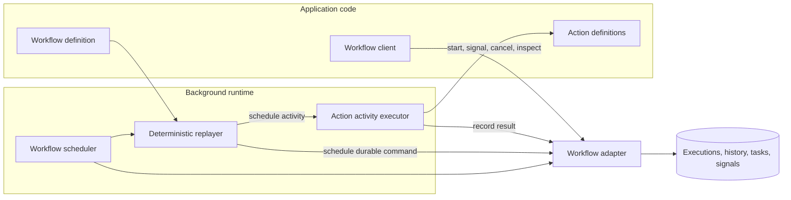
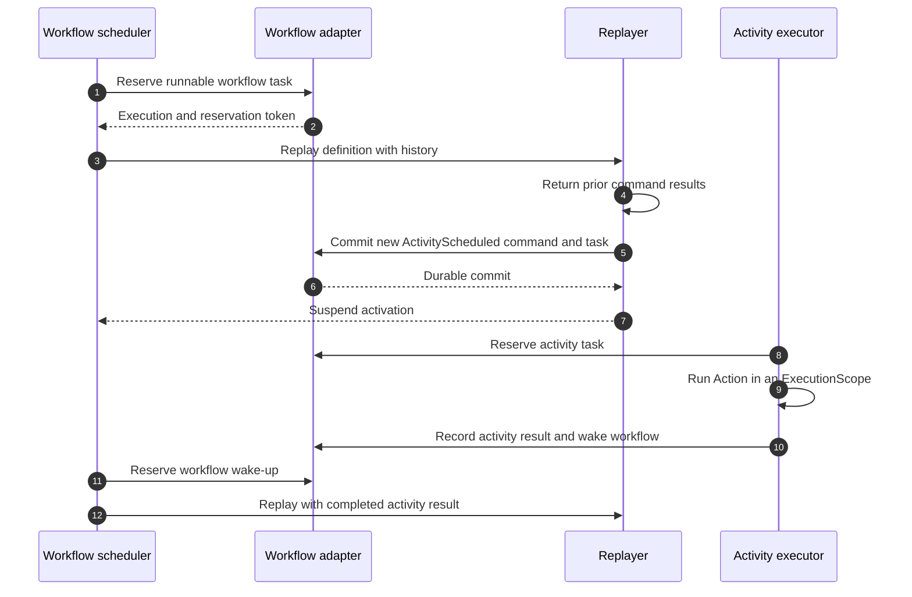
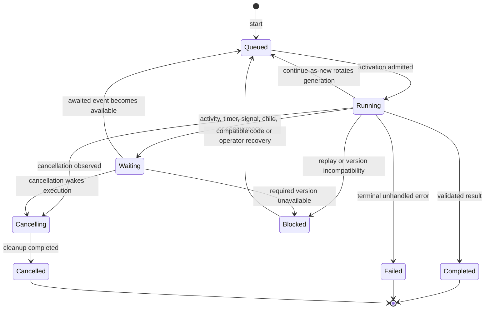
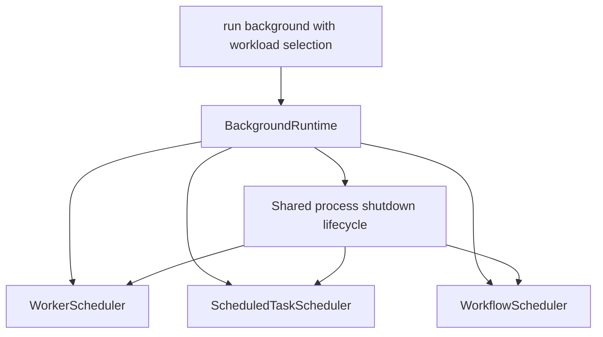
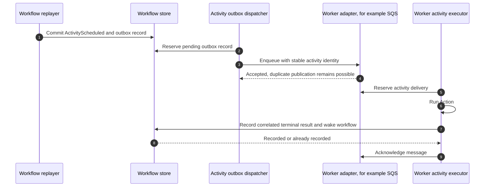

# Durable workflows

[Documentation](../README.md) · [Implementation index](./README.md)

> Design and implementation plan. Use the [workflow usage guide](../usage/workflows.md) for application recipes and the [implementation reference](./workflows.md) for current execution contracts.

This document specifies the durable-workflow library and tracks its remaining implementation plan. It describes the programming model, execution guarantees, persistence model, integration with the rest of Kestrel, and future operational features. Application recipes for the implemented API live in the [workflow usage guide](../usage/workflows.md).

## Goals

The library should let an application express long-running, failure-resistant processes as ordinary TypeScript code while keeping infrastructure concerns explicit at durable boundaries.

The main goals are:

- define workflows through a catalog-friendly `defineWorkflow()` abstraction;
- write control flow with ordinary TypeScript conditions, loops, functions, `try`/`catch`, and eventually standard promise combinators;
- recover automatically after process or database interruptions;
- run Actions and child workflows sequentially or concurrently;
- wait durably for timers and external signals without retaining a process slot;
- make nondeterministic values and external side effects explicit;
- support retries, cancellation, timeouts, and compensating transactions;
- evolve workflow code without breaking executions started by an older code revision;
- expose enough durable history for replay diagnostics, Studio inspection, and an execution-specific diagram;
- remain an embedded Kestrel library backed by application infrastructure rather than become a separate distributed platform.

## Non-goals

The first implementation will not try to provide:

- generic exactly-once execution against external systems;
- a complete static state-machine definition inferred from arbitrary TypeScript code;
- a remote multi-language workflow service;
- migration of a running JavaScript stack frame or process memory;
- transparent durability for arbitrary promises, I/O, timers, randomness, or mutable module state;
- distributed transactions spanning unrelated systems.

## Recommended model

The workflow handler is deterministic orchestration code. Every operation that can suspend, observe a variable external value, or cause an external effect goes through the workflow context. The runtime persists the operation and its result, unloads the handler when it is waiting, and later replays the handler from the beginning with the persisted results.

Actions are the natural application-level activity abstraction. A workflow schedules an Action as durable work instead of resolving Action dependencies or performing I/O directly. Timers, signals, child workflows, captured nondeterminism, and cancellation checks are other durable operations owned by the workflow library.



The journal and the workflow task store are the source of truth. A queue can help execute activities, but queue acknowledgement alone cannot represent workflow progress.

## Definitions and catalog integration

The application catalog gains a `workflows` category with the same hierarchy and provenance behavior as Actions, Workers, and ScheduledTasks. A workflow name is unique in the consolidated catalog. Different behavior versions do not create duplicate catalog entries.

Signals are reusable typed definitions because their names and schemas form a public interaction contract:

```ts
export const managerApprovalSignal = defineWorkflowSignal({
  name: "order.manager-approval",
  payload: z.object({
    approved: z.boolean(),
    reviewerId: z.string(),
  }),
});

export const fulfillOrderWorkflow = defineWorkflow({
  name: "order.fulfill",
  description: "Reserve, approve, charge, and arrange delivery for an order.",
  version: {
    current: 2,
    supportedFrom: 1,
  },
  input: fulfillOrderInput,
  output: fulfillOrderOutput,
  signals: [managerApprovalSignal],
  concurrency: {
    key: ({ orderId }) => orderId,
    limit: 1,
    conflict: "enqueue",
  },
  handler: async (input, workflow) => {
    const reservation = await workflow.run(reserveStockAction, input);

    try {
      // Existing version-one executions skip the check introduced in version two.
      if (workflow.version >= 2) {
        await workflow.run(checkFraudAction, {
          orderId: input.orderId,
        });
      }

      const approval = await workflow.waitForSignal(
        managerApprovalSignal,
        { timeout: { hours: 48 } },
      );

      if (!approval.approved) {
        throw new OrderRejectedError();
      }

      await workflow.sleep(
        { hours: 5 },
        { label: "Payment delay" },
      );

      const payment = await workflow.run(capturePaymentAction, {
        orderId: input.orderId,
        reservationId: reservation.id,
      });

      const delivery = await workflow.runChild(
        arrangeDeliveryWorkflow,
        { orderId: input.orderId },
      );

      return { payment, delivery };
    } catch (error) {
      await workflow.run(releaseStockAction, {
        reservationId: reservation.id,
      });

      throw error;
    }
  },
});
```

The catalog declaration remains singular:

```ts
export const orderCatalog = defineCatalog({
  order: {
    actions: {
      reserveStock: reserveStockAction,
      releaseStock: releaseStockAction,
    },
    workflows: {
      fulfill: fulfillOrderWorkflow,
    },
  },
});
```

### Input and output

The input schema validates and serializes the immutable value stored when an execution starts.

The output schema is optional. It is useful when a caller waits for the result, when a parent workflow calls the workflow as a child, and when Studio or generated clients inspect a completed execution. The runtime validates the handler return value before persisting a successful completion, and the schema preserves the result type through `WorkflowHandle.result()` and `runChild()`.

A notification or fire-and-forget workflow can omit `output`; its successful result is then empty and callers can only wait for completion. Persisted inputs and outputs must use the library's supported serialization format and respect configured size limits.

```ts
const handle = await workflowClient.start(
  fulfillOrderWorkflow,
  { orderId: "order-123" },
  { executionId: "fulfill-order-123" },
);

const result = await handle.result();
```

The optional caller-provided execution ID is an idempotency key for starting a workflow. Starting the same definition again with the same ID returns the existing handle after verifying that the definition and input are compatible.

`WorkflowClient.startMany()` accepts a heterogeneous ordered list and returns a correspondingly typed handle tuple. The client validates and serializes the complete list before storage, and the adapter applies it atomically: an incompatible idempotency key or keyed-concurrency rejection leaves no execution from that batch behind. Compatible duplicate IDs and `return-existing` preserve their ordinary idempotent attachment semantics. The client bounds batches to 100 requests by default through configurable `maxStartBatchSize`.

The PostgreSQL start contract has a fixed four-statement cost for any non-empty bounded batch: transaction begin, sorted acquisition of all execution and keyed-concurrency advisory locks, one data-modifying CTE for existing-execution checks, ordered concurrency decisions, execution insertion, and initial task insertion, then commit. Lock acquisition remains a distinct statement so the decision reads a fresh `READ COMMITTED` snapshot after contenders commit. This turns ten independent four-statement starts into one four-statement atomic start without moving concurrency decisions into the client.

PostgreSQL query consolidation remains an incremental performance track rather than a change to workflow semantics. The next high-value batches are task lease extension and task release, followed by external Worker activity completion and signal delivery. Generic activation commits still cover multi-command replay, captures, signals, children, parent propagation, blocked outcomes, cancellation cleanup, and keyed permit release; bounded CTE paths should progressively cover the common subsets while the generic transaction remains the reference behavior. Continue-as-new, operator controls, recursive cancellation or termination, and two-step operational history reads are lower-frequency candidates. The detailed current shapes and intended evolutions are tracked in [the workflow implementation reference](./workflows.md#remaining-postgresql-query-optimizations).

### Durable command identity

Ordinary operations do not require a separate string ID when they already refer to a stable descriptive definition:

- an Action call uses the Action name;
- a child call uses the child workflow name;
- a signal wait uses the signal name;
- a timer uses its command kind and durable position.

The runtime addresses a command by its deterministic position in the execution history and verifies its kind and target definition. Two calls to the same Action are distinguished by their positions. Reordering, inserting, or removing durable commands on an existing execution is therefore a breaking workflow change and must use execution versioning or a patch marker.

Local variable names cannot provide runtime identity because JavaScript does not expose them reliably, build tools can rename them, and different branches may reuse them. An optional display `label` can make timers or repeated calls clearer in Studio, but it does not participate in replay identity. The runtime derives an activity idempotency key from the execution ID, run generation, and durable command position.

An explicit stable command key may be considered later for advanced generated or dynamically reordered workflows, but it should not burden ordinary application code.

## Execution and replay

One workflow execution consists of several short activations. An activation starts when the workflow is created or when an awaited activity, timer, signal, child, or cancellation becomes available.

During an activation, the replayer:

1. loads the immutable input, pinned execution version, and ordered history;
2. invokes the handler from the beginning in a workflow execution scope;
3. returns recorded values for commands already completed;
4. compares emitted commands with the existing history;
5. atomically appends newly reached commands and schedules their work;
6. unloads the handler when it can no longer make progress;
7. records completion or a terminal failure when the handler settles.



The workflow context must reject or document unsafe behavior. Workflow code must not directly use application dependencies, database clients, network clients, `setTimeout`, environment-dependent branching, `Date.now()`, `Math.random()`, or arbitrary asynchronous work. Pure deterministic helpers are allowed.

Native `async` functions and promise scheduling require an implementation spike. The target API should support ordinary `Promise.all`, `Promise.allSettled`, and `Promise.race` when every input is a workflow-owned durable promise. If native promise semantics cannot be made reliably replay-safe without isolating workflow code, the first implementation may expose `workflow.all`, `workflow.allSettled`, and `workflow.race` while retaining standard TypeScript control flow elsewhere. This tradeoff must be decided before the public API is stabilized.

### Determinism failures

Replay compares every history command with the command emitted at the same durable position. A mismatch records a bounded diagnostic containing the execution ID, version, position, expected command, and emitted command. The execution moves to a `blocked` state rather than retrying indefinitely.

Determinism errors are operational or deployment errors, not ordinary activity failures. Studio and health diagnostics must distinguish them clearly.

## Guarantees and side effects

The workflow library can guarantee durable orchestration, but it cannot make every external side effect execute exactly once.

- A workflow command is recorded once logically in its execution history.
- A completed command returns its persisted result during replay and is not deliberately scheduled again.
- An Action activity is delivered at least once until a terminal result is recorded.
- A process can crash after an external effect succeeds but before its result is recorded, so the Action may run again.
- Actions that affect external systems must therefore be idempotent or pass the stable activity idempotency key to that system.
- Compensation Actions must also be idempotent.

A future PostgreSQL transaction activity may atomically commit an application mutation and the activity result when both use the same database and transaction boundary. That narrower guarantee must not be described as generic exactly-once execution.

### Captured nondeterminism

The context provides replay-safe time and identifiers. A more general API can capture a small serializable nondeterministic value once:

```ts
const requestId = await workflow.sideEffect(() => createUuid(), {
  label: "External request ID",
});
```

`sideEffect()` is a Temporal-style name for capturing a value, not permission to perform an irreversible side effect. Network calls, database writes, emails, and payments belong in Actions because a crash can occur between executing the callback and persisting its value.

Convenience APIs such as `workflow.now()` and `workflow.uuid()` should cover common cases and make the safe choice obvious.

## Durable primitives

### Action activities

`workflow.run(action, input, options)` schedules one Action invocation and returns its validated output. The activity runs in a normal application `ExecutionScope`, so Action dependencies, middleware, logs, observations, transactions, and errors behave consistently with direct Action execution.

Activity options include retry policy, start-to-close timeout, schedule-to-close timeout, cancellation behavior, and an optional display label. Retryable infrastructure failures and terminal application failures must be distinguishable. A later heartbeat API can support long-running Actions with progress and heartbeat timeouts.

Workflow orchestration code must not inject arbitrary application dependencies. Restricting I/O to Actions keeps replay behavior inspectable and prevents Kestrel code from accidentally running effects during replay.

### Durable timers

`workflow.sleep(duration)` records an absolute wake-up time based on replay-safe workflow time. The execution releases its activation and every scheduler slot while sleeping. Restarting any process does not move the deadline.

Timers also support timeout races, retry delays, delayed child starts, and eventually sleep-until semantics.

### Signals

A signal definition has a stable name and payload schema. `WorkflowClient.signal()` validates and durably appends an external message to an execution. Signal delivery supports a caller-provided idempotency key.

Signals are buffered even if they arrive before the handler begins waiting. Each `waitForSignal()` consumes the next compatible buffered signal in durable order. Waiting can include a timeout implemented as a durable race with a timer. Signal authorization belongs to the controller or Action exposing the client operation, not to the workflow storage adapter.

The first implementation provides one-way signals. Request-response updates, read-only workflow queries executed against live workflow state, and signal stream policies are deferred until their consistency and authorization contracts are clear.

### Child workflows

`runChild()` starts a separately persisted execution and returns its typed result. Parent and child retain root and parent IDs for inspection and cancellation propagation.

Child options eventually include:

- stable caller-provided child execution ID;
- retry and timeout policies;
- parent-close behavior such as cancel, abandon, or wait;
- cancellation propagation;
- whether the child consumes the parent's keyed concurrency scope.

A child has its own history so large or independently managed processes do not inflate the parent's journal indefinitely.

### Errors and compensation

An exhausted activity retry policy throws a typed terminal activity error into workflow code. Child failure and cancellation are surfaced at their corresponding awaited commands. Ordinary `try`/`catch` is the fundamental compensation mechanism: compensation calls are durable Actions, so a crash during rollback replays completed compensations and resumes the remaining ones.

An optional Saga helper may later maintain and execute a reverse-order compensation stack, but it should remain a convenience over normal workflow code. It must register compensation before or atomically with the effect it compensates when an external system can complete the effect without returning its result.

Cancellation is cooperative. The runtime records the cancellation request, wakes the execution, reconstructs the durable command prefix that precedes that event, and throws a typed cancellation error from the operation that was pending when cancellation arrived. Anchoring delivery to the cancellation event prevents later compensation commands from moving that boundary and prevents unconsumed pre-cancellation history from being mistaken for nondeterminism. Pending task rows are removed atomically and unpublished Worker activity outbox entries become ineligible for reservation, while immutable scheduled-command history remains available for replay and audit. Operational projections therefore classify incomplete commands before the cancellation event as cancelled rather than active waits, while later compensation commands retain their actual state. This lets `catch` or `finally` blocks perform cleanup. A separate force-terminate operation stops execution without compensation, removes pending local work, and adds no workflow history event because replay does not run. Studio therefore derives terminated incomplete commands and the absence of active waits from the terminal execution status while preserving immutable scheduling history for audit.

## Concurrency

Concurrency has three distinct meanings and the API and Studio must not conflate them.

### Concurrency inside one execution

One handler can schedule independent activities or child workflows before awaiting them together. Sequential `await` calls enforce order. `all` waits for all results, `allSettled` keeps each outcome, and `race` records which durable operation won so replay chooses the same winner.

Completion order is durable history. Pending operations may continue or be cancelled according to the combinator and explicit cancellation scope.

### Concurrency between executions of one definition

A definition-level limit controls how many different executions of the same workflow may actively perform work at once. For example, an import workflow may allow only ten active executions even if thousands are queued.

This limit applies to active activations or activities, not to the total number of open executions. Executions sleeping for five hours or waiting for human approval do not retain capacity. A separate limit may be required for child or activity fan-out because one active execution can schedule substantial parallel work.

Definition-level flow control protects application resources globally or per deployment group. It is different from keyed concurrency because every execution competes for the same shared capacity.

### Concurrency by business key

Keyed concurrency serializes or limits executions that affect the same business resource while allowing unrelated resources to proceed in parallel. For example, two workflows for order `A` can be serialized while workflows for orders `B` and `C` run concurrently.

The definition derives a deterministic key from validated input before the execution starts:

```ts
concurrency: {
  key: ({ orderId }) => orderId,
  limit: 1,
  conflict: "enqueue",
}
```

Initial conflict policies should be:

- `enqueue`: retain the new execution and admit it when prior executions for the key release capacity;
- `reject`: refuse to create a conflicting execution;
- `return-existing`: return the current compatible execution instead of creating another one.

`cancel-previous` may be added after cancellation and compensation semantics are mature. Keyed concurrency is not the same as start idempotency: two requests with the same execution ID represent one execution, while two different execution IDs may be distinct work that happens to target the same business key.

Whether a waiting execution retains its keyed permit must be configurable. Releasing it improves throughput but permits another execution for the same resource to change state during a human wait. Retaining it preserves strict serialization but can block the key for days. The safe default should be to retain the logical keyed permit while releasing compute capacity; applications can explicitly select an active-work-only scope when interleaving is acceptable.

## Persistence model

The PostgreSQL implementation owns a dedicated `workflows` schema. The exact normalization can evolve during implementation, but the logical records are:

| Record | Responsibility |
| --- | --- |
| Execution | Definition name, pinned version, input, status, result or failure, parent/root IDs, concurrency key, timestamps, and history generation. |
| History event | Immutable ordered command, completion, signal, cancellation, patch, and terminal events. |
| History archive | Immutable input, pinned version, and event snapshot for a generation rotated by continue-as-new. |
| Runnable task | Available workflow activations and Action activities with kind, lease, reservation token, attempt, and optional deadline. |
| Signal inbox | Validated external signals, idempotency keys, arrival order, and consumption position. |
| Concurrency state | Durable definition and keyed permits when these cannot be derived efficiently from executions. |

The adapter must atomically append decisions and create corresponding runnable tasks. It must also atomically record an activity result and create a deduplicated workflow wake-up. These operations cannot be a non-transactional pair of a history write and `WorkerClient.enqueue()`.

Every reserved task uses a generation-specific token. Completion, retry, release, and lease extension match both task ID and token so an expired executor cannot mutate a newer reservation.

The first implementation should use PostgreSQL and memory adapters in separate adapter directories with their own tests and public exports, following the Kestrel convention.

### Execution lifecycle



`Running` describes one short in-process activation. An open execution normally spends most of its lifetime queued or waiting.

## Workflow evolution

Workflow evolution must preserve the sequence of durable commands already stored in every open execution.

### Pinned execution version and handler branches

The initial strategy uses one catalog definition and one handler containing temporary version branches. The definition declares its current version and oldest supported execution version:

```ts
version: {
  current: 2,
  supportedFrom: 1,
},
handler: async (input, workflow) => {
  await workflow.run(reserveStockAction, input);

  if (workflow.version >= 2) {
    await workflow.run(checkFraudAction, input);
  }

  await workflow.run(capturePaymentAction, input);
},
```

Starting an execution persists version `2`. An existing version-one execution replays the same handler with `workflow.version === 1` and therefore follows its original command sequence. Both versions coexist through one catalog entry, and no duplicate workflow name is registered.

Compatible changes that do not alter durable command kind, target, or order do not require a version bump. A breaking change increments `current` and keeps the old branch until no open execution needs it. After version one drains, the application removes its branch and changes `supportedFrom` to `2`.

The runtime only claims executions inside the declared supported range. An older execution becomes `blocked` with an explicit missing-version diagnostic instead of being replayed with incompatible code. The adapter reports compact counts by definition, version, and status. Workflow startup rejects a deployment with active unsupported versions before polling begins, while `WorkflowVersionOperations.recover()` can requeue a version-blocked execution after compatible code returns without modifying its pinned state.

This strategy is the first implementation because it is explicit, works naturally with the singular catalog, and does not require retaining separate deployed workflow bundles. Its cost is that long-lived branches remain in application code until their executions complete or are migrated, cancelled, or terminated.

### Patch markers

Patch markers solve a narrower problem: insert or remove a local command in running workflows according to whether each execution had already crossed that point before the deployment.

Suppose the old code is:

```ts
await workflow.run(reserveStockAction, input);
await workflow.run(capturePaymentAction, input);
```

A compatible patch can temporarily become:

```ts
await workflow.run(reserveStockAction, input);

if (workflow.patch("add-fraud-check")) {
  await workflow.run(checkFraudAction, input);
}

await workflow.run(capturePaymentAction, input);
```

For an old execution whose history already contains `capturePaymentAction` at that position, `patch()` returns `false` during replay so the old command sequence still matches. For a new execution, or an execution that had not yet crossed the insertion point, the runtime durably records a patch marker and returns `true`. Every later replay returns the decision stored in that execution's history.

Patch removal requires a staged lifecycle so histories containing and lacking the marker both remain replayable. The retained design has three deployment states:

1. `workflow.patch(id)` introduces an active marker. Executions already past the insertion infer `false`; executions that can take the new path durably record `true`.
2. After diagnostics and replay fixtures show that no open execution still needs the inferred old path, `workflow.deprecatePatch(id)` stops creating markers for new generations, treats the patch as enabled, and still consumes existing marker events during replay.
3. After diagnostics show that no replayable current or archived generation contains the marker, the guarded call is replaced by unconditional code and the deprecation call is removed.

Patch identifiers must be unique within a definition and must never be reused. Runtime implementation remains deferred until the inventory can count marker-bearing histories and archive retention defines how long they remain replayable. Version branches remain the implemented default and the fixture suite now proves both sides of those branches.

### Replay compatibility tests

The testing library replays captured or imported fixtures against the current definition through the production replayer and fails on the first command mismatch. Tests cover every supported execution version and both sides of retained version branches.

The adapter can export a sanitized, versioned JSON fixture containing execution identity, generation, pinned version, input, status, and history. Import validates the format before replay. A later deployment pipeline can replay a bounded sample of open histories before promotion; phase 5 provides the helper but does not prescribe one CI or release system.

## Scheduler and process integration

Workers, ScheduledTasks, and workflows have different persistence and transition contracts but share process concerns: polling, capacity, admission, pressure, leases, graceful shutdown, logging, and execution scopes.

The integration should happen in two layers:

1. A composite `BackgroundRuntime` can host any selected combination of the existing Worker scheduler, ScheduledTask scheduler, and new Workflow scheduler in one process without first rewriting them around one algorithm. Local development can avoid unnecessary operating-system processes, while a production deployment can isolate and scale each workload independently.
2. Reusable scheduling primitives can later move into a lower-level Kestrel library. Feature schedulers keep their storage-specific reservation and transition logic but share capacity gates, polling lifecycle, pressure admission, lease keepalive helpers, and shutdown coordination where semantics genuinely match.

`run background` accepts a repeatable workload selector whose values are `workers`, `scheduled-tasks`, and `workflows`. With no selector it runs every registered background workload. Dedicated commands remain supported and are equivalent to selecting one workload:

```sh
# Run every registered background workload in one process.
./do run background

# Run only workflow orchestration and embedded activities.
./do run background --workload workflows

# Share one process between workers and workflows.
./do run background --workload workers --workload workflows

# Keep a dedicated worker deployment.
./do run workers
```

`run scheduled-tasks` and `run workflows` provide the corresponding dedicated entry points. Selecting `workflows` starts the workflow scheduler and its embedded activity transport, but it does not implicitly start the Worker scheduler. When the application uses the Worker-backed activity transport, `workers` must be selected in the same background process or run in another deployment. Configuration used by `npm run dev` selects the desired local workload set rather than forcing all three schedulers to start. Unknown or unavailable workload names fail before polling begins.



The runtime constructs and starts only selected schedulers and coordinates one application shutdown after stopping them in reverse order. Capacity and pressure admission remain owned by each feature scheduler in phase 4. A future shared process-level budget can compose the same lower-level primitives when its cross-workload fairness semantics are defined; it must not silently change the existing per-feature limits.

The lower-level scheduling library must not import Workers, ScheduledTasks, workflows, application code, or application configuration. Each higher-level library adapts its workload to the shared primitives, preserving explicit and acyclic Kestrel dependency directions.

A common process is a deployment convenience, not a guarantee that all workload types use one database query or one queue. Production can still place CPU-intensive Actions, ordinary Workers, and workflow orchestration in separate workload groups.

### Relationship with Workers

The current Worker implementation is suitable inspiration and can execute workflow activities after its transport contract is extended, but it is not the workflow source of truth. Its current jobs have no durable typed result channel, workflow correlation, child relation, signal inbox, or atomic transaction with workflow history.

Workflow persistence and activity transport are separate adapter boundaries:

- `WorkflowAdapter` owns executions, history, signals, timers, wake-ups, and the durable dispatch outbox;
- `WorkflowActivityTransport` publishes activity requests and carries their terminal results back to the workflow runtime;
- the default embedded transport executes workflow-owned PostgreSQL tasks in the background runtime;
- a Worker-backed transport publishes activities through `WorkerClient`, allowing the Worker provider to use its own PostgreSQL, SQS, or another queue adapter independently of workflow storage.

This separation allows an application to keep workflow history in PostgreSQL while sending expensive or separately scaled activities to SQS. Activity transport can initially be configured as a provider-wide default and later be overridden by Action or workload group when different activities need different infrastructure.

An external queue cannot participate in the PostgreSQL transaction that appends `ActivityScheduled`. The workflow transaction therefore writes both the history command and a dispatch-outbox record. A dispatcher repeatedly publishes pending outbox records until the activity transport confirms acceptance. Publication is at least once and uses the stable activity idempotency key derived from the execution and command position.

The activity executor reports its validated result or bounded error through a correlated completion API. Recording completion and creating the workflow wake-up is idempotent, so duplicate SQS delivery, duplicate publication, a lost acknowledgement, or a stale executor cannot complete the command twice. The external message is acknowledged only after the workflow runtime accepts or has already recorded that terminal result.



The Worker contract must accept a caller-provided stable job identity and support correlated terminal results before it can implement this transport safely. Adapters that can deduplicate publication should do so, but an SQS adapter does not need to provide exactly-once enqueue or delivery. Duplicate execution remains possible, so end-to-end completion deduplication and Action idempotency remain workflow responsibilities rather than queue-specific promises.

No workflow handler should stay inside one Worker invocation while sleeping or waiting for a signal. Waiting must release the handler, lease, and compute slot.

## Observability and Studio

Every activation and Action activity integrates with the Kestrel execution context and observations. The workflow execution ID, run generation, command position, definition version, parent/root IDs, and replay state should be available as structured context without emitting duplicate replay logs.

Studio should eventually provide:

- definition and supported-version inventory;
- execution search by status, definition, version, business key, parent, and dates;
- current wait reason and next timer deadline;
- input, output, bounded errors, retries, and cancellation state;
- signal delivery and consumption history;
- parent-child navigation;
- pause, resume, cancel, force-terminate, retry, and fork controls with appropriate warnings;
- replay incompatibility diagnostics;
- an execution-specific graph or timeline derived from durable history.

Arbitrary code prevents a complete trustworthy static state-machine diagram. The history can, however, produce an exact diagram of the path followed by one execution, including parallel branches, timers, signals, children, failures, and compensations. Optional labels and definition metadata can improve that diagram without becoming execution truth.

## Testing model

The workflow testing package should provide:

- an in-memory adapter with deterministic task ordering;
- direct handler tests with mocked Action results and signals;
- replay compatibility tests from recorded histories;
- virtual time and time skipping for timers, retries, and signal timeouts;
- failure injection before and after every durable commit boundary;
- duplicate delivery and stale lease tests;
- concurrent scheduler tests with several runtime instances;
- version-one and version-two histories replayed against the same handler;
- deterministic parallel completion and race tests;
- cleanup of timers, listeners, scopes, and global state for Vitest `--no-isolate` compatibility.

The test API should make workflow code testable without starting a server or making HTTP requests.

## Implementation plan

### Phase 0: execution-model spike

Status: complete.

Before committing to the public API, implement a narrow isolated prototype with an in-memory journal:

- sequential Action-like durable commands;
- replay from the beginning with stored results;
- command-position, kind, and target matching;
- suspension on an unresolved durable promise;
- two operations scheduled before `Promise.all`;
- deterministic `Promise.race` completion;
- injected interruption between command persistence and result persistence;
- one old-version history replayed through a version branch.

The prototype lives under `src/packages/kestrel/src/workflows/replay` without being exported as a public workflow API. It confirms that native `Promise.all` and `Promise.race` can work when the runtime returns owned promises and resolves recorded results in durable completion order. It also validates positional command identity, atomic journal revision conflicts, duplicate completion handling, interruption before result persistence, and a shared handler branching on the pinned execution version.

The event-loop yield used to detect prototype quiescence is an internal experiment rather than a stable runtime contract. Production implementation still needs strict workflow-code restrictions and preferably lint checks because arbitrary I/O promises, native timers, and mutable external state cannot be made durable by this mechanism. Phase 3 resolves completed races by closing the workflow from the persisted completion winner and deleting pending loser tasks. A loser already executing can still perform an external effect before its stale completion is rejected, so race participants retain the same idempotency obligations as every other activity.

### Phase 1: definitions, catalog, and typed client

Status: complete.

- Add the `src/packages/kestrel/src/workflows` library with definition, signal, client, handle, errors, serialization, and public exports.
- Add workflow type guards and the singular `workflows` category to application catalogs and utilities.
- Support input and optional output schemas, current/supported versions, descriptions, examples, and typed signals.
- Implement idempotent start, status, result attachment, and signal APIs against a memory adapter.
- Define execution statuses and stable serialized error contracts.
- Add unit tests for definition validation, catalog hierarchy, duplicate names, schemas, and client typing.

The public foundation now lives under `src/packages/kestrel/src/workflows`. It includes typed workflow and signal definitions, catalog integration, `WorkflowClient` and `WorkflowHandle`, execution and signal contracts, stable error types, a strict JSON-compatible payload codec, and an isolated memory adapter. The codec is injectable so a later encrypted or external-payload representation does not alter the client API. The default codec rejects values such as `undefined`, `BigInt`, non-finite numbers, class instances, and cycles before they cross the adapter boundary.

The memory adapter deliberately stops at client-facing persistence seams: it queues starts, stores signals, exposes status, and lets tests or a future runtime settle executions. It does not execute handlers yet. The phase-zero replay prototype remains internal and is not exported as the production runtime contract.

### Phase 2: journal, replay, and PostgreSQL adapter

Status: complete.

- Add execution, history, runnable-task, signal-inbox, dispatch-outbox, and required concurrency tables under a `workflows` schema.
- Implement memory and PostgreSQL adapters in their own directories with atomic transitions and reservation tokens.
- Implement workflow activation reservation, lease renewal, release, recovery, and deduplicated wake-ups.
- Implement the deterministic replayer, mismatch diagnostics, pinned execution versions, and supported-version admission.
- Define the storage-independent `WorkflowActivityTransport` contract and use an embedded workflow-task implementation first.
- Integrate application execution scopes, logging, observations, and replay-safe instrumentation.
- Add failure-injection and multi-scheduler adapter tests before adding all high-level primitives.

The production journal now stores immutable scheduled-command, command-completion, and signal events behind optimistic execution revisions. Runnable workflow and embedded-activity tasks use generation-specific reservation tokens, renewable leases, stale-token rejection, expired-lease recovery, and a unique outstanding workflow wake-up per execution. If a signal advances the journal while an activation is replaying, the commit detects the revision conflict and releases the same deduplicated wake-up for a fresh replay.

The memory and PostgreSQL adapters implement the same atomic transition contract. PostgreSQL owns the `workflows` schema with executions, history, tasks, signals, and a dispatch outbox. The outbox is intentionally dormant while the embedded activity transport is selected; Worker-backed or external transports can publish it later without moving workflow truth into their queue. No concurrency-state table is required yet because definition and keyed admission begin in phase 4; its schema should be introduced with the finalized permit-retention contract rather than precommitting to an unused representation.

`WorkflowReplayer` is now the production replay engine, while the phase-zero runner remains an internal experiment. It matches command position, kind, target, and payload, restores recorded successes and errors in durable completion order, and turns incompatible histories or invalid suspension into a bounded `blocked` diagnostic. `WorkflowScheduler` provides bounded polling, lease keepalive, version admission, schema and payload validation, embedded activity execution, and an injected execution-scope boundary so the composing runtime can add scoped logging and observations without introducing a dependency from Workflows back to the application library. The scheduler is not yet exposed as a CLI workload; selectable process integration remains phase 4.

### Phase 3: core durable primitives

Status: complete.

- Execute Actions as durable activities with typed results, retries, deadlines, and stable idempotency keys.
- Add durable timers and virtual-time tests.
- Add typed buffered signals with delivery idempotency and timeout races.
- Add child workflows, result propagation, parent/root relationships, and cancellation propagation.
- Add durable parallel aggregation and race behavior based on the decision from phase 0.
- Add cooperative cancellation and normal `try`/`catch` compensation scenarios.
- Add history-size accounting and a safe upper bound before unbounded continuation is supported.

The public `WorkflowExecutionContext` now provides typed Action activities, durable sleeps, buffered signal waits with timeouts, child execution, captured side effects, replay-safe time, and replay-safe UUIDs. Action activities carry one stable execution-and-command idempotency key across retry attempts, distinguish retryable infrastructure failures from domain failures, enforce schedule-to-close and start-to-close deadlines, and cross an application-supplied Action execution boundary so dependency and middleware composition stays outside the Workflows library.

Native `Promise.all`, `Promise.allSettled`, and `Promise.race` operate on workflow-owned promises. Durable completion order selects the same race winner during every replay; terminal cleanup removes pending losers while accepting that already-running external work cannot be recalled. Timers persist absolute availability in the task adapter, while tests inject virtual clocks to skip sleep, retry, and signal-timeout delays.

Signals are stored before consumption, deduplicated by optional delivery key, consumed once in arrival order, and correlated to their command completion. Child executions store parent, parent-command, and root relationships; terminal results wake the parent, and cancellation walks the open descendant tree. Cancellation is delivered cooperatively at a durable boundary, allowing normal `try`/`catch` compensation Actions to complete durably before the cancellation is rethrown. A workflow cancelled before reaching a boundary is closed as cancelled rather than accidentally completing.

Both memory and PostgreSQL adapters implement the new command routing and atomic transitions. The scheduler blocks loaded histories beyond its configured maximum; phase 5 subsequently added continue-as-new so handlers can rotate before reaching that bound. The limit bounds further orchestration progress but does not replace future signal-ingress, retention, and payload controls. Application programming and runtime recipes live in the [workflow usage guide](../usage/workflows.md).

### Phase 4: flow control and background runtime

- [x] Implement definition-level and keyed concurrency with durable admission state.
- [x] Implement `enqueue`, `reject`, and `return-existing` conflict policies.
- [x] Define logical keyed-permit retention separately from compute-slot retention.
- [x] Add a composite `BackgroundRuntime`, repeatable workload selection, and `run background` CLI command while retaining `run workers`, `run scheduled-tasks`, and `run workflows`.
- [x] Extend Workers with caller-provided stable job identity and correlated activity completion, then add the Worker-backed workflow activity transport.
- [x] Verify the Worker-backed transport against PostgreSQL and a duplicate-delivery fixture while keeping the Worker adapter independent from workflow storage.
- [x] Extract the proven abort-aware delay and non-overlapping lease-heartbeat primitives into the lower-level `scheduling` library; retain feature-specific capacity and pressure logic until another scheduler shares its exact semantics.
- [x] Validate that the lower-level scheduling library imports no Workers, ScheduledTasks, workflows, application code, or application configuration.

Phase 4 is implemented. The composite runtime starts only explicitly selected workload types, Worker adapters are provider-configurable, and Worker-backed activities use a transactional workflow outbox plus correlated completion-before-ack ordering. Publication and delivery are still at least once, so Action idempotency remains required. Shared extraction deliberately stops at lifecycle behavior already common to several schedulers rather than imposing one storage or admission algorithm.

### Phase 5: version operations and testing tools

- [x] Add execution counts and diagnostics by definition version.
- [x] Add replay fixture import/export and compatibility test helpers.
- [x] Add deployment checks for unsupported active versions.
- [x] Add explicit operator recovery for version-blocked executions.
- [x] Design the patch-marker lifecycle after exercising version branches in production-like replay tests; retain implementation as a later evolution.
- [x] Add continue-as-new with archived generations before supporting indefinitely running loops.

Phase 5 is implemented. The same catalog definition can safely serve several pinned versions, startup detects unsupported active versions, recovery is restricted to compatible version-blocked executions, and regression fixtures exercise the production replay semantics. Continue-as-new keeps the logical execution identity while rotating replay state and archiving the previous generation atomically. Archive retention and compaction remain operational follow-ups.

### Phase 6: Studio and operational controls

- [x] Add definition and execution pages, status search, history timeline, and execution-specific graph.
- [x] Add signal, pause, resume, cancel, retry, and force-terminate controls with authorization-friendly server interfaces.
- [x] Add parent-child and execution-observation navigation.
- [x] Add metrics for starts, completions, failures, retries, blocked replays, waits, timer lag, queue age, and activity duration.
- [x] Document retention, payload limits, redaction, sensitive-data handling, and operational recovery.

Phase 6 is implemented. `WorkflowOperations` provides paginated storage-neutral queries and narrow commands that applications can place behind their own authorization and audit boundaries. Pause is orthogonal to execution status and stops future reservations without interrupting already owned work. Cooperative cancellation remains the compensation path, while force termination is immediate, terminal, cascading, and does not run handler code. Retry preserves the failed execution and starts a current-version execution from the original input with an explicit `retryOfExecutionId` link.

The Studio extension exposes deployed definitions, version counts, execution search, payload and bounded-error detail, generation archives, parent/child/retry navigation, signals, controls, correlated observations, a durable timeline, and a graph derived from the path actually executed. It does not claim to statically analyze arbitrary handler branches. The graph and related-execution queries are deliberately bounded; recursive tree expansion and virtualized very large histories can be added when operational data demonstrates the need.

Workflow execution scopes now publish replay metadata as structured context. The durable workflow execution ID remains the orchestration correlation, the durable task row keeps its own ID, and each reservation uses `<taskId>:<attempt>` as its generic application execution ID. Studio correlation queries group task-attempt observations through `workflow.executionId` while preserving distinct execution lifecycle pairs and logs for every attempt. Correlation pages default to collapsible application-execution groups with observations and logs shown as independently collapsible sections, diagnostic labels for workflow tasks, Activities, timers, commands, and attempts, and page-wide expansion controls for each artifact type; operators can switch back to a strictly chronological view to inspect parallel interleaving. Storage-neutral lifecycle and task instrumentation feeds observations or an application metrics sink without recording payloads. Starts, terminal transitions, blocked replays, waits, operator retries, task duration, activity retry delay, queue age, and timer lag are available as stable dimensions. Adapter retention automation, payload ingress quotas, encrypted or external payload storage, and arbitrary command fork/redrive remain deferred and are documented as explicit operational responsibilities.

## Deferred evolutions

The design intentionally leaves room for:

- patch-marker runtime support and patch inventory;
- a Saga convenience API;
- heartbeat and asynchronous completion tokens for very long activities;
- workflow queries and request-response updates;
- archive retention, snapshots, and history compaction;
- fork or redrive from a selected durable command;
- additional remote activity transports beyond the Worker-backed integration;
- per-tenant fairness, priority, rate limits, and activity queues;
- encrypted payload codecs and external payload storage;
- explicit stable command keys for generated workflows;
- static best-effort diagrams backed by optional descriptive metadata;
- deployment routing to separately retained workflow code bundles if handler branches become insufficient.

## Design influences

The model is influenced by the following systems while remaining scoped to an embedded Kestrel library:

- [Temporal Workflow definitions](https://docs.temporal.io/workflow-definition) for event history, deterministic replay, Activities, child workflows, signals, and version safety;
- [Azure Durable Task orchestrations](https://learn.microsoft.com/en-us/azure/durable-task/common/durable-task-orchestrations) for code-first orchestration, durable timers, external events, and event-sourced recovery;
- [DBOS workflows](https://docs.dbos.dev/typescript/tutorials/workflow-tutorial) for PostgreSQL-backed execution, durable steps, workflow IDs, and explicit reliability boundaries;
- [DBOS workflow upgrades](https://docs.dbos.dev/typescript/tutorials/upgrading-workflows) for version pinning and patch markers;
- [Restate workflows](https://docs.restate.dev/tour/workflows) for durable promises, concurrent tasks, cancellation, and code-first Sagas;
- [Inngest execution](https://www.inngest.com/docs/learn/how-functions-are-executed) for step memoization and the distinction between an open workflow and currently executing work.
